# dlink路由器命令执行漏洞利分析(CVE-2022-26258)-先知社区

> **来源**: https://xz.aliyun.com/news/18133  
> **文章ID**: 18133

---

## 官方漏洞描述

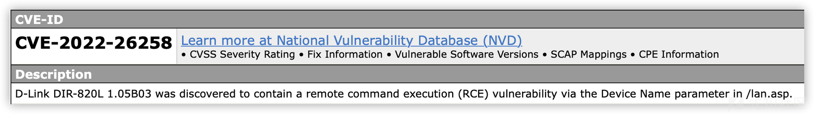

根据漏洞描述我们可以发现漏洞是在/lan.asp中存在一个Device Name导致的一个命令执行

## 漏洞分析：

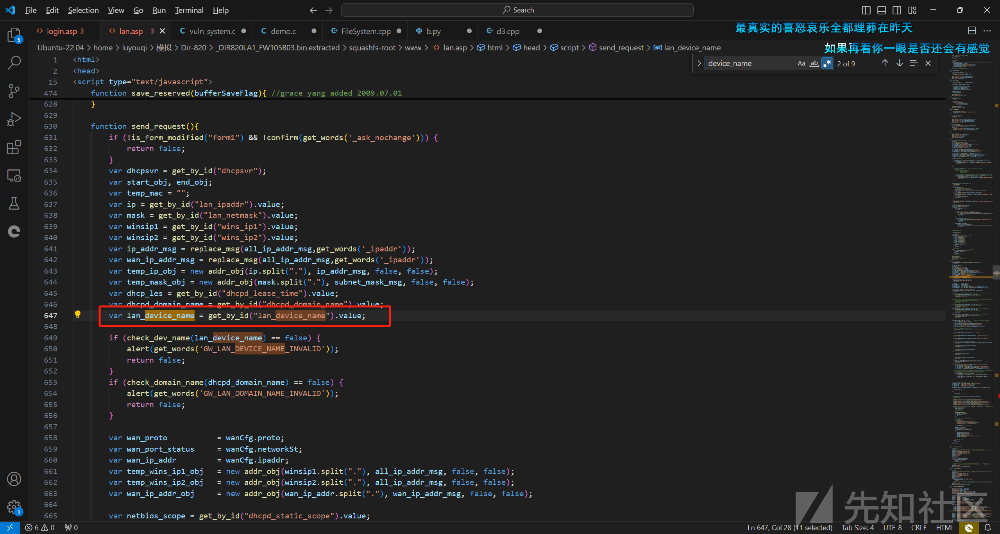

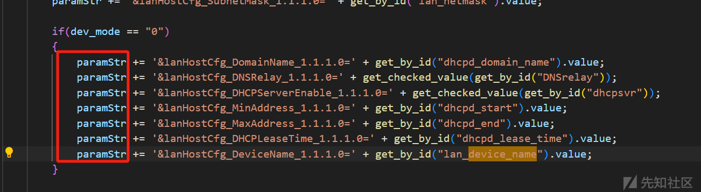

通过搜索发现 是把lan\_device\_name的值传入拼接paramStr

进一步审计发现 copyDataToDataModelFormat是返回paramStr的也就是说 最后是提交给了get\_set.ccp

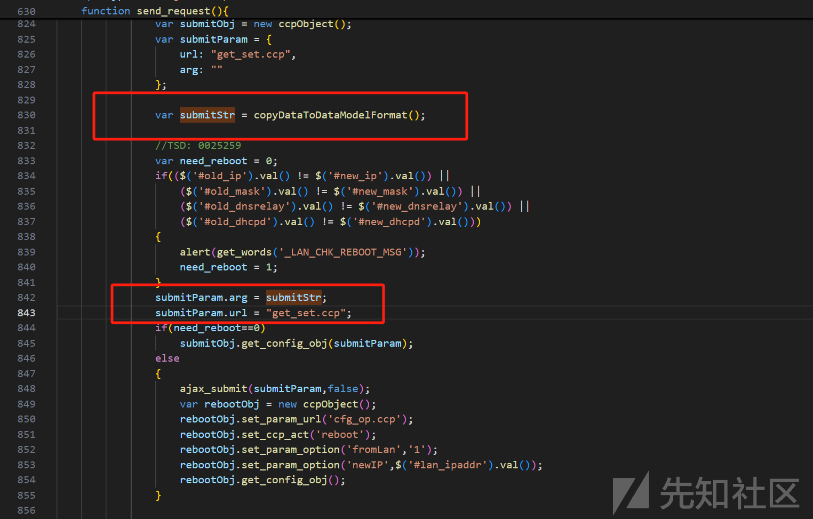

我们用grep -r "get\_set.cpp"是查不到相关信息的，既然没有“get\_set.ccp”文件，那么可能是这个URL会交给后端处理，处理好之后返回给用户结果。

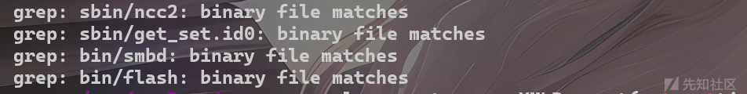

我们通过grep -r "get\_set"发现这四个二进制文件中有调用于是我们进一步更进 去分析这四个二进制文件

然后我们再去看一下开机自启文件包括哪些

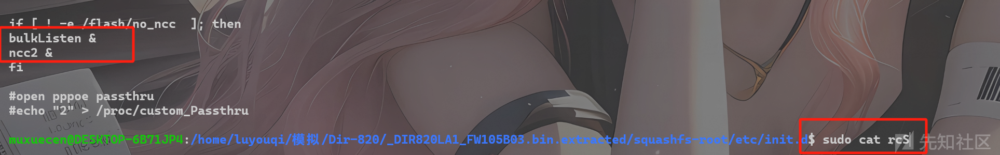

可以看到开机自启了ncc2和bulkListen

所以可见正确答案是ncc2的位置，因为有get\_set字符串和相对应的函数


先对ncc2进行一个简单的分析

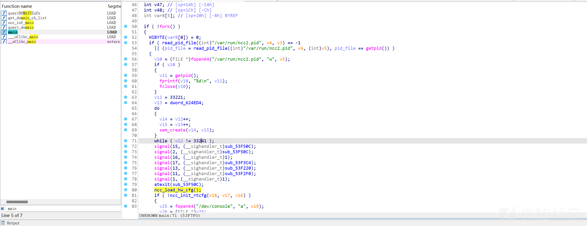

这里先是对fork子进程的一个检测来判断ncc2是否启动，然后对信号量进行一系列的设置然后设置信号处理函数 再通过ncc\_load\_hw\_cfg设置pin码(这里介绍一下 PIN码（Personal Identification Number, 个人识别号码）是一种为了安全目的而设计的数字代码，通常用于验证用户的身份) 在后面就是一些其他服务的配置部分了

然后进一步分析 敏感函数 由于是命令执行我们去审system函数的代码

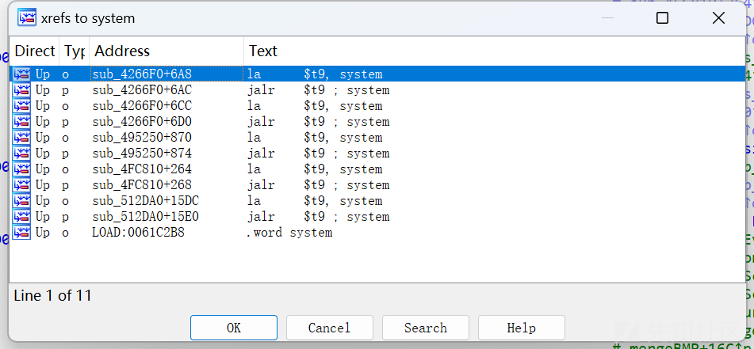

这些都不存在命令任意执行漏洞，我们发现还有一个\_system函数，想要快速的找到漏洞点就需要根据另一个线索点(Device Name)进行寻找。我们在搜索字符串时如果直接指定DeviceName还是比较难找到的，这里可以先简单搜索Device，然后搜索Name，寻找交叉点

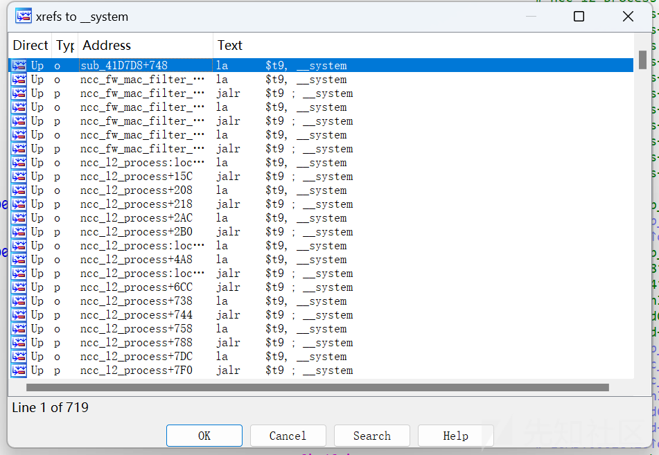

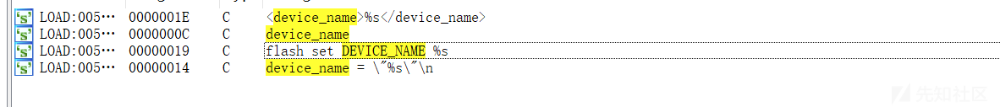

然后定位到sub\_4F6DFC函数

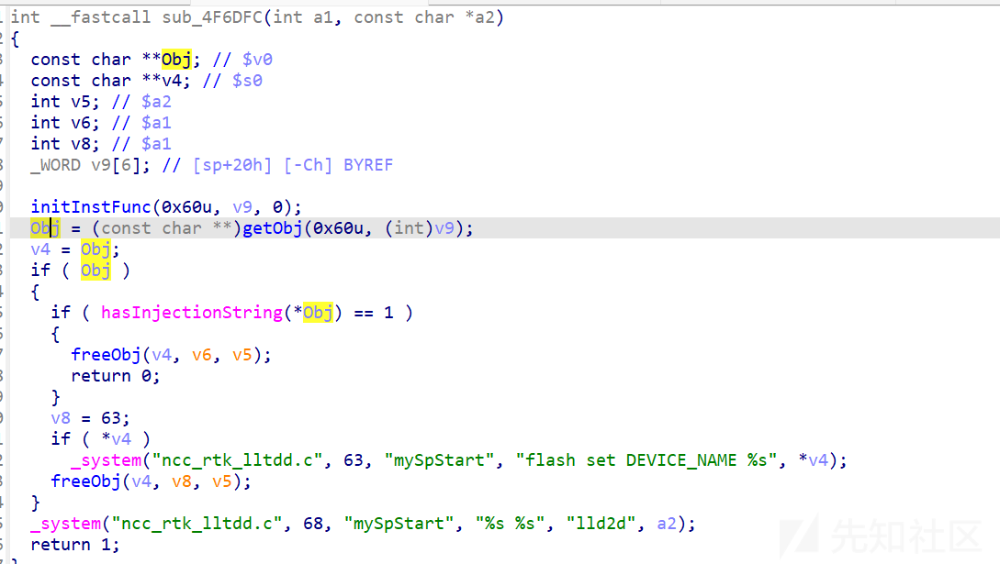

有两条路径一个利用下面的\_system另一个是利用上面的\_system

先分析第一条路径：

关键是看a2是否可控：

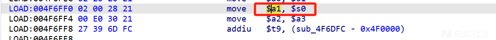

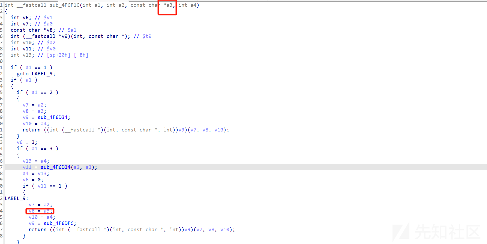

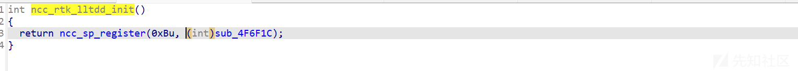

发现不可控 此路不通0..........0

第二条路径：

```
  Obj = (const char **)getObj(0x60u, (int)v9);
  v4 = Obj;
```

v4是`getObj`函数的返回值Obj，需要绕过`hasInjectionString`的判断才能到达命令注入点，现在需要找到`hasInjectionString` 函数在哪个文件中，同样使用`grep -r` 命令：

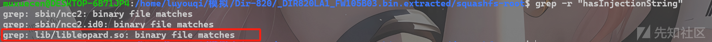

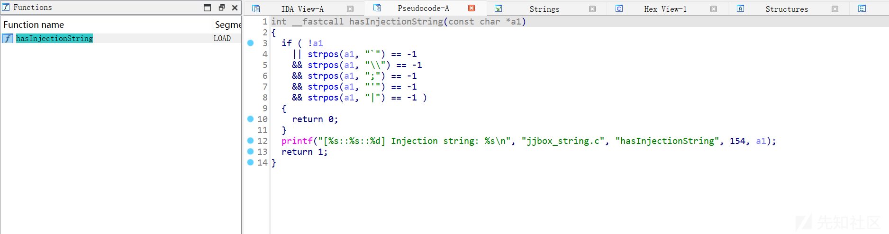

这里就是一些简单的过滤 没有过滤冒号和换行符，可以使用“\
”来绕过

这里就可以通过修改参数来进行命令执行了

## 漏洞复现

```
sudo ./run.sh -r DIR820L /home/luyouqi/模拟/Dir-820/DIR820LA1_FW105B03.bin
```

用FIRMAE进行环境直接模拟

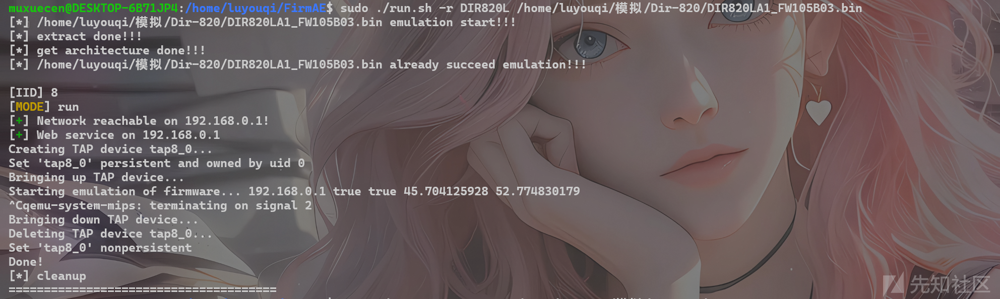

模拟好之后是这样 访问后

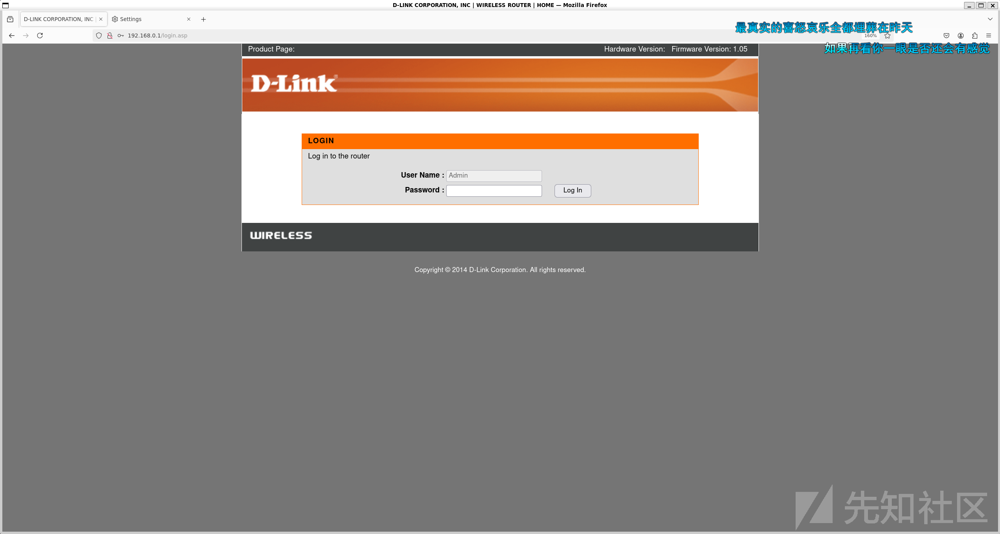

默认密码是空直接登录就可 必须要登录这是验证后的命令执行漏洞

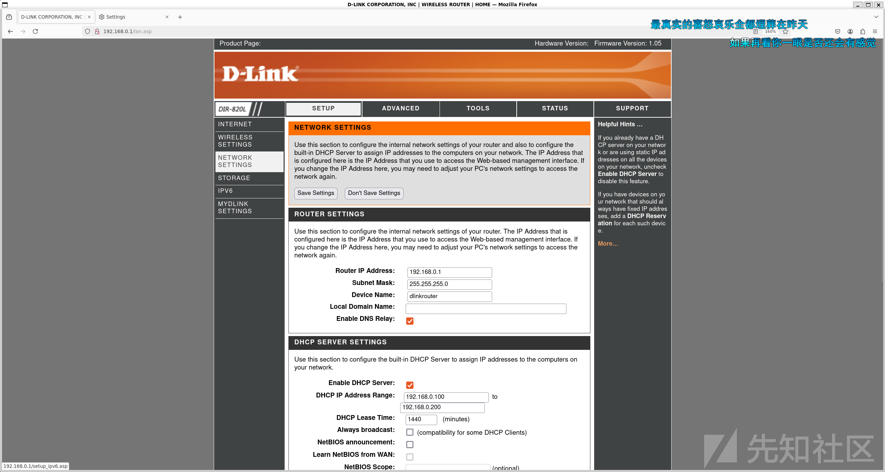

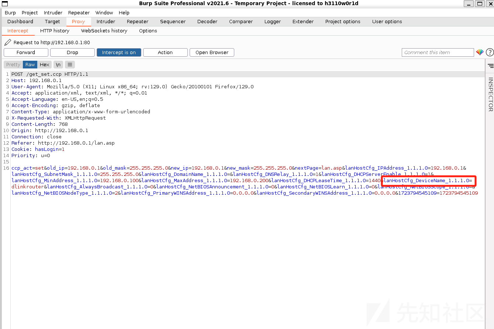

修改红框参数为 %0atelnetd -l /bin/sh%0a

这里要注意直接在原包上进行修改 而不是放入重放后修改再发送，原因是会认定发送了多次导致崩溃 无法执行，发送后在等十秒就可以了

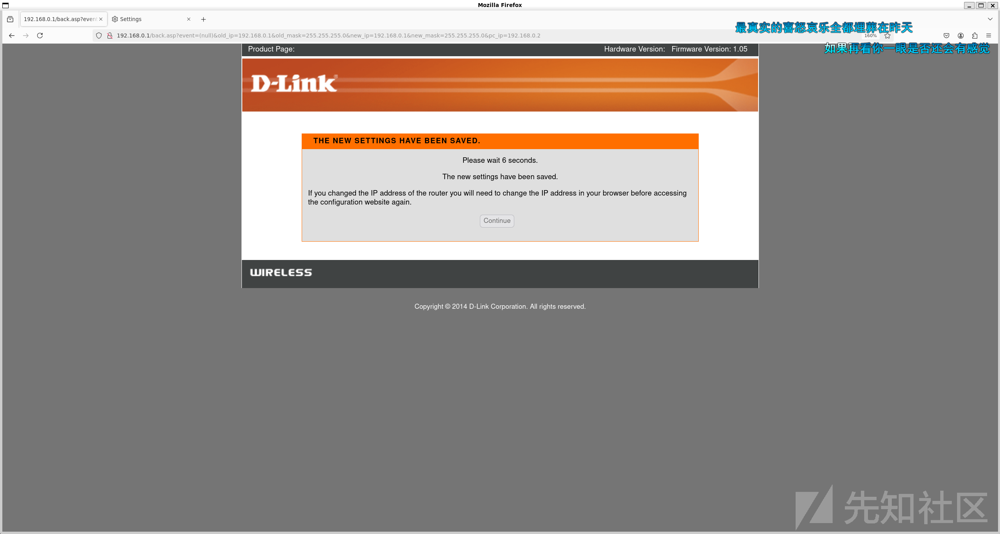

再用telnet进行连接 就可以成功拿到shell

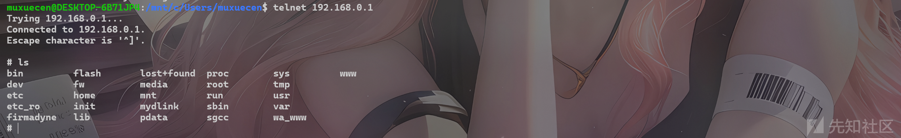

## 额外挖掘

额外漏洞查找，一般漏洞存在就意味着肯定不只一个 我们继续去查询可能涉及到http\_post且是需要执行的语句

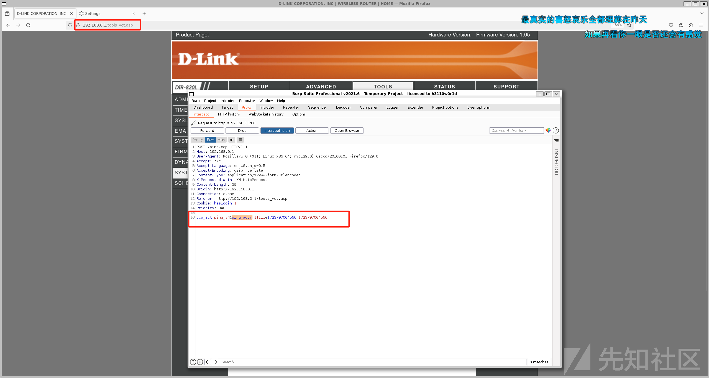

可以看到这个界面也是post指令传入 那我们就跟进tools\_vct.asp查看

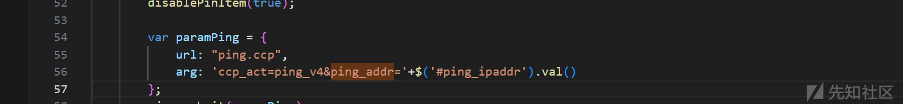

传入的是ping.cpp

通过前面的过程 查询发现可能还是在ncc2中 继续审代码发现

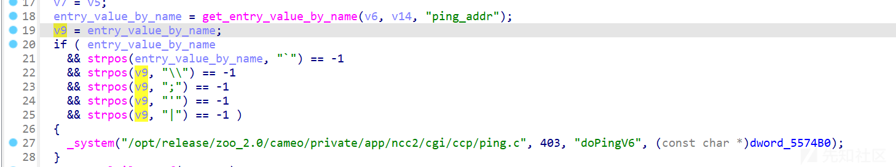

是不是非常熟悉基本和前面那个洞没区别了

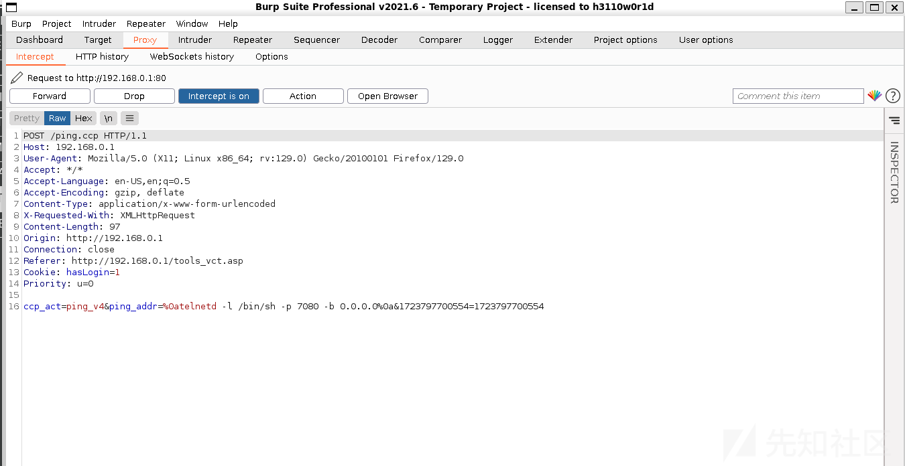

然后发送 之后连接看看能否拿到shell

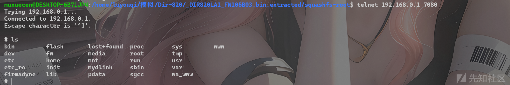
