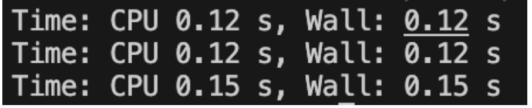
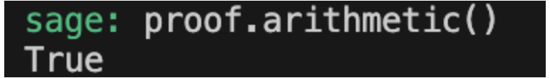
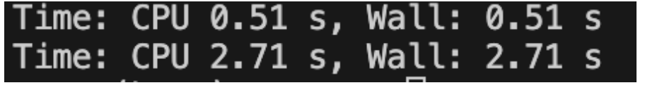

# 侧信道攻击在密码中一点应用-先知社区

> **来源**: https://xz.aliyun.com/news/18134  
> **文章ID**: 18134

---

## 侧信道攻击在密码中应用

侧信道攻击（Side-Channel Attack，简称 SCA）是一种不直接攻击密码算法本身数学结构，而是通过分析加密设备在执行加密运算时泄露出的物理信息来推测密钥的攻击方式。

这里讨论时间的侧信道攻击,以sage中一个is\_prime()函数为例，它就判断一个数是不是素数，返回true/flase，去看它是怎么实现的

```
def is_prime(n) -> bool:
    try:
        ret = n.is_prime()
    except (AttributeError, NotImplementedError):
        return ZZ(n).is_prime()

    R = n.parent()
    if R.is_field():
        # number fields redefine .is_prime(), see #32340
        from sage.rings.number_field.number_field_base import NumberField
        if R is QQ or not isinstance(R, NumberField):
            import warnings
            s = f'Testing primality in {R}, which is a field, ' \
                'hence the result will always be False. '
            if R is QQ:
                s += 'To test whether n is a prime integer, use ' \
                     'is_prime(ZZ(n)) or ZZ(n).is_prime(). '
            s += 'Using n.is_prime() instead will silence this warning.'
            warnings.warn(s)

    return ret

```

`ret = n.is_prime()`对于整数是调用自身方法，再次查看code

```
def is_prime(self, proof=None):
    if mpz_sgn(self.value) <= 0:
        return False

    cdef unsigned long u
    if mpz_fits_ulong_p(self.value):
        u = mpz_get_ui(self.value)
        if not (u & 1):
            return u == 2
        if u < 1000:
            return _small_primes_table[u >> 1]

        global pari_is_prime
        if pari_is_prime is None:
            try:
                from sage.libs.pari.convert_sage import pari_is_prime
            except ImportError:
                pass
        if pari_is_prime is not None:
            return pari_is_prime(self)

    if proof is None:
        from sage.structure.proof.proof import get_flag
        proof = get_flag(proof, "arithmetic")
    if proof:
        return self.__pari__().isprime()
    else:
        return self.__pari__().ispseudoprime()
```

`mpz_fits_ulong_p()`判断是否可以安全地转换为一个 无符号长整型（unsigned long），而不会发生溢出或精度丢失。返回true/flase  
这对小于2^64的数,给一个分支判断是否是不是素数，这里先判断奇偶，然后小于一千的奇数(用一个list保存对应的是不是素数)，大于1000的用`pari_is_prime()`判断是不是素数，这里对小于1000的素数判断时间会较小于大于1000的素数  
测试代码

```
time a=[is_prime(3) for i in range(1000000)]
time a=[is_prime(997) for i in range(1000000)]
time a=[is_prime(1009) for i in range(1000000)]
```

测试结果  


分析数如果大于2^64(即超过unsigned long的精度)，会判断proof.arithmetic()，一般默认true  


分析pari的素数测试代码

```
isprime(GEN x) { return BPSW_psp(x) && BPSW_isprime(x); }
```

```
long BPSW_psp(GEN N)
{
  pari_sp av;

  // 类型检查：必须是整数类型
  if (typ(N) != t_INT)
    pari_err_TYPE("BPSW_psp", N);

  // 非正数都不是素数
  if (signe(N) <= 0)
    return 0;

  // 单字整数（即 fit in one word）可直接调用 uisprime
  if (lgefint(N) == 3)
    return uisprime(uel(N,2));

  // 偶数肯定不是奇素数
  if (!mod2(N))
    return 0;

  // 针对 64 位机器：快速排除小质数因子（< 103）
#ifdef LONG_IS_64BIT
  // 如果与下列质数积不互素（说明有小因子）就返回 false
  if (!iu_coprime(N, 16294579238595022365UL) ||   // 包含 3~53
      !iu_coprime(N,  7145393598349078859UL))     // 包含 59~101
    return 0;
#else
  // 32 位机器下用 4 个小于 2^32 的质数积测试互素性
  if (!iu_coprime(N, 4127218095UL) ||             // 包含 3~37
      !iu_coprime(N, 3948078067UL) ||             // 29~53
      !iu_coprime(N, 1673450759UL) ||             // 61~79
      !iu_coprime(N, 4269855901UL))               // 59~101
    return 0;
#endif

  // 到这里为止，说明 N 无小质因子 < 103
  av = avma;

  // 继续执行 Miller–Rabin base-2 + Lucas 伪素数测试
  return gc_long(av, is2psp(N) && islucaspsp(N));
}

```

```
long BPSW_isprime(GEN N)
{
  pari_sp av;
  long t, e;
  GEN P;
  if (BPSW_isprime_small(N)) return 1;        // 快速判断小素数
  e = expi(N);                                 // 获取 bit 长度（log2(N)）
  if (e <= 90) return isprimePL(N);            // N 较小时，尝试部分 Lucas 证明
  av = avma;
  P = BPSW_try_PL(N);                          // 尝试为 N 构造部分 Lucas 证明
  if (!P)
    t = e < 768 ? isprimeAPRCL(N)              // 若 N < 2^768，则用 APR-CL 算法
                : isprimeECPP(N);              // 否则使用 ECPP 算法
  else
    t = (typ(P) == t_INT) ? 0                  // 如果构造失败（返回整数），视为失败
                          : PL_certify(N,P);   // 否则尝试验证 PL 证明
  return gc_long(av, t);                       // 回收内存并返回结果
}

```

查看代码可知isprime()函数要过两个判断，对于第一个判断，是否有小于103的小素因子，对于第二个判断进行正式复合的素性证明(可能耗时比较长)  
测试代码

```
prime=random_prime(2^105)
time a=[is_prime(101*prime) for i in range(1000000)]
time a=[is_prime(103*prime) for i in range(1000000)]
```



由此我们可以利用is\_prime()函数判断一个数有小于103的因子，或者小于1000(这个几乎不能利用)

以jqctf2025 onelinecrypto 为例  
题目描述

```
assert __import__('re').fullmatch(br'flag\{[!-z]{11}\}',flag:=os.getenvb(b'FLAG')) and [is_prime(int(flag.hex(),16)^^int(input('🌌 '))) for _ in range(7^7)]
```

这个题就是利用`is_prime()`函数判断一个数有小于103的因子,  
我们可以操控`flag^input_num`中`input_num`,这个以为这可以在高于flag的位任意构造,所以所以可以利用这个使得可以`(flag^input_num)`可以覆盖一个小素数（p<103,p!=2）的完全剩余系，每个进行`is_prime()`判断,时间短的有`(flag^input_num)%p==0`，`input_num`已知，则`flag=-input_num%p`(这里是因为他们input\_num只取了高于flag的位，有flag^input\_num=flag+input\_num)，遍历小p,crt,然后爆破得到结果。

虽然有小于103因子的数会快速出结果，但有时侯（还挺多）没有小于103因子的数也能快速出结果，则在每个剩余类进行爆破，只有正确（即`(flag+input_num)%p==0`）的没有长时间响应，由此一个个排除结果，然得到`flag=-input_num%p`

exp:

```
import os
from sage.all import crt, prod
import random
from Crypto.Util.number import *
from pwn import *
import time
import gmpy2

local = True
if local:
    io = process(["sage", "jqctf2025/review/onelinecrypto/server.sage"], env={"HOME": os.environ["HOME"], "FLAG": "flag{12345oo8901}"}, stderr=process.STDOUT)
else:
    io = remote("")

io.recvuntil("🌌 ".encode())
def server_response_time(input_num,times=1):
    st = time.time()
    io.sendlines([str(input_num).encode()] * times)
    io.recvuntil("🌌 ".encode() * times)
    et = time.time()
    return  et - st
def additional_num_flag(base):
    for i in range(2**10):
        num=base*i
        if(server_response_time(num)>(0.005)):
            return num  
    print("请加大范围")    
    exit()
def remove_num(num,prime_1,prime,times=50):
    for i in range(times):
        if(server_response_time(num+(i*prime)*prime_1)>0.001):
            return True
    return False

primes_le_103 = [3, 5, 7, 11, 13, 17, 19, 23, 29, 31, 37, 41, 43, 47, 53, 59, 61, 67, 71, 73, 79, 83, 89, 97, 101] #去掉二
primes_le_103_product=116431182179248680450031658440253681535
bit=17*8
base=2**(bit+1)
base_=base*(2**10)
primes_le_103_1=[base_*gmpy2.invert(base_,i)*(primes_le_103_product//i) for i in primes_le_103]
additional_num=additional_num_flag(base)

primes_mod=[]
for prime_num_i in range(len(primes_le_103)):
    remove_nums=[i for i in range(primes_le_103[prime_num_i])]
    
    round_num=0
    while(len(remove_nums)>1):
        for remove_num_i in remove_nums:
            if(remove_num(additional_num+(round_num*50*primes_le_103[prime_num_i]+remove_num_i)*primes_le_103_1[prime_num_i],primes_le_103_1[prime_num_i],primes_le_103[prime_num_i])):
                remove_nums.remove(remove_num_i)
        if(len(remove_nums)==1):
            break
        else:
            round_num+=1
           
    
    primes_mod.append((-(remove_nums[0]*primes_le_103_1[prime_num_i]+additional_num))%primes_le_103[prime_num_i])
    
x=crt(primes_mod,primes_le_103)
    
while x < 2**136:
    flag = long_to_bytes(x)
    if flag.startswith(b"flag{"):
        print(f"{flag = }")
        break
    x += primes_le_103_product

```
