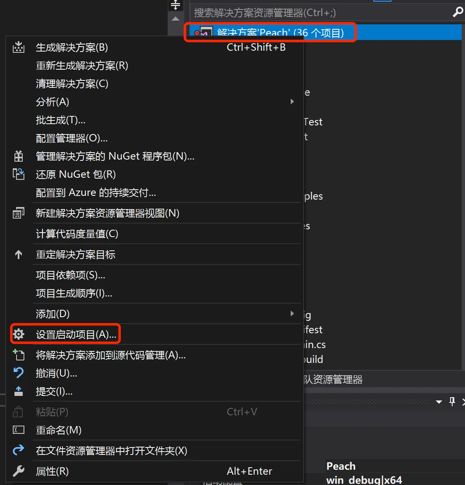
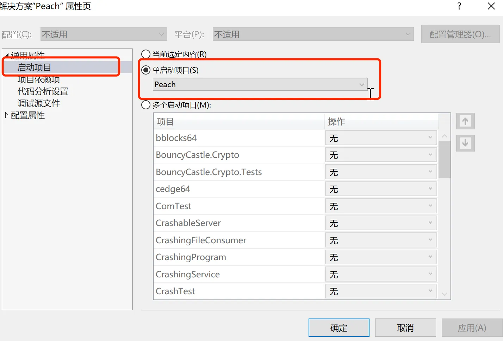
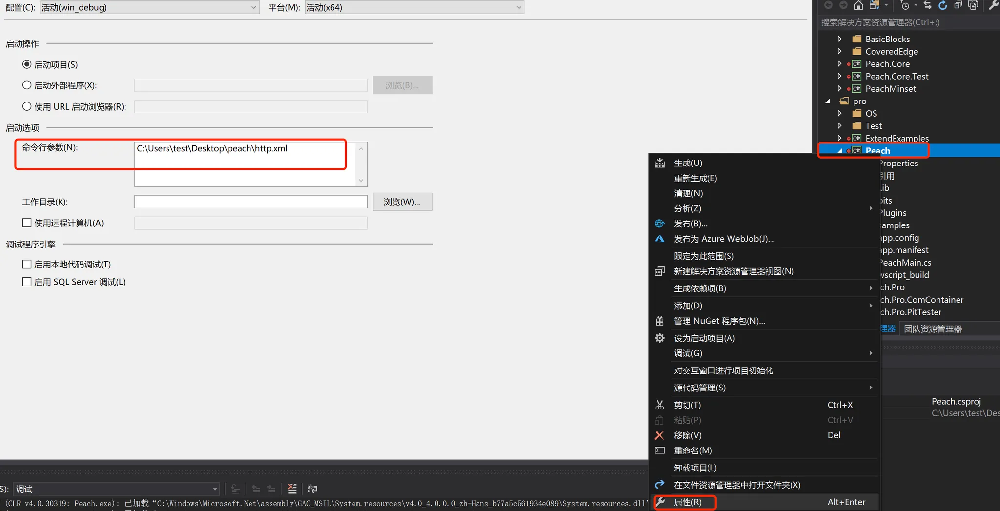
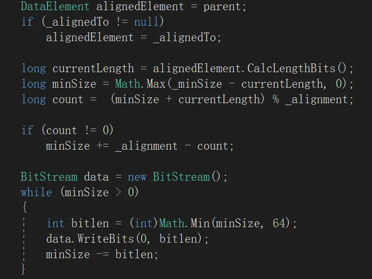
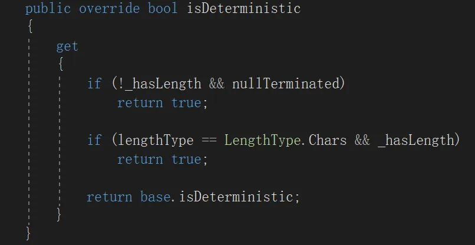
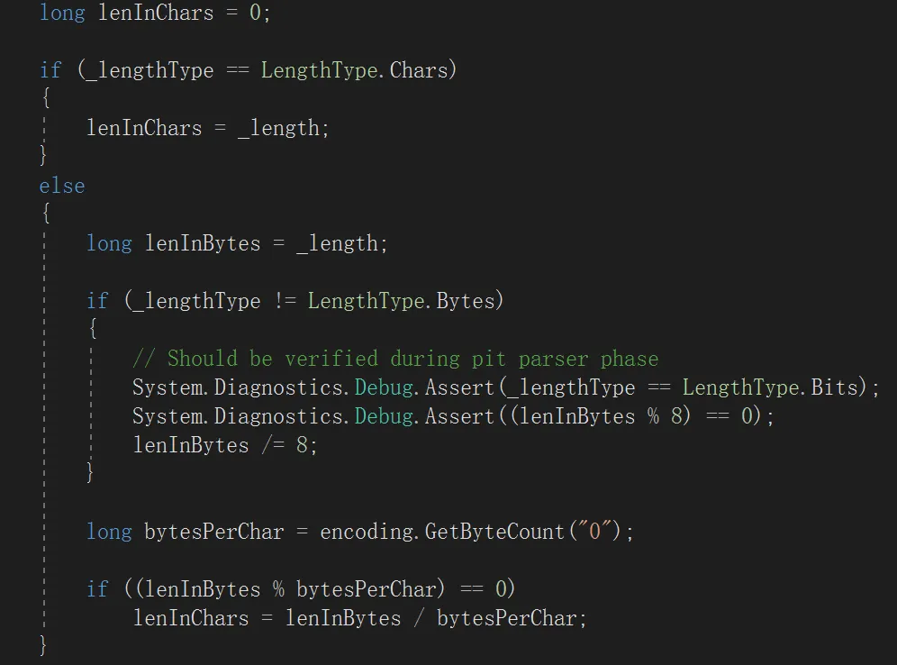
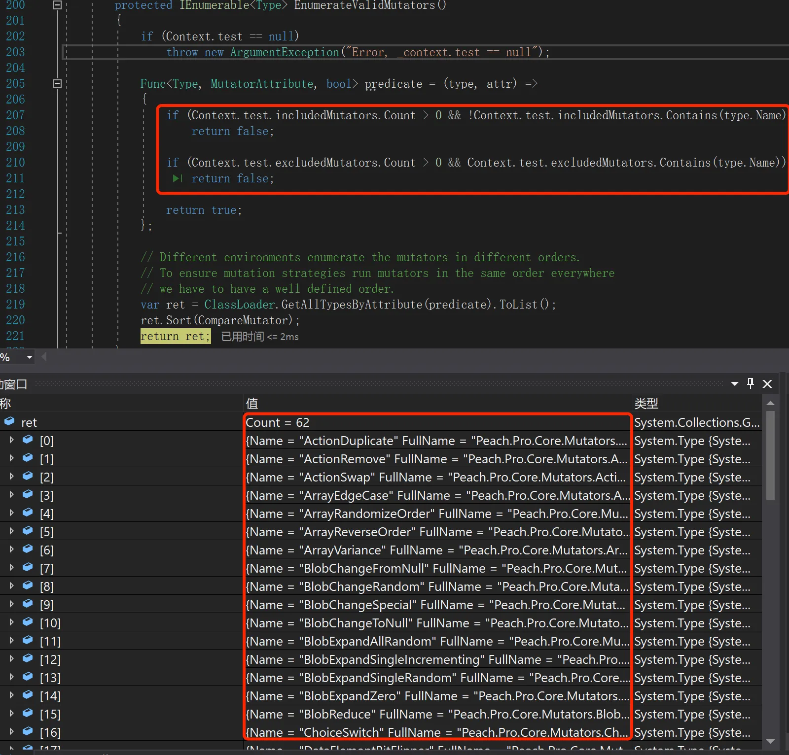
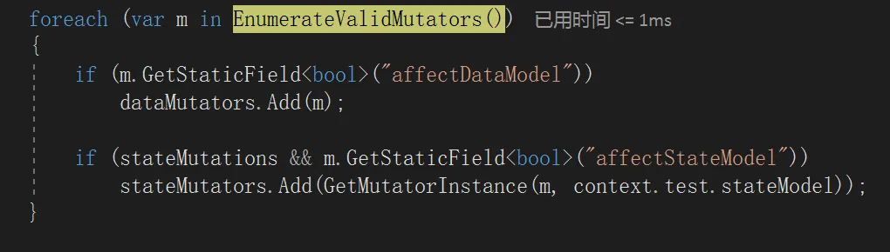
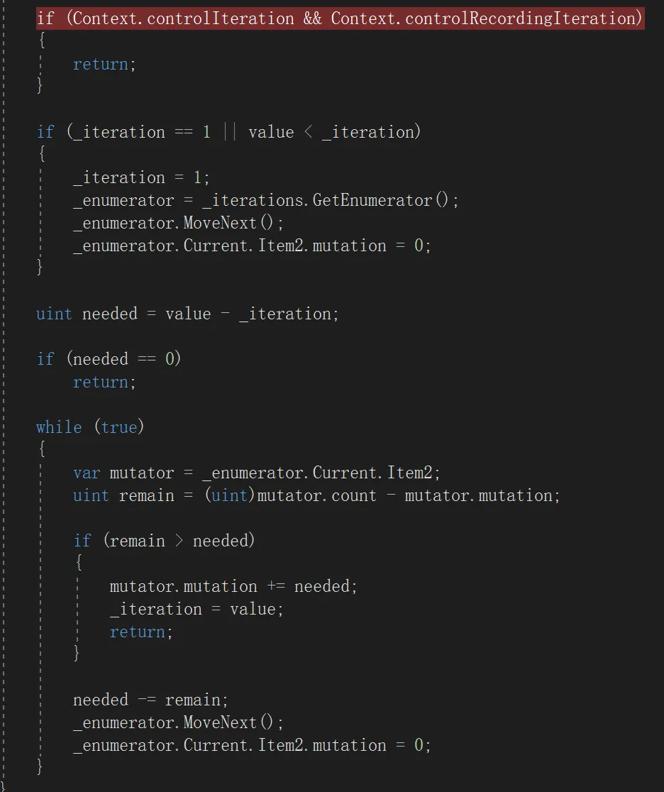

# 通过源码学习peach的使用-先知社区

> **来源**: https://xz.aliyun.com/news/18139  
> **文章ID**: 18139

---

# 前言

本文通过分析和调试源码来学习 peach 的使用。peach 网上能找到的版本为peach2，peach3，peach4。

## peach2

peach2 使用 python2 编写，下载地址为：<https://github.com/MozillaSecurity/peach>

python 虽然容易上手和理解，但是 python2 的环境比较难搭建。即使搭建成功之后，由于 peach2和 peach3 之后版本使用的命令参数差异较大，网上和官方文档中也找不到使用说明， 很难运行起来。

## peach3 和 peach4

peach3 和 peach4 使用 c# 编写

peach3 下载地址为：<https://gitlab.com/peachtech/peach-fuzzer-community>

peach4 下载地址为：<https://gitlab.com/gitlab-org/security-products/protocol-fuzzer-ce>

peach3 编译环境搭建过程中会提示 CL.exe 版本不支持，暂不知道如何解决

peach4 编译环境搭建网上有相关的资料可以参考，虽然也有一些坑，但最终还是能解决并成功搭建起来编译环境。本文主要分析 peach4 的源码。

# 环境搭建

环境搭建参考：[https://github.com/sfncat/peach/blob/main/doc/编译PeachPro 4.0(protocol-fuzzer-ce) for windows.md](https://github.com/sfncat/peach/blob/main/doc/%E7%BC%96%E8%AF%91PeachPro%204.0(protocol-fuzzer-ce)%20for%20windows.md)

按照教程安装遇到了一些问题，解决方法如下：

1. typescript 安装： typescript 需要安装 1.8 以下的版本，安装命令为 `npm install -g typescript@1.8`
2. Ruby2.7 安装：安装文章中提供的 Ruby2.7 时，msys2 and mingw development toolchain 对应版本的文件无法下载。可以通过安装 Ruby3.4 来解决此问题，但环境变量中指向 Ruby3.4/bin 目录应修改为 Ruby2.7/bin 目录
3. choco安装Java,xsltprocs,git：需要使用管理员权限打开命令行
4. doxygen 安装：文章提供的链接无法访问，去官网安装最新的版本就行
5. visual C++ Redistributable for Visual Studio 2012 Update 4 下载链接： <https://www.microsoft.com/en-us/download/details.aspx?id=30679>
6. `.paket.exe restore --verbose` 执行不成功可以考虑用手机热点

## IDE 使用

参考文章 <https://cartermgj.github.io/2018/02/02/peach-source/> ，使用命令 `waf.bat msvs2017` 生成 sln 文件。

按照文章中所描述的，将启动项目设为 peach





为 peach 项目的命令行参数指定 pit 文件，即可调试运行



# 基本元素

peach 运行需要指定一个 xml 格式的 pit 文件，此文件主要描述了 fuzz 过程中使用的协议格式、状态模型、测试目标。下面是一个最简单的 pit 文件，只包含必须要有的元素：

1. DataModel: 用于定义协议的格式
2. StateModel：用于定义协议的状态机，一般情况下只定义一个 State 和 一个 Action 就行
3. Test: 指定 peach 运行时使用的配置，如状态机、变异策略、日志文件路径、目标地址

```
<?xml version="1.0" encoding="utf-8"?>
<Peach xmlns="http://peachfuzzer.com/2012/Peach" xmlns:xsi="http://www.w3.org/2001/XMLSchema-instance"
    xsi:schemaLocation="http://peachfuzzer.com/2012/Peach ../peach.xsd">

    <DataModel name="datamodel1">
        <Block name="block1">
          <Number name="field1" size="8" value="01" valueType="hex" endian="network" mutable="false" />
          <Number name="field2" size="16" value="0100" valueType="hex" endian="network" mutable="true" />
          <Number name="field3" size="16" value="0001" valueType="hex" endian="network" mutable="true" />
        </Block>
    </DataModel>

    <StateModel name="StateModel1" initialState="InitialState">
        <State name="InitialState">
            <Action type="output">
                <DataModel ref="datamodel1" />
            </Action> 
        </State>
    </StateModel>

    <Test name="Default">
        <StateModel ref="StateModel1" />
    <Strategy class="Sequential" />
        <Logger class="File">
            <Param name="Path" value="c:\log1"/>
        </Logger>
        <Publisher class="tcp.Tcp">
            <Param name="Host" value="127.0.0.1"/>
            <Param name="Port" value="502"/>
        </Publisher>
    </Test>

</Peach>
```

## DataModel

协议格式定义在 DataModel 元素下，通用参数有：

1. name: 标识一个元素，便于被其它元素引用
2. mutable: 此元素是否变异，默认为 true。除了类型相关的元素之外，**DataModel、Block 这种元素也会变异，如增加、删除、交换这些元素**
3. occur 相关：用于指导变异，这些参数不为默认时，元素在变异时会增加一些复制自身的操作

1. minOccurs: 最少出现次数，默认 1
2. maxOccurs: 最多出现次数，默认 1
3. occurs: 实际出现次数，默认 1

DataModel 本身也有一些参数：

1. ref: 可以引用其它 DataModel，引用的数据会在当前 DataModel 的前面

### Block

用于对一些元素统一进行操作，如计算数据包的总长度，关键参数如下：

1. ref: 引用其它 Block 或 DataModel

### Number

定义一个整数（字节码数据，而不是字符串，1 是字节码，”1” 是字符串），关键参数如下：

1. size: bit 为单位，最大为 64
2. signed: 是否有符号，默认 false
3. endian: 大小端，默认小端（big 和 network 都表示大端）
4. value: 默认值
5. valueType: value 的数据格式，string 或 hex，默认 string，一般用 hex

### Double

定义一个浮点数，关键参数如下：

1. size: bit 为单位，只能为 32 或 64
2. signed: 是否有符号，默认 false
3. endian: 大小端，默认小端（big 和 network 都表示大端）
4. value: 默认值，可以直接写浮点数 ”0.1” 或使用科学计数法 “1e-1”
5. valueType: value 的数据格式，string 或 hex，默认 string

### Blob

定义一个数据块，一般用于定义协议的数据部分，关键参数如下：

1. length: 长度
2. lengthType: 长度类型，bytes 或 bits，默认 bytes
3. value: 默认值
4. valueType: value 的数据格式，string 或 hex，默认 string
5. token: 是否为 token，默认 false（网上说此字段为 true 表示不变异，经过测试此字段没有效果，还是建议使用 mutable）

### Choice

下面包含多个子元素，当 Choice 的变异策略生效时会从子元素中选择一个，否则使用第一个子元素。子元素的 mutable 建议设置为 false，如果都设置为 true，只有第一个子元素的变异策略会生效。

```
<Choice name="ChoiceBlock">
    <Block name="Type1">
        <!-- ... -->
    </Block>
  <Number name="Type2" size="8" value="01" valueType="hex"/>
    <Blob name="Type3">
</Choice>
```

### Flag

一个 Flags 下面包含多个 Flag，Flag 本质上还是 Number，通过 Flags 包裹起来可以多一些数组相关的变异策略，如删除某个 Flag，交换 Flag 位置。Flags关键参数为：

1. size：元素占几个 bit（Flags 中没有给值的 bit 处用 0 填充）
2. position: 元素在 Flags 中的位置（以 bit 为单位），position=10 size=2 表示 Flags 中第 11 -12 个 bit

```
<Flags name="options" size="16">
  <Flag name="compression" position="0" size="1" />
  <Flag name="compressionType" position="1" size="3" />
  <Flag name="opcode" position="10" size="2" value="5" />
</Flags>
```

### Padding

用于填充数据包，让数据包的长度对齐到 n bit 的倍数，关键参数如下：

1. alignment: 对齐到多少 **bit（不是 byte）**，默认 8。想以 4 字节对齐，应设置为 32
2. alignedTo: 指定哪个元素需要对齐，不指定则对齐父元素
3. minSize: 最少填充的 bit，默认 0。满足最少填充数的前提下，再满足对齐要求



### String

定义一个字符串，关键参数如下：

1. length: 长度。nullTerminated 为 true 时可以不指定长度。只有当 length 不指定、nullTerminated 为 true，或者 lengthType 为 chars、length 指定时字符串长度才是确定的。因为有些编码中一个字符可能占多个 bytes，如果不能表示完整的字符会报错
2. lengthType: 长度类型，bytes、bits、chars，默认 bytes
3. nullTerminated: 字符串是否以 00 结尾，默认 false
4. padCharacter: 当字符串长度不够 length 时用于填充的字符，默认空
5. type: 编码类型，默认 utf8
6. value: 默认值，默认空
7. valueType: value 的数据格式，默认 string





## Relation

Relation 标签用于统计其它字段的内容信息，如计算其它字段的长度、变异时的重复次数、数据包中相对于某个字段的偏移。

### 长度

Relation的type为size时可以计算指定元素的长度（字节为单位），语法为

```
    <DataModel name="Header" mutable="false">
        <Block name="Header" mutable="false">
          <Number name="len" size="16" value="0006" valueType="hex" endian="network" mutable="false">
            <Relation type="size" of="PDU" />
          </Number>
          <Block name="PDU" mutable="false">
              <Number name="func_code" size="16" value="00 01" valueType="hex" endian="network" mutable="false" />
              <Number name="start_addr" size="16" value="3006" valueType="hex" endian="network" mutable="false" />
              <Number name="qty" size="16" value="00 01" valueType="hex" endian="network" mutable="true" />
            </Block>
        </Block>
    </DataModel>
```

一些情况下，长度字段可能表示为实际长度乘2或除2，如一些协议中长度字段表示payload占多少个word（2字节），这时需要将payload的实际长度除2。peach中可以使用 expressionSet和expressionGet实现这样的功能。设置方式如下：

* expressionSet 和 expressionGet 必须互为逆运算，若 expressionSet=”size\*2”，expressionGet需要为”size/2”。这里size表示Relation type=”size” 绑定的元素实际长度。
* expressionSet 表示对数据包中字段的操作，上述表示payload占多少个word的功能实现如下

```
<Number name="len" size="16" endian="network" mutable="false">
    <Relation type="size" of="PDU" expressionSet="size/2" expressionGet="size*2"/>
</Number>
```

### 重复次数

Relation的type为count时可以计算指定元素变异时的重复次数（元素定义时可以指定maxOccurs和minOccurs），语法为

```
<Number size="32" signed="false">
  <Relation type="count" of="Strings" />
</Number>
<String name="Strings" nullTerminated="true" maxOccurs="1024" />
```

同样可以使用expressionSet和expressionGet，里面用于计算的变量需要修改为 count。

### 偏移

Relation的type为offset时可以计算指定元素的偏移：

1. 指定元素相对于数据包头部的偏移，
2. 指定元素相对于Relation所在元素的偏移， ，包含Relation所在元素的size
3. 指定元素相对于指定的任意元素的偏移，

同样可以使用expressionSet和expressionGet，里面用于计算的变量需要修改为 offset。

## Fixup

Fixup 标签的主要功能有：校验和计算、hash计算、序列号生成、值拷贝。可以直接参考官方文档：<https://peachtech.gitlab.io/peach-fuzzer-community/v3/Fixup.html>

### 校验和计算

```
<Number size="32">
  <Fixup class="Crc32DualFixup">
    <Param name="ref1" value="Header" />
    <Param name="ref2" value="Data" />
  </Fixup>
</Number>

<Number size="32">
  <Fixup class="Crc32Fixup">
    <Param name="ref" value="Data" />
  </Fixup>
</Number>

<Number size="32">
  <Fixup class="EthernetChecksumFixup">
    <Param name="ref" value="Data" />
  </Fixup>
</Number>

<Number size="32">
  <Fixup class="ExpressionFixup">
    <Param name="ref" value="Data" />
    <Param name="expression" value="len(data) % 3" />
  </Fixup>
</Number>

<Number size="16">
  <Fixup class="IcmpChecksumFixup">
    <Param name="ref" value="Data" />
  </Fixup>
</Number>

<Number size="32">
  <Fixup class="LRCFixup">
    <Param name="ref" value="Data" />
  </Fixup>
</Number>
```

### 自定义校验和

上面的校验和算法较少，且不灵活，下面介绍如何使用Python自定义校验和算法（网上没找到相关的资料，通过看源码和调试得到解决方案）。步骤如下：

* 编写Python模块：\_\_init\_\_函数必须要有，fixup函数需要我们实现，输入参数为 C# 类型的数据，返回值需要为整型（与引用脚本处使用的Number类型一致）。为方便Python处理输入，需要将C#类型的输入转换为Python字节数组。
* 导入Python模块：在DataModel的上方使用Import导入 。直接写文件名的话，文件需要放在 peach.exe 所在的路径下。
* 绑定元素：Fixup class=”ScriptFixup”，里面的子元素 class 写上 Python文件中的类名（文件名.类名），ref 写上用于计算校验和的元素名。

```

class FixupChecksum:
    def __init__(self, parent):
        self._parent = parent
    
    def fixup(self, input_bytes):
        # 返回所有字节异或的结果
        input_data = []
        for _ in range(input_bytes.Value.Length):
            input_data.append(int(input_bytes.Value.ReadByte()))
        input_bytes = bytes(input_data)
        result = 0
        for i in range(len(input_bytes)):
            result ^= ord(input_bytes[i])
        return result
        

<Import import="checksum_test" />
    <DataModel name="data" mutable="false">
        <Block name="Header" mutable="false">
          <Number name="trans_id" size="16" value="0001" mutable="false" endian="big"/>
          <Number name="proto_id" size="16"  value="0000" valueType="hex"  endian="network" mutable="false" />
          <Number name="unit_id" size="8" value="01" valueType="hex" endian="network" mutable="false" />
        </Block>
        <Number name="ChecksumField" size="16" valueType="hex" endian="network">
            <Fixup class="ScriptFixup">
                <Param name="class" value="checksum_test.FixupChecksum" />
                <Param name="ref" value="Header" />
            </Fixup>
        </Number>
    </DataModel>

```

### hash计算

```
<Blob>
  <Fixup class="MD5Fixup">
    <Param name="ref" value="value" />
  </Fixup>
</Blob>

<Blob>
  <Fixup class="SHA1Fixup">
    <Param name="ref" value="value" />
  </Fixup>
</Blob>

<Blob>
  <Fixup class="SHA224Fixup">
    <Param name="ref" value="value" />
  </Fixup>
</Blob>

<Blob>
  <Fixup class="SHA256Fixup">
    <Param name="ref" value="value" />
  </Fixup>
</Blob>

<Blob>
  <Fixup class="SHA384Fixup">
    <Param name="ref" value="value" />
  </Fixup>
</Blob>

<Blob>
  <Fixup class="SHA512Fixup">
    <Param name="ref" value="value" />
  </Fixup>
</Blob>
```

### 序列号生成

分为递增序列号和随机序列号。

```
递增
<Number name="UniqueValue" size="16">
  <Fixup class="SequenceIncrementFixup" />
</Number>

随机
<Number name="UniqueValue" size="16">
  <Fixup class="SequenceRandomFixup" />
</Number>
```

### 值拷贝

让当前元素的值等于指定元素的值。

```
<Number size="16">
  <Fixup class="CopyValueFixup">
        <Param name="ref" value="ValueToCopy" />
  </Fixup>
</Number>
```

## Transformer

Transformer标签用于对元素进行编码，作用于父元素，使用方式如下：

```
<Block name="base64Block">
  <Transformer class="Base64Encode" />
  <Blob name="Data" />
</Block>

除 Base64Encode 之外还支持：
Bz2Compress
Bz2Decompress
GzipCompress
GzipDecompress
Base64Encode
Base64Decode
UrlEncode
UrlEncodePlus
Utf8
Utf16
Utf16Le
Utf16Be
WideChar
```

## Hint

Hint标签用在数据标签里，用于为字段添加一些特定的变异器，常见的有 NumericalString、TypeTransform。语法如下：

```
<String name="str" value="hello" nullTerminated="true">
    <Hint name="NumericalString" value="true" />
</String>
```

# 变异器（Mutator）

变异器分为状态变异器 StateMutator 和数据变异器 DataMutator。peach 状态切换相关的资料较少，暂不清楚如何进行状态定义与切换，本文主要介绍数据变异器 DataMutator。

* 可以在Test标签中通过include和exclude关键词来选择和排除对应的mutator。

```
<Test name="Default">
    <StateModel ref="stateModel1" />
    <Publisher ref="publisher1" />
    <Mutators mode="exclude">
        <Mutator class="DataElementDuplicate"/>
        <Mutator class="DataElementRemove"/>
        <Mutator class="DataElementSwapNearNodes"/>
        <Mutator class="DataElementSwapNear"/>
    </Mutators>
</Test>
```





* 第一个数据包为定义的原始数据包，不会进行变异，此阶段用来准备变异器为后续数据包变异做准备。



## StateMutator

1. ActionDuplicate
2. ActionRemove
3. ActionSwap
4. StateChangeRandom

## DataMutator

每个变异器支持的元素类型，需要将元素 mutable 设为 true

1. ArrayEdgeCase：必须为 Sequence，且元素数量不为 0
2. ArrayRandomizeOrder：必须为 Sequence，且元素数量大于 1
3. ArrayReverseOrder：必须为 Sequence，且元素数量大于 1
4. ArrayVariance：必须为 Sequence，且元素数量不为 0
5. BlobChangeFromNull：元素为 Blob，且内容不为空
6. BlobChangeRandom：元素为 Blob，且内容不为空
7. BlobChangeSpecial：元素为 Blob，且内容不为空
8. BlobChangeToNull：元素为 Blob，且内容不为空
9. BlobExpandAllRandom：元素为 Blob
10. BlobExpandSingleIncrementing：元素为 Blob
11. BlobExpandSingleRandom：元素为 Blob
12. BlobExpandZero：元素为 Blob
13. BlobReduce：元素为 Blob，且内容不为空
14. ChoiceSwitch：元素为 Choice，选项大于 1
15. DataElementBitFlipper：所有元素，内容不为空
16. DataElementDuplicate：元素不为 Choice、Flag，内容不为空
17. DataElementRemove：元素不为 Choice、Flag，父元素不为空
18. DataElementSwapNear：元素不为 Flag，下一个元素存在，父元素不为空
19. DoubleEdgeCase：hint 为 NumericalString 的字符串；长度为 32 或 64 的 Double
20. DoubleRandom：hint 为 NumericalString 的字符串；长度为 32 或 64 的 Double
21. DoubleVariance：hint 为 NumericalString 的字符串；不为 nan 和 inf 的 Double
22. ExtraValues：hint 为 ExtraValues 的 String、Number、Blob
23. NumberEdgeCase：hint 为 NumericalString 的字符串；长度大于 8 bit 的 Number
24. NumberRandom：hint 为 NumericalString 的字符串；长度大于 8 bit 的 Number
25. NumberVariance：hint 为 NumericalString 的字符串；Number
26. SampleNinja：需要定义 ninja db
27. SizedDataEdgeCase：拥有 size Relation 的元素
28. SizedDataVariance：拥有 size Relation 的元素
29. SizedEdgeCase：拥有 size Relation 的元素
30. SizedVariance：拥有 size Relation 的元素
31. StringAsciiRandom：元素为字符串
32. StringCaseLower：元素为字符串且包含大写字符
33. StringCaseRandom：元素为字符串且不能全为大写或小写字符
34. StringCaseUpper：元素为字符串且包含小写字符
35. StringLengthEdgeCase：元素为字符串
36. StringLengthVariance：元素为字符串
37. StringList：元素为字符串，hint 为 StringList
38. StringSqlInjection：元素为字符串
39. StringStatic：元素为字符串
40. StringUnicodeAbstractCharacters：元素为字符串且不为 ascii 编码
41. StringUnicodeFormatCharacters：元素为字符串且不为 ascii 编码
42. StringUnicodeInvalid：元素为字符串且不为 ascii 编码
43. StringUnicodeNonCharacters：元素为字符串且不为 ascii 编码
44. StringUnicodePlane0：元素为字符串且不为 ascii 编码
45. StringUnicodePlane1：元素为字符串且不为 ascii 编码
46. StringUnicodePlane14：元素为字符串且不为 ascii 编码
47. StringUnicodePlane15And16：元素为字符串且不为 ascii 编码
48. StringUnicodePlane2：元素为字符串且不为 ascii 编码
49. StringUnicodePrivateUseArea：元素为字符串且不为 ascii 编码
50. StringUtf16BomLength：元素为字符串且不为 ascii 编码，hint 为 TypeTransform
51. StringUtf16BomStatic：元素为字符串且不为 ascii 编码，hint 为 TypeTransform
52. StringUtf32BomLength：元素为字符串且不为 ascii 编码，hint 为 TypeTransform
53. StringUtf32BomStatic：元素为字符串且不为 ascii 编码，hint 为 TypeTransform
54. StringUtf8BomLength：元素为字符串，hint 为 TypeTransform
55. StringUtf8BomStatic：元素为字符串，hint 为 TypeTransform
56. StringUtf8ExtraBytes：元素为字符串，hint 为 TypeTransform，元素内容不为空
57. StringUtf8Invalid：元素为字符串，hint 为 TypeTransform，元素内容不为空

# 变异策略（Strategy）

多进程与非确定性变异策略，无法计数。

## Sequential

对于所有mutable为true的元素（包括DataModel和Block），依次使用所有变异器和变异器返回的结果，每次只变异一个元素。（如某个变异器返回的结果为1-255所有的整数，变异器结果会按顺序返回）

## RandomStrategy

对于所有mutable为true的元素（包括DataModel和Block），随机选择最多N个元素进行变异（默认N为6，），每个需要变异的元素随机使用变异器和变异器返回的结果。最多变异元素的定义如下：

```
  <Strategy class="Random">
      <Param name="MaxFieldsToMutate" value="15" />
  </Strategy>
```

## RandomDeterministicStrategy

对于所有mutable为true的元素（包括DataModel和Block），随机使用所有变异器，依次使用所有变异器返回的结果，每次只变异一个元素。

# 实用技巧

* 运行peach时加上—debug可以打印出发送的数据包。
* 运行peach时加上—seed 123可以指定seed，让多次运行时Random策略每次变异的元素和选择的变异器相同，便于复现问题。

# 与 boofuzz 对比

peach 中提供了较多的标签用于对文件格式进行模糊测试。本文仅比较网络模糊测试。

## 变异器

peach 的变异器更多一点。但是，个人觉得对于黑盒模糊测试，两者变异器差距不大。

## 变异策略

* boofuzz 只有默认的变异策略。虽然 boofuzz 通过组合的方式，遍历所有可能的变异器组合，但是效率较低。
* peach 支持Sequential、Random、RandomDeterministic 3种变异策略。Random 支持同时对多个元素进行变异，效率较高。

## 数据定义

* boofuzz使用函数调用的方式定义数据。
* peach使用xml定义数据比较方便和直观。

## 状态定义

* boofuzz 中状态定义和状态之间的关系直接connect就行。
* peach 提供了State和Action标签，但相关文档较少，暂不清楚如何使用。

## 自定义函数

* boofuzz 基于Python开发的，自定义函数使用的是Python的数据结构，比较方便。
* peach 基于C#开发，自定义函数需要先通过C#函数进行类型转换。

## 结果查看

* boofuzz 会将每次 fuzz 的日志以 sqlite 数据库的形式存储在当前目录下，可以使用命令 `boo open xxx.db` 打开网页进行查看。
* peach需要实时抓包查看。

## 总结

* 对于单一状态的网络模糊测试，建议使用peach。
* 对于多状态或需要自定义函数的网络模糊测试，建议使用boofuzz。
