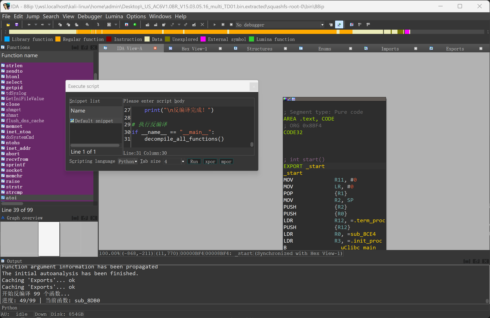
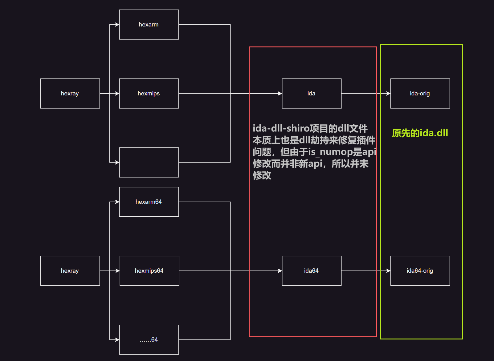
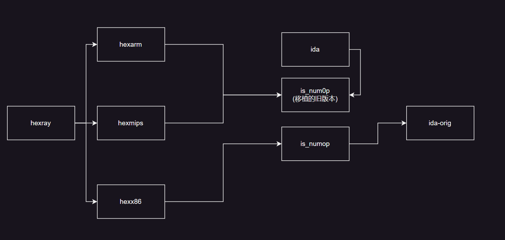
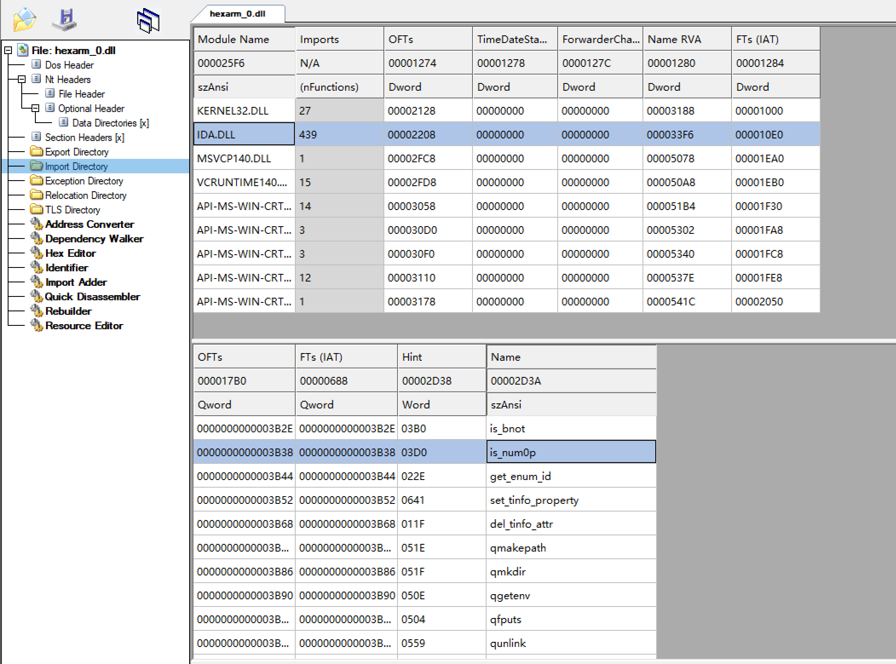
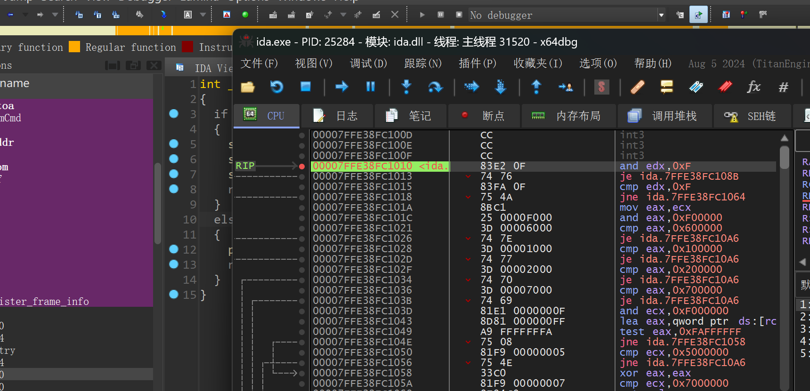

# IDA旧版本插件移植后卡死的研究及修复-先知社区

> **来源**: https://xz.aliyun.com/news/18144  
> **文章ID**: 18144

---

​ 近日在研究异构路由器漏洞时，笔者使用的IDA出现了反编译异构路由器卡死的问题，和身边是师傅们交流后发现，这种问题不在少数，这种工具类的问题严重影响了正常的工作，故进行研究。

​

​ 出现问题的直接原因在于此前由于IDA 8.3及以后的`hexrays`并未泄露，无法使用过去IDA 7.7的插件进行反编译，一通操作下通过`ida_dll_shim`等项目对7.7的`hexrays`进行了移植。移植完成后虽然可以使用，但部分函数仍出现IDA反编译时出现卡死等情况，导致`vulfi`等一众扫描类的插件不能以预期状态运行。

​

​ 不过功夫不负有心人，笔者在搜寻的过程中找到了一篇看雪帖子 [在新版IDA中使用旧版本反编译插件](https://bbs.kanxue.com/thread-279733-1.htm)，帖子提供了一种修复的方法，但帖子中提供的修复方法并非不详细，并且**修复的方法并不合理**，**对正常逆向存在一定的影响**，故笔者决定自己对这次异常进行研究，并给予修复方案。

## 问题分析

​ 在研究开始时，我的第一反应是需要了解IDA是在什么函数的什么地方出现了卡死，毕竟只有跟踪到了出现异常的点，才能进一步研究。这里我选择了`xdbg`进行跟踪分析函数调用，来解答我的下面两个疑问：

​

* 出现问题的函数是什么？
* 产生问题的原因是什么？

​ 根据异常出现在`arm32`位反编译的情况下，不难猜测出这个问题大概率出现在`hexarm.dll`这个链接库中，所以接下来的分析主要针对涉`hexarm.dll`调用的相关函数。为了找到卡死的点，我先写了一个`IDAPython`脚本，来依次反编译程序的所有函数，直至卡死为止。

​

```
import idautils
import idaapi

def decompile_all_functions():
    functions = list(idautils.Functions())
    total = len(functions)
    for i, func_ea in enumerate(functions):
        func_name = idaapi.get_func_name(func_ea)
        print(f"\r进度: {i+1}/{total} | 当前函数: {func_name}", end="")
        try:
            cfunc = idaapi.decompile(func_ea)
            if not cfunc:
                idc.generate_pseudo(func_ea)
        except Exception as e:
            print(f"
反编译失败 @ {func_name} (0x{func_ea:x}): {str(e)}")

if __name__ == "__main__":
    decompile_all_functions()
```

​ 这里我使用的是一个16KB的小的ARM32文件，在正常情况下只需要不到几秒中的时间就会运行完毕，但发现即使经过长时间后程序仍然卡在在`sub_8DB0`这里，那么不必多是，此时就是想要的异常情况了。

​



​ 接下来我使用xdbg来附加现在处于卡死状态的IDA，为了找出此时死循环运行的函数，我通过`alt+k`去查看目前函数的调用关系，来确定函数，下面是我捕获的函数调用关系（主线程）

​

```
线程 ID       地址               返回到              返回自              大小  方    注释                                                                                                                                      
13192 - 主线程                                                             
            0000001794DF9408 00000000589D775B 00000000592B2861 30  用户模块 ida-orig.is_numop+191
            0000001794DF9438 00000000589D5321 00000000589D775B 60  用户模块 hexarm_0.00000000589D775B
            0000001794DF9498 00000000589E08EE 00000000589D5321 30  用户模块 hexarm_0.00000000589D5321
            0000001794DF94C8 0000000058967AFE 00000000589E08EE 30  用户模块 hexarm_0.00000000589E08EE
            0000001794DF94F8 0000000058967D78 0000000058967AFE 30  用户模块 hexarm_0.0000000058967AFE
            0000001794DF9528 0000000058967C20 0000000058967D78 30  用户模块 hexarm_0.0000000058967D78
            0000001794DF9558 0000000058967D78 0000000058967C20 30  用户模块 hexarm_0.0000000058967C20
            0000001794DF9588 000000005896D1F1 0000000058967D78 30  用户模块 hexarm_0.0000000058967D78
            0000001794DF95B8 0000000058967AFE 000000005896D1F1 30  用户模块 hexarm_0.000000005896D1F1
            0000001794DF95E8 0000000058967D78 0000000058967AFE 30  用户模块 hexarm_0.0000000058967AFE
            0000001794DF9618 0000000058967C5F 0000000058967D78 30  用户模块 hexarm_0.0000000058967D78
            0000001794DF9648 0000000058967EA4 0000000058967C5F 70  用户模块 hexarm_0.0000000058967C5F
            0000001794DF96B8 00000000589D0829 0000000058967EA4 C0  用户模块 hexarm_0.0000000058967EA4
            0000001794DF9778 00000000589689B1 00000000589D0829 B0  用户模块 hexarm_0.00000000589D0829
            0000001794DF9828 0000000058924226 00000000589689B1 220 用户模块 hexarm_0.00000000589689B1
            0000001794DF9A48 00000000588555CC 0000000058924226 1C0 用户模块 hexarm_0.0000000058924226
            0000001794DF9C08 0000000058854904 00000000588555CC 50  用户模块 hexarm_0.00000000588555CC
            0000001794DF9C58 0000000058921295 0000000058854904 400 用户模块 hexarm_0.0000000058854904
            0000001794DFA058 00007FFDACEB1646 0000000058921295 E0  用户模块 hexarm_0.0000000058921295
            0000001794DFA138 00007FFD95A4DF8D 00007FFDACEB1646 30  用户模块 _ida_hexrays.00007FFDACEB1646
```

​ 通过栈帧的调用关系可以发现程序在不停止的运行`ida-orig.is_numop+191`函数，此函数是`ida.dll`中的API，7.7的插件这里出现了问题，且两个插件本在各自的版本都没有出现问题，移植后却出现卡死的问题，这里合理怀疑是IDA对这个API进行了部分改动，所以我特地去查看了其相关的信息。

​

​ 根据hexray官网给出的信息，这个函数确实在7.x到8.x进行了内容的变动，并且这个函数的功能是判断转入的数是否为该进制表示方法数字。

​

​ 对此，问题出现的原因就已经明确了，IDA再进行更新时有着API的变动，而可能时函数内部逻辑的改变使得结果的不同，导致陷入死循环，那么接下来就是这时候我选择先对IDA7.7和IDA8.4的`ida-orig.is_numop`进行对比分析。

## is\_numop函数分析

### 7.7版本代码

```
bool __fastcall is_numop(int a1, char a2)
{
  int v2; // edx
  int v3; // eax
  int v4; // ecx
  int v6; // ecx

  v2 = a2 & 0xF;
  if ( v2 )
  {
    if ( v2 == 15 )
    {
      v3 = a1 & 0xF00000;
      if ( (a1 & 0xF00000) == 0x200000 || v3 == 0x700000 || v3 == 0x600000 || v3 == 0x100000 )
        return 1;
    }
    v4 = a1 & 0xF000000;
    if ( v4 == 0x2000000 || v4 == 0x7000000 || v4 == 0x6000000 )
      return 1;
    return v4 == 0x1000000;
  }
  else
  {
    v6 = a1 & 0xF00000;
    if ( v6 == 0x200000 || v6 == 0x700000 || v6 == 0x600000 )
      return 1;
    return v6 == 0x100000;
  }
}
```

### 8.4版本代码

```
bool __fastcall is_numop(__int64 a1, char a2)
{
  unsigned int v2; // r8d
  unsigned int v3; // eax
  __int64 v4; // r10
  __int64 v5; // r8
  __int64 v6; // r10
  __int64 v7; // r8
  __int64 v8; // r10
  __int64 v9; // r8
  __int64 v10; // r10
  __int64 v11; // r8

  v2 = a2 & 0xF;
  if ( v2 == 15 )
  {
    v3 = 0;
    while ( 1 )
    {
      if ( v3 > 7 )
      {
        v4 = 0i64;
        v5 = 0i64;
      }
      else
      {
        v4 = 2i64 << (4 * ((unsigned __int8)v3 + (v3 > 1) + 5));
        v5 = 15i64 << (4 * ((unsigned __int8)v3 + (v3 > 1) + 5));
      }
      if ( (a1 & v5) == v4 )
        break;
      if ( v3 > 7 )
      {
        v6 = 0i64;
        v7 = 0i64;
      }
      else
      {
        v6 = 7i64 << (4 * ((unsigned __int8)v3 + (v3 > 1) + 5));
        v7 = 15i64 << (4 * ((unsigned __int8)v3 + (v3 > 1) + 5));
      }
      if ( (a1 & v7) == v6 )
        break;
      if ( v3 > 7 )
      {
        v8 = 0i64;
        v9 = 0i64;
      }
      else
      {
        v8 = 6i64 << (4 * ((unsigned __int8)v3 + (v3 > 1) + 5));
        v9 = 15i64 << (4 * ((unsigned __int8)v3 + (v3 > 1) + 5));
      }
      if ( (a1 & v9) == v8 )
        break;
      if ( v3 > 7 )
      {
        v10 = 0i64;
        v11 = 0i64;
      }
      else
      {
        v10 = 1i64 << (4 * ((unsigned __int8)v3 + (v3 > 1) + 5));
        v11 = 15i64 << (4 * ((unsigned __int8)v3 + (v3 > 1) + 5));
      }
      if ( (a1 & v11) == v10 )
        break;
      if ( (int)++v3 >= 8 )
        return 0;
    }
    return 1;
  }
  else
  {
    return v2 < 8
        && ((a1 & (15i64 << (4 * ((unsigned __int8)v2 + (v2 > 1) + 5)))) == 2i64 << (4*unsigned __int8)v2 + (v2 > 1) + 5))
         || (a1 & (15i64 << (4 * ((unsigned __int8)v2 + (v2 > 1) + 5)))) == 7i64 << (4*((unsigned __int8)v2 + (v2 > 1) + 5))
         || (a1 & (15i64 << (4 * ((unsigned __int8)v2 + (v2 > 1) + 5)))) == 6i64 << (4*unsigned __int8)v2 + (v2 > 1) + 5))
         || (a1 & (15i64 << (4 * ((unsigned __int8)v2 + (v2 > 1) + 5)))) == 1i64 << (4*((unsigned __int8)v2 + (v2 > 1) + 5)));
  }
}
```

### 分析

这里我们从复杂的8.4版本入手，抛开其他结构只观察函数逻辑本身的情况下，函数`is_numop`的作用是检查给定的64位整数`a1`中特定的四位字段是否匹配预定义的数值模式，具体取决于第二个参数`a2`的低四位值。

### 关键逻辑分析：

> * **当**`v2 == 15`：遍历8组不同的四位字段，检查是否有任意一组匹配以下模式之一：`0x2`、`0x7`、`0x6`、`0x1`。
> * **当**`v2 < 8`：直接检查`a1`中由`v2`指定的四位字段是否匹配上述模式。
>
> 1. **字段位置计算**：
>
> * 每个四位字段的位置由公式 `4 * (v3 + (v3 > 1) + 5)` 或 `4 * (v2 + (v2 > 1) + 5)` 确定。
> * 例如：
>
> * 若`v3 = 0`，字段位于第20-23位（`4 * (0 + 0 + 5) = 20`）。
> * 若`v3 = 2`，字段位于第32-35位（`4 * (2 + 1 + 5) = 32`）。
>
> 1. **模式匹配**：
>
> * 每个四位字段需要等于以下值之一（掩码为0xF左移后的结果）：
>
> * `0x2`（二进制`0010`）
> * `0x7`（二进制`0111`）
> * `0x6`（二进制`0110`）
> * `0x1`（二进制`0001`）

​ 而我们分析完复杂的8.4版本后，再看一眼7.7版本时，顿时感到7.7的函数眉清目秀的，这里就不详细分析它的逻辑了，只给出它俩的差异。

|  |  |  |
| --- | --- | --- |
| 特性 | 8.4 | 7.7 |
| **参数类型** | `__int64 a1` (64位) | `int a1` (32位) |
| **位域覆盖范围** | 8个位域 (位20-23,24-27,32-35,36-39,...) | 仅2个位域 (位20-23, 24-27) |

​ 简单的理解来看新版的`is_numop`传入的参数`a1`是去判读64个bit的操作，而7.7版本及以前都是32个bit判断的简单逻辑，并且逻辑不完全相同。既然分析出了具体原因，接下来的就是对dll文件进行修复了。

## 修复问题

### 修复思路

修复这个问题，也分为多个思路，而笔者并不采用先前文章中的修复方法（先前文章是通过使用`is_numop0`替换`is_numop`），因为新版`is_numop0`函数的本质逻辑是调用了`is_numop(a1,0)`，根据我们上方的分析来看，`is_numop0`对应的判断逻辑应该是这样的

​

```
bool __fastcall is_numop0(__int64 a1)
{
  return (a1 & 0xF00000) == 0x200000
      || (a1 & 0xF00000) == 0x700000
      || (a1 & 0xF00000) == 0x600000
      || (a1 & 0xF00000) == 0x100000;
}
```

​ 这样的情况下`is_numop0`**只会对20-23位进行操作，但正常情况下对24-27的判断就会失效，也就是当n传入的值不等于**`0`**或**`0xf`**时，进行的判断和原先的函数是不同的**。为了不影响反编译的结果和程序的健壮性，我需要一个更靠谱的方法去修复。

​

​ 最容易想到的方法是将老版本`is_numop`写入`hexarm.dll`并修改名称，并将原先的`is_numop`调用修改为新函数，不过这种方法在操作上稍显麻烦。第二种容易想到方法是根据函数的逻辑，对函数外的代码进行部分修改，使他进入函数是时满足条件切正确，但过少的空间使得第二种方法并不容易，甚至无法完成，第三种方法是则是通过dll劫持，将`is_numop`指向到新的函数。思考再三，为了追求稳定性，最终选择了第三种修复方法。

​

在修复之前，先缕一便当前IDA在执行反编译时链接库之间的依赖关系，下图是笔者修复前链接库的关系。

​



​ 经过上图我们可以看到，我先前使用的项目`ida_dll_shim`本质上就是进行了一个dll的劫持来修复旧版本插件不识别的问题，但由于`is_numop`只是改变函数内容，如果将把`8.4dll`的`is_numop`直接修改为7.7的`is_numop`后，原先自带的`8.4hexrays-x86_64`则可能出现问题，为了不影响新插件的功能，故这个项目并没有对这种内容改变函数进行明确修改，最终导致这个问题。

​ 再回头来考虑我们修复的实现方法，为解决这个问题我们可以通过在`ida.dll`中创建一个新的函数`is_num0p`来代替`is_numop`，并在老版本插件将新函数的替换原先的`is_num0p`，实现如下。



### 修复操作

首先要重新编译`ida_dll_shim`中的ida(这里建议大家先看一遍原先的项目文件，并跟着项目操作完，因为这里是在操作完一次项目操作后进行的，这里我默认大家已经跟着项目修复完第一次了，已经有`ida-orig`和`ida64-orig`文件),上文提到过，`ida_dll_shim`是通过dll劫持实现的，本质上是创建一个新`ida.dll`转发了`ida-orig`中的函数，并添加了新函数，这里我们在项目的`ida_dll_exports.h`中创建一个新的函数并放入老版ida的代码。

```
// 下列代码添加到ida_dll_exports.h 末尾
idaman int ida_export is_num0p(int a1, char a2)
{
  int v2; // edx
  int v3; // ecx
  int v5; // eax
  int v6; // ecx
  int v7; // ecx

  v2 = a2 & 0xF;
  if ( v2 )
  {
    if ( v2 == 15 )
    {
      v5 = a1 & 0xF00000;
      if ( (a1 & 0xF00000) == 6291456 )
        return 1i64;
      switch ( v5 )
      {
        case 2097152:
          return 1i64;
        case 1048576:
          return 1i64;
        case 7340032:
          return 1i64;
      }
      v6 = a1 & 0xF000000;
      if ( v6 == 100663296 || v6 == 0x2000000 || v6 == 0x1000000 )
        return 1i64;
      return v6 == 117440512;
    }
    else
    {
      v3 = a1 & 0xF000000;
      if ( v3 == 0x2000000 || v3 == 117440512 || v3 == 100663296 )
        return 1i64;
      return v3 == 0x1000000;
    }
  }
  else
  {
    v7 = a1 & 0xF00000;
    if ( v7 == 0x200000 || v7 == 7340032 || v7 == 6291456 )
      return 1i64;
    return v7 == 0x100000;
  }
}
```

​ 最终使用VS重新编译出ida和ida64，替换第一次生成的ida和ida64，生成完成后可以使用ida查看export来检查是否生成正确，正确的情况下是可以看到`is_numop`和`is_num0p`同时存在并且可以点击进入的。至此，我们对`ida.dll`的修复已经完成。接下来就是改变hex异构反编译dll的导入函数表了。

这里我使用的是`CFF` ，将异构hex反编译`dll->importDirectory->导入函数is_numop`改为`is_num0p`并保存，如图是修改后的情况。



## 最终结果测试

修复完成后再一次启动ida，并用xdbg进行跟踪，发现程序已经进入到我们所创建的函数中。



再次运行测试案例，程序可以正常运行完毕,并未出现卡死的情况，至此我们的修复已经完成。

​

## 参考文献

[在新版IDA中使用旧版本反编译插件](https://bbs.kanxue.com/thread-279733-1.htm)

<https://bbs.kanxue.com/thread-262420.htm>

<https://learn.microsoft.com/zh-cn/windows/win32/dlls/dynamic-link-library-search-order>

## 个人博客/修复后版本下载

<https://ddostalker.github.io/>

由于本体过大，并未上传附件，修复后的版本可以在个人博客中查找下载。
