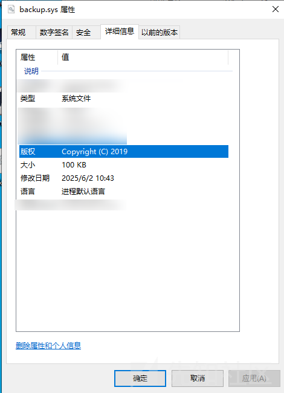
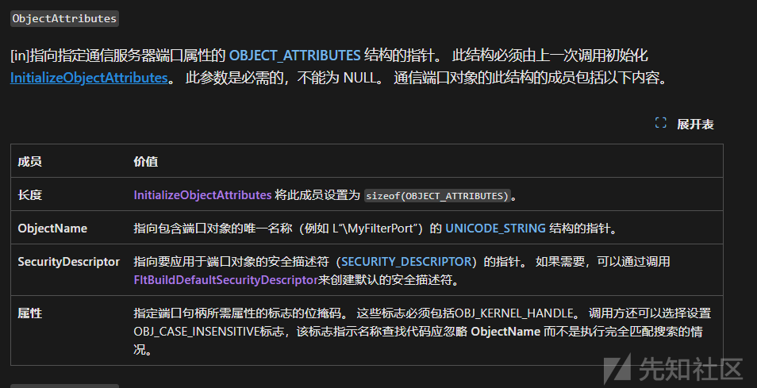
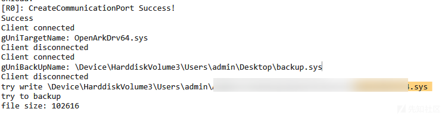
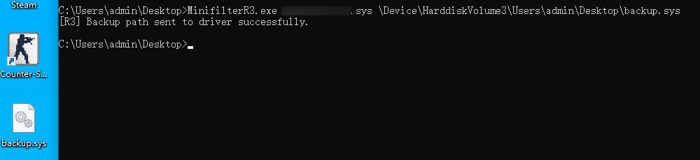

# Minifilter实现文件备份-先知社区

> **来源**: https://xz.aliyun.com/news/18155  
> **文章ID**: 18155

---

# 起因

在分析某款软件时发现, 其主要功能被实现于内核态驱动中, 在加载驱动后会自删除文件, 想要逆一下发现找不到驱动 所以考虑用minifilter读写文件拿到驱动

# 实现过程

首先我们要确定一下文件名格式`FltGetFileNameInformation`

```
status = FltGetFileNameInformation(data, FLT_FILE_NAME_NORMALIZED | FLT_FILE_NAME_QUERY_ALWAYS_ALLOW_CACHE_LOOKUP, &nameInfo);

```

nameInfo.Name 结构类似下面这样

`\Device\HarddiskVolumex\xxxxx\...\xxxxx.sys`

随便注册个针对`IRP_MJ_WRITE`的回调 dbgPrint输出一下找找我们要的驱动文件


拿到名称之后可以考虑开始写回调了

这里考虑写后回调 整体思路大致如下

1. 通过判断`nameInfo.Name`决定是否备份
2. 获取目标文件大小
3. 获取目标驱动文件句柄,文件对象 创建备份文件
4. 读写 分段读取原文件内容并写入到备份文件中

## 1. 通过判断nameInfo.Name决定是否备份

```
const static UNICODE_STRING uniArkName = RTL_CONSTANT_STRING(L"\Device\HarddiskVolume3\Users\admin\AppData\Roaming\xxxx\xxxxx.sys");


if (nameInfo.Name && RtlCompareUnicodeString(&uniArkName, nameInfo.Name, true) == 0) {
    
    
}

```

## 2. 获取目标文件大小

```
NTSTATUS status = STATUS_UNSUCCESSFUL;
LARGE_INTEGER fileSize;
status = FsRtlGetFileSize(FltObjects->FileObject, &fileSize);

DebugPrint("file size: %llu
", fileSize.QuadPart);
if (fileSize.QuadPart == 0) {
    return FLT_POSTOP_FINISHED_PROCESSING;
}
```

## 3. 获取目标驱动文件句柄,文件对象 创建备份文件

```
HANDLE hReadFile = NULL;
PFILE_OBJECT fReadObj = NULL;
OBJECT_ATTRIBUTES objAttr = { 0 };
InitializeObjectAttributes(&objAttr, nameInfo.Name, OBJ_KERNEL_HANDLE | OBJ_CASE_INSENSITIVE, NULL, NULL);
IO_STATUS_BLOCK ioSb = { 0 };

UNICODE_STRING uniTargetPath = RTL_CONSTANT_STRING(L"\Device\HarddiskVolume3\Users\admin\Desktop\backup.sys");
HANDLE hWriteFile = NULL;
PFILE_OBJECT fWriteObj = NULL;
OBJECT_ATTRIBUTES objAttr2 = { 0 };
InitializeObjectAttributes(&objAttr2, &uniTargetPath, OBJ_KERNEL_HANDLE | OBJ_CASE_INSENSITIVE, NULL, NULL);
IO_STATUS_BLOCK ioSb2 = { 0 };
HANDLE hSection = NULL;
```

```
#define CHECK_STATUS_AND_BREAK(s)                                      \
    if (!NT_SUCCESS(s)) {                                              \
        DbgPrintEx(77, 0, "[%s:%d] status: 0x%x
",                   \
                   __FUNCTION__, __LINE__, (ULONGLONG)(s));            \
        break;                                                         \
    }


do {

    status = FltCreateFileEx(FltObjects->Filter, FltObjects->Instance,
        &hReadFile, &fReadObj, GENERIC_READ, &objAttr, &ioSb, NULL, FILE_ATTRIBUTE_NORMAL, FILE_SHARE_READ | FILE_SHARE_WRITE,
        FILE_OPEN, FILE_SYNCHRONOUS_IO_NONALERT | FILE_SEQUENTIAL_ONLY, NULL, 0, IO_IGNORE_SHARE_ACCESS_CHECK);
    CHECK_STATUS_AND_BREAK(status);

    status = FltCreateFileEx(FltObjects->Filter, FltObjects->Instance,
        &hWriteFile, &fWriteObj, GENERIC_WRITE, &objAttr2, &ioSb2, NULL, FILE_ATTRIBUTE_NORMAL, 0,
        FILE_OVERWRITE_IF, FILE_SYNCHRONOUS_IO_NONALERT | FILE_SEQUENTIAL_ONLY, NULL, 0, 0);
    CHECK_STATUS_AND_BREAK(status);

} while (false);
if (buf) {
    ExFreePool(buf);
}if (hReadFile) {
    FltClose(hReadFile);
}if (hWriteFile) {
    FltClose(hWriteFile);
}if (fReadObj) {
    ObDereferenceObject(fReadObj);
}if (fWriteObj) {
    Ob
```

通过`FltCreateFileEx`打开目标文件 和创建备份文件

## 4. 分段读取原文件内容并写入到备份文件中

```
ULONG size = 1 << 20;
ULONG out = 0;
ULONG readOffset = 0;
PVOID buf = NULL;

....

ULONG64 remainBytes = fileSize.QuadPart;
buf = ExAllocatePool(PagedPool, remainBytes);
if (!buf) {
    status = STATUS_NO_MEMORY;
    break;
}
while (remainBytes) {
    status = FltReadFile(FltObjects->Instance, fReadObj, 0, min(size, remainBytes), buf, 0, &out, NULL, NULL);
    CHECK_STATUS_AND_BREAK(status);

    status = FltWriteFile(FltObjects->Instance, fWriteObj, 0, out, buf, 0, NULL, NULL, NULL);
    CHECK_STATUS_AND_BREAK(status);

    remainBytes -= out;
}
```




## 优化

那么现在是硬编码的目标文件和备份文件 比较蠢 考虑上个通信从R3接收文件名

### R0

先写驱动这块

通过`FltCreateCommunicationPort`  创建通信端口



在这之前需要用`FltBuildDefaultSecurityDescriptor`来创建默认的安全描述符

```
status = FltBuildDefaultSecurityDescriptor(&pSecDescriptor, FLT_PORT_ALL_ACCESS);
CHECK_STATUS_AND_BREAK(status);
InitializeObjectAttributes(&objAttr, &uniPortName, OBJ_KERNEL_HANDLE | OBJ_CASE_INSENSITIVE, NULL, pSecDescriptor);
status = FltCreateCommunicationPort(filterHandle, &commPortHandle, &objAttr, NULL, fltConnectNotifyCallback, fltDisConnectNotifyCallback, NULL, 2);
CHECK_STATUS_AND_BREAK(status);

```

fltDisConnectNotifyCallback我们不关心

`fltConnectNotifyCallback`如下

先定义一个通信结构

```
typedef enum _COOM_STR_TYPE {
    AR_TargetFileType,
    AR_BackUpFileType,
}COOM_STR_TYPE;

typedef struct _COOM_UNICODE_STRING_CONTEXT {
    COOM_STR_TYPE type;
    USHORT Length;       
    WCHAR Buffer[260];   
} COOM_UNICODE_STRING_CONTEXT, *PCOOM_UNICODE_STRING_CONTEXT;
```

```
PUNICODE_STRING gUniTargetName = NULL; 
PUNICODE_STRING gUniBackUpName = NULL; 
.....
auto fltConnectNotifyCallback (
    _In_ PFLT_PORT ClientPort,
        _In_opt_ PVOID ServerPortCookie,
        _In_reads_bytes_opt_(SizeOfContext) PVOID ConnectionContext,
        _In_ ULONG SizeOfContext,
        _Outptr_result_maybenull_ PVOID* ConnectionPortCookie
        )->NTSTATUS{

        clientHandle = ClientPort;
        DebugPrint("Client connected
");

        NTSTATUS status = STATUS_UNSUCCESSFUL;
        UNICODE_STRING uniName = { 0 };

        if (ConnectionContext && SizeOfContext > 0) {
            PCOOM_UNICODE_STRING_CONTEXT context = (PCOOM_UNICODE_STRING_CONTEXT)ConnectionContext;
            if (context->Length <= sizeof(context->Buffer)) {

                switch (context->type) {
                    case AR_TargetFileType: {
                        if (!gUniTargetName) gUniTargetName = (PUNICODE_STRING)ExAllocatePool(PagedPool, sizeof(UNICODE_STRING));
                        
                        if (!gUniTargetName) {
                            DebugPrint("Failed to allocate gUniTargetName
");
                            return STATUS_INSUFFICIENT_RESOURCES;
                        }

                        memset(gUniTargetName, 0, sizeof(UNICODE_STRING));

                        gUniTargetName->Length = context->Length;
                        gUniTargetName->MaximumLength = context->Length;
                        if (gUniTargetName->Buffer) {
                            ExFreePool(gUniTargetName->Buffer);
                        }
                        gUniTargetName->Buffer = (PWCH)ExAllocatePool(PagedPool, gUniTargetName->Length);
                        if (gUniTargetName->Buffer) {
                            memcpy(gUniTargetName->Buffer, context->Buffer, gUniTargetName->Length);
                            DebugPrint("gUniTargetName: %wZ
", gUniTargetName);
                            status = STATUS_SUCCESS;
                        }
                        
                        break;
                    }
                    case AR_BackUpFileType: {
                        if (!gUniBackUpName) gUniBackUpName = (PUNICODE_STRING)ExAllocatePool(PagedPool, sizeof(UNICODE_STRING));
                        if (!gUniBackUpName) {
                            DebugPrint("Failed to allocate gUniBackUpName
");
                            return STATUS_INSUFFICIENT_RESOURCES;
                        }

                        memset(gUniBackUpName, 0, sizeof(UNICODE_STRING));

                        gUniBackUpName->Length = context->Length;
                        gUniBackUpName->MaximumLength = context->Length;
                        if (gUniBackUpName->Buffer) {
                            ExFreePool(gUniBackUpName->Buffer);
                        }
                        gUniBackUpName->Buffer = (PWCH)ExAllocatePool(PagedPool, gUniBackUpName->Length);
                        if (gUniBackUpName->Buffer) {
                            memcpy(gUniBackUpName->Buffer, context->Buffer, gUniBackUpName->Length);
                            DebugPrint("gUniBackUpName: %wZ
", gUniBackUpName);
                            status = STATUS_SUCCESS;
                        }
                        break;
                    }
                }
            }
        }


        return status;
    }
```

记得在卸载的时候free掉

对应`IRP_MJ_WRITE`的后回调需要修改的点如下

```
if (gUniTargetName->Length != 0) {

    if (nameInfo.Name && RtlSuffixUnicodeString(gUniTargetName, nameInfo.Name, true)) {
        ...
    }
}
                
   ...
HANDLE hWriteFile = NULL;
PFILE_OBJECT fWriteObj = NULL;
OBJECT_ATTRIBUTES objAttr2 = { 0 };
InitializeObjectAttributes(&objAttr2, &gUniBackUpName, OBJ_KERNEL_HANDLE | OBJ_CASE_INSENSITIVE, NULL, NULL);
IO_STATUS_BLOCK ioSb2 = { 0 };
HANDLE hSection = NULL;
```

### R3

通过`FilterConnectCommunicationPort`直接在连接的时候走回调把数据传完 就不用写`MessageNotifyCallback`了

当然通过`filterSendMessage` 走`MessageNotifyCallback`实际上是更符合直觉的 当时不知道为什么没这么写

```
#include "MinifilterR3.h"

typedef enum _COOM_STR_TYPE {
    AR_TargetFileType,
    AR_BackUpFileType,
}COOM_STR_TYPE;

typedef struct _COOM_UNICODE_STRING_CONTEXT {
    COOM_STR_TYPE type;
    USHORT Length;       
    WCHAR Buffer[260];   
} COOM_UNICODE_STRING_CONTEXT, * PCOOM_UNICODE_STRING_CONTEXT;

auto connectDriverBackUp(std::wstring inputStr, COOM_STR_TYPE type) -> bool{
    bool isConnect = false;
    HRESULT apiResult = S_OK;
    HANDLE minifilterHandle = INVALID_HANDLE_VALUE;

    do{

        
        PCOOM_UNICODE_STRING_CONTEXT context = (PCOOM_UNICODE_STRING_CONTEXT)malloc(sizeof(COOM_UNICODE_STRING_CONTEXT));

        size_t lenInBytes = inputStr.length() * sizeof(wchar_t);

        context->type = type;
        context->Length = lenInBytes;
        memset(context->Buffer, 0, sizeof(context->Buffer));
        memcpy(context->Buffer, inputStr.c_str(), lenInBytes);

        apiResult = FilterConnectCommunicationPort(R3portName, 0, context, sizeof(COOM_UNICODE_STRING_CONTEXT), NULL, &minifilterHandle);
        
        if (IS_ERROR(apiResult)) break;
        CloseHandle(minifilterHandle);
        isConnect = true;
    } while (false);
    if (!isConnect) {
        printf("[R3]:connect failed
");
    }


    return isConnect;
}

auto BackUp(std::wstring backUpPath, std::wstring targetPath) -> bool {
    bool bRet = FALSE;
    if (targetPath.empty() || backUpPath.empty()) {
        std::wcerr << L"[R3] Path is empty.
";
        return false;
    }
    bRet |= connectDriverBackUp(targetPath, AR_TargetFileType);
    bRet |= connectDriverBackUp(backUpPath, AR_BackUpFileType);

    return bRet;

}

int wmain(int argc, wchar_t* argv[]) {
    if (argc != 3) {
        std::wcerr << L"Usage: x.exe <TargetPath> <BackupPath>
";
        return 1;
    }

    std::wstring targetPath = argv[1];
    std::wstring backUpPath = argv[2];

    if (BackUp(backUpPath, targetPath)) {
        std::wcout << L"[R3] Backup path sent to driver successfully.
";
    }
    else {
        std::wcout << L"[R3] Failed to send backup info to driver.
";
    }
    return 0;
}


```





​
