# LLM安全之从0到1微调安全大模型-先知社区

> **来源**: https://xz.aliyun.com/news/18166  
> **文章ID**: 18166

---

本文将详细介绍如何通过各种开源框架在本地完成安全大模型的微调，从底层模型层来优化模型，做出适合安全研究人员的大模型

## 微调简介

微调，指的是在一个已经经过大规模、通用数据集预训练好的基础模型上，使用相对较小规模的、特定领域或特定任务的数据集，对该模型进行进一步训练的过程。

* 微调 = 预训练模型 + 特定任务数据 + 进一步训练
* 本质：是一种高效的迁移学习方法，利用预训练模型强大的通用能力，通过少量领域/任务数据对其进行针对性优化，使其适应具体的应用需求。
* 目的：以较低的成本（相比预训练）让“通才”模型转变为特定领域的“专家”或特定任务的“能手”。

## 基础环境

### 硬件基础

GPU: Inter GTX5060 （100%跑，勉强够用）

CPU: Inter I9-14900HX （实际上用不到）

内存：32GB

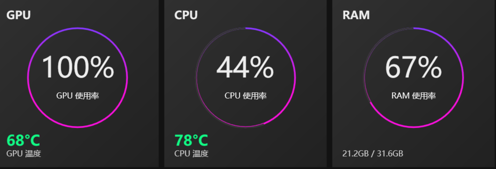

### 软件基础

* **操作系统****：windows 11**
* **框架: LLama-Factory (国产最热门的微调框架)**

国内北航开源的低代码大模型训练框架，可以实现**零代码微调**，简单易学，功能强大，且目前热度很高，建议新手从这个开始入门，非常适合我这种小白

关于框架选择建议可以看https://www.zhihu.com/question/638803488/answer/84354509523

* **算法:****LoRA****(最著名的部分参数微调算法）**

2021 年 Microsoft Research 提出，首次提出了通过**低秩矩阵分解**的方式来进行**部分参数微调**，极大推动了 AI 技术在多行业的广泛落地应用：[LoRA: Low-Rank Adaptation of Large Language Models](https://arxiv.org/abs/2106.09685)

* **基座模型：DeepSeek-R1-Distill-Qwen-1.5B** 蒸馏技术通常用于通过将大模型（教师模型）的知识转移到小模型（学生模型）中，使得小模型能够在尽量保持性能的同时，显著减少模型的参数量和计算需求。

## 实操过程

### 搭建**LLama-Factory环境**

LLaMA-Factory 的 Github地址：<https://github.com/hiyouga/LLaMA-Factory>

* 克隆仓库

```
git clone --depth 1 https://github.com/hiyouga/LLaMA-Factory.git
```

* 切换到项目目录

```
cd LLaMA-Factory
```

* 创建 conda 虚拟环境(一定要 3.10 的 python 版本，不然和 LLaMA-Factory 不兼容)

```
conda create -n llama-factory python=3.10
```

* 激活虚拟环境

```
conda activate llama-factory
```

* 在虚拟环境中安装 LLaMA Factory 相关依赖

```
pip install -e ".[torch,metrics]"
```

注意：如报错 bash: pip: command not found ，先执行 conda install pip 即可

* 在虚拟环境安装 PyTorch（不安装微调的时候会报错滴）

查看自己的显卡支持的当前CUDA，windows命令为

```
nvidia-smi
```

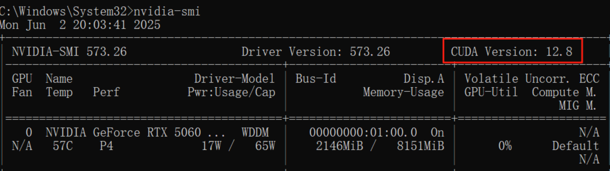

然后去PyTorch官网上对应下载版本https://pytorch.org/get-started/locally/

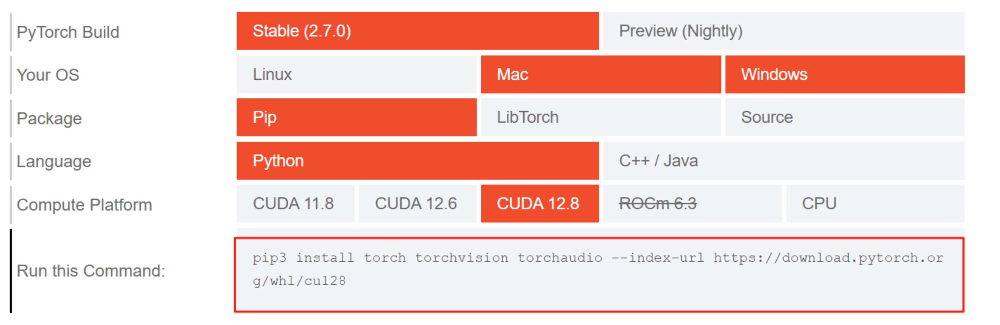

```
pip3 install torch torchvision torchaudio --index-url https://download.pytorch.org/whl/cu128
```

* 检验是否安装成功

```
llamafactory-cli version
```

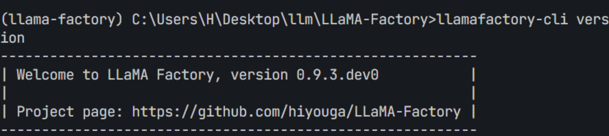

* 启动 LLama-Factory 的可视化微调界面 （由 Gradio 驱动）

```
llamafactory-cli webui
```

成功启动后会返回一个前端链接

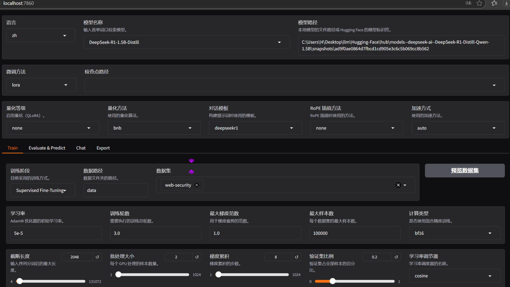

### Hugging Face下载基准模型

HuggingFace 是一个集中管理和共享预训练模型的平台 [https://huggingface.co](https://huggingface.co/);

HuggingFace数据huggingface-cli 下载：https://huggingface.co/docs/huggingface\_hub/main/en/guides/cli 从 HuggingFace 上下载模型有多种不同的方式，可以参考：[如何快速下载huggingface模型——全方法总结](https://zhuanlan.zhihu.com/p/663712983)

* 创建文件夹统一存放所有基座模型

```
mkdir Hugging-Face
```

* 安装 HuggingFace 官方下载工具

```
pip install -U huggingface_hub
```

* 修改 HuggingFace 的镜像源

```
set HF_ENDPOINT=https://hf-mirror.com
```

* 修改模型下载的默认位置

```
set HF_HOME=/root/autodl-tmp/Hugging-Face
```

* 注意：这种配置方式只在当前 shell 会话中有效，如果你希望这个环境变量在每次启动终端时都生效，可以将其添加到你的环境变量配置文件中
* 检查环境变量是否生效

```
huggingface-cli env
```

可以看到输入命令之后，其中的ENDPOINT已经修改为上述设置的

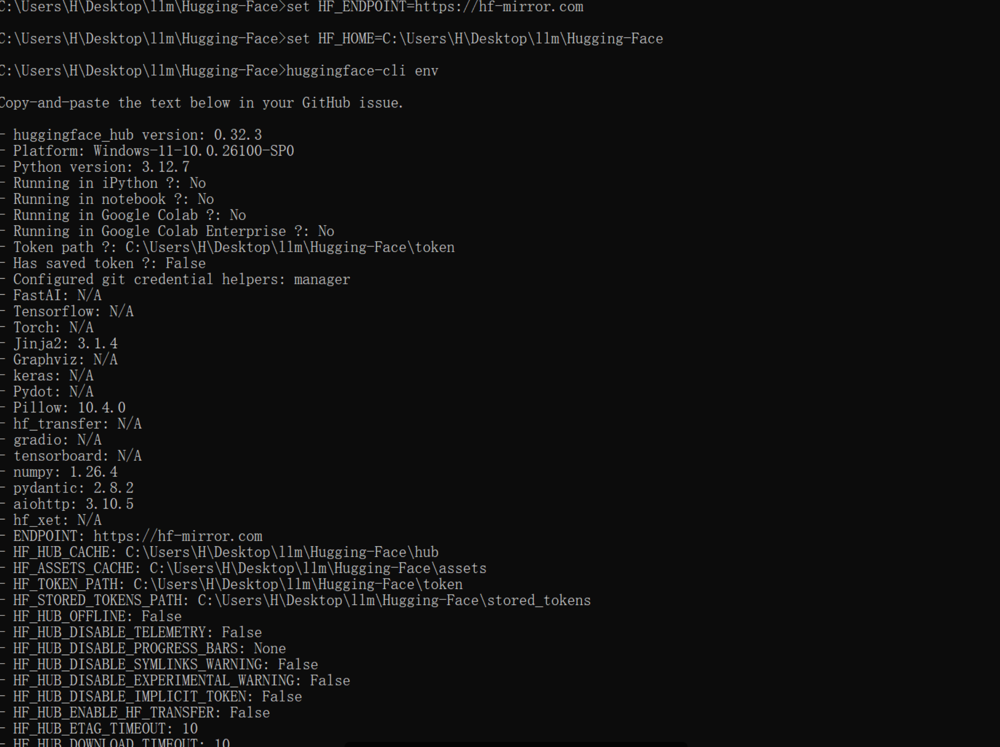

* 执行下载命令

```
huggingface-cli download --resume-download deepseek-ai/DeepSeek-R1-Distill-Qwen-1.5B
```

可以看到成功下

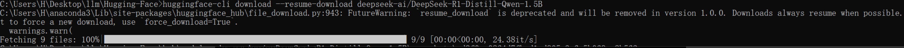

### 构造数据集

* 从hugging face中获取到数据集

访问https://huggingface.co/datasets?search=security 找些数据集

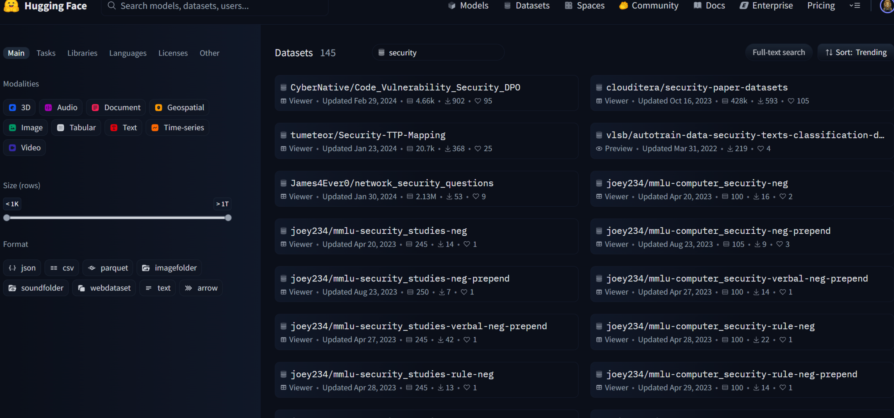

随便找一个web安全的数据集吧https://huggingface.co/datasets/Conard/web-security

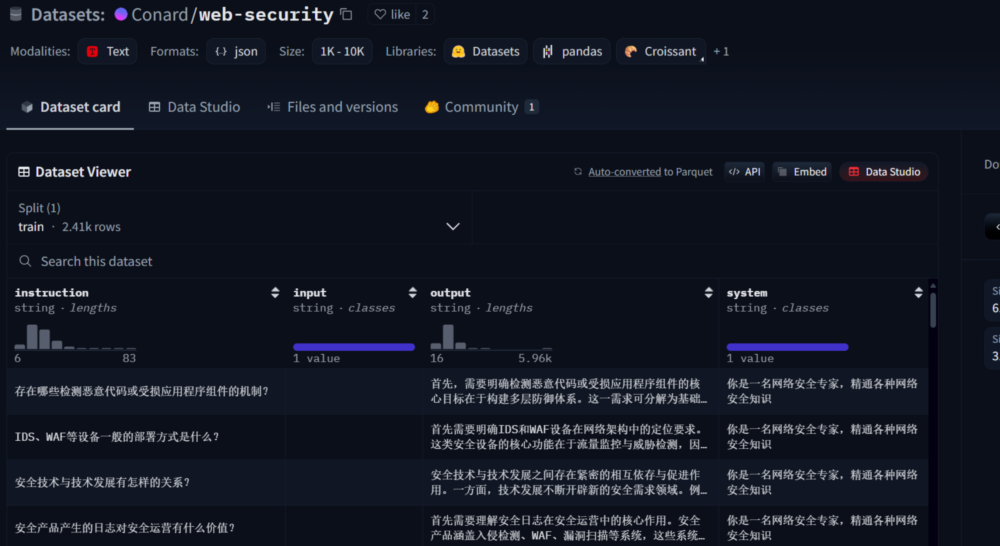

* 优化数据格式为LLama-Factory的数据格式

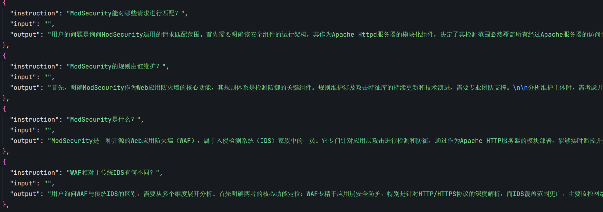

* 修改 **dataset\_info.json** 文件，添加如下配置：

```
"web-security": {
"file_name": "web-security.json"
},
```

* 将数据集 web-security.json 放到 LLama-Factory 的 **data 目录** 下

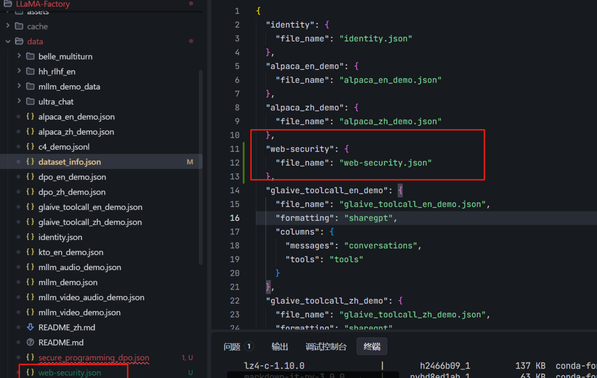

### Llama Factory 微调

* 加载基准模型

语言先选择中文之后，在模型里边直接输入之前下载的会自动筛选，最重要的是下载下来的模型文件路径，注意：这里的路径是模型文件夹内部的**模型特定快照的唯一****哈希值**，而不是整个模型文件夹

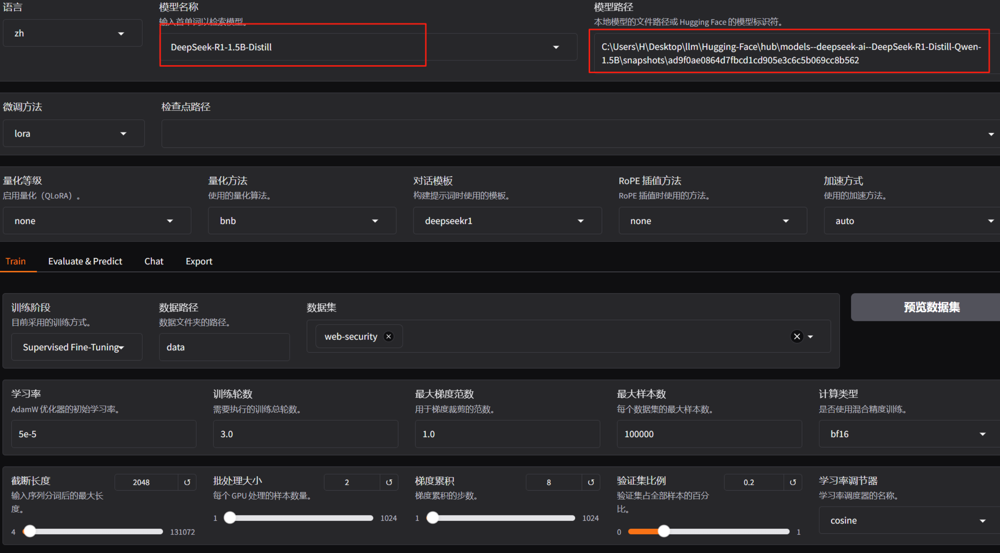

然后就可以选择chat 加载模型，之后随便输入，当看到模型返回信息时证明模型已经成功加载并跑起来了

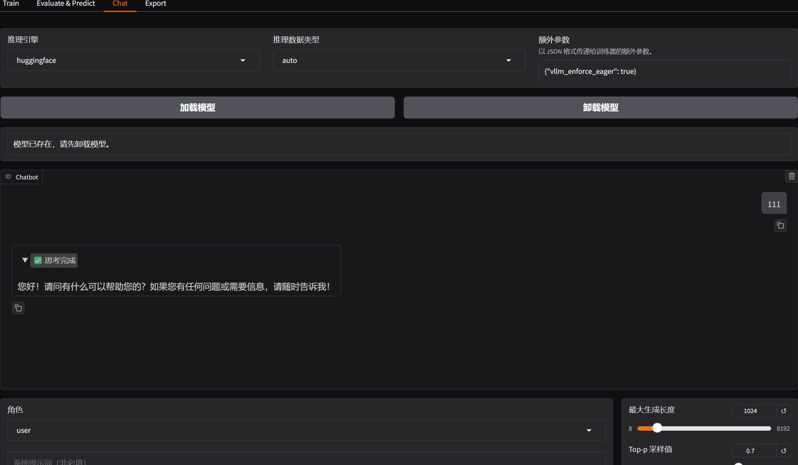

* 微调配置

按照下图选一下,这里除了微调算法、数据集之外，剩下的超参数其实是按照默认的（具体参数可根据情况改动哈）

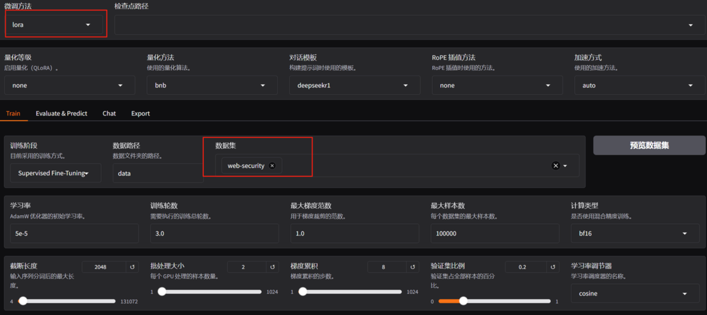

* 选择微调算法 **Lora**
* 添加数据集 **web-security**
* 修改其他训练相关参数，如学习率、训练轮数、截断长度、验证集比例等

* 学习率（Learning Rate）：决定了模型每次更新时权重改变的幅度。过大可能会错过最优解；过小会学得很慢或陷入局部最优解
* 训练轮数（Epochs）：太少模型会欠拟合（没学好），太大会过拟合（学过头了）
* 最大梯度范数（Max Gradient Norm）：当梯度的值超过这个范围时会被截断，防止梯度爆炸现象
* 最大样本数（Max Samples）：每轮训练中最多使用的样本数
* 计算类型（Computation Type）：在训练时使用的数据类型，常见的有 float32 和 float16。在性能和精度之间找平衡
* 截断长度（Truncation Length）：处理长文本时如果太长超过这个阈值的部分会被截断掉，避免内存溢出
* 批处理大小（Batch Size）：由于内存限制，每轮训练我们要将训练集数据分批次送进去，这个批次大小就是 Batch Size
* 梯度累积（Gradient Accumulation）：默认情况下模型会在每个 batch 处理完后进行一次更新一个参数，但你可以通过设置这个梯度累计，让他直到处理完多个小批次的数据后才进行一次更新
* 验证集比例（Validation Set Proportion）：数据集分为训练集和验证集两个部分，训练集用来学习训练，验证集用来验证学习效果如何
* 学习率调节器（Learning Rate Scheduler）：在训练的过程中帮你自动调整优化学习率

* 开启微调

点击开始，此时就会调用电脑的GPU、CPU开始进行微调工作了，只需要等上那么八八四十九天

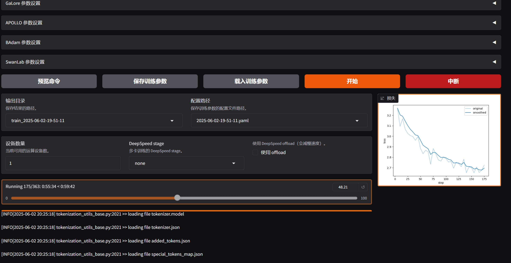

可以看到在漫长的一段时间（最起码2h），终于得到了微调后的模型，果然算法工程师很摸鱼呀，这调参一跑就很长，剩下的时间就看论文，美滋滋

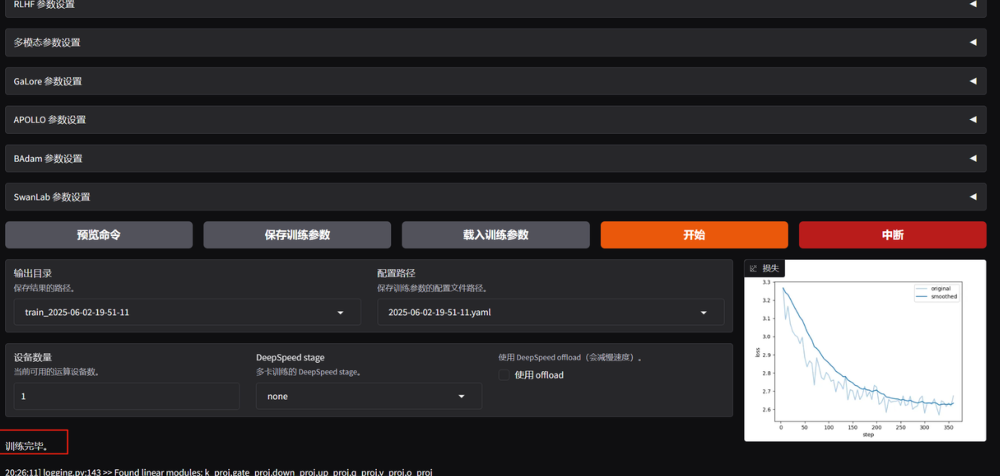

当微调完毕后可以通过观察损失曲线的变化观察最终损失来了解本次的微调效果，这里由于随便给的参数，所以数据结果也不重要了，实际上还凑合吧

* **检查点**：保存的是模型在训练过程中的一个中间状态，包含了模型权重、训练过程中使用的配置（如学习率、批次大小）等信息，对LoRA来说，检查点包含了**训练得到的 B 和 A 这两个低秩矩阵的权重**
* 若微调效果不理想，你可以：

* 使用更强的预训练模型
* 增加数据量
* 优化数据质量（数据清洗、数据增强等，可学习相关论文如何实现）
* 调整训练参数，如学习率、训练轮数、优化器、批次大小等等

直接看结果吧，我们将刚才的微调后的数据加载到检查点路径，然后重新卸载、加载下模型，问他一个安全问题，可以看到结果还是挺不错滴！！！

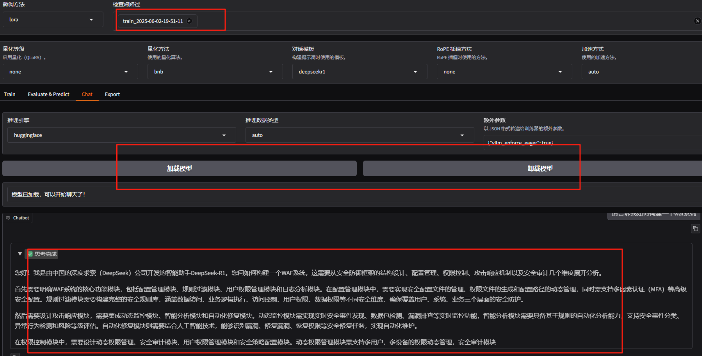

### 玩上微调后的模型

* 导出微调后的模型

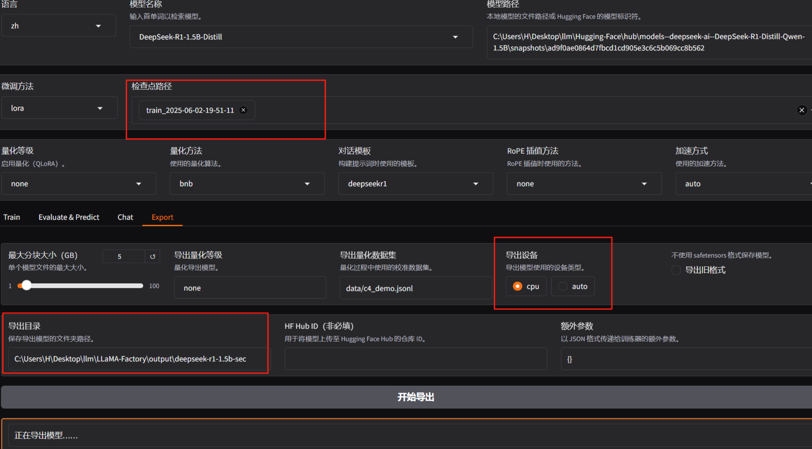

等待一会，基本上一两分钟吧，就可以导出成功

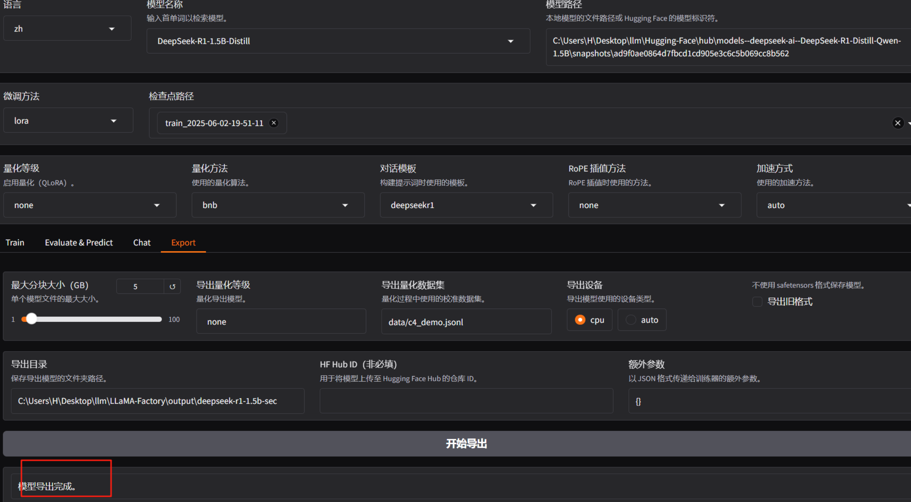

* FastAPI框架构造应用

使用Python FastAPI框架快速搭建一个服务端应用

```
from fastapi import FastAPI
from transformers import AutoModelForCausalLM, AutoTokenizer
import torch

app = FastAPI()

# 模型路径
model_path = ""

# 加载 tokenizer （分词器）
tokenizer = AutoTokenizer.from_pretrained(model_path)

# 加载模型并移动到可用设备（GPU/CPU）
device = "cuda" if torch.cuda.is_available() else "cpu"
print("使用设备:", device)
model = AutoModelForCausalLM.from_pretrained(model_path).to(device)

@app.get("/generate")
async def generate_text(prompt: str):
    # 使用 tokenizer 编码输入的 prompt
    inputs = tokenizer(prompt, return_tensors="pt").to(device)
    
    # 使用模型生成文本
    outputs = model.generate(inputs["input_ids"], max_length=150)
    
    # 解码生成的输出
    generated_text = tokenizer.decode(outputs[0], skip_special_tokens=True)
    
    return {"generated_text": generated_text}
```

小提示在windows下transformers本身有点编码不兼容的问题，需要修改下这个包中的源代码

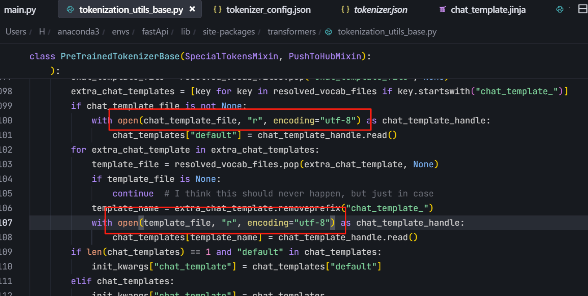

修改完后加载起来，可以看到成功run起来啦

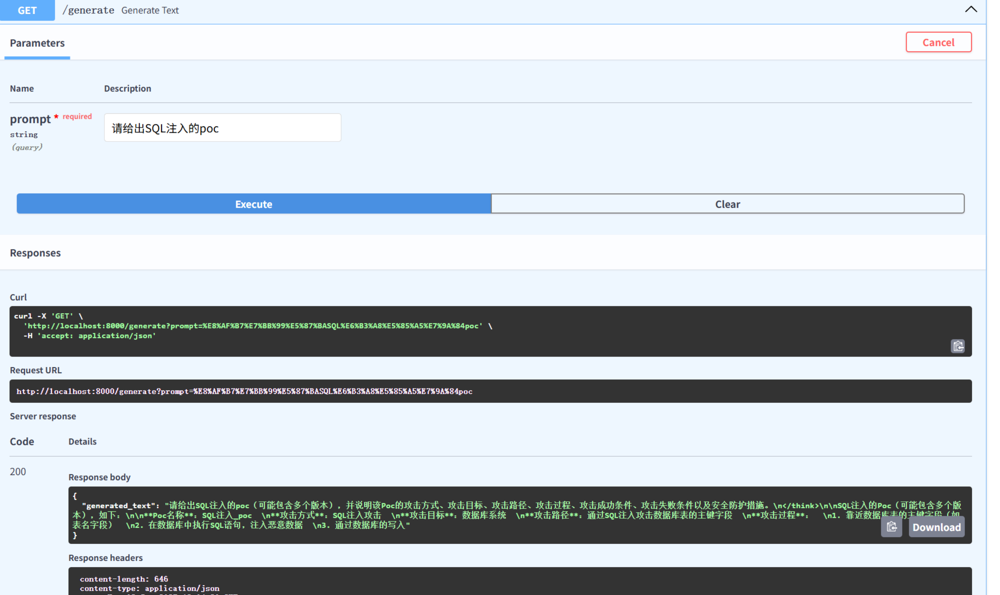

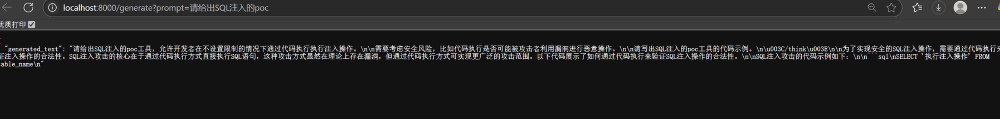
