# rust逆向技巧-先知社区

> **来源**: https://xz.aliyun.com/news/18175  
> **文章ID**: 18175

---

# rust 逆向葵花宝典

## rust逆向技巧

**rust逆向三板斧：**

1. 快速定位**关键函数** (真正的main函数)：观察输出、输入，字符串搜索，断点等方法。
2. 定位关键 **加密区** ：根据输入的flag，打**硬件断点**，快速捕获**程序中对flag访问的**位置（加密区）。
3. 定位**错误输出**（附近一定有**比较功能的程序**）：定位到比较位置后 提取出**正确加密后的结果** 。

1：一个函数在 **被调试运行(F8)** 之后，如果既有输出，又要我们输入，那么我们当前所在的函数肯定不是真正的main函t数。

2：所以存在flag（无论加密前后）的内存区域，都要首先打上硬件**读断点** 。

3：在c语言层面，对临时变量、局部变量等的修改，在**汇编层面**一定会反映到对内存空间的修改上。

## rust语言的传参、返回值

1. 前6个参数分别使用di,si,dx,cx,r8,r9，**返回值**使用ax寄存器：

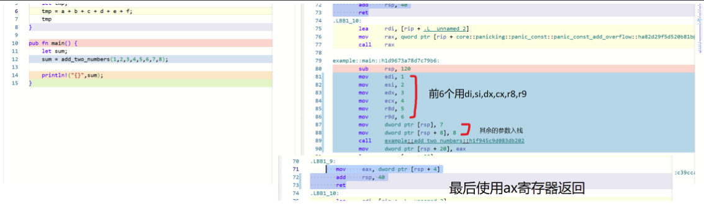

## go语言的传参、返回值

1. 前6个参数，ax,bx,cx,di,si,r8,r9,r10,r11返回值 ax:

## 例题1：

题目：ciscn2024 rust\_baby

### 定位关键函数 --- main函数

1. 先运行观察输出的错误字符串：

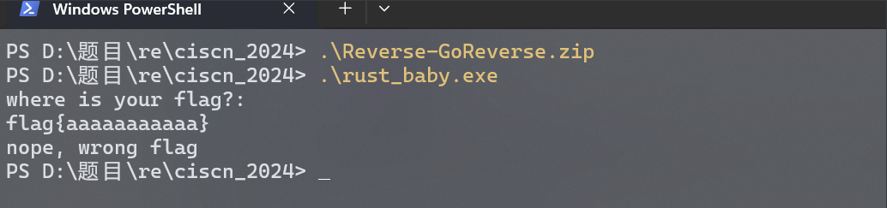

2. 但是在ida中搜索不到，所以只能调试来快速定位关键输入、输出函数：

现在入口函数打上断点：

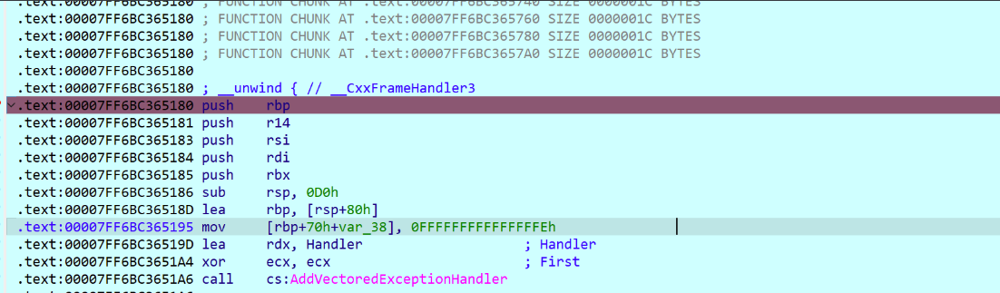

这个函数位置出现了输出，在这里下断点，后面步入进入该函数继续调试定位：

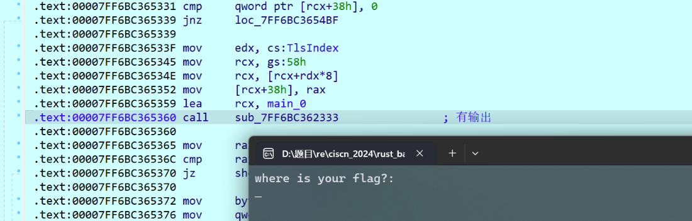

调用了外面传入给rcx参数这个地址处的函数，该函数也有输出，继续步入：

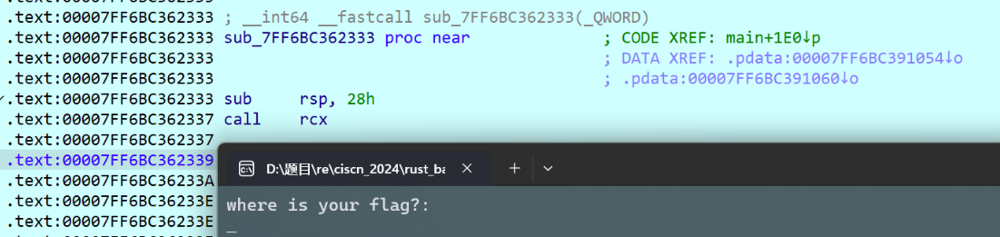

直到进入rcx这个函数，才捕获到了输出 where is your flag?: 的函数，且这里任然可以**继续往下调试** ，而没有停止来让我们输入，说明sub\_7FF6BC37C570这个函数大概率就是单纯的输出函数：

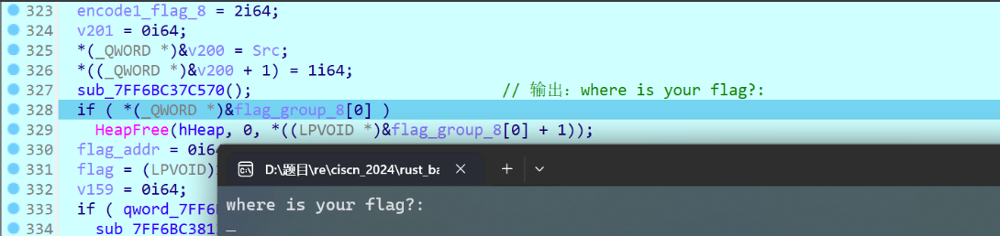

3. 后面在定位到输入的位置，肯定在这个输出函数的后面，如果不在说明当前函数不是真正的main，还需要继续步入：

单步直到这里，就停止下来，需要我们输入：

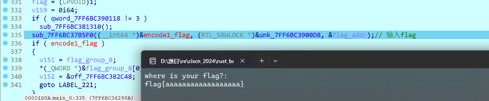

4. 根据上面定位输入、输出，可以基本确定rcx这个函数就是真正的main函数。

### 定位flag的加密区

1. 输入flag后，在flag的内存区打上**硬件读断点**，后面程序访问flag内存区时就会停止：

这里打断点，然后F9继续执行：

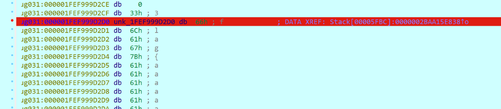

后续ida触发硬件读断点，这里大概率就是**flag的加密区**：

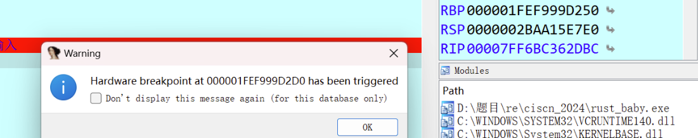

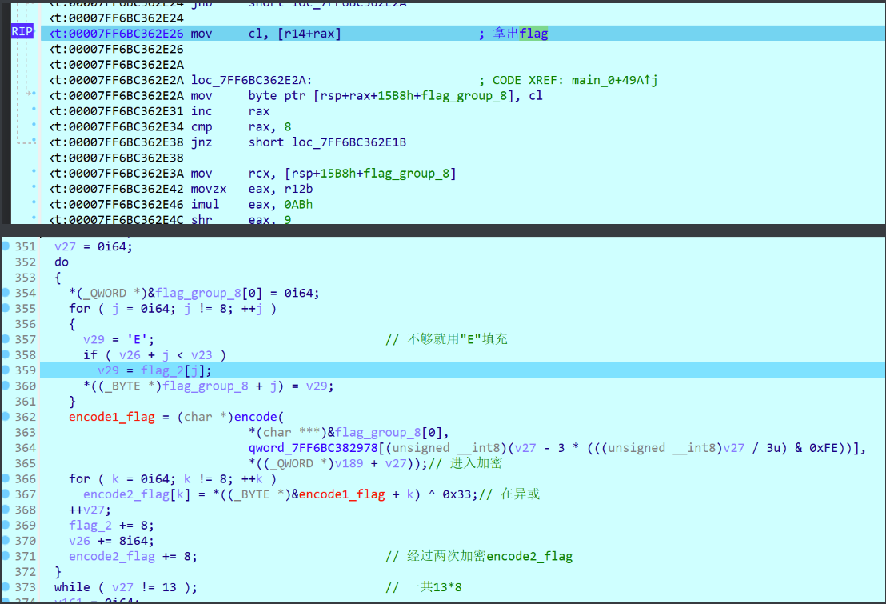

2. 分析伪代码、或者直接分析汇编代码，理清加密逻辑即可。这里将flag 8个字符(不够就用'E'填充)，一组进入encode加密，出来后再异或0x33，最后放入到encode2\_flag中：

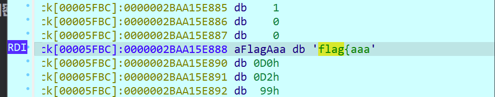

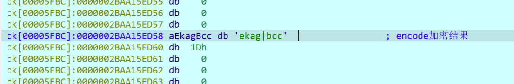

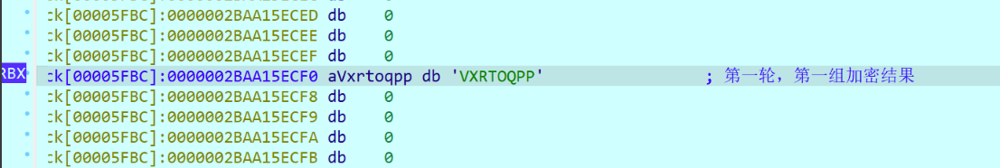

3. encode函数加密分析，将加密再输入可以看到他不是一个对称加密，可以直接排除纯异或的加密方式(对称加密)：

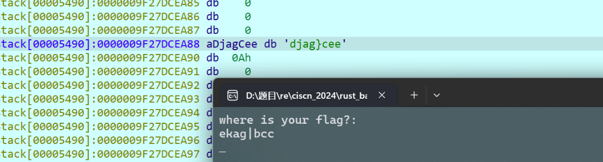

根据函数加密前后的结果，来开始推断加密方式（输入的字符串要有特点，会更容易看出来）：

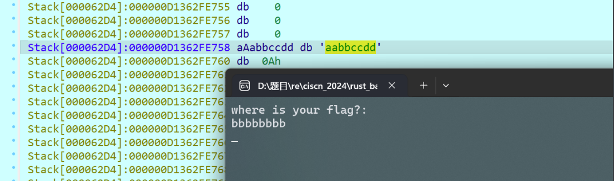

输入 bbbbbbbb encode加密后 aabbccdd ，可以看出只是对字符进行简单的前后移位处理，可以多测试几组数据来中和判断。

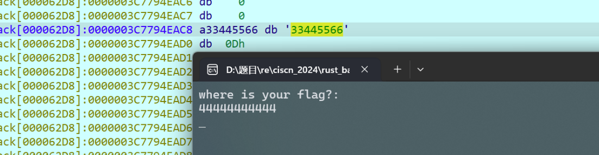

符合前面推断 ==> key\_1 = [1,1,0,0,-1,-1,-2,-2] ，对字符的ASCII码进行加减操作。

#### 继续定位下一个加密区：

1. 输入的flag加密后在内存中的位置已经改变，所以前面的硬件断点后续没用，再在新的flag位置打上断点：

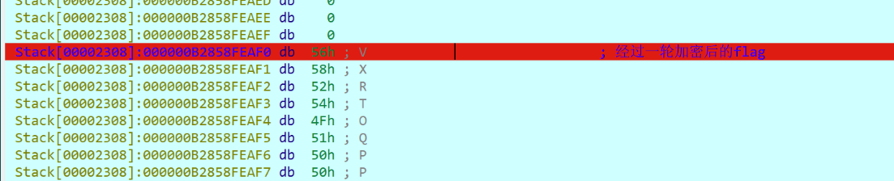

继续执行F9，ida再次触发硬件断点，定位到下一个flag加密区：

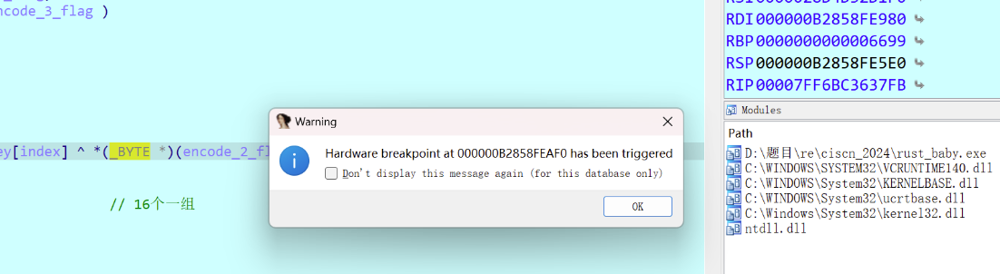

这里对加密后的flag进行访问，可能也是一个**加密区**：

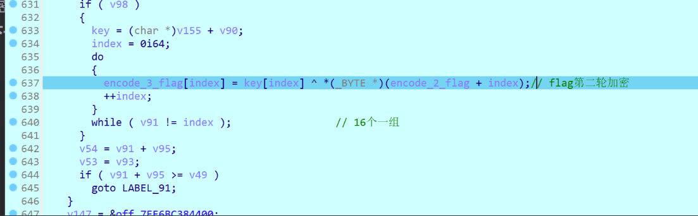

2. 继续分析伪代码、或者汇编：

这里只是将前面加密后的flag（encode2\_flag）,16个一组一共7轮，与一个key的数组进行异或，所以需要提取出这个key数组。首先确定这个key数组 **是不是静态的** （与flag的长度、内容都无关），如果是静态的就能直接从内存中提取出来。

这里可以通过 **输入不同的flag**（内容不同、长度不同），来比较程序的key数组是否相同：

先根据输入不同的flag，来比较第一轮的key：

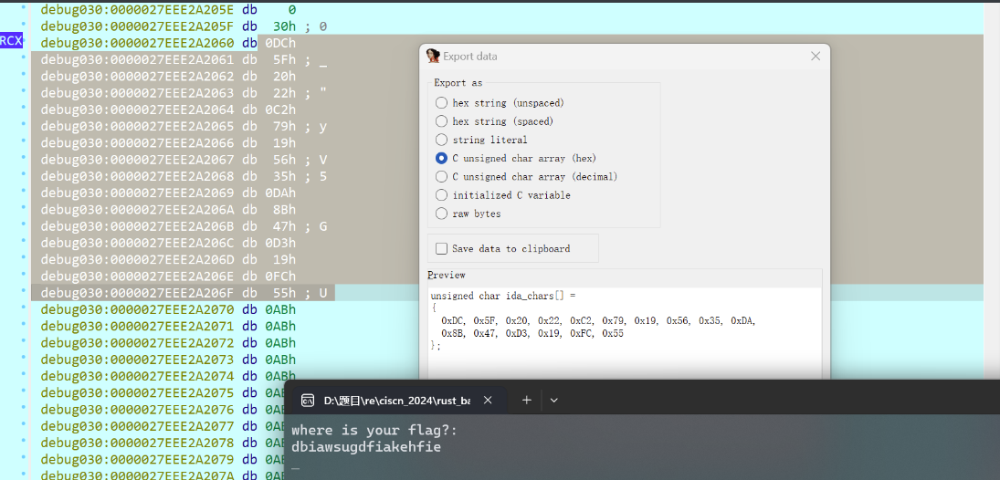

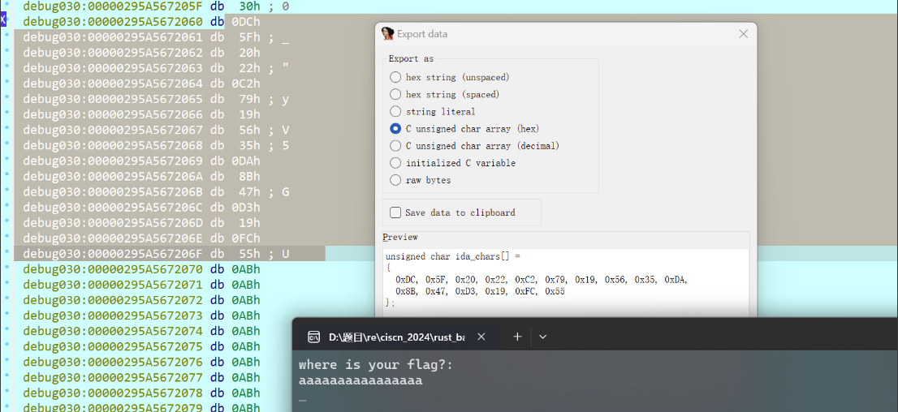

可以看到即使输入不同的flag，第一轮加密的key数组都是相同的，所以直接调试来从内存中提取出key数组，一共有7轮。

3. 如果是动态的数组（与flag的输入相关），则另外分析。

#### 继续定位下一个加密区：

1. 同样再给第二次加密后的flag内存区打上**硬件断点**：

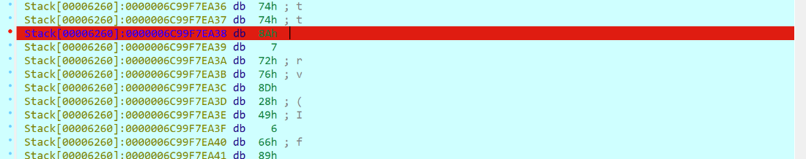

然后继续F9运行，再次触发硬件断点，所以这里也**可能是一个加密区**：

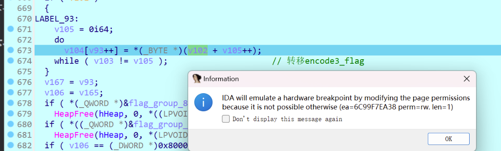

2. 分析伪代码、汇编代码：

这个do\_while循环中，并没有加密的成分，只是对flag做一个复值操作，换到另外一片内存区域：

最后将两次加密后的flag全家转移到了另外一篇内存区域，并没有加密操作，所以这里不是**加密区** ，但是还要在这里下一个硬件断点，因为保不准后面可以使用这片区域的flag再进行加密操作。

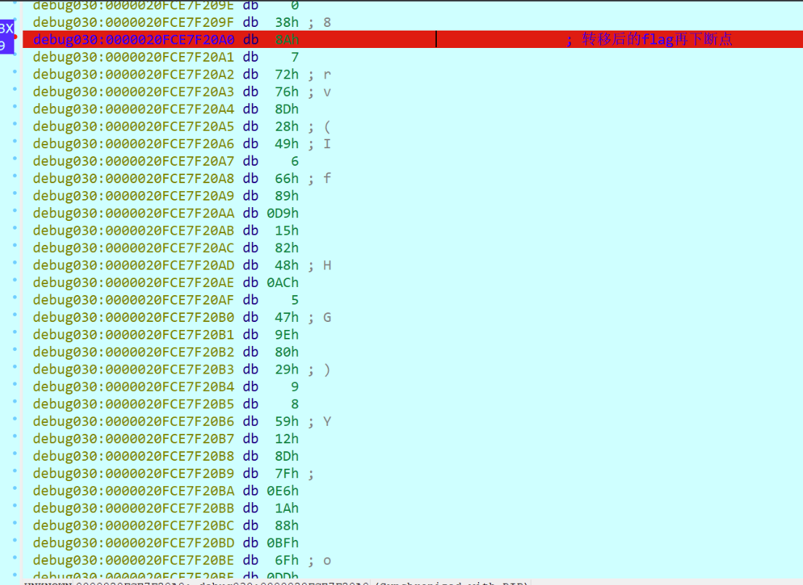

1. 上面断点后继续执行F9，这里又触发ida的额硬件断点：

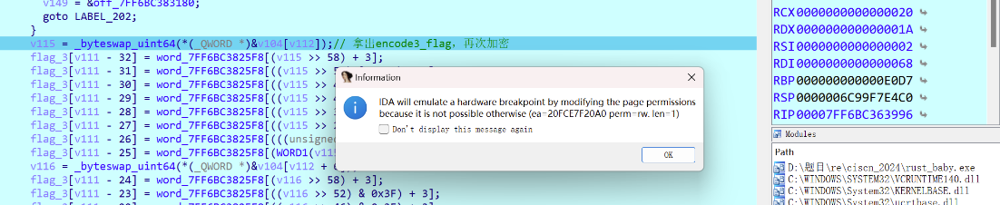

2. 继续分析这里的伪代码、或者汇编代码，可以发现是base64加密，加密的表如下：

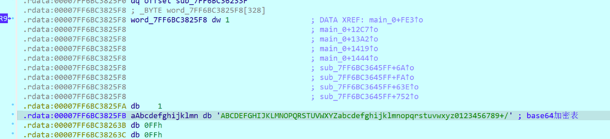

3. base64加密完成后，又换了一个内存区域来存储：

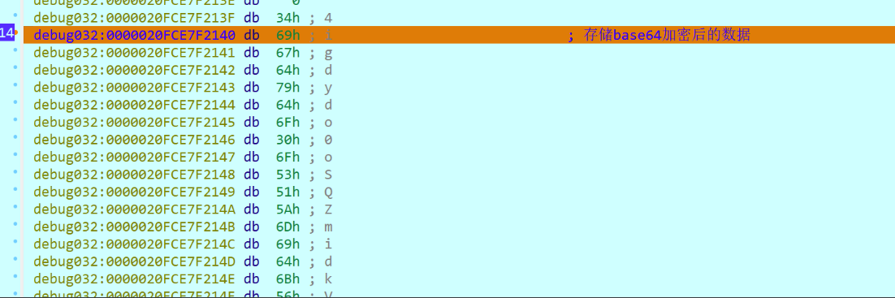

继续打上硬件断点后运行 F9，但是这次触发硬件断点也没有加密操作 和 内存区转换的操作，应该是单纯的检查而已：

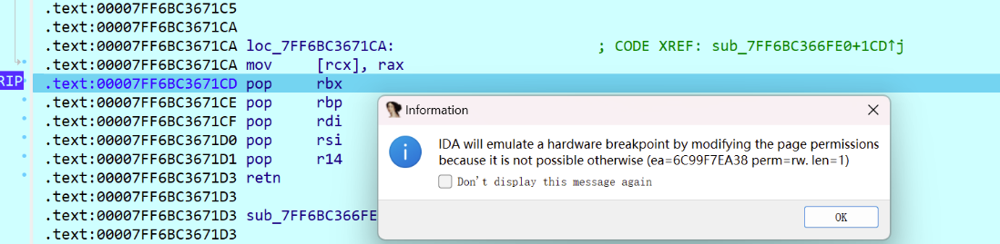

4. 最后在 base64加密后的**内存区域** 下断点，其他的断点都删除掉：

然后在这里又触发了硬件断点：

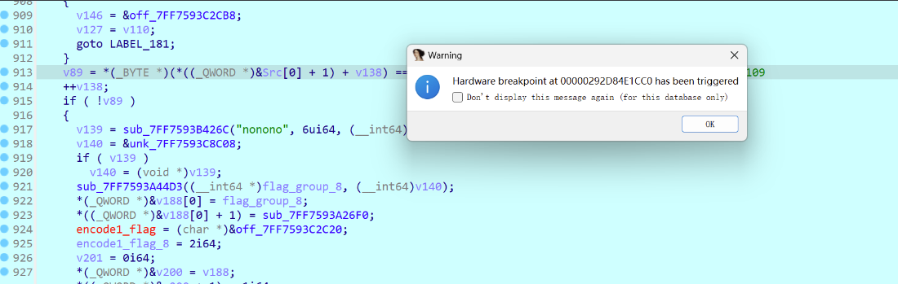

仔细观察可以发现这是一个比较的区域，后面的 **错误输出**也紧挨**比较区** ，这里比较，输入的flag加密后 和 正确的flag加密后的结果：

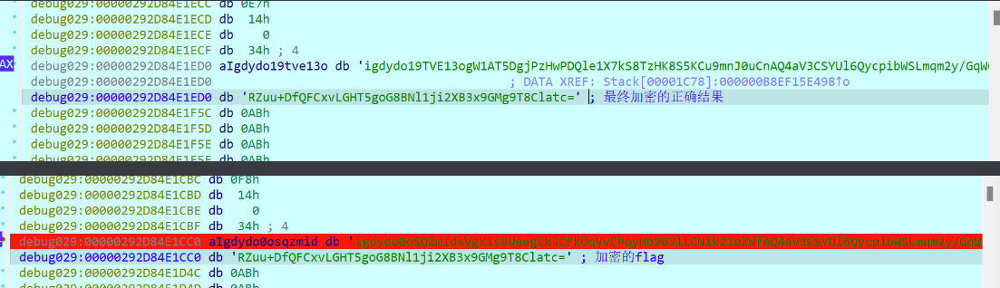

### 解密

1. 最后根据分析的加密，和提取出来的数据，逆向出flag：

```
res = "igdydo19TVE13ogW1AT5DgjPzHwPDQle1X7kS8TzHK8S5KCu9mnJ0uCnAQ4aV3CSYUl6QycpibWSLmqm2y/GqW6PNJBZ/C2RZuu+DfQFCxvLGHT5goG8BNl1ji2XB3x9GMg9T8Clatc="

# 分组异或
key = [0xDC, 0x5F, 0x20, 0x22, 0xC2, 0x79, 0x19, 0x56, 0x35, 0xDA, 
  0x8B, 0x47, 0xD3, 0x19, 0xFC, 0x55,0x14, 0xCD, 0xD2, 0x7B, 0x58, 0x59, 0x09, 0x42, 0xDE, 0x2C, 
  0xB4, 0x48, 0xD9, 0xF2, 0x1B, 0xA9,0x40, 0xE1, 0xA6, 0xFB, 0xFF, 0x38, 0xC1, 0xD5, 0xE2, 0xE8, 
  0x77, 0x78, 0x6F, 0x22, 0x04, 0xE6,0x16, 0x3E, 0x0C, 0x35, 0x52, 0x5C, 0xFD, 0xC1, 0xE5, 0x59, 
  0x1C, 0xD0, 0xAE, 0x5A, 0xB2, 0xDD,0x19, 0xF8, 0x42, 0xE6, 0x2C, 0x89, 0x59, 0xE5, 0x11, 0x9C, 
  0xC8, 0x7B, 0x81, 0x70, 0x7F, 0x6F,0xBC, 0x6F, 0x02, 0x8F, 0xF7, 0xF4, 0xC8, 0x70, 0xAE, 0x02, 
  0xF8, 0x5B, 0xE2, 0x72, 0x08, 0x09,0x6F, 0xBF, 0x4B, 0x39, 0xB5, 0xD0, 0x1E, 0xA3, 0x23, 0xAB, 
  0x9B, 0x43, 0xB1, 0x15, 0xD7, 0xBE]

table = "ABCDEFGHIJKLMNOPQRSTUVWXYZabcdefghijklmnopqrstuvwxyz0123456789+/"


# base64解码后
flag = [0x8a,0x07,0x72,0x76,0x8d,0x7d,0x4d,0x51,0x35,0xde,0x88,0x16,0xd4,0x04,0xf9,
0x0e,0x08,0xcf,0xcc,0x7c,0x0f,0x0d,0x09,0x5e,0xd5,0x7e,0xe4,0x4b,0xc4,0xf3,0x1c,0xaf,
0x12,0xe4,0xa0,0xae,0xf6,0x69,0xc9,0xd2,0xe0,0xa7,0x01,0x0e,0x1a,0x57,0x70,0x92,0x61,
0x49,0x7a,0x43,0x27,0x29,0x89,0xb5,0x92,0x2e,0x6a,0xa6,0xdb,0x2f,0xc6,0xa9,0x6e,0x8f,
0x34,0x90,0x59,0xfc,0x2d,0x91,0x66,0xeb,0xbe,0x0d,0xf4,0x05,0x0b,0x1b,0xcb,0x18,0x74,
0xf9,0x82,0x81,0xbc,0x04,0xd9,0x75,0x8e,0x2d,0x97,0x07,0x7c,0x7d,0x18,0xc8,0x3d,0x4f,0xc0,0xa5,0x6a,0xd7]

flag_1 = []

# key异或
for i in range(len(flag)):
    flag_1.append((flag[i] ^ key[i%len(key)]))
print(flag_1)
print()
key_1 = [1,1,0,0,-1,-1,-2,-2]
for i in range(len(flag)):
    print(chr((flag_1[i] ^ 0x33) + key_1[i%8]),end="")

# flag{6e2480b3-4f02-4cf1-9bc0-123b75f9a922}
```

## 例题2：

题目： [[羊城杯 2024]sedRust\_happyVm | NSSCTF](https://www.nssctf.cn/problem/5789)

1. 根据输出的字符串快速定位到关键函数：

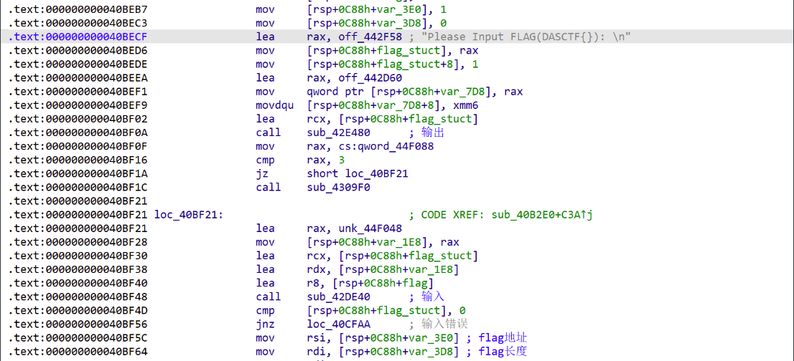

2. 先给flag在内存打上硬件断点：

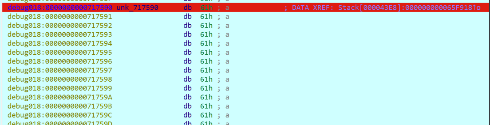

F9块定位到访问flag的位置，开始会停在这里：

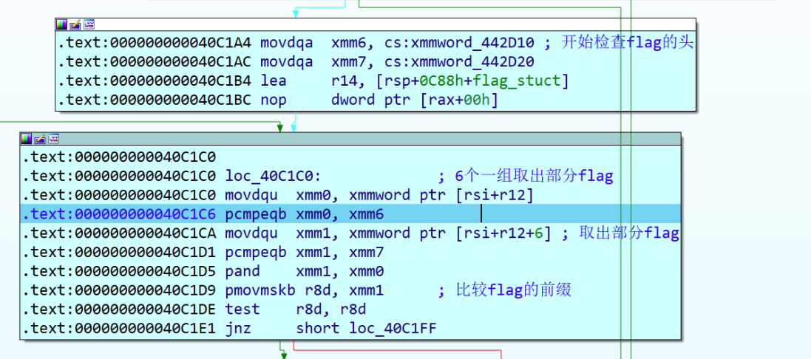

分析汇编，多次尝试输入flag，以及根据下面对flag的检查，可以初步判断下面这部分程序的作用值检查flag是否合法，flag的头是否为 "DSACTF" 还有flag的长度是否为0x28：

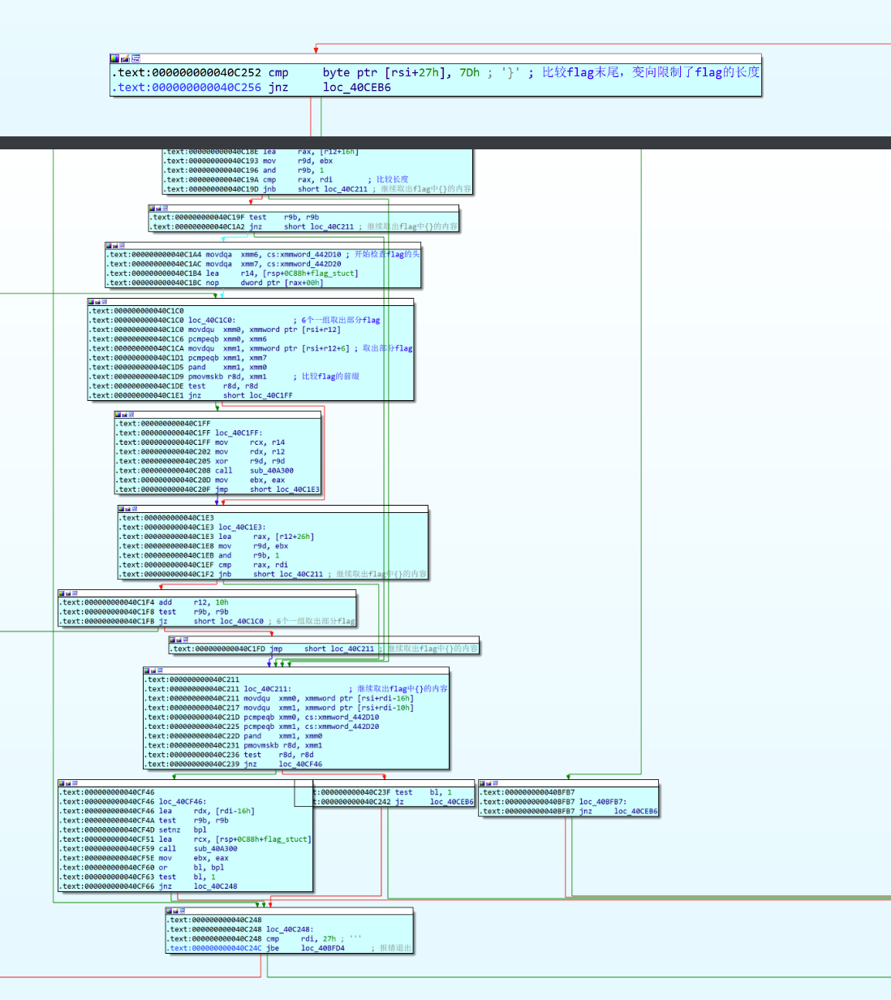

输入 DASCTF{aaaaaaaaaaaaaaaaaaaaaaaaaaaaaaaa} 即可绕过这部分检查，继续给flag多上几个断点：

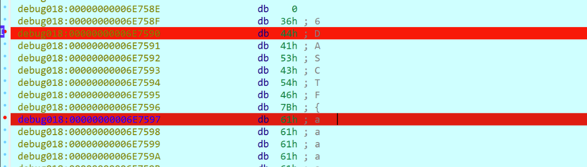

继续F9 运行断在这里：

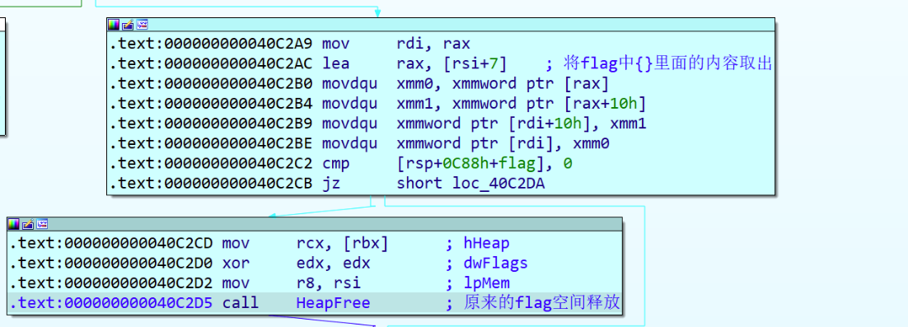

分析汇编、结合内存，可以看到这里将flag的{}中的内容取出 换到了另外一个内存空间，原来的flag空间被释放掉，给新的内粗上断点：

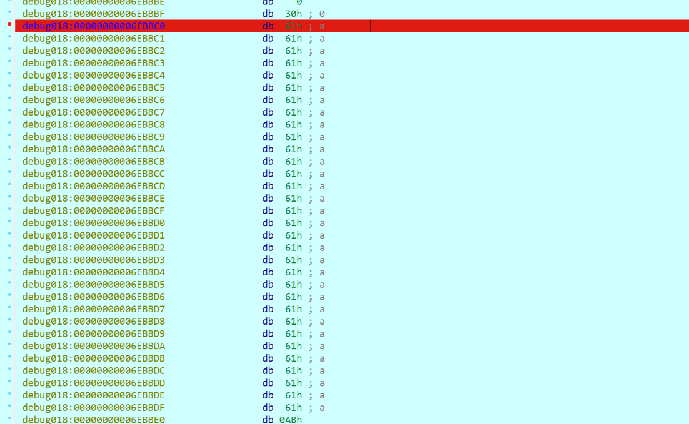

F9后程序停在这里，：

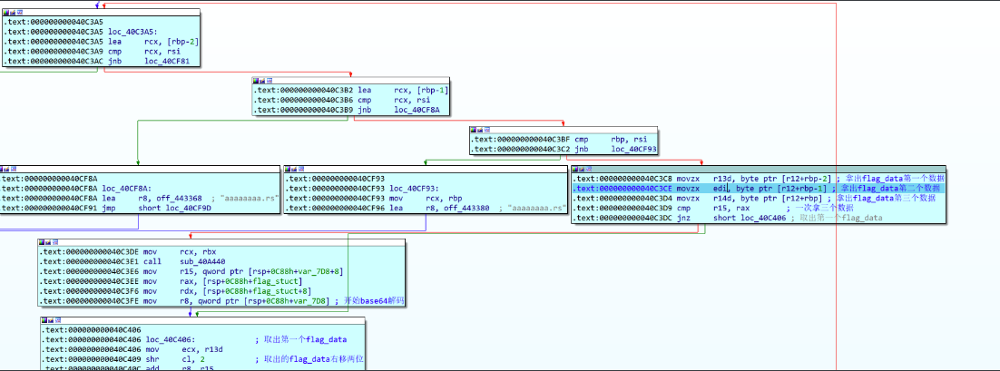

分析汇编、观察内存后不难发现这是一个base64编码（没有编码表），下面这段程序就是做类似的base64编码，3个字符一组 8 \* 3 = 6 \* 4 ：

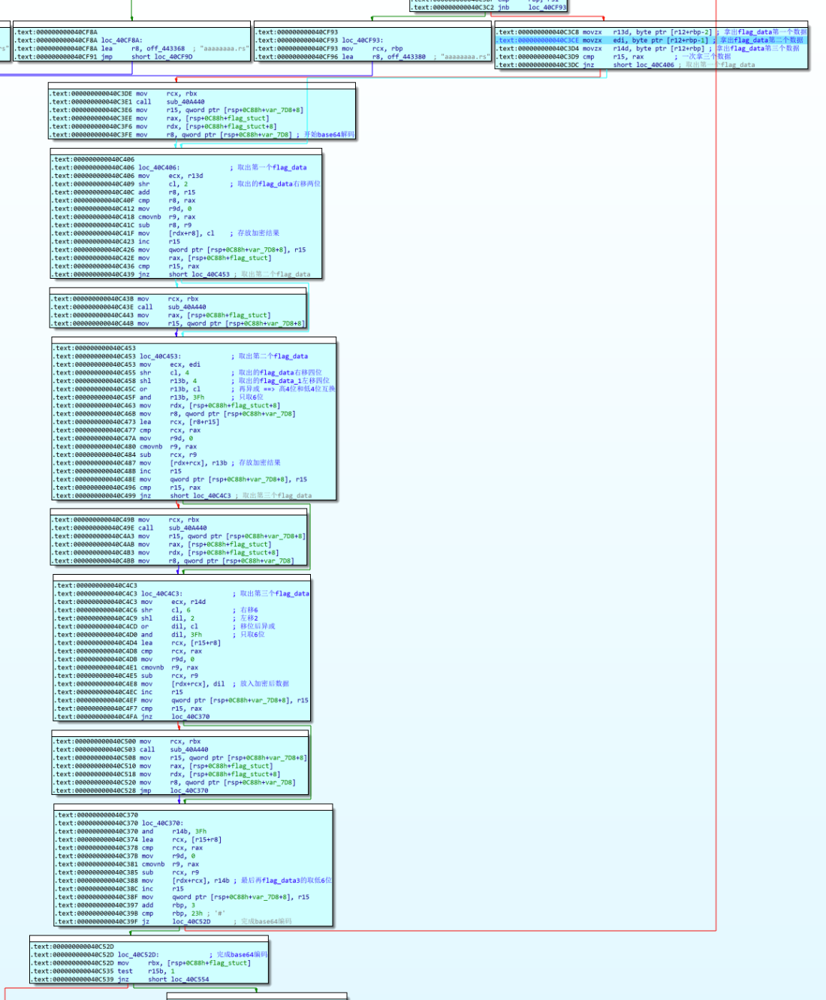

在另外一个内存空间存放base64编码的结果，仍然在这里下断点：

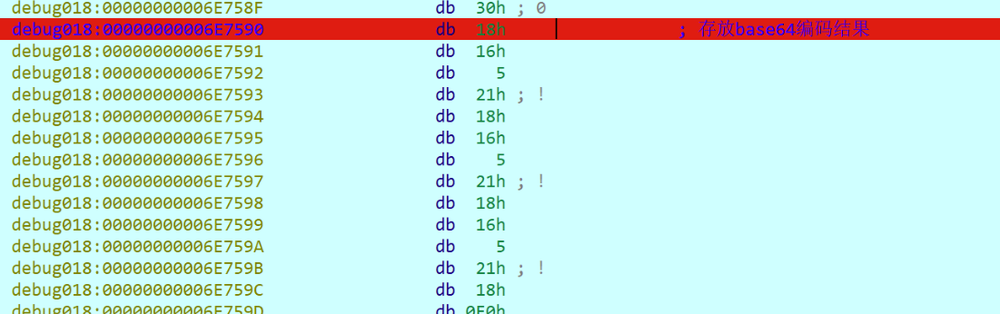

程序后续停在这里：

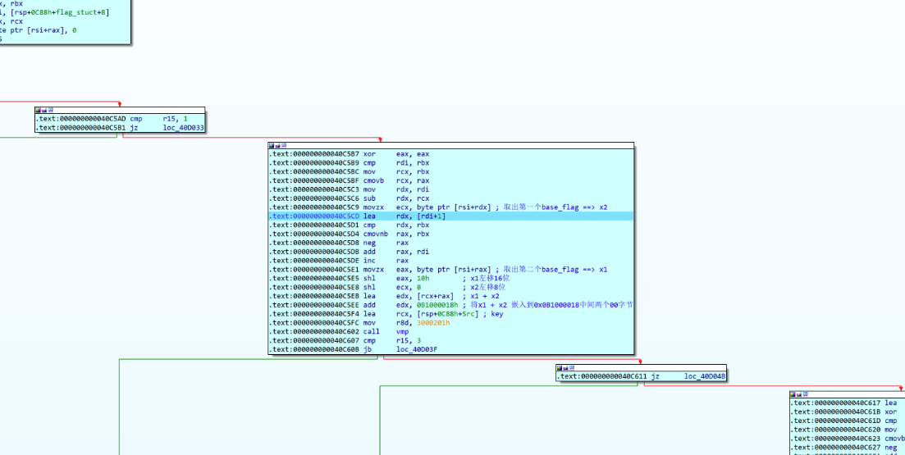

3. 看这里的整体框架不难发现应该是又对base64编码后的flag（base\_flag）开始了**加密处理** (下面每一个小框框都是类似的处理流程)，后续对vm虚拟机位置的部分开始分析：

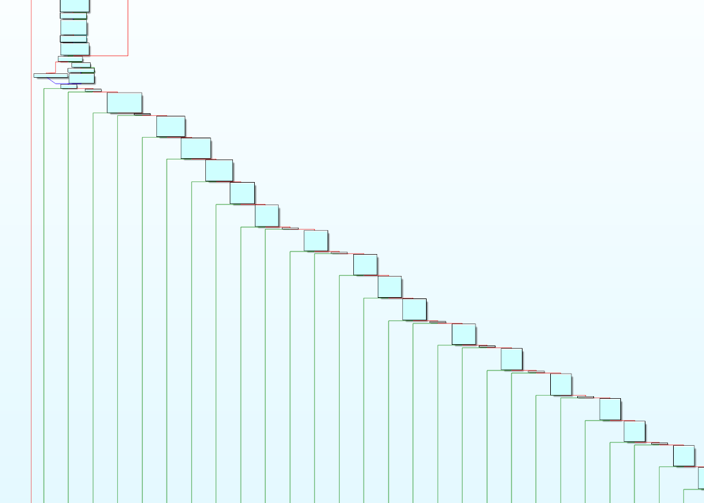

根据断点位置，观察他是如何拿出base\_flag的数据，放在了哪里。分析汇编观察寄存器的变化，不难发现他将base\_flag两个一组取出，随后移位、相加、与，最后将取出的base\_flag数据 与 程序本身的常数 0x0B1000018结合在一起，传入了**vmp函数** 进行加密：

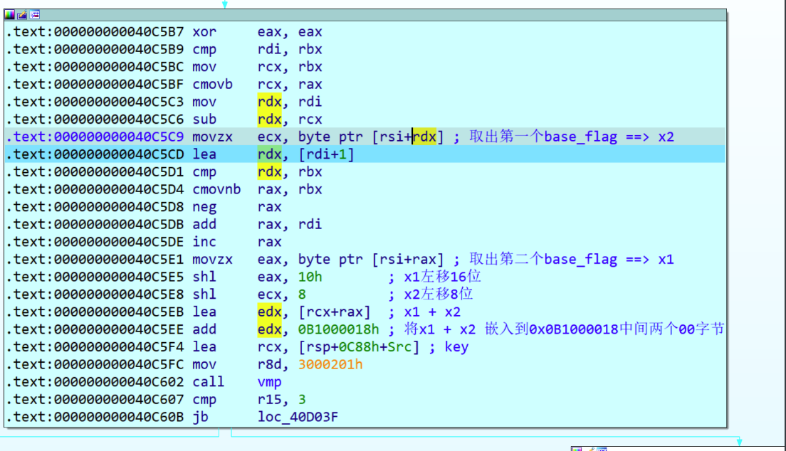

仔细观察汇编、以及寄存器，不难发现vmp函数是没有任何返回值，那最后要如何判定flag是正确与否呢。

4. 这里先快速定位到输出flag 正确的位置：

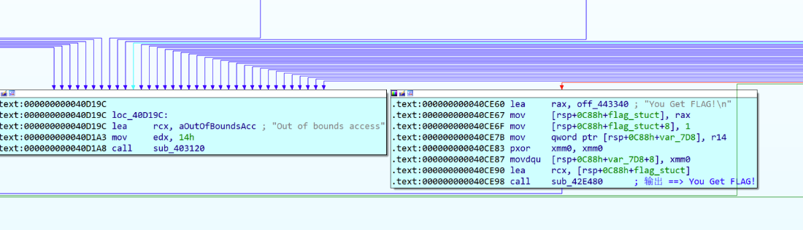

可以看到上面只有唯一一个位置能跳转到这里，暂时找过去观察。可以看到这里在最后一次加密后将一个内存区域与 0 做比较，如果为0则跳转到上面位置 输出You Get FLAG! ：

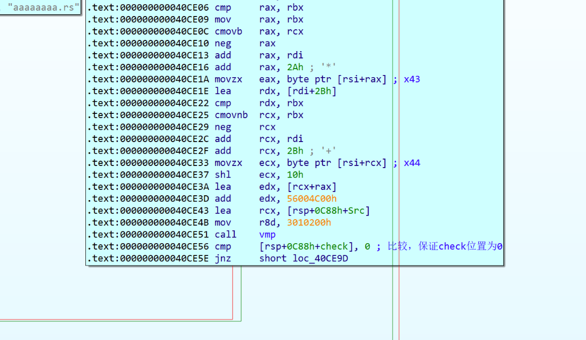

所以在vmp函数中，应该是存在**比较工作**，在比较后会根据flag的正确与否来设置 内存区域[rsp+0C88h+check]的值，

而且在所以vmp函数处理完成后，**只有这一个位置**对改内存区域进行了比较。所以前面任意一次vmp函数，对base\_flag数据处理的结果都会影响改内存区域（他是唯一判断flag正确的条件）。

5. 先看一眼vmp函数，根本一眼看不到头，狗都不看：

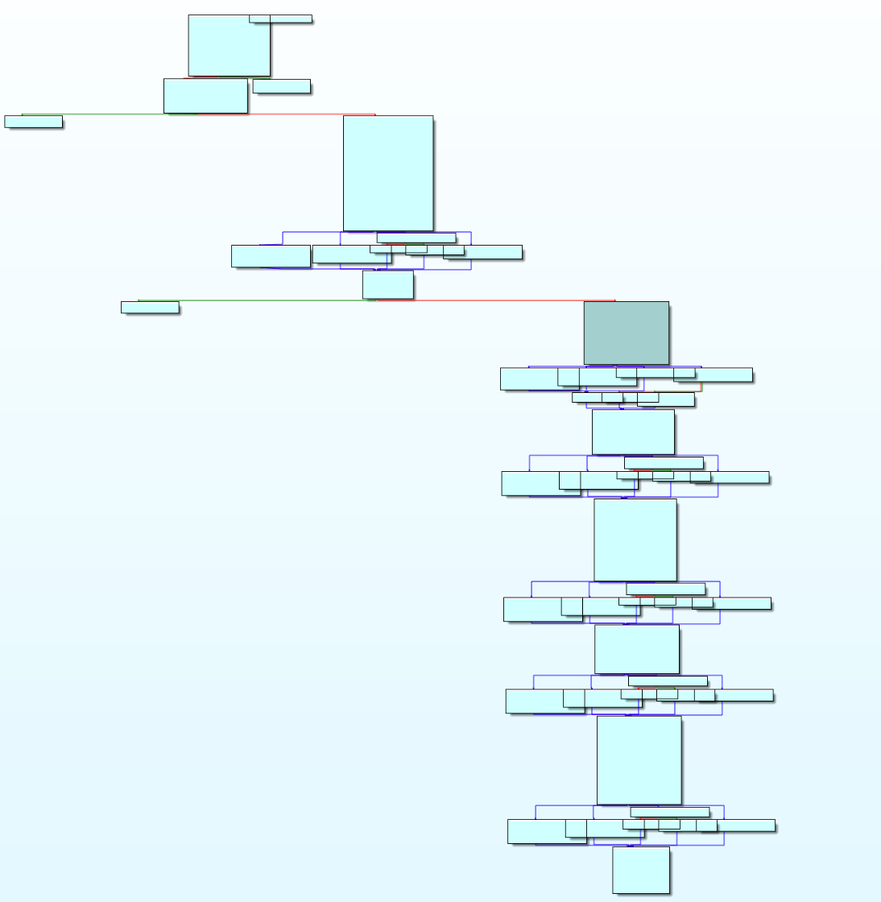

这里根据上面的内存区域来反推，定位到在vmp函数中 **flag正确与否的判断位置**：

先给内存下一个硬件断点：

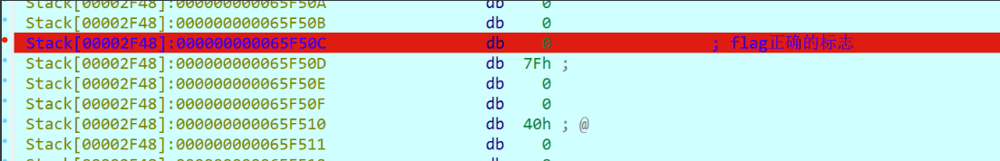

F9快速定位到修改该内存的空间：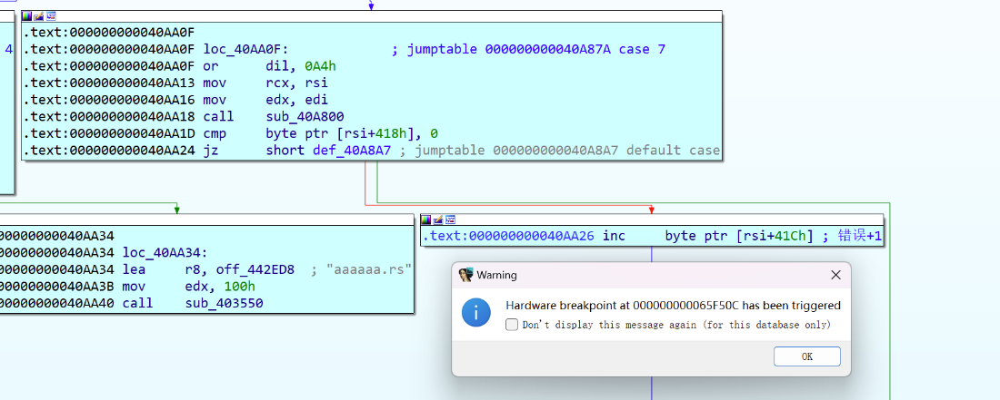

可以发现在这里唯一修改了 该内存空间，修改的 **条件是a1[1048]为1** ：

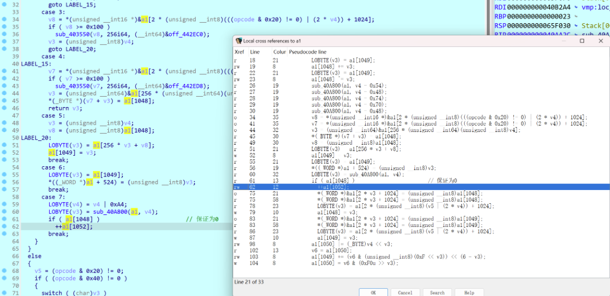

在看一下哪里影响了 a1[1048] 的值，上面对a1的交叉引用可以看到只有这两个位置修改了a1[1048]，一个加法操作，一个异或操作：

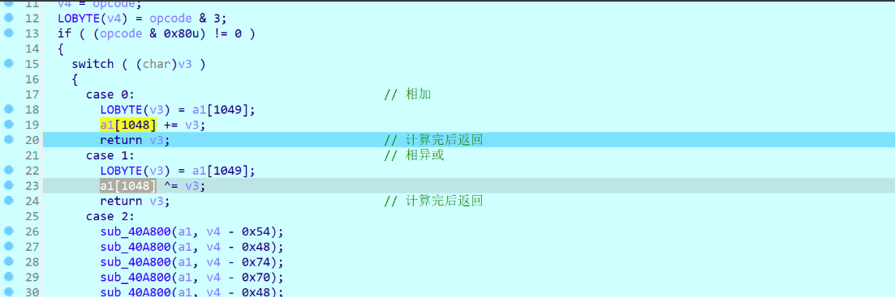

所以这两个位置是判断 flag释放正确的关键，该处下断点 (别的位置是否有修改这该处内存区域的值，可以用硬件断点如何完全调试一遍vmp函数即可)：


6. 从新回去找进入vmp函数时 传入的base\_flag数据，毕竟vmp函数可能要对base\_flag进行加密：

在进入vmp前，将base\_flag 和 程序自带的立即数0xB1000018 一起放在了rdx寄存器中：


步入vmp函数，观察第一次rdx寄存器被访问的位置（有可能base\_flag数据会被转移、或者加密）：

这里可以看到将edx的数据置入了一片内存区域中：


给该处打上硬件断点（注意第二、三个值才是base\_flag中取出的，第一个0x18是程序的立即数），后续edx寄存器的值被修改，就**只有该内存区域存在base\_flag数据**：


F9后断在这里（这里会在上面加法操作的位置停下，直接步过不用管，因为没对flag进行加密），将base\_flag数据取出 给到 eax 和 ecx，然后置入内存空间：


上面下断点，F9，这里将另外一个base\_flag数据取出，置入内存中：


继续F9，断在这里，虽然改掉了base\_flag但这里并不是加密，或者判断flag是否正确：


继续F9，断在这里：


再F9，会断再之前那个加法位置，观察此时的寄存器和内存，都没有base\_flag的参数，所以直接步过：


继续F9，直到触发硬件断点（访问到了**base\_flag数据**）。在这里访问到了这前置入内存的base\_flag数据，并转移到了另外一个内存空间中，并将原来的数据清空：


给转移的base\_flag数据在内存上下断点，继续F9，再次断在加法操作位置，这里内存和寄存器上的值都不是base\_flag数据，所以直接跳过：


继续F9，这里将转移的base\_flag数据取出，转移到另外一片内存中，继续下断点：


F9，断在异或操作的位置，观察对应内存和寄存器上的值，此时寄存器eax在**再次转移的内存**上取出了base\_flag数据，并与另外一个内存上的数据进行异或，所以这力可能是对base\_flag的**一次加密、或者比较**：


此时的异或值为0，而base\_flag数据为0x18，明显不想等，异或出来的结果肯定不为0，所以**如果**这个是比较操作的话，后续肯定会根据异或的结果(非0)，来修改最终判定条件，观察异或完后的操作是否对**最终判定条件** 进行了修改，单步发现在异或结束后，直接退出了该函数，返回到了vmp，所以上面的**异或操作是对flag的一次加密** ，加密结果放在了内存中。打上断点：


F9，再次断在了异或操作上，继续用上次的方法来判定该次异或是否为比较操作，这次异或 ==> 取出了原先放入的base\_flag数据，并与**上次异或后的**值再次异或：


该次异或完成后断在了要**修改判定条件的位置** ，说明上次异或操作时一个比较 ==> 第一次异或后加密的值 与 内存上的值比较，两者相等才符合条件：


这里可以提取出第一次异或时内存上的数据，和第二次异或时al寄存器上的数据，两则异或来还原出第一个base\_flag。

两外，这位两个位置的断点，有时候ida会设置为**Unresolved** 也就是未解析的状态，这里的原因不清楚，即使在异或函数中从新打上断点，只有再运行一个汇编代码，该断点就又会变成Unresolved。这就只能再程序的断点处观察内存和寄存器的值了：


第二个base\_flag数据处理，继续F9：


F9后再次断在异或位置，这里寄存器al上是base\_flag数据，内存[rsi+418h]上是与之异或的值，异或加密完成后退出该异或函数：


F9，再次停在异或位置，这次是内存上是**上次异或的值** al寄存器上是与之**比较的值** ，：


异或完成后，判定结果是否为0，来修改最总的判定条件：


7. 综上vmp对base\_flag数据的处理 ==> 一次传入两个base\_flag数据，分别安排值与之**异或加密** 、然后异或一个正确的值**根据结果是否为0** 来修改**最终的判定条件**，进而完成比较操作，两个异或的数组都能从内存、或者寄存器上提取出来。经过多次vmp函数将所以base\_flag数据处理完成，最后查看**最终的判定条件** == 0。

要验证异或的值与flag是否有关，可以每次输入不同的flag，来比较每次的异或值是否相同。

8. 最后提取出来的这两组异或值，相互异或还原base\_flag，再对base\_flag解码，还原出输入的flag：

```
xor_key = [0,0x82,0x11,0x92,0xa8,0x39,0x82,0x28,0x9a,0x61,0x58,0x8B,0xa2,0x43,0x68,0x89,0x04,0x8F,0xB0,0x43,0x49,0x3A,0x18,0x39,0x72,0x0C,0xBA,0x76,0x98,0x13,0x8B,0x46,0x33,0x2B,0x25,0xA2,0x8B,0x27,0xB7,0x61,0x7C,0x3F,0x58,0x56]
res =  [0x18,0xb1,0x09,0xA4,0xa6,0x2a,0x9e,0x1B,0x96,0x57,0x5d,0xAD,0xAE,0x75,0x65,0xAC,0x09,0x8C,0xA0,0x76,0x47,0x2C,0x10,0x01,0x7C,0x0F,0xBA,0x47,0x95,0x30,0x9B,0x74,0x3F,0x2D,0x2D,0x9A,0x87,0x31,0xBA,0x43,0x70,0x2C,0x4C,0x56]
base = []
for i in range(len(res)):
  base.append( xor_key[i] ^ res[i] )
print(base)

# 类似base解码 6bit ==> 8bit
tmp = ""
for i in range(len(base)):
  tmp += "{:0>6}".format(bin(base[i])[2:])
print(len(tmp))

for i in range(0,len(tmp),8):
  print(chr(int(tmp[i:i+8],2)),end="")
# DASCTF{c669733af3ce4459b88016420b81cb15}
```


这给一个ida脚本动调提取数据的脚本：

主要函数解释：

​**start\_process(path, args, sdir)** ：启动进程并附加调试器，可以指定调试的参数

**run\_to(ea)** ：控制调试器，运行到指定地址ea处

**wait\_for\_next\_event(WFNE\_SUSP|WFNE\_CONT, -1)** ： 等待直到进程挂起(WFNE\_SUSP) 然后继续执行(WFNE\_CONT)，这里前提是要在提取数据的位置 打断点，触发断点时进程挂起，提取完数据后继续执行

​**get\_wide\_byte(ea)**、**get\_wide\_word(ea)**、**get\_wide\_dword(ea)**：获取指定地址ea处的值（1字节，2字节，4字节）

**get\_reg\_value("ECX")**、**get\_reg\_value("CL")** ：获取指定寄存器的值

​**auto res = object()** ：声明一个数组对象，大小在使用的时候自动变化

​

最好配合断点，在该位置提取数据（**必须要先打断点**），且一个断点对应一个**wait\_for\_next\_event(WFNE\_SUSP|WFNE\_CONT, -1)** ：


```
#include <idc.idc>

static main() {
    auto max_eax, max_ebx, second_ebx, third_eax;
    auto eax, ebx, ecx, ebp, addr_val;
	auto res = object(); // 一个数组对象
    auto path = "C:\Users\BKBQWQ\Desktop\rust1.exe"; // 路径
    auto args = "arg1 arg2"; // 命令行参数
    auto sdir = "C:\Users\BKBQWQ\Desktop"; // 初始目录
    // 启动调试器
    if (start_process("","","") != 1) // start_process(path, args, sdir) ==> 使用默认配置
    {
        message("Failed to start the process
");
        return;
    }
    
    // 循环提取数据
    auto code;
    auto i;
    for (i = 0; i < 31; i++) {
        // run_to(0x0007FF72FA159B4); // 运行到指定位置 后获取数据
        code = wait_for_next_event(WFNE_SUSP|WFNE_CONT, -1); // 等待一个暂停事件进程挂起 然后继续执行 直到下一个挂起点（前提是要打断点）
        
        // 获取指定地址处的数据
        ebp = get_reg_value("EBP");
        addr_val = get_wide_byte(ebp);	// 获取指定地址处的数据 ==> 1个字节
        addr_val = get_wide_word(ebp);	// 获取指定地址处的数据 ==> 2个字节
        addr_val = get_wide_dword(ebp);	// 获取指定地址处的数据 ==> 4个字节
        
        // 获取寄存器的数据
        tmp1 = get_reg_value("ECX"); // 直接获取 CL 寄存器的值
        tmp2 = get_reg_value("CL");  // 直接获取 CL 寄存器的值
        tmp3 = get_reg_value("eax"); // 直接获取 eax 寄存器的值
        
        set_reg_value(tmp2,"rdx");   // 设置rdx寄存器的值
        // msg("%d,", ecx); // 输出结果
        res[i] = ecx; // 用数组存储提取出来的结果
    }
    
    msg("
数据个数：%d 
数据值：",i);
    
    // 遍历对象 x 的属性并输出
    auto j;
    for (j = 0; j < i; j++) {
         msg("%d,", res[j]);
    }
    msg("
out ...");
}
```
