# 某企业终端防病毒系统简单分析-先知社区

> **来源**: https://xz.aliyun.com/news/18189  
> **文章ID**: 18189

---

# 某企业终端防病毒系统

**Ha1ey@深蓝攻防实验室**

**​**

**本文章仅供学习交流使用，文中所涉及的技术、思路和工具仅供以安全为目的的学习交流使用，任何人不得将其用于非法用途以及盈利等目的，否则后果自行承担！**

## 前言

帮助大家发现问题QAQ

​

PS：以下安全问题已有对应的补丁修复

## 鉴权

项目目录来看是经典的MVC

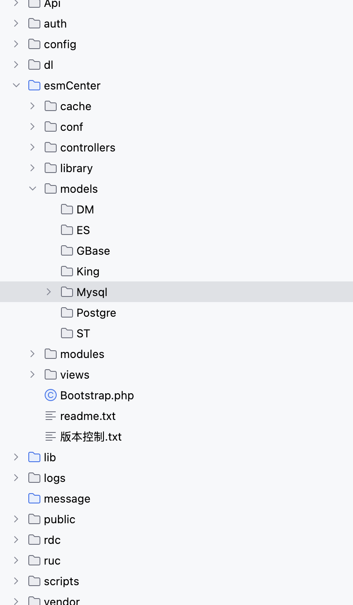

只要是继承了MyController都需要session

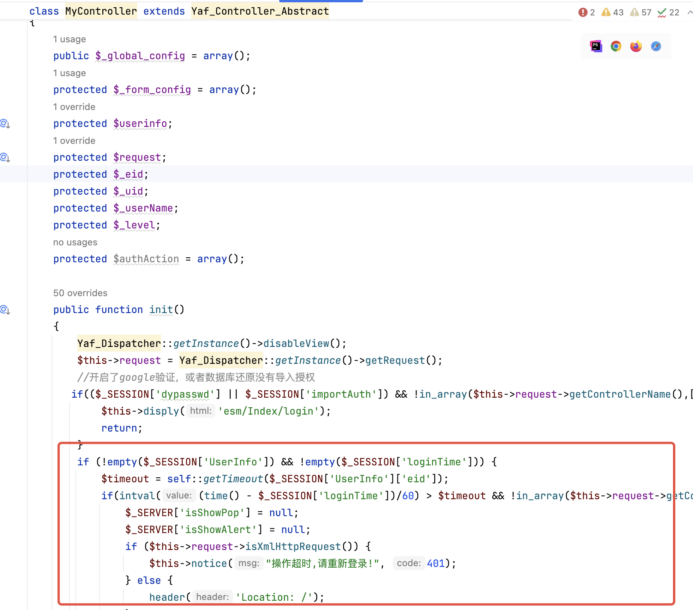

但是后面有几个不需要鉴权的Controller

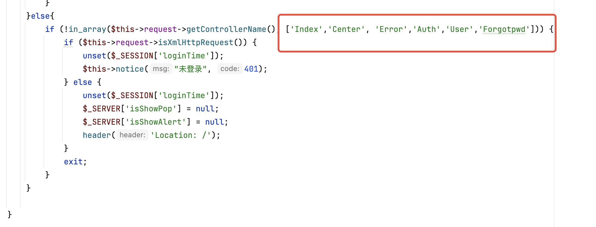

除了MyController还有一个ApiController，此控制器下都是不需要鉴权的

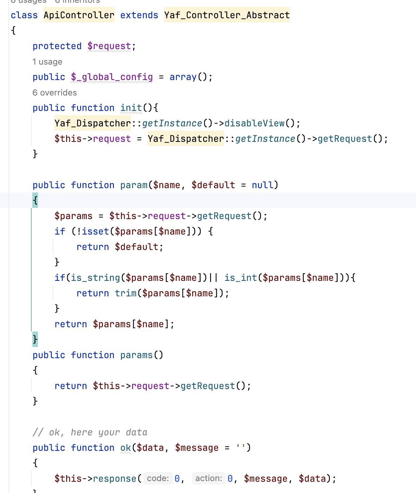

## 问题点

### 用户注册

来看用户相关的控制器`UserController`,前面的几个方法开头都需要获取session中的username或者eid，这些都不是我们可以利用的点

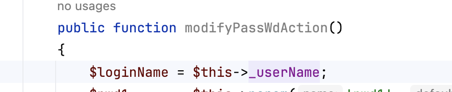

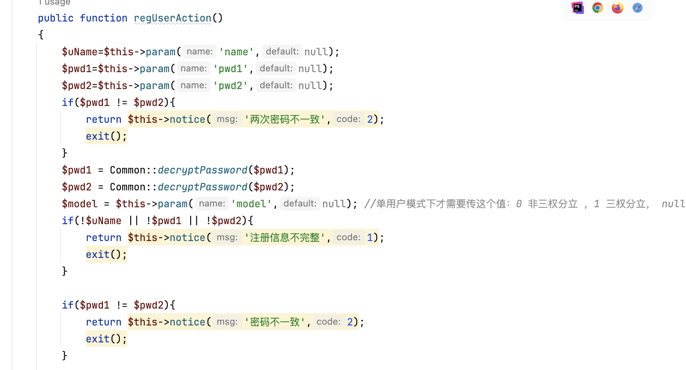

往后看找到`regUserAction`方法，直接从request中获取了我们传入的参数进行解密

可以看到这里调用了`regUser`方法

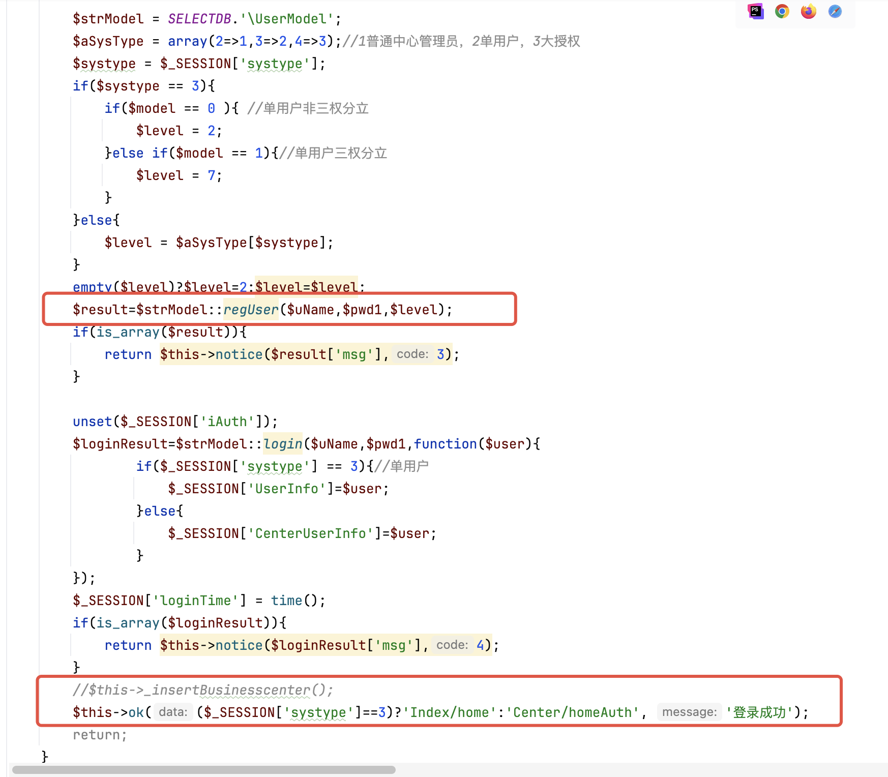

这个方法会检查用户名是否存在，不存在直接插入数据库

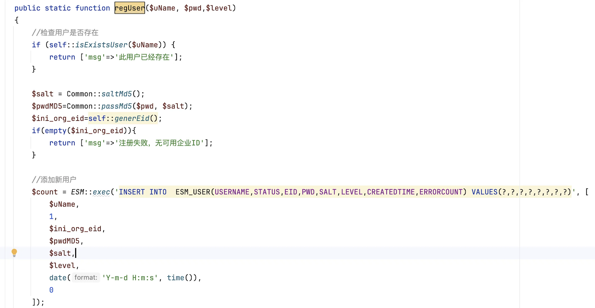

测试效果

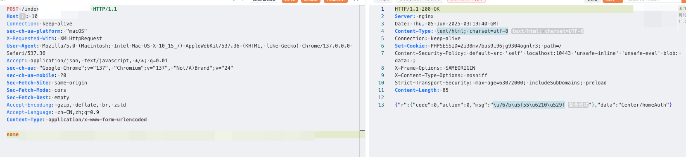

### RCE

这里一个后门控制器`PageController`。。。。。。简单粗暴 exec执行命令

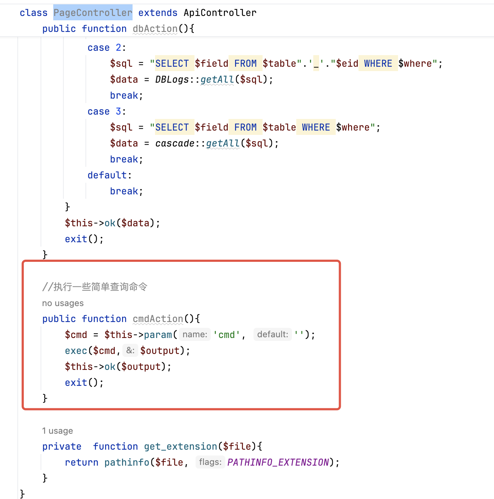

测试效果

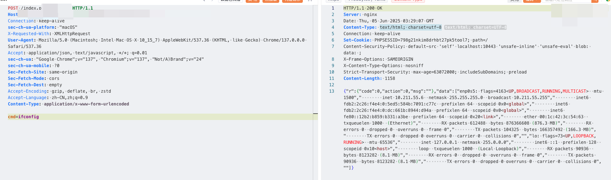

### 文件上传

同样是在`PageController`控制器下的一个方法，，比较简单单纯的文件上传，另外还有命令执行的拼接

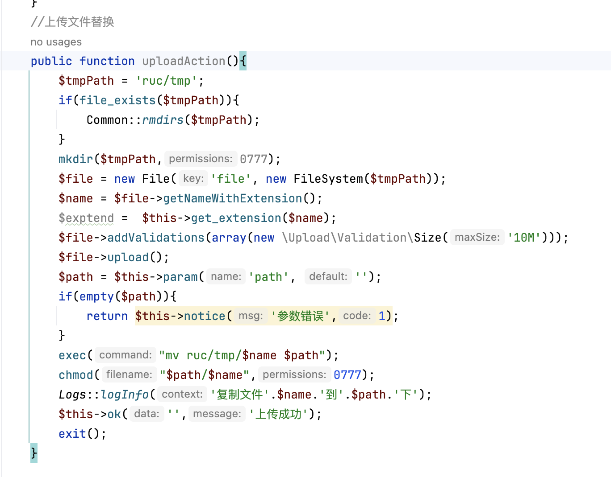

测试效果

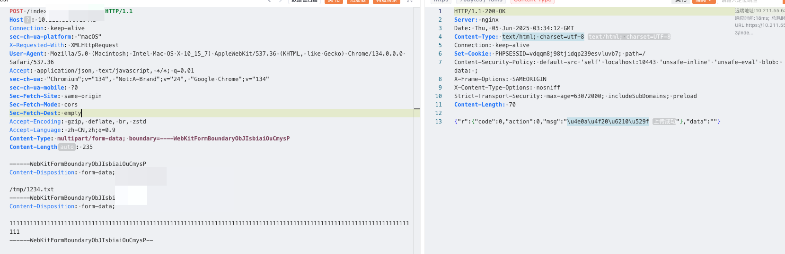
