# 某手__ns_sig3逆向分析-先知社区

> **来源**: https://xz.aliyun.com/news/18191  
> **文章ID**: 18191

---

app: Y29tLnNtaWxlL{beihai\_delete}mdpZm1ha2VyIDExLjQuMjA=

IDA Professional 9.0.7z

链接: <https://pan.baidu.com/s/1XIj94WFxKFEQ9cox4rgKDw?pwd=wz5a> 提取码: wz5a

​

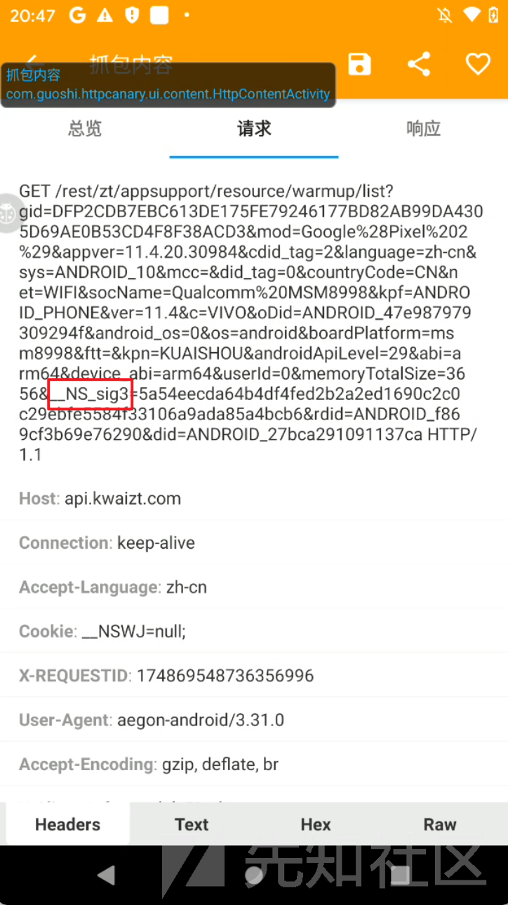

## java层

​

在源码中搜索一下，发现hashmap中传入了\_\_NS\_sig3，可以看到\_\_NS\_sig3对应的键值为b4，b4是由函数b得到的

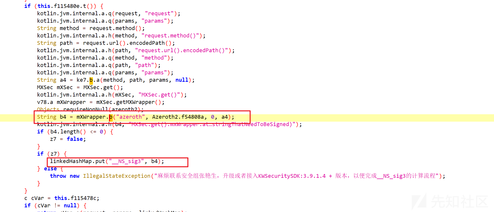

一开始是尝试使用hook hashmap打印调用栈的方式来追踪\_\_ns\_sig3的生成，但是发现一旦hook了java.util.HashMap，应用就卡住了。hook其他进程就没事，猜测是做了检测。。。。。。那就尝试直接通过反编译代码追踪吧

### 源码追踪

追踪函数b

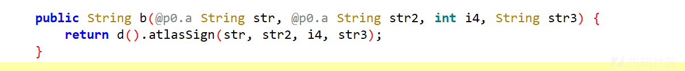

键入查看函数atlasSign，发现存在于接口中，查看接口引用，查找接口的实现

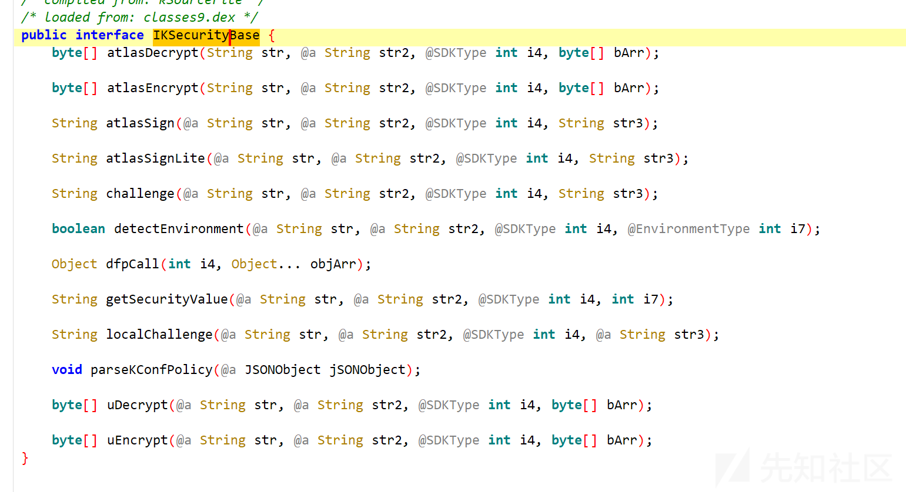

进入查看

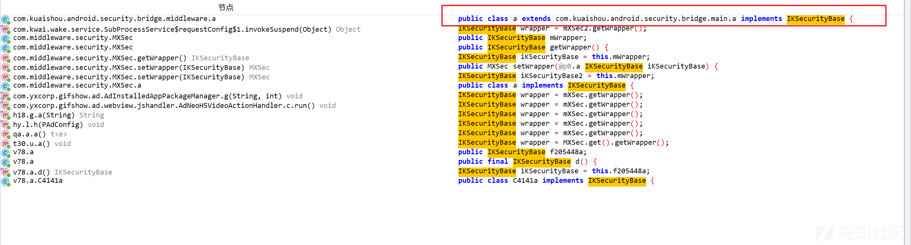

发现atlasSign调用了函数d

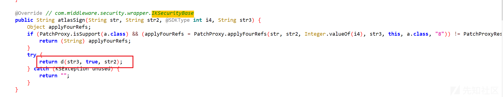

进入函数d，直接找return的位置，发现有三个，其中有两个是空字符串，肯定不是要找的ns\_sig3的生成部分。我们要追踪分析的只有中间的那一个。中间的流程最后会调用d().b()或者d().c()

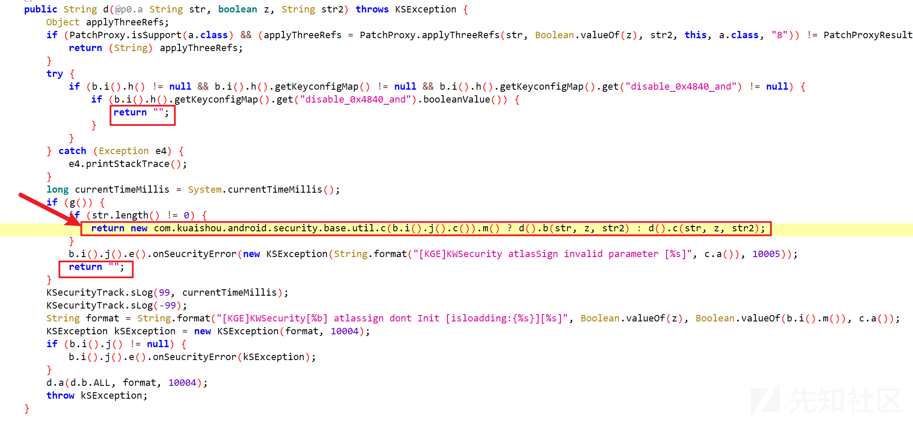

查看函数b()和函数c(),发现b()和c()的结构大差不差。通过hook查看一下走哪个，发现调用的是函数c

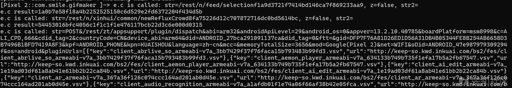

查看函数c,同样是先寻找return的位置，再分析之前的代码，可以一定程度提高效率。可以看到最后会返回a4.g().a()。这个a4对象是在第一个红框的代码中进行初始化的，中间还使用了com.kuaishou.android.security.internal.dispatch.e.a(this.f8447a).e().e函数对a2进行了某种操作

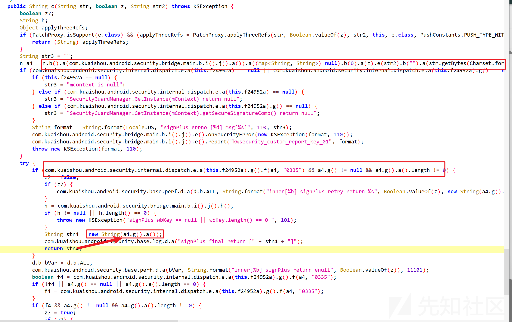

下面就把整段代码缩小到了下面这三行代码。

```
(1)n a4 = n.b().a(com.kuaishou.android.security.bridge.main.b.i().j().a()).a((Map<String, String>) null).b(0).a(z).e(str2).b("").a(str.getBytes(Charset.forName("UTF-8"))).a();

(2)com.kuaishou.android.security.internal.dispatch.e.a(this.f24952a).g().f(a4, "0335") 

(3)String str4 = new String(a4.g().a());
```

通过分析发现 第一行看着复杂，实际上是对com.kuaishou.android.security.internal.plugin.n.a类对象进行各种属性的初始化（这里的追溯过程操作单一重复，就不展示了）其中传入参数str会赋值给属性f25000f

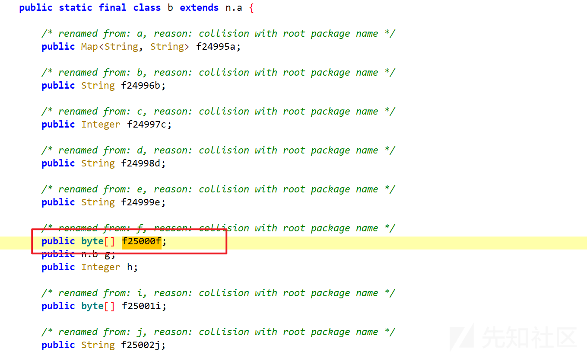

第三行的a4.g().a()会返回b的属性f25022a，也就是\_\_ns\_sig3的字节流

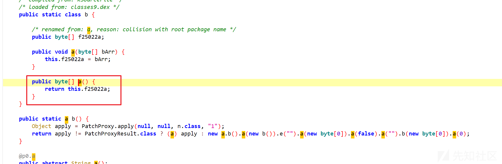

接着自然是查找一下a(byte[] bArr)的用例，也就是对属性f25022a进行赋值的函数。发现有12个调用。逐一浏览后，无法确定那个跟目标sig3有关。先稳住，因为暂时也不确定是哪个跟这条链有直接关系。

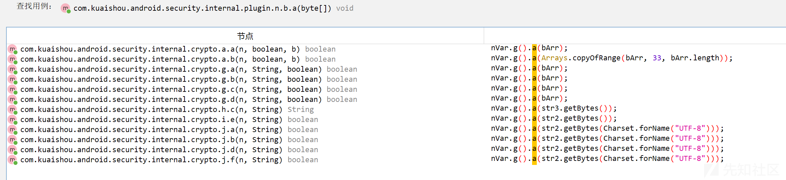

来看看中间那一行代码。com.kuaishou.android.security.internal.dispatch.e.a(this.f24952a).g().f(a4, "0335") 直接键入最后一个f函数，也就是f(a4, "0335")。发现是一个接口里面的函数

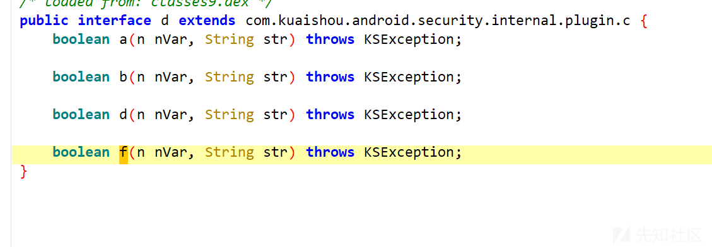

继续查看引用

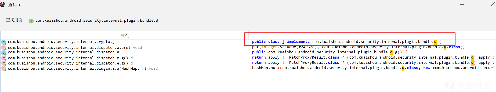

查看j中的f，发现其中就存在对属性f25022a的赋值，f25022a为str2的字节流形式，而str是由函数a生成的

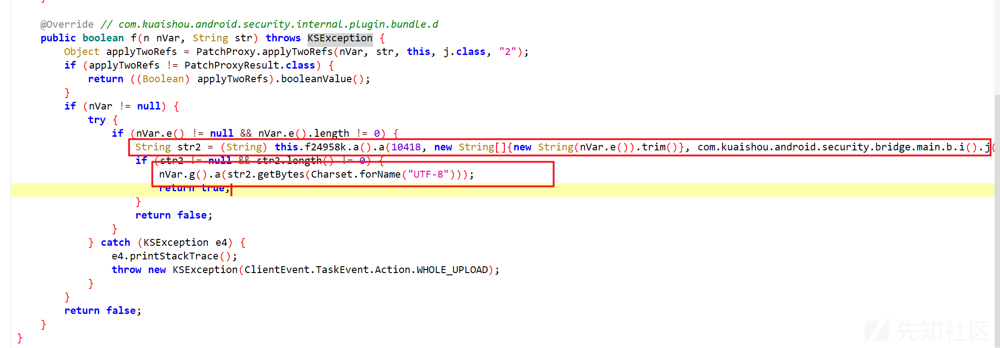

查看a发现又是一个接口

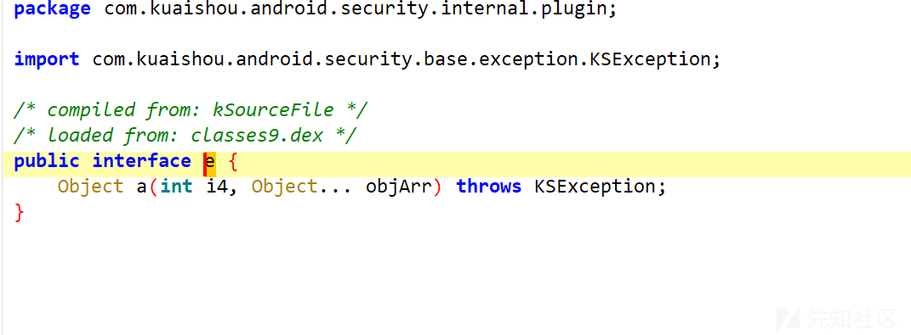

继续查看引用

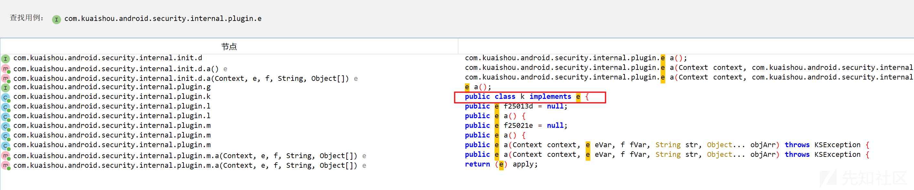

可以看到返回的是JNICLibrary.doCommandNative(i4, objArr)

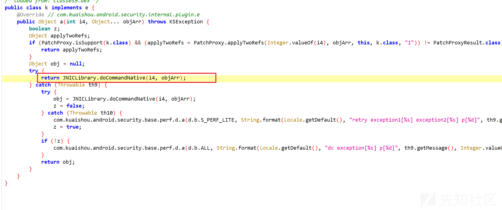

最终发现doCommandNative(i4, objArr)是native函数

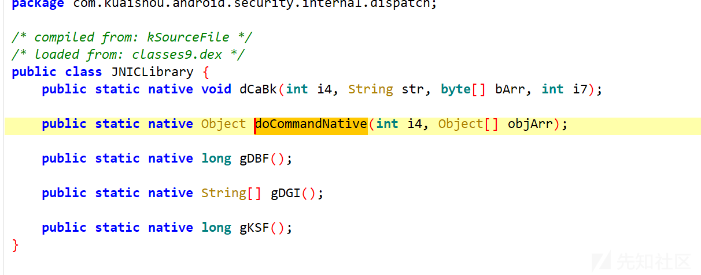

hook一下，doCommandNative返回的正是\_\_ns\_sig3，证明前面的追踪结果是正确的

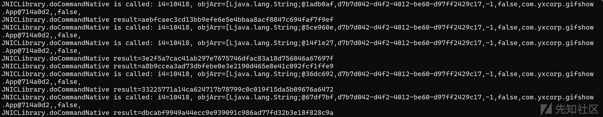

### 定位库

但是并不清楚加载的是哪个so文件。于是反着找看看能不能发现什么信息。查看class k的用例

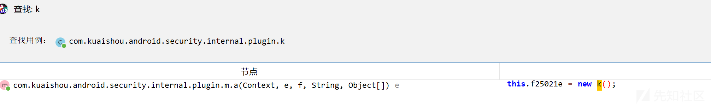

键入，可以看到有疑似打印日志的代码，显示的是加载库，推断上面的函数a跟加载库有关

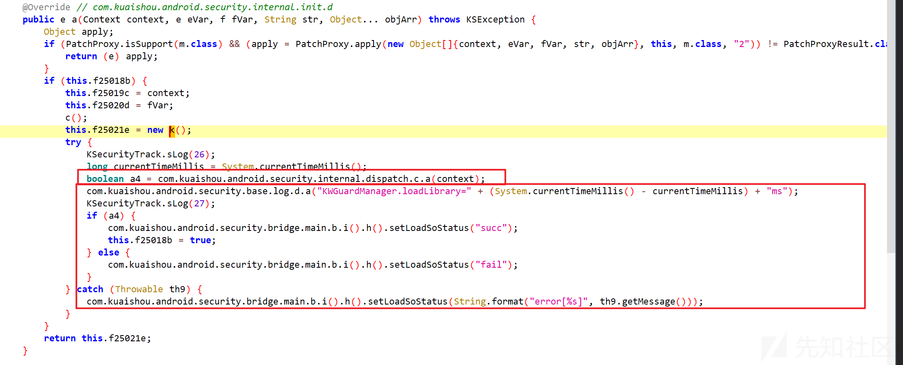

查看函数a

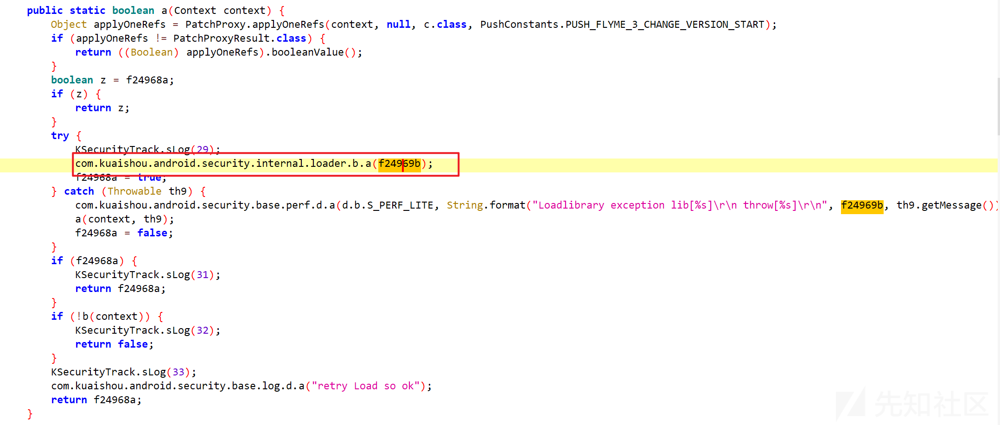

发现这个f23969b就是库名

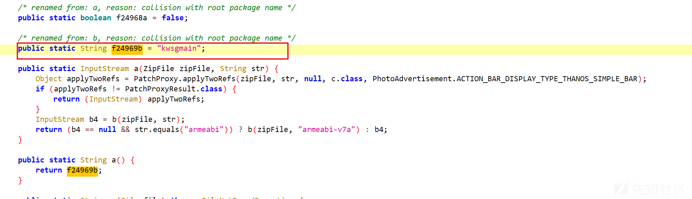

hook一下函数a

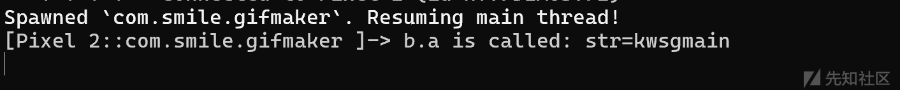

这样也就大致确定了doCommandNative所在的库

​

​

## so层

### 去花

对于这个部分龙哥分析的很详细：<https://www.yuque.com/lilac-2hqvv/zfho3g/issny5?#yGLEd>

这里简要记录一下学习过程

可以看到jumpout，这种一般都是因为在so中添加了花指令，导致ida因为栈不平衡或者跳转地址是计算后的而无法正确反编译

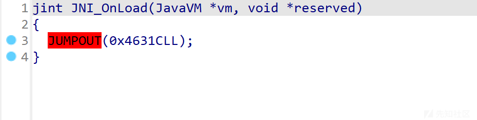

既然高级语言（伪代码）看不了，我们就来看一下汇编。可以看到这里不是正常函数开辟栈的操作。首先这个函数开辟的栈空间很小，其次arm64架构约定X0-X7 使用时不需要保存

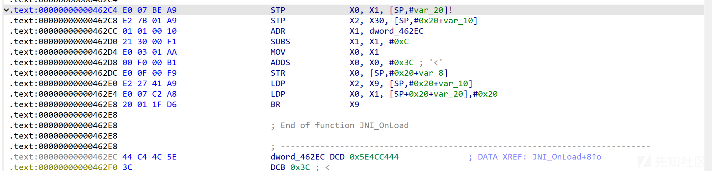

仔细阅读后发现，

```
ADR X1, dword_462EC           =>X1=462EC
SUBS X1, X1, #0xC             =>X1=462E0
MOV X0, X1                    =>X0=462E0
ADDS X0, X0, #0x3C            =>X0=4631C
```

指令STR X0, [SP,#24]和LDP X2, X9, [SP,#16]实际上就是把X0的值传给X9，也就是说X9为4632C。所以最后br跳转到0x4632C

手动patch一下，把其他nop掉，然后BR X9改成B 0x4631C也就是直接跳转到真正的地址，之后函数就能正常反编译了

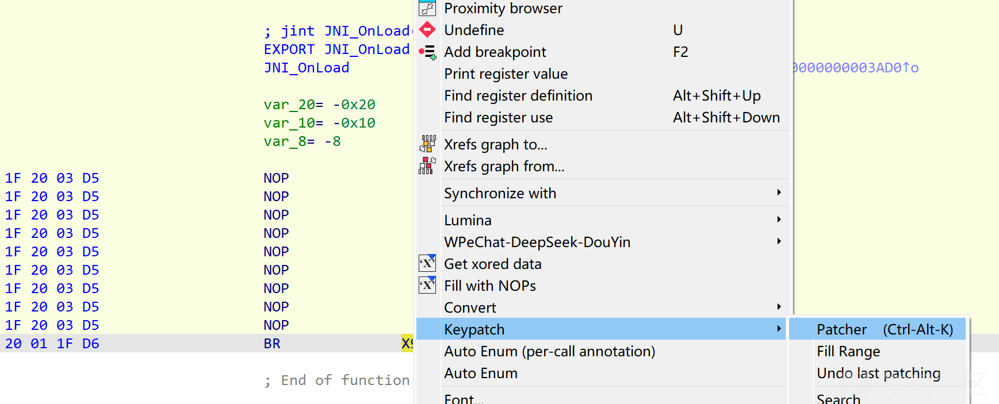

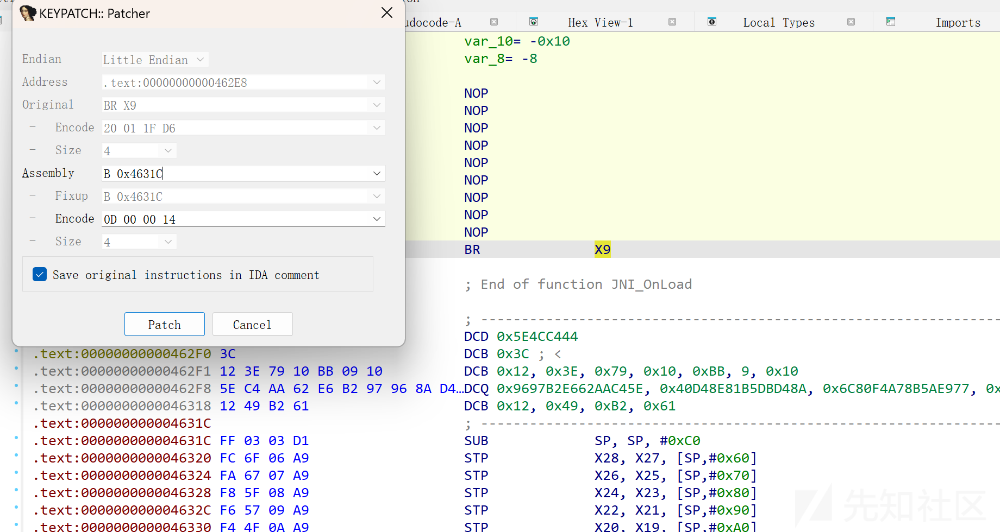

接着编写脚本识别花指令，批量去花

```
import keystone
from keystone import *
import ida_bytes
import idaapi
import idc
import flare_emu


# 来自叶谷雨的代码 O(∩_∩)O
def binSearch(start, end, pattern):
    matches = []
    addr = start
    if end == 0:
        end = idc.BADADDR
    if end != idc.BADADDR:
        end = end + 1
    while True:
        addr = ida_bytes.bin_search(addr, end, bytes.fromhex(pattern), None, idaapi.BIN_SEARCH_FORWARD,
                                    idaapi.BIN_SEARCH_NOCASE)
        if addr == idc.BADADDR:
            break
        else:
            matches.append(addr)
            addr = addr + 1
    return matches


myEH = flare_emu.EmuHelper()
def getJumpAddress(addr):
    myEH.emulateRange(startAddr=addr, endAddr=addr + 36)
    return myEH.getRegVal("X9")


def makeInsn(addr):
    if idc.create_insn(addr) == 0:
        idc.del_items(addr, idc.DELIT_EXPAND)
        idc.create_insn(addr)
    idc.auto_wait()


def generate(code, addr):
    ks = Ks(keystone.KS_ARCH_ARM64, keystone.KS_MODE_LITTLE_ENDIAN)
    encoding, _ = ks.asm(code, addr)
    return encoding


matches = binSearch(0, 0, "E0 07 BE A9 E2 7B 01 A9")
for addr in matches:
    print("try:" + hex(addr))
    makeInsn(addr)
    targetAddr = getJumpAddress(addr)
    code = f"B {hex(targetAddr)}"
    bCode = generate(code, addr)
    nopCode = generate("nop", 0)
    ida_bytes.patch_bytes(addr, bytes(bCode))
    ida_bytes.patch_bytes(addr + 4, bytes(nopCode) * 9)
```

加载脚本后，重新分析程序

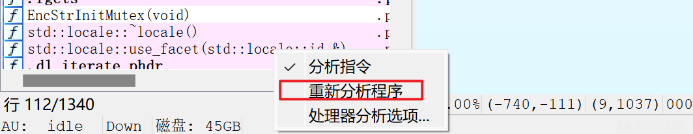

然后保存一下即可

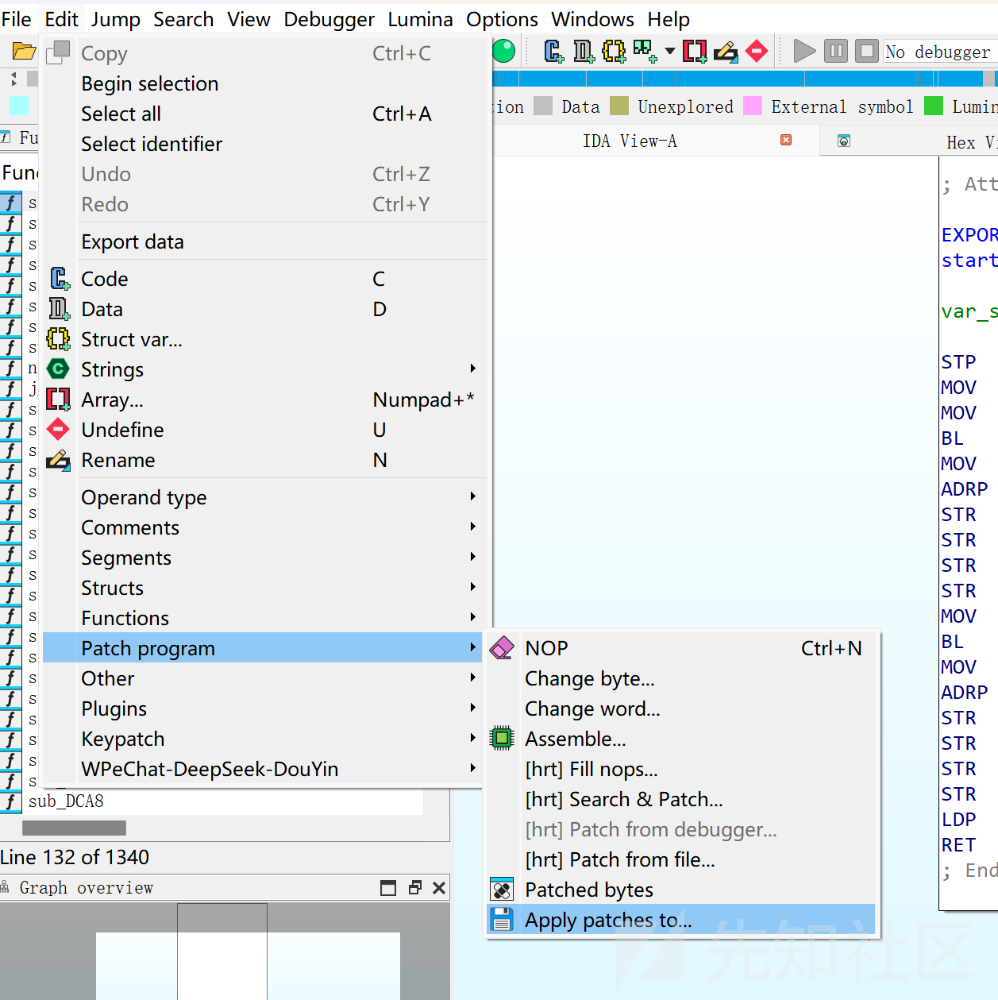

使用ida打开patch并保存的so发现能正常f5反编译说明去花成功了

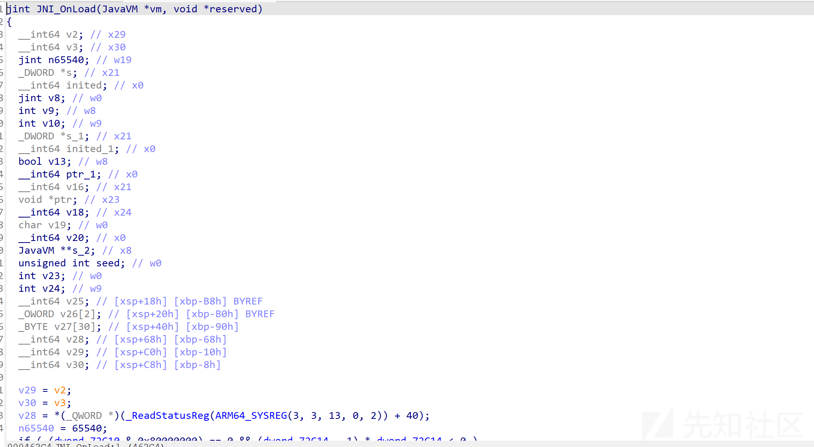

### unidbg准备

编写一下初始模板

```
package com.kuaishou;

import com.github.unidbg.AndroidEmulator;
import com.github.unidbg.Module;
import com.github.unidbg.arm.backend.Unicorn2Factory;
import com.github.unidbg.linux.android.AndroidEmulatorBuilder;
import com.github.unidbg.linux.android.AndroidResolver;
import com.github.unidbg.linux.android.dvm.*;
import com.github.unidbg.linux.android.dvm.array.ArrayObject;
import com.github.unidbg.linux.android.dvm.wrapper.DvmBoolean;
import com.github.unidbg.linux.android.dvm.wrapper.DvmInteger;
import com.github.unidbg.memory.Memory;
import com.github.unidbg.virtualmodule.android.AndroidModule;
import java.io.*;

public class  nssig extends AbstractJni {
    public static AndroidEmulator emulator;
    public static Memory memory;
    public static VM vm;
    public static DalvikModule dm;
    public static Module module;

    public nssig(){
        emulator = AndroidEmulatorBuilder.for64Bit().setProcessName("com.gifshow").setRootDir(new File("target/rootfs")).addBackendFactory(new Unicorn2Factory(true)).build();
        emulator.getBackend().registerEmuCountHook(10000);
        emulator.getSyscallHandler().setVerbose(true);
        emulator.getSyscallHandler().setEnableThreadDispatcher(true);
        memory = emulator.getMemory();
        memory.setLibraryResolver(new AndroidResolver(23));
        vm = emulator.createDalvikVM(new File("E:\frida-hook-js\kuaishou\ks11.420.30984.apk"));
        vm.setJni(this);
        vm.setVerbose(true);
        new AndroidModule(emulator, vm).register(memory);
        DalvikModule dm = vm.loadLibrary("kwsgmain", true);
        module = dm.getModule();
        dm.callJNI_OnLoad(emulator);
    }

    public void getNsSig3(){
        DvmClass JNICLibrary = vm.resolveClass("com.kuaishou.android.security.internal.dispatch.JNICLibrary");
        StringObject urlObj = new StringObject(vm, "jidong");
        StringObject appkey = new StringObject(vm, "d7b7d042-d4f2-4012-be60-d97ff2429c17");
        DvmInteger intergetobj = DvmInteger.valueOf(vm, -1);
        DvmBoolean boolobj = DvmBoolean.valueOf(vm, false);
        DvmClass cContext = vm.resolveClass("android/content/Context");
        DvmClass cContextWrapper = vm.resolveClass("android/content/ContextWrapper", cContext);
        DvmClass application = vm.resolveClass("android/app/Application",cContextWrapper);
        DvmObject<?> context = vm.resolveClass("com/yxcorp/gifshow/App",application).newObject(null); // context
        StringObject appkey2 = new StringObject(vm, "");
        ArrayObject arg2 = new ArrayObject(new ArrayObject(urlObj), appkey, intergetobj, boolobj, context, null, boolobj, appkey2);
        String result = JNICLibrary.callStaticJniMethodObject(emulator,"doCommandNative(I[Ljava/lang/Object;)Ljava/lang/Object;",10418,arg2).getValue().toString();
        System.out.println(result);

    }

    public static void main(String[] args){
        nssig ns = new nssig();
        ns.getNsSig3();
    }
}


```

但是无法正常执行so。因为so有初始化校验,需要先初始化目标函数。hook doCommandNative函数可以看到初始化时后传入的参数

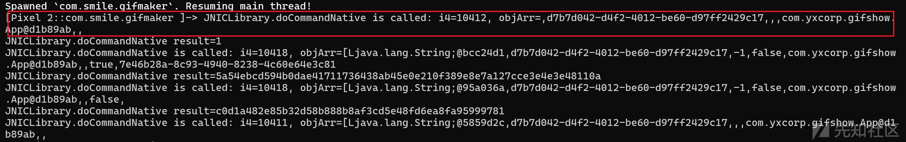

于是添加初始化函数

```
    void moduleInit(){
        DvmClass JNICLibrary = vm.resolveClass("com.kuaishou.android.security.internal.dispatch.JNICLibrary");
        StringObject appkey = new StringObject(vm, "d7b7d042-d4f2-4012-be60-d97ff2429c17");
        DvmObject<?> context = vm.resolveClass("com/yxcorp/gifshow/App").newObject(null); // context
        ArrayObject arg2 = new ArrayObject(null, appkey, null, null, context, null, null);
        JNICLibrary.callStaticJniMethodObject(emulator,"doCommandNative(I[Ljava/lang/Object;)Ljava/lang/Object;",10412,arg2);
    }
```

接着就可以正常根据错误提示补环境了，这里就不赘述了

​

最终代码如下：

```
package com.kuaishou;

import com.github.unidbg.AndroidEmulator;
import com.github.unidbg.Module;
import com.github.unidbg.arm.backend.Unicorn2Factory;
import com.github.unidbg.linux.android.AndroidEmulatorBuilder;
import com.github.unidbg.linux.android.AndroidResolver;
import com.github.unidbg.linux.android.dvm.*;
import com.github.unidbg.linux.android.dvm.api.AssetManager;
import com.github.unidbg.linux.android.dvm.array.ArrayObject;
import com.github.unidbg.linux.android.dvm.wrapper.DvmBoolean;
import com.github.unidbg.linux.android.dvm.wrapper.DvmInteger;
import com.github.unidbg.memory.Memory;
import com.github.unidbg.virtualmodule.android.AndroidModule;
import java.io.*;

public class  nssig extends AbstractJni {
    public static AndroidEmulator emulator;
    public static Memory memory;
    public static VM vm;
    public static DalvikModule dm;
    public static Module module;
    void moduleInit(){
        DvmClass JNICLibrary = vm.resolveClass("com.kuaishou.android.security.internal.dispatch.JNICLibrary");
        StringObject appkey = new StringObject(vm, "d7b7d042-d4f2-4012-be60-d97ff2429c17");
        DvmObject<?> context = vm.resolveClass("com/yxcorp/gifshow/App").newObject(null); // context
        ArrayObject arg2 = new ArrayObject(null, appkey, null, null, context, null, null);
        JNICLibrary.callStaticJniMethodObject(emulator,"doCommandNative(I[Ljava/lang/Object;)Ljava/lang/Object;",10412,arg2);
    }
    public nssig(){
        emulator = AndroidEmulatorBuilder.for64Bit().setProcessName("com.gifshow").setRootDir(new File("target/rootfs")).addBackendFactory(new Unicorn2Factory(true)).build();
        emulator.getBackend().registerEmuCountHook(10000);
        emulator.getSyscallHandler().setVerbose(true);
        emulator.getSyscallHandler().setEnableThreadDispatcher(true);
        memory = emulator.getMemory();
        memory.setLibraryResolver(new AndroidResolver(23));
        vm = emulator.createDalvikVM(new File("E:\frida-hook-js\kuaishou\ks11.420.30984.apk"));
        vm.setJni(this);
        vm.setVerbose(true);
        new AndroidModule(emulator, vm).register(memory);
        DalvikModule dm = vm.loadLibrary("kwsgmain", true);
        module = dm.getModule();
        dm.callJNI_OnLoad(emulator);
    }

    public void getNsSig3(){
        DvmClass JNICLibrary = vm.resolveClass("com.kuaishou.android.security.internal.dispatch.JNICLibrary");
        StringObject urlObj = new StringObject(vm, "beihai");
        StringObject appkey = new StringObject(vm, "d7b7d042-d4f2-4012-be60-d97ff2429c17");
        DvmInteger intergetobj = DvmInteger.valueOf(vm, -1);
        DvmBoolean boolobj = DvmBoolean.valueOf(vm, false);
        DvmClass cContext = vm.resolveClass("android/content/Context");
        DvmClass cContextWrapper = vm.resolveClass("android/content/ContextWrapper", cContext);
        DvmClass application = vm.resolveClass("android/app/Application",cContextWrapper);
        DvmObject<?> context = vm.resolveClass("com/yxcorp/gifshow/App",application).newObject(null); // context
        StringObject appkey2 = new StringObject(vm, "");
        ArrayObject arg2 = new ArrayObject(new ArrayObject(urlObj), appkey, intergetobj, boolobj, context, null, boolobj, appkey2);
        String result = JNICLibrary.callStaticJniMethodObject(emulator,"doCommandNative(I[Ljava/lang/Object;)Ljava/lang/Object;",10418,arg2).getValue().toString();
        System.out.println(result);

    }

    public static void main(String[] args){
        nssig ns = new nssig();
        ns.moduleInit();
        ns.getNsSig3();
    }

    public DvmObject<?> callObjectMethodV(BaseVM vm, DvmObject<?> dvmObject, String signature, VaList vaList){
        switch (signature) {
            case "com/yxcorp/gifshow/App->getPackageCodePath()Ljava/lang/String;":
                return new StringObject(vm , "/data/app/com.smile.gifmaker-JE5N8JGyH2gRWmDJFH0Pvg==/base.apk");
            case "com/yxcorp/gifshow/App->getPackageName()Ljava/lang/String;":
                String packageName = vm.getPackageName();
                if (packageName != null) {
                    return new StringObject(vm, packageName);
                }
                return new StringObject(vm , "com.smile.gifmaker");
            case "com/yxcorp/gifshow/App->getAssets()Landroid/content/res/AssetManager;":
                return new AssetManager(vm, signature);

            case "com/yxcorp/gifshow/App->getPackageManager()Landroid/content/pm/PackageManager;":
                DvmClass clazz = vm.resolveClass("android/content/pm/PackageManager");
                return clazz.newObject(signature);

        }

        return super.callObjectMethodV(vm, dvmObject, signature, vaList);
    }
    public DvmObject<?> callStaticObjectMethodV(BaseVM vm, DvmClass dvmClass, String signature, VaList vaList) {
        switch (signature){
            case "com/kuaishou/android/security/internal/common/ExceptionProxy->getProcessName(Landroid/content/Context;)Ljava/lang/String;":
                return new StringObject(vm,"com.smile.gifmaker");
        }
        return super.callStaticObjectMethodV(vm, dvmClass, signature, vaList);
    }
    public void callStaticVoidMethodV(BaseVM vm, DvmClass dvmClass, String signature, VaList vaList) {
        switch (signature){
            case "com/kuaishou/android/security/internal/common/ExceptionProxy->nativeReport(ILjava/lang/String;)V":

        }
    }

    public int callStaticIntMethodV(BaseVM vm, DvmClass dvmClass, String signature, VaList vaList) {
        if(signature.equals("com/kuaishou/android/security/internal/common/ExceptionProxy->getSecEnvValue()I")){
            return 1;
        } else if (signature.equals("com/kuaishou/android/security/internal/common/ExceptionProxy->canRun(I)I")) {
            return 2;
        }
        return super.callStaticIntMethodV(vm, dvmClass, signature, vaList);
    }
    public boolean callBooleanMethodV(BaseVM vm, DvmObject<?> dvmObject, String signature, VaList vaList) {
        switch (signature) {
            case "java/lang/Boolean->booleanValue()Z":
                return ((DvmBoolean)dvmObject).getValue();
        }
        return super.callBooleanMethodV(vm, dvmObject, signature, vaList);
    }

}


```

### 固定结果

接下来的思路是trace代码，通过结果反向追踪产生流程

通过执行unidbg代码，可以发现虽然我们传入了固定的参数，但是最终结果仍然是变化的。固定的结果才有利于我们结合trace和调试分析流程。所以首先是想办法将结果固定

猜测sig3生成过程中使用了时间戳或者随机数之类的值。so可以有很多方法获取时间戳和随机数,比如jni,库函数,系统调用(最常见)以及文件访问

```
gettimeofday
gettimeofday64
getrandom
```

在导入表中搜索一下，可以看到gettimeofday。因此接下来可以尝试修改一下unidbg源码中的gettimeofday来看看是否是时间戳对结果造成了影响

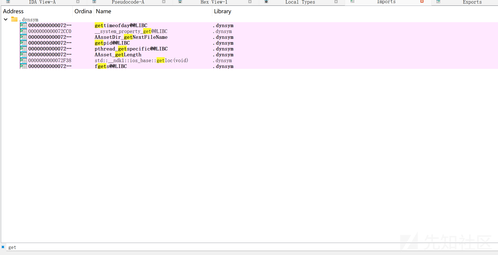

gettimeofday 是在unidbg-api\src\main\java\com\github\unidbg\unix\UnixSyscallHandler.java中实现的

由于so是64位的，修改64位的即可

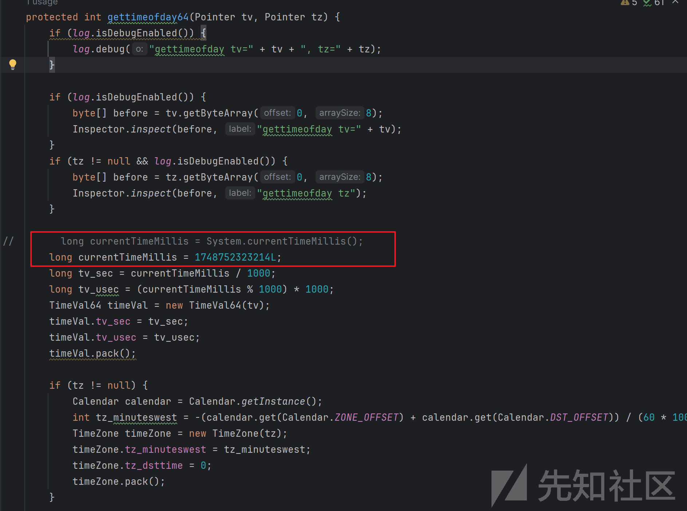

改完后，执行so，发现生成的结果固定住了 bbaadaf9b2c786b6f3f3f0f19de705a7293cd381eee2ecfa

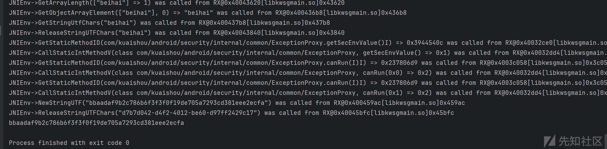

### 初探

添加trace代码的函数。把traceCode()添加到getNsSig3()顶部即可

```
    void traceCode(){
        String traceFile = "unidbg-android/src/test/java/com/kuaishou/traceCode.log"; // 输出的路径
        PrintStream traceStream = null; 
        try {
            traceStream = new (new FileOutputStream(traceFile), true);
        } catch (FileNotFoundException e) {
            throw new RuntimeException(e);
        }
        emulator.traceCode(module.base, module.base + module.size).setRedirect(traceStream);
    }
```

trace的过程不到3分钟，日志文件不算特别大

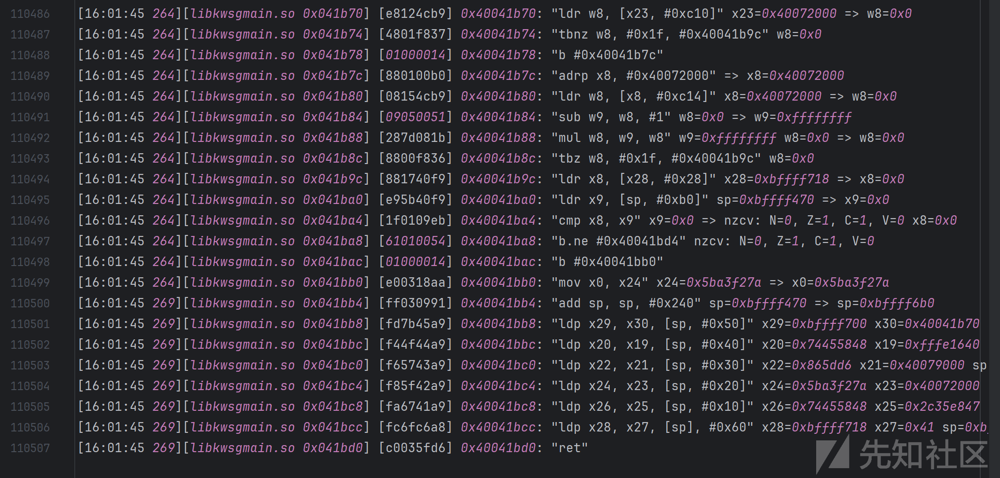

我们的分析策略是从结果反推生成过程，所以要根据运算结果来搜索。大小端序，单字节和双字节都尝试一下

双字节无果。。

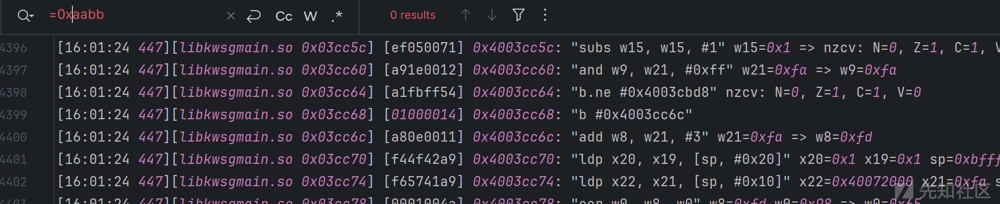

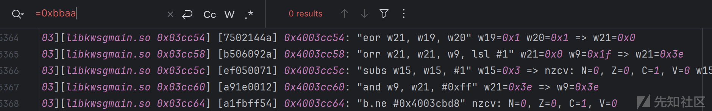

搜一下一个字节的，为了排除干扰 ，在"=0xbb"加一个空格 ，即搜索"=0xbb "

找到了11个结果，从最后往前看，可以看到是mov和sxtw,这个两个操作都是把值存入寄存器，而csel x4, x9, x10, eq 根据条件码选择将x9或x10的值赋给x4。这一部分就很像是要找的地方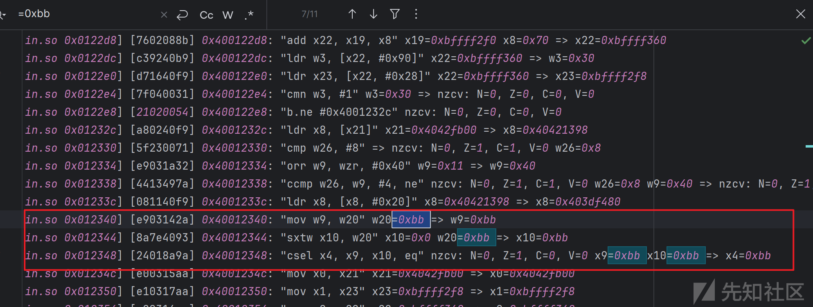

搜索第二字节aa,发现同样也存在这样的操作,生成的sig3往后其他的字节也是如此

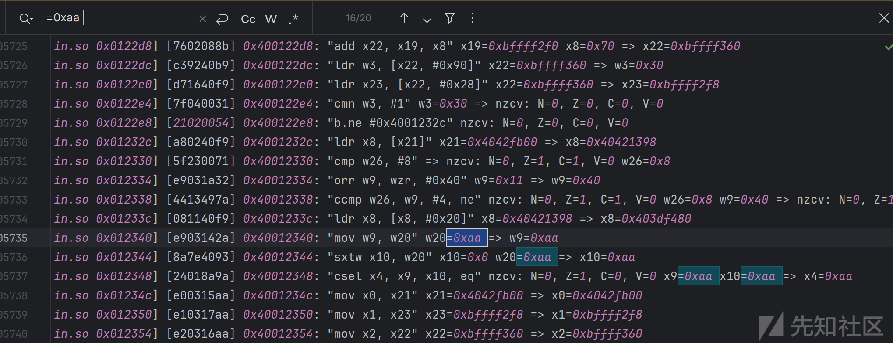

那么这个w20是从哪赋值的呢，继续往上走，可以看到w20接收的是w1的值

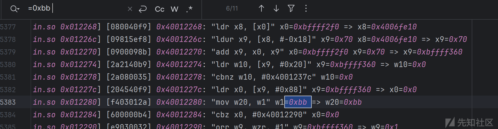

继续往上走，找到了给w1传值的地方ldrb w1, [x21], #1。这里是从0xbffff5f0加载一个字节给w1的

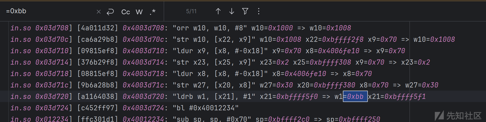

对于第二个字节aa，找到同样的地方，发现这里是从0xbffff5f1加载一个字节给w1，所以从0xbffff5f0开始之后的24个字节会不会存储的就是结果呢？

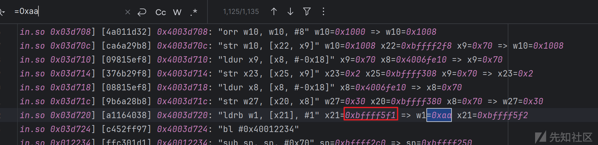

​

ldrb w1, [x21], #1对应的地址是0x03d720, 看看这个位置走了多少次

```
        emulator.attach().addBreakPoint(module.base + 0x03d720, new BreakPointCallback() {
            int count = 0;
            @Override
            public boolean onHit(Emulator<?> emulator, long address) {
                count++;
                System.out.println("count => " + count);
                return true;
            }
        });
```

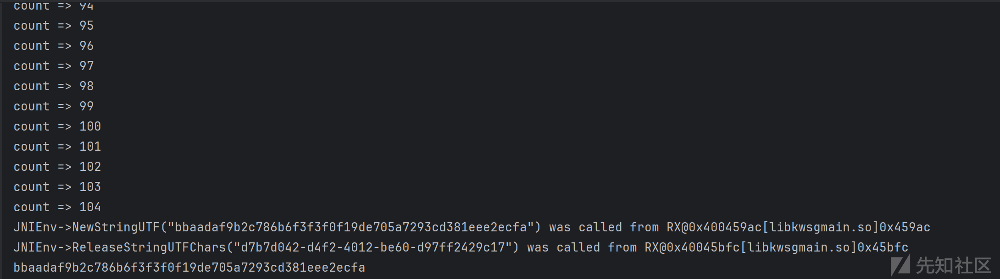

执行了104次。因为结果是24字节的，所以应该是从81次开始，是给w1传入第一个字节的位置。下面想看一下0xbffff5f0中存储的值。于是在81次的时候下个断点

```
        emulator.attach().addBreakPoint(module.base + 0x3d720, new BreakPointCallback() {
            int count = 0;
            Debugger MyDbg = emulator.attach(DebuggerType.CONSOLE); // Initialize debugger
            @Override
            public boolean onHit(Emulator<?> emulator, long address) {
                count++;
                System.out.println("count => " + count);
                if (count == 81) {
                    System.out.println("Reached 81st hit, pausing for debugger...");
                    return false; // Pause emulation to enter the console debugger
                }
                return true; // Continue emulation for other hits
            }
        });
```

发现确实是这个位置。下面就要弄清楚是0xbffff5f0的值是怎么来的

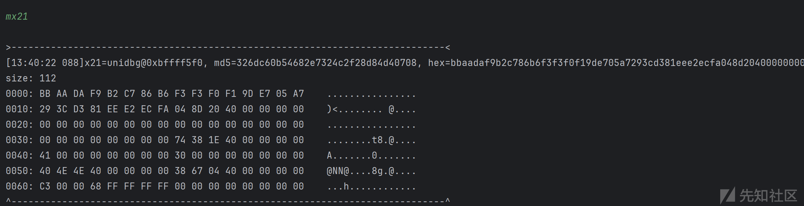

在ida中查看一下0x03d720位置对应的伪代码。这个a1是函数3d5f4传入的参数

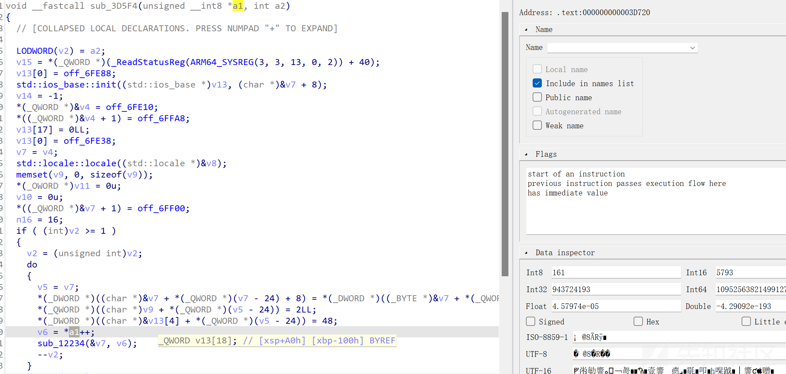

继续对0x3d720进行调试，控制台输入bt，打印堆栈

出来了两个位置，分别是0x03d6a0和0x04561c

0x03d6a0感觉不是

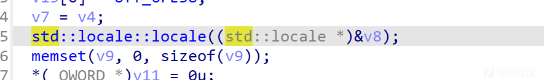

再看一下0x04561c，这里调用了sub\_3d5f4,这个v313就是结果的位置。sub\_3d5f4调用之前的部分是一个while循环，执行的次数是23次，每次都会对v313的进行操作。咱们的最终结果有24个字节，也相当接近了，有理由怀疑这里就是产生结果的地方

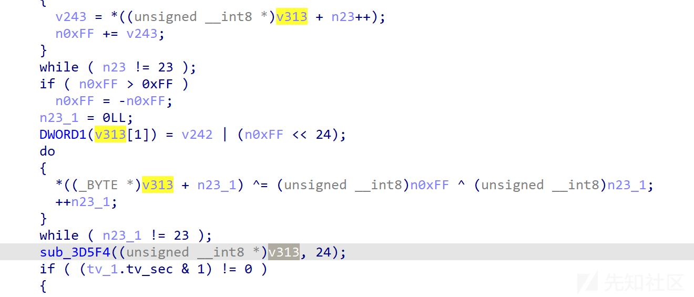

\*((\_BYTE \*)v313 + n23\_1) ^= (unsigned \_\_int8)n0xFF ^ (unsigned \_\_int8)n23\_1; 好像是进行了异或操作，看一下对应的汇编，发现确实是如此。w11会与w12异或，w11又是从x8所在地址取值的

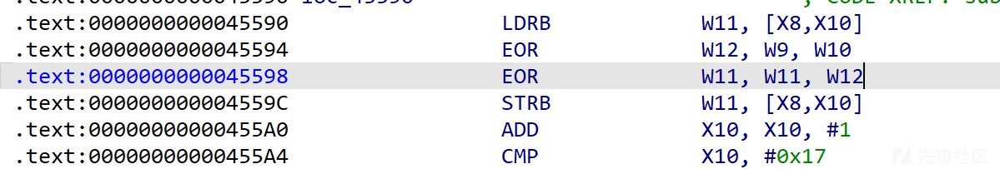

对0x45598下个断点，打印次数，发现确实是走了23次

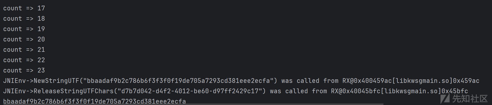

于是直接对第一次下断点调试就好了。x11是从x8指向地址取值的，第一次的时候x11是0x41。x12始终是0xfffff9fa，0x41和0xfa异或之后就是0xbb。然后看了下第二次和最后一次，发现x11的值每次与0xfa异或得到的结果确实是最终结果中的字符。只是第24个字节又是从哪来的呢，咦，这个fa不就是第24个字节的字符么

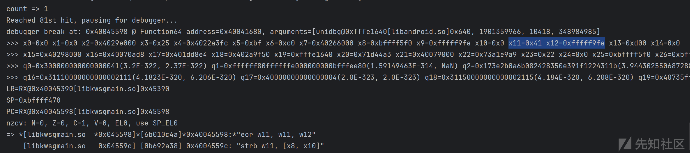

回看一下伪代码 这个n0xff是对v313进行了求和再取反得到的结果，然后是取n0xff的最后一个字节跟v313进行异或

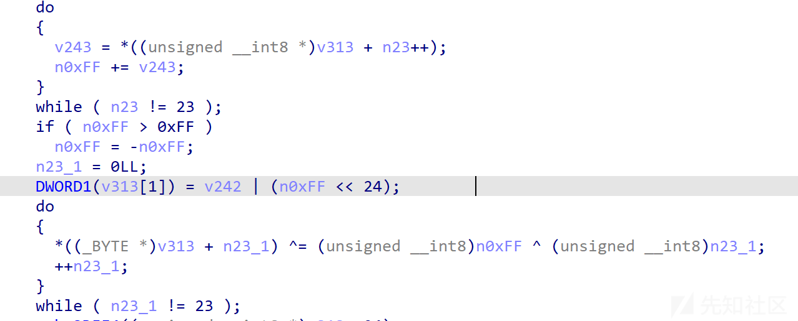

打印一下x8指向的地址存储的内容

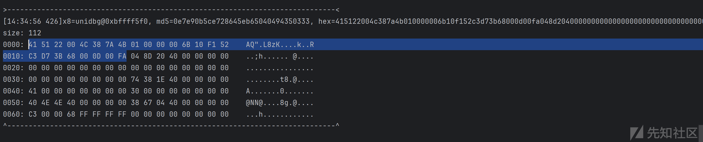

​

41 51 22 00 4C 38 7A 4B 01 00 00 00 6B 10 F1 52 C3 D7 3B 68 00 0D 00 FA 中间这个01 00 00 00 根感觉像是固定的，也许并非所有的字符都是变化的。为了印证猜测，下面探究一下入参对这48位的影响

​

会变动的参数就只有urlObj了，另外会对生成结果产生影响的是时间戳

这里改动一下urlObj, 把beihai改成beihai518,时间戳不变

结果为

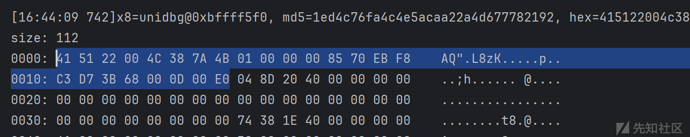

改动一下时间戳，把1748752323214改成1749752323214（秒级别以上时间戳改动才会影响结果），urlObj还是beihai

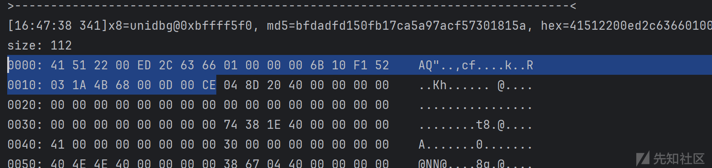

整理一下，可以看出，urlObj会影响13-16字节，时间戳会影响5-8字节以及17-19字节

```
41 51 22 00  4C 38 7A 4B   01 00 00 00  6B 10 F1 52  C3 D7 3B  68 00 0D 00 FA
41 51 22 00  4C 38 7A 4B   01 00 00 00  85 70 EB F8  C3 D7 3B  68 00 0D 00 E0   只改动urlObj
41 51 22 00  ED 2C 63 66   01 00 00 00  6B 10 F1 52  03 1A 4B  68 00 0D 00 CE   只改动时间戳
```

17-19字节就是时间戳前10位转成hex的小端序

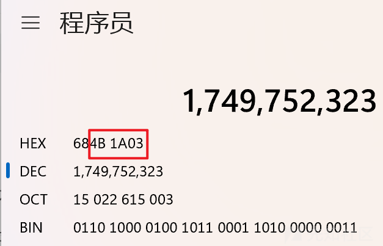

5-8位初始化的时间比较早，在jni\_onload里就初始化了，把tracecode放在calljni\_onload(emulator)之前，trace花了很久，最后发现是通过rand函数生成的，不过传入了时间戳作为种子。因此也就有了前面固定时间戳5-8位也就固定的现象。

对于5-8字节这里仅作简单介绍，不是本文重点

下面重点关注一下13-16字节

​

### CRC32

搜索一下，最终是小端序搜索到了结果

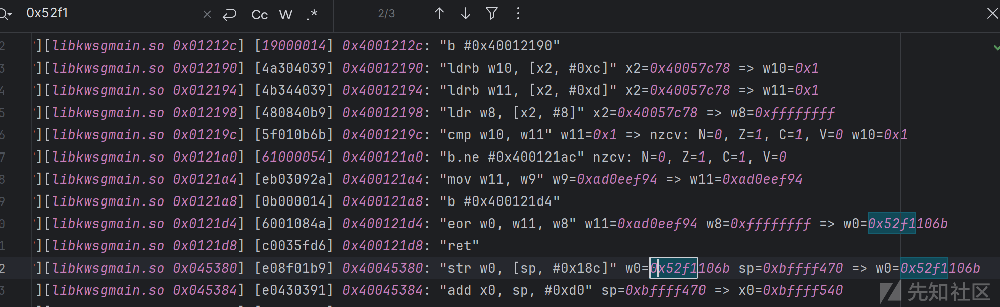

查看一下eor w0, w11, w8对应地址的伪代码

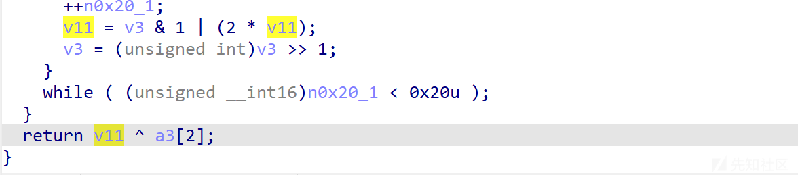

这个a3是sub\_120C4的参数，sub\_120C4进行了一些运算操作

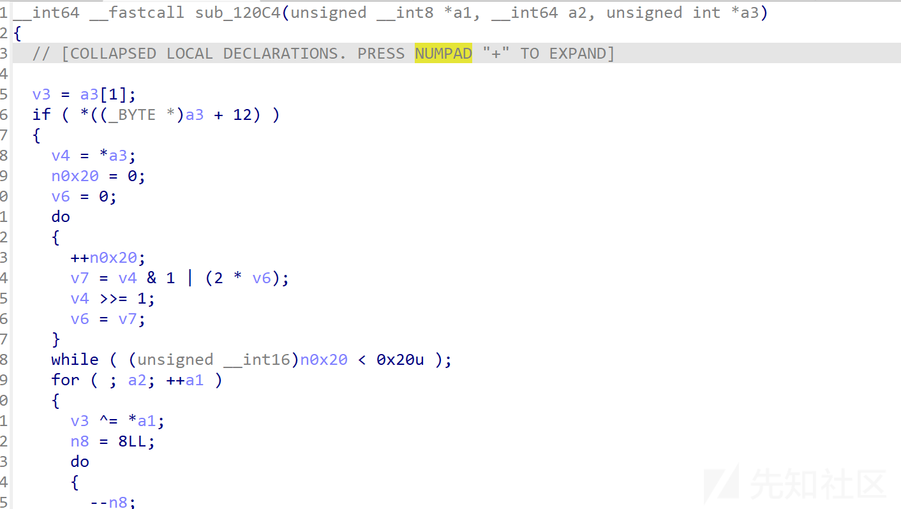

打印一下执行次数，发现只执行了一次，x1应该是长度

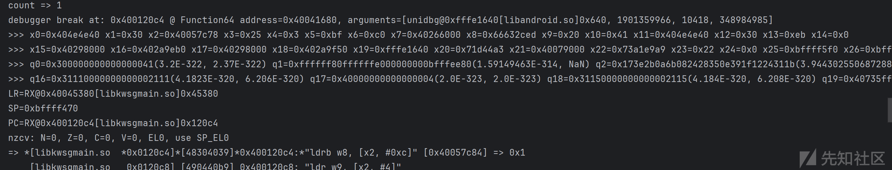

控制台调试一下，查看一下x0和x2

x0,长度位48字节

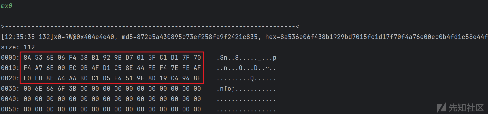

x2为04c11db7

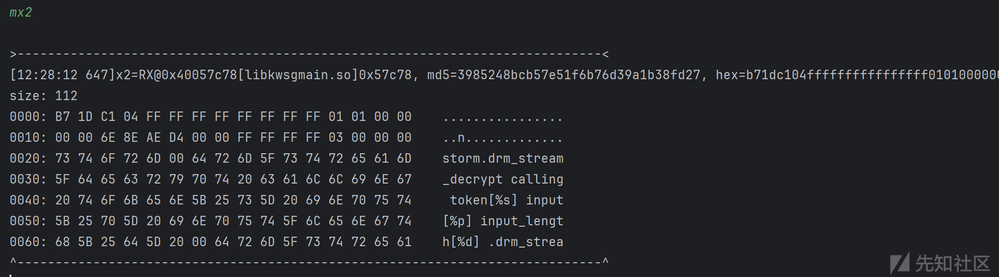

搜索04c11db7,发现跟crc32循环校验码有关

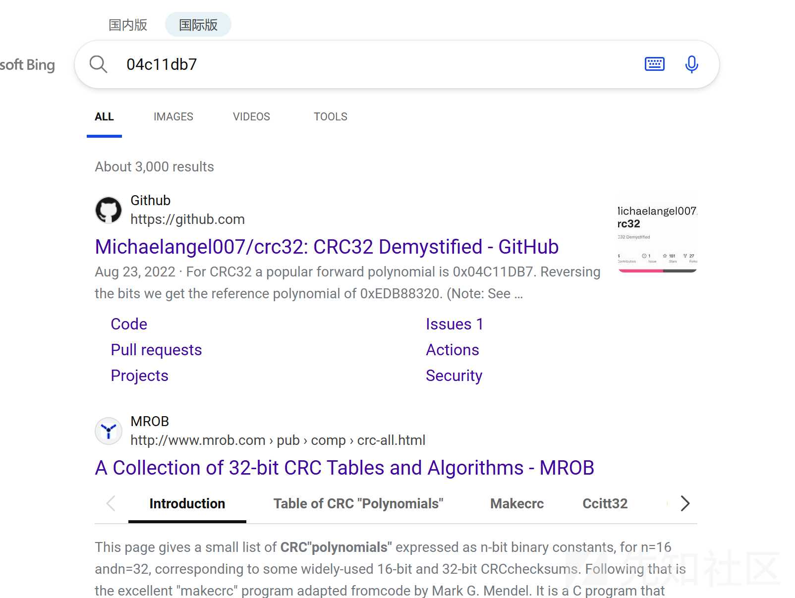

于是把x0的值进行了运算，跟结果对比了一下，看来是标准的crc32

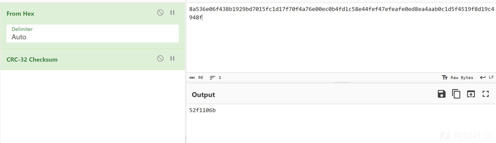

接下要解决的问题就是8a536e06f438b1929bd7015fc1d17f70f4a76e00ec0b4fd1c58e44fef47efeafe0ed8ea4aab0c1d5f4519f8d19c4948f是从哪儿来的

​

### 白盒aes

这一大串字符所处的位置是0x404e4e40，追踪一下对于地址0x404e4e40的写入

```
emulator.traceWrite(0x404e4e40 , 0x404e4e40 + 0x30);
```

可以看到libkwsgmain对其操作的地址是0x1ea10

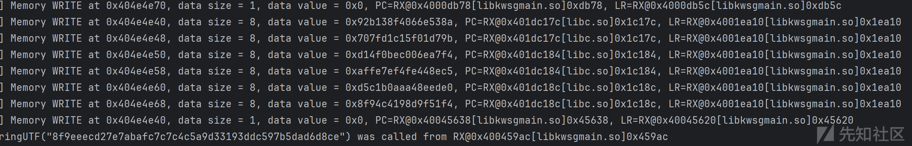

查看对应位置，memcpy把字串从src的位置赋值

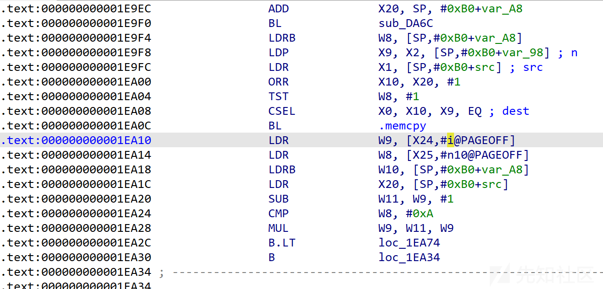

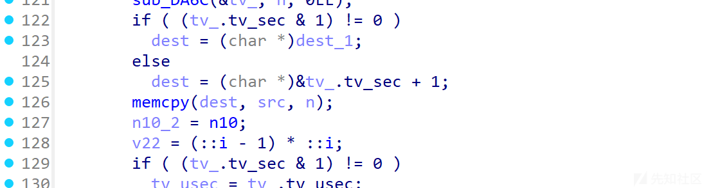

我们把程序断在BL .memcpy，查看src的位置，x1对应src，x2对应n，也就是长度

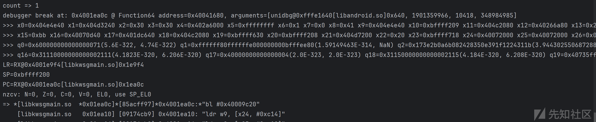

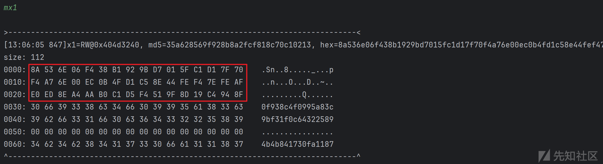

同样地，追踪一下这块地址的写入情况emulator.traceWrite(0x404d3240 , 0x404d3240 + 0x30);

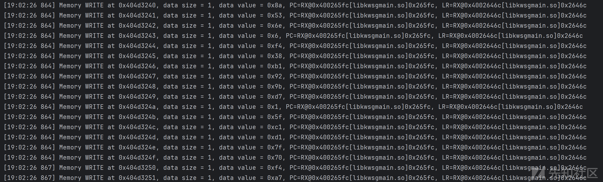

查看0x2646c对应的代码，这部分是属于函数sub\_2636C的，这里面好像进行了查表的操作

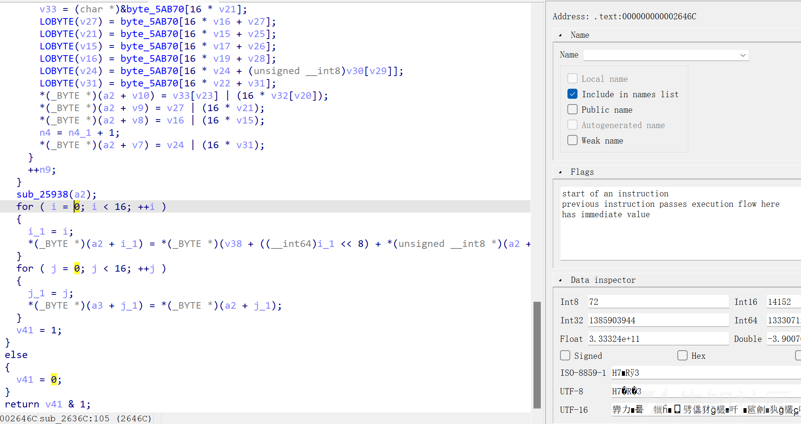

问一下ida mcp助手，说是查表的aes

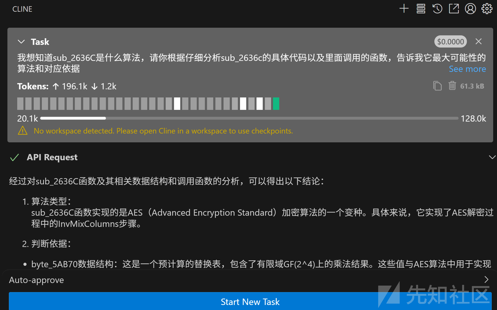

hook一下sub\_2636C

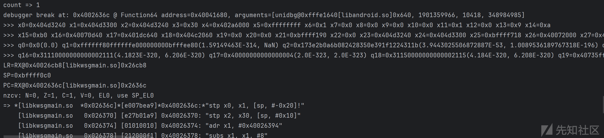

x0,x1,x2对应函数的三个参数，第一个和第三个就是前面的src的位置0x404d3240，函数调用前还没被写入值

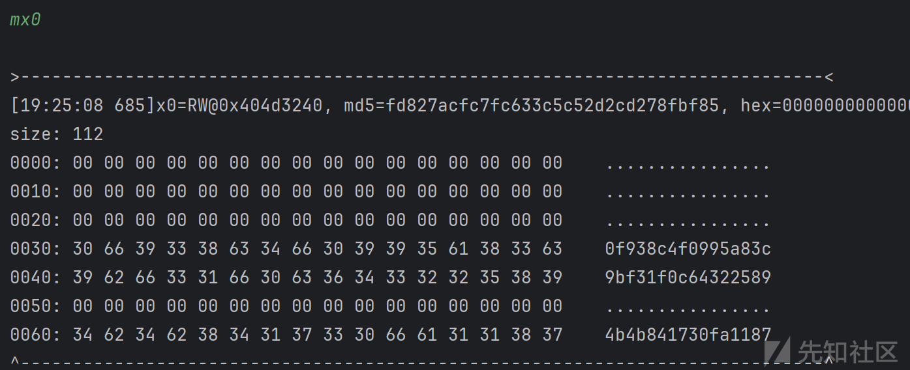

第二个参数，从0020开始的10个0x10似乎是pkcs7填充。看来ai大概率是对的，这个函数估计就是aes

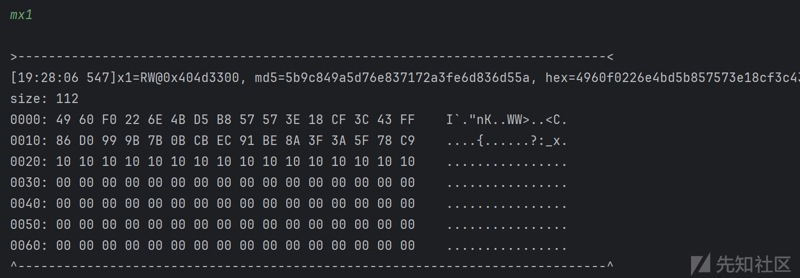

下面还要确定它的模式还有是否被魔改，确认模式最简单的办法就是传入两个相同十六字节的参数，观察结果，结果前16字节和17-32字节是相同的，那么就说明没有iv，就是ecb模式了

先找一下没有被填充的参数（没填充过的49 60 F0 22 6E 4B D5 B8 57 57 3E 18 CF 3C 43 FF 86 D0 99 9B 7B 0B CB EC 91 BE 8A 3F 3A 5F 78 C9），追踪一下0x404d3300的写入

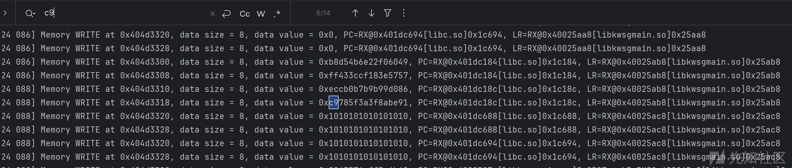

查看一下0x25ac8,这个dest对应的就是0x404d3300,它是由src复制过来的，这个src是作为参数传进来的

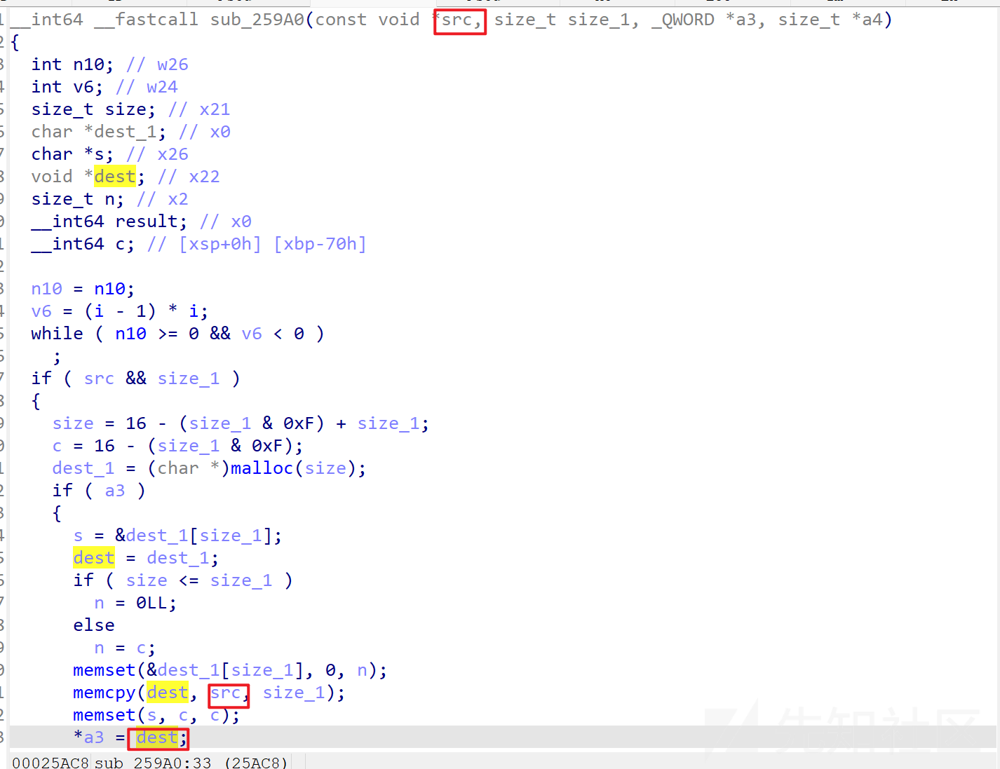

hook一下这个sub\_259A0，看一下入参

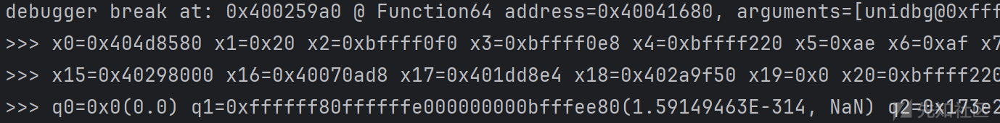

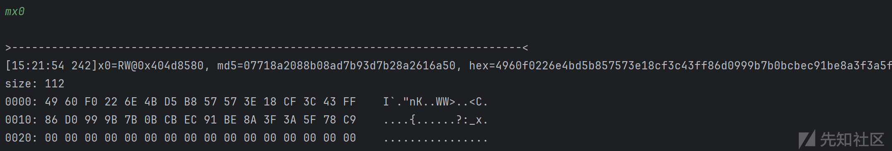

可以看到调用sub\_259a0时还没经过填充。可以在这里修改参数

```
        emulator.attach().addBreakPoint(module.base+0x120c4);
        emulator.attach().addBreakPoint(module.base+0x259a0, new BreakPointCallback() {
            @Override
            public boolean onHit(Emulator<?> emulator, long address) {
                RegisterContext context = emulator.getContext();
                UnidbgPointer lrPointer = context.getLRPointer();
                String hexString = "beihaibeihai1234beihaibeihai1234"; // 十六进制字符串
                byte[] bytes = hexString.getBytes();
                MemoryBlock newInput = emulator.getMemory().malloc(hexString.length(), true);
                newInput.getPointer().write(bytes);
                emulator.getBackend().reg_write(Arm64Const.UC_ARM64_REG_X0,newInput.getPointer().peer);
                // 给返回值下断点
                emulator.attach().addBreakPoint(lrPointer.peer, new BreakPointCallback() {
                    @Override
                    public boolean onHit(Emulator<?> emulator, long address) {

                        return true;

                    }
                });

                return true;
            }
        });
```

在sub\_259a0时修改了入参

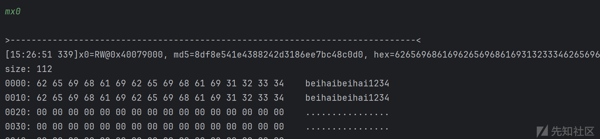

到sub120c4(crc32运算)时传入已经发生变化，前十六个字节和紧接着的十六个字节一样，说明是ecb模式的

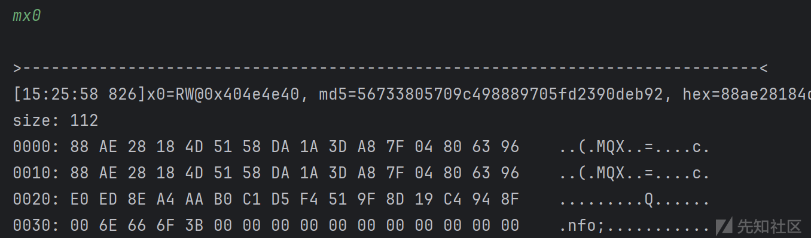

​

下面就是要找密钥了，回到函数体

这个while循环对应的是不是前九轮运算呢，这个sub\_25938是什么呢，它在循环内执行了就此，循环外执行了一次

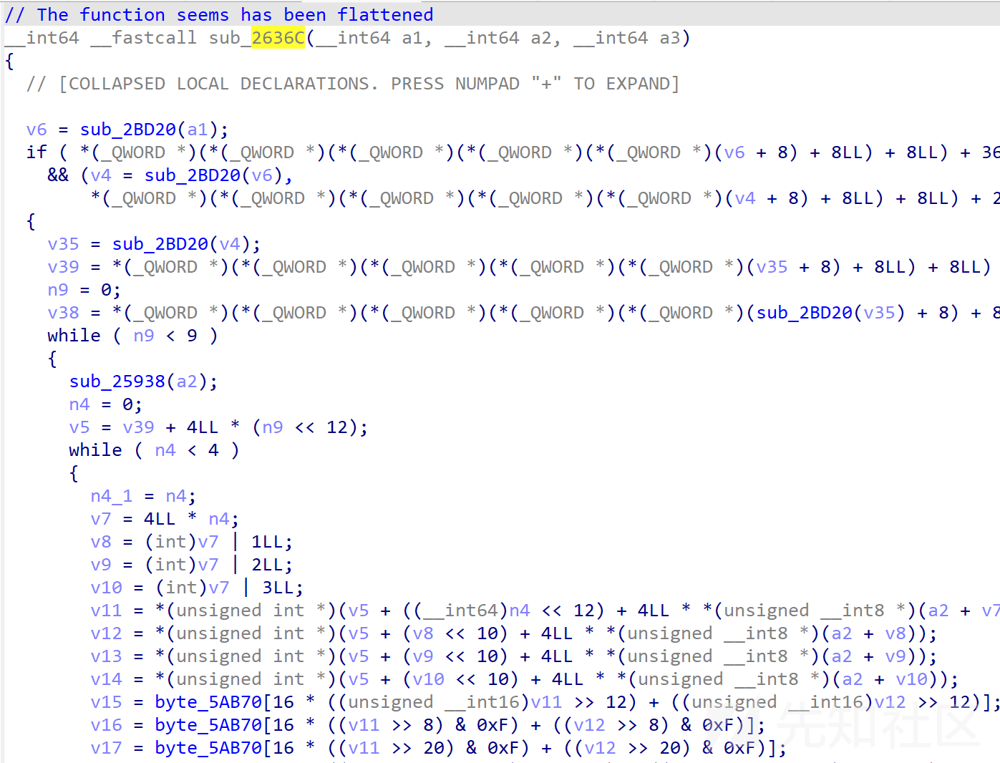

这里面是对数组进行了移位的操作，对应的是行位移

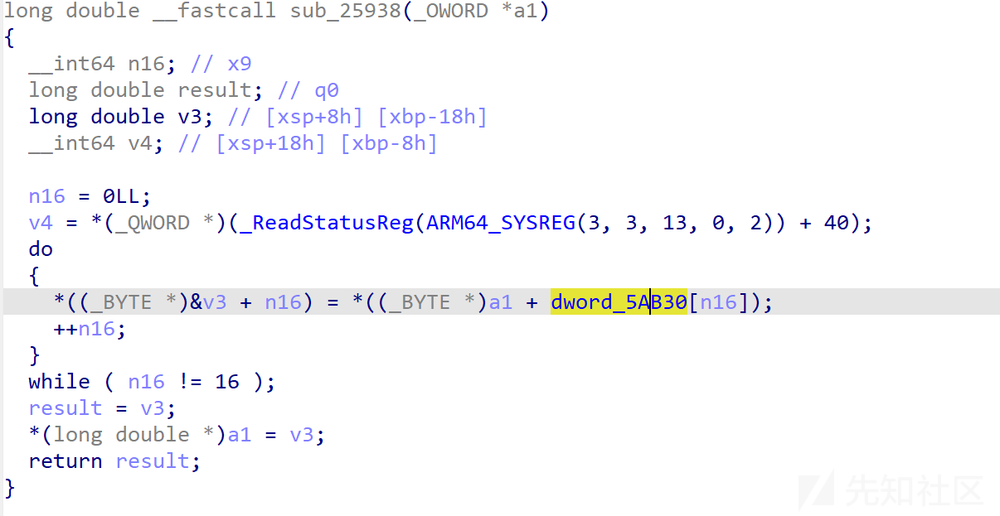

​

hook一下，看看调用次数，调了30次，刚好3组，每组10轮

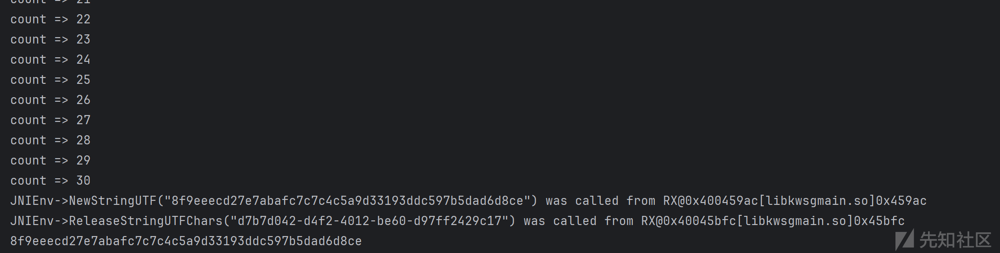

那么在第九轮的位置dfa注入就好了

```
    void aes_dfa(int index){
        final int[] num = {0};
        Debugger attach = emulator.attach();
        attach.addBreakPoint(module.base + 0x25938, new BreakPointCallback() {
            UnidbgPointer pointer;
            @Override
            public boolean onHit(Emulator<?> emulator, long address) {
                RegisterContext context = emulator.getContext();
                num[0] += 1;
                if(num[0] == 9){
                    Random random = new Random();
                    pointer = context.getPointerArg(0);
                    pointer.setByte(index,(byte) random.nextInt(255));
                }
                return true;
            }
        });

        // 0x25980 取返回值
        attach.addBreakPoint(module.base + 0x2636C, new BreakPointCallback() {
            @Override
            public boolean onHit(Emulator<?> emulator, long address) {
                RegisterContext context = emulator.getContext();
                UnidbgPointer lrPointer = context.getLRPointer();
                // 给返回值下断点
                attach.addBreakPoint(lrPointer.peer, new BreakPointCallback() {
                    @Override
                    public boolean onHit(Emulator<?> emulator, long address) {
                        byte[] bytes = emulator.getBackend().mem_read(0x404d3210,0x10);
                        StringBuilder hexString = new StringBuilder();
                        for (byte b : bytes) {
                            hexString.append(String.format("%02X", b & 0xFF));
                        }
                        System.out.println(hexString);
                        return true;
                    }
                });
                return true;
            }
        });
    }
```

每个位置注入一次

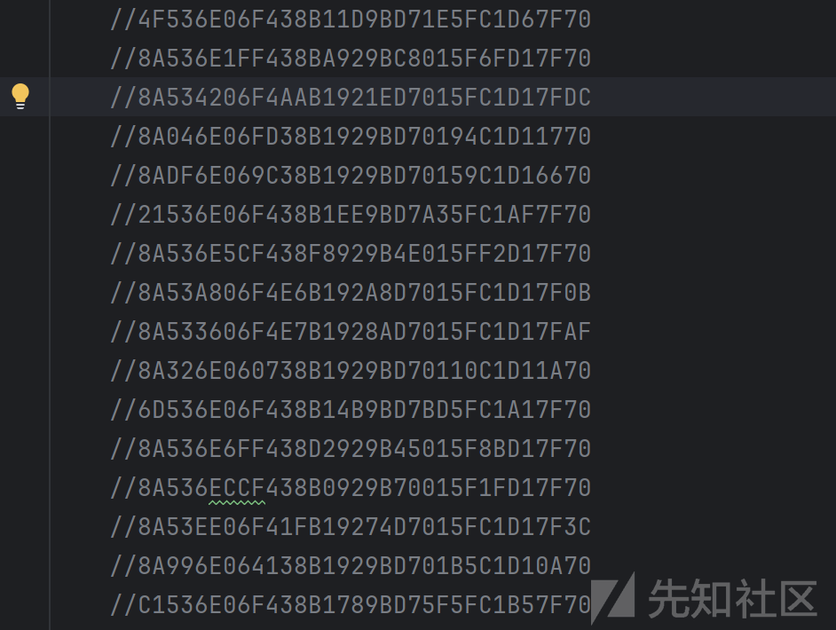

然后是找到之前正确结果的前十六个字节8A536E06F438B1929BD7015FC1D17F70

使用phoenixAES库推导出最后一轮密钥

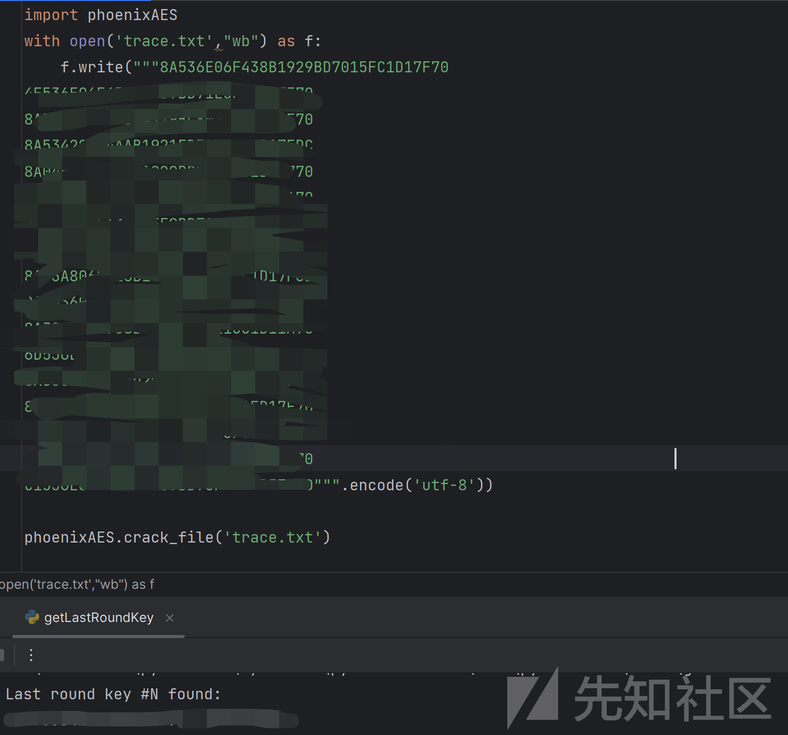

推导种子密钥

```
# AES S-box 表，共256个字节值
sbox = [
    0x63, 0x7C, 0x77, 0x7B, 0xF2, 0x6B, 0x6F, 0xC5,
    0x30, 0x01, 0x67, 0x2B, 0xFE, 0xD7, 0xAB, 0x76,
    0xCA, 0x82, 0xC9, 0x7D, 0xFA, 0x59, 0x47, 0xF0,
    0xAD, 0xD4, 0xA2, 0xAF, 0x9C, 0xA4, 0x72, 0xC0,
    0xB7, 0xFD, 0x93, 0x26, 0x36, 0x3F, 0xF7, 0xCC,
    0x34, 0xA5, 0xE5, 0xF1, 0x71, 0xD8, 0x31, 0x15,
    0x04, 0xC7, 0x23, 0xC3, 0x18, 0x96, 0x05, 0x9A,
    0x07, 0x12, 0x80, 0xE2, 0xEB, 0x27, 0xB2, 0x75,
    0x09, 0x83, 0x2C, 0x1A, 0x1B, 0x6E, 0x5A, 0xA0,
    0x52, 0x3B, 0xD6, 0xB3, 0x29, 0xE3, 0x2F, 0x84,
    0x53, 0xD1, 0x00, 0xED, 0x20, 0xFC, 0xB1, 0x5B,
    0x6A, 0xCB, 0xBE, 0x39, 0x4A, 0x4C, 0x58, 0xCF,
    0xD0, 0xEF, 0xAA, 0xFB, 0x43, 0x4D, 0x33, 0x85,
    0x45, 0xF9, 0x02, 0x7F, 0x50, 0x3C, 0x9F, 0xA8,
    0x51, 0xA3, 0x40, 0x8F, 0x92, 0x9D, 0x38, 0xF5,
    0xBC, 0xB6, 0xDA, 0x21, 0x10, 0xFF, 0xF3, 0xD2,
    0xCD, 0x0C, 0x13, 0xEC, 0x5F, 0x97, 0x44, 0x17,
    0xC4, 0xA7, 0x7E, 0x3D, 0x64, 0x5D, 0x19, 0x73,
    0x60, 0x81, 0x4F, 0xDC, 0x22, 0x2A, 0x90, 0x88,
    0x46, 0xEE, 0xB8, 0x14, 0xDE, 0x5E, 0x0B, 0xDB,
    0xE0, 0x32, 0x3A, 0x0A, 0x49, 0x06, 0x24, 0x5C,
    0xC2, 0xD3, 0xAC, 0x62, 0x91, 0x95, 0xE4, 0x79,
    0xE7, 0xC8, 0x37, 0x6D, 0x8D, 0xD5, 0x4E, 0xA9,
    0x6C, 0x56, 0xF4, 0xEA, 0x65, 0x7A, 0xAE, 0x08,
    0xBA, 0x78, 0x25, 0x2E, 0x1C, 0xA6, 0xB4, 0xC6,
    0xE8, 0xDD, 0x74, 0x1F, 0x4B, 0xBD, 0x8B, 0x8A,
    0x70, 0x3E, 0xB5, 0x66, 0x48, 0x03, 0xF6, 0x0E,
    0x61, 0x35, 0x57, 0xB9, 0x86, 0xC1, 0x1D, 0x9E,
    0xE1, 0xF8, 0x98, 0x11, 0x69, 0xD9, 0x8E, 0x94,
    0x9B, 0x1E, 0x87, 0xE9, 0xCE, 0x55, 0x28, 0xDF,
    0x8C, 0xA1, 0x89, 0x0D, 0xBF, 0xE6, 0x42, 0x68,
    0x41, 0x99, 0x2D, 0x0F, 0xB0, 0x54, 0xBB, 0x16
]

# AES 轮常量 Rcon，仅使用前10项（AES-128 需要10轮）
rcon = [0x01, 0x02, 0x04, 0x08, 0x10, 0x20, 0x40, 0x80, 0x1B, 0x36]

def sub_word(word):
    """对 32 位字的每个字节使用 S-box 进行替换"""
    return (
        (sbox[(word >> 24) & 0xFF] << 24) |
        (sbox[(word >> 16) & 0xFF] << 16) |
        (sbox[(word >> 8) & 0xFF] << 8) |
        (sbox[word & 0xFF])
    )

def rot_word(word):
    """将 32 位字左循环移位8位"""
    return ((word << 8) & 0xFFFFFFFF) | (word >> 24)

def reverse_key_schedule(last_round_key_hex):
    """
    根据 AES-128 的最后一轮密钥逆推出原始密钥
    参数:
        last_round_key_hex: 32个十六进制字符的字符串，例如 "D014F9A8C9EE2589E13F0CC8B6630CA6"
    返回:
        原始密钥（32个十六进制字符）
    """
    # 初始化 44 个 32 位字
    words = [0] * 44

    # 将最后一轮密钥拆分成 4 个 32 位字，并放入 words[40..43]
    for i in range(4):
        words[40 + i] = int(last_round_key_hex[i*8:(i+1)*8], 16)

    # 反向推导，从 i=43 到 i=4，逐步计算出前面的字
    for i in range(43, 3, -1):
        if i % 4 == 0:
            # 当 i 是 4 的倍数，使用 SubWord(RotWord(...)) 和 Rcon
            temp = sub_word(rot_word(words[i-1])) ^ (rcon[i // 4 - 1] << 24)
            words[i-4] = words[i] ^ temp
        else:
            words[i-4] = words[i] ^ words[i-1]

    # 将前4个字组合成原始密钥
    original_key = ''.join(format(word, '08X') for word in words[0:4])
    return original_key

if __name__ == '__main__':
    last_round_key = "E8B9*********B72"
    original_key = reverse_key_schedule(last_round_key)
    print("原始密钥为:", original_key.lower())

```

得到的密钥后使用正常aes ecb加密一下明文，对比发现和sub\_2636c得到的结果是一致的

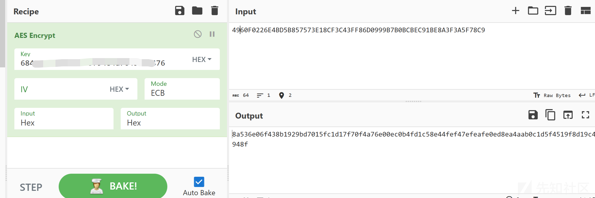

白盒aes弄清楚了，接下来就是4960F0226E4BD5B857573E18CF3C43FF86D0999B7B0BCBEC91BE8A3F3A5F78C9

是怎么产生的了

### hmac sha256

回到259a0，可以看到4960F0226E4BD5B857573E18CF3C43FF86D0999B7B0BCBEC91BE8A3F3A5F78C9所在的地址是0x404d8580

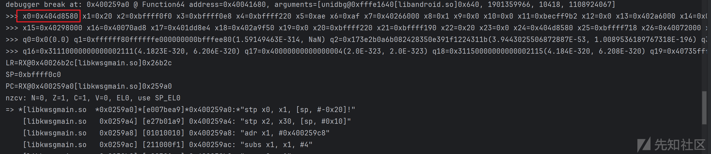

追踪一下0x404d8580的写入情况

```
 emulator.traceWrite(0x404d8580 , 0x404d8580 + 0x20);
```

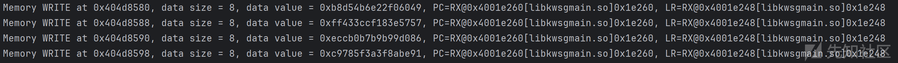

查看0x1e248,这个v13来自sub\_23578，而这个a2最为参数传入,调试后发现这个a2接收的就是urlObj

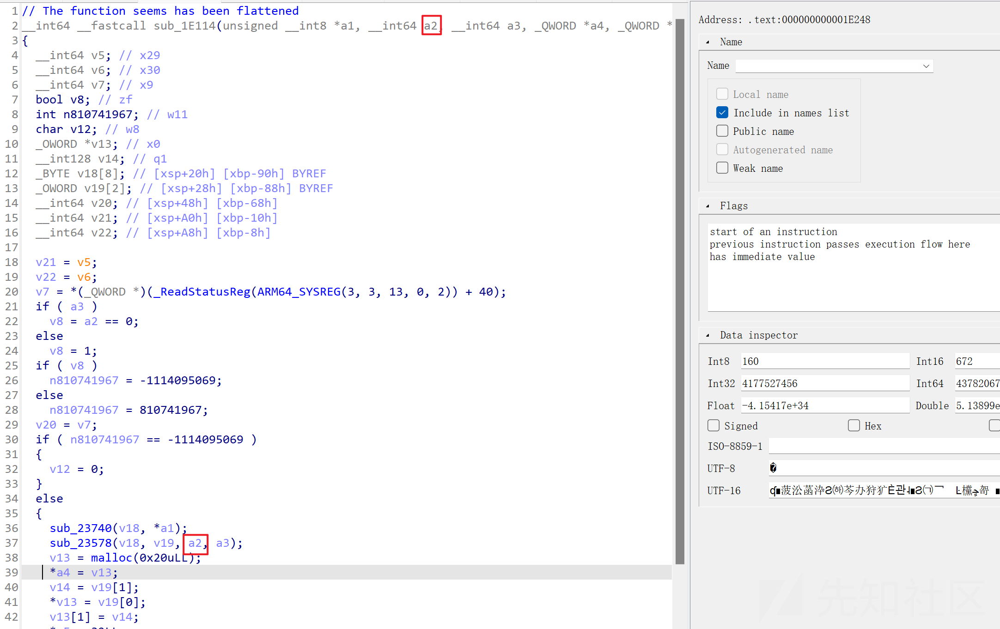

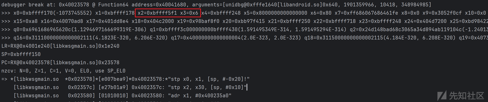

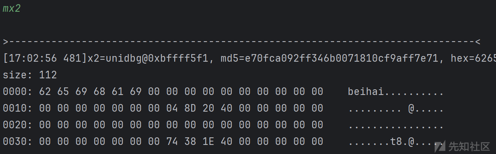

查看一下sub\_23579

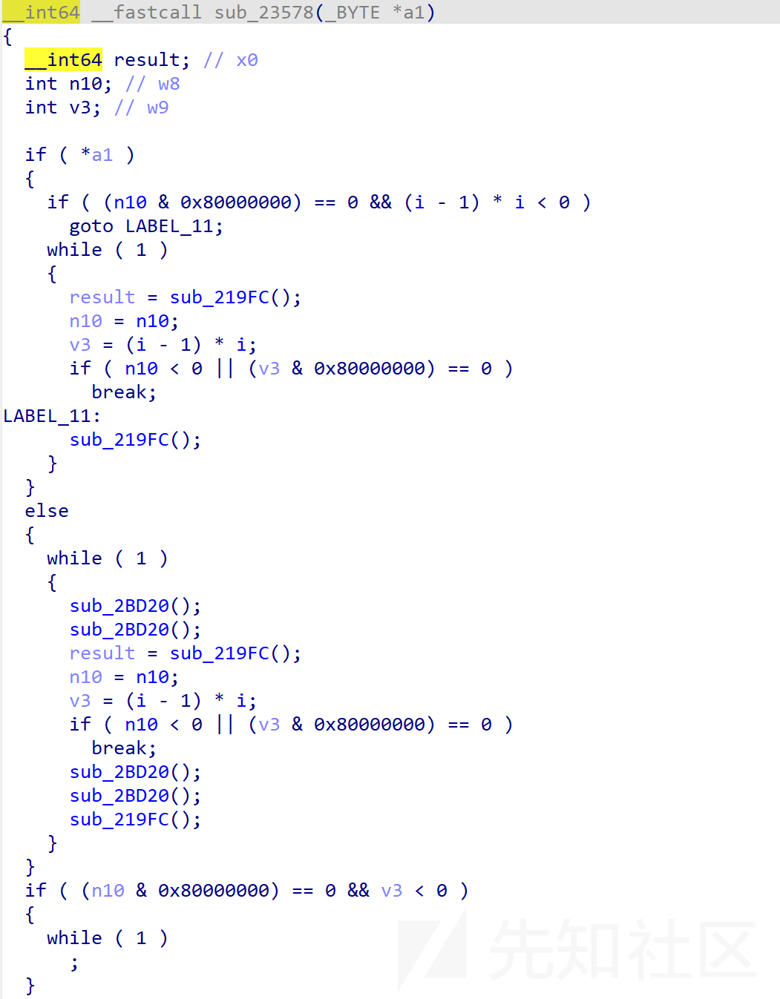

进入sub\_219fc,看到SHA256\_Constants\_581D0猜测一手是不是sha256

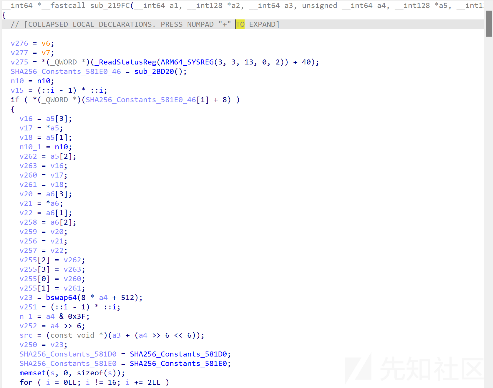

但是生成的结果并不对

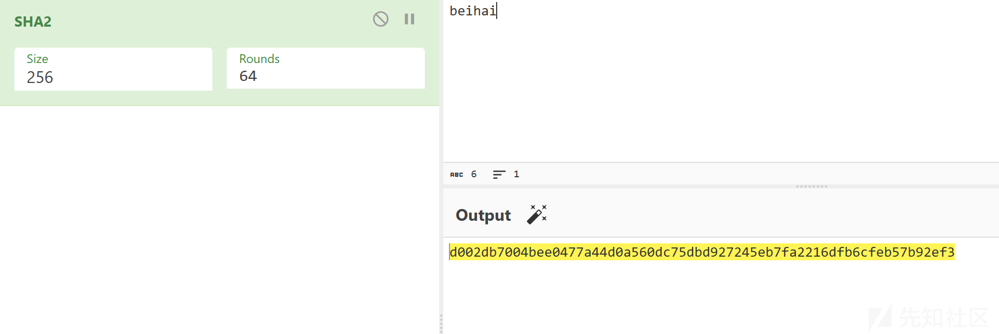

那么就又可能是加盐了或者是hmac sha256,又或者是最糟糕的情况——魔改了。看了半天没找到hmac会有的异或0x5c,0x36

hook一下sub\_219FC, 第三个参数是输入的urlObj,第四个参数是输入的长度

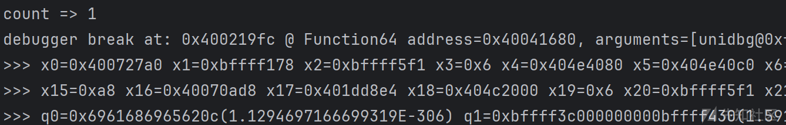

第5，第6个参数是什么，感觉大概率跟盐值有关，但是哪个是盐值呢，又或者盐是它们俩拼接在一起吗。但是也不知道长度

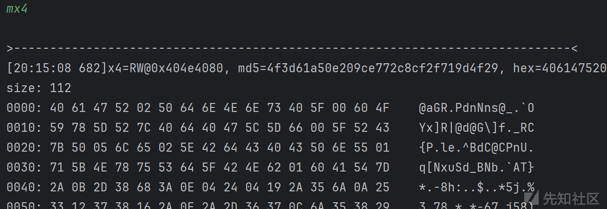

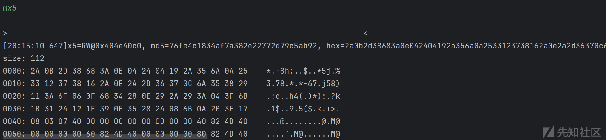

回到219fc，发现函数一开始，就分别把a5，a6存到数组里了

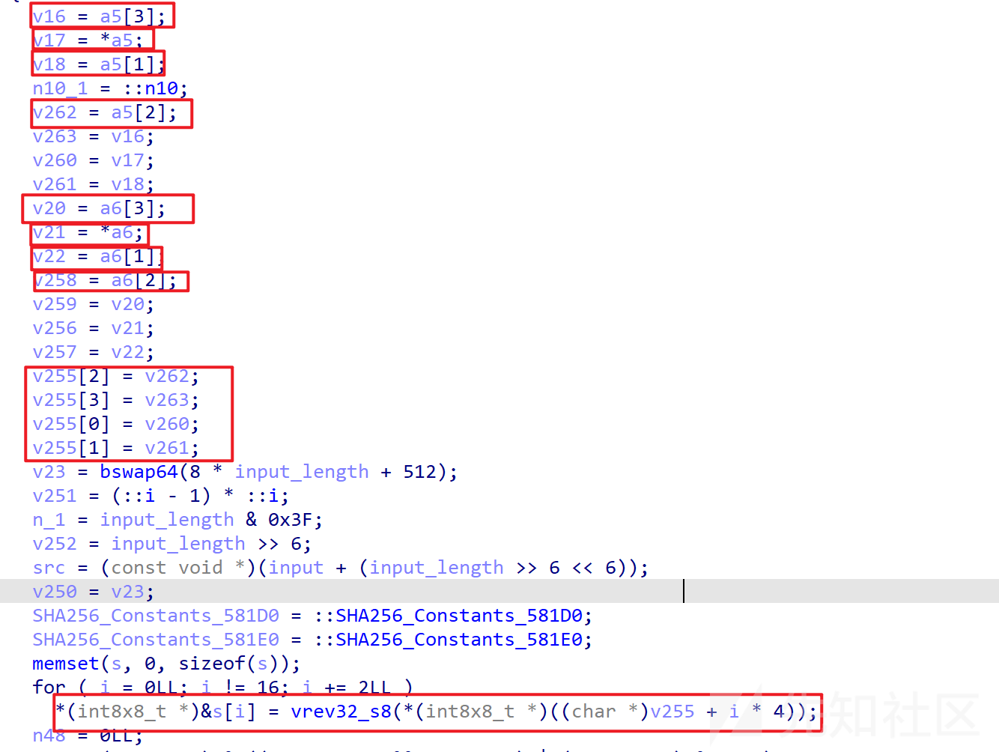

\*(int8x8\_t \*)&s[i] = vrev32\_s8(\*(int8x8\_t \*)((char \*)v255 + i \* 4));

问一下ai,

```
这条指令使用 ARM NEON SIMD 技术执行向量反转操作，具体功能是：
● 从源地址 (char *)v255 + i * 4 加载 8 个 8 位整数（组成一个向量）
● 对每个 32 位块内的 8 位元素进行位置反转
● 将结果存储到目标地址 &s[i]

1. 从地址 v255 + i*4 加载8个字节：[a0,a1,a2,a3,a4,a5,a6,a7]
2. 按32位块分组：[a0,a1,a2,a3] 和 [a4,a5,a6,a7]
3. 对每个块内的8位元素反转：
   - [a0,a1,a2,a3] → [a3,a2,a1,a0]
   - [a4,a5,a6,a7] → [a7,a6,a5,a4]
4. 将结果存储到地址 &s[i]
```

简单来说就是对a5重新排序后存储在s中了。但是值得注意的是s一次存了8字节，循环了8次，也就是a5实际上有64个字节, 那么a6（在刚才代码中取的位数一致）应该也是64个字节。

​

emmm.... 巧了，在hmac中，opad和ipad也是64个字节的

hmac算法的核心公式

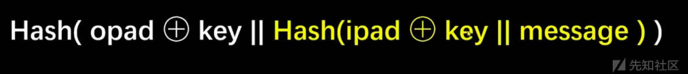

这里面的ipad和opad对应的就是key异或0x36和0x5c的结果

```
for (int i = 0; i < 64; i++) {
    o_key_pad[i] = key_padded[i] ^ 0x5c; // Outer padding: key XOR 0x5c
    i_key_pad[i] = key_padded[i] ^ 0x36; // Inner padding: key XOR 0x36
}
```

把a5，a6提取出来，尝试后发现 a5每一个字节异或0x36和a6对应位置字节异或0x5c得到的结果是一样的

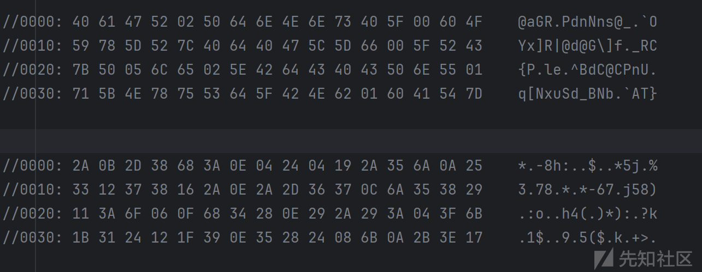

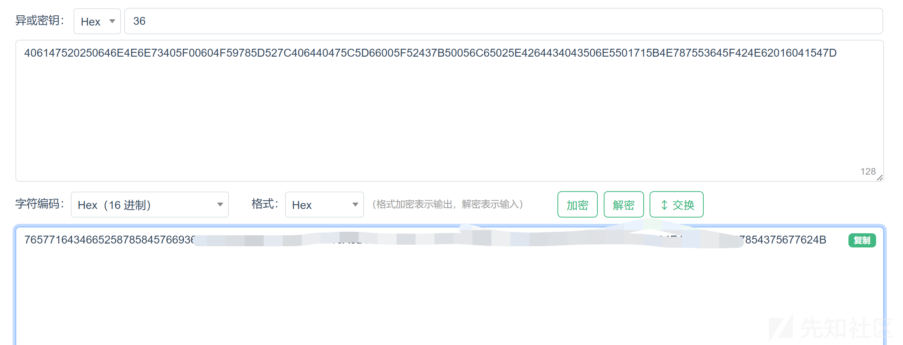

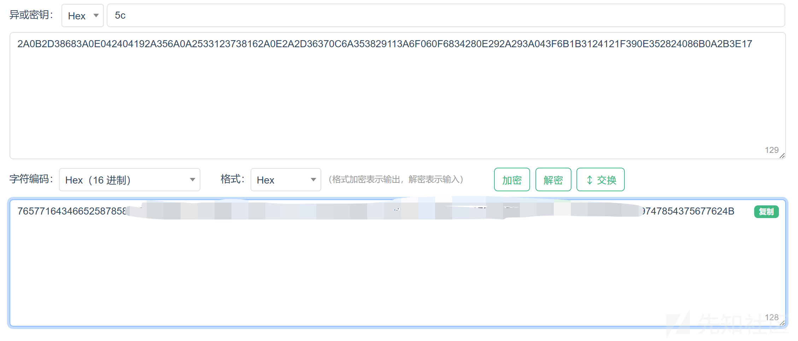

那得到的key加密urlObj,得到的结果跟so跑出来的是一致

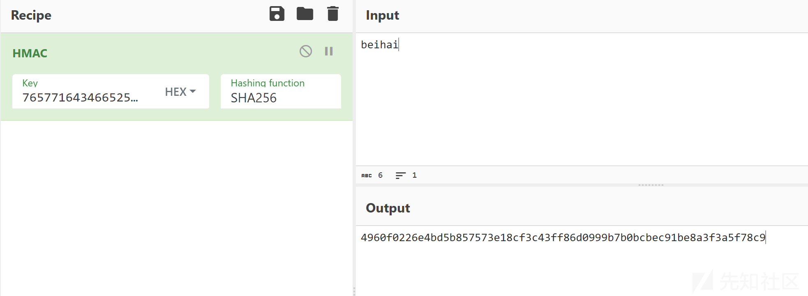

​

到此，这个过程就捋清楚了

​

​

## 总结

分析这个\_\_ns\_sig3的过程中运用了很多知识和技巧，比如：unidbg-trace, crc32, whitebox aes. hmac sha256等。也是学到了很多哈哈哈哈

​

## 参考文章

<https://http://www.yuque.com/lilac-2hqvv/zfho3g/issny5?#%20%E3%80%8A%E8%8A%B1%E6%8C%87%E4%BB%A4%E5%A4%84%E7%90%86%EF%BC%88%E4%B8%80%EF%BC%89%E3%80%8B> 龙哥对于去花文章

<https://mp.weixin.qq.com/s/G3WE0F3KPfBeTZtS2eENpw> 杨如画大佬的文章

<https://bbs.kanxue.com/thread-281317.htm> 季冬大佬的文章

​

​
