# 通过Elastic EDR看smbexec并进行二次开发Bypass-先知社区

> **来源**: https://xz.aliyun.com/news/18192  
> **文章ID**: 18192

---

# 前言

这是笔者第一次在EDR环境下进行横向移动测试，Elastic EDR是一种开源的解决方案，通过impacket包中smbexec进行横向移动测试时，Elastic EDR有5种类型告警。本文通过分析smbexec原理，分析在不同阶段Elastic EDR的告警规则，二次开发smbexec，修改特征，最终绕过了Elastic EDR，0告警，获取目标主机SYSTEM权限shell。

笔者使用的Elastic EDR的版本是8.17。一整套smbexec流程下去，一共有5种类型告警。

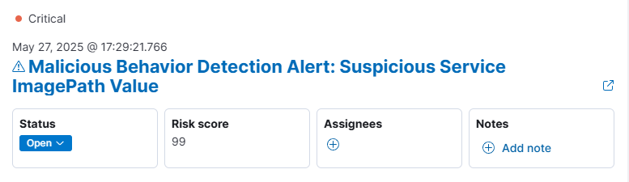

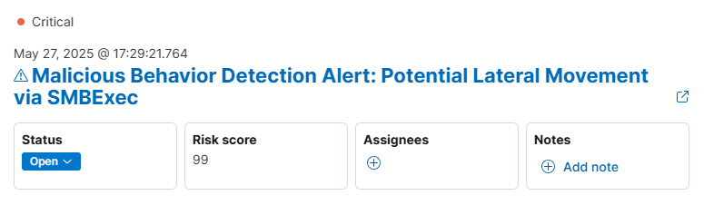

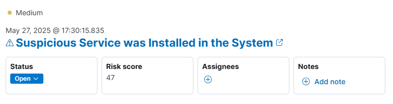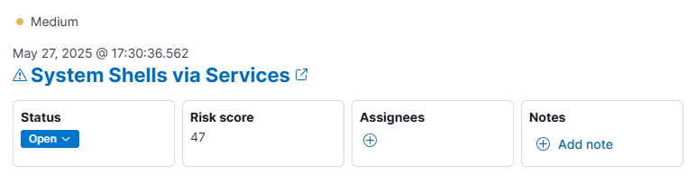

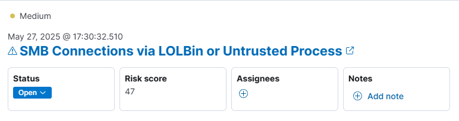

# impacket包中smbexec原理

在impacket源码中，首先将用户输入参数传入到了CMDEXEC类初始化，然后进入run函数中。

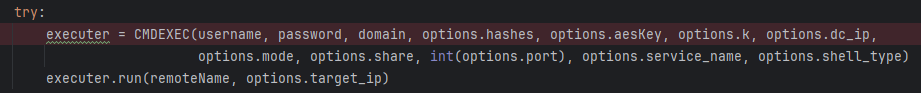

CMDEXEC.run函数中首先设置Pipe命令管道、设置连接端口、设置目标主机等，其中管道svcctl是Windows的默认管道，用于远程管理服务。然后初始化RemoteShell类，最终调用Remote.cmdloop函数。

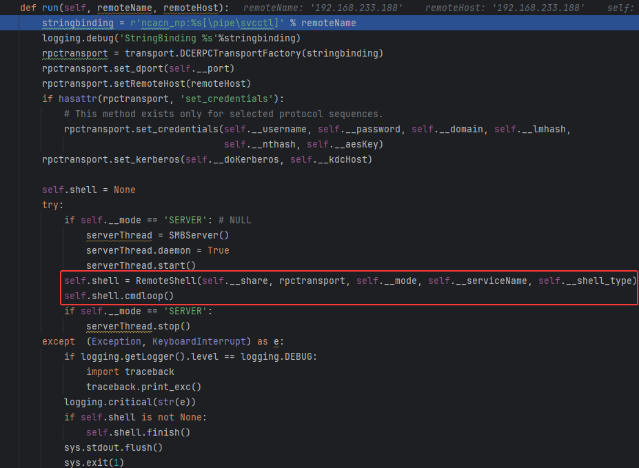

初始化RemoteShell类时，其中有很多是Elastic可以检测的点。比如告警的规则中的第二条，会检测cmd.exe /Q这种模式。会调用rpc.get\_dce\_rpc函数获取RPC配置，接着调用self.\_\_scmr.coonect()与服务控制管理器（SCM）建立SMB连接。

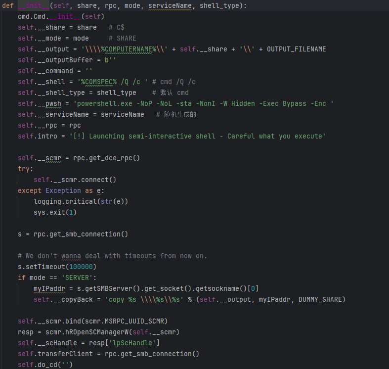

对应的流量为，这一步Elastic没有告警。

​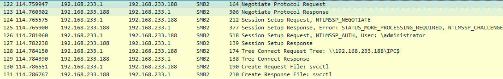

往下调用self.\_\_scmr.bind与目标系统的SCM建立RPC绑定，继续调用scmr.hROpenSCManagerW打开目标系统上SCM服务句柄，对应流量如下。Elastic同样无告警。

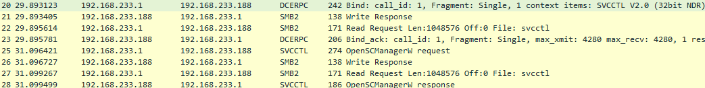

往下接着调用rpc.get\_smb\_connection与目标文件系统建立SMB连接，接着调用self.do\_cd获取当前所在路径，这里主要就是为什么输出C:WindowsSystem32>，模拟命令提示符。在do\_cd函数中，调用关键的self.execute\_remote。

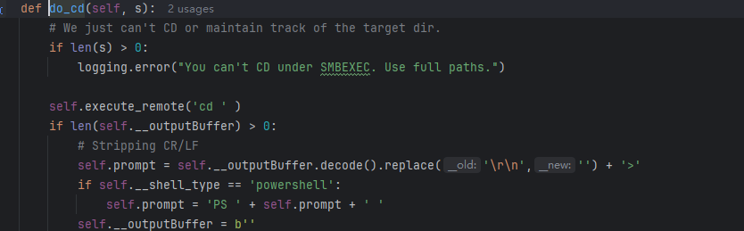

在execute\_remote中，首先判断shell\_type，默认为cmd。接着生成8为随机字符的bat文件名赋值给batchFile，类似于%SYSTEMROOT%\xvRHjXzF.bat。

然后将执行的命令经过构造拼接赋值给command，第一次执行cd时，传入的执行命令为：

%COMSPEC% /Q /c echo cd ^> \\%COMPUTERNAME%\C$\\_\_output 2^>^&1 > %SYSTEMROOT%\xvRHjXzF.bat & %COMSPEC% /Q /c %SYSTEMROOT%\xvRHjXzF.bat & del %SYSTEMROOT%\xvRHjXzF.bat

这里后面通过SCM在目标系统上执行的话，命中了Elastic规则Potential Lateral Movement via SMBExec。

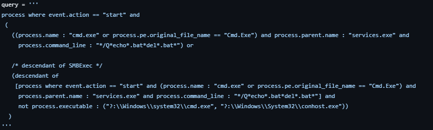

往下调用scmr.hRCreateServiceW创建服务，服务名为前面随机生成的字符，此操作会在HKLMSYSTEMCurrentControlSetServicesImagePath中写入服务的执行程序，ImagePath值就是上面拼接的command，会命中Elastic规则Suspicious Service ImagePath Value。

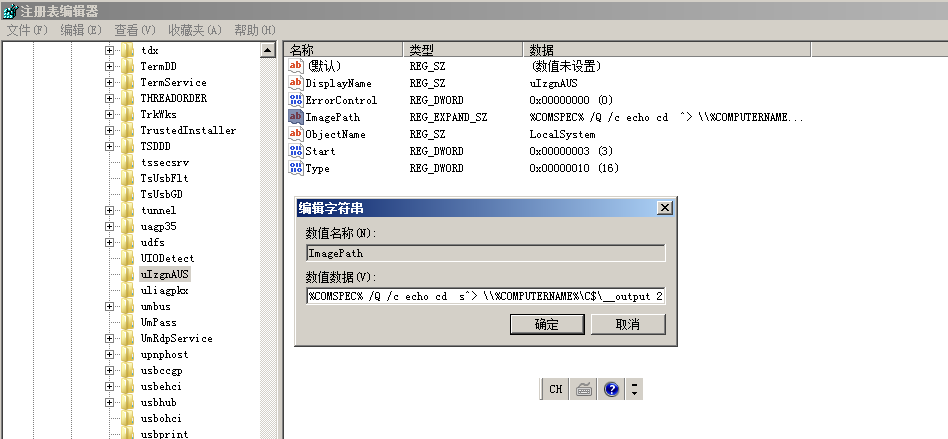

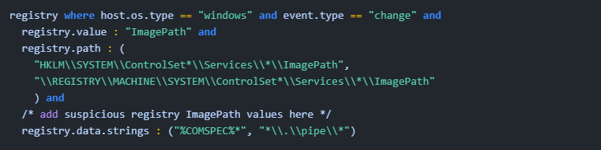  
 然后调用scmr.hRStartServiceW启动服务、scmr.hRDeleteService()删除服务、scmr.hRCloseServiceHandle关闭服务句柄，self.get\_output获取结果。

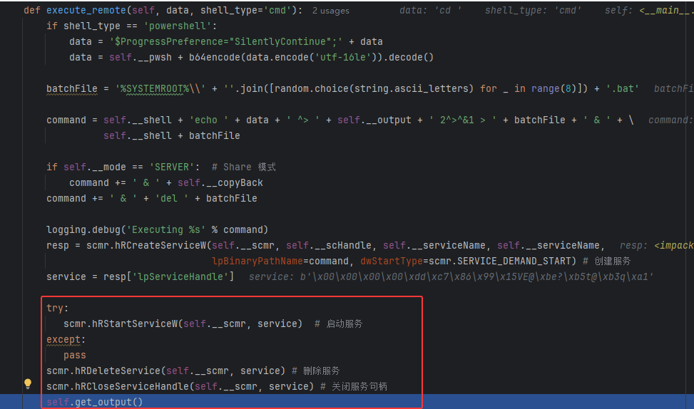

这一步就是上面说的，执行完后，目标系统上在不同时期触发了这两种类型告警。

但后面分别在创建服务和执行时又陆续触发了两条告警Suspicious Service was Installed in the System、System Shells via Services，规则如下。

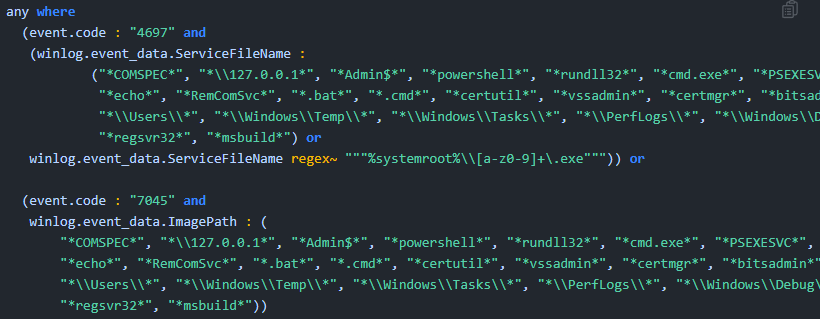  
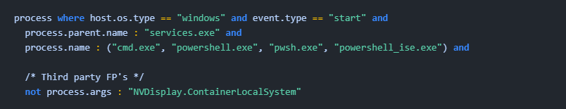

进入get\_output函数，通过SMB获取到命令执行的结果C:\_\_output，并且进行删除。

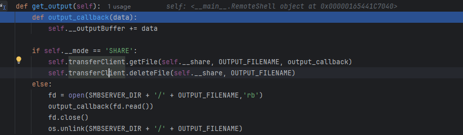

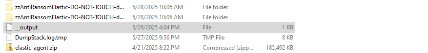  
 返回到do\_cd函数中，判断是否获取到当前目录，如果不为空则直接将路径将显示到命令行输入的左侧。

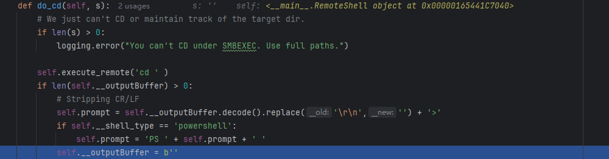

最后在cmdloop函数中会获取用户输入的指令，传入三个函数中。

在onecmd函数中，会将命令传入default中。

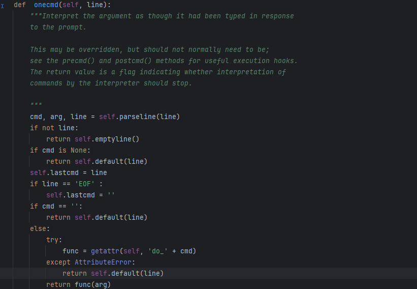

defalut中调用send\_data函数。

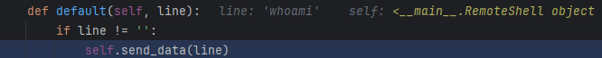

send\_data后续会继续调用execute\_remote，所以每次执行指令都会在execute\_remote中触发Elastic规则。

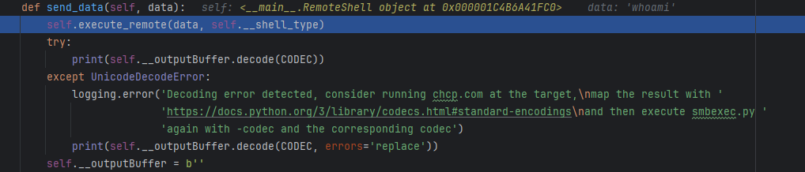

# 二次开发特征修改

从上面分析来看，特征主要集中在execute\_remote函数。针对触发的第一条规则，删除bat操作这一条其实可以去掉，虽然会在目标主机上留下痕迹，但至少这样不会触发告警了。

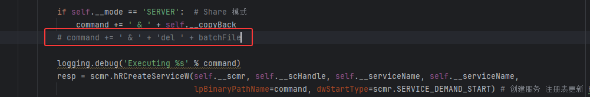

或者可以在最后执行一次对应的del操作，代码如下，其中也会使用创建服务等操作，这样会增加更多的同类型的告警。

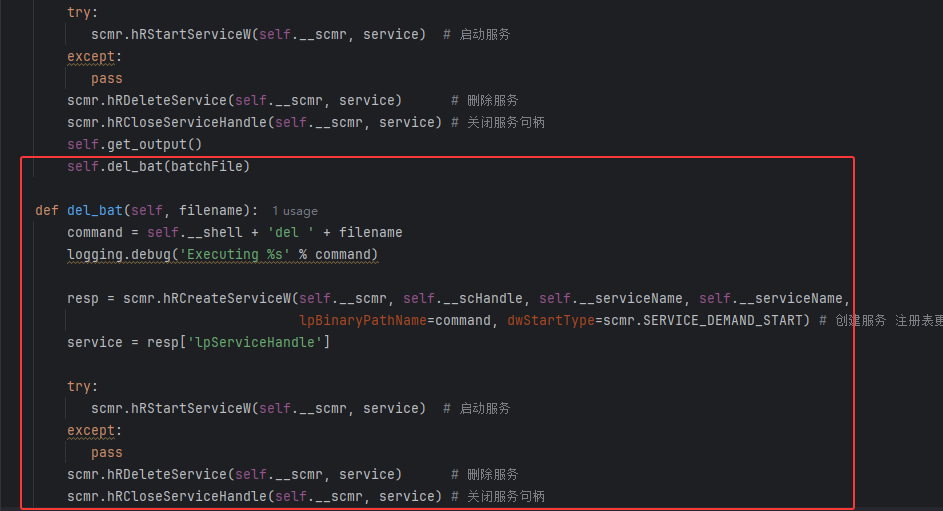

对于第二条告警Suspicious Service ImagePath Value，需要计划任务注册项中不能包含%COMSPEC%，可以使用PowerShell。本身impacket包中smbexec支持shell\_type为powershell。但是发现最后还是使用%COMSPEC%来执行PowerShell混淆脚本，必须修改shell类型，即虽然拦截了%COMSPEC%，但也可以直接使用cmd.exe就行了。

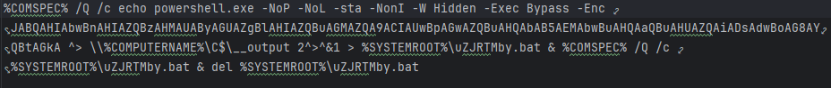

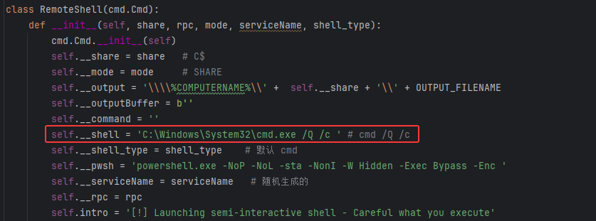

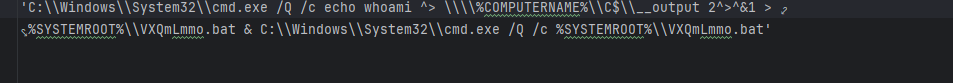

这样一修改再次测试发现成功排除了两种类型告警。剩下的规则似乎不太好绕过，特别是创建一个服务这种方式，被Elastic拦得很死，但想想[SCShell](https://github.com/Mr-Un1k0d3r/SCShell)的方法，我不创建服务，通过ChangeServiceConfigA此API修改已存在服务的ImagePath，然后开始服务，这样Suspicious Service was Installed in the System此告警就不会被唤醒了。SCShell提供了py的版本，甚至还有bof版本，根据py版本进行修改。修改execute\_remote、还有前面定义的del\_bat函数，如下。

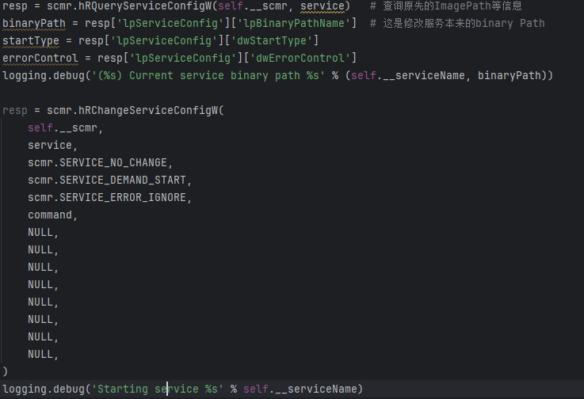

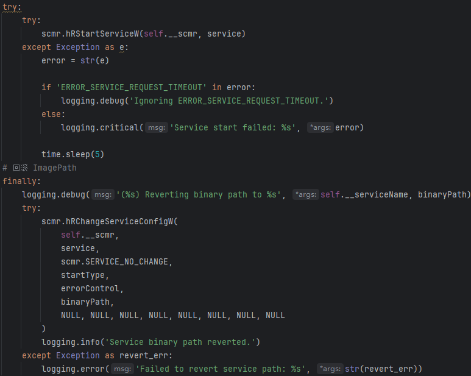

大多数Windows版本可以使用XblAuthManager作为被修改服务，在一些低版本的Windows上可以使用defragsvc。

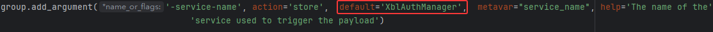

效果如下，最终发现只剩下一种类型告警，触发两次主要是在第一次执行cd操作和del操作中。

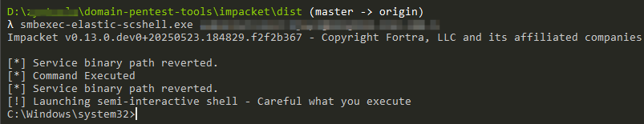

仔细查看最后一条规则，可以发现一个排除项，那每次启动cmd只需要加上NVDisplay.ContainerLocalSystem作为process.args就行了。

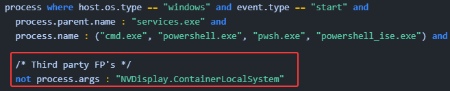  
构造command时，在最后加上& REM NVDisplay.ContainerLocalSystem，REM就是注释的意思，这样达到存在排除项的目的。

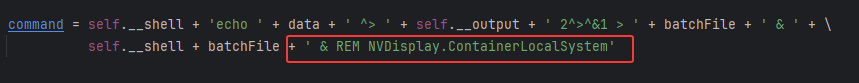

最终测试，smbexec成功，Elastic无任何告警。

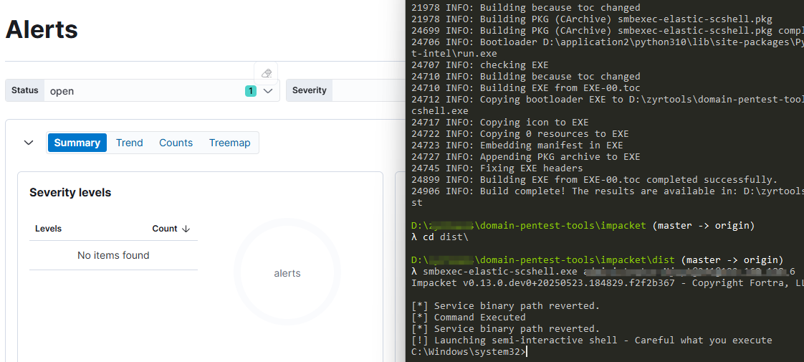

# 总结

本文通过对Elastic EDR的几条告警逐一突破，使用一些简单的技巧，SCShell的方法达到了在Elatic EDR环境下，使用smb进行横向移动的OPSEC，实战对于此环境具有一定的价值。对于一些商用EDR，还需要进一步测试。
