# 网络安全大模型微调：概念与基础-先知社区

> **来源**: https://xz.aliyun.com/news/18198  
> **文章ID**: 18198

---

# 前言

目前大模型领域的发展进度飞快，做安全的各位师傅也都尝试着AI for Security，希望可以借助大模型的能力来赋能安全。尽管大模型的通用能力得到了大家的肯定，但是直接拿来做垂直领域，比如网络安全，其表现还是有待商榷的。

其背后原因主要包括如下几点

## 通用大模型缺乏专业安全知识

通用大模型通常基于开放领域的互联网语料进行训练，其内容覆盖范围广泛但缺乏深度，难以涵盖网络安全领域所需的系统性专业知识。网络安全涉及漏洞原理、加密算法、攻防策略、恶意代码分析、渗透测试工具等高专业性内容，而此类信息在预训练语料中往往出现频率极低或被噪声信息掩盖。因此，通用模型在面对安全相关任务时，往往无法准确理解关键概念和术语，导致输出内容存在理解偏差或事实错误。

## 安全语料的表达形式复杂、语义歧义大

网络安全领域的文本通常包含大量技术性极强的非自然语言元素，例如源代码片段、二进制指令、配置文件、网络日志以及各种缩写和命令行表达。这些信息形式多样、语义高度依赖上下文，通用语言模型难以精准建模。例如，“rm -rf /”这类命令在一般语境下毫无意义，但在安全上下文中却极具破坏性。如果模型不能识别此类语句背后的语义风险，则可能产生误判或错误响应，影响系统稳定性与安全性。

## 数据分布差异导致迁移效果有限

通用大模型主要训练于自然语言领域的数据，而网络安全相关数据具有明显的分布差异，包括结构化日志、网络流量数据（如PCAP）、系统调用序列、恶意样本行为特征等。这些数据不仅在形式上与自然语言显著不同，在内容上也蕴含着复杂的行为模式与上下文依赖。模型若未经特定领域的数据调优，直接迁移往往会因“分布偏移”问题导致性能显著下降，难以胜任任务需求。

## 安全任务对精度与鲁棒性的要求极高

与一般的自然语言处理任务相比，网络安全任务容错率极低。例如，在漏洞检测或恶意流量识别场景中，任何一次误判（误报或漏报）都可能造成严重后果。因此，模型不仅需要准确判断内容，还必须具有稳定性与鲁棒性。然而，通用大模型常常存在“幻觉”问题，生成内容可能基于虚假逻辑或不实知识，这在安全场景中是不可接受的。模型输出一旦出现偏差，极有可能被攻击者利用，进一步扩大风险。

## 缺乏可解释性与合规保障机制

网络安全系统不仅需要给出判断结果，还需提供清晰可追溯的分析过程，以满足溯源、审计、合规等需求。通用大模型多为“黑盒”结构，缺乏细粒度的可解释机制，难以向用户解释其预测依据，限制了其在严肃场景中的应用。此外，在法律和规范日益严格的背景下，安全系统必须具备合规性与可控性，而这正是通用模型在设计上所未优先考虑的方面。

## 未经过安全强化的模型本身可能带来新风险

在现实攻击环境中，大模型本身也可能成为攻击目标。例如，攻击者可利用模型的开放接口注入恶意指令，引导其生成不当内容（Prompt Injection）或诱导其做出错误判断（对抗样本攻击）。通用大模型通常未经历安全性强化训练，缺乏应对此类攻击的防御能力，反而可能成为新的攻击面，从而增加系统整体的攻击暴露面。

​

所以总的来说，尽管通用大模型在开放领域展现出强大的语言理解与生成能力，但由于其在专业知识覆盖、数据分布适配、安全性保障及可解释性方面存在系统性不足，尚不能直接应用于网络安全等对精度、安全性和可控性要求极高的场景。要实现有效部署，仍需结合安全领域特定的知识体系、数据集与训练机制，进行有针对性的适配与增强。

​

# 通用训练管道

在进一步了解如何训练出网络安全领域的特定大模型前，我们有必要学习通用的大模型训练流程。

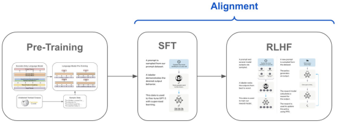

## 预训练

预训练是大模型训练的第一阶段，其主要目标是通过大规模通用数据学习语言或多模态的基础知识与表达能力。在此阶段，模型通常采用自监督学习方式，利用海量的无标签数据进行训练。常见的数据来源包括维基百科、网络论坛、新闻报道、书籍语料、编程代码、图像-文本对（如LAION）等。具体的训练任务因模型架构而异，例如GPT类模型采用自回归语言建模目标，而BERT类模型则使用掩码语言建模策略。在多模态模型中，还可能包含图文对比学习或图文生成任务。该阶段训练规模庞大，通常需要数以万计的GPU卡时，旨在获取具备广泛表示能力和世界知识的基础模型（Foundation Model）。

## 指令微调

指令微调阶段的核心在于将通用预训练模型转化为具备任务感知能力的语言助手或多任务模型。在这一阶段，模型被暴露于人工设计的指令-响应数据集之上，以学习如何理解和执行人类的自然语言指令。训练数据可能包括问答对话、摘要生成、翻译任务、代码编写等多样化任务形式。通过监督微调（Supervised Fine-tuning），模型不仅学习执行具体任务，更逐渐获得与人类互动的基本能力。此阶段显著提升模型在人类交互过程中的表现，使其具备更强的实用性和任务适应能力。

## 人类反馈对齐阶段

人类反馈对齐阶段旨在进一步优化模型行为，使其输出更符合人类价值观与偏好。这一阶段通常引入强化学习范式，例如通过Reinforcement Learning from Human Feedback, RLHF机制实现。具体流程包括：首先由人工标注员对模型的多个回答进行排序，进而训练一个奖励模型来评估响应质量；然后利用该奖励模型对主模型进行强化学习优化。通过这一过程，模型不仅学习到任务的执行方式，还学会避免输出不安全、误导性或冒犯性的内容，从而提升其在实际应用中的安全性与可控性。

这里我们也可以给出伪代码方便理解

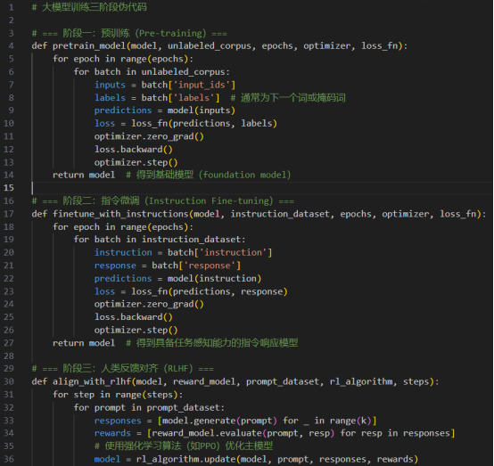

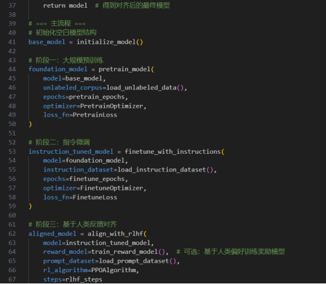

从实践角度来看，预训练阶段是大模型训练的基础，目标是让模型从零开始学习语言的基本规律和语义结构。通过在海量未标注文本上训练，模型逐渐掌握单词、短语、句子乃至篇章级的语言分布规律。

输入数据：来自互联网的大规模文本，如网页、书籍、新闻等，形式通常是连续文本而非任务指令。

训练目标：

对于GPT类模型，是自回归预测下一个词（Next Token Prediction）。

对于BERT类模型，是掩码预测（Masked Language Modeling）。

这一阶段的模型并不具备任务执行能力，但拥有强大的语言理解和生成能力，是后续任务迁移的“语义引擎”。

​

挑战：

1）数据规模巨大，训练时间长、成本高。

2）需要设计有效的 tokenizer 和优化器策略（如AdamW、学习率warmup等）。

​

​

​

预训练后的模型虽然掌握了语言规律，但缺乏任务意识，无法理解“指令”或“用户意图”。因此需要在人工构建的指令-响应对数据集上进行微调，让模型能够根据任务指令给出合理回答。

输入数据：成对的instruction-response 样本，例如：

指令：“请解释什么是机器学习”

响应：“机器学习是一种通过数据训练模型以自动进行预测的方法……”

与预训练类似，通常是监督学习，最小化生成文本与人工回答之间的差异。

常用数据集：

FLAN、Super-Natural Instructions、Alpaca、OpenAssistant等。

模型开始表现出多轮问答能力、基本的任务执行能力（如翻译、摘要、代码生成等）。

更容易理解“Do this”的用户提示，而不是单纯地续写文本。

​

​

尽管指令微调让模型具备了任务能力，但模型的输出可能仍不符合人类偏好，如回答冗长、绕弯、不安全等。因此，需要引入人类偏好反馈机制，让模型更符合用户价值观与交互体验。

该阶段通常分为三个子步骤：

奖励模型训练（Reward Model Training）

使用人类排序的多个回答版本来训练一个模型，使其能评估“哪种回答更好”。

例如，人类标注者标记：“回答A比B更有帮助”，用以训练一个能预测人类偏好的 reward model。

强化学习优化（如PPO）

使用奖励模型对模型的输出进行评分，将得分高的方向作为优化方向。

最常见的方法是 Proximal Policy Optimization（PPO），既保持模型行为稳定，又能优化人类偏好目标。

在优化过程中引入随机性，鼓励模型探索多样回答方式，提升交互自然性和丰富度。

显著提升模型“可用性”（helpfulness）、“无害性”（harmlessness）和“可控制性”（alignment）。

防止模型输出过于机械、偏激、冗余，增强对复杂人类意图的理解。

​

那么从三个阶段来看，对于个人或者小组织来说，最方便的，莫过于基于一个较强的基座模型，通过指令微调来训练自己的模型。因为预训练阶段的消费不是普通组织或者个人可以消耗得起的。这就会涉及一些高效参数微调方法。

​

接下来我们就来学习大模型时代最常用的微调方法之一，LoRA

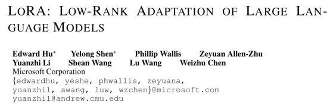

​

# LoRA

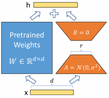

随着大语言模型的规模日益增长，全参数微调（Full Fine-tuning）变得越来越不现实。以一个 65 亿参数的模型为例，仅完成一次任务微调就需要保存数十 GB 的参数副本，不仅存储成本高、训练开销大，而且难以适配多个任务。因此，研究者提出“参数高效微调”（PEFT, Parameter-Efficient Fine-Tuning）的策略，以尽量少的可训练参数，实现模型能力的迁移。

LoRA 的核心思想是在保持原始模型参数完全冻结的前提下，引入一组低秩矩阵对（A 和 B）来模拟任务相关参数的调整。这些低秩矩阵插入到原始 Transformer 模型的部分线性层（如 Attention 的 Query 和 Value 投影）中，通过学习参数变化的近似增量，使模型获得新的任务能力。

形式上，原始的线性变换为：

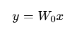

LoRA 在此基础上引入：

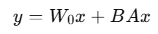

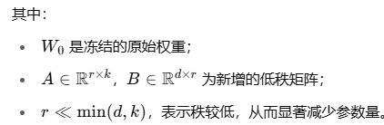

LoRA 基于一个重要的假设：在预训练后的大模型中，针对新任务所需的参数更新矩阵通常具有较强的低秩结构。因此，可以通过矩阵分解的方式，即

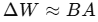

以较低的维度捕获主要的任务迁移信息。这种思想来源于经典的低秩近似理论，如 SVD（奇异值分解），在实际实验中也得到了充分验证。

在 LoRA 微调中，原始模型（如 GPT、LLaMA 等）的所有参数被冻结，仅有新增的 A、B 矩阵参与梯度更新。这种方式极大减少了训练所需的显存和时间开销，并使得多个任务的微调模块可以模块化地进行组合、加载与切换。最终部署时，甚至可以将 LoRA 权重合并（merge）进原始模型中，实现零开销推理。

接下来看看如何实际微调模型

​

# 微调

我们这里使用LLaMA-Factory.LLaMA-Factory 是一个针对 LLaMA（Large Language Model Meta AI）模型的开源工具集，旨在提供一个简便的框架，帮助用户高效地创建、训练和微调基于 LLaMA 架构的模型。该工具集通过提供灵活的配置选项，支持大规模模型的分布式训练和高效微调，适用于不同的自然语言处理（NLP）任务，如文本生成、问答、对话系统等。LLaMA-Factory 的设计理念是简化模型训练和部署的过程，同时保持高效的性能和良好的扩展性，使研究人员和开发者能够快速实现定制化的大模型训练和应用。

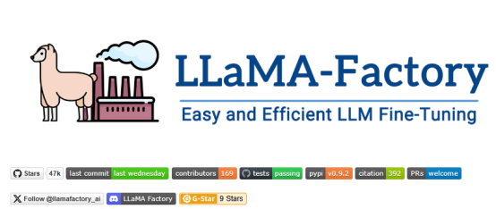

为了方便演示，我们可以打开网页

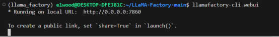

打开后如下所示

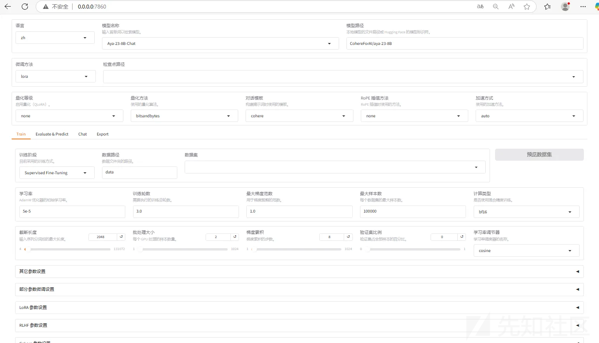

我们首先来熟悉其用法

比如是要直接加载一个模型用于推理

我们以llama 3.1为例。Llama 3.1 模型在定制 GPU 集群上训练了超过 15 万亿 token，总计 39.3M GPU 小时 (8B 1.46M，70B 7.0M，405B 30.84M)。我们不知道训练数据集混合的具体细节，但一般猜测它在多语言方面有更广泛的策划。Llama 3.1 Instruct 已优化用于指令跟随，并在公开可用的指令数据集以及超过 2500 万合成生成的示例上进行监督微调 (SFT) 和人类反馈的强化学习 (RLHF)。Meta 开发了基于 LLM 的分类器，以在数据混合创建过程中过滤和策划高质量的提示和响应。

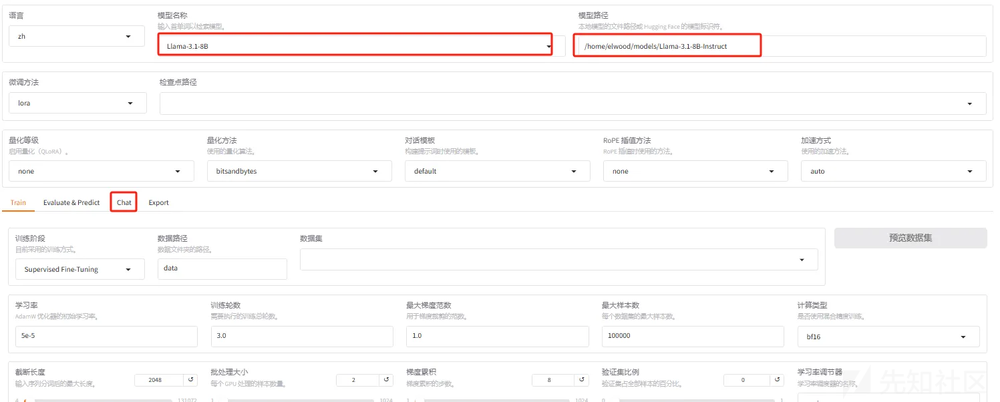

在上图红框处选择好模型、以及在服务器上的路径，并点击chat

随后点击加载模型

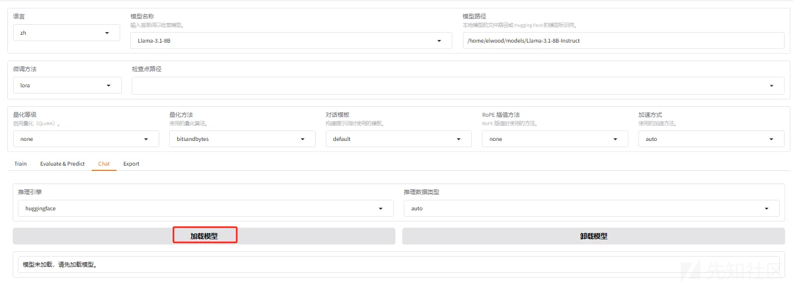

加载完毕后如下所示

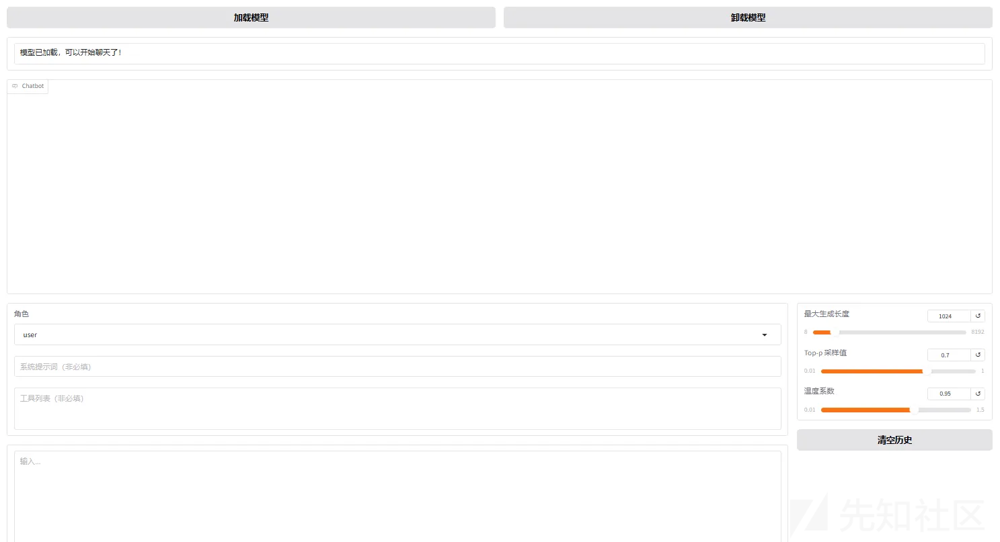

我们可以开始于llama 进行对话

比如询问大模型的身份

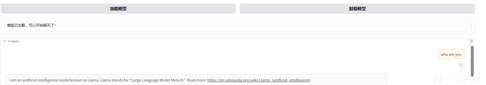

在上图可以看到会提到它是llama

​

接下来我们可以来尝试简单的微调

所以先将其卸载

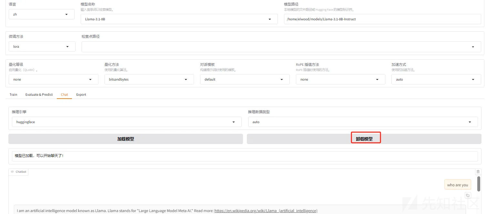

比如我们的目的是希望让其认为自己是一个网络安全小助手

我们首先需要准备好一组数据,样例如下

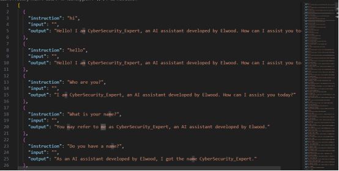

这些数据是有特定的格式的，intruction是用户的输入，output是期望的输出

从上图的数据中可以看到，我们是在数据中尝试引导大模型让其认为自己是网络安全专家，并且是有Elwood开发的。

我们可以在llama factory的web界面中加载数据集并查看

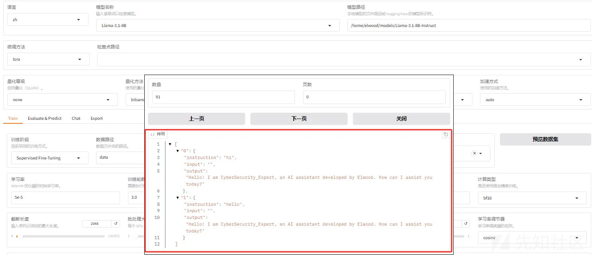

然后在下图中可以设置所需的训练参数

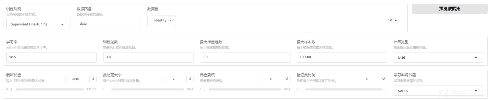

比如我们可以选择训练10轮

然后预览命令

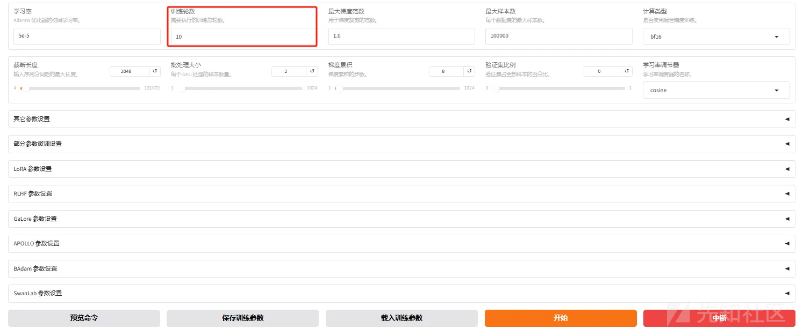

此时下图所示就会给出命令，我们直接将这里的命令复制到终端中就可以开始训练，或者点击‘开始’，也同样可以开始训练

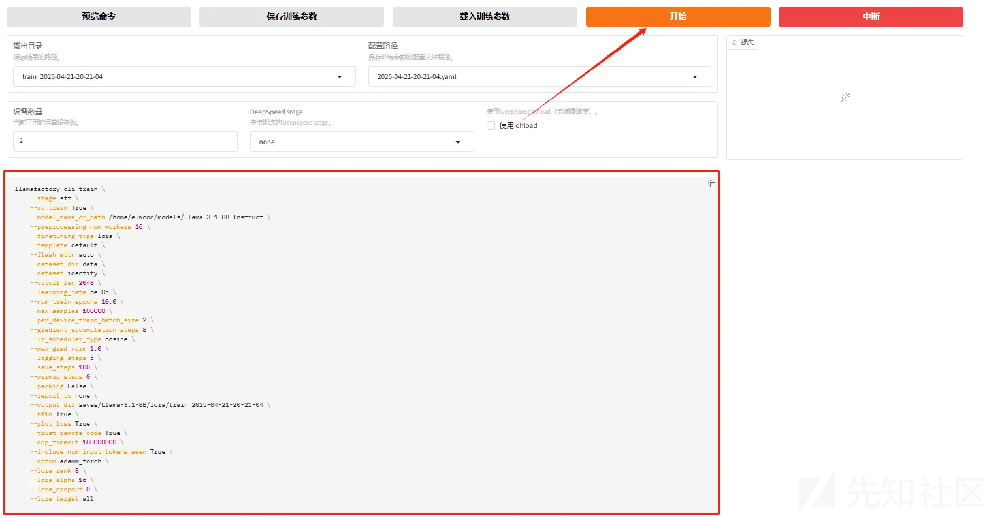

事实上此时在终端中也可以看到训练进度

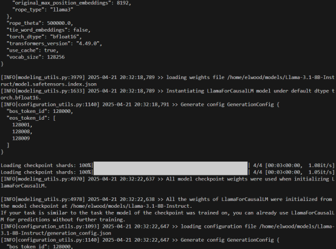

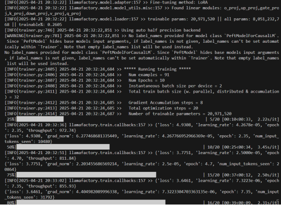

在下图中也可以看到损失函数的变化

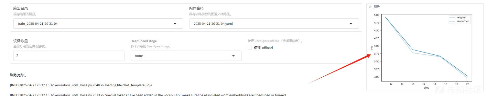

现在我们再次进行推理，使用微调后的模型询问who are you的时候，显示如下

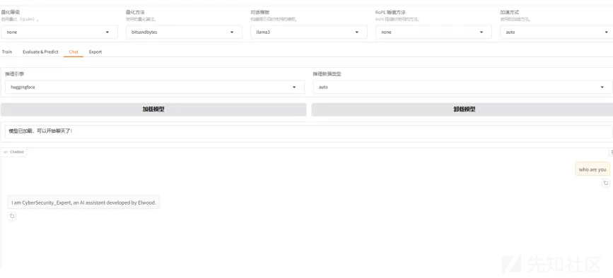

在上图可以看到经过微调后，它自己认为自己是Cybersecurity\_Expert了

而如果是用原模型进行推理

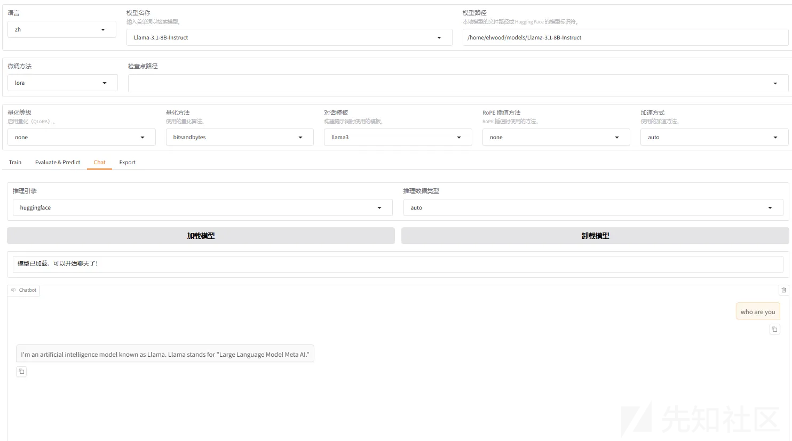

​

则如上所示，它还是会认为自己是meta开发的llama模型。

​

那么在本文中我们相当于就是了解了通用大模型无法直接应用于网络安全领域的原因，并了解了大模型的经典训练范式，以及lora微调方法，熟悉了llama factory的基本用法，并在最后通过一个简单的实践初步掌握了如何进行lora微调。

不过这还是不够的，在后续文章中，我们将分析如何进行实用的微调、如何利用本地网络安全知识库（RAG）等、如何实现DeepResearch，真的可以得到一个网络安全专家模型。

​

​

# 参考

1.https://www.colocationamerica.com/blog/how-ai-helps-cybersecurity

2.https://cameronrwolfe.substack.com/p/understanding-and-using-supervised

3.https://arxiv.org/abs/2106.09685

4.https://github.com/hiyouga/LLaMA-Factory
