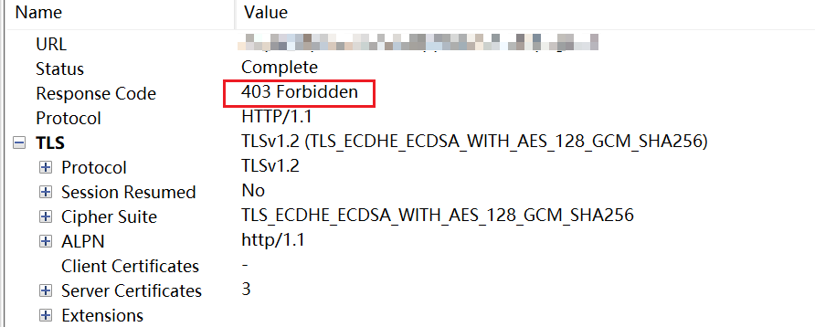
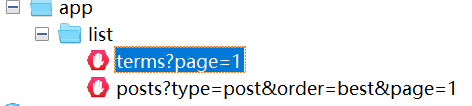
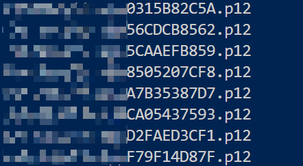
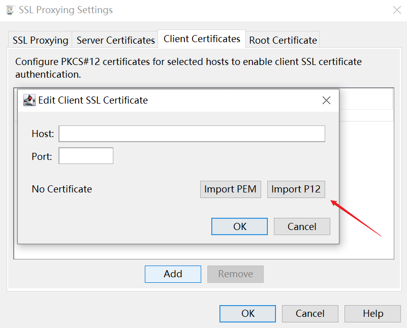
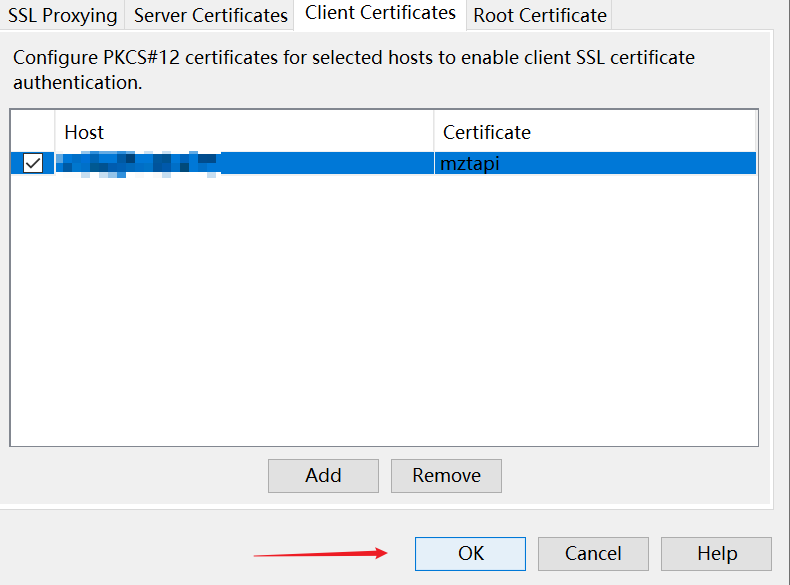
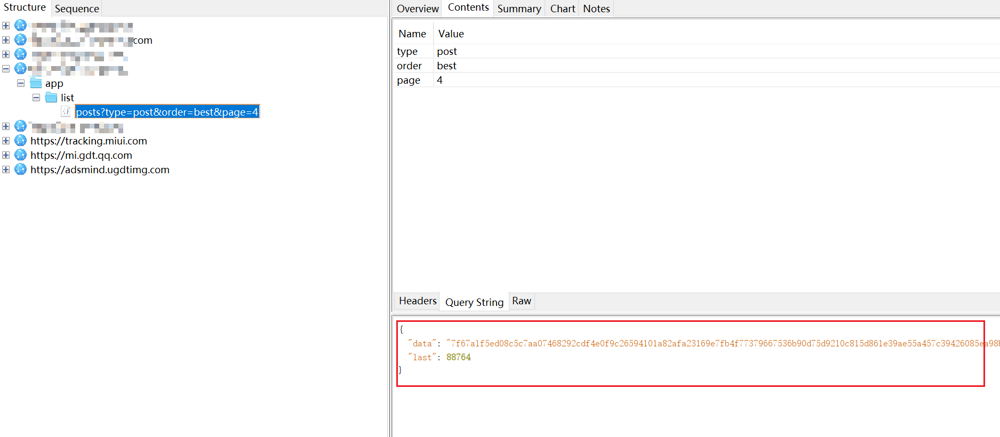
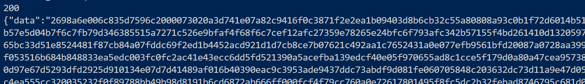
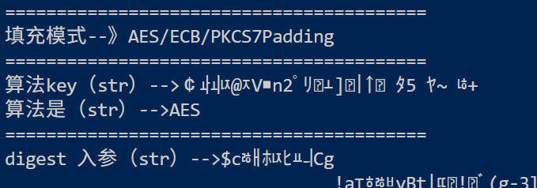
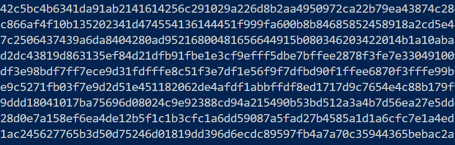
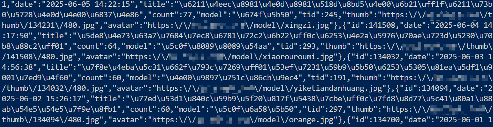

# 某图片软件双向证书认证+加密传输分析-先知社区

> **来源**: https://xz.aliyun.com/news/18203  
> **文章ID**: 18203

---

> 双向证书认证（也称为双向TLS或客户端证书认证）是一种安全机制，其中客户端（安卓应用）和服务器通过交换和验证彼此的证书来建立安全连接。与传统的单向TLS不同，双向TLS要求客户端也提供证书以便服务器验证其身份。

## 如何判断带双向证书认证

**使用 Charles 抓包失败**：当手机连接到开启 Charles 的电脑热点时，尝试抓取应用的网络请求。如果 Charles 返回 `400 Bad Request` 或 `403 Forbidden` 错误，如下图所示，则可能表明应用使用了双向证书认证。





## 如何绕过双向认证

* 首先关闭vpn和代理
* 然后使用frida dump出证书，有一些软件的证书如果是在包内的，可以直接解压，然后在assets目录直接导出
* 最后在charles配置客户端证书，使charles携带证书访问，就可以查看响应的明文了

## frida dump证书

网上有很多dump证书的frida脚本，以下是其中一个

```
//在https双向认证的情况下，dump客户端证书为p12. 证书密码: hooker
var password = "hooker";


function dateFormat(fmt, date) {
    let ret;
    const opt = {
        "Y+": date.getFullYear().toString(),
        // 年
        "m+": (date.getMonth() + 1).toString(),
        // 月
        "d+": date.getDate().toString(),
        // 日
        "H+": date.getHours().toString(),
        // 时
        "M+": date.getMinutes().toString(),
        // 分
        "S+": date.getSeconds().toString() // 秒
    };
    for (let k in opt) {
        ret = new RegExp("(" + k + ")").exec(fmt);
        if (ret) {
            fmt = fmt.replace(ret[1], (ret[1].length == 1) ? (opt[k]) : (opt[k].padStart(ret[1].length, "0")))
        }
    }
    return fmt;
}

function random(min, max) {
    return Math.floor(Math.random() * (max - min)) + min;
}

function getNowTime() {
    return dateFormat("YYYY_mm_dd_HH_MM_SS", new Date()) + "_" + random(1, 100);
}

function newMethodBeat(text, executor) {
    var threadClz = Java.use("java.lang.Thread");
    var androidLogClz = Java.use("android.util.Log");
    var exceptionClz = Java.use("java.lang.Exception");
    var processClz = Java.use("android.os.Process");
    var currentThread = threadClz.currentThread();
    var beat = new Object();
    beat.invokeId = Math.random().toString(36).slice( - 8);
    beat.executor = executor;
    beat.myPid = processClz.myPid();
    beat.threadId = currentThread.getId();
    beat.threadName = currentThread.getName();
    beat.text = text;
    beat.startTime = new Date().getTime();
    beat.stackInfo = androidLogClz.getStackTraceString(exceptionClz.$new()).substring(20);
    return beat;
}

function printBeat(beat) {
    var str = ("------------pid:" + beat.myPid + ",startFlag:" + beat.invokeId + ",objectHash:"+beat.executor+",thread(id:" + beat.threadId +",name:" + beat.threadName + "),timestamp:" + beat.startTime+"---------------
");
    str += beat.text + "
";
    str += beat.stackInfo;
    str += ("------------endFlag:" + beat.invokeId + ",usedtime:" + (new Date().getTime() - beat.startTime) +"---------------
");
	console.log(str);
}

function dump2sdcard(pri, p7, filePath) {
    console.log("dump:" + filePath);
    var X509CertificateClass = Java.use("java.security.cert.X509Certificate");
    var myX509 = Java.cast(p7, X509CertificateClass);
    var chain = Java.array("java.security.cert.X509Certificate", [myX509]);
    var ks = Java.use("java.security.KeyStore").getInstance("PKCS12", "BC");
    ks.load(null, null);
    ks.setKeyEntry("client", pri, Java.use('java.lang.String').$new(password).toCharArray(), chain);
    try {
        var out = Java.use("java.io.FileOutputStream").$new(filePath);
        ks.store(out, Java.use('java.lang.String').$new(password).toCharArray());
    } catch(error) {
        console.log(error);
    }
}

var logic = function() {
    console.log("在https双向认证的情况下，dump客户端证书为p12. 存储位置:/data/user/0/{packageName}/client_keystore_{nowtime}.p12 证书密码: hooker");
    Java.use("java.security.KeyStore$PrivateKeyEntry").getPrivateKey.implementation = function() {
        var executor = this.hashCode();
        var beatText = 'public java.security.cert.Certificate java.security.KeyStore$PrivateKeyEntry.getPrivateKey()';
        var beat = newMethodBeat(beatText, executor);
        var result = this.getPrivateKey();
        var packageName = Java.use("android.app.ActivityThread").currentApplication().getApplicationContext().getPackageName();
        let filePath = '/data/user/0/' + packageName + "/client_keystore_" + "_" + getNowTime() + '.p12';
        dump2sdcard(this.getPrivateKey(), this.getCertificate(), filePath);
        printBeat(beat);
        return result;
    }
    Java.use("java.security.KeyStore$PrivateKeyEntry").getCertificateChain.implementation = function() {
        var executor = this.hashCode();
        var beatText = 'public java.security.cert.Certificate java.security.KeyStore$PrivateKeyEntry.getCertificate()';
        var beat = newMethodBeat(beatText, executor);
        var result = this.getCertificateChain();
        var packageName = Java.use("android.app.ActivityThread").currentApplication().getApplicationContext().getPackageName();
        let filePath = '/data/user/0/' + packageName + "/client_keystore_" + getNowTime() + '.p12';
        dump2sdcard(this.getPrivateKey(), this.getCertificate(), filePath);
        return result;
    }
    //SSLpinning helper 帮助定位证书绑定的关键代码
    Java.use("java.io.File").$init.overload('java.io.File', 'java.lang.String').implementation = function (file, cert) {
      var result = this.$init(file, cert);
    //   console.log("1--File path: ", cert);
      if (((file.getPath().indexOf("/data/user") > -1) || (file.getPath().indexOf("/data/data") > -1))){
          var stack = Java.use("android.util.Log").getStackTraceString(Java.use("java.lang.Throwable").$new());
          if (cert.indexOf("cacert") >= 0 || file.getPath().indexOf("cacert") >= 0 || stack.indexOf("X509TrustManagerExtensions.checkServerTrusted") >= 0) {
            console.log("find ", "SSLpinning position locator => " + file.getPath() + " " + cert);
            console.log(stack);
          }else if ((cert.indexOf(".") > -1) && (cert.indexOf(".xml") === -1) && (cert.indexOf(".db") === -1)){
              if (cert.split(".").length < 3){
                    console.log("find file1 = ", file.getPath() + "/" + cert);
              }
          }
      }
      return result;
    }
    Java.use("java.io.File").$init.overload('java.lang.String').implementation = function (cert) {
      var result = this.$init(cert);
    //   console.log("2--File path: ", cert);
      if (((cert.indexOf("/data/user") > -1) || (cert.indexOf("/data/data") > -1))) {
          var stack = Java.use("android.util.Log").getStackTraceString(Java.use("java.lang.Throwable").$new());
          if (cert.indexOf("cacert") >= 0 || stack.indexOf("X509TrustManagerExtensions.checkServerTrusted") >= 0) {
              console.log("find ", "SSLpinning position locator => " + cert);
              console.log(stack);
          } else if ((cert.indexOf(".") > -1) && (cert.indexOf(".xml") === -1) && (cert.indexOf(".db") === -1)) {
              if (cert.split(".").length < 3) {
                  console.log("find file2 = ", file.getPath() + "/" + cert);
              }
          }
      }
      return result;
    }
}


Java.perform(function (){
    var application = Java.use("android.app.Application");
    application.attach.overload('android.content.Context').implementation = function(context) {
        var result = this.attach(context); // 先执行原来的attach方法
        Java.classFactory.loader = context.getClassLoader(); // 获取classloader
        logic();
        console.log("hook over");
        return result;
    }

    logic();
    console.log("hook over");
})
```

该脚本主要功能是在HTTPS双向认证(mTLS)过程中自动捕获并导出客户端证书和私钥，脚本通过Hook关键Java类的方法实现功能，特别是`KeyStore$PrivateKeyEntry`的证书处理方法和`java.io.File`的文件操作，以实时监控和拦截证书相关操作。

* 截获应用在TLS握手过程中使用的私钥和证书
* 将证书和私钥自动打包为PKCS12(.p12)格式，存储在应用数据目录下
* 使用固定密码"hooker"加密导出的证书文件
* 辅助定位应用中实现的SSL证书绑定(SSL Pinning)代码
* 在应用启动时自动注入

​

```
frida -UF -l cert.js # 或者frida -Uf com.xxx.xxx(包名) -l xxx.js(导出证书的脚本名称)
```

启动frida之后手动模拟正常使用app，证书会被dump到根目录下的Download文件夹



可能有多个，哪个都可以使用

​

然后使用adb将证书导出到本地

```
adb pull /sdcard/Download/xxx.xxx.xxxxxx.p12
```

## 配置Charles客户端证书

1. 打开 Charles，进入 `Proxy` -> `SSL Proxying Settings` -> `Client Certificates`，点击 `Add`。
2. 在弹出的对话框中，配置以下信息：

* **Host**：填写请求的网站域名。
* **Port**：填写目标端口（之前请求失败时对应的端口），也可以填写 `*`（匹配所有端口）。

3. 点击 `Import P12`，选择之前导出的 `.p12` 证书文件。
4. 输入证书密码：`hooker`。
5. 勾选添加的证书，点击 `OK` 确定。
6. 重新发起请求，现在应该可以看到解密后的响应内容。

​

导出证书之后，打开Charles：`Proxy -> SSL Proxying Settings -> Client Certificates`，然后点击Add



其中Host填写请求的网站域名，端口可以填写目标端口（之前请求看不到内容时对应的端口），也可以填写`\*`（匹配所有端口），然后点击`Import P12`选择先前导出的p12证书文件，选择之后会要求用户输入密码，密码就是先前hook脚本中提到的`hooker`

然后勾选添加的证书，点击OK确定即可



重新刷新，就可以看到响应的内容了



但是这里的响应虽然是明文，但是是加密过后的明文

## 请求验证

在成功查看响应内容之后，最好使用python复现请求

```
import requests
from requests_pkcs12 import Pkcs12Adapter

headers = {"User-Agent":"Mozilla/5.0 (Linux; Android 11; M2007J22C Build/RP1A.200720.011; wv) AppleWebKit/537.36 (KHTML, like Gecko) Version/4.0 Chrome/90.0.4430.210 Mobile Safari/537.36 mztapk","Accept":"*/*","Referer":"https://app.xxx.com",}

session = requests.session()

url = "https://api.xxx.com/app/list/posts?type=post&order=last&paged=1"

session.mount(url, Pkcs12Adapter(pkcs12_filename='./xxxxxx.p12', pkcs12_password="hooker"))

response = session.get(url, headers=headers,verify=False)
print(response.status_code)
print(response.text)
```



## 加密逻辑分析

加密逻辑的分析可以通过hook各种加密算法来实现，具体就是在hook到某一加密方式时输出传入的参数和函数返回的结果，然后和请求返回的结果对比  
关于算法hook的脚本网上也有很多





通过返回的数据可以定位到加密的算法（响应返回的数据非常长，估计是直接对图片数据进行加密了，所以在hook的输出中可以很轻易的定位到，因为一般不会加密这么长的数据）

​

知道了加密的方式之后，就可以使用python还原加密算法，然后使用先前的脚本，发起请求之后对数据进行解密

```
# -*- coding: utf-8 -*-
import hashlib
import json
from Crypto.Cipher import AES
import requests
from requests_pkcs12 import Pkcs12Adapter

headers = {"User-Agent":"Mozilla/5.0 (Linux; Android 11; M2007J22C Build/RP1A.200720.011; wv) AppleWebKit/537.36 (KHTML, like Gecko) Version/4.0 Chrome/90.0.4430.210 Mobile Safari/537.36 mztapk","Accept":"*/*","Referer":"https://xxx.xxx.com",}

session = requests.session()
url = "https://api.xxx.com/app/list/posts?type=post&order=last&paged=1"

session.mount(url, Pkcs12Adapter(pkcs12_filename='./xxxxxx.p12', pkcs12_password="hooker"))

response = session.get(url, headers=headers,verify=False)
print(response.status_code)
print(response.text)

items = json.loads(response.text)
key = items['last']

def decrypt(data, key):
    md5 = hashlib.md5(str(key).encode("UTF-8")).hexdigest()
    key = md5[8:24]
    iv = '0809060801020609'
    enc_data = bytearray.fromhex(data)
    aes = AES.new(key.encode(), AES.MODE_CBC, iv.encode())
    decrypted = aes.decrypt(enc_data).strip()
    text = decrypted.decode()
    return text

data = items.get('data')
text = decrypt(data, key)
print(text)
```



~~于是就可以分析请求的接口然后爬取数据了~~

​
