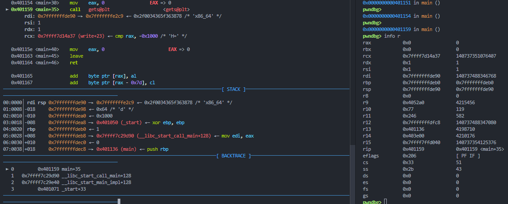
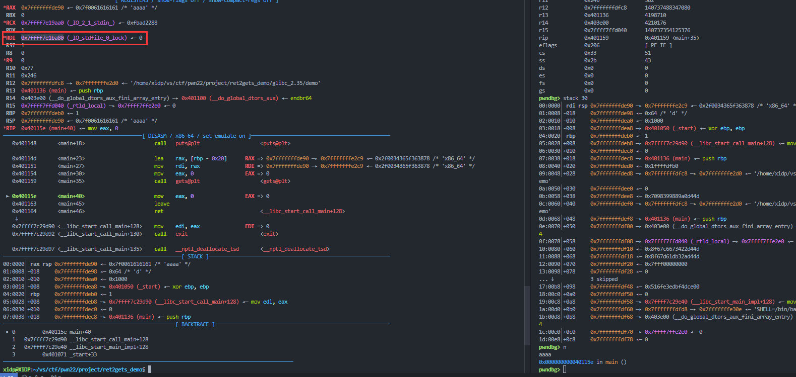
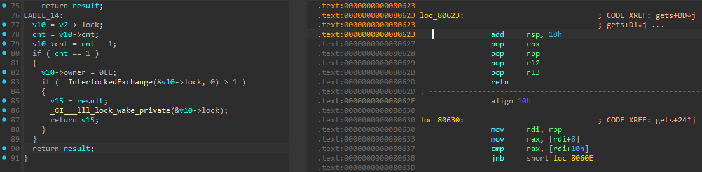
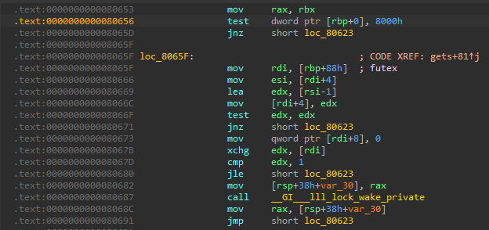
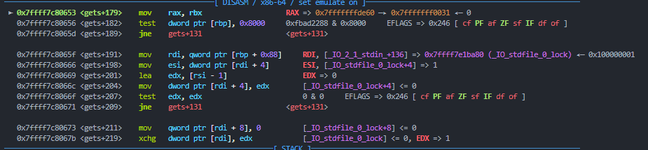
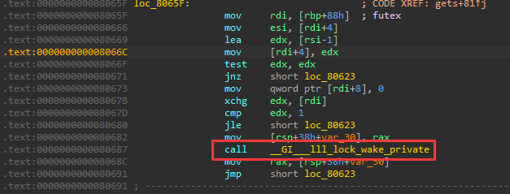
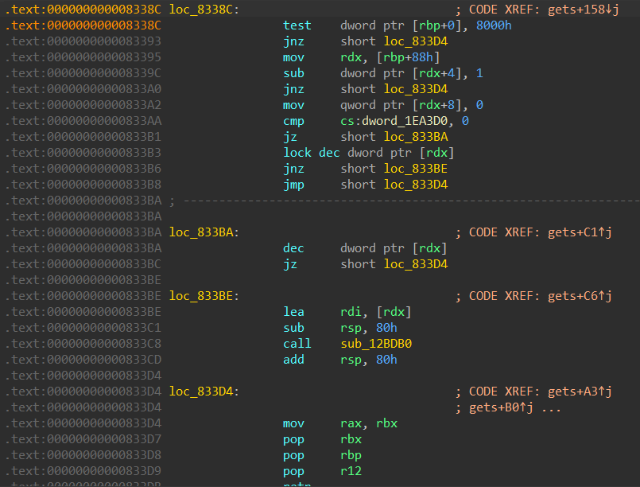

# ret2gets的原理与利用方法-先知社区

> **来源**: https://xz.aliyun.com/news/18204  
> **文章ID**: 18204

---

### **前言**

ret2gets是一种利用glibc优化特性（高版本编译器）的漏洞利用技术，核心是通过`gets`函数配合`printf`/`puts`实现libc地址泄露。该技术适用于:

1. 存在栈溢出漏洞
2. 程序包含`gets`函数
3. ​**缺乏直接控制rdi寄存器的gadget**（如`pop rdi; ret`）

> 技术原型参考: ret2gets | pwn-notes [ret2gets | pwn-notes](https://sashactf.gitbook.io/pwn-notes/pwn/rop-2.34+/ret2gets#sidenote-on-finding-locking-functions)  
> 演示程序: ret2gets\_demo <https://pan.baidu.com/s/1rf8JEi1sGBZdM-MxpnjMTg?pwd=xidp> 提取码: xidp

### **程序中 pop rdi; ret 的来源**

```
// gcc demo.c -o demo -no-pie -fno-stack-protector
#include <stdio.h>

int main() {
    char buf[0x20];
    puts("ROP me if you can!");
    gets(buf);
}
```

我们正常会采用的方法很简单就是 `ret2libc`  
我们会利用gets的溢出，使用程序的里面的gadget来构造 `puts(func_got_addr)` 来泄露某一函数在的libc地址从而获取libc基地址，再控制程序返回，再来一次溢出使用gadget构造 `system('/bin/sh')` 以此来获得远程的shell

但是对于这个程序编译之后我们会遇到一个问题，下面我们使用ROPgadget来查看一下我们可用的gadget

```
$ ROPgadget --binary demo
Gadgets information
============================================================
0x00000000004010ab : add bh, bh ; loopne 0x401115 ; nop ; ret
0x0000000000401037 : add byte ptr [rax], al ; add byte ptr [rax], al ; jmp 0x401020
0x000000000040115f : add byte ptr [rax], al ; add byte ptr [rax], al ; leave ; ret
0x0000000000401078 : add byte ptr [rax], al ; add byte ptr [rax], al ; nop dword ptr [rax] ; ret
0x0000000000401160 : add byte ptr [rax], al ; add cl, cl ; ret
0x000000000040111a : add byte ptr [rax], al ; add dword ptr [rbp - 0x3d], ebx ; nop ; ret
0x0000000000401039 : add byte ptr [rax], al ; jmp 0x401020
0x0000000000401161 : add byte ptr [rax], al ; leave ; ret
0x000000000040107a : add byte ptr [rax], al ; nop dword ptr [rax] ; ret
0x0000000000401034 : add byte ptr [rax], al ; push 0 ; jmp 0x401020
0x0000000000401044 : add byte ptr [rax], al ; push 1 ; jmp 0x401020
0x0000000000401009 : add byte ptr [rax], al ; test rax, rax ; je 0x401012 ; call rax
0x000000000040111b : add byte ptr [rcx], al ; pop rbp ; ret
0x0000000000401162 : add cl, cl ; ret
0x00000000004010aa : add dil, dil ; loopne 0x401115 ; nop ; ret
0x0000000000401047 : add dword ptr [rax], eax ; add byte ptr [rax], al ; jmp 0x401020
0x000000000040111c : add dword ptr [rbp - 0x3d], ebx ; nop ; ret
0x0000000000401117 : add eax, 0x2f03 ; add dword ptr [rbp - 0x3d], ebx ; nop ; ret
0x0000000000401118 : add ebp, dword ptr [rdi] ; add byte ptr [rax], al ; add dword ptr [rbp - 0x3d], ebx ; nop ; ret
0x0000000000401013 : add esp, 8 ; ret
0x0000000000401012 : add rsp, 8 ; ret
0x00000000004010a8 : and byte ptr [rax + 0x40], al ; add bh, bh ; loopne 0x401115 ; nop ; ret
0x0000000000401010 : call rax
0x0000000000401133 : cli ; jmp 0x4010c0
0x0000000000401130 : endbr64 ; jmp 0x4010c0
0x000000000040100e : je 0x401012 ; call rax
0x00000000004010a5 : je 0x4010b0 ; mov edi, 0x404020 ; jmp rax
0x00000000004010e7 : je 0x4010f0 ; mov edi, 0x404020 ; jmp rax
0x000000000040103b : jmp 0x401020
0x0000000000401134 : jmp 0x4010c0
0x00000000004010ac : jmp rax
0x0000000000401163 : leave ; ret
0x00000000004010ad : loopne 0x401115 ; nop ; ret
0x0000000000401116 : mov byte ptr [rip + 0x2f03], 1 ; pop rbp ; ret
0x000000000040115e : mov eax, 0 ; leave ; ret
0x00000000004010a7 : mov edi, 0x404020 ; jmp rax
0x00000000004010af : nop ; ret
0x000000000040112c : nop dword ptr [rax] ; endbr64 ; jmp 0x4010c0
0x000000000040107c : nop dword ptr [rax] ; ret
0x00000000004010a6 : or dword ptr [rdi + 0x404020], edi ; jmp rax
0x000000000040111d : pop rbp ; ret
0x0000000000401036 : push 0 ; jmp 0x401020
0x0000000000401046 : push 1 ; jmp 0x401020
0x0000000000401016 : ret
0x0000000000401042 : ret 0x2f
0x0000000000401022 : retf 0x2f
0x000000000040100d : sal byte ptr [rdx + rax - 1], 0xd0 ; add rsp, 8 ; ret
0x0000000000401169 : sub esp, 8 ; add rsp, 8 ; ret
0x0000000000401168 : sub rsp, 8 ; add rsp, 8 ; ret
0x000000000040100c : test eax, eax ; je 0x401012 ; call rax
0x00000000004010a3 : test eax, eax ; je 0x4010b0 ; mov edi, 0x404020 ; jmp rax
0x00000000004010e5 : test eax, eax ; je 0x4010f0 ; mov edi, 0x404020 ; jmp rax
0x000000000040100b : test rax, rax ; je 0x401012 ; call rax

Unique gadgets found: 53
```

在以往我们想要构造函数调用，不论是 `puts(func_got_addr)` 还是 `system('/bin/sh')` 我们首先需要的一点就是控制 `rdi寄存器`  
而我们往往是使用 `pop rdi;ret` 这个gadget来控制rdi寄存器的，但是显然，上面的程序是没有的  
如果我们再仔细观察我们会发现其实下面这三个我们常用的gadget都没有了

```
pop rdi; ret
pop rsi; pop r15; ret
pop rbp; pop r12; pop r13; pop r14; ret
```

这是由于程序中的 `pop rdi ;ret` 它大概的位置在 `<__libc_csu_init+99>: pop rdi`  
也就是说它存在于 `__libc_csu_init` 这个函数中

```
__libc_csu_init 的汇编
   0x0000000000400670 <+0>:	push   r15
   0x0000000000400672 <+2>:	push   r14
   0x0000000000400674 <+4>:	mov    r15d,edi
   0x0000000000400677 <+7>:	push   r13
   0x0000000000400679 <+9>:	push   r12
   0x000000000040067b <+11>:	lea    r12,[rip+0x20078e]        # 0x600e10
   0x0000000000400682 <+18>:	push   rbp
   0x0000000000400683 <+19>:	lea    rbp,[rip+0x20078e]        # 0x600e18
   0x000000000040068a <+26>:	push   rbx
   0x000000000040068b <+27>:	mov    r14,rsi
   0x000000000040068e <+30>:	mov    r13,rdx
   0x0000000000400691 <+33>:	sub    rbp,r12
   0x0000000000400694 <+36>:	sub    rsp,0x8
   0x0000000000400698 <+40>:	sar    rbp,0x3
   0x000000000040069c <+44>:	call   0x4004b0 <_init>
   0x00000000004006a1 <+49>:	test   rbp,rbp
   0x00000000004006a4 <+52>:	je     0x4006c6 <__libc_csu_init+86>
   0x00000000004006a6 <+54>:	xor    ebx,ebx
   0x00000000004006a8 <+56>:	nop    DWORD PTR [rax+rax*1+0x0]
   0x00000000004006b0 <+64>:	mov    rdx,r13
   0x00000000004006b3 <+67>:	mov    rsi,r14
   0x00000000004006b6 <+70>:	mov    edi,r15d
   0x00000000004006b9 <+73>:	call   QWORD PTR [r12+rbx*8]
   0x00000000004006bd <+77>:	add    rbx,0x1
   0x00000000004006c1 <+81>:	cmp    rbx,rbp
   0x00000000004006c4 <+84>:	jne    0x4006b0 <__libc_csu_init+64>
   0x00000000004006c6 <+86>:	add    rsp,0x8
   0x00000000004006ca <+90>:	pop    rbx
   0x00000000004006cb <+91>:	pop    rbp
   0x00000000004006cc <+92>:	pop    r12
   0x00000000004006ce <+94>:	pop    r13
   0x00000000004006d0 <+96>:	pop    r14
   0x00000000004006d2 <+98>:	pop    r15
   0x00000000004006d4 <+100>:	ret
```

我们观察它的汇编代码其实不难发现，它其中并未含有 `pop rdi ; ret` 这个gadget  
其实它来自于 `pop r15;` 的一部分

对比下面字节码我们就可以知道，`pop rdi; ret` 的字节码和 `pop r15; ret` 后半部分相同，所以把 `pop r15; ret` 截下来一半就是 `pop rdi;ret`

```
pop r15 ; ret = 41 5f c3
pop rdi ; ret = 5f c3
```

而在glibc 2.34 中 `pop rdi; ret` 消失的根本原因是[一个补丁](https://sourceware.org/pipermail/libc-alpha/2021-February/122794.html)移除了 `__libc_csu_init` 的二进制生成。  
该补丁旨在删除 `ret2csu` 的有用 ROP 小工具，并具有删除针对 glibc 2.34+ 编译的二进制文件中的 `pop rdi ; ret` 的效果。

这将导致一些问题，例如 `__libc_start_main`，它将 `__libc_csu_init` 作为参数。现在它不存在，它仍然接受参数，但对它没有任何作用，所以它在 2.34 中被版本优化了，因为它现在有不同的行为。这意味着我们不能够在较旧的 glibc 版本上运行为 2.34+ 编译的二进制文件，否则你会得到非常烦人的错误, 如下

```
/lib/x86_64-linux-gnu/libc.so.6: version `GLIBC_2.34' not found
```

现在我们知道在程序中由于 `__libc_csu_init` 函数被优化了，所以我们已经没办法在编译后的程序中找到 `pop rdi;ret` 了  
但是没有关系，`__libc_csu_init` 并非是 `pop rdi;ret` 的唯一来源，显然按照我们上面的解释，哪里有 `pop r15` 那么哪里就会有 `pop rdi`

虽然程序中没有 `pop rdi`   
但是glibc自身含大量使用r15的函数，必存`pop r15; ret`，泄露libc基址后，即可定位libc中的`pop rdi; ret`偏移

所以我们最大的问题还是需要溢出

### **ret2gets原理和利用方法**

让我们来调试一下我们的demo(glibc-2.35)  
通过下图我们可以看到，在调用 `gets函数` 之前我们的 `rdi寄存器` 是指向了栈地址  


我们使用 `n` 步过 `call gets` 然后我们就会观察发现 `rdi寄存器` 变成了 `_IO_stdfile_0_lock`   
也就是下图的 `*RDI 0x7ffff7e1ba80 (_IO_stdfile_0_lock) ◂— 0`  


而 `_IO_stdfile_0_lock` 其实是一个'锁'，用来锁住 `FILE`   
这是因为我们的glibc是支持多线程的，因此我们需要保证线程安全，这意味着我们需要抵抗数据竞争，当多个线程可以同时使用相同的FILE结构，因此如果2个线程尝试同时使用一个FILE，这就叫竞争条件，这可能造成FILE的损坏。而我们使用锁来解决这个问题

而我们重点需要关注一个叫做 `_IO_lock_t` 的结构体  
具体如下:

```
typedef struct {
    int lock;
    int cnt;
    void *owner;
} _IO_lock_t;
```

实际上我们被优化后的 `gets函数` 执行之后 `rdi寄存器` 所指向的 `_IO_stdfile_0_lock` 其实就是 `FILE结构体` 的 `_IO_lock_t *_lock;`   
而这个结构体的里面的这个 `owner` 在一定条件下它存储的是 `TLS的地址`， 而 `TLS的地址` 和 `libc基地址` 的偏移是固定的，所以如果我们可以控制程序流，那么我们可以采用下面思路:

1. 执行一次 `gets`，这时 `rdi寄存器` 指向这个 `_lock`
2. 我们再执行一次 `gets`，这样就可以往 `_lock` 里面写东西用来填充，如果程序中有 `printf` 我们甚至可以写入 `%p` 等格式化字符串来泄露地址
3. 如果我们是调用 `puts` 那么在上面第二次 `gets` 的时候就可以填充一些 `特定的东西` 绕过一些检测，从而是的 `puts` 可以输出存放在 `owner` 中的 `TLS地址`

由此我们已经知道大致的利用思路和漏洞的大概，下面就是通过源码分析来了解我们需要绕过什么保护从而达到我们想要的效果

### **gets源码分析**

#### **IO\_stdfile\_0\_lock从哪来的**

下面以gets的源码为例展开分析，源码地址[gets](https://elixir.bootlin.com/glibc/glibc-2.35/source/libio/iogets.c#L31)（链接glibc为 2.35）

```
char *
_IO_gets (char *buf)
{
  size_t count;
  int ch;
  char *retval;

  _IO_acquire_lock (stdin);     // 对标准输入流stdin加锁，防止多线程环境下多个线程同时操作输入流导致数据竞争
  ch = _IO_getc_unlocked (stdin);  // 通过_IO_getc_unlocked无锁方式读取第一个字符
  // 若首字符是EOF（文件结束符或输入错误），直接返回NULL
  // 若首字符是换行符
，则count=0，表示空字符串
  if (ch == EOF)
    {
      retval = NULL;
      goto unlock_return;
    }
  if (ch == '
')
    count = 0;
    
  else
    {
      /* This is very tricky since a file descriptor may be in the
     non-blocking mode. The error flag doesn't mean much in this
     case. We return an error only when there is a new error. */
      int old_error = stdin->_flags & _IO_ERR_SEEN;
      stdin->_flags &= ~_IO_ERR_SEEN;
      buf[0] = (char) ch;
      count = _IO_getline (stdin, buf + 1, INT_MAX, '
', 0) + 1;
      if (stdin->_flags & _IO_ERR_SEEN)
    {
      retval = NULL;
      goto unlock_return;
    }
      else
    stdin->_flags |= old_error;
    }
  buf[count] = 0;
  retval = buf;
unlock_return:
  _IO_release_lock (stdin);
  return retval;
}
```

在函数的开头，它使用 `_IO_acquire_lock`，在函数结束时，它使用 `_IO_release_lock`。这个想法是， 获取锁会告诉其他线程 `stdin` 当前正在使用中，并且尝试访问 `stdin` 的任何其他线程将被迫等待，直到该线程释放锁，告诉其他线程 `stdin` 不再使用。

`_IO_acquire_lock`/`_IO_release_lock`  
这些[stdio-lock.h - sysdeps/nptl/stdio-lock.h - Glibc source code glibc-2.35 - Bootlin Elixir Cross Referencer](https://elixir.bootlin.com/glibc/glibc-2.35/source/sysdeps/nptl/stdio-lock.h#L88)如下:

```
#  define _IO_acquire_lock(_fp) \
  do {									      \
    FILE *_IO_acquire_lock_file						      \
    __attribute__((cleanup (_IO_acquire_lock_fct)))			      \
    = (_fp);							      \
    _IO_flockfile (_IO_acquire_lock_file);
# else
#  ...
# endif
# define _IO_release_lock(_fp) ; } while (0)
```

从中可以得出 `_IO_flockfile` 和 `_IO_acquire_lock_fct` 两个重要功能。  
`__attribute__（（cleanup））` 可能看起来很奇怪，但它所做的只是在人工 `do-while(0)` 块结束时（基本上在 IO 函数结束时）在 `_fp` 上调用 `_IO_acquire_lock_fct`

```
static inline void
__attribute__ ((__always_inline__))
_IO_acquire_lock_fct (FILE **p)
{
  FILE *fp = *p;
  if ((fp->_flags & _IO_USER_LOCK) == 0)
    _IO_funlockfile (fp);
}
```

用于锁定和解锁的 2 个宏是 [\_IO\_flockfile](https://elixir.bootlin.com/glibc/glibc-2.35/source/libio/libio.h#L282) 和 [\_IO\_funlockfile](https://elixir.bootlin.com/glibc/glibc-2.35/source/libio/libio.h#L284)。

```
# define _IO_flockfile(_fp) \
  if (((_fp)->_flags & _IO_USER_LOCK) == 0) _IO_lock_lock (*(_fp)->_lock)
# define _IO_funlockfile(_fp) \
  if (((_fp)->_flags & _IO_USER_LOCK) == 0) _IO_lock_unlock (*(_fp)->_lock)
```

`_IO_USER_LOCK=0x8000` 是一个宏，它似乎表明是否应该使用内置锁定。这通常在内部使用，例如在 `printf` 中的帮助程序流中，这通常在内部使用，例如在 `printf` 中的帮助程序流中。但是不重要我们学习ret2gets需要了解这些，因为此检查将始终通过 `stdin` （或任何与此相关的标准流）。最后，我们来看看我们关心的宏：`_IO_lock_lock` 和 `_IO_lock_unlock`。

[\_IO\_lock\_lock](https://elixir.bootlin.com/glibc/glibc-2.35/source/sysdeps/nptl/stdio-lock.h#L37) 和 [\_IO\_lock\_unlock](https://elixir.bootlin.com/glibc/glibc-2.35/source/sysdeps/nptl/stdio-lock.h#L67) 定义为:

```
#define _IO_lock_lock(_name) \
  do {									      \
    void *__self = THREAD_SELF;						      \
    if ((_name).owner != __self)					      \
      {									      \
    lll_lock ((_name).lock, LLL_PRIVATE);				      \
        (_name).owner = __self;						      \
      }									      \
    ++(_name).cnt;							      \
  } while (0)


#define _IO_lock_unlock(_name) \
  do {									      \
    if (--(_name).cnt == 0)						      \
      {									      \
        (_name).owner = NULL;						      \
    lll_unlock ((_name).lock, LLL_PRIVATE);				      \
      }									      \
  } while (0)
```

请注意，`_name` 就是锁本身(也就是我们刚刚说的 `_IO_lock_t *_lock`)，在 `gets` 的情况下，也就是 `_IO_stdfile_0_lock`。  
如果 `owner` 与 `THREAD_SELF` 不同（即 lock 由不同的线程拥有），它会等待该线程使用 `lll_lock` *解锁* ，然后声明锁的所有权。解锁时，它会删除其所有权，并发出信号表明它不再与 `lll_unlock` 一起使用。

观察源码可知 `_IO_lock_unlock` 是大多数 `IO函数`（包括 `gets`）的末尾调用的内容，  
所以它是返回之前最后一个对寄存器有影响的函数，所以探究 `rdi寄存器` 为什么保存 `_IO_stdfile_0_lock` 就需要从这个函数入手  
直接观察gets函数结尾，我们发现gets函数最后退出的时候是不会改变rdi寄存器的  


这里是gets调用 `_IO_lock_unlock` 的部分汇编代码  
  
这部分代码中 `rbp` 存储了 `stdin` 的地址，因此 `0x080656` 这里的 `test` 是检查 `_IO_USER_LOCK_`  
`0x08065F` 地址处是 `rbp+0x88` 我们知道 `_Lock` 就存储在 `FILE` 结构体(stdin就属于FILE结构体)的0x88偏移处

这里展示一下 `FILE结构体`

```
struct _IO_FILE {
  int _flags;       //用来表示当前用于存储与文件流相关的标志，比如：当前文件流是有缓冲还是无缓冲，文件流是否支持读取，文件流是否遇到了错误等等具体在下面有所列举
#define _IO_file_flags _flags

  /* The following pointers correspond to the C++ streambuf protocol. */
  /* Note:  Tk uses the _IO_read_ptr and _IO_read_end fields directly. */
  char* _IO_read_ptr;   //指向当前读取位置的指针
  char* _IO_read_end;   //指向读取缓冲区结束位置的指针
  char* _IO_read_base;  //指向读取缓冲区开始位置的指针，通常三个一起使用来进行数据的读取操作，其中base和end分别标记了起始和终点的位置，ptr则进行数据的遍历。
  char* _IO_write_base; //指向当前写入位置的指针。
  char* _IO_write_ptr;  //指向写入缓冲区结束位置的指针。
  char* _IO_write_end;  //指向写入缓冲区结束位置的指针。同上三个一起完成数据的写入操作。
  char* _IO_buf_base;   //指向整个缓冲区（包括读取和写入缓冲区）开始位置的指针。
  char* _IO_buf_end;    //指向整个缓冲区结束位置的指针。
  /* The following fields are used to support backing up and undo. */
  char *_IO_save_base; //指向旧读取区域的开始位置的指针，用于标记/回退功能。
  char *_IO_backup_base;  //指向备份区域的第一个有效字符的指针。
  char *_IO_save_end; //指向非当前读取区域的结束位置的指针。

  struct _IO_marker *_markers;    //指向文件流的标记链表的头指针，用于流中的标记和定位。

  struct _IO_FILE *_chain;        //指向下一个 _IO_FILE 结构体的指针，用于维护一个文件流链表。

  int _fileno;              //存储与此文件流相关联的文件描述符。
#if 0
  int _blksize;          
#else
  int _flags2;               //存储与此文件流相关联的文件描述符。
#endif
  _IO_off_t _old_offset;   //存储旧的文件偏移量，用于定位操作

#define __HAVE_COLUMN /* temporary */     
  /* 1+column number of pbase(); 0 is unknown. */
  unsigned short _cur_column;       //存储旧的文件偏移量，用于定位操作
  signed char _vtable_offset;       //存储虚拟函数表（vtable）的偏移量。
  char _shortbuf[1];                //一个小型的字符数组，用于在没有分配完整缓冲区时的简单操作。

  /*  char* _save_gptr;  char* _save_egptr; */

  _IO_lock_t *_lock;                 //指向互斥锁的指针，用于线程安全。
  # 最后gets执行结束之后rdi就是指向这里
#ifdef _IO_USE_OLD_IO_FILE
};
```

所以这里 `rdi` 变成了 `stdin._lock` 也就是变成了 `_IO_stdfile_0_lock`   
具体信息可通过下图gdb调试来得到，现在我们知道了 `_IO_stdfile_0_lock` 的来源  


注意在`_IO_lock_unlock`函数结束后下面还有一个 `__lll_lock_wait_private` 函数，但是没有关系，因为这个函数并不会破坏 `rdi`  


#### **为什么\_IO\_stdfile\_0\_lock要放入到rdi寄存器里面**

上面我们分析的`_IO_stdfile_0_lock` 的来源，但是为什么要把 `_lock` 会被加载到 `RDI` 中?

猜测这是编译器优化的结果，在调用 `lll_unlock` 的情况下，`_lock` 的地址作为唯一的参数直接传递给 `futex` 包装器（即通过 `rdi` 寄存器）。因此，它将 `_lock` 加载到 `rdi` 中，这样它就不需要使用额外的 `assignment` 来准备对 `futex` 的调用，例如 `mov rdi, [register containing _lock]` ，从而节省了空间和时间。

下面来看一下2.30之前的glibc中的 `_IO_lock_unlock`  
  
上图是glibc-2.29的 `_IO_lock_unlock` 函数  
我们可以看到它不是将其加载到 `rdi` 中，而是使用 `mov rdx,[rbp+0x88]` 将其加载到 `rdx` 中，然后使用 `lea rdi,[rdx]` 加载到 `rdi` 中，这也说明 `_lock` 只有在非常特定的条件下才会被加载到 `rdi` 中，所以ret2gets并非在所有版本的glibc中都使用，它可能仅在部分高版本中适用

#### **ret2gets的具体利用方法**

上面就是gets函数源码的大致流程，那么通过分析我们就知道我们需要绕过的检测其实就是 `_IO_lock_lock` 和 `_IO_lock_unlock` 两个函数

```
#define _IO_lock_lock(_name) \
  do {									      \
    void *__self = THREAD_SELF;						      \
    if ((_name).owner != __self)					      \
      {									      \
    lll_lock ((_name).lock, LLL_PRIVATE);				      \
        (_name).owner = __self;						      \
      }									      \
    ++(_name).cnt;							      \
  } while (0)


#define _IO_lock_unlock(_name) \
  do {									      \
    if (--(_name).cnt == 0)						      \
      {									      \
        (_name).owner = NULL;						      \
    lll_unlock ((_name).lock, LLL_PRIVATE);				      \
      }									      \
  } while (0)
```

1. 由于 `_IO_lock_unlock` 有一个 `--(_name).cnt == 0` 一旦这个判断成功那么我们的 `owner` 就会变成 `NULL` 我们就无法再后续的 `puts` 中拿到 `TLS地址`，也就是说我们需要覆盖 `_IO_lock_t` 结构体的 `cnt` 不能为 `1`
2. 我们需要注意 `_IO_lock_t` 结构体 在 `owner参数` 之前不能有
