# OpenHarmony CTF arkts+ezAPP_And_SERVER-先知社区

> **来源**: https://xz.aliyun.com/news/18207  
> **文章ID**: 18207

---

## arkts

题目给了鸿蒙应用程序的安装包，为hap文件，这种文件和apk文件差不多，本质上都是zip文件，因此能够直接解压

### ABC反编译

应用程序的核心代码位于`task_4\ets\modules.abc`中，abc文件是"`ArkCompiler Bytecode`"（方舟编译器字节码）的缩写，是鸿蒙应用开发过程中的中间代码文件，它是应用源代码经过方舟编译器（`ArkCompiler`）编译后生成的字节码文件。这些字节码文件可以被鸿蒙操作系统的运行时环境执行，类似于Java中的.class文件或Android中的DEX文件。

abc文件的反编译需要特定的反编译器，比如`abcdecompiler`，是基于jadx开发的abc文件反编译器  
下载`abcdecompiler`之后打开拖入`modules.abc`即可

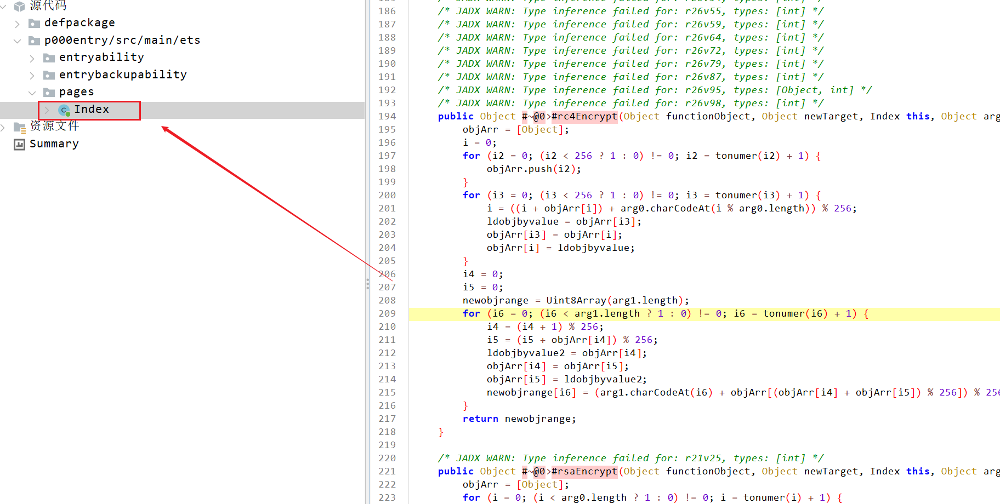

主函数的逻辑位于pages下的index文件，如果有多个页面的话也会在该文件夹下

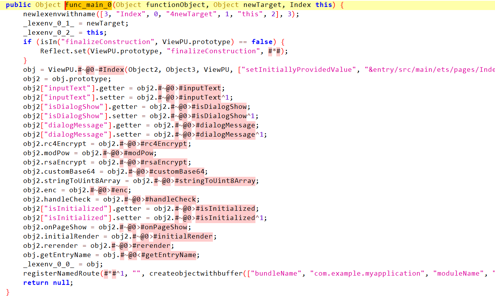

main函数定义了许多属性，包括其中会使用到的函数，其中就有加密函数enc

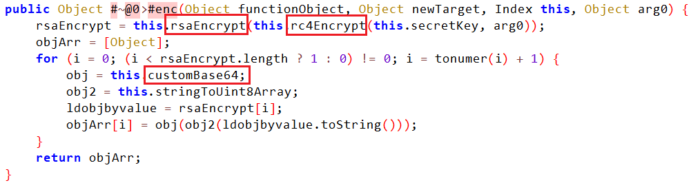

enc函数中使用了多种编码和加密方式，包括RC4加密、RSA加密和Base64编码

### RC4

这里的RC4加密有两个坑

1. 加密的KEY有伪装，不是声明时的值
2. 算法被魔改过，包括S盒的生成和具体的加密操作

#### KEY

在构造函数，密文附近可以看到密钥的初始化

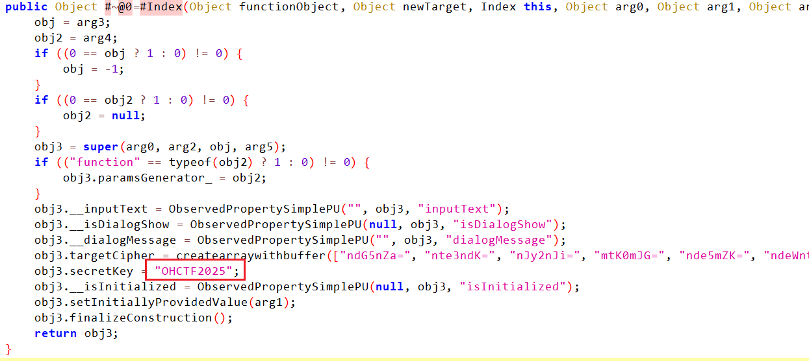

但是这个密钥并不是实际加密时使用的密钥，真正的密钥在页面展示时会重新赋值

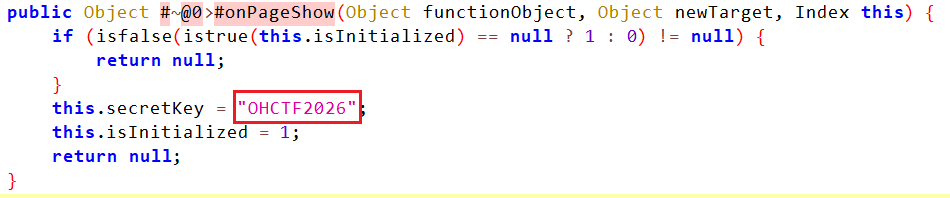

#### 算法魔改

这部分是解题时卡得比较久的部分，因为没能早点看出来魔改的地方  
魔改的位置有两处

1. S盒的生成逻辑  
   正常的S盒生成逻辑

```
S = list(range(256))
i = 0
for i3 in range(256):
    i = (i + S[i3] + key[i3 % len(key)]) % 256
    S[i3], S[i] = S[i], S[i3]
```

魔改后的S盒生成逻辑

```
S = list(range(256))
i = 0
for i3 in range(256):
    i = ((i + S[i]) + ord(key[i % len(key)])) % 256
    S[i3], S[i] = S[i], S[i3]
```

可以看到在交换前的计算部分`i`和`i3`的位置互换了

1. 计算逻辑的修改  
   正常的计算逻辑

```
for byte in data:
    i = (i + 1) % 256
    j = (j + S[i]) % 256
    S[i], S[j] = S[j], S[i]
    k = S[(S[i] + S[j]) % 256]
    result.append(byte ^ k)
```

最后一步是异或

魔改后的计算逻辑

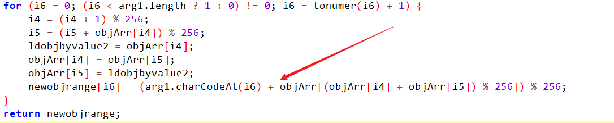

可以看到原本的异或操作变成了加法

​

因此最终解密自定义RC4的代码应该如下

```
def rc4_setup(key):
    """RC4密钥初始化 - 按照原始代码的自定义逻辑"""
    S = []
    for i in range(256):
        S.append(i)
    
    i = 0
    for i3 in range(256):
        i = ((i + S[i]) + ord(key[i % len(key)])) % 256
        S[i3], S[i] = S[i], S[i3]
    
    return S

def rc4_decrypt(key, ciphertext):
    """RC4解密 - 使用自定义的RC4算法"""
    S = rc4_setup(key)
    i4 = 0  # 原始代码中的i4
    i5 = 0  # 原始代码中的i5
    plaintext = bytearray()
    
    for byte in ciphertext:
        i4 = (i4 + 1) % 256
        i5 = (i5 + S[i4]) % 256
        S[i4], S[i5] = S[i5], S[i4]
        # 原始代码使用加法: (arg1.charCodeAt(i6) + objArr[...]) % 256
        # 所以解密时使用减法
        k = (S[i4] + S[i5]) % 256
        plaintext.append((byte - S[k] + 256) % 256)
    
    return plaintext
```

### RSA

代码中的RSA是单字节加密，也就是说对于RC4的加密结果，逐个字节加密，加密的密钥也是小整数，很容易就能分析

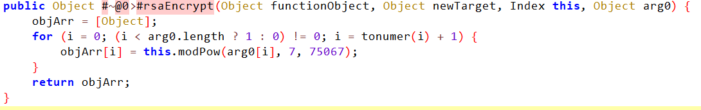

可以看到N为75067，直接使用factordb分解：[factordb.com](http://www.factordb.com/index.php?query=75067)  
结果为`75067=271*277`  
然后计算密钥解密即可

### Base64

base64就是简单的换表

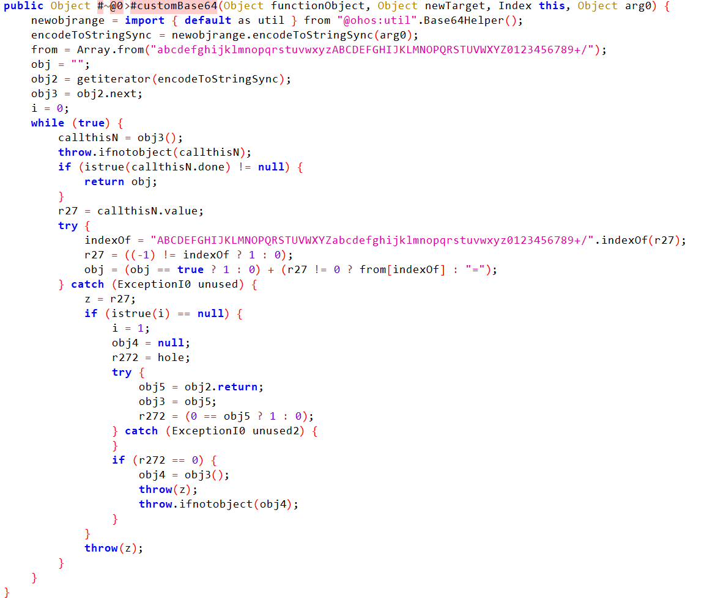

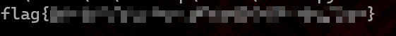

## HMCTF ezAPP\_And\_SERVER

题目附件是hap应用程序文件，解压后用`abcdecompiler`打开`modules.abc`

如果直接访问题目环境，会直接返回Error，真正的路由应该藏在代码中

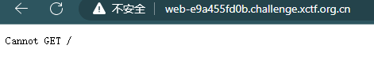

pages中有两个页面

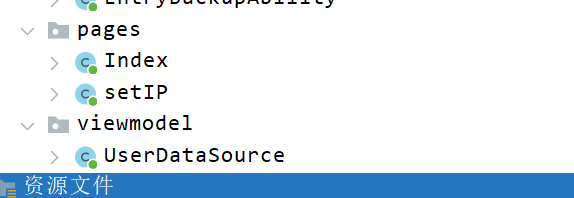

但是都和请求需要的参数无关，真正有关的代码在`common/Utils`中

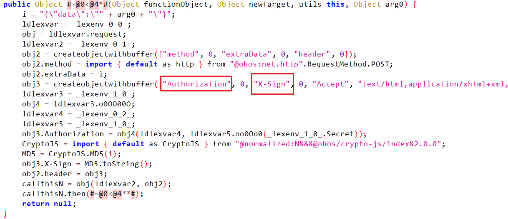

可以看到请求要求的header包括`Authorization`和`X-Sign`

除此之外，也可以看到代码中存在一些加密过的字符串，根据代码分析应该是同一种方式加密（代码涉及的加密函数不多，而且密文格式比较相近）

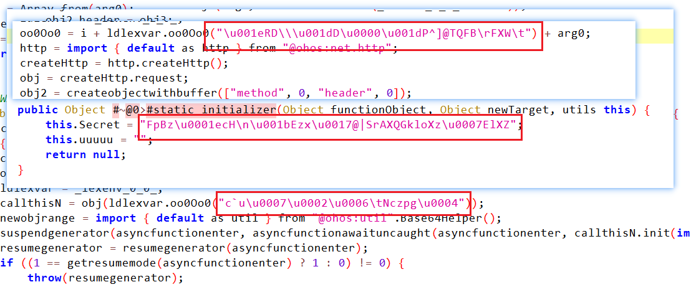

经过分析代码不难发现，加密方式是普通的异或，且密钥也是已知的，如下图所示

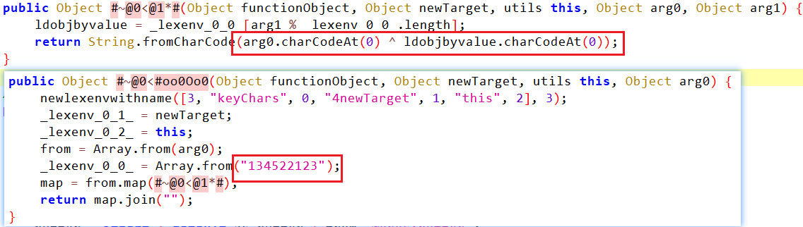

那么就可以搜集代码中出现的密文，都解密看一下结果

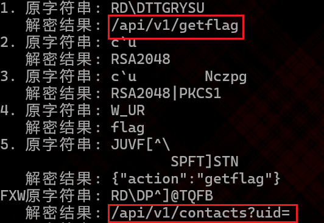

从解密的结果可以得到两个接口`/api/v1/getflag`和`/api/v1/contacts?uid=`，但是直接访问的话会返回`unauthorized`

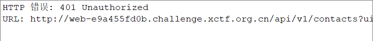

因此需要分析Authorization参数的生成逻辑

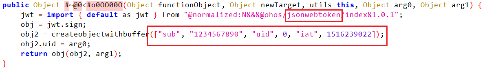

从上图的代码中可以看到该函数应该是生成JWT令牌的代码，其中payload的uid应该是动态传入的（和一开始Authorization和X-Sign默认为零一样）

因此搜索uid就可以发现另一个文件UserList

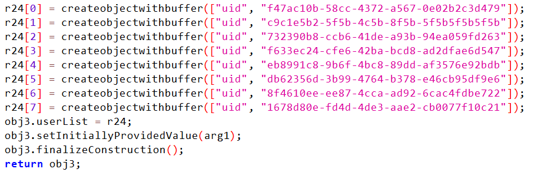

其中有许多的uid，可以先随便挑一个试一下，使用先前获取的contacts接口

​

但是这里要生成JWT令牌，还需要密钥

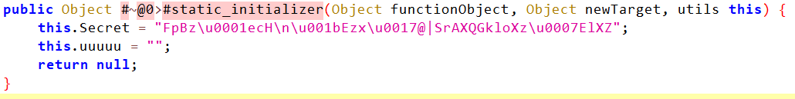

使用异或解密上图的Secret即可得到JWT密钥，然后构造payload，签名之后就可以得到JWT令牌  
以下是生成JWT令牌的代码

```
import jwt
import time
from datetime import datetime

def xor_decrypt(encrypted, key="134522123"):
    """使用异或操作解密Secret"""
    decrypted = []
    for i in range(len(encrypted)):
        key_char = key[i % len(key)]
        decrypted_char = chr(ord(encrypted[i]) ^ ord(key_char))
        decrypted.append(decrypted_char)
    
    return ''.join(decrypted)

encrypted_secret = "FpBz\u0001ecH
\u001bEzx\u0017@|SrAXQGkloXz\u0007ElXZ"

decrypted_secret = xor_decrypt(encrypted_secret)
print(f"解密后的Secret: {decrypted_secret}")

user_id = "xxxxxxxx-5848-4450-9e58-9f97b6b3b7bc"

payload = {
    "sub": "1234567890",
    "uid": user_id,
    "iat": 1516239022
}

print("
JWT载荷:")
print(payload)

# 生成JWT令牌
token = jwt.encode(payload, decrypted_secret, algorithm="HS256")

print("
JWT令牌:")
print(token)

print(f"Authorization: {token}")
```

需要注意的是，每个uid对应的JWT令牌是不一样的  
对每个uid进行尝试，最后根据响应可以得到admin的uid

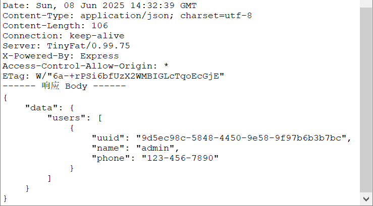

有了Authorization和uid之后还不能访问getflag接口，因为还需要X-Sign的生成逻辑

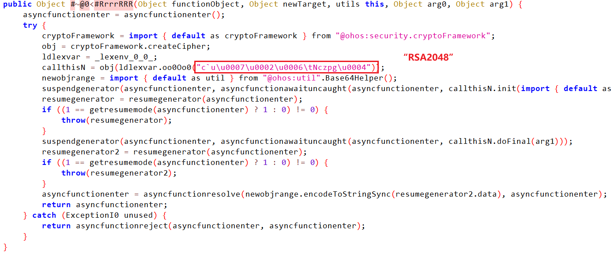

通过这里密文对应的“RSA2048”可以判断此处是RSA的加密函数

​

再观察其他密文出现的位置

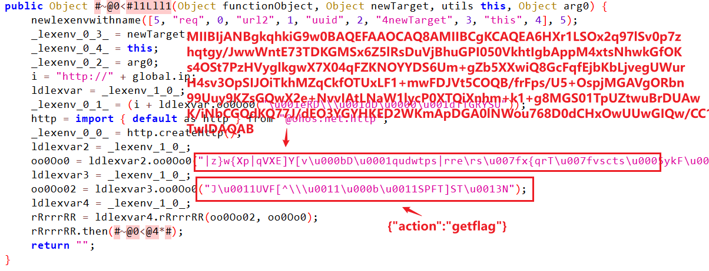

结合先前发现的RSA加密函数，可以合理怀疑上图一大串的数据就是RSA的公钥或者私钥，跳转到函数末尾的函数

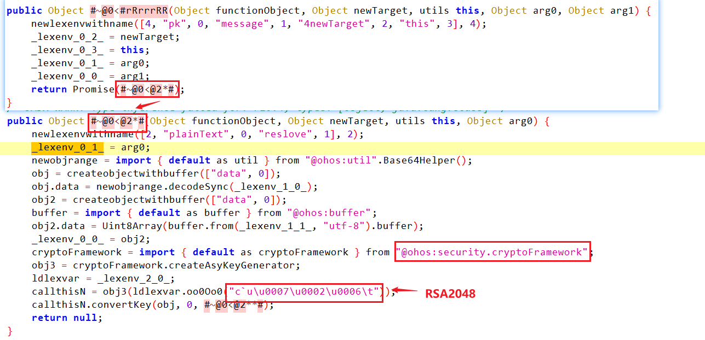

可以看到调用了RSA加密函数

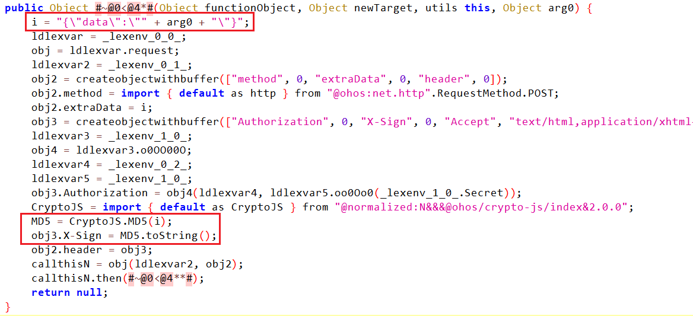

而从这里可以看到构造json字符串和md5加密的代码

​

**也就是说，X-Sign的加密逻辑是使用公钥（已知）加密json字符串（'{"action":"getflag"}'），将加密的结果作为另一个json对象data的值，然后对最后的json对象做md5编码，编码的结果作为X-Sign**

**而data还需要作为POST请求的body**

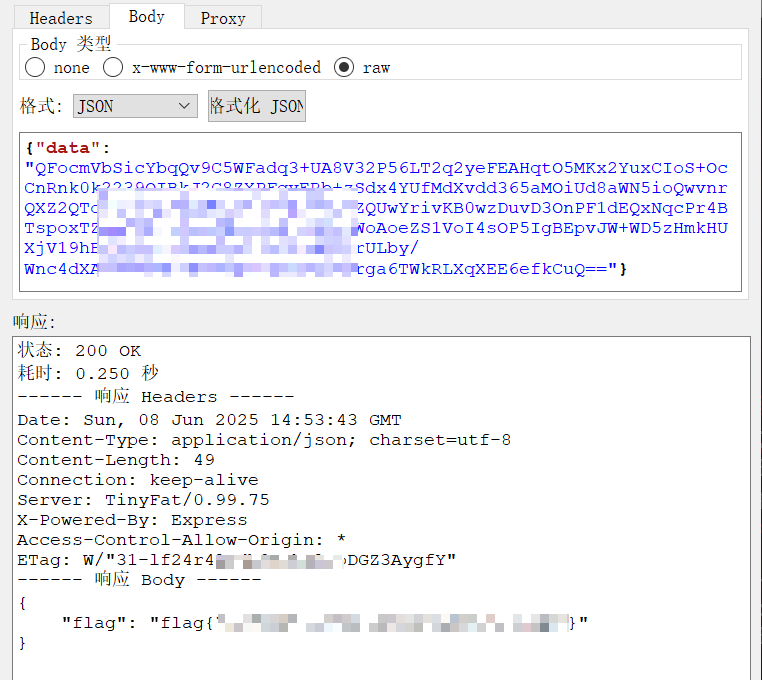
