# 2025H&NCTF-Misc&取证&OSINT全解-先知社区

> **来源**: https://xz.aliyun.com/news/18208  
> **文章ID**: 18208

---

## Misc

### 签到&签退

公众号发送信息获取flag

### 问卷

回答问卷得flag

### 芙宁娜的图片

随波逐流扫一下图片，在RGB通道发现key

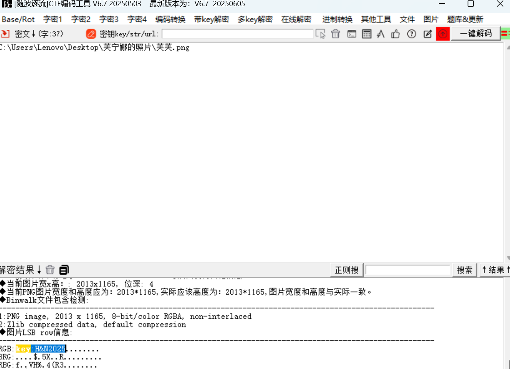

```
key:H&N2025
```

看txt

```
+++++ +++[- >++++ ++++< ]>+++ +++++ +++++ ++.<+ +++++ [->-- ----< ]>--- --.<+ +++++ [->++ ++++< ]>+++ +.++. ++++. <+++[ ->--- <]>-- ---.< +++++ ++[-> +++++ ++<]> ++++. <++++ +[->- ----< ]>--- ----- -.<++ ++++[ ->--- ---<] >---- -.<++ +++++ +[->+ +++++ ++<]> +++++ .<+++ +[->- ---<] >---- --.<+ ++++[ ->+++ ++<]> +.<++ ++[-> ----< ]>--- -.<++ +[->+ ++<]> ++.-. ----- ---.+ +++++ +.--- --.<+ +++[- >++++ <]>+. <++++ [->-- --<]> ----- .<+++ [->++ +<]>+ ++.<+ +++[- >---- <]>-- .<+++ +[->+ +++<] >++++ +.<++ +[->- --<]> ---.- --.-- ----. <++++ +[->- ----< ]>--- .<+++ +++[- >++++ ++<]> +++++ +++.+ +++++ .---- -.--- ----- .<+++ [->++ +<]>+ +++.< +++++ +++[- >---- ----< ]>--- ----- ----- -.<++ +++++ +[->+ +++++ ++<]> +++++ +++++ ++.<+ +++[- >---- <]>-- --.<+ +++[- >++++ <]>+. +++.- ---.- ----- --.<+ +++++ +[->- ----- -<]>- ----- --.<+ +++++ ++[-> +++++ +++<] >++++ +++++ +++++ +.<
```

brainfuck解密

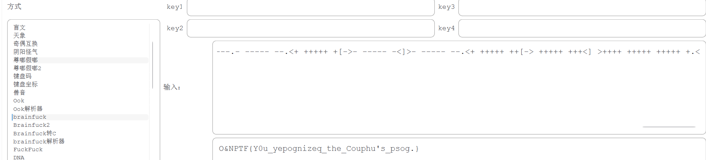

```
O&NPTF{Y0u_yepognizeq_the_Couphu's_psog.}
```

维吉尼亚解密

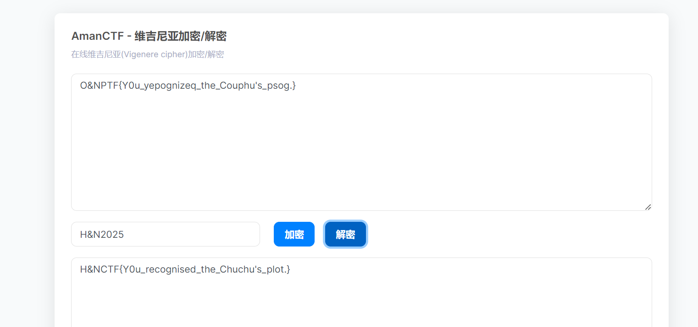

```
H&NCTF{Y0u_recognised_the_Chuchu's_plot.}
```

### 星辉骑士

解压docx文件

在星辉骑士\word\media目录下找到flag.zip文件，解压出来

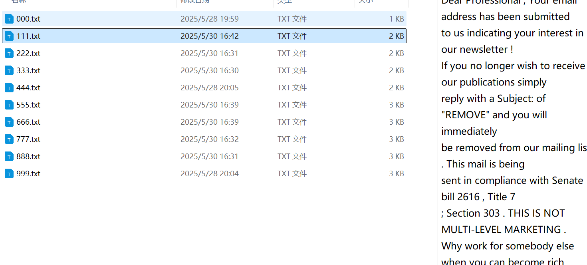

垃圾邮件解密

<https://www.spammimic.com/>

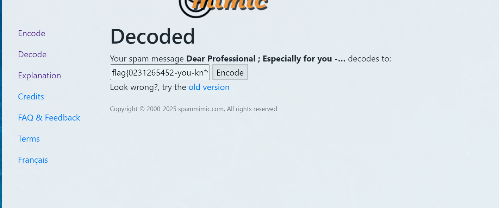

999.txt为flag

```
H&NCTF{0231265452-you-kn*w-spanmimic}
```

### 乱成一锅粥了

下载流量包，导出所有zip

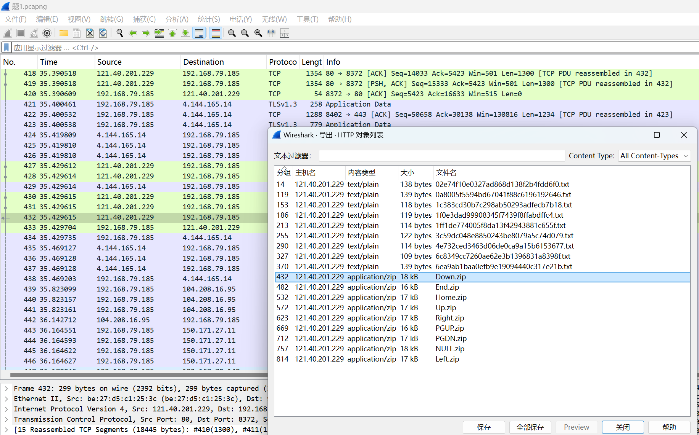

对zip中的txt文件名字进行解密

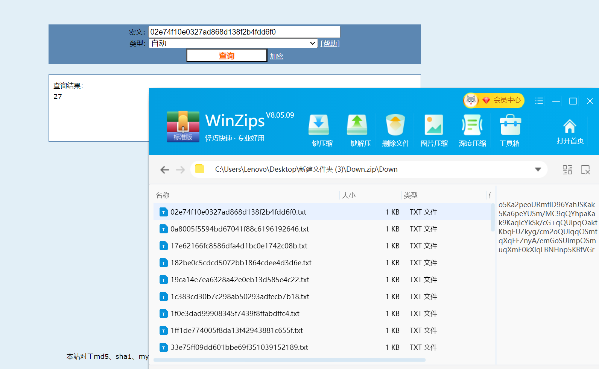

经过几个尝试发现命名规则为01-50每个数的MD5加密

我重新还原原本的txt序列名称

```
import os
import hashlib

def generate_md5_dict():
    """生成数字01-50到其MD5值的映射字典"""
    md5_dict = {}
    for i in range(1, 51):
        # 格式化为两位数，前面补零
        num_str = f"{i:02d}"
        # 计算MD5值
        md5_hash = hashlib.md5(num_str.encode('utf-8')).hexdigest()
        md5_dict[md5_hash] = num_str
    return md5_dict

def rename_files(folder_path):
    """重命名文件从MD5值回数字"""
    md5_dict = generate_md5_dict()
    
    # 遍历文件夹中的所有文件
    for filename in os.listdir(folder_path):
        if filename.endswith('.txt'):
            # 去掉.txt后缀获取MD5部分
            md5_part = os.path.splitext(filename)[0]
            
            if md5_part in md5_dict:
                original_num = md5_dict[md5_part]
                new_filename = f"{original_num}.txt"
                old_path = os.path.join(folder_path, filename)
                new_path = os.path.join(folder_path, new_filename)
                
                # 重命名文件
                os.rename(old_path, new_path)
                print(f"重命名: {filename} -> {new_filename}")
            else:
                print(f"跳过: {filename} (未找到对应的数字)")

# 使用示例
folder_path = ""  # 替换为你的文件夹路径
rename_files(folder_path)
```

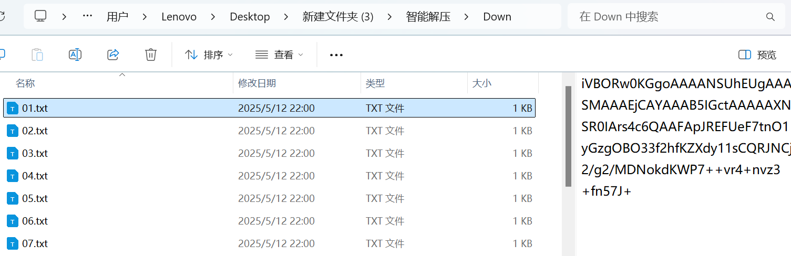

发现为iV开头的base64，即png图片的base64的形式

继续还原

```
import os
import base64

def read_and_combine_txt_to_image(folder_path, output_image_path):
    # 初始化空字符串用于存储拼接内容
    combined_content = ""
    
    # 按顺序读取01.txt到50.txt
    for i in range(1, 51):
        # 生成文件名，保证两位数字格式
        filename = f"{i:02d}.txt"
        file_path = os.path.join(folder_path, filename)
        
        try:
            with open(file_path, 'r', encoding='utf-8') as file:
                combined_content += file.read()
        except FileNotFoundError:
            print(f"警告: 文件 {filename} 未找到，已跳过")
        except Exception as e:
            print(f"读取文件 {filename} 时出错: {str(e)}")
    
    if not combined_content:
        print("错误: 没有读取到任何文件内容")
        return False
    
    try:
        # 将拼接后的内容解码为二进制数据
        image_data = base64.b64decode(combined_content)
        
        # 将二进制数据写入图片文件
        with open(output_image_path, 'wb') as image_file:
            image_file.write(image_data)
        
        print(f"成功将拼接内容转换为图片并保存到: {output_image_path}")
        return True
    except base64.binascii.Error:
        print("错误: 拼接的内容不是有效的Base64编码")
    except Exception as e:
        print(f"转换或保存图片时出错: {str(e)}")
    
    return False

# 使用示例
folder_path = ""  # 替换为你的txt文件所在文件夹路径
output_image_path = "output_image.png"  # 输出的图片路径

read_and_combine_txt_to_image(folder_path, output_image_path)
```

得到二维码碎片

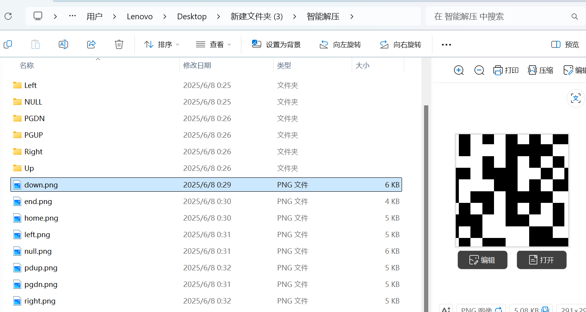

拼个图片扫码即可

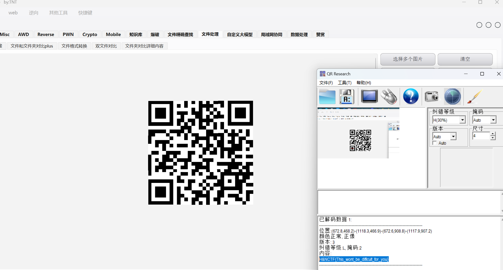

```
H&NCTF{This_wont_be_difficult_for_you}
```

### 谁动了黑线？

查看csv

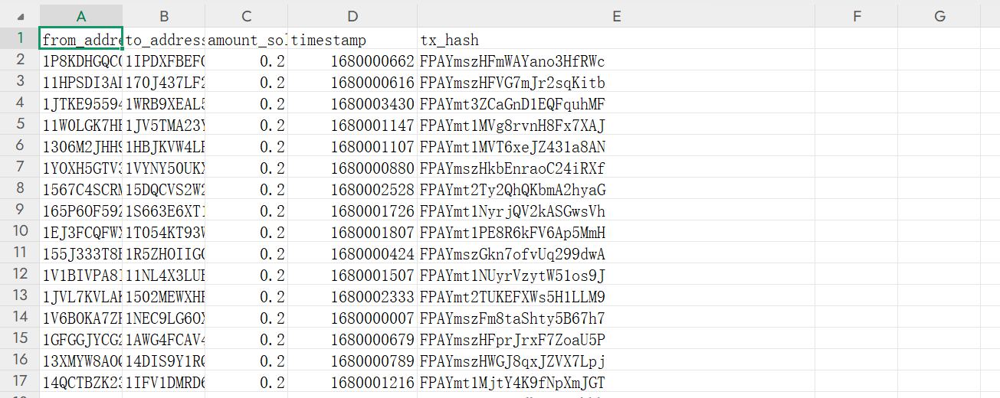

最后一列tx\_hash是base58,解密一下

```
import csv
import base58

def decode_and_replace_base58_in_csv(csv_file_path, output_file_path=None):
    """
    读取CSV文件，对最后一列（除第一行外）进行Base58解密，并用解密结果替换原始数据
    
    参数:
        csv_file_path (str): 原始CSV文件路径
        output_file_path (str): 输出文件路径（如果为None则覆盖原文件）
        
    返回:
        list: 包含所有行的列表，每行最后一列已被解密（如果成功）
    """
    all_rows = []
    
    try:
        with open(csv_file_path, mode='r', encoding='utf-8') as file:
            reader = csv.reader(file)
            
            # 读取标题行
            headers = next(reader, None)
            if headers is not None:
                all_rows.append(headers)
            
            for row in reader:
                if not row:  # 跳过空行
                    continue
                    
                original_value = row[-1].strip()  # 获取最后一列数据并去除空白
                
                try:
                    # 尝试Base58解码
                    decoded = base58.b58decode(original_value).decode('utf-8')
                    row[-1] = decoded  # 用解密结果替换原始数据
                    print(f"行 {reader.line_num}: 解密成功 {original_value} -> {decoded}")
                except Exception as e:
                    print(f"行 {reader.line_num}: 解密失败 - {original_value} - 错误: {str(e)}")
                    # 解密失败则保留原始数据
                
                all_rows.append(row)
                
        # 确定输出文件路径
        output_path = output_file_path if output_file_path else csv_file_path
        
        # 写入更新后的数据
        with open(output_path, mode='w', encoding='utf-8', newline='') as file:
            writer = csv.writer(file)
            writer.writerows(all_rows)
            
        print(f"
文件已保存到: {output_path}")
                    
    except FileNotFoundError:
        print(f"错误: 文件 {csv_file_path} 未找到")
    except Exception as e:
        print(f"处理文件时发生错误: {str(e)}")
    
    return all_rows

# 使用示例
if __name__ == "__main__":
    # 替换为你的CSV文件路径
    input_csv = "your_file.csv"
    output_csv = "decoded_file.csv"  # 设为None则会覆盖原文件
    
    # 调用函数处理CSV文件
    updated_data = decode_and_replace_base58_in_csv(input_csv, output_csv)
    
    # 打印前几行结果作为示例
    print("
前几行解密结果示例:")
    for i, row in enumerate(updated_data[:5]):
        print(f"行 {i+1}: {row}")
```

排序发现类似明文格式

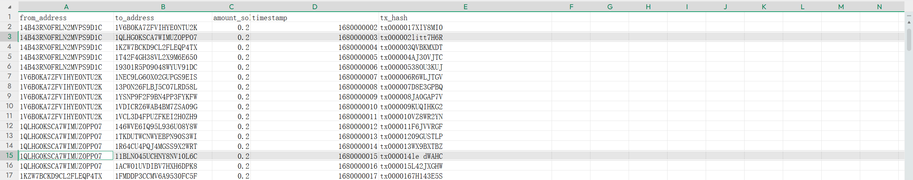

我们编写代码，读取csv表的最后一列（除了第一行），读取第9位到第12位帮我把带有小写字母或者下划线\_数据提取出来，最后全部拼起来

```
import csv

def process_csv(filename):
    result = []
    
    with open(filename, 'r', newline='', encoding='utf-8') as csvfile:
        reader = csv.reader(csvfile)
        
        # 跳过第一行（标题行）
        next(reader, None)
        
        for row in reader:
            if not row:  # 跳过空行
                continue
                
            # 获取最后一列
            last_column = row[-1]
            
            # 检查长度是否足够
            if len(last_column) >= 12:
                # 提取第9到12位（Python中索引从0开始，所以是8:12）
                substring = last_column[8:12]
                
                # 检查是否包含小写字母或下划线
                if any(c.islower() or c == '_' for c in substring):
                    result.append(substring)
    
    # 将所有符合条件的子字符串拼接起来
    final_string = ''.join(result)
    return final_string

# 使用示例
filename = 'decoded_file.csv'  # 替换为你的CSV文件名
output = process_csv(filename)
print("拼接结果:", output)

#拼接结果: little_dog_is_Aomr!!
```

```
H&NCTF{little_dog_is_Aomr!!}
```

## Forensics

### ez\_game

下载镜像，火眼挂载

有个readme.txt

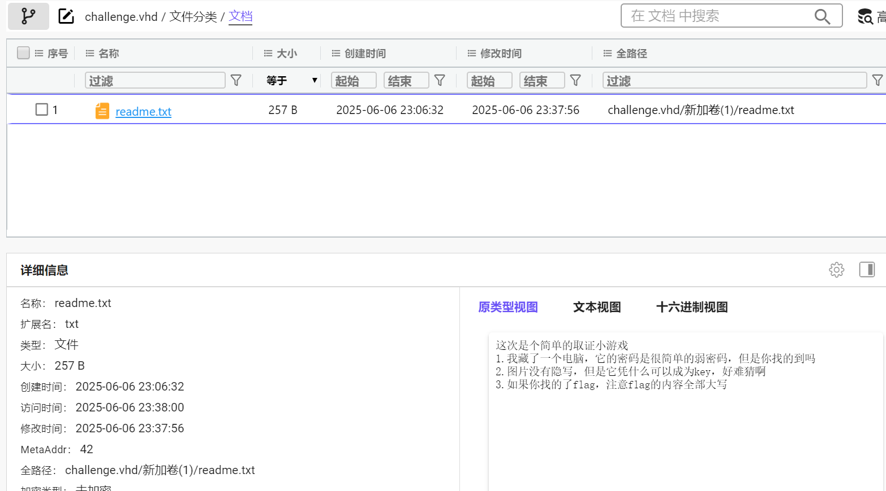

```
这次是个简单的取证小游戏
1.我藏了一个电脑，它的密码是很简单的弱密码，但是你找的到吗
2.图片没有隐写，但是它凭什么可以成为key，好难猜啊
3.如果你找的了flag，注意flag的内容全部大写
```

藏了一个电脑，我索引到一个hhh文件

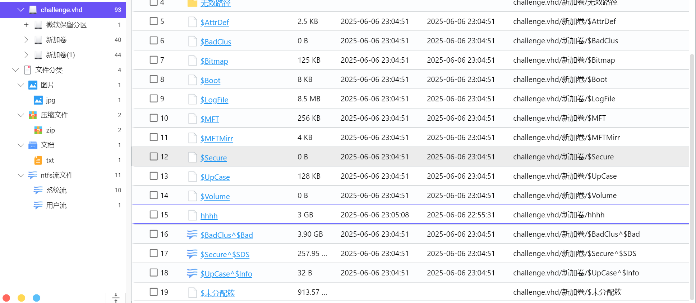

有分别找到key.jpg和一个加密zip

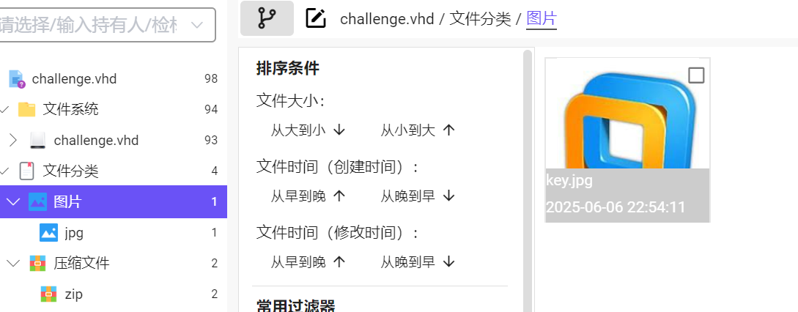


全部导出

根据提示：图片没有隐写，但是它凭什么可以成为key

参考**西湖论剑2025**，图片可以作为密钥文件进行VC镜像挂载

我们挂载hhh文件

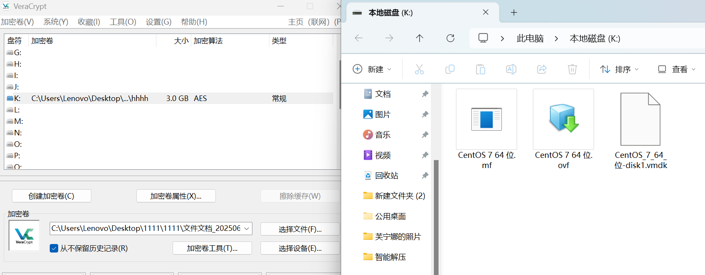

得到一个虚拟机

我们继续挂载vmdk

查看历史命令

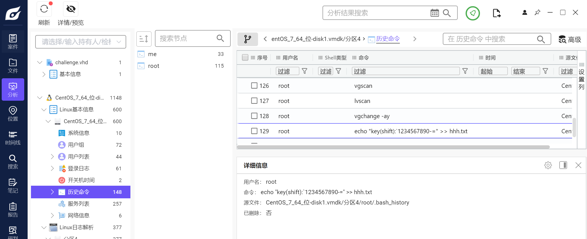

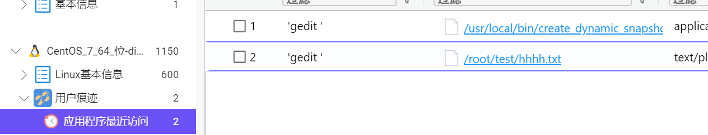

有个hhh文件，且最近访问过

导出

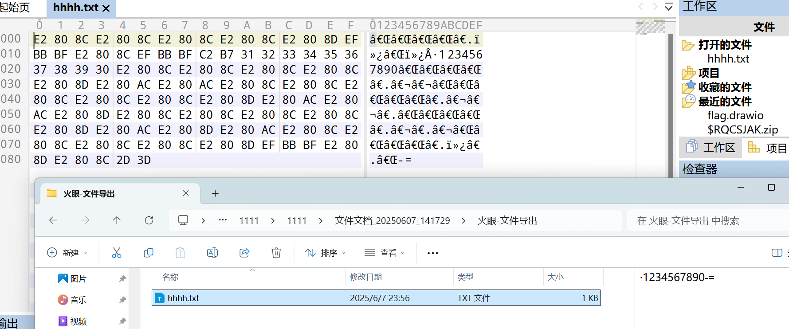

010查看存在额外字符，猜测为零宽隐写

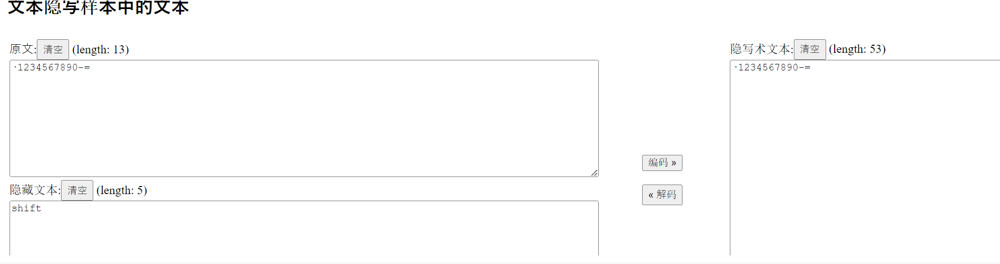

```
shift
```

类似上述历史命令

```
echo "key(shift):`1234567890-=" >> hhh.txt
```

根据提示1：密码是很简单的弱密码

题目给了

```
·123456789-=
```

通过shift反转得到

```
~!@#$%^&*()_+     //即为zip密码
```

解压之前得到的zip，得到flag.drawio文件

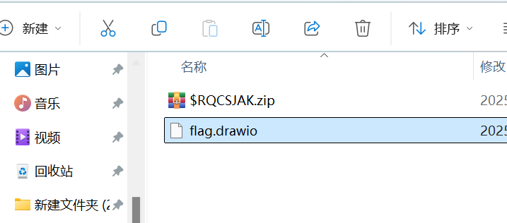

<https://app.diagrams.net/>

加载文件

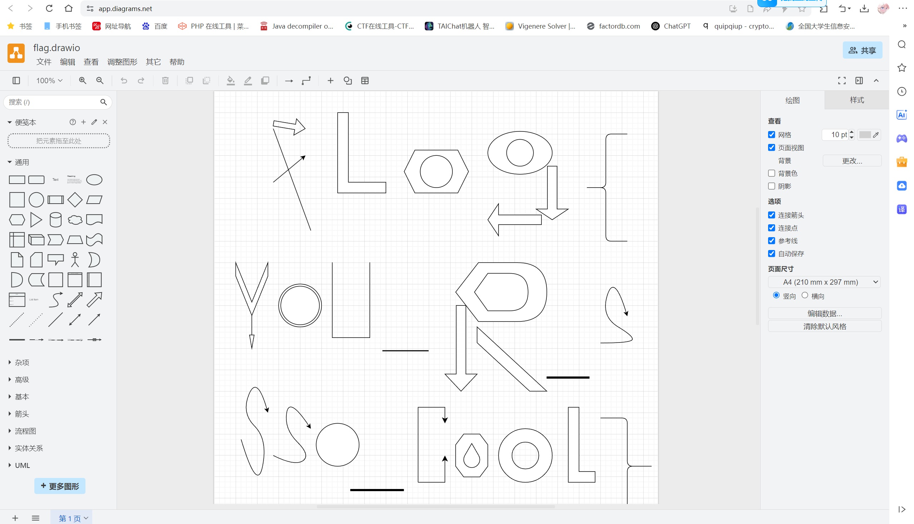

```
H&NCTF{YOU_R_SSSO_COOL}
```

## OSINT

### Chasing Freedom 1

图片属性得到时间0503

图片定位到蓝眼泪观景台，开始对周围一通爆搜一个一个试

```
H&NCTF{0503-丁鼻垄}
```

### Chasing Freedom 2

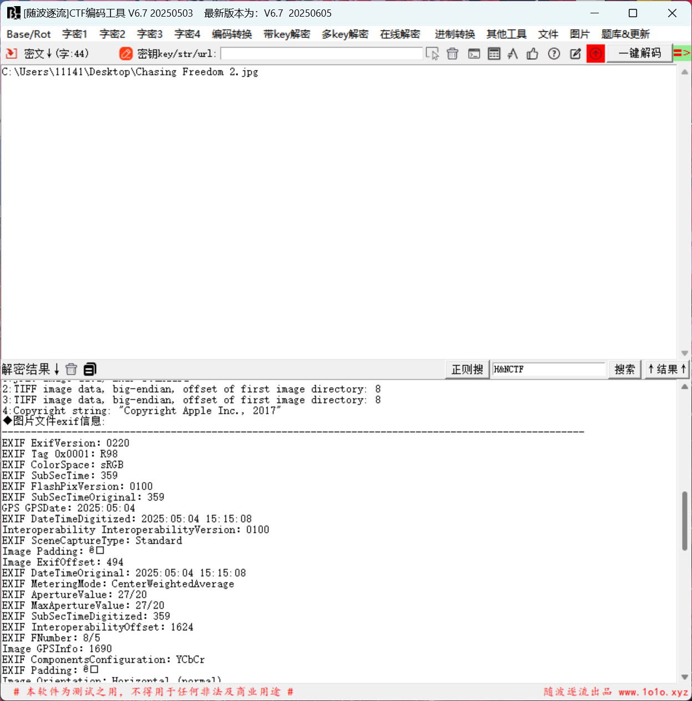

因为我是先写第3题，后写第二题的，发现时间差不多，而且是一个灯塔，那就试试去搜索东庠岛灯塔，还真找到一模一样的

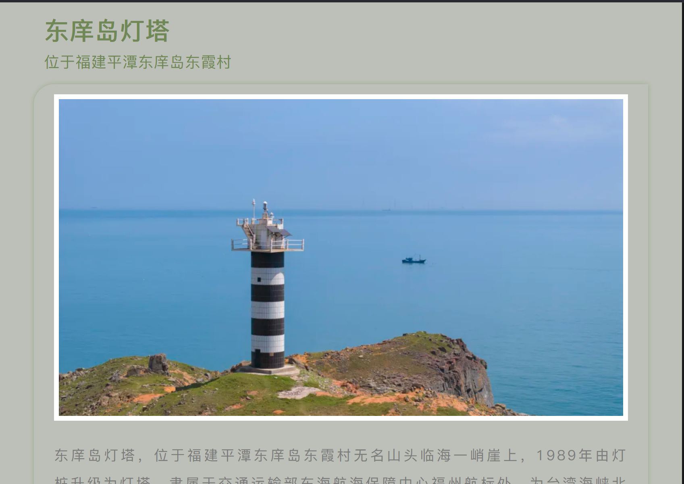

```
H&NCTF{0504-东庠岛灯塔}
```

### Chasing Freedom 3


拖进随波逐流找到时间

查看图片发现岚庠渡，去搜索


然后发现岚庠渡只有1，2，3号，去试试H&NCTF{0504-东庠码头-岚庠渡1号},全都试过了，发现不对，

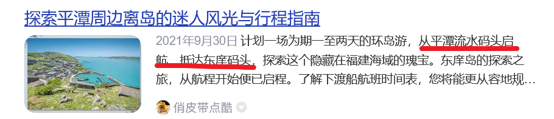

```
H&NCTF{0504-流水码头-岚庠渡3号}
```

### 猜猜我在哪儿？

提示从太原出发到西安lm研发中心的路途

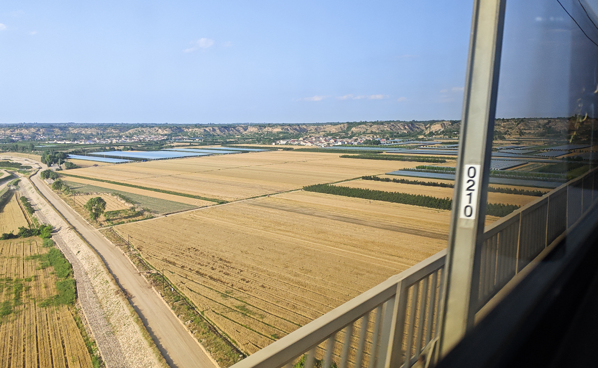

拍摄取景，应该是在高铁上

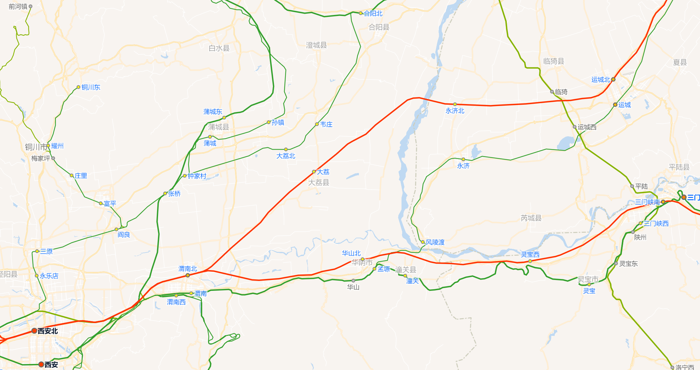

差不多定位到这

根据朝向，和四周地形进一步定位

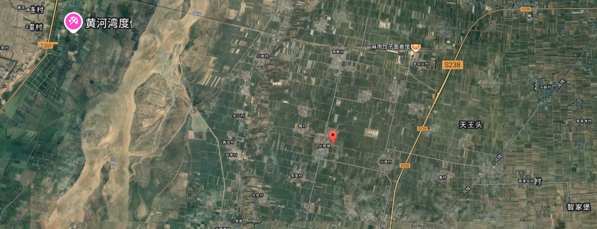

试一下周围地点最终得到

```
flag{永济市张营镇下吴村}
```
