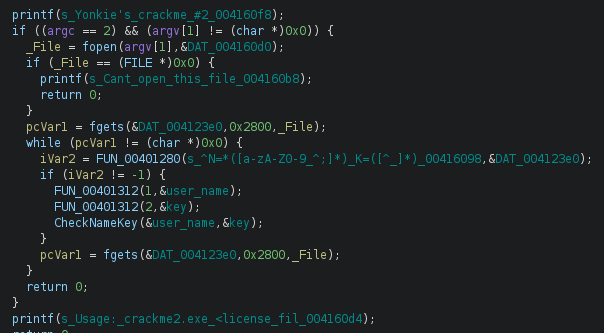
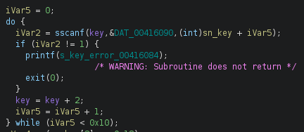
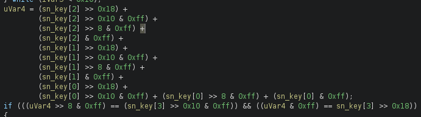
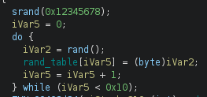
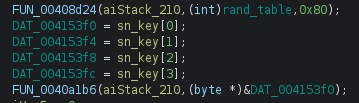
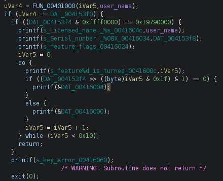

# yonkies_crackme2 writeup 及代码复用（编译成动态链接库）的技巧-先知社区

> **来源**: https://xz.aliyun.com/news/18211  
> **文章ID**: 18211

---

```
Coder name: Yonkie
Coded in: C/C++
Difficulty level: 3 - Getting harder
Crack-me URL: https://crackmes.one/crackme/5ab77f6233c5d40ad448c9e5
Platform: Windows
```

这个题掉坑里面了，一直在逆向AES算法。如果是啥病毒、mm啥的，一般会直接PEiD插件搜搜算法，或者对逆向中明显遇到的常数阵列google一下。想当然的认为这类crackme的题不会有这种复杂标准算法。结果还是看了大神的writeup才恍然大悟，不过又学到了大神的一招骚操作——二进制层面的代码复用。

## 一、验证逻辑分析



#### 1、主函数的架构清晰：

* `fgets`从文件中读取一行
* `FUN_00401280`明显的正则表达式解析，不匹配则读入下一行。
* `FUN_00401312`简单调试可以发现，这个函数就是从解析正则表达式的结果中取处数据。（这里的代码不能细看，否则容易掉坑，毕竟我们的目标不是看如何解析正着表达式）
* `CheckNameKey`关键的校验用户名和key的函数。（函数名根据初步分析结果重命名）

#### 2、下面重点看看这个`CheckNameKey`：



1. 开始是将key字符串转成对应的16进制字节串。



2. 校验key：前12个字节的和的低8位与key[15]比较；高8位与key[14]比较。满足该条件可以继续。



3. 生成16个字节的随机数。`srand(0x12345678)`使用了一个固定值进行初始化，所以生成的伪随机数每次都是一样的。这是一个trick。

调试出来的序列是：`[0xE9,0x3F,0x0D,0xA1,0x96,0x95,0x31,0x04,0x49,0x2D,0x9E,0x61,0x83,0xCF,0x09,0x6F]`



4. 这部分看着两个函数，结构简单明了，确实整个分析过程中“最简单”也是“最困难”的部分。

如果熟悉C编写AES算法，或者用PEiD的Krypto插件查找过标准算法，最次在分析算法时遇到大段的与定义数据块，能google一下。估计很快能猜出这个代码块就是典型的AES-128解密算法。自己不知道为啥陷进去了——唉！

`FUN_00408d24`典型的AES的密钥扩展到128位。显然上面第三步生成的固定伪随机数就是这个AES算法的密钥。

`FUN_0040a1b6`就是AES解密了。密文就是输入的key。



5. 最终对key解密后的字节串进行分段比较

前4个字节是`username`的hash值。这个hash与通过`FUN_00401000`函数算出来的值进行比较。

接下来2个字节是`feature`字段。每一个bit对应一个特性，1--ON，0--OFF，一共16个。

接下来2个直接是魔术字节，固定等于0x1979。

接下来的4字节是序列号。程序本身不校验这个序列号，只是展示。可以自己随便定义。

最后4个字节并不做校验。其作用在keygen的时候会用到。

## 二、keygen实现

#### 1、keygen思路

根据逆向分析结果，可以知道最终的校验字节串结构是下面这个样子的：

|  |  |  |
| --- | --- | --- |
| 字段 | 长度 | 说明 |
| username hash | 4 | 用户名经过函数`FUN_00401000`计算出来的hash值 |
| feature | 2 | 授权特性，每一个bit对应一个特性，1--ON，0--OFF，一共16个。 |
| magic | 2 | 0x1979 |
| 序列号 | 4 | 自己指定 |
| 填充 | 4 | 用来让加密后的直接序列满足key的校验 |

这16个字节用密钥`[0xE9,0x3F,0x0D,0xA1,0x96,0x95,0x31,0x04,0x49,0x2D,0x9E,0x61,0x83,0xCF,0x09,0x6F]`AES加密后成为key。但这个key需要能通过上面第2步的校验。所以需要通过对“填充”字段的暴力尝试，找到能过第2步校验的key。

#### 2、先来看看大佬的实现：

大佬的C代码使用了一个开源的AES库，这个库现在依然在更新。由于大佬的实现年代较早，在目前的64位Linux操作系统上需要注意三点：

（1）大佬的主机是 linux i386 架构的，而我的主机是 ubuntu22.04 amd64，需要安装 i386 子系统，带 i386 开发环境和源码。修改 Makefile 的编译参数：

```
CC= gcc

SRCDIR=./aeslib
CFLAGS= -I$(SRCDIR)/
ARCH=-m32		# 编译链接为32位程序

all: 
    nasm -f elf -g -o sub_401000.o    sub_401000.asm

    $(CC) $(ARCH) $(CFLAGS) -c $(SRCDIR)/aescrypt.c -o aescrypt.o  
    $(CC) $(ARCH) $(CFLAGS) -c $(SRCDIR)/aeskey.c -o aeskey.o
    $(CC) $(ARCH) $(CFLAGS) -c $(SRCDIR)/aestab.c -o  aestab.o
    
    $(CC) $(ARCH) $(CFLAGS) -o run_keygen keygen.c aescrypt.o aeskey.o aestab.o sub_401000.o
    $(CC) $(ARCH) $(CFLAGS) -o run_reversed reversed.c aescrypt.o aeskey.o aestab.o sub_401000.o

```

（2）2014/15年左右，该AES库增加了Intel的硬件加速支持。

```
#if defined( USE_INTEL_AES_IF_PRESENT )
#  include "aes_ni.h"
#else
/* map names here to provide the external API ('name' -> 'aes_name') */
#  define aes_xi(x) aes_ ## x
#endif
```

大佬截取的代码里面没有`aes_ni.h`文件，虽然我的CPU是海光，但也是x86的，需要这个文件来加速AES运算。（大佬的CPU不知道是啥，能不用这个文件编译过去）

好在大佬给的AES库源代码在github上还在，并持续更新中。从里面下载`aes_ni.h`，成功编译。

（3）虽然成功编译，但运行就`segment fault`。这个问题和大佬的代码无关，还是操作系统架构不同引起的问题。

虽然在shell下直接运行出错，但是在gdb调试中却能正常运行。怀疑了各种原因，偶尔AI提示可能是ASLR的问题。

```echo 0 | sudo tee /proc/sys/kernel/randomize_va_space```

关闭ASLR后，程序可以正常运行。可能还是32位程序在amd64架构下不支持ASLR。也怀疑过大佬采用的二进制层面的代码复用导致内存非法访问，但仔细看复用的代码，并不涉及需要根据基地址从定位的地址访问。

总结一下：大佬的实现比较有意思的一点是直接拷贝了`FUN_00401000`的伪汇编代码，并复用该代码直接编译进了keygen里面。这个操作有点“骚”。

#### 3、用python进行代码复用，实现keygen。

追随大佬的脚步，学习大佬的方法，实现了一个自己的版本。

> 大佬的方法很厉害，不过用C的话，需要找到合适的AES的C代码库，并编译。现在有python这种成熟的工具，各种算法都有，应该可以用更少的代码来实现keygen。

> 关于代码复用，用大佬的方法是可以，不过为啥要用“伪汇编”代码，直接复制二进制字节序列应该也是可以的。（尝试从ghidra里面只复制伪汇编代码，没成功。总是带着二进制值的，还要自己调整，太麻烦了）

要用python来实现keygen，AES加解密方面很容易，需要用python重写`FUN_00401000`有点麻烦。尝试学着大佬复用代码比较有趣。

显然python下不能直接把`FUN_00401000`函数直接编译进来了。但可以折衷把它编译成共享库`.so`文件，然后用python的`ctypes`库的`CDLL`加载进来。

这里遇到的问题是我的 ubuntu22.04 amd64 系统下，安装的python3.10.12是64位的。`FUN_00401000`函数只能编译成32位的。64位python不能`CDLL`一个32位的`.so`。所以需要一个32位的python。查了一下，AI说python支持32位的最高版本是3.4.10。所以下载了源代码，按如下编译成32位python3.4.10。

```
cd Python-3.4.10
./configure CC='gcc -m32' CXX='g++ -m32'
make -j 4
```

但这样还有问题。python最大的优势是各种“包”（比如keygen需要的crypto），但这种单独编译的python还需要配套的pip，简化各种“包”的安装和配置。从源代码编译安装对应的pip时，遇到python没有zlib模块的问题，重新配置zlib后编译python3.4.10似乎不起效果。（开源软件一个版本配套一个系列，多版本共存，多架构共存实在是费心费力，各种兼容和冲突问题）

为了省心，决定采用如下方案：

* 64位的python3.10.12写keygen。主要是AES加解密和key校验。
* namehash算法复用`FUN_00401000`函数——将其编译成 `.so`，然后用32位的python3.4.10调用。
* python3.10.12使用`subprocess`调用python3.4.10运行`FUN_00401000`函数，并获取进程的返回值——name hash。

(1) namehash.asm

```
; nasm -f elf namehash.asm -o namehash.o
; gcc -shared namehash.o -o namehash.so		64位linux上不可使用这条，默认是链接成64位的，可以使用下面等价的两条
; ld -m elf_i386 -shared namehash.o -o namehash.so  <==>  gcc -m32 -shared namehash.o -o namehash.so

section .text
global function

function:
    db 0x55, 0x83, 0xec, 0x08, 0x8b, 0x44, 0x24, 0x10
    db 0x33, 0xed, 0x33, 0xd2, 0x8b, 0x4c, 0x24, 0x14
    db 0x85, 0xc0, 0x76, 0x46, 0x8b, 0x44, 0x24, 0x10
    db 0x89, 0x34, 0x24, 0x89, 0x7c, 0x24, 0x04, 0x83
    db 0xc1, 0x01, 0x0f, 0xb6, 0x71, 0xff, 0x83, 0xf6
    db 0xff, 0x33, 0xee, 0xbe, 0x07, 0x00, 0x00, 0x00
    db 0x8b, 0xfd, 0x83, 0xe7, 0x01, 0xf7, 0xdf, 0xd1
    db 0xed, 0x81, 0xe7, 0x20, 0x83, 0xb8, 0xed, 0x33
    db 0xef, 0x83, 0xc6, 0xff, 0x83, 0xfe, 0xff, 0x75
    db 0xe7, 0x83, 0xf5, 0xff, 0x83, 0xc2, 0x01, 0x3b
    db 0xd0, 0x72, 0xcc, 0x8b, 0x34, 0x24, 0x8b, 0x7c
    db 0x24, 0x04, 0x8b, 0xc5, 0x83, 0xc4, 0x08, 0x5d
    db 0xc3
```

改进了大佬的方法，实际上直接复制二进制值也是一样的。只是函数没那么“直观”。毕竟复制二进制值比较容易，还能让AI进行整理和生成。

该文件定义了一个函数`function`。编译链接方式看上面代码的注释。

(2) namehash.py

```
from ctypes import *
import sys

# 加载共享库
example = CDLL('./namehash.so')

# 定义calculate函数的参数类型和返回类型
example.function.argtypes = [c_int, c_char_p]
example.function.restype = c_uint

result = example.function(len(sys.argv[1]), sys.argv[1].encode('utf-8'))
print(hex(result))
```

需要使用32位的python3.4.10来执行这个文件。

(3) keygen.py

```
from Crypto.Cipher import AES
import subprocess
import struct
import sys

def namehash(name):
    output = subprocess.run(['~/tools/Python-3.4.10/python', 'namehash.py', name], capture_output=True, text=True).stdout
    return output.strip()  # 去除结尾的换行符

def check(sn):
    hash = 0
    for i in range(12):
        hash = hash + sn[i]
        
    return (hash & 0xFF == sn[15])  and (hash >> 8 & 0xFF == sn[14])

class AESCipher:
    def __init__(self, key):
        self.cipher = AES.new(key, AES.MODE_ECB)

    def encrypt(self, plainbytes):
        return self.cipher.encrypt(plainbytes)

    def decrypt(self, cipherbytes):
        return self.cipher.decrypt(cipherbytes)
    

rawkey=[0xE9,0x3F,0x0D,0xA1,0x96,0x95,0x31,0x04,0x49,0x2D,0x9E,0x61,0x83,0xCF,0x09,0x6F]
aes_cipher = AESCipher(bytes(rawkey))

if len(sys.argv) != 2:
    print("Usage: keygen [username]")
    exit()
    
name = sys.argv[1]      # 用户名
features = 0x1979FFFF   # 0x1979 是校验的魔术字节，0xFFFF 开通所有特性
serial = 0xbeefbeef     # 自定义，并不校验
# serial = 0x12345678
patch = 0
name_hash = int(namehash(name), 16)

while True:
    data = struct.pack('<IIII', name_hash, features, serial, patch)
    sn = aes_cipher.encrypt(data)
    if check(sn):
        print('N=%s K=%s' % (name, sn.hex()))
        break;
    patch = patch + 1
```

## 三、一些思考

这种二进制层面代码复用需要考虑几个问题：

* 32位还是64位
* 函数代码只涉及寄存器和本地变量（栈）
* 没有远程调用，外部变量访问等

有没有一个更合适的复用代码的框架？

* 实现一个loader，加载二进制文件（至少是部分代码）到内存，直接`call`复用函数代码。

* 优点：同一个进程中，调用直接方便。​ 不需要执行目标程序，不受运行的操作系统限制。
* 缺点：如果不能加载到初始基地址，需要自己处理重定位信息等，loader的实现也非常复杂。所以只能处理简单的纯算法代码复用。

* python启动新进程运行并暂停（防止退出）目标二进制文件，使用远程进程注入的方式，在新线程中复用代码。并通过进程间通信返回结果。

* 优点：通用框架
* 缺点：受到操作系统和架构的限制。比如linux下不能用这种方法复用exe程序的代码。

## 参考：

[1] Brian Gladman’s Home Page. [Online]. Available: <https://github.com/BrianGladman/AES>

[2] 不会编程，程序效率不高，问AI。
