# 数字签名≠安全！XtremeRAT正利用大量国内数字签名「合法入侵」-先知社区

> **来源**: https://xz.aliyun.com/news/18222  
> **文章ID**: 18222

---

## 概述

近期，笔者在日常攻击活动分析中，发现了某最新攻击活动中的系列样本携带了多个国内正常数字签名，进一步分析，发现其中的“Chengdu Nuoxin Times Technology Co., Ltd.”数字签名曾被Higaisa APT组织使用过。

为了一探究竟，笔者尝试对此次攻击活动中系列样本的技术手法进行了详细分析梳理：

* 攻击活动中使用了多个国内正常数字签名，用于伪造恶意程序的合法性，绕过安全检测，数字签名如下：

* Chengdu Nuoxin Times Technology Co., Ltd.
* 海口市勤莱佳科技有限公司

* 对比历史APT攻击活动中的数字签名

* 2023年10月26日，Cyble安全团队发布的《Higaisa APT Resurfaces via Phishing Website targeting Chinese Users》攻击活动中，存在携带Zhiya Yunke (Chengdu) Finance and Tax Service Co., Ltd.数字签名的恶意样本；
* 2024年10月09日，毒霸安全团队发布的《Higaisa 组织近期活动分析，利用仿冒页面进行钓鱼攻击》攻击活动中，存在携带Chengdu Nuoxin Times Technology Co., Ltd.数字签名和Zhiya Yunke (Chengdu) Finance and Tax Service Co., Ltd.数字签名的恶意样本；
* 2024年12月12日，奇安信威胁情报中心发布的《国内最大IT社区CSDN被挂马，CDN可能是罪魁祸首？》攻击活动中，存在携带Chengdu Nuoxin Times Technology Co., Ltd.数字签名的恶意样本；

* 此次攻击活动中的技术手法

* 白+黑技术加载携带正常数字签名的恶意dll文件，白文件为腾讯视频应用程序；
* 携带正常数字签名的恶意dll文件启动后，将使用RC4算法解密.edskv文件并在内存中加载执行，RC4算法解密密钥由.txt文件生成；
* 解密后的.edskv文件实际为XtremeRAT远控木马；

* 尝试对此次攻击活动中的码址进行关联分析，又关联发现大量恶意样本携带了国内其他正常数字签名，数字签名如下：

* Chengdu Nuoxin Times Technology Co., Ltd.
* GZ.PurestJone Network Technology Co., Ltd.
* Harman International Industries, Incorporated
* Hena Luxion Network Technology Co., Ltd.
* Hoozoou Leeser Smart Technology Co., Ltd.
* Klimine Far Year Electronic Commerce Co., Ltd.
* Meizhou Fisherman Network Technology Co., Ltd.
* PrimeSnap Technologies Network Company
* Shanghai Linyao Network Technology Co., Ltd.
* Shenzhen Xiangyou Network Technology Co., Ltd.
* Ventis Media, Inc.
* 海口市勤莱佳科技有限公司
* 运城市盐湖区风颜商贸有限公司

## 威胁情报线索

起初，笔者关注到X社交平台上的一条威胁情报线索，情报线索上提到某恶意样本携带了成都某公司的数字签名，进一步分析，发现“Chengdu Nuoxin Times Technology Co., Ltd.”数字签名曾在多个攻击活动中出现过。

* X社交平台

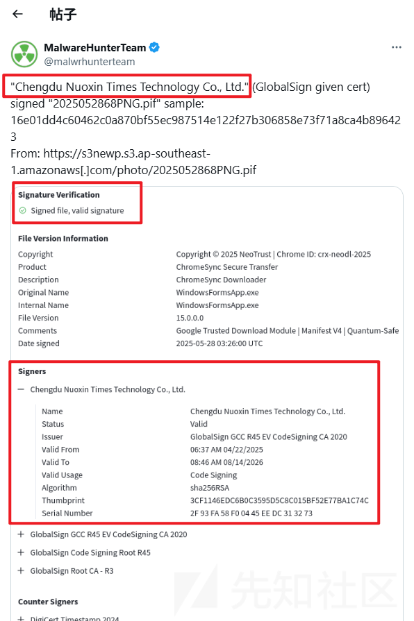

* 《Higaisa 组织近期活动分析，利用仿冒页面进行钓鱼攻击》攻击活动

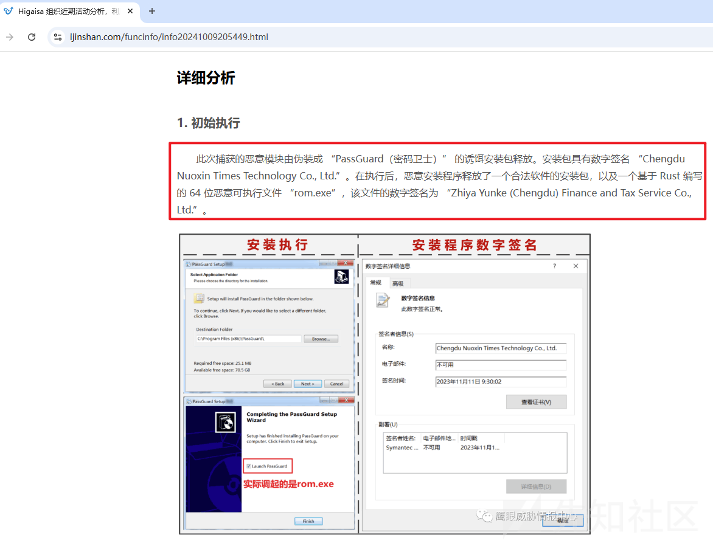

* 《国内最大IT社区CSDN被挂马，CDN可能是罪魁祸首？》攻击活动

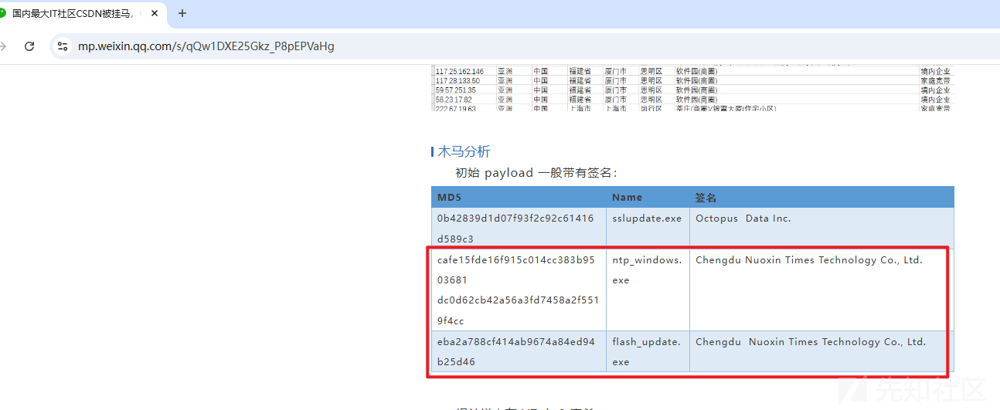

## 2025052868PNG.pif

样本基本信息如下：

```
文件名称：2025052868PNG.pif
文件大小：39592 字节
文件版本：15.0.0.0
修改时间：2025年5月28日 17:51:26
MD5     ：445B4EFED7865395B51E157813A4F008
SHA1    ：13A2D8BA2A14C5DAA0B4792D0CBA716171F22D47
CRC32   ：27F796DB
编译语言 ：C#
```

### 正常数字签名

通过分析，发现此样本是一款.NET样本，携带了正常的数字签名：Chengdu Nuoxin Times Technology Co., Ltd.

相关截图如下：

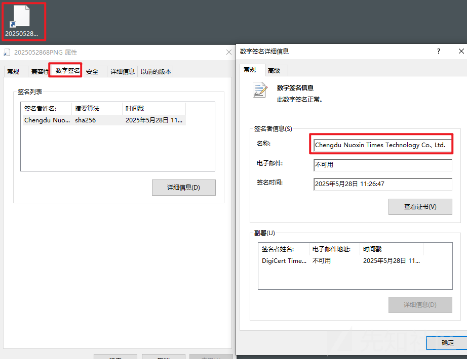

### 外联下载执行

进一步分析，发现此样本运行后：

* 将向`https://videomanagerentry.s3.ap-northeast-1.amazonaws.com/V.txt`地址发起外联请求，获取后续载荷下载地址；
* 外联下载后续载荷文件：

* `https://videomanagerentry.s3.ap-northeast-1.amazonaws.com/LogManager.dll`
* `https://videomanagerentry.s3.ap-northeast-1.amazonaws.com/commonbase.dll`
* `https://videomanagerentry.s3.ap-northeast-1.amazonaws.com/VideoManagerMainModule.dll`
* `https://videomanagerentry.s3.ap-northeast-1.amazonaws.com/VideoManagerEntry.edskv`
* `https://videomanagerentry.s3.ap-northeast-1.amazonaws.com/VideoManagerEntry.txt`
* `https://videomanagerentry.s3.ap-northeast-1.amazonaws.com/image.jpg`
* `https://videomanagerentry.s3.ap-northeast-1.amazonaws.com/VideoManagerEntry.exe`
* `https://videomanagerentry.s3.ap-northeast-1.amazonaws.com/msvcp140.dll`
* `https://videomanagerentry.s3.ap-northeast-1.amazonaws.com/vcruntime140.dll`

* 加载执行VideoManagerEntry.exe样本，触发后续恶意行为；

相关代码截图如下：

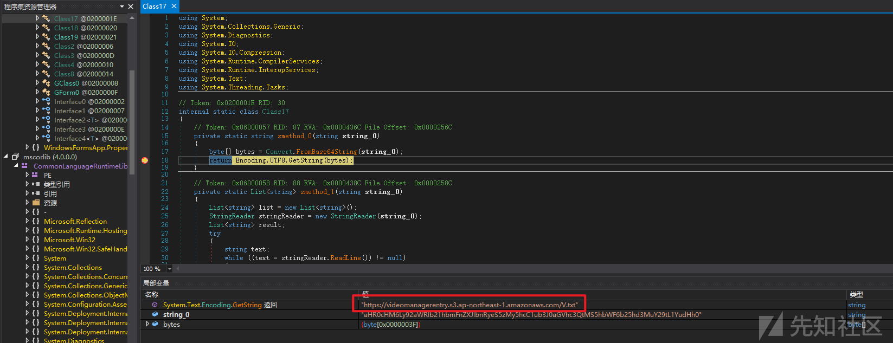

`https://videomanagerentry.s3.ap-northeast-1.amazonaws.com/V.txt`外联请求响应内容如下：

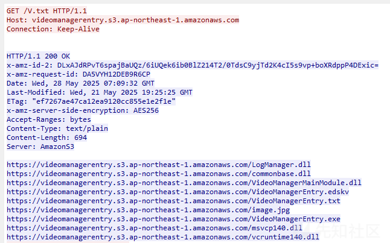

### 后续载荷文件梳理

尝试对后续载荷文件进行梳理，梳理内容如下：

|  |  |  |  |
| --- | --- | --- | --- |
| 文件名 | MD5 | 数字签名 | 备注 |
| VideoManagerEntry.exe | 2A364B6A8FD42693B15264E26DC9E6CD | Tencent Technology (Shenzhen) Company Limited | 正常腾讯视频程序 |
| VideoManagerEntry.txt | D476FF5557309A1349660FAB8EFC4179 |  | 解密密钥文件 |
| VideoManagerEntry.edskv | 44F432C76EBF0B7BA26F37CE9CC70AEA |  | 加密远控程序 |
| VideoManagerMainModule.dll | E41FDB58A7FC572F4A86EE16306A2D1B | Tencent Technology (Shenzhen) Company Limited | 正常腾讯视频文件 |
| LogManager.dll | 519F7E0828C7EDB921F3F4ED03275B60 | 海口市勤莱佳科技有限公司 | 恶意文件 |
| commonbase.dll | E34A0536171CE1EA0D026FB7A1CCA896 | 海口市勤莱佳科技有限公司 | 恶意文件 |
| image.jpg | 7CB8C795C23FBE5D1BB5C8CB0066DF66 |  | HTTP 403图片 |
| msvcp140.dll | 7E8BDD2C2304E204B44A3BEC09D66062 | Microsoft Corporation | 正常文件 |
| vcruntime140.dll | E51018E4985943C51FF91471F8906504 | Microsoft Corporation | 正常文件 |

image.jpg文件截图如下：

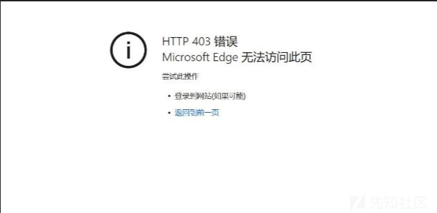

## VideoManagerEntry.exe

通过分析，发现此样本为正常腾讯视频文件，对应腾讯视频版本为11.120.1281.0（当前腾讯视频客户端的最新版本）

相关截图如下：

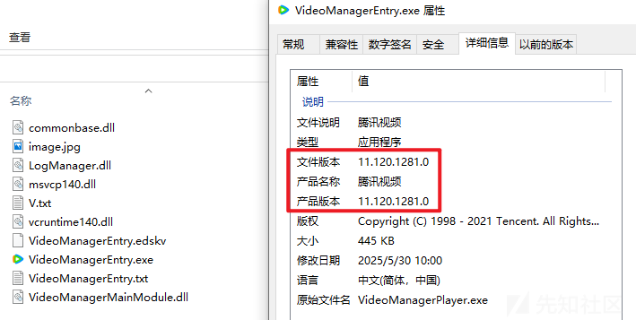

### 加载恶意LogManager.dll

进一步分析，发现攻击者采用了白+黑的技术手法加载恶意LogManager.dll的ReleaseLogManager函数。

相关代码截图如下：

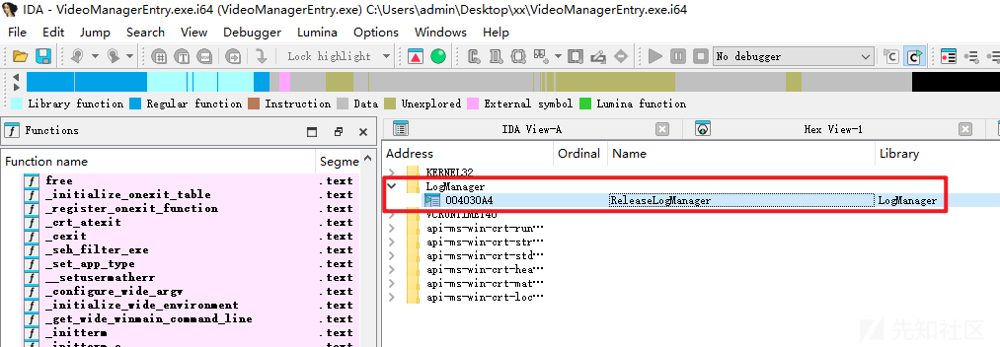

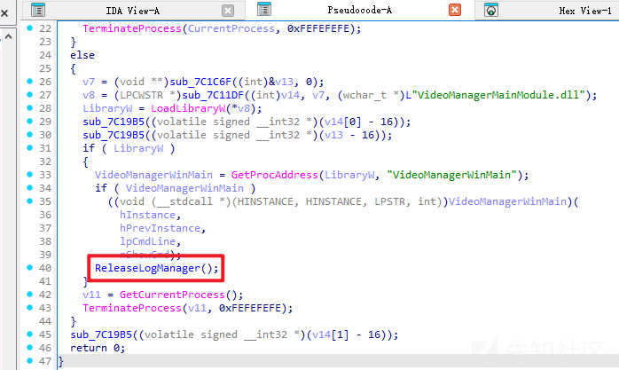

## 恶意LogManager.dll

### 正常数字签名

通过分析，发现此样本是一款伪造的恶意LogManager.dll文件，携带了正常的数字签名：海口市勤莱佳科技有限公司

相关截图如下：

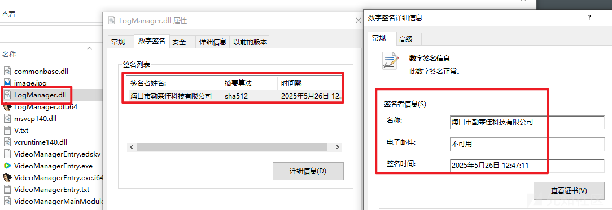

### 加载恶意commonbase.dll

进一步分析，发现此样本运行后，将加载恶意commonbase.dll的IW2tkUqqoIoErrUR3IlsSkUsHtZdoYB函数。

相关代码截图如下：

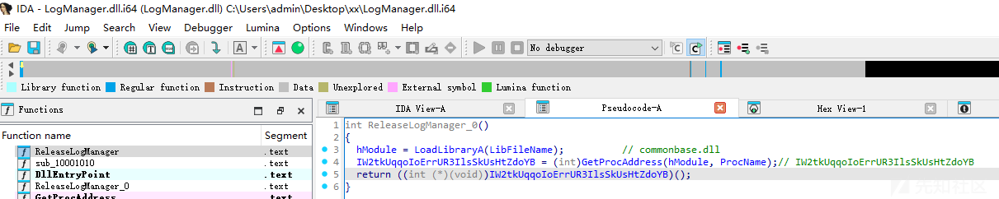

此外，在此样本的导出表中，还发现了大量相同长度的随机字符串导出函数，除IW2tkUqqoIoErrUR3IlsSkUsHtZdoYB函数外，其余导出函数代码内容均为空。

相关截图如下：

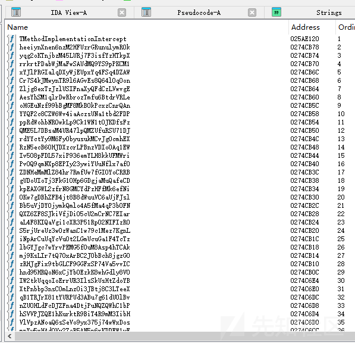

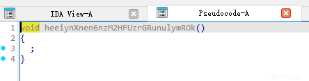

## 恶意commonbase.dll

### 正常数字签名

通过分析，发现此样本同样携带了正常的数字签名：海口市勤莱佳科技有限公司

相关截图如下：

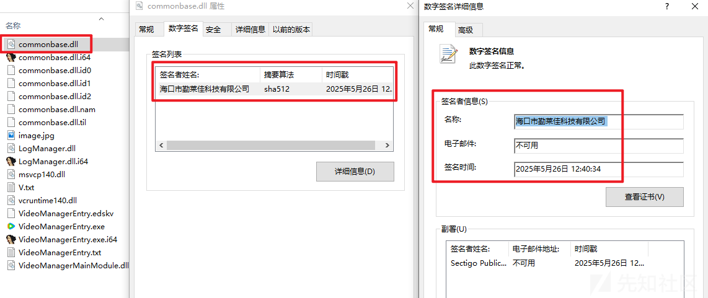

### 解密.edskv文件

通过分析，发现此样本运行过程中，将读取本地目录下的.txt文件和.edskv文件内容，使用.txt文件内容生成解密.edskv文件的解密密钥，解密.edskv文件生成最终远控木马载荷。

* 解密前文件内容如下：

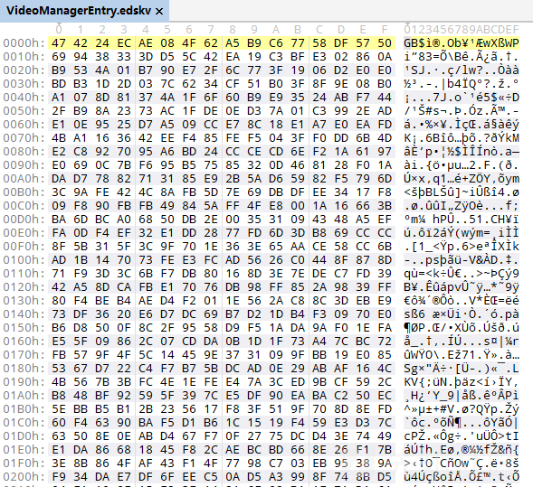

* 解密后文件内容如下：

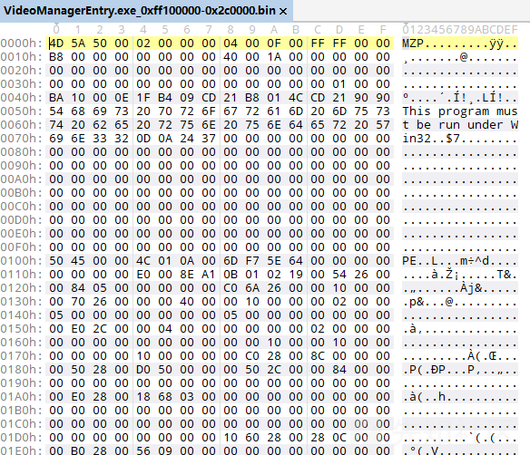

### 内存加载远控木马

成功解密VideoManagerEntry.edskv文件后，样本将在内存中加载并执行内存木马的FJYSA8D1ACE89219943A45570628FEE12787KTAC函数。

相关代码截图如下：

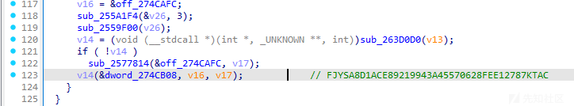

## 解密算法剖析

在分析过程中，笔者发现此次攻击活动中的码址关联的其他样本的攻击手法与此次攻击活动的攻击手法基本相同，均会在内存中解密载荷并加载。

因此，笔者琢磨，若能成功梳理其最后解密载荷的解密算法，则可在不动态调试的情况解密最终木马载荷。

分析流程如下：

* 通过动态调试确定最终木马载荷其实是由.edskv解密所得；
* 解密函数中，将传递两个参数，一个是.edskv加密文件内容，一个是“FHKAA8D1ACE89219943A45570628FEE12787”值（**推测是解密密钥**）；
* 尝试对“FHKAA8D1ACE89219943A45570628FEE12787”值进行分析，发现此值实际是由“FHKA”字符串和“A8D1ACE89219943A45570628FEE12787”字符串构成，“A8D1ACE89219943A45570628FEE12787”字符串有点像MD5值；
* 进一步分析，发现“A8D1ACE89219943A45570628FEE12787”字符串实际是由.txt文件内容计算所得，\*\*但是，直接计算.txt文件内容得到的MD5又不是A8D1ACE89219943A45570628FEE12787。。。\*\*神奇。。。
* 进一步分析，发现在生成“A8D1ACE89219943A45570628FEE12787”字符串的过程中确实是调用了MD5算法，但最终生成的值不同。
* 为了搞清楚上述MD5值的计算过程，笔者尝试构建了MD5算法代码进行调试对比，**最终发现：原来此程序计算MD5时，将原始.txt文件中的字符串转换成了UNICODE编码，但是计算MD5时使用的字符串长度却是ASCII编码字符串长度**。。。坑。。。不清楚是故意为之还是无意之举。。。

### 解密.edskv文件

通过分析，梳理解密.edskv文件的逻辑为：

* 读取VideoManagerEntry.txt文件内容，调用MD5算法生成解密密钥；
* 读取VideoManagerEntry.edskv文件内容，配合解密密钥解密生成后续远控木马载荷文件；

相关代码截图如下：

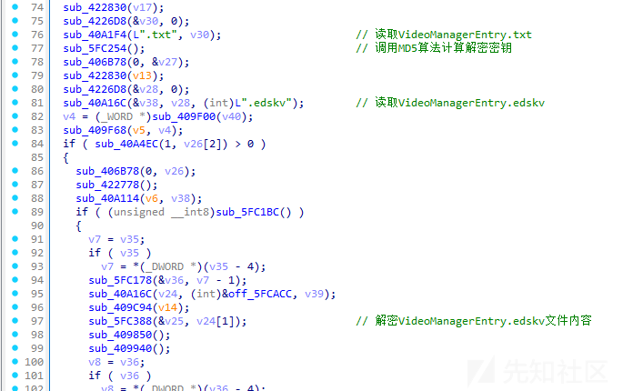

### “通义千问”识别解密算法

尝试对解密VideoManagerEntry.edskv文件内容的解密算法进行剖析，笔者发现，此解密函数并没有像MD5、AES算法一样的算子特征，若非经验可能一时半会还不是很好剖析出其算法类型。

相关代码截图如下：

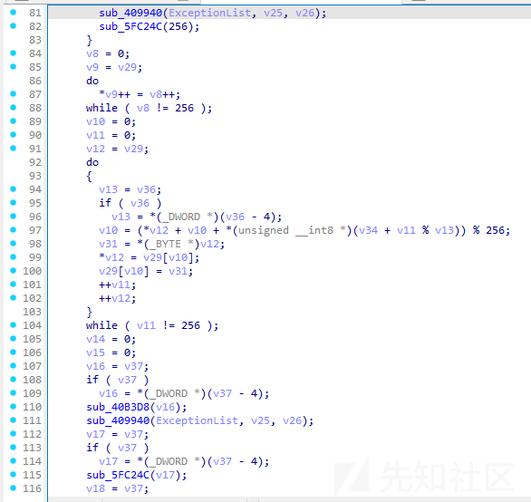

基于此，笔者琢磨，AI其实在自动化代码识别方面有一定的优势，可能会比人工识别准确度更高。

因此，笔者尝试使用了**阿里云百炼上的通义千问大模型**对上述IDA中的解密函数伪代码进行分析，发现其成功识别出上述解密函数实际为RC4算法。

相关截图如下：

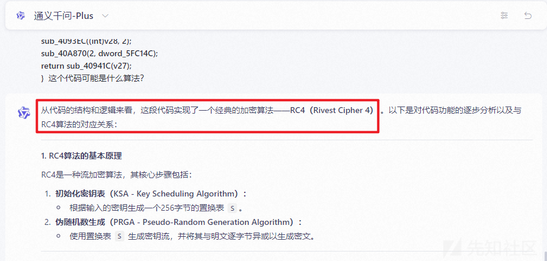

尝试使用CyberChef平台进行验证，发现可成功基于RC4算法（密钥：FHKAA8D1ACE89219943A45570628FEE12787）对VideoManagerEntry.edskv文件进行解密。

相关截图如下：

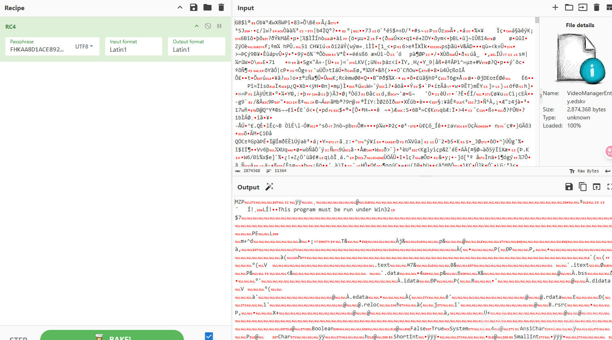

### 生成解密密钥的一个小坑

在分析由.txt文件内容生成解密密钥的过程中，笔者其实还是花费了一点时间，不过好在最终搞明白了其底层原理。

VideoManagerEntry.txt文件内容如下：

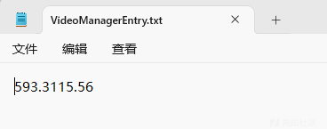

动态调试过程中，笔者发现传入.txt文件中的字符串实际是UNICODE编码格式，字符串长度实际是ASCII编码字符串长度：0xB == 11

相关代码截图如下：

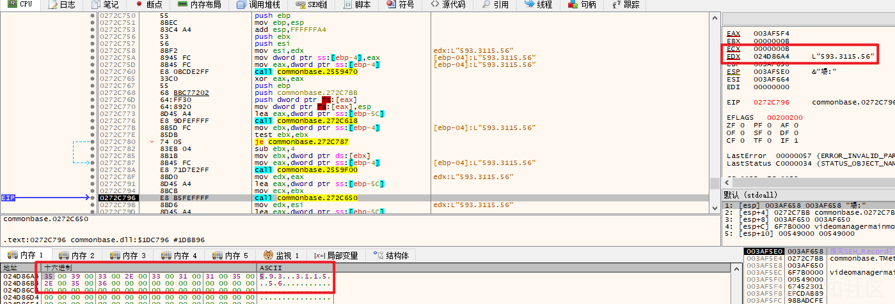

尝试使用CyberChef平台，按照上述逻辑计算MD5，发现得到的MD5值与上述解密密钥中的MD5相同。

相关截图如下：

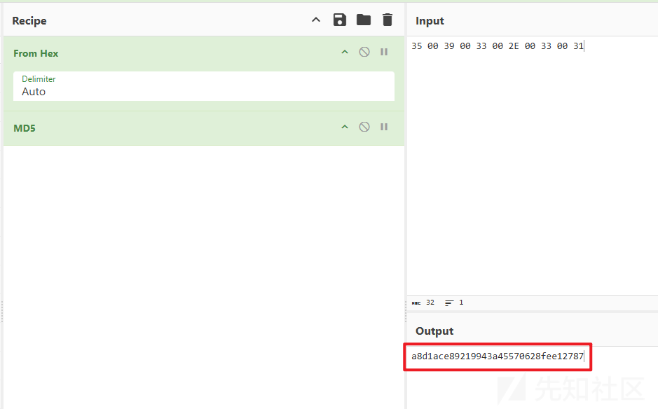

### 自动化解密脚本

基于上述解密算法逻辑，笔者尝试构建了一个自动化解密脚本，解密效果如下：

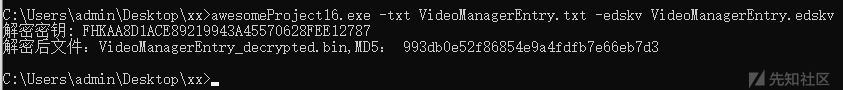

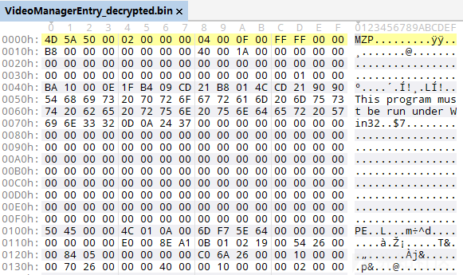

自动化解密脚本代码如下：

```
package main

import (
    "crypto/md5"
    "crypto/rc4"
    "encoding/hex"
    "flag"
    "fmt"
    "os"
    "strings"
)

// 计算MD5值
func calculateMD5(data []byte) string {
    hash := md5.Sum(data)
    return hex.EncodeToString(hash[:])
}

func textToUnicodeHex(text string) string {
    var hexBuilder strings.Builder
    for _, r := range text {
        hexBuilder.WriteString(fmt.Sprintf("%X00", r))
    }
    return hexBuilder.String()
}

func main() {
    // 定义命令行参数
    txtFile := flag.String("txt", "", "Path to the .txt file")
    edskvFile := flag.String("edskv", "", "Path to the .edskv file")
    flag.Parse()

    // 验证参数
    if *txtFile == "" || *edskvFile == "" {
        fmt.Println("请提供 .txt 文件和 .edskv 文件路径")
        fmt.Println("用法: go run decrypt_files.go -txt <text_file> -edskv <edskv_file>")
        os.Exit(1)
    }

    // 读取 .txt 文件内容
    txtContent, err := os.ReadFile(*txtFile)
    if err != nil {
        os.Exit(1)
    }

    unicodehex := textToUnicodeHex(string(txtContent))

    txtContent_unicode, _ := hex.DecodeString(unicodehex)
    key := "FHKA" + strings.ToUpper(calculateMD5(txtContent_unicode[:len(txtContent)]))
    fmt.Printf("解密密钥: %s
", key)

    // 读取 .edskv 文件内容
    edskvContent, err := os.ReadFile(*edskvFile)
    if err != nil {
        os.Exit(1)
    }

    // RC4解密
    cipher, err := rc4.NewCipher([]byte(key))
    if err != nil {
        os.Exit(1)
    }
    decrypted := make([]byte, len(edskvContent))
    cipher.XORKeyStream(decrypted, edskvContent)

    // 保存解密后的内容到新文件
    outputFile := strings.TrimSuffix(*edskvFile, ".edskv") + "_decrypted.bin"
    err = os.WriteFile(outputFile, decrypted, 0644)
    if err != nil {
        os.Exit(1)
    }
    fmt.Printf("解密后文件：%s,MD5： %s 
", outputFile, calculateMD5(decrypted))
}
```

## VideoManagerEntry.edskv

### 样本家族

通过分析，在此样本的字符串中发现了`Please, send a email to XtremeCoder ---> newxtremerat@gmail.com`字符串。尝试对此字符串进行网络调研，发现此字符串其实是XtremeRAT远控木马内置的字符串信息。

相关截图如下：

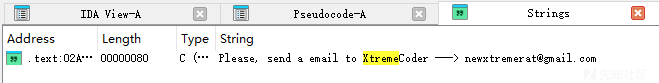

进一步分析，发现此样本的字符串还存在`Embarcadero Delphi for Win32 compiler version 28.0 (21.0.17707.5020)`字符串，说明此样本是由Delphi语言编译，与网络中关于XtremeRAT远控木马的编译语言一致。

相关截图如下：

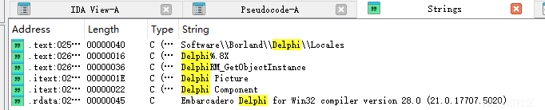

网络调研截图如下：

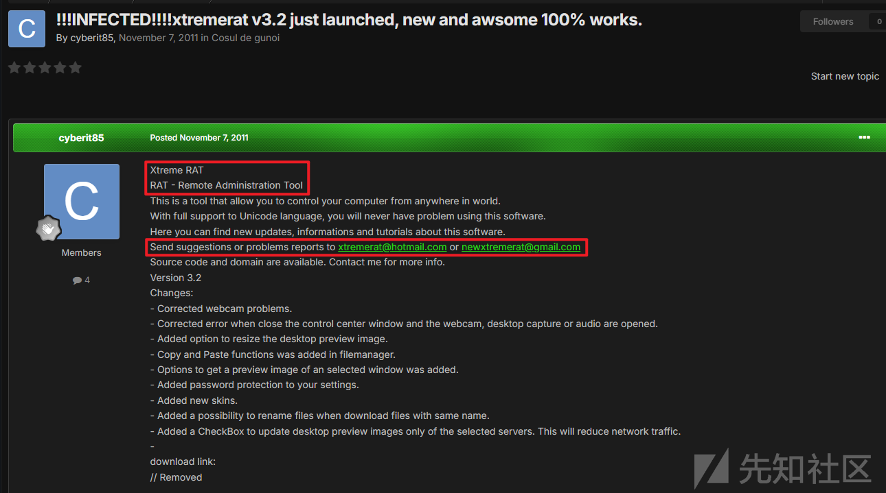

### 互斥对象

通过分析，发现此样本运行后，将创建互斥对象`hkuewdbghrgxv`，用于确保主机中只存在一个程序实例运行。

相关代码截图如下：

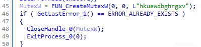

### 外联通信

样本运行过程中，将根据ConnectIp注册表项选择不同的外联地址进行外联通信。

* u.arpuu.com|#3158|：外联地址实际在commonbase.dll文件中；
* kimhate.com|#1516|：外联地址在当前远控木马中；

相关代码截图如下：

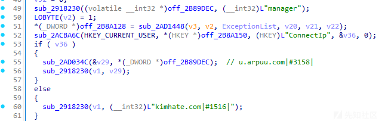

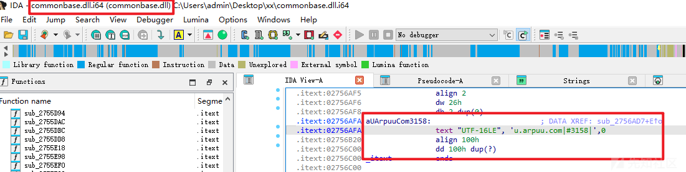

### 远控功能

通过分析，发现此样本远控功能函数中，存在200余个switch case分支调用，包含常见的文件遍历、程序执行等远控功能模块。

相关代码截图如下：

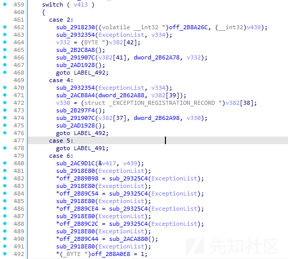

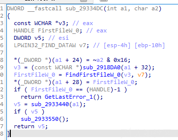

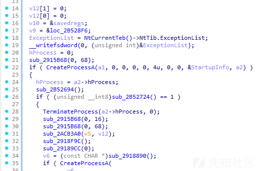

## XtremeRAT仿真

为了更直观的了解XtremeRAT远控木马，笔者尝试在网络中找到了一个XtremeRAT 3.8远控程序（老版本），成功配置木马端程序并上线，发现XtremeRAT远控木马支持的功能还比较全面，支持近40余个远控行为操作。

配置木马端程序截图如下：

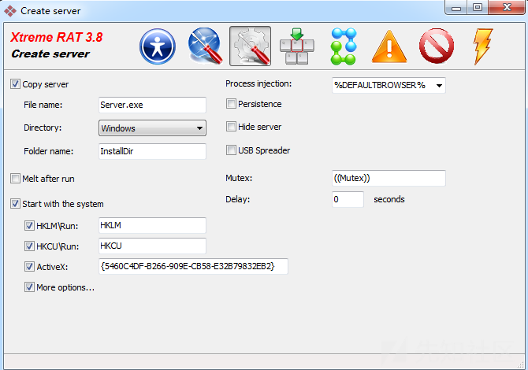

木马上线后远控功能截图如下：

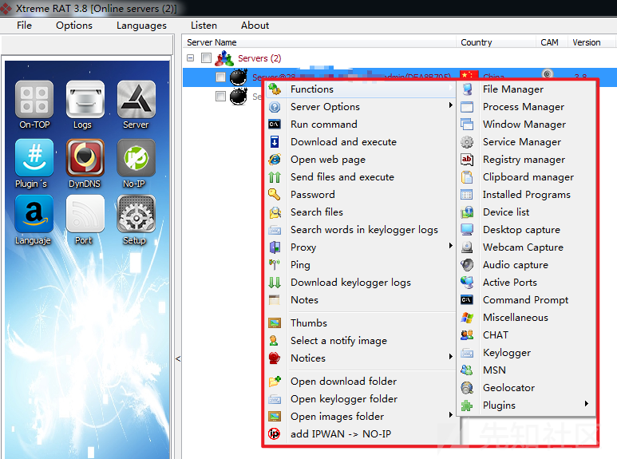

## 关联扩线分析

为了更全面的了解此次攻击活动，笔者尝试基于VT平台对此次攻击活动中的码址进行关联分析，发现：

* 此次攻击活动中的码址，最早可追溯至2025年3月21日，截至笔者分析时，每天都有新的关联样本产生；
* 尝试提取多个样本进行分析，发现其最终释放的样本Hash相同，均为此次攻击活动中的XtremeRAT远控木马；
* 尝试提取关联样本中的数字签名，**发现大量除此次攻击活动外的国内其他正常数字签名**；

梳理不同数字签名的代表样本列表如下（备注：样本量大，因此每个数字签名只列举了一个样本）：

|  |  |  |
| --- | --- | --- |
| 文件名 | MD5 | 数字签名 |
| WindowsFormsApp.exe | 6ce2907c2e37921656280a4d97c54e95 | Meizhou Fisherman Network Technology Co., Ltd. |
| WindowsFormsApp.exe | 9eadbf3d7b076b0029a326662a26001d | 运城市盐湖区风颜商贸有限公司 |
| WindowsFormsApp.exe | 445b4efed7865395b51e157813a4f008 | Chengdu Nuoxin Times Technology Co., Ltd. |
| LogManager.dll | 519f7e0828c7edb921f3f4ed03275b60 | 海口市勤莱佳科技有限公司 |
| photo202504025168.jpg.pif | 0934a79a7cd562a9146f37cc9d293942 | Shanghai Linyao Network Technology Co., Ltd. |
| tasloginbase.dll | 9870de93fa510b0c213dda8da58466a5 | Klimine Far Year Electronic Commerce Co., Ltd. |
| photo2025050468.exe | 3f1fd52c4ca27e91a50adb3d2fd96b63 | Hoozoou Leeser Smart Technology Co., Ltd. |
| mpextms.exe | 296a2384c375d1dbb92fe261fc4da0a5 | Harman International Industries, Incorporated |
| LogManager.dll | d11a0577a5f52aebedea1d3e944a18d4 | Ventis Media, Inc. |
| ntkrnlmp.exe | 205ba6848e8ac15819f381c967314d77 | Shenzhen Xiangyou Network Technology Co., Ltd. |
| photo2025040368.jpg.pif | 1a73e4402c6936864bae54adb5f4d899 | GZ.PurestJone Network Technology Co., Ltd. |
| image20250317png.jpg.pif | 39eace1295e08c00053a51264d811032 | Hena Luxion Network Technology Co., Ltd. |
| photo202504175689.JPG.pif | 2ca85769db7d1e6ded7bde9f84bad2e0 | PrimeSnap Technologies Network Company |

相关截图如下：

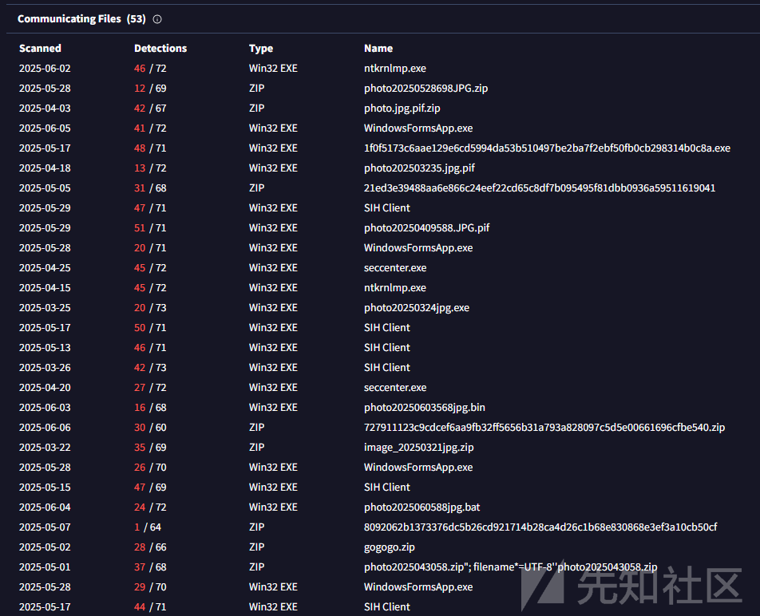

## 数字签名调研

尝试基于企查查对数字签名中的公司名称进行调研，结果如下：

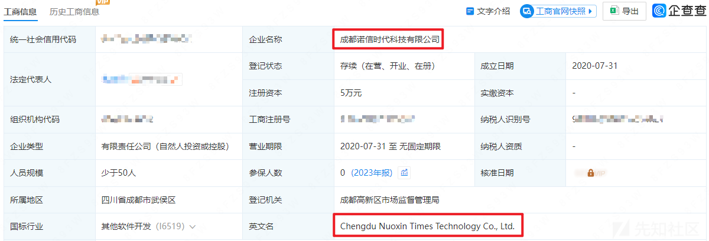

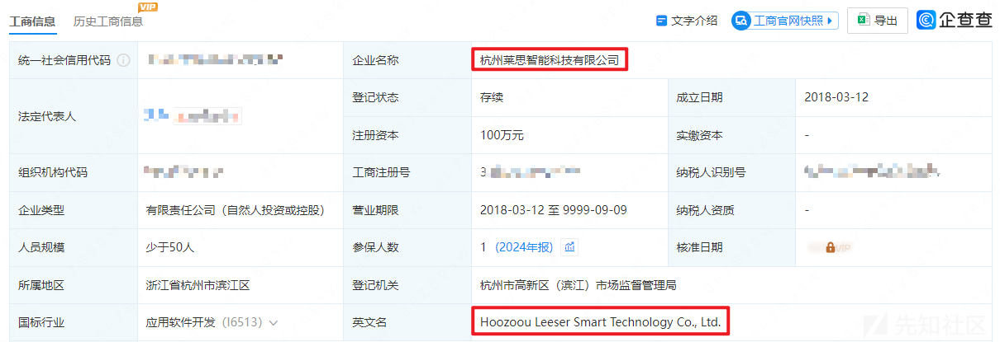

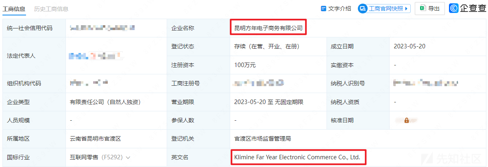

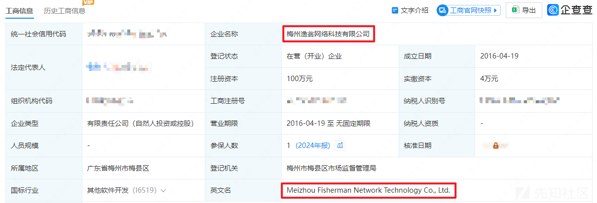

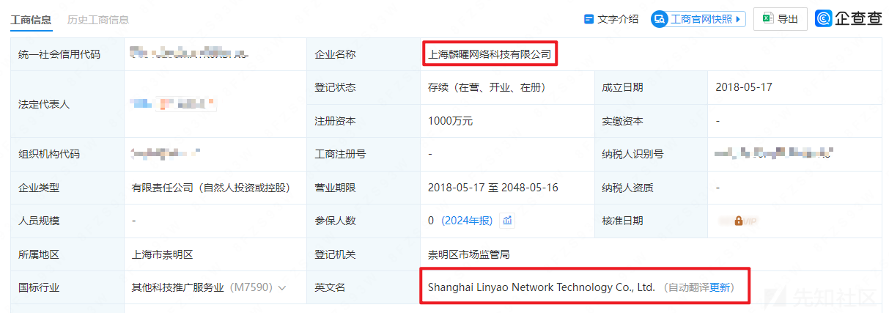

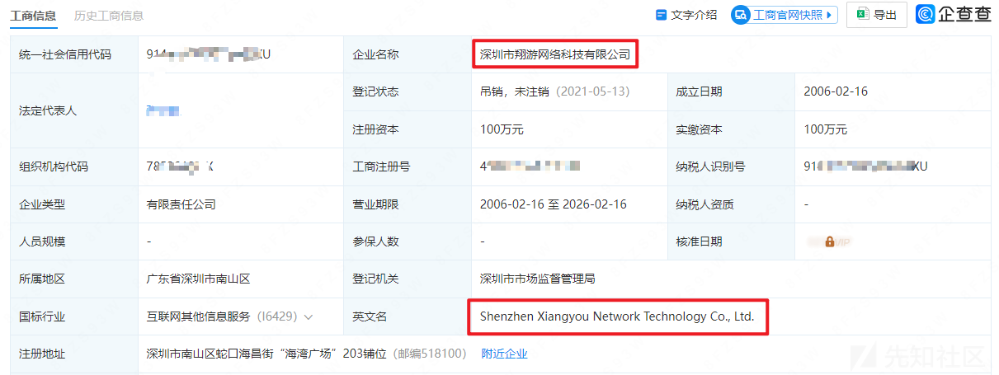

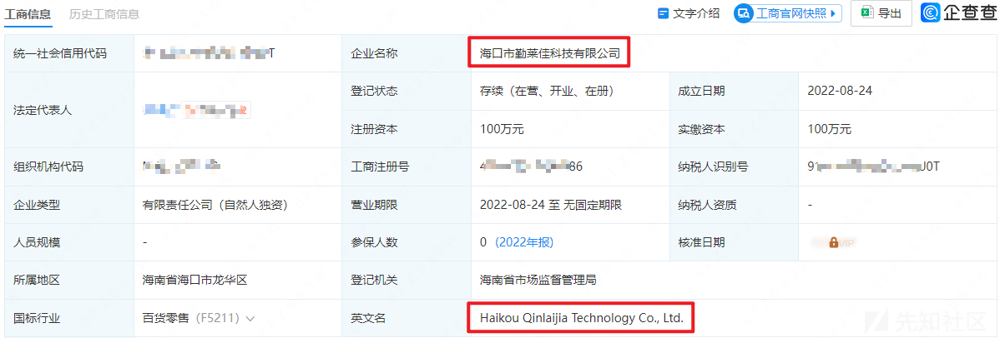

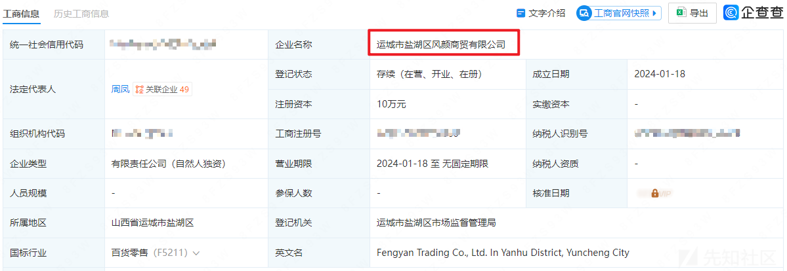
