# 第一届OpenHarmony CTF专题赛RE题解-先知社区

> **来源**: https://xz.aliyun.com/news/18234  
> **文章ID**: 18234

---

# easyre

hap文件改成zip格式然后解压去反编译abc文件即可拿到源码

这里推荐一个网站<https://abcd.darknavy.org/>

蛮好用的

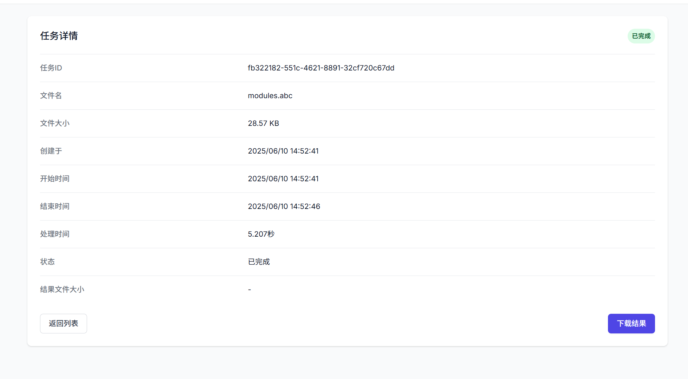

下载反编译结果，解压后用vscode打开分析。

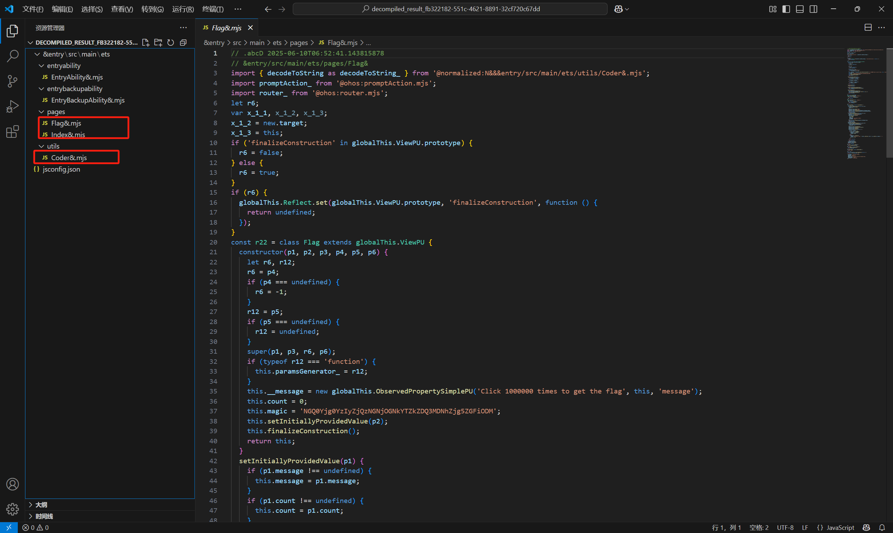

这里可以看到一些目录结构，我们先看看flag目录

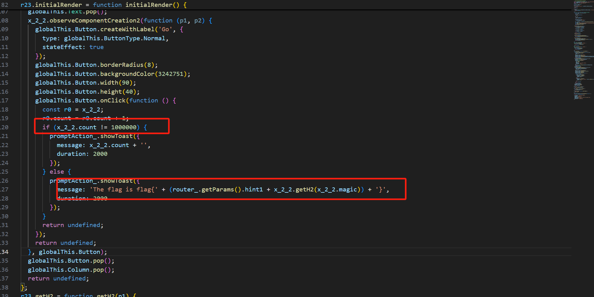

x\_2\_2.count位1000000的时候就会输出flag那么大概率是一个点击程序可以用DevEco Studio里面的模拟器安装一下这个程序。


点击到100万次不太可能，我们还是看代码逻辑

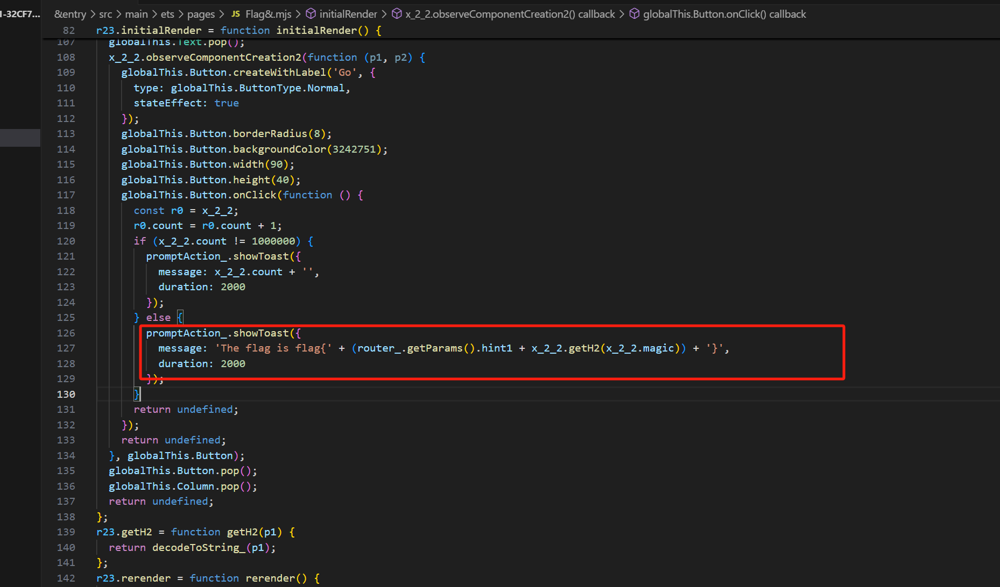

这是flag的生成方式

```
router_.getParams().hint1 + x_2_2.getH2(x_2_2.magic)
```

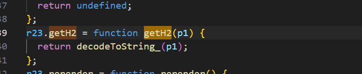

## 第二部分flag

这里我们看到getH2的逻辑，实际上就是decodeToString函数

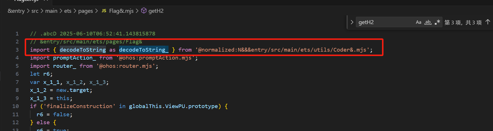

我们去到coder里面看它的逻辑

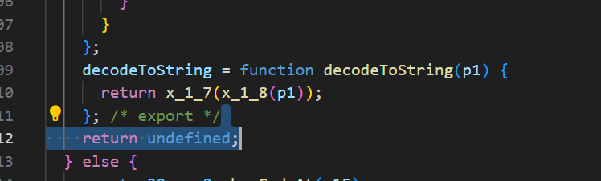

里面的话调了两个函数

x\_1\_8是标准的base解码

而x\_1\_7是反转

```
x_1_7 = function convertToString(p1) {
  let r10, r19, r32, r33;

  // 将输入参数 p1 赋值给 r10
  r10 = p1;

  // 如果 p1 是 ArrayBuffer（原始二进制数据），转换为 Uint8Array 后再调用 x_1_1（可能是解码函数）
  if (p1 instanceof globalThis.ArrayBuffer) {
    const r5 = new globalThis.Uint8Array(p1); // 转为字节数组
    r10 = x_1_1(r5); // 调用自定义函数 x_1_1 处理
  }

  // 再次赋值 r10 给 r19
  r19 = r10;

  // 如果 r10 是 Uint8Array 类型，再调用一次 x_1_1 处理
  if (r10 instanceof globalThis.Uint8Array) {
    r19 = x_1_1(r10);
  }

  // 如果处理后的 r19 不是字符串，抛出异常
  if (typeof r19 != 'string') {
    throw Error('Unsupported type');
  } else {
    // 倒序构造字符串
    r32 = r19.length - 1; // 从最后一个字符开始
    r33 = ''; // 用于保存倒序结果

    while (true) {
      if (r32 < 0) {
        return r33; // 倒序完成，返回结果
      } else {
        r32 = r32 - 1;
        r33 = r33 + r19[r32 + 1]; // 注意此处 r32 先减再加回，所以还是访问从尾到头的字符
      }
    }
  }
};

```

我们根据这个逻辑去解一下magic就能拿到第二部分flag

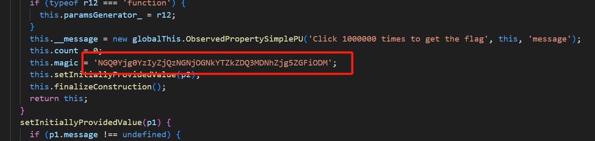

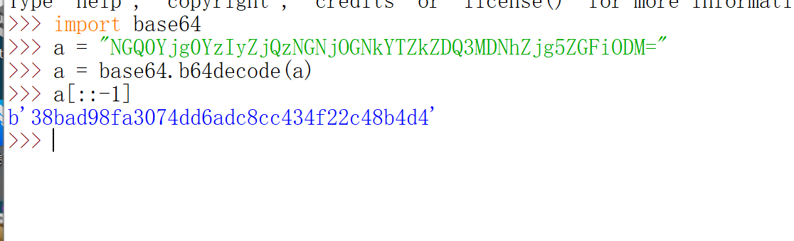

part2:38bad98fa3074dd6adc8cc434f22c48b4d4

​

## 第一部分flag

第一部分逻辑在index

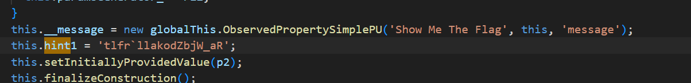

密文

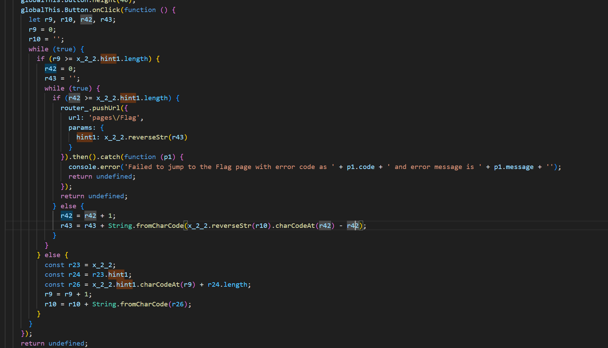

自解密部分，这块实际上就是首先+上自己的长度，然后反转，逐字符-i在反转

​

拿密文正向跑这个程序即可

```
hint1 = 'tlfr`llakodZbjW_aR'

r10 = ''.join([chr(ord(c) + len(hint1)) for c in hint1])


r10_rev = r10[::-1]


r43 = ''.join([chr(ord(c) - i) for i, c in enumerate(r10_rev)])


final_hint1 = r43[::-1]
print(final_hint1)
```

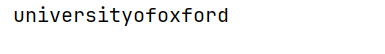

part1:universityofoxford

​

# arkts

这题还是蛮简单的

这里用jadx-dev-all去反编译，因为上面的那个网站反编译不完全。

将hap改成zip后解压，把abc文件直接拖到工具里即可

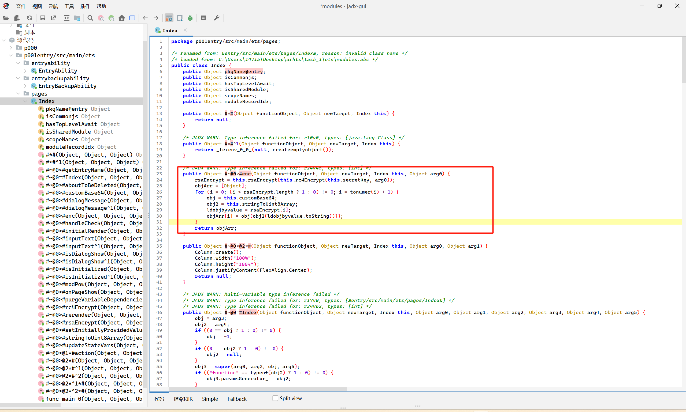

这里可以看到加密顺序先经过rc4然后再base64再rsa加密一下

这里rc4和base64都不是标准的

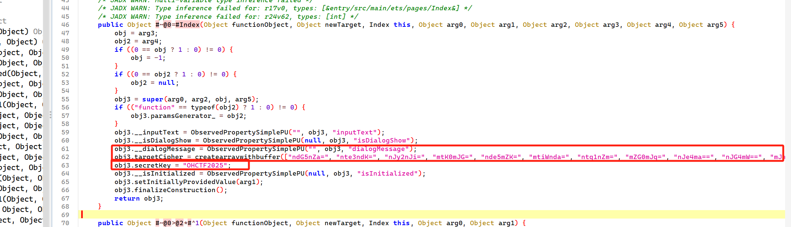

这里是密文数组和一个假的key

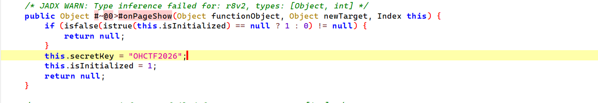

调用onPageShow的时候会把key替换

所以key是OHCTF2026

我们先去看看rc4

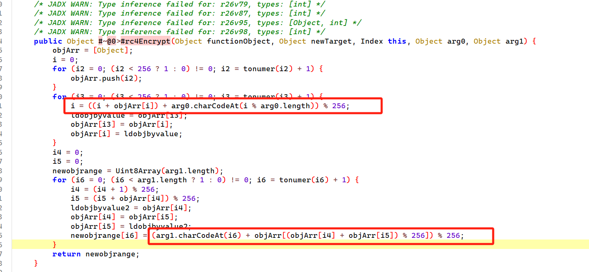

魔改点在sbox和加密的地方

生成sbox只用了一个i

加密的地方把异或变成了+

解rc4

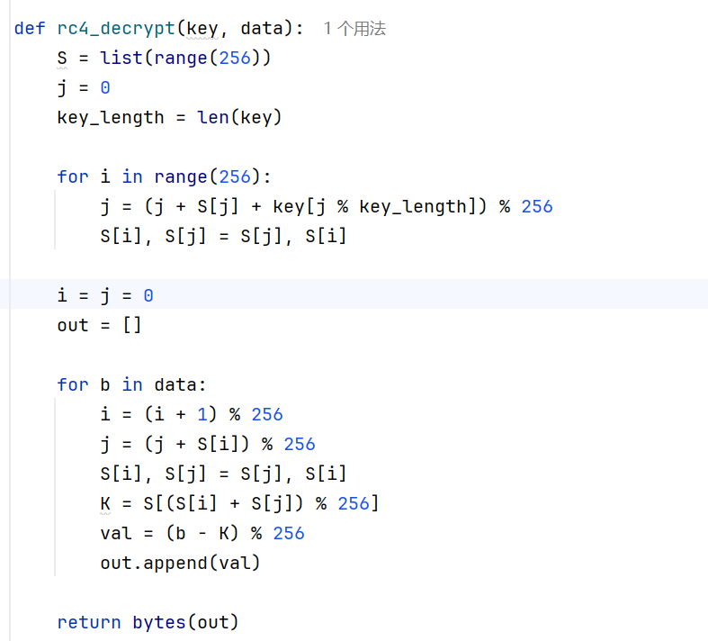

我们去看看base64

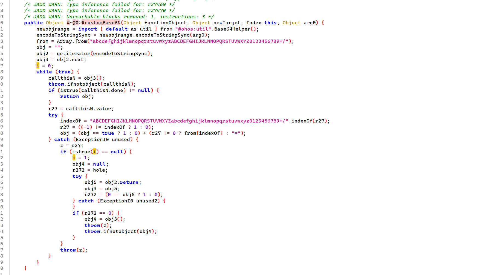

很明显的换表逻辑

解base64

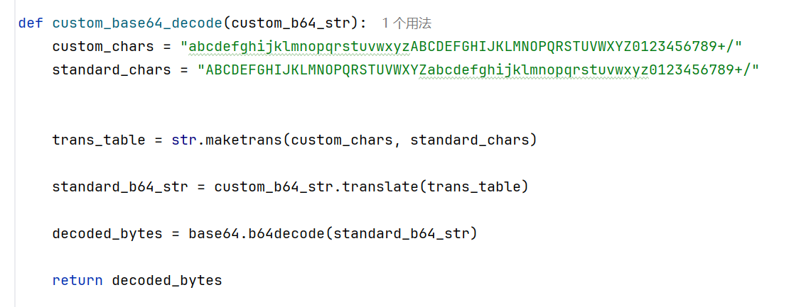

最后我们去看rsa

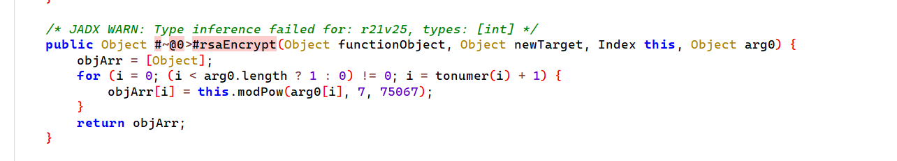

e是7

N是75067

N很小直接拿yafu去分了

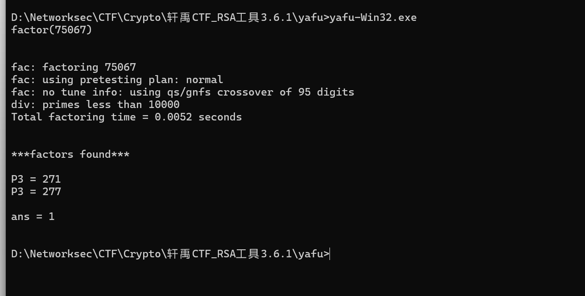

得到p = 271 q=277

那么私钥d也就能求了

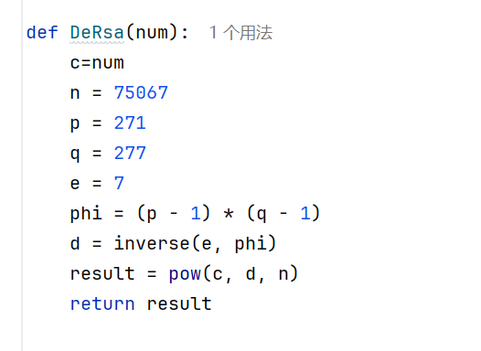

完整解密脚本

```
from Crypto.Util.number import *
import base64

enc = ["ndG5nZa=", "nte3ndK=", "nJy2nJi=", "mtK0mJG=", "nde5mZK=", "mtiWnda=", "ntq1nZm=", "mZG0mJq=", "nJe4ma==", "nJG4mW==", "mJa0mZG=", "mty1mte=", "mtu3odq=", "nJyZmJy=", "nJeWody=", "mJy1ntm=", "ntaWody=", "ma==", "ntqYodK=", "ndK2nJm=", "nJyZndq=", "ntaWody=", "ndGYndi=", "nJG4mW==", "mJu5mG==", "mtiYmda=", "mZmWnde=", "mteXndC=", "ndqXndm=", "mte1mZi=", "mJy5ntq=", "mZC4mtC=", "mJe4nW==", "nJC3odu=", "ndyXmdK=", "ndG5nZa=", "ndaZnZa=", "mtK0nJa="]

def custom_base64_decode(custom_b64_str):
    custom_chars = "abcdefghijklmnopqrstuvwxyzABCDEFGHIJKLMNOPQRSTUVWXYZ0123456789+/"
    standard_chars = "ABCDEFGHIJKLMNOPQRSTUVWXYZabcdefghijklmnopqrstuvwxyz0123456789+/"


    trans_table = str.maketrans(custom_chars, standard_chars)

    standard_b64_str = custom_b64_str.translate(trans_table)

    decoded_bytes = base64.b64decode(standard_b64_str)

    return decoded_bytes

def DeRsa(num):
    c=num
    n = 75067
    p = 271
    q = 277
    e = 7
    phi = (p - 1) * (q - 1)
    d = inverse(e, phi)
    result = pow(c, d, n)
    return result


def rc4_decrypt(key, data):
    S = list(range(256))
    j = 0
    key_length = len(key)

    for i in range(256):
        j = (j + S[j] + key[j % key_length]) % 256
        S[i], S[j] = S[j], S[i]

    i = j = 0
    out = []

    for b in data:
        i = (i + 1) % 256
        j = (j + S[i]) % 256
        S[i], S[j] = S[j], S[i]
        K = S[(S[i] + S[j]) % 256]
        val = (b - K) % 256
        out.append(val)

    return bytes(out)
key = "OHCTF2026"
key = [ord(i) for i in key]

decoded_numbers = [int(custom_base64_decode(i).decode()) for i in enc]
decoded_numbers = [DeRsa(i) for i in decoded_numbers]
plain = rc4_decrypt(key, decoded_numbers)
print(plain)
```

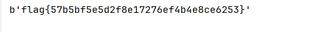

# Secret

这题还是蛮新颖的，解手势锁，然后解魔改sm4，上传解出来的图片得到flag

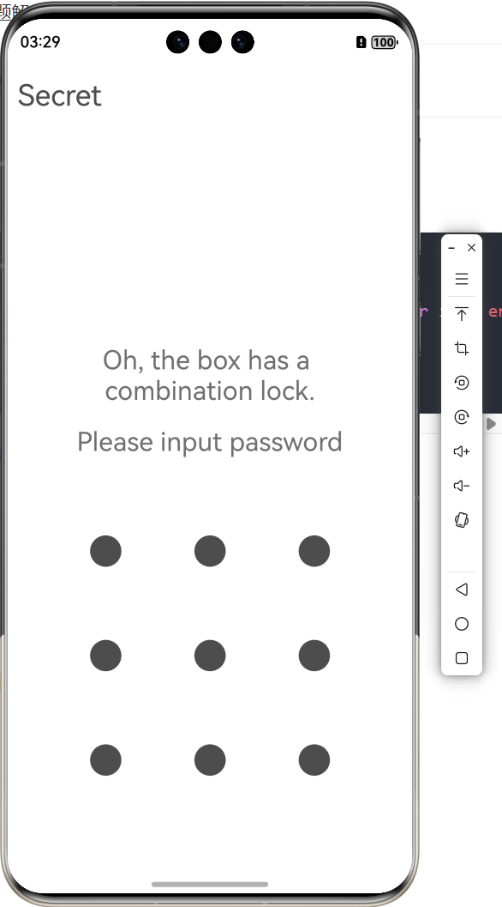

要先解手势锁

这里我还是用上面那个网站反编译的代码，虽然有部分代码反编译不完全，但不影响分析

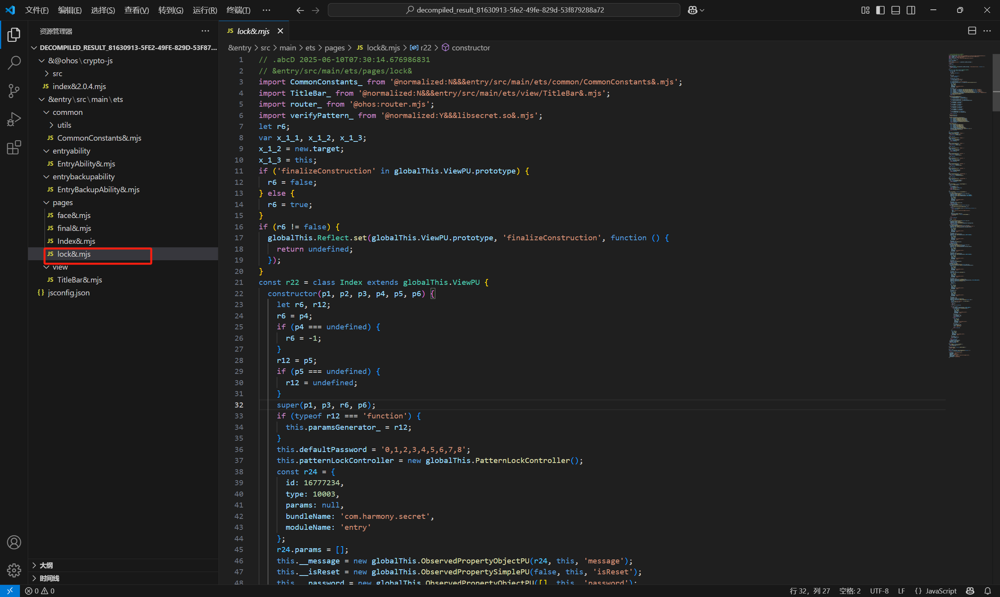

直接来看lock

有个默认密码，但是那个没有用，因为后面验证的密文不是这个

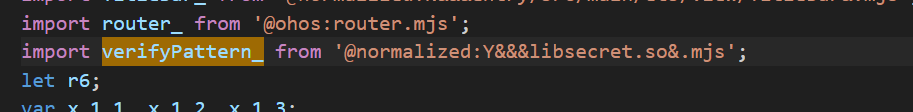

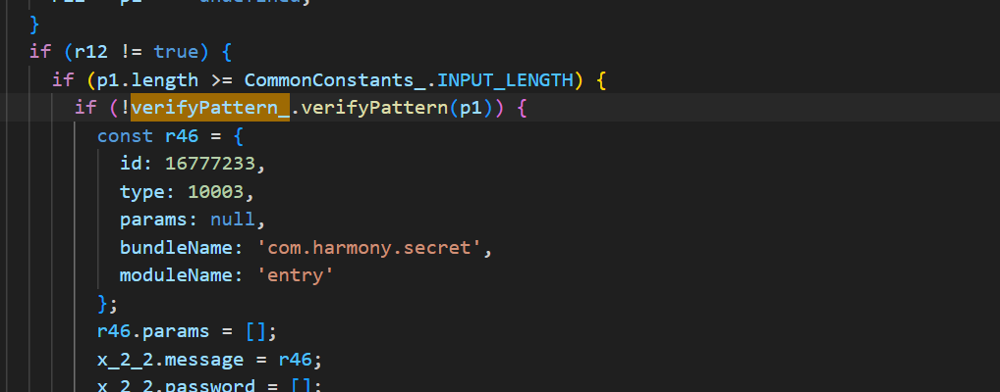

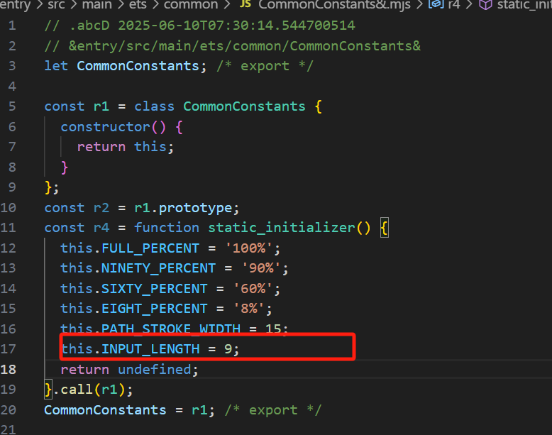

很明显的check逻辑

从@normalized:Y&&&libsecret.so&.mjs加载的。我们去看libsecret.so

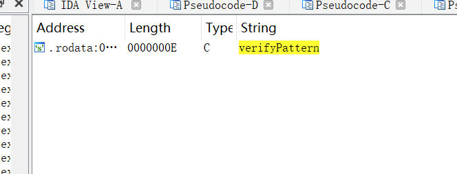

交叉引用过去下面有个函数

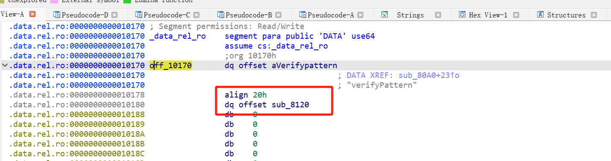

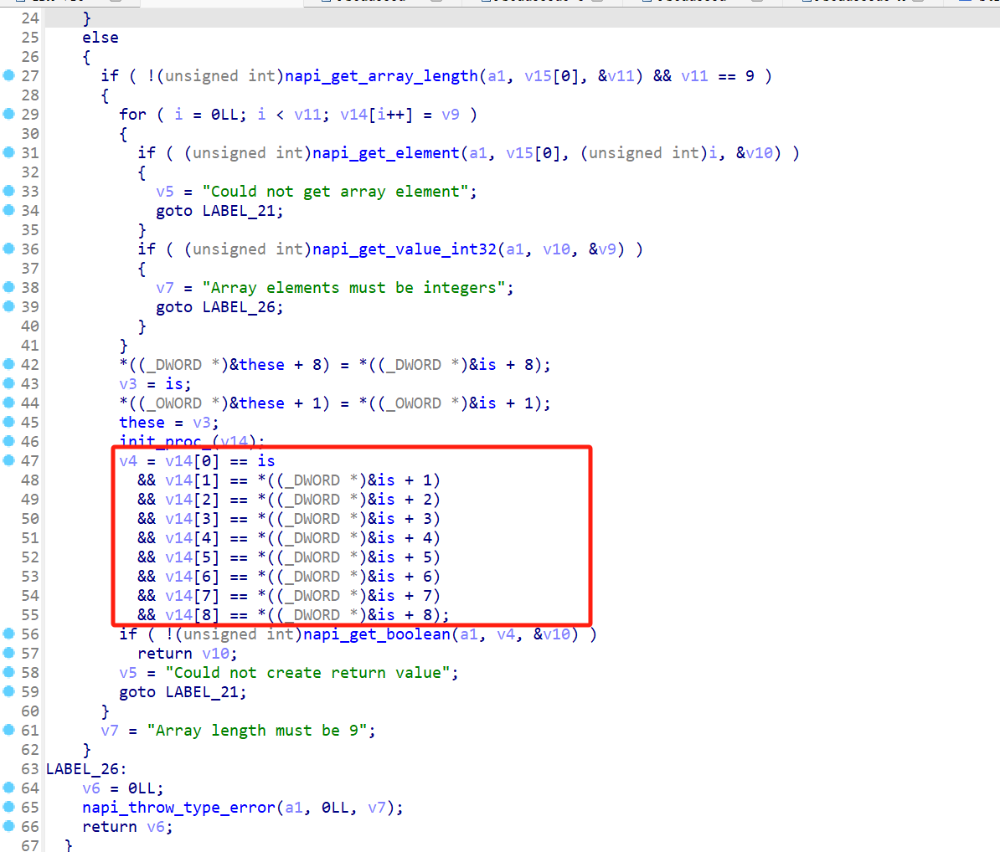

很明显的check逻辑

看看init\_proc

```
unsigned __int64 __fastcall init_proc_(unsigned int *a1)
{
  unsigned int v1; // eax
  unsigned int v2; // r15d
  unsigned int v3; // r8d
  unsigned int v4; // ebx
  unsigned int v5; // r9d
  unsigned int v6; // ebp
  unsigned int v7; // r14d
  unsigned int v8; // ecx
  unsigned int v9; // r11d
  int v10; // edx
  unsigned int v11; // ebx
  __int64 v12; // r14
  int v13; // r12d
  int v14; // ecx
  unsigned int v15; // edi
  unsigned int v17; // [rsp+8h] [rbp-80h]
  unsigned int v18; // [rsp+18h] [rbp-70h]
  unsigned int v20; // [rsp+28h] [rbp-60h]
  __int128 v21; // [rsp+40h] [rbp-48h]
  unsigned __int64 v22; // [rsp+50h] [rbp-38h]

  v22 = __readfsqword(0x28u);
  v21 = what;
  v1 = a1[8];
  v2 = *a1;
  v3 = a1[1];
  v4 = a1[4];
  v17 = a1[5];
  v5 = a1[6];
  v6 = a1[2];
  v7 = a1[3];
  v8 = a1[7];
  v9 = -1640531527;
  v10 = -11;
  do
  {
    v18 = v4;
    v11 = v7;
    v20 = v8;
    v12 = (v9 >> 2) & 3;
    v13 = *((_DWORD *)&v21 + v12);
    v2 += (((v1 >> 5) ^ (4 * v3)) + ((v3 >> 3) ^ (16 * v1))) ^ ((v9 ^ v3) + (v13 ^ v1));
    v3 += (((v2 >> 5) ^ (4 * v6)) + ((v6 >> 3) ^ (16 * v2))) ^ ((v9 ^ v6)
                                                              + (v2 ^ *((_DWORD *)&v21 + ((v9 >> 2) & 3 ^ 1))));
    v6 += (((v3 >> 5) ^ (4 * v11)) + ((v11 >> 3) ^ (16 * v3))) ^ ((v9 ^ v11)
                                                                + (v3 ^ *((_DWORD *)&v21 + ((v9 >> 2) & 3 ^ 2))));
    v14 = *((_DWORD *)&v21 + ((unsigned int)v12 ^ 3));
    v7 = v11 + ((((v6 >> 5) ^ (4 * v18)) + ((v18 >> 3) ^ (16 * v6))) ^ ((v9 ^ v18) + (v6 ^ v14)));
    v4 = v18 + ((((v7 >> 5) ^ (4 * v17)) + ((v17 >> 3) ^ (16 * v7))) ^ ((v9 ^ v17) + (v7 ^ v13)));
    v15 = (((((((v4 >> 5) ^ (4 * v5)) + ((v5 >> 3) ^ (16 * v4))) ^ ((v9 ^ v5)
                                                                  + (v4 ^ *((_DWORD *)&v21 + ((v9 >> 2) & 3 ^ 1)))))
           + v17) >> 5) ^ (4 * v20))
        + ((v20 >> 3) ^ (16
                       * (((((v4 >> 5) ^ (4 * v5)) + ((v5 >> 3) ^ (16 * v4))) ^ ((v9 ^ v5)
                                                                               + (v4 ^ *((_DWORD *)&v21
                                                                                       + ((v9 >> 2) & 3 ^ 1)))))
                        + v17)));
    v17 += (((v4 >> 5) ^ (4 * v5)) + ((v5 >> 3) ^ (16 * v4))) ^ ((v9 ^ v5)
                                                               + (v4 ^ *((_DWORD *)&v21 + ((v9 >> 2) & 3 ^ 1))));
    v5 += v15 ^ ((v9 ^ v20) + (v17 ^ *((_DWORD *)&v21 + ((v9 >> 2) & 3 ^ 2))));
    v8 = v20 + ((((v5 >> 5) ^ (4 * v1)) + ((v1 >> 3) ^ (16 * v5))) ^ ((v9 ^ v1) + (v5 ^ v14)));
    v1 += (((v8 >> 5) ^ (4 * v2)) + ((v2 >> 3) ^ (16 * v8))) ^ ((v9 ^ v2) + (v8 ^ v13));
    v9 -= 1640531527;
    ++v10;
  }
  while ( v10 );
  a1[1] = v3;
  *a1 = v2;
  a1[2] = v6;
  a1[3] = v7;
  a1[4] = v4;
  a1[5] = v17;
  a1[7] = v8;
  a1[6] = v5;
  a1[8] = v1;
  return __readfsqword(0x28u);
}
```

xxtea加密

key是what

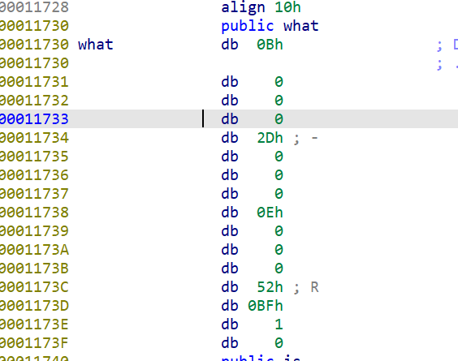

密文是is

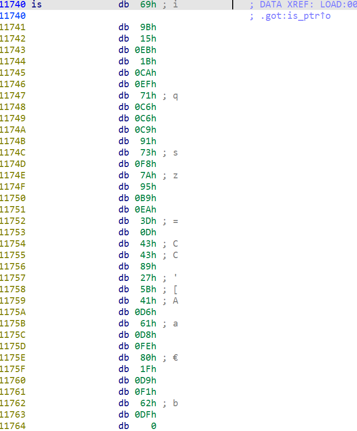

注意小端，建议用ida get\_wide\_dword()去提取

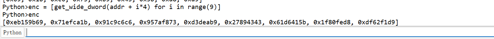

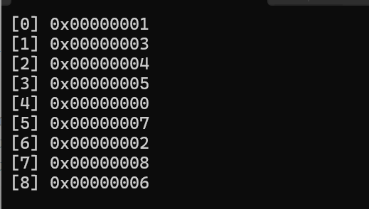

```
#include <stdint.h>
#include <stdio.h>

void f(uint32_t* a, int n, uint32_t k[4]) {
    if (n < 2) return;
    uint32_t d = 0x9E3779B9;
    int r = 6 + 52 / n;
    uint32_t s = r * d;
    uint32_t x, y, z, e;
    int i;
    x = a[0];
    while (r--) {
        e = (s >> 2) & 3;
        for (i = n - 1; i > 0; i--) {
            z = a[i - 1];
            uint32_t t1 = (z >> 5) ^ (x << 2);
            uint32_t t2 = (x >> 3) ^ (z << 4);
            uint32_t t3 = s ^ x;
            uint32_t t4 = k[(i & 3) ^ e] ^ z;
            a[i] -= (t1 + t2) ^ (t3 + t4);
            x = a[i];
        }
        z = a[n - 1];
        uint32_t t1 = (z >> 5) ^ (x << 2);
        uint32_t t2 = (x >> 3) ^ (z << 4);
        uint32_t t3 = s ^ x;
        uint32_t t4 = k[e] ^ z;
        a[0] -= (t1 + t2) ^ (t3 + t4);
        x = a[0];
        s -= d;
    }
}

int main() {
    uint32_t k[4] = { 0xB, 0x2D, 0xE, 0x1BF52 };
    uint32_t a[9] = {
        0xeb159b69, 0x71efca1b, 0x91c9c6c6, 0x957af873, 0xd3deab9, 0x27894343, 0x61d6415b, 0x1f80fed8, 0xdf62f1d9
        };
    f(a, 9, k);
    for (int i = 0; i < 9; i++) printf("[%d] 0x%08X
", i, a[i]);
    for (int i = 0; i < 9; i++) {
        uint8_t* b = (uint8_t*)&a[i];
        for (int j = 0; j < 4; j++) printf("%c", b[j]);
    }
    printf("
");
    return 0;
}

```

134507286

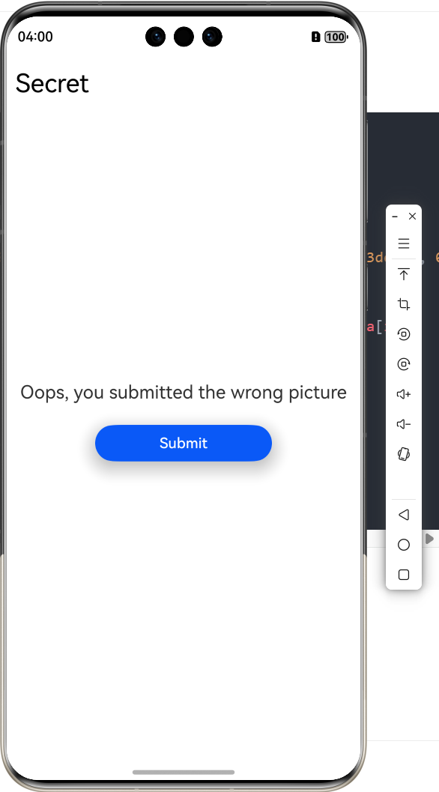

要我上传一个图片，我在资源文件里看到了个enc文件，应该是要解这个

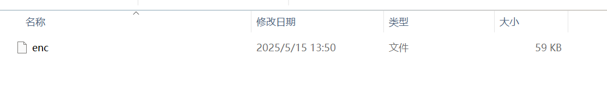

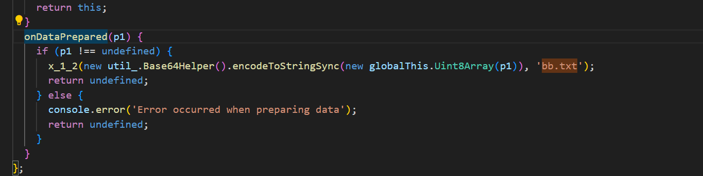

获取上传的内容，base64编码后传给bb.txt

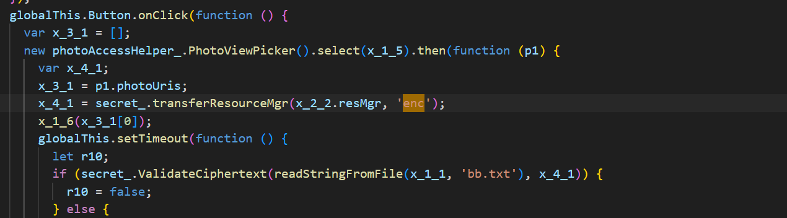

从资源文件种加载enc给x\_4\_1

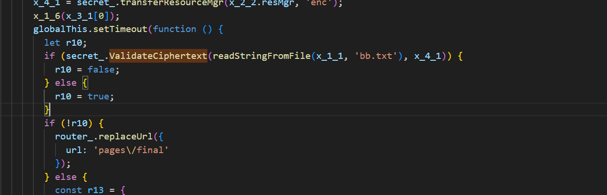

和enc check

我们去看一下这个ValidateCiphertext

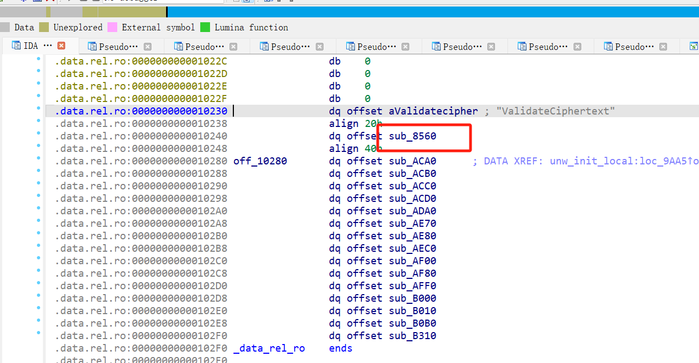

看它下面的这个函数

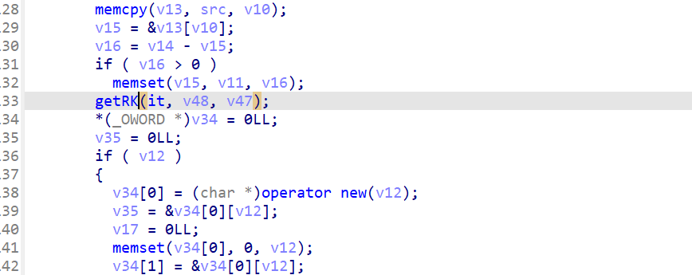

sm4轮密钥生成

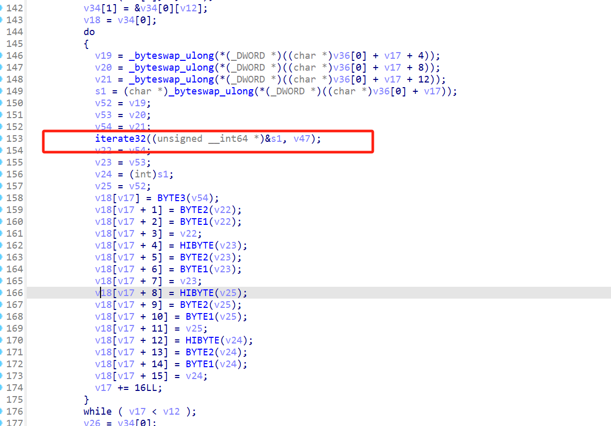

sm4 32轮迭代

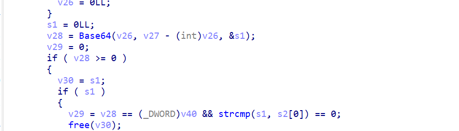

最后再base64

所以这就是enc的加密逻辑

其中sm4有魔改 多异或了一个tea的delta常量

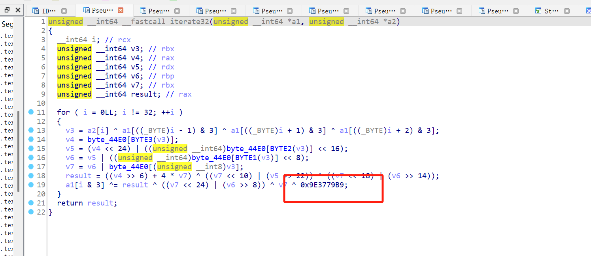

解下来编写解密代码，首先先解base64

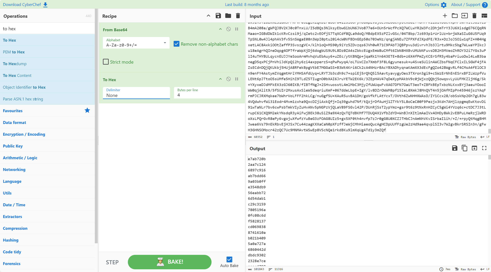

我没有写文件io去解这个文件，而是手动填密文进去

转换一下格式

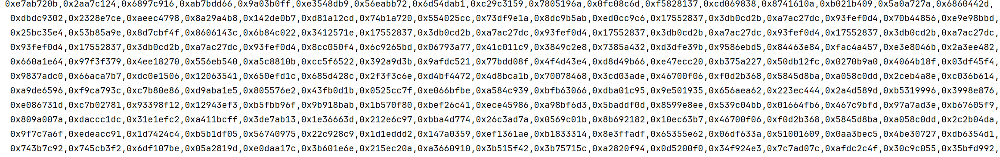

```
enc ="""填密文"""
enc = enc.split("
")
print(len(enc))
print(len(enc)/4)
for i in range(len(enc)):
    print("0x"+enc[i],end=",")
```

然后写个sm4解密脚本

密文填到这里面即可

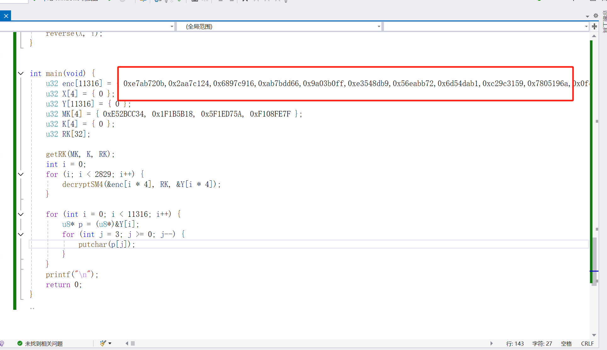

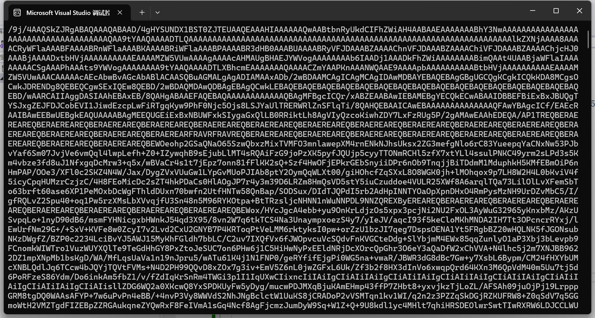

再解一层base64

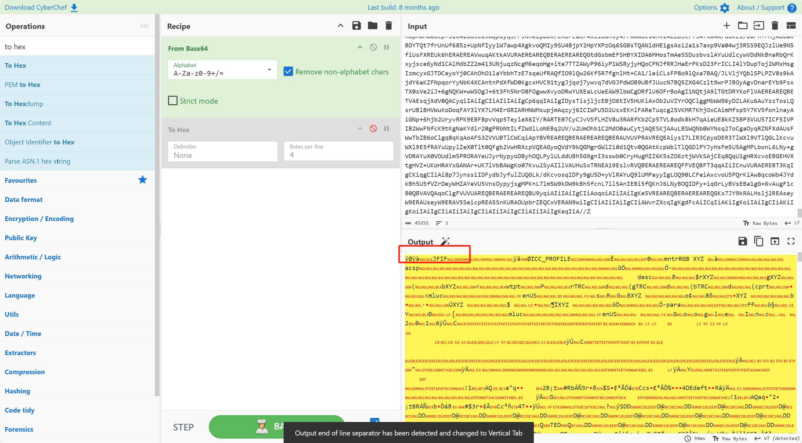

很明显的图片文件 我们保存一下


传到程序里

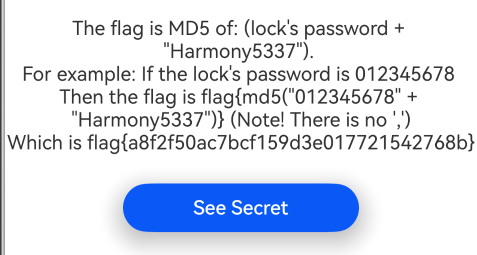

得到flag

解sm4脚本

```
#define _CRT_SECURE_NO_WARNINGS 1
#include <stdio.h>
#include <stdint.h>

typedef uint32_t u32;
typedef uint8_t u8;

u8 Sbox[256] = {
     0xD6, 0x90, 0xE9, 0xFE, 0xCC, 0xE1, 0x3D, 0xB7, 0x16, 0xB6,
  0x14, 0xC2, 0x28, 0xFB, 0x2C, 0x05, 0x2B, 0x67, 0x9A, 0x76,
  0x2A, 0xBE, 0x04, 0xC3, 0xAA, 0x44, 0x13, 0x26, 0x49, 0x86,
  0x06, 0x99, 0x9C, 0x42, 0x50, 0xF4, 0x91, 0xEF, 0x98, 0x7A,
  0x33, 0x54, 0x0B, 0x43, 0xED, 0xCF, 0xAC, 0x62, 0xE4, 0xB3,
  0x1C, 0xA9, 0xC9, 0x08, 0xE8, 0x95, 0x80, 0xDF, 0x94, 0xFA,
  0x75, 0x8F, 0x3F, 0xA6, 0x47, 0x07, 0xA7, 0xFC, 0xF3, 0x73,
  0x17, 0xBA, 0x83, 0x59, 0x3C, 0x19, 0xE6, 0x85, 0x4F, 0xA8,
  0x68, 0x6B, 0x81, 0xB2, 0x71, 0x64, 0xDA, 0x8B, 0xF8, 0xEB,
  0x0F, 0x4B, 0x70, 0x56, 0x9D, 0x35, 0x1E, 0x24, 0x0E, 0x5E,
  0x63, 0x58, 0xD1, 0xA2, 0x25, 0x22, 0x7C, 0x3B, 0x01, 0x21,
  0x78, 0x87, 0xD4, 0x00, 0x46, 0x57, 0x9F, 0xD3, 0x27, 0x52,
  0x4C, 0x36, 0x02, 0xE7, 0xA0, 0xC4, 0xC8, 0x9E, 0xEA, 0xBF,
  0x8A, 0xD2, 0x40, 0xC7, 0x38, 0xB5, 0xA3, 0xF7, 0xF2, 0xCE,
  0xF9, 0x61, 0x15, 0xA1, 0xE0, 0xAE, 0x5D, 0xA4, 0x9B, 0x34,
  0x1A, 0x55, 0xAD, 0x93, 0x32, 0x30, 0xF5, 0x8C, 0xB1, 0xE3,
  0x1D, 0xF6, 0xE2, 0x2E, 0x82, 0x66, 0xCA, 0x60, 0xC0, 0x29,
  0x23, 0xAB, 0x0D, 0x53, 0x4E, 0x6F, 0xD5, 0xDB, 0x37, 0x45,
  0xDE, 0xFD, 0x8E, 0x2F, 0x03, 0xFF, 0x6A, 0x72, 0x6D, 0x6C,
  0x5B, 0x51, 0x8D, 0x1B, 0xAF, 0x92, 0xBB, 0xDD, 0xBC, 0x7F,
  0x11, 0xD9, 0x5C, 0x41, 0x1F, 0x10, 0x5A, 0xD8, 0x0A, 0xC1,
  0x31, 0x88, 0xA5, 0xCD, 0x7B, 0xBD, 0x2D, 0x74, 0xD0, 0x12,
  0xB8, 0xE5, 0xB4, 0xB0, 0x89, 0x69, 0x97, 0x4A, 0x0C, 0x96,
  0x77, 0x7E, 0x65, 0xB9, 0xF1, 0x09, 0xC5, 0x6E, 0xC6, 0x84,
  0x18, 0xF0, 0x7D, 0xEC, 0x3A, 0xDC, 0x4D, 0x20, 0x79, 0xEE,
  0x5F, 0x3E, 0xD7, 0xCB, 0x39, 0x48
};

u32 FK[4] = { 0xA3B1BAC6, 0x56AA3350, 0x677D9197, 0xB27022DC }; // 固定参数FK
u32 CK[32] = {

    0x00070e15, 0x1c232a31, 0x383f464d, 0x545b6269,
 0x70777e85, 0x8c939aa1, 0xa8afb6bd, 0xc4cbd2d9,
 0xe0e7eef5, 0xfc030a11, 0x181f262d, 0x343b4249,
 0x50575e65, 0x6c737a81, 0x888f969d, 0xa4abb2b9,
 0xc0c7ced5, 0xdce3eaf1, 0xf8ff060d, 0x141b2229,
 0x30373e45, 0x4c535a61, 0x686f767d, 0x848b9299,
 0xa0a7aeb5, 0xbcc3cad1, 0xd8dfe6ed, 0xf4fb0209,
 0x10171e25, 0x2c333a41, 0x484f565d, 0x646b7279
};

u32 functionB(u32 b) {
    u8 a[4];
    a[0] = (b >> 24) & 0xFF;
    a[1] = (b >> 16) & 0xFF;
    a[2] = (b >> 8) & 0xFF;
    a[3] = b & 0xFF;

    return (Sbox[a[0]] << 24) | (Sbox[a[1]] << 16) | (Sbox[a[2]] << 8) | Sbox[a[3]];
}

u32 loopLeft(u32 a, short length) {
    length = length % 32;
    return (a << length) | (a >> (32 - length));
}

u32 functionL1(u32 a) {
    return a ^ loopLeft(a, 2) ^ loopLeft(a, 10) ^ loopLeft(a, 18) ^ loopLeft(a, 24);
}

u32 functionL2(u32 a) {
    return a ^ loopLeft(a, 13) ^ loopLeft(a, 23);
}

u32 functionT(u32 a, short mode) {
    if (mode == 1)
        return functionL1(functionB(a));
    else
        return functionL2(functionB(a));
}

void extendFirst(u32 MK[], u32 K[]) {
    for (int i = 0; i < 4; i++) {
        K[i] = MK[i] ^ FK[i];
    }
}

void extendSecond(u32 RK[], u32 K[]) {
    for (int i = 0; i < 32; i++) {
        K[(i + 4) % 4] = K[i % 4] ^ functionT(K[(i + 1) % 4] ^ K[(i + 2) % 4] ^ K[(i + 3) % 4] ^ CK[i], 2);
        RK[i] = K[(i + 4) % 4];
    }
}

void getRK(u32 MK[], u32 K[], u32 RK[]) {
    extendFirst(MK, K);
    extendSecond(RK, K);
}

void iterate32(u32 X[], u32 RK[]) {
    for (int i = 0; i < 32; i++) {
        u32 tmp = functionT(X[(i + 1) % 4] ^ X[(i + 2) % 4] ^ X[(i + 3) % 4] ^ RK[i], 1);
        X[(i + 4) % 4] = X[i % 4] ^ tmp ^ 0x9E3779B9;
    }
}

void reverse(u32 X[], u32 Y[]) {
    for (int i = 0; i < 4; i++) {
        Y[i] = X[3 - i];
    }
}

void encryptSM4(u32 X[], u32 RK[], u32 Y[]) {
    iterate32(X, RK);
    reverse(X, Y);
}

void decryptSM4(u32 X[], u32 RK[], u32 Y[]) {
    u32 reverseRK[32];
    for (int i = 0; i < 32; i++) {
        reverseRK[i] = RK[31 - i];
    }
    iterate32(X, reverseRK);
    reverse(X, Y);
}


int main(void) {
    u32 enc[11316] = { 0 };
    u32 X[4] = { 0 };
    u32 Y[11316] = { 0 };
    u32 MK[4] = { 0xE52BCC34, 0x1F1B5B18, 0x5F1ED75A, 0xF108FE7F };
    u32 K[4] = { 0 };
    u32 RK[32];

    getRK(MK, K, RK);
    int i = 0;
    for (i; i < 2829; i++) {
        decryptSM4(&enc[i * 4], RK, &Y[i * 4]);
    }

    for (int i = 0; i < 11316; i++) {
        u8* p = (u8*)&Y[i];
        for (int j = 3; j >= 0; j--) {
            putchar(p[j]);
        }
    }
    printf("
");
    return 0;
}

```
