# Elastic EDR 规则检测下的对抗-先知社区

> **来源**: https://xz.aliyun.com/news/18238  
> **文章ID**: 18238

---

# 1.Let's Check Our Stack

我们众所周知，一些EDR在对某一些Dll进行加载的时候，会通过ETWti 进行栈回溯

```
ws2_32.dll winhttp.dll wininet.dll 
```

我们先来看看一个正常加载的dll的时候栈会是怎么样

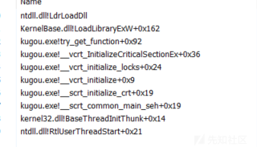

但是如果是我们的C2(不做规避下)的加载将会是这样子

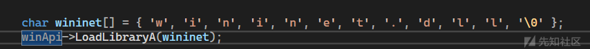

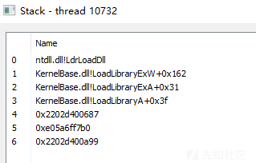

于是很不幸，对于Elastic EDR来说，你是肯定会被抓住的 :(

```
https://github.com/elastic/protections-artifacts/blob/main/behavior/rules/windows/defense_evasion_network_module_loaded_from_suspicious_unbacked_memory.toml
```

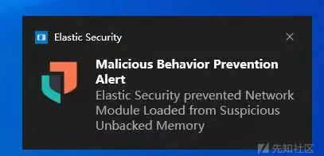

So , how to Bypass 呢 ？下面给出几种思路，有些思路还会触发其他的规则，但是只是对这一条规则的Bypass

# 2.BRC4（Fixed!）

于是就有BRC4提出的一种通过代理加载进行Load 这些敏感的Dll

<https://0xdarkvortex.dev/proxying-dll-loads-for-hiding-etwti-stack-tracing/>

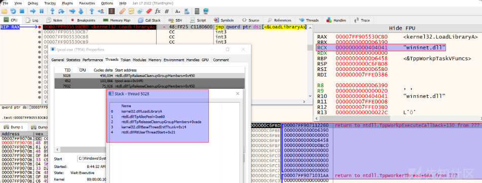

达到的效果也正如作者所说

```
The stack is clear as crystal with no signs of anything malevolent
```

于是Elastic EDR就出了这么一条规则

```
https://github.com/elastic/protections-artifacts/blob/main/behavior/rules/windows/defense_evasion_library_loaded_via_a_callback_function.toml
```

我们去观察他的规则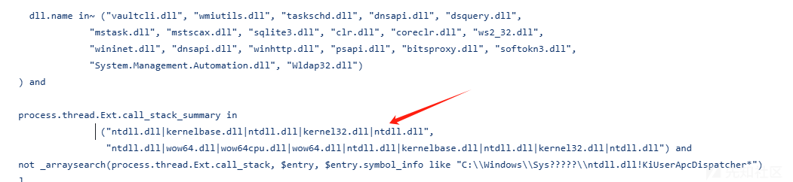

先是标记了一堆的dll，然后回溯调用栈，只要匹配立刻告警

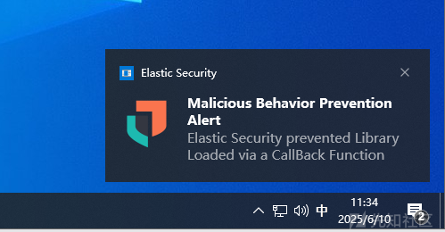

而Brc4提出的那种方法的调用链如下

```
ntdll | kernelbase |kernel32 | ntdll | kernrl32 | ntdll
```

符合我们的查杀调用链，被查杀合情合理，但是代理加载就用不了了吗 ？ 如果我们的调用链中没有了kernelbase呢？

```
 ntdll | kernrl32 | ntdll
```

这样首先就不会报毒代理加载了，现成调用栈如下

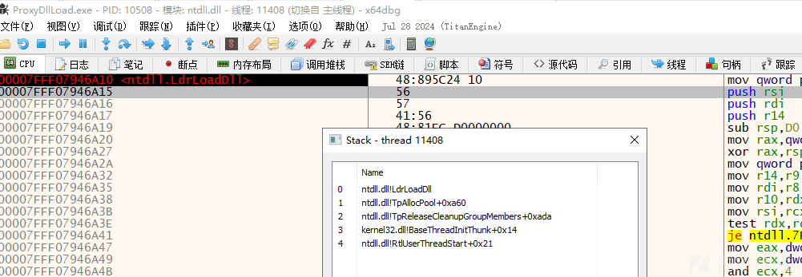

运行结果如下

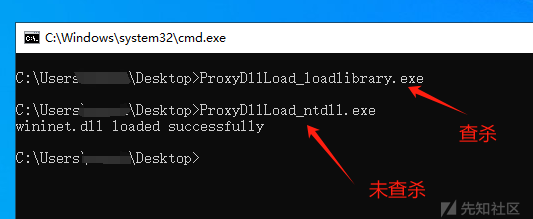

# 3.PreLoad

当我们在一个正常的Exe里面去做dll Load的时候 ，这个调用栈是绝对合法的，绝对不会出现任何未备份的内存，所以我们完全可以在Loader里面直接写PreLoad

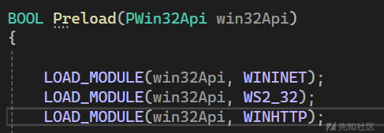

然后去UDRL里面先判断是否加载，分叉执行流

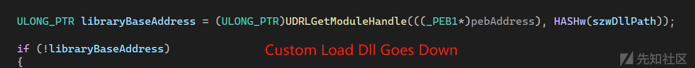

# 4.SpoofCall

堆栈欺骗，不过Elastic也有对应的检测，需要进行对应的绕过

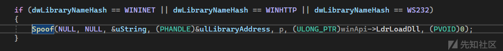

# 5.Module Stomping

当我们采用Module Stomping 的UDRl的模式下，我们的对应栈回溯起来看起来是这样的（经典Chakra.dll :P

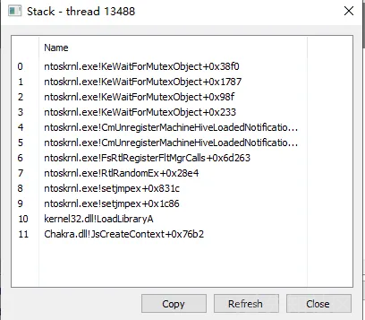

# 6.DNSBeacon

这也算是一个规则的取巧吧，我们再看那条规则

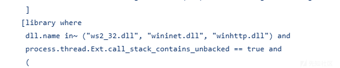

我们CS支持多种Beacon，其中就有一种Dns Beacon ，我们去生成一个Stageless Shellcode(RDI)去看看

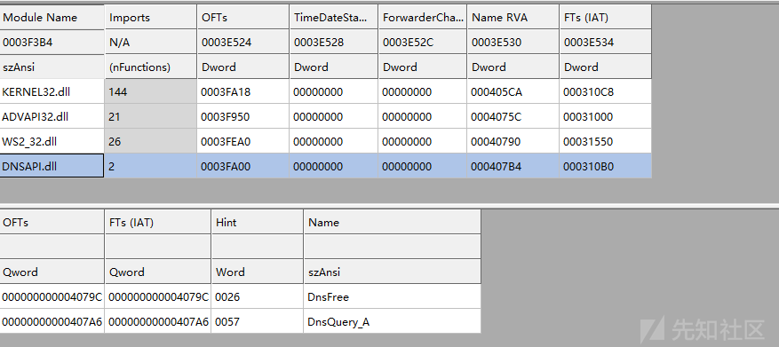

可以看见导入了 DNSAPI.dll 和WS2\_32.dll ，其中DNSAPI.dll 并不在我们的规则之中，我们可以放心加载，但是还有一个WS2\_32.dll 呢 ：( , 但是其实还是有不少的存在劫持的白文件的导入表里面有这个Dll的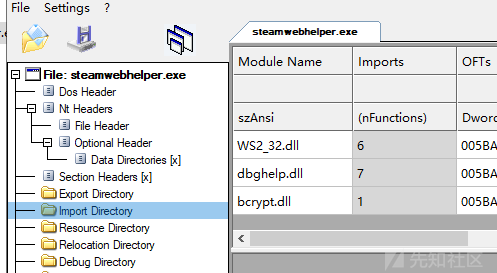

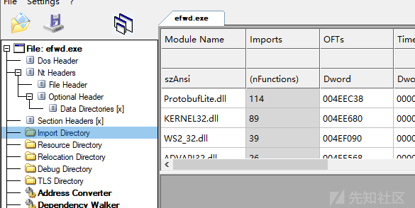

实在不行的话找一个导入ws2\_32.dll 的文件去patch就好了 ：)

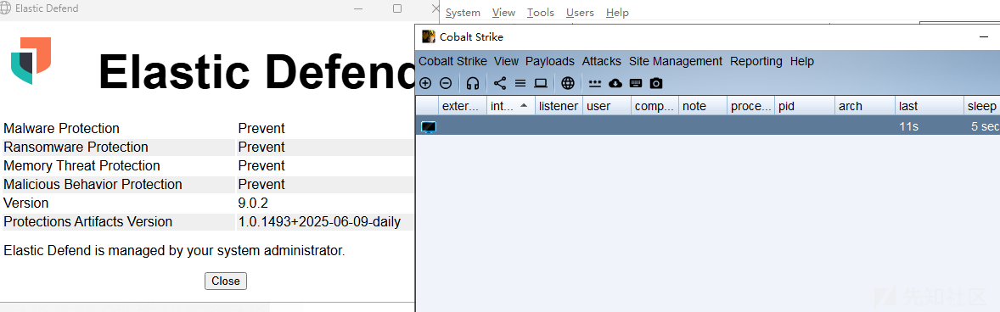

不过如果你选择DNS上线的话那么一切都会是很卡的，比如说像执行什么拖lsass回来解密，screentshot，特别是如果你把mode 模式切换成 A记录查询，那速度就更是慢 。

# 7.UrlDownloadToFileA

引用菊师傅在Kcon上的分享思路

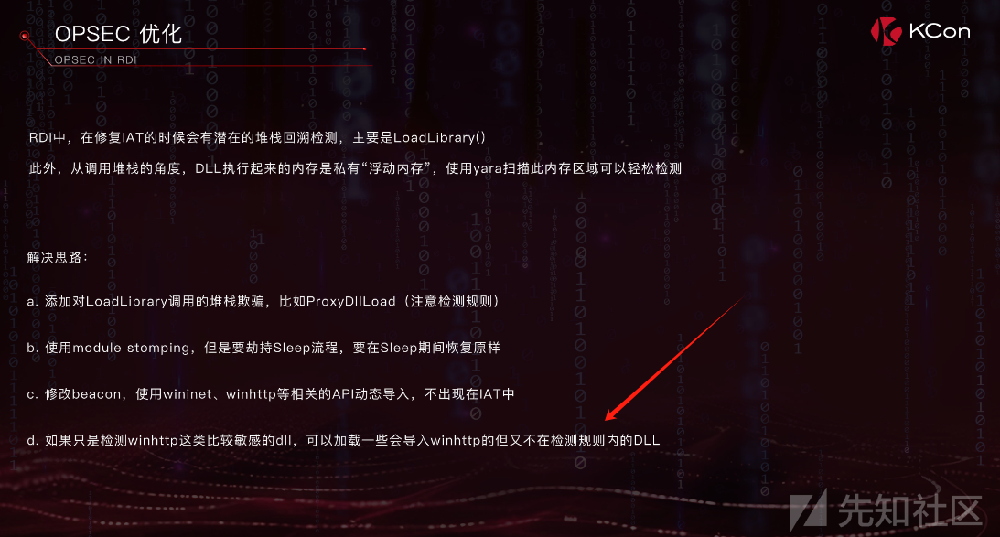

以及AtomLdr这个非常优秀的项目中的一些操作

```
https://github.com/NUL0x4C/AtomLdr/blob/main/AtomLdr/
```

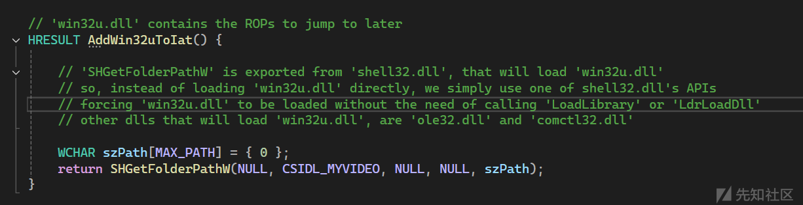

那么能发现一个 UrlMon.dll 里面 UrlDownloadToFile 这样一个API

```
HRESULT URLDownloadToFile(
LPUNKNOWN pCaller,
LPCTSTR szURL,
LPCTSTR szFileName,
DWORD dwReserved,
LPBINDSTATUSCALLBACK lpfnCB
);
```

下面通过图片我们来直观感受他的效果

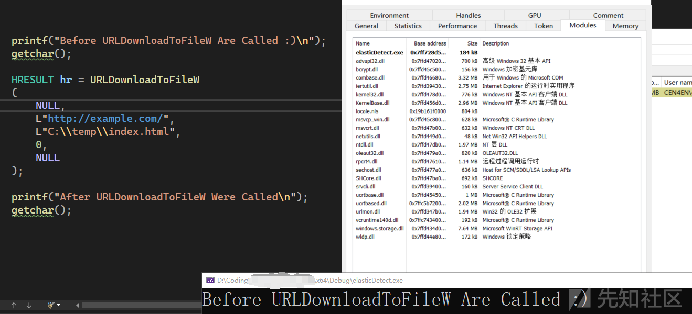

可以达到帮我们Load的效果

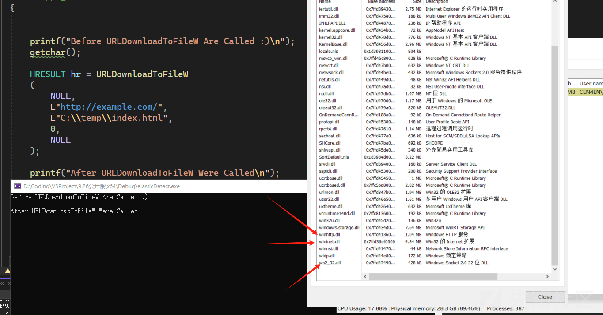

Elastic EDR 也并没有对我们的这一行为进行告警

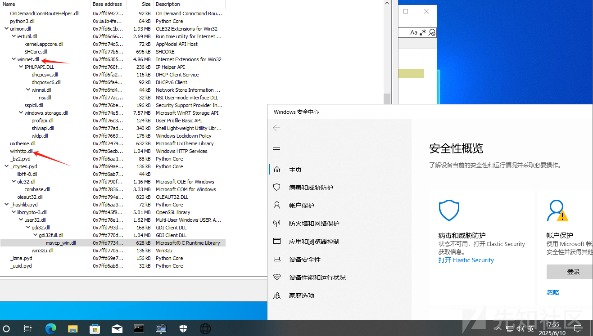

# 8.APC

回溯本源，我们对抗一直是在让调用链不会出现未备份存根的方向去发展，但是如果有未备份的内存加载难道真的必死吗？ 我们再去看Elastic EDR的规则 :P

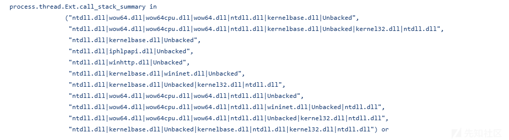

我们触发的规则很多时候都是这一条

```
 ntdll.dll					|kernelbase.dll|		Unbacked  
 ntdll!LdrLoadDll 	 LoadLibrary...     unBacked 
```

那有没有方法去绕过呢，这里提出一种思路 APC

受启发于FOLIAGE，于是就尝试让用APC 去帮我们Load(创建一条可告警线程，然后插APC) ，不出意外 ....


然后去试了EKKO ，ZIILAN的方法（不改动的话也是拦截的）于是就想能不能让当前线程直接处于可告警状态然后去执行APC函数

```
http://undocumented.ntinternals.net/index.html?page=UserMode%2FUndocumented%20Functions%2FAPC%2FNtTestAlert.html
 
NTSTATUS NTAPI  NtTestAlert();
```

这个函数会检测当前的APC队列，然后去call KiUserApcDispatcher.

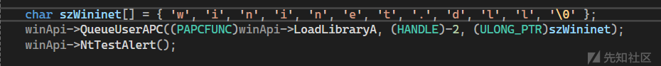

其中 (HANDLE) -2 就是当前线程的一种取巧 ，这时候我们再来看我们的线程调用栈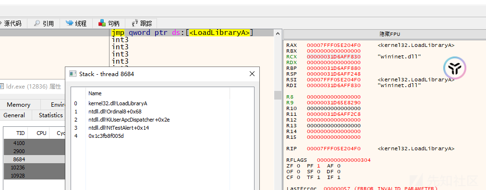

对比可以看见现在的线程调用栈即使存在未备份内存，但是也并不满足我们上面的任何一条栈回溯的规则

```
ntdll 			| kernelbase.dll |  kernel32.dll | ntdll | unbacked 

LdrLoadDll		 LoadLibrary...   LoadLibraryA   ....    unBacked 
 
```

下面我们去Elastic EDR 上进行测试，首先是我们的直接LoadLibrary的方法，我们会收到两个告警

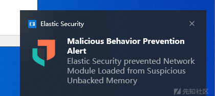

对于下面这个规则来说，也印证了我上面的那句话

**"下面的方法与思路还会触发其他的规则，但是只是对这一条规则的Bypass"**

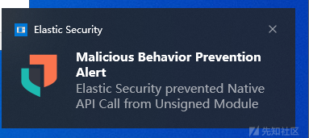

当我们对Loader进行修改之后，Elastic EDR 将不再对我们的加载问题进行告警

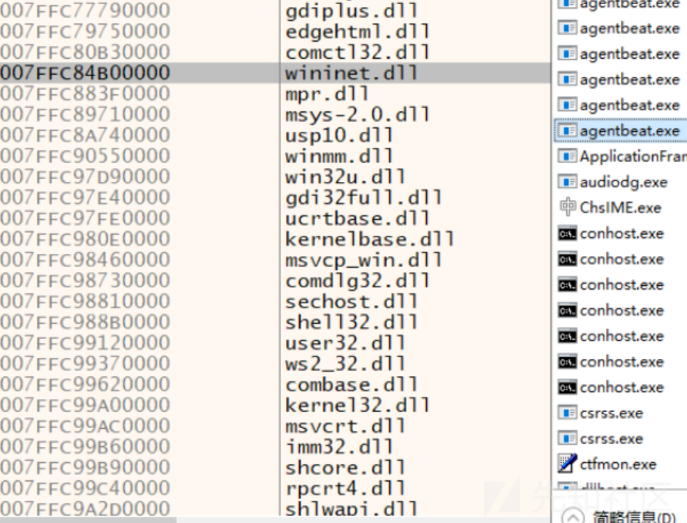

# 9.Signature

除了上面，我们继续看规则

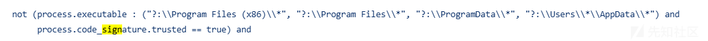

除了强行对抗，我们能注意到他的很多规则都有对应的排除项，我们能不能去对这些排序项进行利用呢，下图可以看见即使这个调用栈回溯确实是一个未备份的内存，但是Elastic EDR 也不会查杀

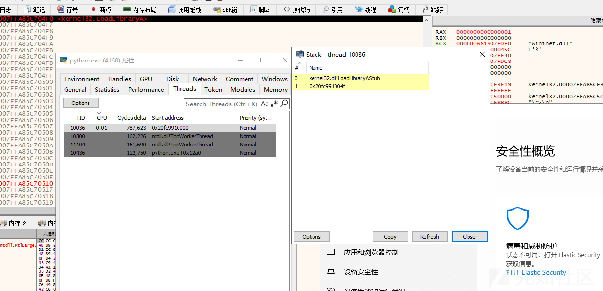

# That's The End ??

综上，我们用多种方式绕过了Elastic EDR的加载规则，但是你还要面对的是什么呢

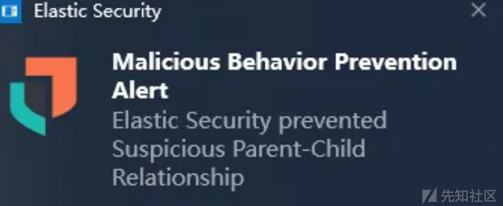

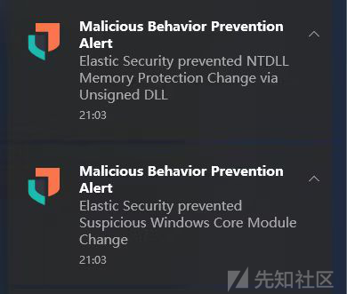

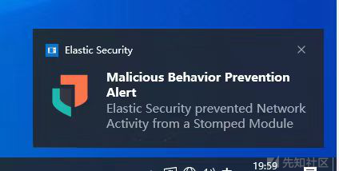 .........

综上等规则检测，Elastic还是检测的很猛的一款EDR，对行为非常严格，但是只要有检测的存在，就会有对抗与Bypass （毕竟Bypass可还远远不止上面的方法，剩下的留给读者探索）
